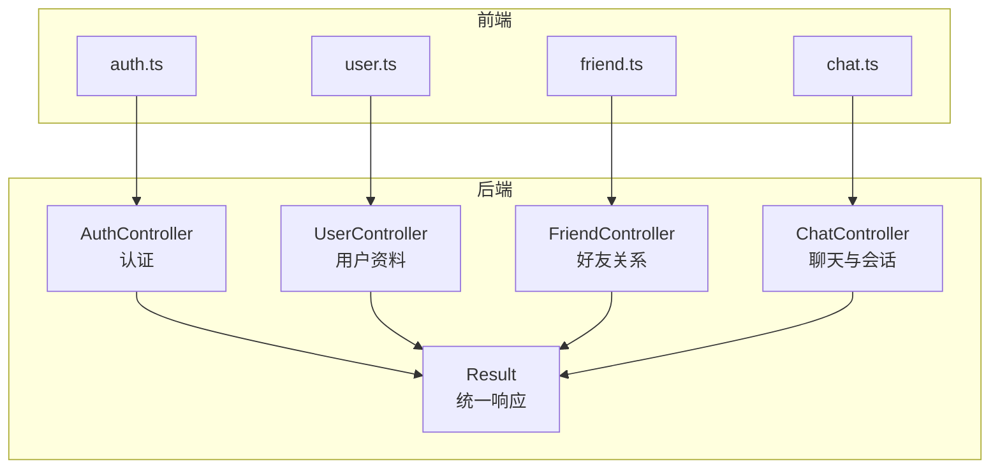
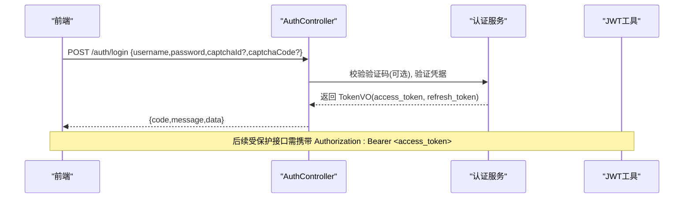
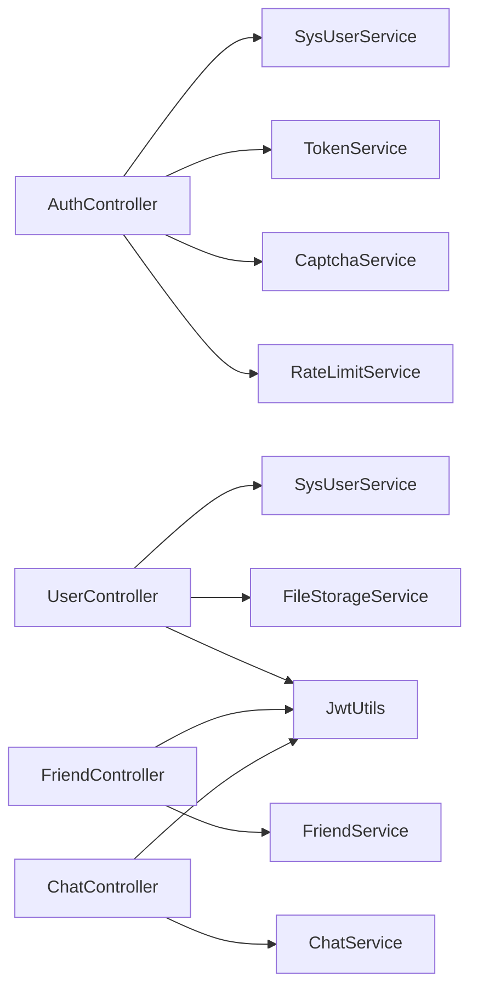

# API 接口文档

<cite>
**本文引用的文件**   
- [AuthController.java](file://linkx-server/src/main/java/com/linkx/server/controller/AuthController.java)
- [UserController.java](file://linkx-server/src/main/java/com/linkx/server/controller/UserController.java)
- [FriendController.java](file://linkx-server/src/main/java/com/linkx/server/controller/FriendController.java)
- [ChatController.java](file://linkx-server/src/main/java/com/linkx/server/controller/ChatController.java)
- [Result.java](file://linkx-server/src/main/java/com/linkx/server/common/Result.java)
- [LoginDTO.java](file://linkx-server/src/main/java/com/linkx/server/controller/dto/LoginDTO.java)
- [RegisterDTO.java](file://linkx-server/src/main/java/com/linkx/server/controller/dto/RegisterDTO.java)
- [RefreshTokenDTO.java](file://linkx-server/src/main/java/com/linkx/server/controller/dto/RefreshTokenDTO.java)
- [LogoutDTO.java](file://linkx-server/src/main/java/com/linkx/server/controller/dto/LogoutDTO.java)
- [UpdateProfileDTO.java](file://linkx-server/src/main/java/com/linkx/server/controller/dto/UpdateProfileDTO.java)
- [SendFriendRequestDTO.java](file://linkx-server/src/main/java/com/linkx/server/controller/dto/SendFriendRequestDTO.java)
- [SendMessageDTO.java](file://linkx-server/src/main/java/com/linkx/server/controller/dto/SendMessageDTO.java)
- [auth.ts](file://linkx-client/src/api/auth.ts)
- [user.ts](file://linkx-client/src/api/user.ts)
- [friend.ts](file://linkx-client/src/api/friend.ts)
- [chat.ts](file://linkx-client/src/api/chat.ts)
</cite>

## 目录
1. [简介](#简介)
2. [项目结构](#项目结构)
3. [核心组件](#核心组件)
4. [架构总览](#架构总览)
5. [详细接口说明](#详细接口说明)
6. [依赖分析](#依赖分析)
7. [性能考虑](#性能考虑)
8. [故障排查指南](#故障排查指南)
9. [结论](#结论)
10. [附录](#附录)

## 简介
本文件为 LinkX 的 RESTful API 参考文档，覆盖用户认证、聊天会话与消息、好友关系、用户资料等模块。文档包含每个接口的 HTTP 方法、URL 模式、请求参数、响应格式、错误码说明以及调用示例路径。同时提供 WebSocket 实时通信的消息协议、事件类型与连接管理说明，便于前端开发者与第三方集成使用。

## 项目结构
后端采用 Spring Boot 控制器分层：
- 控制器层：按业务域划分（认证、用户、好友、聊天）
- DTO/VO：用于请求校验与响应封装
- 统一响应体 Result<T>
- 客户端通过 TypeScript API 模块发起 HTTP 请求

图表来源
- [AuthController.java:1-84](file://linkx-server/src/main/java/com/linkx/server/controller/AuthController.java#L1-L84)
- [UserController.java:1-145](file://linkx-server/src/main/java/com/linkx/server/controller/UserController.java#L1-L145)
- [FriendController.java:1-96](file://linkx-server/src/main/java/com/linkx/server/controller/FriendController.java#L1-L96)
- [ChatController.java:1-72](file://linkx-server/src/main/java/com/linkx/server/controller/ChatController.java#L1-L72)
- [Result.java:1-95](file://linkx-server/src/main/java/com/linkx/server/common/Result.java#L1-L95)
- [auth.ts:1-25](file://linkx-client/src\api\auth.ts#L1-L25)
- [user.ts:1-60](file://linkx-client/src\api\user.ts#L1-L60)
- [friend.ts:1-43](file://linkx-client/src\api\friend.ts#L1-L43)
- [chat.ts:1-28](file://linkx-client/src\api\chat.ts#L1-L28)

章节来源
- [AuthController.java:1-84](file://linkx-server/src/main/java/com/linkx/server/controller/AuthController.java#L1-L84)
- [UserController.java:1-145](file://linkx-server/src/main/java/com/linkx/server/controller/UserController.java#L1-L145)
- [FriendController.java:1-96](file://linkx-server/src/main/java/com/linkx/server/controller/FriendController.java#L1-L96)
- [ChatController.java:1-72](file://linkx-server/src/main/java/com/linkx/server/controller/ChatController.java#L1-L72)
- [Result.java:1-95](file://linkx-server/src/main/java/com/linkx/server/common/Result.java#L1-L95)
- [auth.ts:1-25](file://linkx-client/src\api\auth.ts#L1-L25)
- [user.ts:1-60](file://linkx-client/src\api\user.ts#L1-L60)
- [friend.ts:1-43](file://linkx-client/src\api\friend.ts#L1-L43)
- [chat.ts:1-28](file://linkx-client/src\api\chat.ts#L1-L28)

## 核心组件
- 统一响应体 Result<T>
  - 字段：code（业务状态码）、message（提示信息）、data（业务数据）
  - 成功：code=200，message="success"
  - 失败：code 为非 200 的业务错误码，message 为错误描述
- 认证与鉴权
  - 登录/注册/刷新令牌/登出
  - 部分接口需携带 Authorization: Bearer <token>
- 业务控制器
  - 认证：/auth/*
  - 用户资料：/user/*
  - 好友：/friend/*
  - 聊天与会话：/chat/*

章节来源
- [Result.java:1-95](file://linkx-server/src/main/java/com/linkx/server/common/Result.java#L1-L95)
- [AuthController.java:1-84](file://linkx-server/src/main/java/com/linkx/server/controller/AuthController.java#L1-L84)
- [UserController.java:1-145](file://linkx-server/src/main/java/com/linkx/server/controller/UserController.java#L1-L145)
- [FriendController.java:1-96](file://linkx-server/src/main/java/com/linkx/server/controller/FriendController.java#L1-L96)
- [ChatController.java:1-72](file://linkx-server/src/main/java/com/linkx/server/controller/ChatController.java#L1-L72)

## 架构总览
下图展示典型登录流程中前后端交互与鉴权要点。

图表来源
- [AuthController.java:48-53](file://linkx-server/src/main/java/com/linkx/server/controller/AuthController.java#L48-L53)
- [LoginDTO.java:1-23](file://linkx-server/src/main/java/com/linkx/server/controller/dto/LoginDTO.java#L1-L23)
- [auth.ts:8-10](file://linkx-client/src\api\auth.ts#L8-L10)

## 详细接口说明

### 通用约定
- 基础路径
  - 后端：/auth、/user、/friend、/chat
- 认证方式
  - 需要认证的接口在请求头携带：Authorization: Bearer <access_token>
- 统一响应体 Result<T>
  - code：业务状态码（200 表示成功）
  - message：提示信息
  - data：业务数据（失败时为 null）

章节来源
- [Result.java:1-95](file://linkx-server/src/main/java/com/linkx/server/common/Result.java#L1-L95)

### 认证接口

#### 获取验证码
- 方法：GET
- URL：/auth/captcha
- 认证：否
- 请求参数：无
- 响应 data：CaptchaVO（包含验证码 ID 与图片信息）
- 错误码：见“错误码说明”
- 调用示例路径：[fetchCaptcha:4-6](file://linkx-client/src\api\auth.ts#L4-L6)

章节来源
- [AuthController.java:36-39](file://linkx-server/src/main/java/com/linkx/server/controller/AuthController.java#L36-L39)
- [auth.ts:4-6](file://linkx-client/src\api\auth.ts#L4-L6)

#### 用户注册
- 方法：POST
- URL：/auth/register
- 认证：否
- 请求体 RegisterDTO
  - username：必填，长度 4-32，仅字母数字下划线
  - password：必填，长度 8-64，须包含字母和数字
  - nickname：必填，长度 1-64
  - captchaId：可选
  - captchaCode：可选
- 响应 data：null
- 错误码：见“错误码说明”
- 调用示例路径：[register:12-14](file://linkx-client/src\api\auth.ts#L12-L14)

章节来源
- [AuthController.java:41-46](file://linkx-server/src/main/java/com/linkx/server/controller/AuthController.java#L41-L46)
- [RegisterDTO.java:1-28](file://linkx-server/src/main/java/com/linkx/server/controller/dto/RegisterDTO.java#L1-L28)
- [auth.ts:12-14](file://linkx-client/src\api\auth.ts#L12-L14)

#### 用户登录
- 方法：POST
- URL：/auth/login
- 认证：否
- 请求体 LoginDTO
  - username：必填，长度 4-32，仅字母数字下划线
  - password：必填，长度 8-64
  - captchaId：可选
  - captchaCode：可选
- 响应 data：TokenVO（包含 access_token、refresh_token）
- 错误码：见“错误码说明”
- 调用示例路径：[login:8-10](file://linkx-client/src\api\auth.ts#L8-L10)

章节来源
- [AuthController.java:48-53](file://linkx-server/src/main/java/com/linkx/server/controller/AuthController.java#L48-L53)
- [LoginDTO.java:1-23](file://linkx-server/src/main/java/com/linkx/server/controller/dto/LoginDTO.java#L1-L23)
- [auth.ts:8-10](file://linkx-client/src\api\auth.ts#L8-L10)

#### 刷新访问令牌
- 方法：POST
- URL：/auth/refresh
- 认证：否
- 请求体 RefreshTokenDTO
  - refreshToken：必填
- 响应 data：TokenVO（新的 access_token 与 refresh_token）
- 限流：基于 IP 的刷新频率限制
- 错误码：见“错误码说明”
- 调用示例路径：[refreshToken:16-18](file://linkx-client/src\api\auth.ts#L16-L18)

章节来源
- [AuthController.java:55-59](file://linkx-server/src/main/java/com/linkx/server/controller/AuthController.java#L55-L59)
- [RefreshTokenDTO.java:1-12](file://linkx-server/src/main/java/com/linkx/server/controller/dto/RefreshTokenDTO.java#L1-L12)
- [auth.ts:16-18](file://linkx-client/src\api\auth.ts#L16-L18)

#### 退出登录
- 方法：POST
- URL：/auth/logout
- 认证：否
- 请求体 LogoutDTO（可选）
  - refreshToken：可选
- 请求头 Authorization：可选（若携带则同时使当前 access_token 失效）
- 响应 data：null
- 错误码：见“错误码说明”
- 调用示例路径：[logout:20-24](file://linkx-client/src\api\auth.ts#L20-L24)

章节来源
- [AuthController.java:61-68](file://linkx-server/src/main/java/com/linkx/server/controller/AuthController.java#L61-L68)
- [LogoutDTO.java:1-9](file://linkx-server/src/main/java/com/linkx/server/controller/dto/LogoutDTO.java#L1-L9)
- [auth.ts:20-24](file://linkx-client/src\api\auth.ts#L20-L24)

### 用户资料接口

#### 获取当前用户信息
- 方法：GET
- URL：/user/me
- 认证：是（Bearer token）
- 响应 data：UserProfileVO（包含用户公开信息与创建时间等）
- 错误码：见“错误码说明”
- 调用示例路径：[getCurrentUser:27-29](file://linkx-client/src\api\user.ts#L27-L29)

章节来源
- [UserController.java:36-49](file://linkx-server/src/main/java/com/linkx/server/controller/UserController.java#L36-L49)
- [user.ts:27-29](file://linkx-client/src\api\user.ts#L27-L29)

#### 更新用户资料
- 方法：PUT
- URL：/user/profile
- 认证：是（Bearer token）
- 请求体 UpdateProfileDTO
  - nickname：可选，最大 50 字符
  - signature：可选，最大 200 字符
  - gender：可选，值为“男”或“女”
  - birthday：可选，毫秒时间戳
  - country/province/region：可选，最大 64 字符
- 响应 data：更新后的 UserProfileVO
- 错误码：见“错误码说明”
- 调用示例路径：[updateProfile:34-36](file://linkx-client/src\api\user.ts#L34-L36)

章节来源
- [UserController.java:54-65](file://linkx-server/src/main/java/com/linkx/server/controller/UserController.java#L54-L65)
- [UpdateProfileDTO.java:1-54](file://linkx-server/src/main/java/com/linkx/server/controller/dto/UpdateProfileDTO.java#L1-L54)
- [user.ts:34-36](file://linkx-client/src\api\user.ts#L34-L36)

#### 上传头像
- 方法：POST
- URL：/user/avatar
- 认证：是（Bearer token）
- 请求体：multipart/form-data
  - file：图片文件（支持常见图片格式，大小由服务端校验）
- 响应 data：头像 URL 字符串
- 错误码：见“错误码说明”
- 调用示例路径：[uploadAvatar:42-51](file://linkx-client/src\api\user.ts#L42-L51)

章节来源
- [UserController.java:70-100](file://linkx-server/src/main/java/com/linkx/server/controller/UserController.java#L70-L100)
- [user.ts:42-51](file://linkx-client/src\api\user.ts#L42-L51)

#### 获取用户公开资料
- 方法：GET
- URL：/user/{userId}/profile
- 认证：否
- 路径参数
  - userId：目标用户 ID
- 响应 data：UserProfileVO
- 错误码：见“错误码说明”
- 调用示例路径：[getUserProfile:57-59](file://linkx-client/src\api\user.ts#L57-L59)

章节来源
- [UserController.java:105-113](file://linkx-server/src/main/java/com/linkx/server/controller/UserController.java#L105-L113)
- [user.ts:57-59](file://linkx-client/src\api\user.ts#L57-L59)

### 好友接口

#### 搜索用户
- 方法：GET
- URL：/friend/search
- 认证：是（Bearer token）
- 查询参数
  - keyword：搜索关键词
- 响应 data：UserSearchVO[]
- 错误码：见“错误码说明”
- 调用示例路径：[searchUsers:10-14](file://linkx-client/src\api\friend.ts#L10-L14)

章节来源
- [FriendController.java:26-32](file://linkx-server/src/main/java/com/linkx/server/controller/FriendController.java#L26-L32)
- [friend.ts:10-14](file://linkx-client/src\api\friend.ts#L10-L14)

#### 发送好友申请
- 方法：POST
- URL：/friend/request
- 认证：是（Bearer token）
- 请求体 SendFriendRequestDTO
  - username：对方账号，长度 4-32
  - message：可选，验证信息，最大 255 字符
- 响应 data：null
- 错误码：见“错误码说明”
- 调用示例路径：[sendFriendRequest:16-18](file://linkx-client/src\api\friend.ts#L16-L18)

章节来源
- [FriendController.java:34-41](file://linkx-server/src/main/java/com/linkx/server/controller/FriendController.java#L34-L41)
- [SendFriendRequestDTO.java:1-17](file://linkx-server/src/main/java/com/linkx/server/controller/dto/SendFriendRequestDTO.java#L1-L17)
- [friend.ts:16-18](file://linkx-client/src\api\friend.ts#L16-L18)

#### 查看收到的申请列表
- 方法：GET
- URL：/friend/requests/incoming
- 认证：是（Bearer token）
- 响应 data：FriendRequestVO[]
- 错误码：见“错误码说明”
- 调用示例路径：[listIncomingRequests:20-22](file://linkx-client/src\api\friend.ts#L20-L22)

章节来源
- [FriendController.java:43-47](file://linkx-server/src/main/java/com/linkx/server/controller/FriendController.java#L43-L47)
- [friend.ts:20-22](file://linkx-client/src\api\friend.ts#L20-L22)

#### 查看发出的申请列表
- 方法：GET
- URL：/friend/requests/outgoing
- 认证：是（Bearer token）
- 响应 data：FriendRequestVO[]
- 错误码：见“错误码说明”
- 调用示例路径：[listOutgoingRequests:24-26](file://linkx-client/src\api\friend.ts#L24-L26)

章节来源
- [FriendController.java:49-53](file://linkx-server/src/main/java/com/linkx/server/controller/FriendController.java#L49-L53)
- [friend.ts:24-26](file://linkx-client/src\api\friend.ts#L24-L26)

#### 接受好友申请
- 方法：POST
- URL：/friend/requests/{id}/accept
- 认证：是（Bearer token）
- 路径参数
  - id：申请 ID（整数）
- 响应 data：null
- 错误码：见“错误码说明”
- 调用示例路径：[acceptFriendRequest:28-30](file://linkx-client/src\api\friend.ts#L28-L30)

章节来源
- [FriendController.java:55-62](file://linkx-server/src/main/java/com/linkx/server/controller/FriendController.java#L55-L62)
- [friend.ts:28-30](file://linkx-client/src\api\friend.ts#L28-L30)

#### 拒绝好友申请
- 方法：POST
- URL：/friend/requests/{id}/reject
- 认证：是（Bearer token）
- 路径参数
  - id：申请 ID（整数）
- 响应 data：null
- 错误码：见“错误码说明”
- 调用示例路径：[rejectFriendRequest:32-34](file://linkx-client/src\api\friend.ts#L32-L34)

章节来源
- [FriendController.java:64-71](file://linkx-server/src/main/java/com/linkx/server/controller/FriendController.java#L64-L71)
- [friend.ts:32-34](file://linkx-client/src\api\friend.ts#L32-L34)

#### 列出好友列表
- 方法：GET
- URL：/friend/list
- 认证：是（Bearer token）
- 响应 data：FriendItemVO[]
- 错误码：见“错误码说明”
- 调用示例路径：[listFriends:36-38](file://linkx-client/src\api\friend.ts#L36-L38)

章节来源
- [FriendController.java:73-77](file://linkx-server/src/main/java/com/linkx/server/controller/FriendController.java#L73-L77)
- [friend.ts:36-38](file://linkx-client/src\api\friend.ts#L36-L38)

#### 删除好友
- 方法：DELETE
- URL：/friend/{friendId}
- 认证：是（Bearer token）
- 路径参数
  - friendId：好友 ID（整数）
- 响应 data：null
- 错误码：见“错误码说明”
- 调用示例路径：[deleteFriend:40-42](file://linkx-client/src\api\friend.ts#L40-L42)

章节来源
- [FriendController.java:79-86](file://linkx-server/src/main/java/com/linkx/server/controller/FriendController.java#L79-L86)
- [friend.ts:40-42](file://linkx-client/src\api\friend.ts#L40-L42)

### 聊天与会话接口

#### 列出会话列表
- 方法：GET
- URL：/chat/sessions
- 认证：是（Bearer token）
- 响应 data：ConversationVO[]
- 错误码：见“错误码说明”
- 调用示例路径：[listSessions:5-7](file://linkx-client/src\api\chat.ts#L5-L7)

章节来源
- [ChatController.java:30-34](file://linkx-server/src/main/java/com/linkx/server/controller/ChatController.java#L30-L34)
- [chat.ts:5-7](file://linkx-client/src\api\chat.ts#L5-L7)

#### 打开私聊会话
- 方法：POST
- URL：/chat/private/{friendId}
- 认证：是（Bearer token）
- 路径参数
  - friendId：好友 ID（整数）
- 响应 data：ConversationVO
- 错误码：见“错误码说明”
- 调用示例路径：[openPrivateChat:9-11](file://linkx-client/src\api\chat.ts#L9-L11)

章节来源
- [ChatController.java:36-42](file://linkx-server/src/main/java/com/linkx/server/controller/ChatController.java#L36-L42)
- [chat.ts:9-11](file://linkx-client/src\api\chat.ts#L9-L11)

#### 分页拉取历史消息
- 方法：GET
- URL：/chat/sessions/{conversationId}/messages
- 认证：是（Bearer token）
- 路径参数
  - conversationId：会话 ID（整数）
- 查询参数
  - before：可选，上一页最后一条消息 ID
  - limit：默认 50，每页条数
- 响应 data：MessageVO[]
- 错误码：见“错误码说明”
- 调用示例路径：[listMessages:13-17](file://linkx-client/src\api\chat.ts#L13-L17)

章节来源
- [ChatController.java:44-53](file://linkx-server/src/main/java/com/linkx/server/controller/ChatController.java#L44-L53)
- [chat.ts:13-17](file://linkx-client/src\api\chat.ts#L13-L17)

#### 上传聊天文件
- 方法：POST
- URL：/chat/sessions/{conversationId}/upload
- 认证：是（Bearer token）
- 路径参数
  - conversationId：会话 ID（整数）
- 请求体：multipart/form-data
  - file：文件
- 响应 data：ChatFileUploadVO（包含文件元信息与下载链接等）
- 错误码：见“错误码说明”
- 调用示例路径：[uploadChatFile:19-27](file://linkx-client/src\api\chat.ts#L19-L27)

章节来源
- [ChatController.java:55-62](file://linkx-server/src/main/java/com/linkx/server/controller/ChatController.java#L55-L62)
- [chat.ts:19-27](file://linkx-client/src\api\chat.ts#L19-L27)

### WebSocket 实时通信协议
- 连接建立
  - 连接地址：ws(s)://{host}:{port}/ws/chat
  - 认证：在握手阶段通过查询参数传递 access_token，例如：?token=<access_token>
- 帧格式
  - 所有消息均为 JSON 文本帧
  - 公共字段
    - type：消息类型（事件标识）
    - payload：业务载荷（随 type 变化）
    - ts：服务器时间戳（毫秒）
- 客户端→服务端事件
  - join_conversation：加入会话
    - payload.conversationId：会话 ID
  - send_message：发送消息
    - payload.content：消息内容
    - payload.msgType：消息类型（如 text、image、file、voice、red_packet、data_card）
    - payload.clientMsgId：客户端唯一消息 ID（幂等去重）
    - payload.fileName/fileSize/fileUrl：当 msgType=file 时提供
  - leave_conversation：离开会话
- 服务端→客户端事件
  - message_received：新消息推送
    - payload.message：消息对象（含 id、senderId、conversationId、msgType、content、附件信息等）
  - conversation_updated：会话状态更新（如未读数）
  - error：错误通知
    - payload.code：业务错误码
    - payload.message：错误描述
- 连接管理
  - 心跳：客户端定期发送 ping，服务端回复 pong
  - 断线重连：指数退避策略，最大重试次数可配置
  - 鉴权失败：服务端关闭连接并返回错误事件
- 错误处理
  - 网络异常：触发 onerror，进入重连流程
  - 业务错误：收到 error 事件后提示用户或降级处理

章节来源
- [ImWebSocketServer.java](file://linkx-server/src/main/java/com/linkx/server/im/ImWebSocketServer.java)
- [ImWebSocketChannelInitializer.java](file://linkx-server/src/main/java/com/linkx/server/im/ImWebSocketChannelInitializer.java)
- [ImWebSocketAuthHandler.java](file://linkx-server/src/main/java/com/linkx/server/im/ImWebSocketAuthHandler.java)
- [ImWebSocketMessageHandler.java](file://linkx-server/src/main/java/com/linkx/server/im/ImWebSocketMessageHandler.java)
- [ImWsFrame.java](file://linkx-server/src/main/java/com/linkx/server/im/ImWsFrame.java)

## 依赖分析
- 控制器依赖
  - AuthController 依赖 SysUserService、TokenService、CaptchaService、RateLimitService
  - UserController 依赖 SysUserService、FileStorageService、JwtUtils
  - FriendController 依赖 FriendService、JwtUtils
  - ChatController 依赖 ChatService、JwtUtils
- 统一响应
  - 所有控制器均返回 Result<T>
- 前端 API 映射
  - auth.ts → /auth/*
  - user.ts → /user/*
  - friend.ts → /friend/*
  - chat.ts → /chat/*

图表来源
- [AuthController.java:1-84](file://linkx-server/src/main/java/com/linkx/server/controller/AuthController.java#L1-L84)
- [UserController.java:1-145](file://linkx-server/src/main/java/com/linkx/server/controller/UserController.java#L1-L145)
- [FriendController.java:1-96](file://linkx-server/src/main/java/com/linkx/server/controller/FriendController.java#L1-L96)
- [ChatController.java:1-72](file://linkx-server/src/main/java/com/linkx/server/controller/ChatController.java#L1-L72)

章节来源
- [AuthController.java:1-84](file://linkx-server/src/main/java/com/linkx/server/controller/AuthController.java#L1-L84)
- [UserController.java:1-145](file://linkx-server/src/main/java/com/linkx/server/controller/UserController.java#L1-L145)
- [FriendController.java:1-96](file://linkx-server/src/main/java/com/linkx/server/controller/FriendController.java#L1-L96)
- [ChatController.java:1-72](file://linkx-server/src/main/java/com/linkx/server/controller/ChatController.java#L1-L72)

## 性能考虑
- 分页与限流
  - 消息拉取支持 before+limit 分页，避免一次性加载大量数据
  - 刷新令牌接口具备基于 IP 的速率限制，防止滥用
- 文件上传
  - 头像与聊天文件采用分片/直传建议（结合 MinIO），减少网关压力
- 缓存
  - 会话列表与好友列表可引入本地缓存与增量更新
- 鉴权开销
  - 对高频接口可启用短 TTL 的 access_token 配合 refresh_token 机制

## 故障排查指南
- 常见错误码
  - 400：参数校验失败或无效 ID
  - 401：未登录或令牌无效
  - 403：权限不足
  - 404：资源不存在
  - 429：请求过于频繁（限流）
  - 500：服务器内部错误
- 定位步骤
  - 检查请求头是否携带正确的 Authorization
  - 核对请求体字段是否符合 DTO 校验规则
  - 查看 Result.message 中的具体错误描述
  - 对于文件上传，确认 Content-Type 与字段名正确
- 日志与审计
  - 登录审计记录可用于追踪异常登录行为
  - 全局异常处理器统一捕获并返回标准错误体

章节来源
- [Result.java:1-95](file://linkx-server/src/main/java/com/linkx/server/common/Result.java#L1-L95)
- [GlobalExceptionHandler.java](file://linkx-server/src/main/java/com/linkx/server/exception/GlobalExceptionHandler.java)
- [CustomException.java](file://linkx-server/src/main/java/com/linkx/server/exception/CustomException.java)
- [SysLoginAuditMapper.java](file://linkx-server/src/main/java/com/linkx/server/mapper/SysLoginAuditMapper.java)

## 结论
本文档提供了 LinkX 后端 RESTful API 的完整规范，涵盖认证、用户资料、好友关系与聊天会话等核心能力，并补充了 WebSocket 实时通信协议与连接管理要点。前端可直接依据此文档进行对接；第三方集成亦可据此实现稳定可靠的交互。

## 附录

### 请求与响应示例路径
- 认证
  - 获取验证码：[fetchCaptcha:4-6](file://linkx-client/src\api\auth.ts#L4-L6)
  - 登录：[login:8-10](file://linkx-client/src\api\auth.ts#L8-L10)
  - 注册：[register:12-14](file://linkx-client/src\api\auth.ts#L12-L14)
  - 刷新令牌：[refreshToken:16-18](file://linkx-client/src\api\auth.ts#L16-L18)
  - 退出登录：[logout:20-24](file://linkx-client/src\api\auth.ts#L20-L24)
- 用户资料
  - 获取当前用户：[getCurrentUser:27-29](file://linkx-client/src\api\user.ts#L27-L29)
  - 更新资料：[updateProfile:34-36](file://linkx-client/src\api\user.ts#L34-L36)
  - 上传头像：[uploadAvatar:42-51](file://linkx-client/src\api\user.ts#L42-L51)
  - 公开资料：[getUserProfile:57-59](file://linkx-client/src\api\user.ts#L57-L59)
- 好友
  - 搜索用户：[searchUsers:10-14](file://linkx-client/src\api\friend.ts#L10-L14)
  - 发送申请：[sendFriendRequest:16-18](file://linkx-client/src\api\friend.ts#L16-L18)
  - 接收列表：[listIncomingRequests:20-22](file://linkx-client/src\api\friend.ts#L20-L22)
  - 发出列表：[listOutgoingRequests:24-26](file://linkx-client/src\api\friend.ts#L24-L26)
  - 接受申请：[acceptFriendRequest:28-30](file://linkx-client/src\api\friend.ts#L28-L30)
  - 拒绝申请：[rejectFriendRequest:32-34](file://linkx-client/src\api\friend.ts#L32-L34)
  - 好友列表：[listFriends:36-38](file://linkx-client/src\api\friend.ts#L36-L38)
  - 删除好友：[deleteFriend:40-42](file://linkx-client/src\api\friend.ts#L40-L42)
- 聊天
  - 会话列表：[listSessions:5-7](file://linkx-client/src\api\chat.ts#L5-L7)
  - 打开私聊：[openPrivateChat:9-11](file://linkx-client/src\api\chat.ts#L9-L11)
  - 历史消息：[listMessages:13-17](file://linkx-client/src\api\chat.ts#L13-L17)
  - 上传文件：[uploadChatFile:19-27](file://linkx-client/src\api\chat.ts#L19-L27)