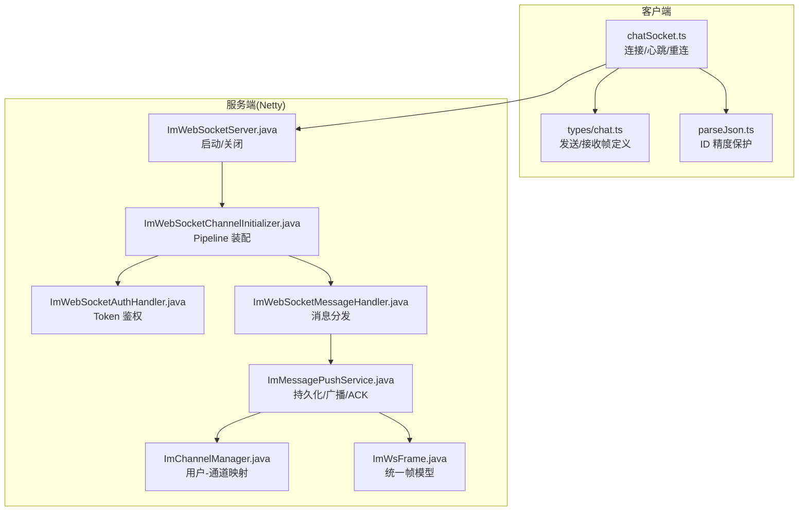
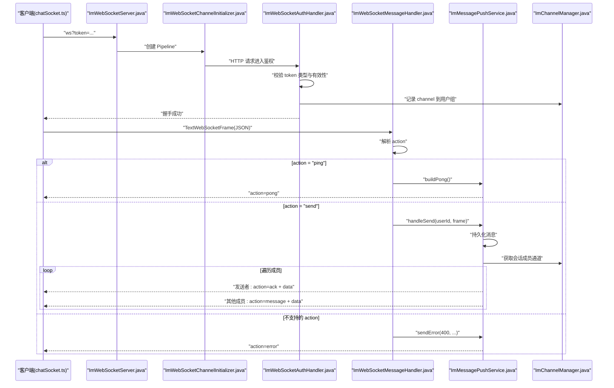
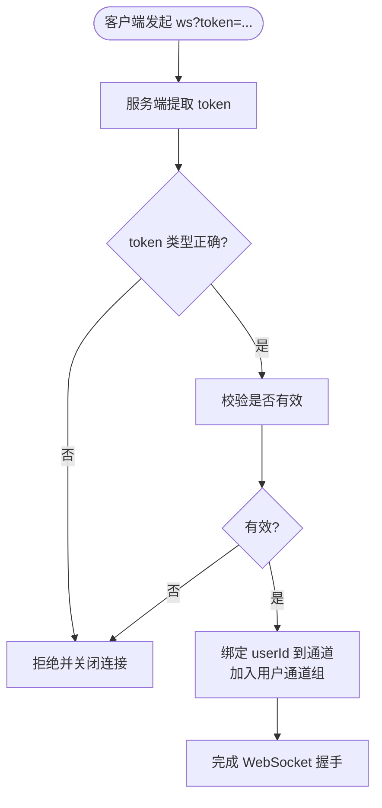
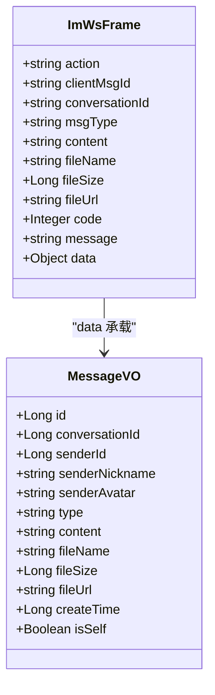
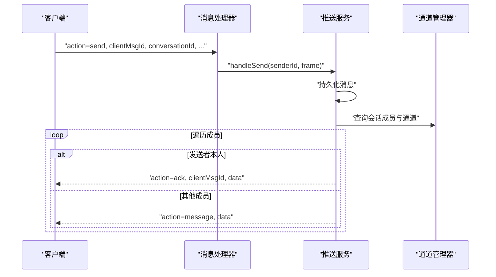
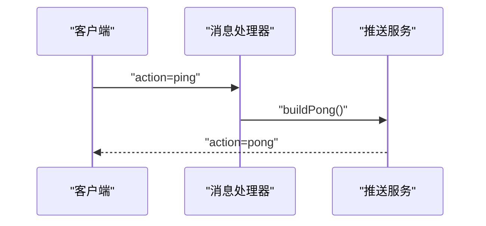
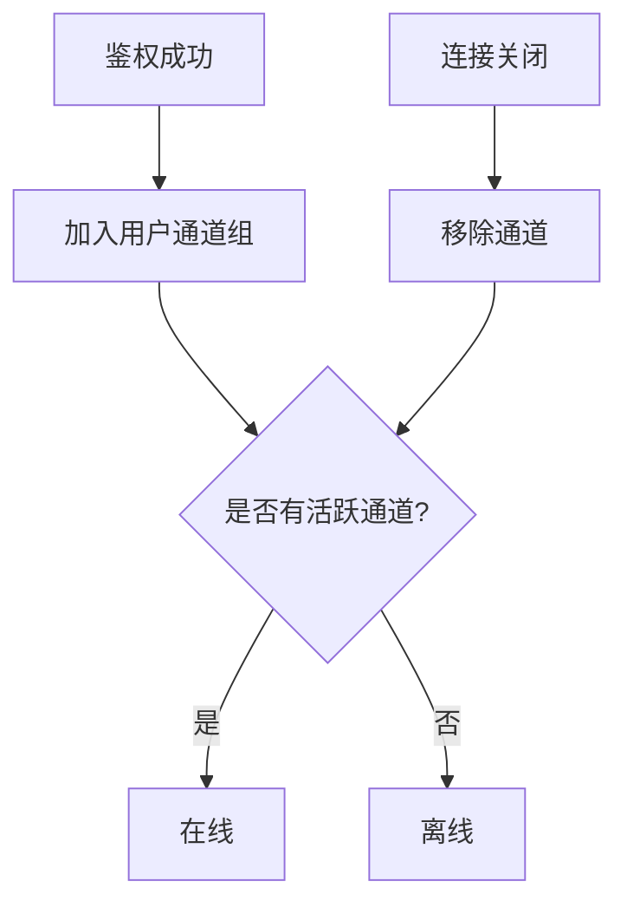
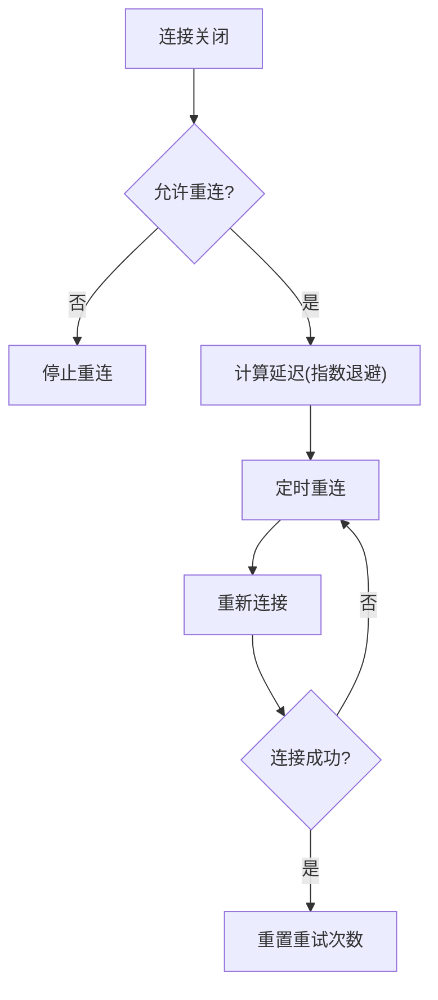
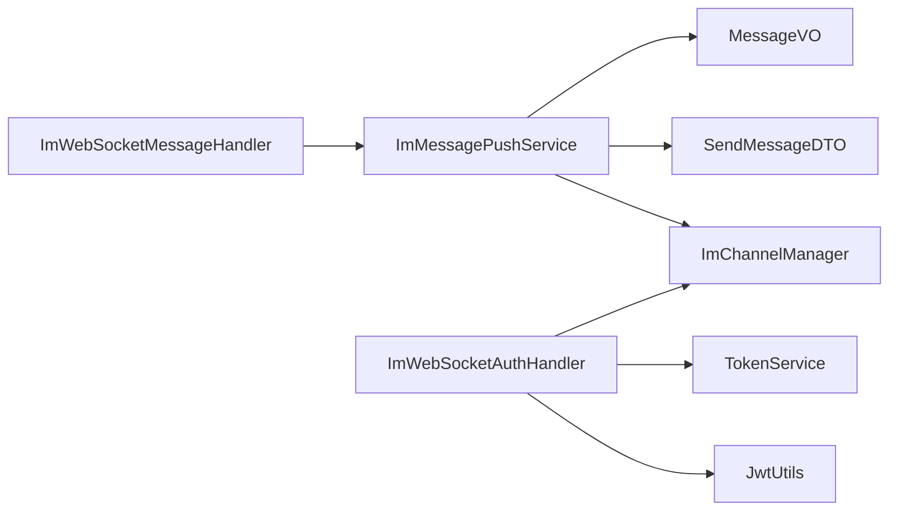

# WebSocket 实时通信

<cite>
**本文引用的文件**   
- [ImWebSocketServer.java](file://linkx-server/src/main/java/com/linkx/server/im/ImWebSocketServer.java)
- [ImWebSocketChannelInitializer.java](file://linkx-server/src/main/java/com/linkx/server/im/ImWebSocketChannelInitializer.java)
- [ImWebSocketAuthHandler.java](file://linkx-server/src/main/java/com/linkx/server/im/ImWebSocketAuthHandler.java)
- [ImWebSocketMessageHandler.java](file://linkx-server/src/main/java/com/linkx/server/im/ImWebSocketMessageHandler.java)
- [ImWsFrame.java](file://linkx-server/src/main/java/com/linkx/server/im/ImWsFrame.java)
- [ImChannelManager.java](file://linkx-server/src/main/java/com/linkx/server/im/ImChannelManager.java)
- [ImMessagePushService.java](file://linkx-server/src/main/java/com/linkx/server/im/ImMessagePushService.java)
- [SendMessageDTO.java](file://linkx-server/src/main/java/com/linkx/server/controller/dto/SendMessageDTO.java)
- [MessageVO.java](file://linkx-server/src/main/java/com/linkx/server/controller/vo/MessageVO.java)
- [chatSocket.ts](file://linkx-client/src/utils/chatSocket.ts)
- [chat.ts](file://linkx-client/src/types/chat.ts)
- [parseJson.ts](file://linkx-client/src/utils/parseJson.ts)
</cite>

## 目录
1. [简介](#简介)
2. [项目结构](#项目结构)
3. [核心组件](#核心组件)
4. [架构总览](#架构总览)
5. [详细组件分析](#详细组件分析)
6. [依赖关系分析](#依赖关系分析)
7. [性能与扩展性](#性能与扩展性)
8. [客户端集成指南](#客户端集成指南)
9. [调试与排错](#调试与排错)
10. [结论](#结论)

## 简介
本文件为 LinkX 的 WebSocket 实时通信系统 API 文档，覆盖连接建立、消息帧格式、事件类型、连接管理、心跳机制、错误处理、重连策略、广播与在线状态同步等。同时提供客户端集成示例、调试建议与常见问题解决方案，帮助开发者快速接入并稳定运行。

## 项目结构
服务端基于 Netty 实现独立 WebSocket 服务，负责鉴权、消息路由与推送；客户端通过原生 WebSocket 连接，内置心跳与指数退避重连，并对大整数 ID 做精度保护。

图表来源
- [ImWebSocketServer.java:1-82](file://linkx-server/src/main/java/com/linkx/server/im/ImWebSocketServer.java#L1-L82)
- [ImWebSocketChannelInitializer.java:1-38](file://linkx-server/src/main/java/com/linkx/server/im/ImWebSocketChannelInitializer.java#L1-L38)
- [ImWebSocketAuthHandler.java:1-81](file://linkx-server/src/main/java/com/linkx/server/im/ImWebSocketAuthHandler.java#L1-L81)
- [ImWebSocketMessageHandler.java:1-62](file://linkx-server/src/main/java/com/linkx/server/im/ImWebSocketMessageHandler.java#L1-L62)
- [ImMessagePushService.java:1-136](file://linkx-server/src/main/java/com/linkx/server/im/ImMessagePushService.java#L1-L136)
- [ImChannelManager.java:1-41](file://linkx-server/src/main/java/com/linkx/server/im/ImChannelManager.java#L1-L41)
- [ImWsFrame.java:1-20](file://linkx-server/src/main/java/com/linkx/server/im/ImWsFrame.java#L1-L20)
- [chatSocket.ts:1-144](file://linkx-client/src/utils/chatSocket.ts#L1-L144)
- [chat.ts:1-57](file://linkx-client/src/types/chat.ts#L1-L57)
- [parseJson.ts:1-28](file://linkx-client/src/utils/parseJson.ts#L1-L28)

章节来源
- [ImWebSocketServer.java:1-82](file://linkx-server/src/main/java/com/linkx/server/im/ImWebSocketServer.java#L1-L82)
- [ImWebSocketChannelInitializer.java:1-38](file://linkx-server/src/main/java/com/linkx/server/im/ImWebSocketChannelInitializer.java#L1-L38)
- [ImWebSocketAuthHandler.java:1-81](file://linkx-server/src/main/java/com/linkx/server/im/ImWebSocketAuthHandler.java#L1-L81)
- [ImWebSocketMessageHandler.java:1-62](file://linkx-server/src/main/java/com/linkx/server/im/ImWebSocketMessageHandler.java#L1-L62)
- [ImMessagePushService.java:1-136](file://linkx-server/src/main/java/com/linkx/server/im/ImMessagePushService.java#L1-L136)
- [ImChannelManager.java:1-41](file://linkx-server/src/main/java/com/linkx/server/im/ImChannelManager.java#L1-L41)
- [ImWsFrame.java:1-20](file://linkx-server/src/main/java/com/linkx/server/im/ImWsFrame.java#L1-L20)
- [chatSocket.ts:1-144](file://linkx-client/src/utils/chatSocket.ts#L1-L144)
- [chat.ts:1-57](file://linkx-client/src/types/chat.ts#L1-L57)
- [parseJson.ts:1-28](file://linkx-client/src/utils/parseJson.ts#L1-L28)

## 核心组件
- 服务端
  - ImWebSocketServer：独立 Netty 服务启动与优雅关闭，端口与路径来自配置。
  - ImWebSocketChannelInitializer：装配 HTTP 编解码、聚合器、鉴权、协议升级与消息处理器。
  - ImWebSocketAuthHandler：从查询参数提取 token，校验类型与有效性，写入用户上下文并维护在线通道。
  - ImWebSocketMessageHandler：解析文本帧，按 action 分发到业务处理（ping/send），异常统一返回 error。
  - ImMessagePushService：将消息持久化后，向会话成员广播；对发送者回 ack，对其他成员发 message；封装 pong/error。
  - ImChannelManager：维护 userId -> ChannelGroup 的映射，支持在线判断与批量推送。
  - ImWsFrame：统一的 JSON 帧结构，包含 action、data、code/message 等字段。
- 客户端
  - chatSocket.ts：连接管理、心跳 ping/pong、指数退避重连、错误回调、发送 send。
  - types/chat.ts：客户端发送 payload 与接收帧的类型定义。
  - parseJson.ts：针对长整型 ID 的精度保护，避免 JS 丢失精度。

章节来源
- [ImWebSocketServer.java:1-82](file://linkx-server/src/main/java/com/linkx/server/im/ImWebSocketServer.java#L1-L82)
- [ImWebSocketChannelInitializer.java:1-38](file://linkx-server/src/main/java/com/linkx/server/im/ImWebSocketChannelInitializer.java#L1-L38)
- [ImWebSocketAuthHandler.java:1-81](file://linkx-server/src/main/java/com/linkx/server/im/ImWebSocketAuthHandler.java#L1-L81)
- [ImWebSocketMessageHandler.java:1-62](file://linkx-server/src/main/java/com/linkx/server/im/ImWebSocketMessageHandler.java#L1-L62)
- [ImMessagePushService.java:1-136](file://linkx-server/src/main/java/com/linkx/server/im/ImMessagePushService.java#L1-L136)
- [ImChannelManager.java:1-41](file://linkx-server/src/main/java/com/linkx/server/im/ImChannelManager.java#L1-L41)
- [ImWsFrame.java:1-20](file://linkx-server/src/main/java/com/linkx/server/im/ImWsFrame.java#L1-L20)
- [chatSocket.ts:1-144](file://linkx-client/src/utils/chatSocket.ts#L1-L144)
- [chat.ts:1-57](file://linkx-client/src/types/chat.ts#L1-L57)
- [parseJson.ts:1-28](file://linkx-client/src/utils/parseJson.ts#L1-L28)

## 架构总览
下图展示了从客户端发起连接到服务端处理、广播与回应的完整链路。

图表来源
- [ImWebSocketServer.java:1-82](file://linkx-server/src/main/java/com/linkx/server/im/ImWebSocketServer.java#L1-L82)
- [ImWebSocketChannelInitializer.java:1-38](file://linkx-server/src/main/java/com/linkx/server/im/ImWebSocketChannelInitializer.java#L1-L38)
- [ImWebSocketAuthHandler.java:1-81](file://linkx-server/src/main/java/com/linkx/server/im/ImWebSocketAuthHandler.java#L1-L81)
- [ImWebSocketMessageHandler.java:1-62](file://linkx-server/src/main/java/com/linkx/server/im/ImWebSocketMessageHandler.java#L1-L62)
- [ImMessagePushService.java:1-136](file://linkx-server/src/main/java/com/linkx/server/im/ImMessagePushService.java#L1-L136)
- [ImChannelManager.java:1-41](file://linkx-server/src/main/java/com/linkx/server/im/ImChannelManager.java#L1-L41)

## 详细组件分析

### 连接建立与鉴权
- 客户端在 URL 中附带 token 查询参数进行鉴权。
- 服务端在握手前拦截 HTTP 请求，校验 token 类型必须为访问令牌且处于有效状态，成功后将 userId 写入通道属性并加入用户通道组。
- 鉴权失败直接拒绝并关闭连接。

图表来源
- [ImWebSocketAuthHandler.java:1-81](file://linkx-server/src/main/java/com/linkx/server/im/ImWebSocketAuthHandler.java#L1-L81)
- [ImChannelManager.java:1-41](file://linkx-server/src/main/java/com/linkx/server/im/ImChannelManager.java#L1-L41)

章节来源
- [ImWebSocketAuthHandler.java:1-81](file://linkx-server/src/main/java/com/linkx/server/im/ImWebSocketAuthHandler.java#L1-L81)
- [ImChannelManager.java:1-41](file://linkx-server/src/main/java/com/linkx/server/im/ImChannelManager.java#L1-L41)

### 消息帧格式与事件类型
- 统一帧模型使用 ImWsFrame，包含 action、clientMsgId、conversationId、msgType、content、fileName、fileSize、fileUrl、code、message、data 等字段。
- 客户端发送动作：
  - action="send"：携带 clientMsgId、conversationId、msgType 及内容或文件信息。
- 服务端响应动作：
  - action="ack"：对发送者的确认，包含 data 与 clientMsgId。
  - action="message"：对会话其他成员的推送，包含 data。
  - action="pong"：心跳响应。
  - action="error"：错误码与消息。

图表来源
- [ImWsFrame.java:1-20](file://linkx-server/src/main/java/com/linkx/server/im/ImWsFrame.java#L1-L20)
- [MessageVO.java:1-32](file://linkx-server/src/main/java/com/linkx/server/controller/vo/MessageVO.java#L1-L32)

章节来源
- [ImWsFrame.java:1-20](file://linkx-server/src/main/java/com/linkx/server/im/ImWsFrame.java#L1-L20)
- [MessageVO.java:1-32](file://linkx-server/src/main/java/com/linkx/server/controller/vo/MessageVO.java#L1-L32)
- [chat.ts:1-57](file://linkx-client/src/types/chat.ts#L1-L57)

### 消息处理流程
- 客户端发送 send 帧后，服务端持久化消息，然后：
  - 对发送者返回 ack，包含原始 clientMsgId 与数据。
  - 对会话其他成员返回 message，包含数据。
- 若缺少必要字段或 action 不支持，返回 error。

图表来源
- [ImWebSocketMessageHandler.java:1-62](file://linkx-server/src/main/java/com/linkx/server/im/ImWebSocketMessageHandler.java#L1-L62)
- [ImMessagePushService.java:1-136](file://linkx-server/src/main/java/com/linkx/server/im/ImMessagePushService.java#L1-L136)
- [ImChannelManager.java:1-41](file://linkx-server/src/main/java/com/linkx/server/im/ImChannelManager.java#L1-L41)

章节来源
- [ImWebSocketMessageHandler.java:1-62](file://linkx-server/src/main/java/com/linkx/server/im/ImWebSocketMessageHandler.java#L1-L62)
- [ImMessagePushService.java:1-136](file://linkx-server/src/main/java/com/linkx/server/im/ImMessagePushService.java#L1-L136)
- [ImChannelManager.java:1-41](file://linkx-server/src/main/java/com/linkx/server/im/ImChannelManager.java#L1-L41)

### 心跳机制
- 客户端每 25 秒发送一次 action="ping"。
- 服务端收到 ping 后返回 action="pong"。
- 客户端在 onopen 时启动心跳定时器，onclose 时清理。

图表来源
- [chatSocket.ts:1-144](file://linkx-client/src/utils/chatSocket.ts#L1-L144)
- [ImWebSocketMessageHandler.java:1-62](file://linkx-server/src/main/java/com/linkx/server/im/ImWebSocketMessageHandler.java#L1-L62)
- [ImMessagePushService.java:1-136](file://linkx-server/src/main/java/com/linkx/server/im/ImMessagePushService.java#L1-L136)

章节来源
- [chatSocket.ts:1-144](file://linkx-client/src/utils/chatSocket.ts#L1-L144)
- [ImWebSocketMessageHandler.java:1-62](file://linkx-server/src/main/java/com/linkx/server/im/ImWebSocketMessageHandler.java#L1-L62)
- [ImMessagePushService.java:1-136](file://linkx-server/src/main/java/com/linkx/server/im/ImMessagePushService.java#L1-L136)

### 连接管理与在线状态
- 鉴权成功后，服务端将 channel 加入对应用户的 ChannelGroup。
- 断开连接时自动移除 channel。
- 可通过用户通道组是否为空判断在线状态。

图表来源
- [ImWebSocketAuthHandler.java:1-81](file://linkx-server/src/main/java/com/linkx/server/im/ImWebSocketAuthHandler.java#L1-L81)
- [ImChannelManager.java:1-41](file://linkx-server/src/main/java/com/linkx/server/im/ImChannelManager.java#L1-L41)

章节来源
- [ImWebSocketAuthHandler.java:1-81](file://linkx-server/src/main/java/com/linkx/server/im/ImWebSocketAuthHandler.java#L1-L81)
- [ImChannelManager.java:1-41](file://linkx-server/src/main/java/com/linkx/server/im/ImChannelManager.java#L1-L41)

### 错误处理策略
- 未认证：握手阶段直接拒绝并关闭连接。
- 未登录：客户端侧在未获取到 token 时直接回调 onError。
- 消息格式错误或缺少 action：服务端返回 error 帧。
- 业务异常：捕获自定义异常并返回对应错误码与消息。
- 通用异常：返回 500 错误。

章节来源
- [ImWebSocketAuthHandler.java:1-81](file://linkx-server/src/main/java/com/linkx/server/im/ImWebSocketAuthHandler.java#L1-L81)
- [ImWebSocketMessageHandler.java:1-62](file://linkx-server/src/main/java/com/linkx/server/im/ImWebSocketMessageHandler.java#L1-L62)
- [ImMessagePushService.java:1-136](file://linkx-server/src/main/java/com/linkx/server/im/ImMessagePushService.java#L1-L136)
- [chatSocket.ts:1-144](file://linkx-client/src/utils/chatSocket.ts#L1-L144)

### 重连机制
- 客户端在 onclose 时触发指数退避重连，最大间隔 30 秒。
- 可调用断开接口停止重连并清理资源。

图表来源
- [chatSocket.ts:1-144](file://linkx-client/src/utils/chatSocket.ts#L1-L144)

章节来源
- [chatSocket.ts:1-144](file://linkx-client/src/utils/chatSocket.ts#L1-L144)

### 广播机制与会话成员推送
- 服务端根据会话成员列表，逐一向其所有活跃通道推送消息。
- 发送者收到 ack，其他成员收到 message。
- 仅当用户存在活跃通道时才推送，否则视为离线。

章节来源
- [ImMessagePushService.java:1-136](file://linkx-server/src/main/java/com/linkx/server/im/ImMessagePushService.java#L1-L136)
- [ImChannelManager.java:1-41](file://linkx-server/src/main/java/com/linkx/server/im/ImChannelManager.java#L1-L41)

### 离线消息处理
- 当前实现中，推送仅在用户在线时进行；离线用户不会通过此通道接收消息。
- 如需离线消息能力，可在现有基础上增加离线存储与拉取接口（例如通过 REST 获取历史消息）。

[本节为概念性说明，不直接分析具体文件]

## 依赖关系分析
- 组件耦合
  - ImWebSocketMessageHandler 依赖 ImMessagePushService 进行业务处理与推送。
  - ImMessagePushService 依赖 ChatService、成员 Mapper、ImChannelManager 与 ObjectMapper。
  - ImWebSocketAuthHandler 依赖 JwtUtils、TokenService 与 ImChannelManager。
- 外部依赖
  - Netty 用于网络 I/O 与 WebSocket 协议处理。
  - Jackson 用于 JSON 序列化与反序列化。
  - Spring 注入各服务与配置。

图表来源
- [ImWebSocketMessageHandler.java:1-62](file://linkx-server/src/main/java/com/linkx/server/im/ImWebSocketMessageHandler.java#L1-L62)
- [ImMessagePushService.java:1-136](file://linkx-server/src/main/java/com/linkx/server/im/ImMessagePushService.java#L1-L136)
- [ImChannelManager.java:1-41](file://linkx-server/src/main/java/com/linkx/server/im/ImChannelManager.java#L1-L41)
- [SendMessageDTO.java:1-26](file://linkx-server/src/main/java/com/linkx/server/controller/dto/SendMessageDTO.java#L1-L26)
- [MessageVO.java:1-32](file://linkx-server/src/main/java/com/linkx/server/controller/vo/MessageVO.java#L1-L32)
- [ImWebSocketAuthHandler.java:1-81](file://linkx-server/src/main/java/com/linkx/server/im/ImWebSocketAuthHandler.java#L1-L81)

章节来源
- [ImWebSocketMessageHandler.java:1-62](file://linkx-server/src/main/java/com/linkx/server/im/ImWebSocketMessageHandler.java#L1-L62)
- [ImMessagePushService.java:1-136](file://linkx-server/src/main/java/com/linkx/server/im/ImMessagePushService.java#L1-L136)
- [ImChannelManager.java:1-41](file://linkx-server/src/main/java/com/linkx/server/im/ImChannelManager.java#L1-L41)
- [SendMessageDTO.java:1-26](file://linkx-server/src/main/java/com/linkx/server/controller/dto/SendMessageDTO.java#L1-L26)
- [MessageVO.java:1-32](file://linkx-server/src/main/java/com/linkx/server/controller/vo/MessageVO.java#L1-L32)
- [ImWebSocketAuthHandler.java:1-81](file://linkx-server/src/main/java/com/linkx/server/im/ImWebSocketAuthHandler.java#L1-L81)

## 性能与扩展性
- 异步非阻塞 I/O：基于 Netty 的高并发处理能力。
- 批量推送：通过 ChannelGroup 对同一用户的多通道进行批量写。
- 心跳保活：客户端周期性 ping，降低空闲连接被中间设备回收的概率。
- 指数退避重连：避免雪崩式重连，提升稳定性。
- 可扩展点
  - 新增 action：在消息处理器中扩展 switch 分支，并在推送服务中实现相应逻辑。
  - 离线消息：结合数据库持久化与 REST 拉取接口，实现离线补推。
  - 限流与防抖：在推送层增加速率限制，防止突发流量冲击。

[本节为通用指导，不直接分析具体文件]

## 客户端集成指南

### 连接与鉴权
- 在 URL 中附加 accessToken 作为 token 查询参数。
- 若未获取到 token，应回调 onError 提示未登录。

章节来源
- [chatSocket.ts:1-144](file://linkx-client/src/utils/chatSocket.ts#L1-L144)

### 发送消息
- 构造 WsSendPayload，包含 action="send"、clientMsgId、conversationId、msgType 及内容或文件信息。
- 通过 sendChatMessage 发送。

章节来源
- [chat.ts:1-57](file://linkx-client/src/types/chat.ts#L1-L57)
- [chatSocket.ts:1-144](file://linkx-client/src/utils/chatSocket.ts#L1-L144)

### 接收消息与 ACK
- 监听 onMessage 与 onAck 回调。
- 使用 clientMsgId 关联本地待确认消息与服务端 ack。

章节来源
- [chatSocket.ts:1-144](file://linkx-client/src/utils/chatSocket.ts#L1-L144)
- [chat.ts:1-57](file://linkx-client/src/types/chat.ts#L1-L57)

### 心跳与重连
- 自动心跳：每 25 秒发送 ping。
- 自动重连：指数退避，最大 30 秒间隔。
- 手动断开：调用 disconnectChatSocket 停止重连并释放资源。

章节来源
- [chatSocket.ts:1-144](file://linkx-client/src/utils/chatSocket.ts#L1-L144)

### ID 精度保护
- 使用 parseJsonPreservingIds 解析服务端返回的 JSON，确保长整型 ID 以字符串形式保留，避免精度丢失。

章节来源
- [parseJson.ts:1-28](file://linkx-client/src/utils/parseJson.ts#L1-L28)
- [chatSocket.ts:1-144](file://linkx-client/src/utils/chatSocket.ts#L1-L144)

## 调试与排错

### 常见错误与定位
- 401 未认证：检查 token 是否正确传递、类型是否为访问令牌、是否有效。
- 400 缺少 action 或无效参数：检查发送帧结构与必填字段。
- 500 消息处理失败：查看服务端日志，定位异常堆栈。
- 连接频繁断开：检查网络环境、心跳是否正常、服务端是否主动关闭。

章节来源
- [ImWebSocketAuthHandler.java:1-81](file://linkx-server/src/main/java/com/linkx/server/im/ImWebSocketAuthHandler.java#L1-L81)
- [ImWebSocketMessageHandler.java:1-62](file://linkx-server/src/main/java/com/linkx/server/im/ImWebSocketMessageHandler.java#L1-L62)
- [ImMessagePushService.java:1-136](file://linkx-server/src/main/java/com/linkx/server/im/ImMessagePushService.java#L1-L136)
- [chatSocket.ts:1-144](file://linkx-client/src/utils/chatSocket.ts#L1-L144)

### 调试工具建议
- 浏览器开发者工具的 Network 面板查看 WebSocket 帧。
- 服务端开启 DEBUG 日志，关注握手、消息处理与异常。
- 客户端打印 onOpen/onClose/onError 回调，辅助定位问题。

[本节为通用指导，不直接分析具体文件]

## 结论
LinkX 的 WebSocket 实时通信采用 Netty 构建高并发服务端，配合客户端的心跳与指数退避重连，形成稳定的双向通信链路。统一的 ImWsFrame 帧模型简化了协议设计，清晰的鉴权与推送流程保障了安全性与可靠性。建议在后续版本中补充离线消息拉取、消息去重与限流策略，进一步提升用户体验与系统健壮性。