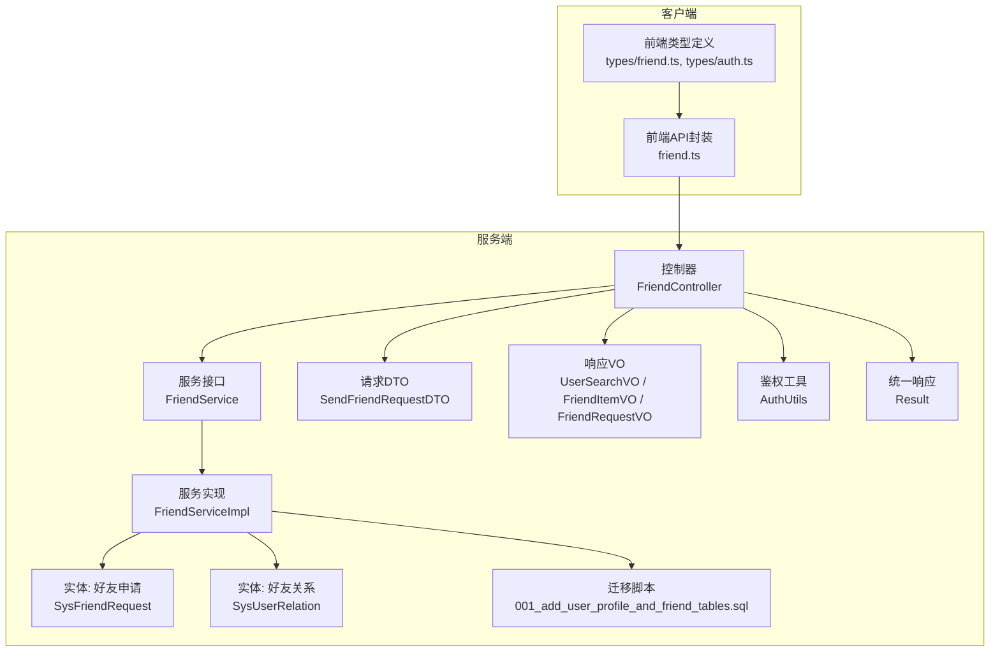
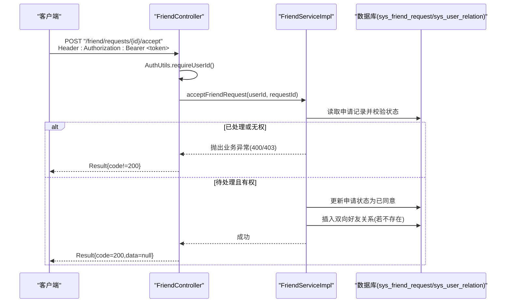
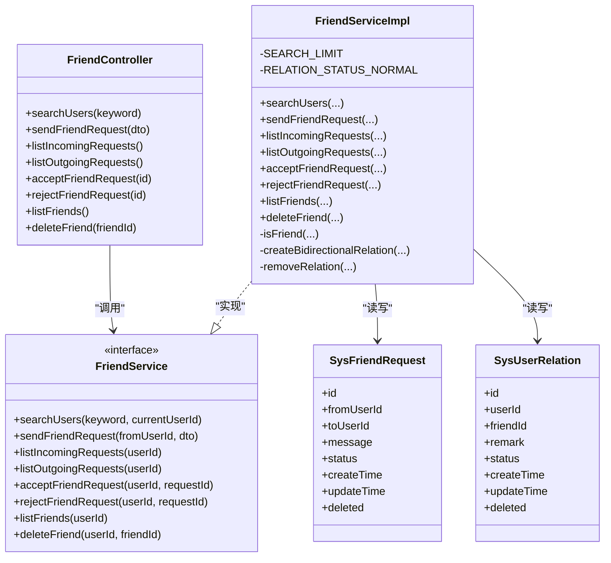

# 好友接口

<cite>
**本文引用的文件**
- [FriendController.java](file://linkx-server/src/main/java/com/linkx/server/controller/FriendController.java)
- [FriendService.java](file://linkx-server/src/main/java/com/linkx/server/service/FriendService.java)
- [FriendServiceImpl.java](file://linkx-server/src/main/java/com/linkx/server/service/impl/FriendServiceImpl.java)
- [SendFriendRequestDTO.java](file://linkx-server/src/main/java/com/linkx/server/controller/dto/SendFriendRequestDTO.java)
- [UserSearchVO.java](file://linkx-server/src/main/java/com/linkx/server/controller/vo/UserSearchVO.java)
- [FriendItemVO.java](file://linkx-server/src/main/java/com/linkx/server/controller/vo/FriendItemVO.java)
- [FriendRequestVO.java](file://linkx-server/src/main/java/com/linkx/server/controller/vo/FriendRequestVO.java)
- [SysFriendRequest.java](file://linkx-server/src/main/java/com/linkx/server/entity/SysFriendRequest.java)
- [SysUserRelation.java](file://linkx-server/src/main/java/com/linkx/server/entity/SysUserRelation.java)
- [001_add_user_profile_and_friend_tables.sql](file://linkx-server/migrations/001_add_user_profile_and_friend_tables.sql)
- [AuthUtils.java](file://linkx-server/src/main/java/com/linkx/server/common/AuthUtils.java)
- [Result.java](file://linkx-server/src/main/java/com/linkx/server/common/Result.java)
- [friend.ts](file://linkx-client/src/api/friend.ts)
- [friend.ts(类型定义)](file://linkx-client/src/types/friend.ts)
- [auth.ts(ApiResult)](file://linkx-client/src/types/auth.ts)
</cite>

## 目录
1. [简介](#简介)
2. [项目结构](#项目结构)
3. [核心组件](#核心组件)
4. [架构总览](#架构总览)
5. [详细接口说明](#详细接口说明)
6. [依赖分析](#依赖分析)
7. [性能考虑](#性能考虑)
8. [故障排查指南](#故障排查指南)
9. [结论](#结论)
10. [附录](#附录)

## 简介
本文件为 LinkX 好友关系管理接口的完整 API 文档，覆盖以下能力：
- 用户搜索（用于添加好友）
- 发送好友申请
- 查询收到的/发出的好友申请
- 接受/拒绝好友申请
- 获取好友列表
- 删除好友

同时包含：
- 好友关系与申请的数据模型定义
- 权限控制与状态码约定
- 典型调用序列图与业务场景说明
- 客户端封装与类型定义参考

## 项目结构
后端采用 Controller-Service-Mapper 分层，统一响应体 Result<T>，通过 JWT 鉴权；前端通过 TypeScript 类型与 HTTP 客户端封装调用。

图表来源
- [FriendController.java](file://linkx-server/src/main/java/com/linkx/server/controller/FriendController.java)
- [FriendService.java](file://linkx-server/src/main/java/com/linkx/server/service/FriendService.java)
- [FriendServiceImpl.java](file://linkx-server/src/main/java/com/linkx/server/service/impl/FriendServiceImpl.java)
- [SendFriendRequestDTO.java](file://linkx-server/src/main/java/com/linkx/server/controller/dto/SendFriendRequestDTO.java)
- [UserSearchVO.java](file://linkx-server/src/main/java/com/linkx/server/controller/vo/UserSearchVO.java)
- [FriendItemVO.java](file://linkx-server/src/main/java/com/linkx/server/controller/vo/FriendItemVO.java)
- [FriendRequestVO.java](file://linkx-server/src/main/java/com/linkx/server/controller/vo/FriendRequestVO.java)
- [SysFriendRequest.java](file://linkx-server/src/main/java/com/linkx/server/entity/SysFriendRequest.java)
- [SysUserRelation.java](file://linkx-server/src/main/java/com/linkx/server/entity/SysUserRelation.java)
- [001_add_user_profile_and_friend_tables.sql](file://linkx-server/migrations/001_add_user_profile_and_friend_tables.sql)
- [AuthUtils.java](file://linkx-server/src/main/java/com/linkx/server/common/AuthUtils.java)
- [Result.java](file://linkx-server/src/main/java/com/linkx/server/common/Result.java)
- [friend.ts](file://linkx-client/src/api/friend.ts)
- [friend.ts(类型定义)](file://linkx-client/src/types/friend.ts)
- [auth.ts(ApiResult)](file://linkx-client/src/types/auth.ts)

章节来源
- [FriendController.java](file://linkx-server/src/main/java/com/linkx/server/controller/FriendController.java)
- [FriendService.java](file://linkx-server/src/main/java/com/linkx/server/service/FriendService.java)
- [FriendServiceImpl.java](file://linkx-server/src/main/java/com/linkx/server/service/impl/FriendServiceImpl.java)
- [AuthUtils.java](file://linkx-server/src/main/java/com/linkx/server/common/AuthUtils.java)
- [Result.java](file://linkx-server/src/main/java/com/linkx/server/common/Result.java)
- [friend.ts](file://linkx-client/src/api/friend.ts)
- [friend.ts(类型定义)](file://linkx-client/src/types/friend.ts)
- [auth.ts(ApiResult)](file://linkx-client/src/types/auth.ts)

## 核心组件
- 控制器层：暴露 RESTful 端点，负责参数校验、鉴权、调用服务并返回统一响应。
- 服务层：实现业务逻辑，包括搜索、申请、处理、双向关系维护、删除等。
- 数据模型：
  - 好友申请：记录申请方向、消息、状态与时间戳。
  - 好友关系：记录双方关系、备注、状态与时间戳。
- 鉴权与响应：
  - 从请求头解析当前用户 ID，未登录抛出未认证异常。
  - 统一响应体包含 code/message/data。

章节来源
- [FriendController.java](file://linkx-server/src/main/java/com/linkx/server/controller/FriendController.java)
- [FriendService.java](file://linkx-server/src/main/java/com/linkx/server/service/FriendService.java)
- [FriendServiceImpl.java](file://linkx-server/src/main/java/com/linkx/server/service/impl/FriendServiceImpl.java)
- [SysFriendRequest.java](file://linkx-server/src/main/java/com/linkx/server/entity/SysFriendRequest.java)
- [SysUserRelation.java](file://linkx-server/src/main/java/com/linkx/server/entity/SysUserRelation.java)
- [AuthUtils.java](file://linkx-server/src/main/java/com/linkx/server/common/AuthUtils.java)
- [Result.java](file://linkx-server/src/main/java/com/linkx/server/common/Result.java)

## 架构总览
下图展示一次“接受好友申请”的端到端调用流程，体现鉴权、事务与双向关系创建。

图表来源
- [FriendController.java](file://linkx-server/src/main/java/com/linkx/server/controller/FriendController.java)
- [FriendServiceImpl.java](file://linkx-server/src/main/java/com/linkx/server/service/impl/FriendServiceImpl.java)
- [SysFriendRequest.java](file://linkx-server/src/main/java/com/linkx/server/entity/SysFriendRequest.java)
- [SysUserRelation.java](file://linkx-server/src/main/java/com/linkx/server/entity/SysUserRelation.java)
- [AuthUtils.java](file://linkx-server/src/main/java/com/linkx/server/common/AuthUtils.java)
- [Result.java](file://linkx-server/src/main/java/com/linkx/server/common/Result.java)

## 详细接口说明

### 通用约定
- 鉴权方式：请求头携带 Authorization: Bearer <accessToken>
- 统一响应体：
  - code: 业务状态码（200 表示成功）
  - message: 提示信息
  - data: 业务数据（失败时为 null）
- 错误码约定：
  - 400: 参数错误或业务冲突
  - 401: 未登录或登录过期
  - 403: 无权限操作
  - 404: 资源不存在
  - 500: 服务器内部错误

章节来源
- [AuthUtils.java](file://linkx-server/src/main/java/com/linkx/server/common/AuthUtils.java)
- [Result.java](file://linkx-server/src/main/java/com/linkx/server/common/Result.java)

---

### 1) 搜索用户（用于添加好友）
- 方法：GET
- 路径：/friend/search
- 鉴权：需要
- 查询参数：
  - keyword: string，至少 2 个字符
- 成功响应 data：UserSearchResult[]
  - id: string
  - username: string
  - nickname: string
  - avatar?: string
- 错误码：
  - 400: 关键词长度不足
  - 401: 未登录
- 业务规则：
  - 优先精确匹配 username
  - 其次模糊匹配 username/nickname
  - 排除自身与不可用账号
  - 结果限制条数

调用示例（前端封装）
- 函数：searchUsers(keyword)
- 请求：GET /friend/search?keyword=xxx
- 响应：ApiResult<UserSearchResult[]>

章节来源
- [FriendController.java](file://linkx-server/src/main/java/com/linkx/server/controller/FriendController.java)
- [FriendServiceImpl.java](file://linkx-server/src/main/java/com/linkx/server/service/impl/FriendServiceImpl.java)
- [UserSearchVO.java](file://linkx-server/src/main/java/com/linkx/server/controller/vo/UserSearchVO.java)
- [friend.ts](file://linkx-client/src/api/friend.ts)
- [friend.ts(类型定义)](file://linkx-client/src/types/friend.ts)
- [auth.ts(ApiResult)](file://linkx-client/src/types/auth.ts)

---

### 2) 发送好友申请
- 方法：POST
- 路径：/friend/request
- 鉴权：需要
- 请求体：SendFriendRequestDTO
  - username: string，必填，长度 4-32
  - message?: string，可选，最大 255 字符
- 成功响应 data：null
- 错误码：
  - 400: 不能添加自己/对方已是好友/已存在待处理申请
  - 401: 未登录
  - 404: 目标用户不存在
- 业务规则：
  - 若对方已向你发起待处理申请，则自动接受并建立好友关系
  - 否则新建一条待处理申请记录

调用示例（前端封装）
- 函数：sendFriendRequest({username, message})
- 请求：POST /friend/request
- 响应：ApiResult<null>

章节来源
- [FriendController.java](file://linkx-server/src/main/java/com/linkx/server/controller/FriendController.java)
- [FriendServiceImpl.java](file://linkx-server/src/main/java/com/linkx/server/service/impl/FriendServiceImpl.java)
- [SendFriendRequestDTO.java](file://linkx-server/src/main/java/com/linkx/server/controller/dto/SendFriendRequestDTO.java)
- [friend.ts](file://linkx-client/src/api/friend.ts)
- [friend.ts(类型定义)](file://linkx-client/src/types/friend.ts)
- [auth.ts(ApiResult)](file://linkx-client/src/types/auth.ts)

---

### 3) 查询收到的好友申请
- 方法：GET
- 路径：/friend/requests/incoming
- 鉴权：需要
- 成功响应 data：FriendRequestItem[]
  - id: string
  - fromUserId: string
  - toUserId: string
  - fromUsername: string
  - fromNickname: string
  - fromAvatar?: string
  - peerUserId?: string
  - peerUsername: string
  - peerNickname: string
  - peerAvatar?: string
  - message?: string
  - status: 0|1|2（0=待处理，1=已同意，2=已拒绝）
  - direction: "incoming"
  - createTime: string
- 错误码：
  - 401: 未登录

调用示例（前端封装）
- 函数：listIncomingRequests()
- 请求：GET /friend/requests/incoming
- 响应：ApiResult<FriendRequestItem[]>

章节来源
- [FriendController.java](file://linkx-server/src/main/java/com/linkx/server/controller/FriendController.java)
- [FriendServiceImpl.java](file://linkx-server/src/main/java/com/linkx/server/service/impl/FriendServiceImpl.java)
- [FriendRequestVO.java](file://linkx-server/src/main/java/com/linkx/server/controller/vo/FriendRequestVO.java)
- [friend.ts](file://linkx-client/src/api/friend.ts)
- [friend.ts(类型定义)](file://linkx-client/src/types/friend.ts)
- [auth.ts(ApiResult)](file://linkx-client/src/types/auth.ts)

---

### 4) 查询发出的好友申请
- 方法：GET
- 路径：/friend/requests/outgoing
- 鉴权：需要
- 成功响应 data：FriendRequestItem[]（direction="outgoing"）
- 错误码：
  - 401: 未登录

调用示例（前端封装）
- 函数：listOutgoingRequests()
- 请求：GET /friend/requests/outgoing
- 响应：ApiResult<FriendRequestItem[]>

章节来源
- [FriendController.java](file://linkx-server/src/main/java/com/linkx/server/controller/FriendController.java)
- [FriendServiceImpl.java](file://linkx-server/src/main/java/com/linkx/server/service/impl/FriendServiceImpl.java)
- [FriendRequestVO.java](file://linkx-server/src/main/java/com/linkx/server/controller/vo/FriendRequestVO.java)
- [friend.ts](file://linkx-client/src/api/friend.ts)
- [friend.ts(类型定义)](file://linkx-client/src/types/friend.ts)
- [auth.ts(ApiResult)](file://linkx-client/src/types/auth.ts)

---

### 5) 接受好友申请
- 方法：POST
- 路径：/friend/requests/{id}/accept
- 鉴权：需要
- 路径参数：
  - id: string（申请ID，服务端会校验格式）
- 成功响应 data：null
- 错误码：
  - 400: 申请不存在/已处理/无效的申请ID
  - 401: 未登录
  - 403: 无权处理该申请
- 业务规则：
  - 仅被申请人可接受
  - 成功后将申请状态置为已同意，并创建双向好友关系（若不存在）

调用示例（前端封装）
- 函数：acceptFriendRequest(requestId)
- 请求：POST /friend/requests/{requestId}/accept
- 响应：ApiResult<null>

章节来源
- [FriendController.java](file://linkx-server/src/main/java/com/linkx/server/controller/FriendController.java)
- [FriendServiceImpl.java](file://linkx-server/src/main/java/com/linkx/server/service/impl/FriendServiceImpl.java)
- [SysFriendRequest.java](file://linkx-server/src/main/java/com/linkx/server/entity/SysFriendRequest.java)
- [SysUserRelation.java](file://linkx-server/src/main/java/com/linkx/server/entity/SysUserRelation.java)
- [friend.ts](file://linkx-client/src/api/friend.ts)
- [auth.ts(ApiResult)](file://linkx-client/src/types/auth.ts)

---

### 6) 拒绝好友申请
- 方法：POST
- 路径：/friend/requests/{id}/reject
- 鉴权：需要
- 路径参数：
  - id: string（申请ID，服务端会校验格式）
- 成功响应 data：null
- 错误码：
  - 400: 申请不存在/已处理/无效的申请ID
  - 401: 未登录
  - 403: 无权处理该申请
- 业务规则：
  - 仅被申请人可拒绝
  - 成功后将申请状态置为已拒绝

调用示例（前端封装）
- 函数：rejectFriendRequest(requestId)
- 请求：POST /friend/requests/{requestId}/reject
- 响应：ApiResult<null>

章节来源
- [FriendController.java](file://linkx-server/src/main/java/com/linkx/server/controller/FriendController.java)
- [FriendServiceImpl.java](file://linkx-server/src/main/java/com/linkx/server/service/impl/FriendServiceImpl.java)
- [SysFriendRequest.java](file://linkx-server/src/main/java/com/linkx/server/entity/SysFriendRequest.java)
- [friend.ts](file://linkx-client/src/api/friend.ts)
- [auth.ts(ApiResult)](file://linkx-client/src/types/auth.ts)

---

### 7) 获取好友列表
- 方法：GET
- 路径：/friend/list
- 鉴权：需要
- 成功响应 data：FriendItem[]
  - userId: string
  - username: string
  - nickname: string
  - avatar?: string
  - remark?: string
- 错误码：
  - 401: 未登录

调用示例（前端封装）
- 函数：listFriends()
- 请求：GET /friend/list
- 响应：ApiResult<FriendItem[]>

章节来源
- [FriendController.java](file://linkx-server/src/main/java/com/linkx/server/controller/FriendController.java)
- [FriendServiceImpl.java](file://linkx-server/src/main/java/com/linkx/server/service/impl/FriendServiceImpl.java)
- [FriendItemVO.java](file://linkx-server/src/main/java/com/linkx/server/controller/vo/FriendItemVO.java)
- [friend.ts](file://linkx-client/src/api/friend.ts)
- [friend.ts(类型定义)](file://linkx-client/src/types/friend.ts)
- [auth.ts(ApiResult)](file://linkx-client/src/types/auth.ts)

---

### 8) 删除好友
- 方法：DELETE
- 路径：/friend/{friendId}
- 鉴权：需要
- 路径参数：
  - friendId: string（被删除好友的用户ID，服务端会校验格式）
- 成功响应 data：null
- 错误码：
  - 400: 无效的好友ID
  - 401: 未登录
  - 404: 对方不是你的好友
- 业务规则：
  - 双向删除关系记录

调用示例（前端封装）
- 函数：deleteFriend(friendId)
- 请求：DELETE /friend/{friendId}
- 响应：ApiResult<null>

章节来源
- [FriendController.java](file://linkx-server/src/main/java/com/linkx/server/controller/FriendController.java)
- [FriendServiceImpl.java](file://linkx-server/src/main/java/com/linkx/server/service/impl/FriendServiceImpl.java)
- [friend.ts](file://linkx-client/src/api/friend.ts)
- [auth.ts(ApiResult)](file://linkx-client/src/types/auth.ts)

## 依赖分析
- 控制器依赖：
  - 鉴权工具：AuthUtils（从请求头解析 userId）
  - 服务接口：FriendService
  - 统一响应：Result
- 服务实现依赖：
  - Mapper：SysFriendRequestMapper、SysUserRelationMapper、SysUserMapper
  - 实体：SysFriendRequest、SysUserRelation
  - 事务：@Transactional（接受/拒绝、删除）
- 数据表依赖：
  - sys_friend_request：好友申请
  - sys_user_relation：好友关系

图表来源
- [FriendController.java](file://linkx-server/src/main/java/com/linkx/server/controller/FriendController.java)
- [FriendService.java](file://linkx-server/src/main/java/com/linkx/server/service/FriendService.java)
- [FriendServiceImpl.java](file://linkx-server/src/main/java/com/linkx/server/service/impl/FriendServiceImpl.java)
- [SysFriendRequest.java](file://linkx-server/src/main/java/com/linkx/server/entity/SysFriendRequest.java)
- [SysUserRelation.java](file://linkx-server/src/main/java/com/linkx/server/entity/SysUserRelation.java)

章节来源
- [FriendController.java](file://linkx-server/src/main/java/com/linkx/server/controller/FriendController.java)
- [FriendService.java](file://linkx-server/src/main/java/com/linkx/server/service/FriendService.java)
- [FriendServiceImpl.java](file://linkx-server/src/main/java/com/linkx/server/service/impl/FriendServiceImpl.java)
- [SysFriendRequest.java](file://linkx-server/src/main/java/com/linkx/server/entity/SysFriendRequest.java)
- [SysUserRelation.java](file://linkx-server/src/main/java/com/linkx/server/entity/SysUserRelation.java)

## 性能考虑
- 搜索接口对用户名/昵称进行去重与上限限制，避免大结果集。
- 列表接口按创建时间倒序，建议配合索引优化（见迁移脚本）。
- 批量操作：当前未提供批量接受/拒绝接口，如需提升效率可在服务层增加批量处理并复用事务。
- 关系写入在“接受申请”时进行幂等判断，避免重复插入。

[本节为通用指导，不直接分析具体文件]

## 故障排查指南
- 401 未登录：检查 Authorization 头是否携带有效 token。
- 400 参数/业务错误：
  - 搜索关键词过短
  - 发送申请时目标用户不存在/已是好友/已有待处理申请
  - 申请ID格式非法
  - 申请已处理
- 403 无权限：非被申请人尝试接受/拒绝申请
- 404 资源不存在：申请不存在/对方不是好友
- 500 服务器错误：查看服务端日志与全局异常处理器输出

章节来源
- [AuthUtils.java](file://linkx-server/src/main/java/com/linkx/server/common/AuthUtils.java)
- [FriendServiceImpl.java](file://linkx-server/src/main/java/com/linkx/server/service/impl/FriendServiceImpl.java)
- [FriendController.java](file://linkx-server/src/main/java/com/linkx/server/controller/FriendController.java)

## 结论
本套接口覆盖了好友关系的核心生命周期：搜索、申请、处理、列表与删除，具备完善的鉴权与错误处理机制。数据模型清晰，事务边界明确，适合在现有系统中扩展通知与批量能力。

[本节为总结性内容，不直接分析具体文件]

## 附录

### 数据模型定义

#### 好友申请（sys_friend_request）
- 字段：
  - id: BIGINT（雪花主键）
  - from_user_id: BIGINT（申请人）
  - to_user_id: BIGINT（被申请人）
  - message: VARCHAR(255)（验证信息）
  - status: TINYINT（0=待处理，1=已同意，2=已拒绝）
  - create_time/update_time/deleted: 时间戳与逻辑删除

章节来源
- [SysFriendRequest.java](file://linkx-server/src/main/java/com/linkx/server/entity/SysFriendRequest.java)
- [001_add_user_profile_and_friend_tables.sql](file://linkx-server/migrations/001_add_user_profile_and_friend_tables.sql)

#### 好友关系（sys_user_relation）
- 字段：
  - id: BIGINT（雪花主键）
  - user_id: BIGINT（所属用户）
  - friend_id: BIGINT（好友用户）
  - remark: VARCHAR(64)（备注）
  - status: TINYINT（1=正常，2=拉黑）
  - create_time/update_time/deleted: 时间戳与逻辑删除

章节来源
- [SysUserRelation.java](file://linkx-server/src/main/java/com/linkx/server/entity/SysUserRelation.java)
- [001_add_user_profile_and_friend_tables.sql](file://linkx-server/migrations/001_add_user_profile_and_friend_tables.sql)

### 前端类型与封装参考
- ApiResult<T>：统一响应包装
- UserSearchResult/FriendItem/FriendRequestItem：对应后端 VO 的前端类型
- friend.ts：封装了所有好友相关 API 调用

章节来源
- [auth.ts(ApiResult)](file://linkx-client/src/types/auth.ts)
- [friend.ts(类型定义)](file://linkx-client/src/types/friend.ts)
- [friend.ts](file://linkx-client/src/api/friend.ts)