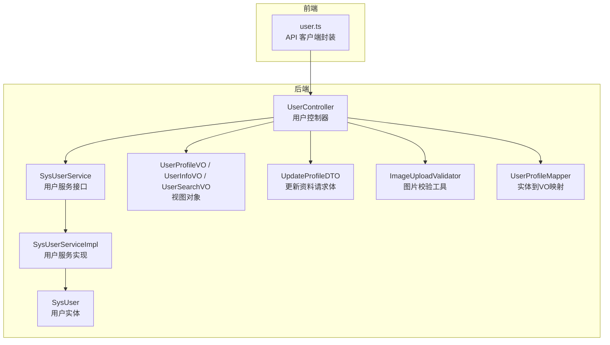
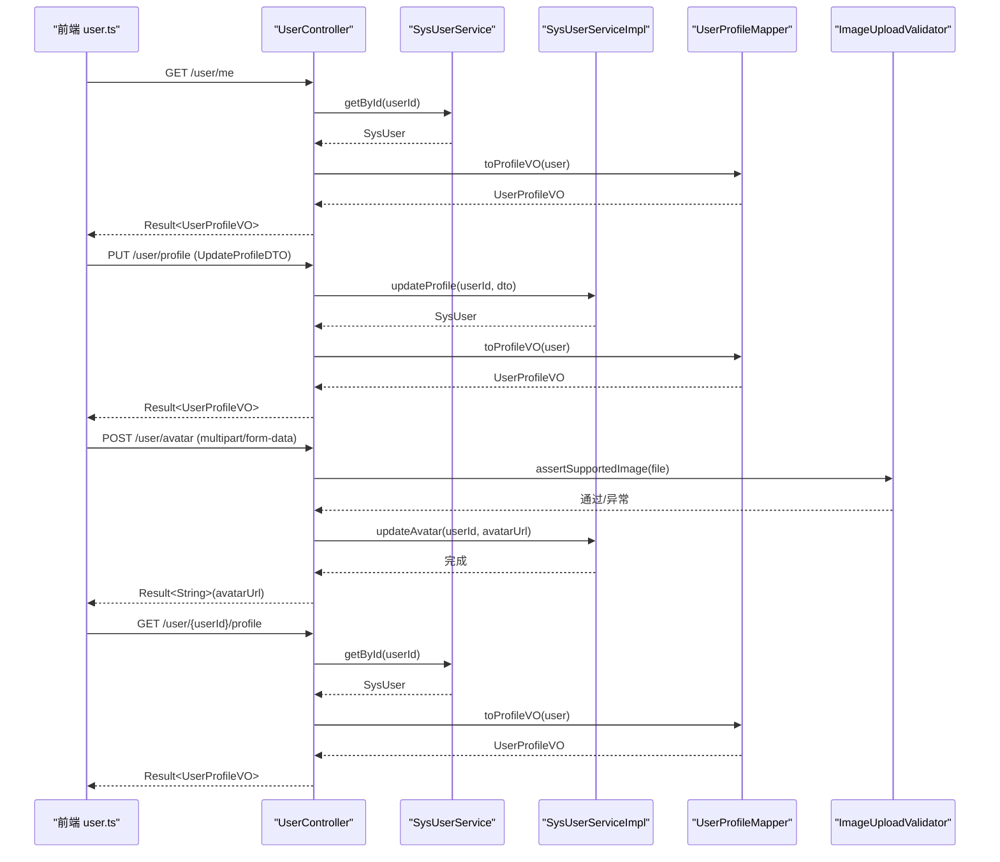
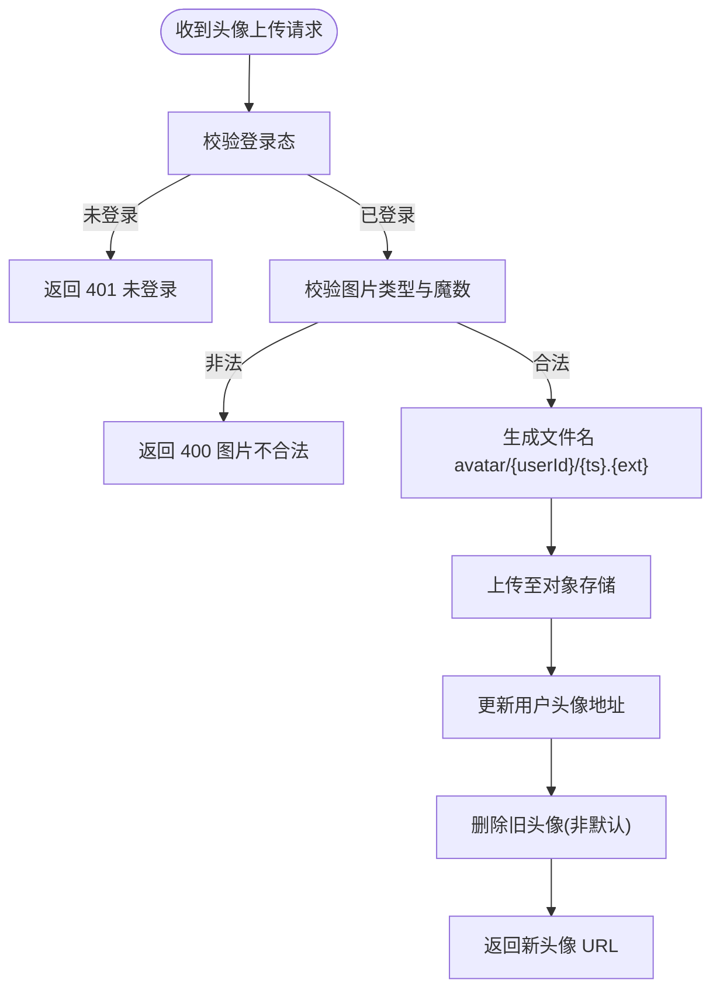
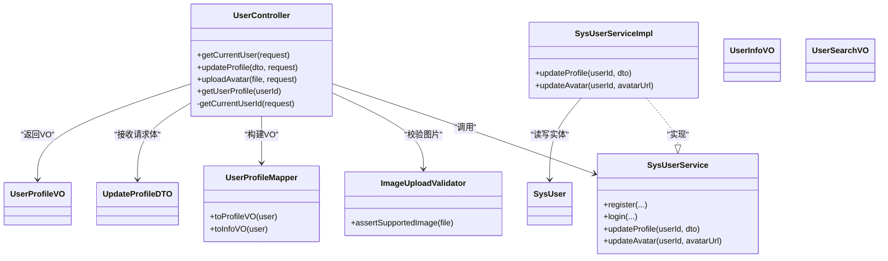

# 用户接口

<cite>
**本文引用的文件**   
- [UserController.java](file://linkx-server/src/main/java/com/linkx/server/controller/UserController.java)
- [SysUserService.java](file://linkx-server/src/main/java/com/linkx/server/service/SysUserService.java)
- [SysUserServiceImpl.java](file://linkx-server/src/main/java/com/linkx/server/service/impl/SysUserServiceImpl.java)
- [SysUser.java](file://linkx-server/src/main/java/com/linkx/server/entity/SysUser.java)
- [UpdateProfileDTO.java](file://linkx-server/src/main/java/com/linkx/server/controller/dto/UpdateProfileDTO.java)
- [UserProfileVO.java](file://linkx-server/src/main/java/com/linkx/server/controller/vo/UserProfileVO.java)
- [UserInfoVO.java](file://linkx-server/src/main/java/com/linkx/server/controller/vo/UserInfoVO.java)
- [UserSearchVO.java](file://linkx-server/src/main/java/com/linkx/server/controller/vo/UserSearchVO.java)
- [ImageUploadValidator.java](file://linkx-server/src/main/java/com/linkx/server/common/ImageUploadValidator.java)
- [UserProfileMapper.java](file://linkx-server/src/main/java/com/linkx/server/common/UserProfileMapper.java)
- [user.ts](file://linkx-client/src/api/user.ts)
</cite>

## 目录
1. [简介](#简介)
2. [项目结构](#项目结构)
3. [核心组件](#核心组件)
4. [架构总览](#架构总览)
5. [详细组件分析](#详细组件分析)
6. [依赖分析](#依赖分析)
7. [性能考虑](#性能考虑)
8. [故障排查指南](#故障排查指南)
9. [结论](#结论)
10. [附录](#附录)

## 简介
本文件为 LinkX 用户管理相关 RESTful API 的权威文档，覆盖以下能力：
- 获取当前登录用户信息
- 更新用户资料
- 上传用户头像（图片校验与存储）
- 获取指定用户的公开资料
- 用户搜索（模型定义已就绪，服务端端点待实现）

文档包含每个接口的 HTTP 方法、URL 路径、请求参数格式、响应数据结构、文件上传处理、权限控制说明、数据验证规则、图片处理流程、调用示例与最佳实践。

## 项目结构
与用户接口相关的后端代码主要位于 linkx-server 模块中，前端客户端封装位于 linkx-client 模块。

图表来源
- [UserController.java:1-145](file://linkx-server/src/main/java/com/linkx/server/controller/UserController.java#L1-L145)
- [SysUserService.java:1-34](file://linkx-server/src/main/java/com/linkx/server/service/SysUserService.java#L1-L34)
- [SysUserServiceImpl.java:1-175](file://linkx-server/src/main/java/com/linkx/server/service/impl/SysUserServiceImpl.java#L1-L175)
- [SysUser.java:1-97](file://linkx-server/src/main/java/com/linkx/server/entity/SysUser.java#L1-L97)
- [UpdateProfileDTO.java:1-54](file://linkx-server/src/main/java/com/linkx/server/controller/dto/UpdateProfileDTO.java#L1-L54)
- [UserProfileVO.java:1-70](file://linkx-server/src/main/java/com/linkx/server/controller/vo/UserProfileVO.java#L1-L70)
- [UserInfoVO.java:1-49](file://linkx-server/src/main/java/com/linkx/server/controller/vo/UserInfoVO.java#L1-L49)
- [UserSearchVO.java:1-21](file://linkx-server/src/main/java/com/linkx/server/controller/vo/UserSearchVO.java#L1-L21)
- [ImageUploadValidator.java:1-66](file://linkx-server/src/main/java/com/linkx/server/common/ImageUploadValidator.java#L1-L66)
- [UserProfileMapper.java:1-52](file://linkx-server/src/main/java/com/linkx/server/common/UserProfileMapper.java#L1-L52)
- [user.ts:1-60](file://linkx-client/src/api/user.ts#L1-L60)

章节来源
- [UserController.java:1-145](file://linkx-server/src/main/java/com/linkx/server/controller/UserController.java#L1-L145)
- [user.ts:1-60](file://linkx-client/src/api/user.ts#L1-L60)

## 核心组件
- 控制器层：提供用户资料查询、更新、头像上传、公开资料查看等 REST 端点。
- 服务层：负责业务逻辑，包括资料更新、头像替换与旧图清理、鉴权上下文解析辅助。
- 实体与 VO：实体对应数据库表；VO 用于对外返回字段裁剪与序列化优化。
- DTO：用于接收并校验更新资料请求参数。
- 工具类：图片上传校验、实体到 VO 的映射。

章节来源
- [UserController.java:1-145](file://linkx-server/src/main/java/com/linkx/server/controller/UserController.java#L1-L145)
- [SysUserService.java:1-34](file://linkx-server/src/main/java/com/linkx/server/service/SysUserService.java#L1-L34)
- [SysUserServiceImpl.java:1-175](file://linkx-server/src/main/java/com/linkx/server/service/impl/SysUserServiceImpl.java#L1-L175)
- [UpdateProfileDTO.java:1-54](file://linkx-server/src/main/java/com/linkx/server/controller/dto/UpdateProfileDTO.java#L1-L54)
- [UserProfileVO.java:1-70](file://linkx-server/src/main/java/com/linkx/server/controller/vo/UserProfileVO.java#L1-L70)
- [UserInfoVO.java:1-49](file://linkx-server/src/main/java/com/linkx/server/controller/vo/UserInfoVO.java#L1-L49)
- [UserSearchVO.java:1-21](file://linkx-server/src/main/java/com/linkx/server/controller/vo/UserSearchVO.java#L1-L21)
- [ImageUploadValidator.java:1-66](file://linkx-server/src/main/java/com/linkx/server/common/ImageUploadValidator.java#L1-L66)
- [UserProfileMapper.java:1-52](file://linkx-server/src/main/java/com/linkx/server/common/UserProfileMapper.java#L1-L52)

## 架构总览
下图展示了用户接口从前端到后端的调用链路及关键组件交互。

图表来源
- [UserController.java:33-113](file://linkx-server/src/main/java/com/linkx/server/controller/UserController.java#L33-L113)
- [SysUserServiceImpl.java:101-173](file://linkx-server/src/main/java/com/linkx/server/service/impl/SysUserServiceImpl.java#L101-L173)
- [UserProfileMapper.java:15-32](file://linkx-server/src/main/java/com/linkx/server/common/UserProfileMapper.java#L15-L32)
- [ImageUploadValidator.java:16-24](file://linkx-server/src/main/java/com/linkx/server/common/ImageUploadValidator.java#L16-L24)
- [user.ts:27-59](file://linkx-client/src/api/user.ts#L27-L59)

## 详细组件分析

### 接口清单与规范
- 统一响应包装：所有接口均返回统一结果对象 Result<T>，其中 T 为具体业务数据。
- 认证方式：受保护接口需携带有效令牌，支持从请求属性或 Authorization 头解析当前用户 ID。
- 错误码约定：常见状态码如 400（参数错误）、401（未登录）、403（账号停用）、404（资源不存在）、429（限流）。

章节来源
- [UserController.java:122-143](file://linkx-server/src/main/java/com/linkx/server/controller/UserController.java#L122-L143)

#### 1) 获取当前登录用户信息
- 方法：GET
- 路径：/user/me
- 认证：需要
- 请求参数：无
- 响应体：Result<UserProfileVO>
- 行为说明：
  - 若未登录，返回 401。
  - 若用户不存在，返回 404。
  - 成功返回当前用户的完整资料（含创建时间）。

章节来源
- [UserController.java:33-49](file://linkx-server/src/main/java/com/linkx/server/controller/UserController.java#L33-L49)
- [UserProfileVO.java:1-70](file://linkx-server/src/main/java/com/linkx/server/controller/vo/UserProfileVO.java#L1-L70)
- [user.ts:27-29](file://linkx-client/src/api/user.ts#L27-L29)

#### 2) 更新用户资料
- 方法：PUT
- 路径：/user/profile
- 认证：需要
- 请求体：UpdateProfileDTO（JSON）
- 响应体：Result<UserProfileVO>
- 字段校验规则：
  - nickname：最大长度 50
  - signature：最大长度 200
  - gender：仅允许“男”、“女”或空字符串（空将置为 null）
  - birthday：毫秒时间戳（可为空）
  - country/province/region：最大长度 64（空将置为 null）
- 行为说明：
  - 仅更新非空且有效的字段。
  - 若用户不存在，抛出 404。
  - 成功返回更新后的资料。

章节来源
- [UserController.java:51-65](file://linkx-server/src/main/java/com/linkx/server/controller/UserController.java#L51-L65)
- [UpdateProfileDTO.java:1-54](file://linkx-server/src/main/java/com/linkx/server/controller/dto/UpdateProfileDTO.java#L1-L54)
- [SysUserServiceImpl.java:101-152](file://linkx-server/src/main/java/com/linkx/server/service/impl/SysUserServiceImpl.java#L101-L152)
- [user.ts:34-36](file://linkx-client/src/api/user.ts#L34-L36)

#### 3) 上传用户头像
- 方法：POST
- 路径：/user/avatar
- 认证：需要
- 请求体：multipart/form-data，表单字段名为 file
- 响应体：Result<String>（返回新头像 URL）
- 图片校验规则：
  - Content-Type 必须以 image/ 开头
  - 文件头 magic bytes 必须匹配 JPEG/PNG/GIF/WebP 之一
- 处理流程：
  - 生成文件名：avatar/{userId}/{timestamp}.{ext}
  - 上传至对象存储（FileStorageService）
  - 更新用户头像地址
  - 删除旧头像（若非默认头像）
- 错误处理：
  - 未登录：401
  - 图片不合法：400
  - 用户不存在：404

章节来源
- [UserController.java:67-100](file://linkx-server/src/main/java/com/linkx/server/controller/UserController.java#L67-L100)
- [ImageUploadValidator.java:16-24](file://linkx-server/src/main/java/com/linkx/server/common/ImageUploadValidator.java#L16-L24)
- [SysUserServiceImpl.java:154-173](file://linkx-server/src/main/java/com/linkx/server/service/impl/SysUserServiceImpl.java#L154-L173)
- [user.ts:42-51](file://linkx-client/src/api/user.ts#L42-L51)

#### 4) 获取用户公开资料
- 方法：GET
- 路径：/user/{userId}/profile
- 认证：不需要
- 路径参数：userId（Long）
- 响应体：Result<UserProfileVO>
- 行为说明：
  - 用户不存在：404
  - 成功返回该用户的公开资料（不含敏感字段）

章节来源
- [UserController.java:102-113](file://linkx-server/src/main/java/com/linkx/server/controller/UserController.java#L102-L113)
- [UserProfileVO.java:1-70](file://linkx-server/src/main/java/com/linkx/server/controller/vo/UserProfileVO.java#L1-L70)
- [user.ts:57-59](file://linkx-client/src/api/user.ts#L57-L59)

#### 5) 用户搜索（模型已定义，端点待实现）
- 模型：UserSearchVO（id、username、nickname、avatar）
- 建议端点（规划）：
  - GET /user/search?keyword=xxx
  - 返回：Result<List<UserSearchVO>>
- 说明：当前仓库中尚未发现该端点的实现，建议在后续版本补充。

章节来源
- [UserSearchVO.java:1-21](file://linkx-server/src/main/java/com/linkx/server/controller/vo/UserSearchVO.java#L1-L21)

### 数据模型与验证规则

#### 用户实体 SysUser
- 主键：雪花算法生成的 Long id
- 关键字段：username、password、nickname、avatar、signature、gender、birthday、country、province、region、status、createTime、updateTime、deleted
- 逻辑删除：deleted 标记

章节来源
- [SysUser.java:1-97](file://linkx-server/src/main/java/com/linkx/server/entity/SysUser.java#L1-L97)

#### 更新资料 DTO UpdateProfileDTO
- 字段与约束见“更新用户资料”小节。

章节来源
- [UpdateProfileDTO.java:1-54](file://linkx-server/src/main/java/com/linkx/server/controller/dto/UpdateProfileDTO.java#L1-L54)

#### 视图对象
- UserProfileVO：对外返回的用户资料，包含 createTime
- UserInfoVO：登录成功后返回的基础用户信息（不含 createTime）
- UserSearchVO：搜索结果项（id 使用 ToStringSerializer 避免前端精度丢失）

章节来源
- [UserProfileVO.java:1-70](file://linkx-server/src/main/java/com/linkx/server/controller/vo/UserProfileVO.java#L1-L70)
- [UserInfoVO.java:1-49](file://linkx-server/src/main/java/com/linkx/server/controller/vo/UserInfoVO.java#L1-L49)
- [UserSearchVO.java:1-21](file://linkx-server/src/main/java/com/linkx/server/controller/vo/UserSearchVO.java#L1-L21)

### 图片处理流程

图表来源
- [UserController.java:67-100](file://linkx-server/src/main/java/com/linkx/server/controller/UserController.java#L67-L100)
- [ImageUploadValidator.java:16-24](file://linkx-server/src/main/java/com/linkx/server/common/ImageUploadValidator.java#L16-L24)
- [SysUserServiceImpl.java:154-173](file://linkx-server/src/main/java/com/linkx/server/service/impl/SysUserServiceImpl.java#L154-L173)

### 权限控制
- 受保护接口：/user/me、/user/profile、/user/avatar
- 认证解析策略：优先读取请求属性中的 userId；否则从 Authorization 头提取 Bearer Token 并解析用户 ID
- 公开接口：/user/{userId}/profile

章节来源
- [UserController.java:122-143](file://linkx-server/src/main/java/com/linkx/server/controller/UserController.java#L122-L143)

### 前端调用示例（基于 user.ts）
- 获取当前用户：调用 getCurrentUser()
- 更新资料：调用 updateProfile(payload)
- 上传头像：调用 uploadAvatar(file)，Content-Type 自动设置为 multipart/form-data
- 获取他人资料：调用 getUserProfile(userId)

章节来源
- [user.ts:27-59](file://linkx-client/src/api/user.ts#L27-L59)

## 依赖分析

图表来源
- [UserController.java:1-145](file://linkx-server/src/main/java/com/linkx/server/controller/UserController.java#L1-L145)
- [SysUserService.java:1-34](file://linkx-server/src/main/java/com/linkx/server/service/SysUserService.java#L1-L34)
- [SysUserServiceImpl.java:1-175](file://linkx-server/src/main/java/com/linkx/server/service/impl/SysUserServiceImpl.java#L1-L175)
- [UpdateProfileDTO.java:1-54](file://linkx-server/src/main/java/com/linkx/server/controller/dto/UpdateProfileDTO.java#L1-L54)
- [UserProfileVO.java:1-70](file://linkx-server/src/main/java/com/linkx/server/controller/vo/UserProfileVO.java#L1-L70)
- [UserInfoVO.java:1-49](file://linkx-server/src/main/java/com/linkx/server/controller/vo/UserInfoVO.java#L1-L49)
- [UserSearchVO.java:1-21](file://linkx-server/src/main/java/com/linkx/server/controller/vo/UserSearchVO.java#L1-L21)
- [ImageUploadValidator.java:1-66](file://linkx-server/src/main/java/com/linkx/server/common/ImageUploadValidator.java#L1-L66)
- [UserProfileMapper.java:1-52](file://linkx-server/src/main/java/com/linkx/server/common/UserProfileMapper.java#L1-L52)

## 性能考虑
- 头像上传
  - 建议在前端进行压缩与尺寸限制，减少网络传输与存储压力。
  - 对象存储应启用 CDN 加速访问头像。
  - 删除旧头像失败不应阻塞新头像写入，已在实现中容错处理。
- 资料更新
  - 仅更新变更字段，避免不必要的写放大。
- 公开资料查询
  - 可结合缓存（如 Redis）对热点用户资料进行缓存，降低数据库压力。
- 鉴权解析
  - 优先使用拦截器注入 userId 到请求属性，减少重复解析开销。

[本节为通用性能建议，无需源码引用]

## 故障排查指南
- 401 未登录
  - 检查是否携带有效 Authorization 头或请求属性中是否存在 userId。
- 400 参数错误或图片不合法
  - 检查昵称、签名、性别、地区等字段是否符合长度与格式约束。
  - 检查上传文件的 Content-Type 与魔数是否为支持的图片格式。
- 404 用户不存在
  - 确认传入的 userId 是否正确，或当前登录用户是否存在。
- 429 限流
  - 注册与登录存在频率限制，稍后再试。

章节来源
- [UserController.java:33-100](file://linkx-server/src/main/java/com/linkx/server/controller/UserController.java#L33-L100)
- [ImageUploadValidator.java:16-24](file://linkx-server/src/main/java/com/linkx/server/common/ImageUploadValidator.java#L16-L24)
- [SysUserServiceImpl.java:101-173](file://linkx-server/src/main/java/com/linkx/server/service/impl/SysUserServiceImpl.java#L101-L173)

## 结论
LinkX 用户接口提供了完善的个人资料管理与头像上传能力，具备清晰的鉴权机制与严格的输入校验。对于用户搜索功能，模型已准备就绪，可在后续迭代中快速补齐服务端端点。建议在生产环境配合 CDN、缓存与前端压缩策略，以获得更佳的性能与用户体验。

[本节为总结性内容，无需源码引用]

## 附录

### 统一响应结构（概念）
- 所有接口返回统一包装 Result<T>，T 为具体业务数据。
- 常见状态码：200 成功、400 参数错误、401 未登录、403 账号停用、404 资源不存在、429 限流。

[本节为通用约定，无需源码引用]

### 最佳实践
- 前端在上传前进行图片压缩与格式校验，提升成功率与体验。
- 对公开资料接口增加缓存，降低热点用户查询延迟。
- 对敏感字段（如密码）严格禁止出现在任何 VO 中。
- 统一错误消息，便于前端友好提示与日志追踪。

[本节为通用建议，无需源码引用]