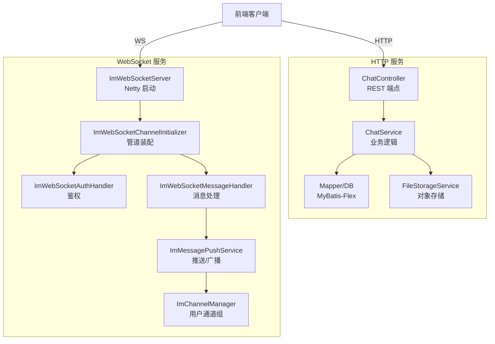
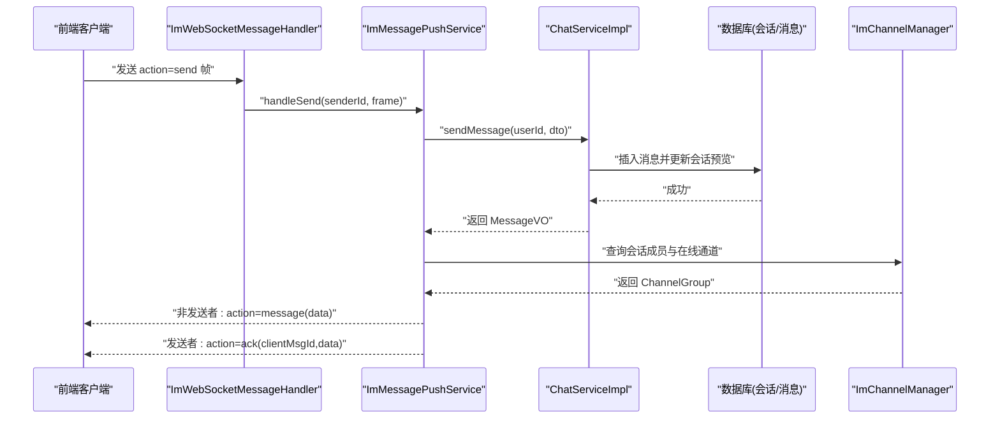
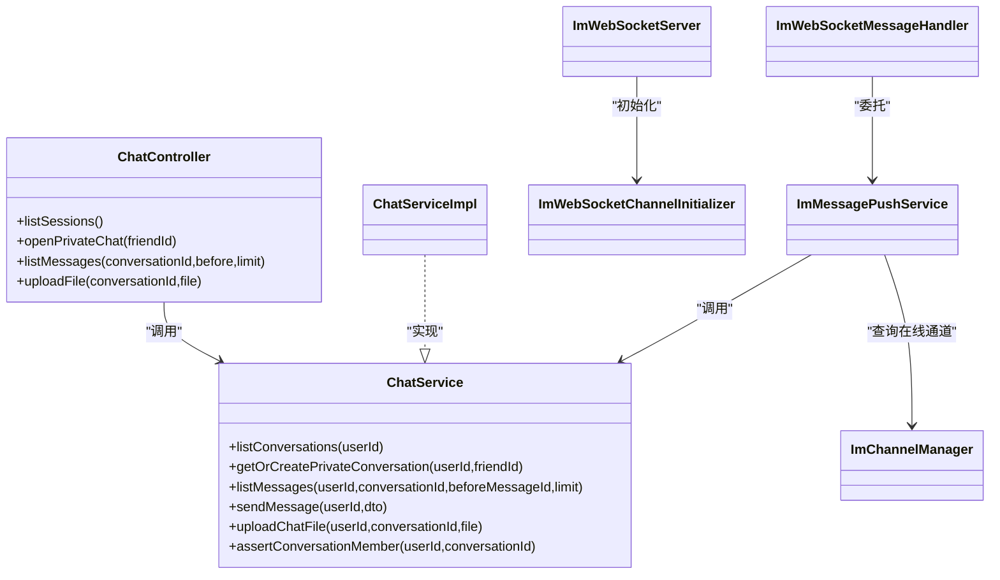

# 聊天接口

<cite>
**本文引用的文件**
- [ChatController.java](file://linkx-server/src/main/java/com/linkx/server/controller/ChatController.java)
- [ChatService.java](file://linkx-server/src/main/java/com/linkx/server/service/ChatService.java)
- [ChatServiceImpl.java](file://linkx-server/src/main/java/com/linkx/server/service/impl/ChatServiceImpl.java)
- [ImMessage.java](file://linkx-server/src/main/java/com/linkx/server/entity/ImMessage.java)
- [ImConversation.java](file://linkx-server/src/main/java/com/linkx/server/entity/ImConversation.java)
- [SendMessageDTO.java](file://linkx-server/src/main/java/com/linkx/server/controller/dto/SendMessageDTO.java)
- [MessageVO.java](file://linkx-server/src/main/java/com/linkx/server/controller/vo/MessageVO.java)
- [ConversationVO.java](file://linkx-server/src/main/java/com/linkx/server/controller/vo/ConversationVO.java)
- [ChatFileUploadVO.java](file://linkx-server/src/main/java/com/linkx/server/controller/vo/ChatFileUploadVO.java)
- [ImWebSocketServer.java](file://linkx-server/src/main/java/com/linkx/server/im/ImWebSocketServer.java)
- [ImWebSocketChannelInitializer.java](file://linkx-server/src/main/java/com/linkx/server/im/ImWebSocketChannelInitializer.java)
- [ImWebSocketMessageHandler.java](file://linkx-server/src/main/java/com/linkx/server/im/ImWebSocketMessageHandler.java)
- [ImMessagePushService.java](file://linkx-server/src/main/java/com/linkx/server/im/ImMessagePushService.java)
- [ImChannelManager.java](file://linkx-server/src/main/java/com/linkx/server/im/ImChannelManager.java)
- [chat.ts](file://linkx-client/src/api/chat.ts)
- [chatSocket.ts](file://linkx-client/src/utils/chatSocket.ts)
- [chat.ts（类型定义）](file://linkx-client/src/types/chat.ts)
</cite>

## 目录
1. [简介](#简介)
2. [项目结构](#项目结构)
3. [核心组件](#核心组件)
4. [架构总览](#架构总览)
5. [详细组件分析](#详细组件分析)
6. [依赖关系分析](#依赖关系分析)
7. [性能考虑](#性能考虑)
8. [故障排除指南](#故障排除指南)
9. [结论](#结论)
10. [附录：API 规范与示例](#附录api-规范与示例)

## 简介
本文件为 LinkX 即时通讯模块的 API 文档，覆盖会话管理、消息收发、文件上传下载、聊天记录查询等 RESTful 接口，以及基于 WebSocket 的实时通信协议。文档同时包含消息类型定义、文件传输协议、连接管理与心跳机制、消息持久化策略和性能优化建议，并提供客户端集成示例与常见问题排查方法。

## 项目结构
后端采用 Spring Boot + Netty 的混合架构：
- HTTP 层：Spring MVC 控制器暴露 REST 接口，服务层实现业务逻辑与数据持久化。
- 实时层：Netty 独立启动的 WebSocket 服务，负责认证、鉴权、消息路由与推送。
- 前端：Vue 应用通过 Axios 调用 REST 接口，并通过原生 WebSocket 进行实时通信。

图表来源
- [ChatController.java:22-72](file://linkx-server/src/main/java/com/linkx/server/controller/ChatController.java#L22-L72)
- [ChatService.java:11-25](file://linkx-server/src/main/java/com/linkx/server/service/ChatService.java#L11-L25)
- [ImWebSocketServer.java:20-82](file://linkx-server/src/main/java/com/linkx/server/im/ImWebSocketServer.java#L20-L82)
- [ImWebSocketChannelInitializer.java:16-38](file://linkx-server/src/main/java/com/linkx/server/im/ImWebSocketChannelInitializer.java#L16-L38)
- [ImWebSocketMessageHandler.java:12-62](file://linkx-server/src/main/java/com/linkx/server/im/ImWebSocketMessageHandler.java#L12-L62)
- [ImMessagePushService.java:20-136](file://linkx-server/src/main/java/com/linkx/server/im/ImMessagePushService.java#L20-L136)
- [ImChannelManager.java:13-41](file://linkx-server/src/main/java/com/linkx/server/im/ImChannelManager.java#L13-L41)

章节来源
- [ChatController.java:22-72](file://linkx-server/src/main/java/com/linkx/server/controller/ChatController.java#L22-L72)
- [ImWebSocketServer.java:20-82](file://linkx-server/src/main/java/com/linkx/server/im/ImWebSocketServer.java#L20-L82)

## 核心组件
- ChatController：提供会话列表、私聊会话创建、历史消息分页、文件上传等 REST 接口。
- ChatService/ChatServiceImpl：会话与消息的业务编排、权限校验、消息持久化、预览更新、文件上传封装。
- ImWebSocketServer/Initializer/MessageHandler：Netty 侧的 WebSocket 生命周期、握手、认证与消息分发。
- ImMessagePushService：将消息写入数据库后，按会话成员在线状态进行推送，并返回 ack。
- ImChannelManager：维护用户到 ChannelGroup 的映射，支持在线检测与批量推送。
- 前端 chat.ts：Axios 封装的 REST 调用。
- 前端 chatSocket.ts：WebSocket 连接管理、心跳、重连、消息解析与回调。

章节来源
- [ChatController.java:22-72](file://linkx-server/src/main/java/com/linkx/server/controller/ChatController.java#L22-L72)
- [ChatServiceImpl.java:38-379](file://linkx-server/src/main/java/com/linkx/server/service/impl/ChatServiceImpl.java#L38-L379)
- [ImWebSocketServer.java:20-82](file://linkx-server/src/main/java/com/linkx/server/im/ImWebSocketServer.java#L20-L82)
- [ImWebSocketChannelInitializer.java:16-38](file://linkx-server/src/main/java/com/linkx/server/im/ImWebSocketChannelInitializer.java#L16-L38)
- [ImWebSocketMessageHandler.java:12-62](file://linkx-server/src/main/java/com/linkx/server/im/ImWebSocketMessageHandler.java#L12-L62)
- [ImMessagePushService.java:20-136](file://linkx-server/src/main/java/com/linkx/server/im/ImMessagePushService.java#L20-L136)
- [ImChannelManager.java:13-41](file://linkx-server/src/main/java/com/linkx/server/im/ImChannelManager.java#L13-L41)
- [chat.ts:1-28](file://linkx-client/src/api/chat.ts#L1-L28)
- [chatSocket.ts:1-144](file://linkx-client/src/utils/chatSocket.ts#L1-L144)

## 架构总览
下图展示了从客户端发起“发送消息”的完整链路：HTTP 用于会话与文件，WebSocket 用于实时消息；服务端在落库后向会话成员推送消息或返回 ack。

图表来源
- [ImWebSocketMessageHandler.java:27-54](file://linkx-server/src/main/java/com/linkx/server/im/ImWebSocketMessageHandler.java#L27-L54)
- [ImMessagePushService.java:30-73](file://linkx-server/src/main/java/com/linkx/server/im/ImMessagePushService.java#L30-L73)
- [ChatServiceImpl.java:170-204](file://linkx-server/src/main/java/com/linkx/server/service/impl/ChatServiceImpl.java#L170-L204)
- [ImChannelManager.java:19-34](file://linkx-server/src/main/java/com/linkx/server/im/ImChannelManager.java#L19-L34)

## 详细组件分析

### REST API 规范
- 通用说明
  - 所有需要认证的接口需在请求中携带访问令牌（由登录流程获取），具体鉴权方式见服务端拦截器配置。
  - 统一响应体使用 Result 包装，包含 code、message、data 字段。
  - 时间戳以毫秒为单位返回。

- 会话管理
  - 列出会话
    - 方法：GET
    - 路径：/chat/sessions
    - 参数：无
    - 响应：List<ConversationVO>
  - 打开私聊会话
    - 方法：POST
    - 路径：/chat/private/{friendId}
    - 路径参数：friendId（字符串，服务端会解析为 Long）
    - 响应：ConversationVO

- 消息与历史记录
  - 分页查询历史消息
    - 方法：GET
    - 路径：/chat/sessions/{conversationId}/messages
    - 路径参数：conversationId（字符串，服务端解析为 Long）
    - 查询参数：
      - before：可选，上一页最后一条消息 ID（字符串，服务端解析为 Long）
      - limit：默认 50，最大 100
    - 响应：List<MessageVO>

- 文件上传
  - 上传聊天文件
    - 方法：POST
    - 路径：/chat/sessions/{conversationId}/upload
    - 路径参数：conversationId（字符串，服务端解析为 Long）
    - 表单字段：file（multipart/form-data）
    - 响应：ChatFileUploadVO（包含 url、fileName、fileSize、contentType）

- 数据结构
  - ConversationVO
    - id：会话 ID（Long，序列化为字符串）
    - type：会话类型（数字）
    - peerUserId：对方用户 ID（Long，序列化字符串）
    - peerUsername/peerNickname/peerAvatar/peerRemark：对方基本信息
    - lastMessage：最近消息预览
    - lastMessageTime：最近消息时间（毫秒）
  - MessageVO
    - id/conversationId/senderId：ID 类字段（Long，序列化字符串）
    - senderNickname/senderAvatar：发送者信息
    - type：消息类型（text/image/file）
    - content：文本内容或摘要
    - fileName/fileSize/fileUrl：文件相关
    - createTime：创建时间（毫秒）
    - isSelf：是否当前用户
  - ChatFileUploadVO
    - url/fileName/fileSize/contentType：上传结果

- 错误码与异常
  - 常见业务错误：
    - 400：无效 ID、不支持的消息类型、必填字段缺失
    - 403：无权访问会话、只能与好友聊天
    - 404：用户不存在、会话不存在
  - 服务端自定义异常统一由全局处理器返回 Result 格式。

章节来源
- [ChatController.java:30-62](file://linkx-server/src/main/java/com/linkx/server/controller/ChatController.java#L30-L62)
- [ChatServiceImpl.java:53-168](file://linkx-server/src/main/java/com/linkx/server/service/impl/ChatServiceImpl.java#L53-L168)
- [ChatServiceImpl.java:170-226](file://linkx-server/src/main/java/com/linkx/server/service/impl/ChatServiceImpl.java#L170-L226)
- [MessageVO.java:1-32](file://linkx-server/src/main/java/com/linkx/server/controller/vo/MessageVO.java#L1-L32)
- [ConversationVO.java:1-28](file://linkx-server/src/main/java/com/linkx/server/controller/vo/ConversationVO.java#L1-L28)
- [ChatFileUploadVO.java:1-15](file://linkx-server/src/main/java/com/linkx/server/controller/vo/ChatFileUploadVO.java#L1-L15)
- [ImMessage.java:25-28](file://linkx-server/src/main/java/com/linkx/server/entity/ImMessage.java#L25-L28)
- [ImConversation.java:25-27](file://linkx-server/src/main/java/com/linkx/server/entity/ImConversation.java#L25-L27)

### WebSocket 实时通信协议
- 连接与认证
  - 地址：ws://{host}:{port}{path}?token={accessToken}
  - 端口与路径由配置项控制，未启用时不启动 IM 服务。
  - 握手阶段完成即视为连接建立，后续需携带 token 完成鉴权。

- 心跳保活
  - 客户端定时发送 action=ping。
  - 服务端返回 action=pong。

- 消息帧结构
  - 发送帧（客户端 -> 服务端）
    - action：send
    - conversationId：会话 ID（字符串，服务端解析为 Long）
    - msgType：text | image | file
    - content：文本内容或摘要
    - fileName/fileSize/fileUrl：文件相关
    - clientMsgId：客户端唯一消息 ID（用于 ack 匹配）
  - 接收帧（服务端 -> 客户端）
    - message：新消息推送（data 为 MessageItem）
    - ack：对 send 的确认（data 为 MessageItem，clientMsgId 回显）
    - pong：心跳应答
    - error：错误（code/message）

- 推送规则
  - 发送者收到 ack，其他会话成员收到 message。
  - 仅推送在线用户的通道，离线用户通过历史拉取补全。

- 错误处理
  - 未认证：返回 401 并关闭连接。
  - 缺少 action/不支持的 action：返回 400。
  - 序列化失败：返回 500。

章节来源
- [ImWebSocketServer.java:36-63](file://linkx-server/src/main/java/com/linkx/server/im/ImWebSocketServer.java#L36-L63)
- [ImWebSocketChannelInitializer.java:26-36](file://linkx-server/src/main/java/com/linkx/server/im/ImWebSocketChannelInitializer.java#L26-L36)
- [ImWebSocketMessageHandler.java:27-54](file://linkx-server/src/main/java/com/linkx/server/im/ImWebSocketMessageHandler.java#L27-L54)
- [ImMessagePushService.java:75-134](file://linkx-server/src/main/java/com/linkx/server/im/ImMessagePushService.java#L75-L134)
- [chatSocket.ts:33-78](file://linkx-client/src/utils/chatSocket.ts#L33-L78)
- [chatSocket.ts:80-144](file://linkx-client/src/utils/chatSocket.ts#L80-L144)
- [chat.ts（类型定义）:37-54](file://linkx-client/src/types/chat.ts#L37-L54)

### 消息类型与内容约定
- 类型常量
  - text：纯文本消息
  - image：图片消息
  - file：文件消息
- 内容填充策略
  - text：content 为正文
  - image：优先 content，否则使用 fileUrl
  - file：优先 content，否则使用 fileName
- 预览生成
  - 会话列表中的 lastMessage 根据类型生成简短预览（如“[图片]”、“[文件] xxx”）。

章节来源
- [ImMessage.java:25-28](file://linkx-server/src/main/java/com/linkx/server/entity/ImMessage.java#L25-L28)
- [ChatServiceImpl.java:333-377](file://linkx-server/src/main/java/com/linkx/server/service/impl/ChatServiceImpl.java#L333-L377)

### 文件传输协议
- 上传
  - 通过 /chat/sessions/{conversationId}/upload 上传，返回可访问 URL 及元信息。
- 发送
  - 使用 action=send 帧，附带 fileUrl、fileName、fileSize 等字段。
- 下载
  - 直接使用返回的 fileUrl 进行下载（受对象存储访问策略控制）。

章节来源
- [ChatController.java:55-62](file://linkx-server/src/main/java/com/linkx/server/controller/ChatController.java#L55-L62)
- [ChatServiceImpl.java:206-226](file://linkx-server/src/main/java/com/linkx/server/service/impl/ChatServiceImpl.java#L206-L226)
- [ImMessagePushService.java:30-43](file://linkx-server/src/main/java/com/linkx/server/im/ImMessagePushService.java#L30-L43)

### 数据模型与持久化
- 会话实体
  - 类型：私聊/群聊
  - 私聊通过 privateKey 唯一标识，自动创建双方成员记录。
- 消息实体
  - 包含会话、发送者、类型、内容、文件信息与时间戳。
- 分页策略
  - 基于 before 时间戳与 limit 限制，服务端内部排序后返回。

章节来源
- [ImConversation.java:25-47](file://linkx-server/src/main/java/com/linkx/server/entity/ImConversation.java#L25-L47)
- [ImMessage.java:25-51](file://linkx-server/src/main/java/com/linkx/server/entity/ImMessage.java#L25-L51)
- [ChatServiceImpl.java:134-168](file://linkx-server/src/main/java/com/linkx/server/service/impl/ChatServiceImpl.java#L134-L168)

### 前端集成要点
- REST 调用
  - 使用 apiClient 封装 GET/POST 请求，注意 Content-Type 与超时设置。
- WebSocket 管理
  - 连接前注入 accessToken，URL 拼接 token 参数。
  - 心跳间隔约 25 秒，断线指数退避重连。
  - 消息解析保留长整型精度，避免 JS 精度丢失。

章节来源
- [chat.ts:1-28](file://linkx-client/src/api/chat.ts#L1-L28)
- [chatSocket.ts:1-144](file://linkx-client/src/utils/chatSocket.ts#L1-L144)
- [chat.ts（类型定义）:1-57](file://linkx-client/src/types/chat.ts#L1-L57)

## 依赖关系分析

图表来源
- [ChatController.java:22-72](file://linkx-server/src/main/java/com/linkx/server/controller/ChatController.java#L22-L72)
- [ChatService.java:11-25](file://linkx-server/src/main/java/com/linkx/server/service/ChatService.java#L11-L25)
- [ChatServiceImpl.java:38-379](file://linkx-server/src/main/java/com/linkx/server/service/impl/ChatServiceImpl.java#L38-L379)
- [ImWebSocketServer.java:20-82](file://linkx-server/src/main/java/com/linkx/server/im/ImWebSocketServer.java#L20-L82)
- [ImWebSocketChannelInitializer.java:16-38](file://linkx-server/src/main/java/com/linkx/server/im/ImWebSocketChannelInitializer.java#L16-L38)
- [ImWebSocketMessageHandler.java:12-62](file://linkx-server/src/main/java/com/linkx/server/im/ImWebSocketMessageHandler.java#L12-L62)
- [ImMessagePushService.java:20-136](file://linkx-server/src/main/java/com/linkx/server/im/ImMessagePushService.java#L20-L136)
- [ImChannelManager.java:13-41](file://linkx-server/src/main/java/com/linkx/server/im/ImChannelManager.java#L13-L41)

## 性能考虑
- 分页与限流
  - 历史消息默认 50，上限 100，避免一次性加载过多数据。
- 批量推送
  - 通过 ChannelGroup 批量写，减少循环开销。
- 心跳与重连
  - 客户端心跳降低空闲断开概率；指数退避重连避免雪崩。
- 序列化
  - 统一 JSON 序列化，异常时降级返回错误帧，避免阻塞通道。
- 数据库
  - 会话预览字段实时更新，减少二次查询；消息按时间倒序查询再正序返回，保证 UI 顺序。

[本节为通用指导，无需源码引用]

## 故障排除指南
- 无法连接 WebSocket
  - 检查端口与路径配置是否正确，确认服务已启动。
  - 确认 token 有效且 URL 拼接正确。
- 频繁断开
  - 检查客户端心跳是否正常发送，服务端是否返回 pong。
  - 观察网络环境与代理转发配置。
- 消息未送达
  - 确认接收方在线（ChannelGroup 非空），否则需通过历史拉取补全。
  - 检查会话成员权限与会话是否存在。
- 文件上传失败
  - 检查文件大小与类型限制，确认对象存储可用。
  - 关注服务端返回的错误信息。

章节来源
- [ImWebSocketServer.java:36-63](file://linkx-server/src/main/java/com/linkx/server/im/ImWebSocketServer.java#L36-L63)
- [ImWebSocketMessageHandler.java:27-54](file://linkx-server/src/main/java/com/linkx/server/im/ImWebSocketMessageHandler.java#L27-L54)
- [ImMessagePushService.java:75-134](file://linkx-server/src/main/java/com/linkx/server/im/ImMessagePushService.java#L75-L134)
- [ChatServiceImpl.java:206-226](file://linkx-server/src/main/java/com/linkx/server/service/impl/ChatServiceImpl.java#L206-L226)

## 结论
LinkX 聊天模块通过 REST 与 WebSocket 双通道协同工作：REST 负责会话与文件，WebSocket 负责实时消息。服务端具备完善的鉴权、权限校验、持久化与推送能力，前端提供健壮的连接管理与重连机制。遵循本文档的 API 规范与最佳实践，可实现稳定高效的即时通讯体验。

[本节为总结性内容，无需源码引用]

## 附录：API 规范与示例

### REST 端点一览
- GET /chat/sessions
  - 功能：列出当前用户的私聊会话
  - 响应：List<ConversationVO>
- POST /chat/private/{friendId}
  - 功能：打开或复用与好友的私聊会话
  - 响应：ConversationVO
- GET /chat/sessions/{conversationId}/messages?before=&limit=
  - 功能：分页获取历史消息
  - 响应：List<MessageVO>
- POST /chat/sessions/{conversationId}/upload (multipart/form-data)
  - 功能：上传聊天文件
  - 响应：ChatFileUploadVO

章节来源
- [ChatController.java:30-62](file://linkx-server/src/main/java/com/linkx/server/controller/ChatController.java#L30-L62)
- [ChatServiceImpl.java:53-168](file://linkx-server/src/main/java/com/linkx/server/service/impl/ChatServiceImpl.java#L53-L168)
- [ChatServiceImpl.java:206-226](file://linkx-server/src/main/java/com/linkx/server/service/impl/ChatServiceImpl.java#L206-L226)

### WebSocket 协议速查
- 连接：ws://{host}:{port}{path}?token={accessToken}
- 心跳：action=ping -> action=pong
- 发送：action=send（含 conversationId/msgType/content/file*）
- 接收：action=message（新消息）、action=ack（确认）、action=error（错误）

章节来源
- [ImWebSocketServer.java:36-63](file://linkx-server/src/main/java/com/linkx/server/im/ImWebSocketServer.java#L36-L63)
- [ImWebSocketMessageHandler.java:27-54](file://linkx-server/src/main/java/com/linkx/server/im/ImWebSocketMessageHandler.java#L27-L54)
- [ImMessagePushService.java:75-134](file://linkx-server/src/main/java/com/linkx/server/im/ImMessagePushService.java#L75-L134)
- [chatSocket.ts:33-78](file://linkx-client/src/utils/chatSocket.ts#L33-L78)

### 客户端集成示例（步骤）
- 调用 REST 获取会话列表与历史消息
  - 参考：[chat.ts:5-17](file://linkx-client/src/api/chat.ts#L5-L17)
- 上传文件并发送
  - 上传：参考 [chat.ts:19-27](file://linkx-client/src/api/chat.ts#L19-L27)
  - 发送：构造 WsSendPayload，调用 sendChatMessage
- 管理 WebSocket 连接
  - 连接与事件：参考 [chatSocket.ts:80-144](file://linkx-client/src/utils/chatSocket.ts#L80-L144)
  - 心跳与重连：参考 [chatSocket.ts:33-50](file://linkx-client/src/utils/chatSocket.ts#L33-L50)

章节来源
- [chat.ts:1-28](file://linkx-client/src/api/chat.ts#L1-L28)
- [chatSocket.ts:1-144](file://linkx-client/src/utils/chatSocket.ts#L1-L144)
- [chat.ts（类型定义）:37-54](file://linkx-client/src/types/chat.ts#L37-L54)