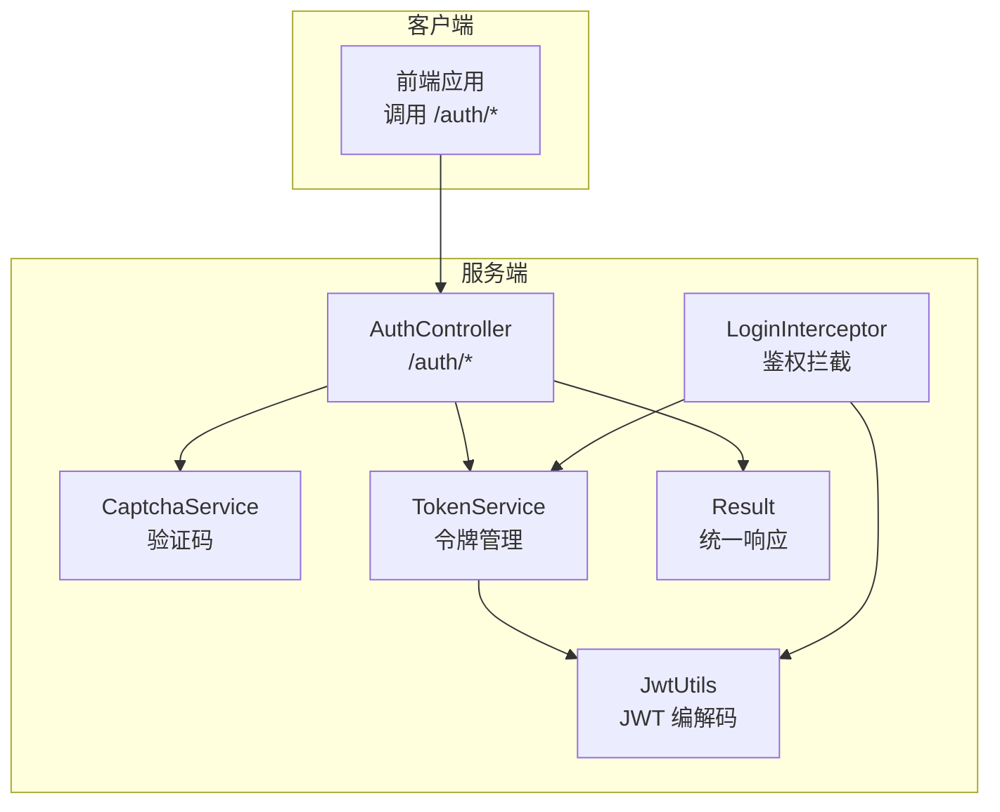
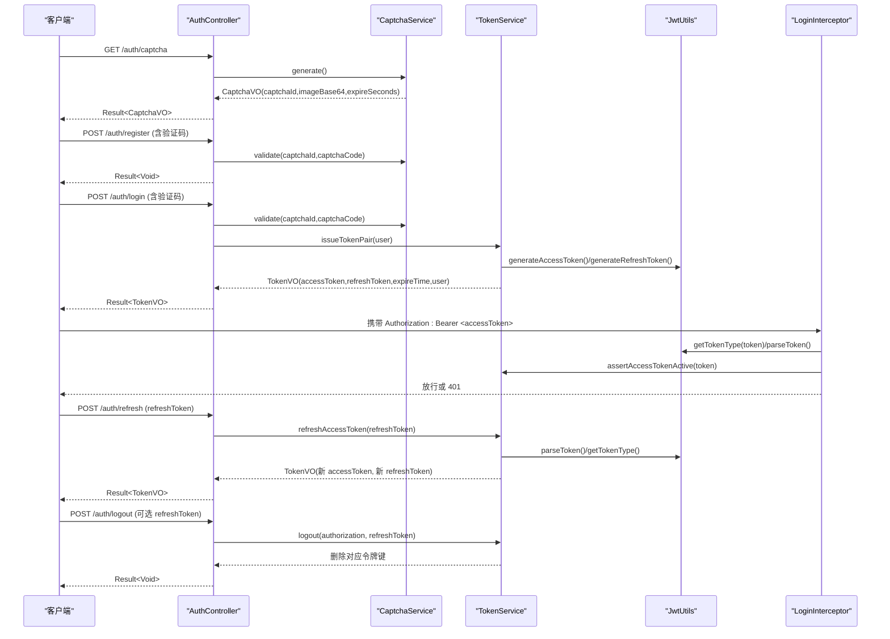
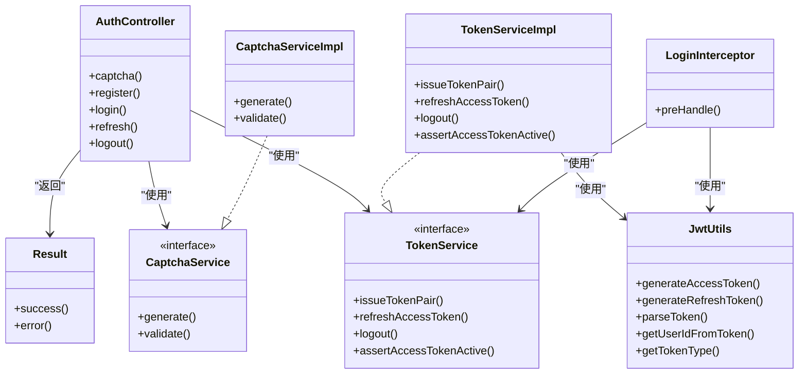

# 认证接口

<cite>
**本文引用的文件**
- [AuthController.java](file://linkx-server/src/main/java/com/linkx/server/controller/AuthController.java)
- [LoginInterceptor.java](file://linkx-server/src/main/java/com/linkx/server/config/interceptor/LoginInterceptor.java)
- [JwtUtils.java](file://linkx-server/src/main/java/com/linkx/server/common/JwtUtils.java)
- [TokenService.java](file://linkx-server/src/main/java/com/linkx/server/service/TokenService.java)
- [TokenServiceImpl.java](file://linkx-server/src/main/java/com/linkx/server/service/impl/TokenServiceImpl.java)
- [CaptchaService.java](file://linkx-server/src/main/java/com/linkx/server/service/CaptchaService.java)
- [CaptchaServiceImpl.java](file://linkx-server/src/main/java/com/linkx/server/service/impl/CaptchaServiceImpl.java)
- [Result.java](file://linkx-server/src/main/java/com/linkx/server/common/Result.java)
- [RegisterDTO.java](file://linkx-server/src/main/java/com/linkx/server/controller/dto/RegisterDTO.java)
- [LoginDTO.java](file://linkx-server/src/main/java/com/linkx/server/controller/dto/LoginDTO.java)
- [RefreshTokenDTO.java](file://linkx-server/src/main/java/com/linkx/server/controller/dto/RefreshTokenDTO.java)
- [LogoutDTO.java](file://linkx-server/src/main/java/com/linkx/server/controller/dto/LogoutDTO.java)
- [CaptchaVO.java](file://linkx-server/src/main/java/com/linkx/server/controller/vo/CaptchaVO.java)
- [TokenVO.java](file://linkx-server/src/main/java/com/linkx/server/controller/vo/TokenVO.java)
- [auth.ts](file://linkx-client/src/api/auth.ts)
- [auth.ts（类型定义）](file://linkx-client/src/types/auth.ts)
</cite>

## 目录
1. [简介](#简介)
2. [项目结构](#项目结构)
3. [核心组件](#核心组件)
4. [架构总览](#架构总览)
5. [详细接口说明](#详细接口说明)
6. [依赖关系分析](#依赖关系分析)
7. [性能与限流](#性能与限流)
8. [安全与最佳实践](#安全与最佳实践)
9. [故障排查指南](#故障排查指南)
10. [结论](#结论)

## 简介
本文件为 LinkX 认证模块的 API 文档，覆盖用户注册、登录、登出、令牌刷新和验证码获取等全部认证相关 RESTful 端点。文档包含：
- 每个接口的 HTTP 方法、URL、请求参数、响应结构与错误码
- JWT 令牌管理机制与刷新流程
- 验证码生成与校验流程
- 限流策略与安全建议
- 完整的请求与响应示例路径（以源码文件引用形式提供）

## 项目结构
认证功能在后端由控制器、服务层、工具类与拦截器共同实现；前端通过统一的 API 客户端调用后端接口并处理统一响应体。

图示来源
- [AuthController.java:25-84](file://linkx-server/src/main/java/com/linkx/server/controller/AuthController.java#L25-L84)
- [LoginInterceptor.java:14-53](file://linkx-server/src/main/java/com/linkx/server/config/interceptor/LoginInterceptor.java#L14-L53)
- [CaptchaService.java:5-11](file://linkx-server/src/main/java/com/linkx/server/service/CaptchaService.java#L5-L11)
- [TokenService.java:6-16](file://linkx-server/src/main/java/com/linkx/server/service/TokenService.java#L6-L16)
- [JwtUtils.java:15-76](file://linkx-server/src/main/java/com/linkx/server/common/JwtUtils.java#L15-L76)
- [Result.java:18-95](file://linkx-server/src/main/java/com/linkx/server/common/Result.java#L18-L95)

章节来源
- [AuthController.java:25-84](file://linkx-server/src/main/java/com/linkx/server/controller/AuthController.java#L25-L84)
- [auth.ts:1-25](file://linkx-client/src/api/auth.ts#L1-L25)

## 核心组件
- 认证控制器 AuthController：暴露 /auth/captcha、/auth/register、/auth/login、/auth/refresh、/auth/logout 五个端点，负责参数校验、验证码校验、委托服务层处理业务逻辑。
- 令牌服务 TokenService/TokenServiceImpl：负责签发访问令牌与刷新令牌、刷新访问令牌、注销令牌的 Redis 状态管理与 Lua 原子操作。
- 验证码服务 CaptchaService/CaptchaServiceImpl：生成图片验证码（Base64）、存储至 Redis 并提供一次性校验。
- JWT 工具 JwtUtils：基于 HMAC-SHA 签名生成与解析 JWT，提取 claims 信息。
- 登录拦截器 LoginInterceptor：对受保护资源进行 Bearer Token 校验与有效性检查。
- 统一响应 Result：所有接口返回统一结构 { code, message, data }。

章节来源
- [AuthController.java:25-84](file://linkx-server/src/main/java/com/linkx/server/controller/AuthController.java#L25-L84)
- [TokenService.java:6-16](file://linkx-server/src/main/java/com/linkx/server/service/TokenService.java#L6-L16)
- [TokenServiceImpl.java:25-204](file://linkx-server/src/main/java/com/linkx/server/service/impl/TokenServiceImpl.java#L25-L204)
- [CaptchaService.java:5-11](file://linkx-server/src/main/java/com/linkx/server/service/CaptchaService.java#L5-L11)
- [CaptchaServiceImpl.java:22-122](file://linkx-server/src/main/java/com/linkx/server/service/impl/CaptchaServiceImpl.java#L22-L122)
- [JwtUtils.java:15-76](file://linkx-server/src/main/java/com/linkx/server/common/JwtUtils.java#L15-L76)
- [LoginInterceptor.java:14-53](file://linkx-server/src/main/java/com/linkx/server/config/interceptor/LoginInterceptor.java#L14-L53)
- [Result.java:18-95](file://linkx-server/src/main/java/com/linkx/server/common/Result.java#L18-L95)

## 架构总览
认证流程涉及“验证码 -> 注册/登录 -> 签发令牌 -> 后续请求鉴权 -> 刷新令牌 -> 登出”的完整链路。

图示来源
- [AuthController.java:36-68](file://linkx-server/src/main/java/com/linkx/server/controller/AuthController.java#L36-L68)
- [CaptchaServiceImpl.java:46-81](file://linkx-server/src/main/java/com/linkx/server/service/impl/CaptchaServiceImpl.java#L46-L81)
- [TokenServiceImpl.java:47-117](file://linkx-server/src/main/java/com/linkx/server/service/impl/TokenServiceImpl.java#L47-L117)
- [JwtUtils.java:31-74](file://linkx-server/src/main/java/com/linkx/server/common/JwtUtils.java#L31-L74)
- [LoginInterceptor.java:21-51](file://linkx-server/src/main/java/com/linkx/server/config/interceptor/LoginInterceptor.java#L21-L51)

## 详细接口说明

### 通用约定
- 基础路径：/auth
- 统一响应体：Result<T>，字段包括 code、message、data
- 成功时 code=200，message="success"
- 失败时根据业务返回相应 code 与 message，data 通常为 null

章节来源
- [Result.java:18-95](file://linkx-server/src/main/java/com/linkx/server/common/Result.java#L18-L95)

---

### 获取验证码
- 方法：GET
- 路径：/auth/captcha
- 请求头：无特殊要求
- 请求体：无
- 响应数据：Result<CaptchaVO>
  - data.captchaId：验证码唯一标识
  - data.imageBase64：Base64 编码的图片数据（可直接用于 img src）
  - data.expireSeconds：验证码有效期秒数
- 错误码：
  - 200：成功
  - 500：验证码生成失败（内部异常）

章节来源
- [AuthController.java:36-39](file://linkx-server/src/main/java/com/linkx/server/controller/AuthController.java#L36-L39)
- [CaptchaServiceImpl.java:46-57](file://linkx-server/src/main/java/com/linkx/server/service/impl/CaptchaServiceImpl.java#L46-L57)
- [CaptchaVO.java:6-13](file://linkx-server/src/main/java/com/linkx/server/controller/vo/CaptchaVO.java#L6-L13)

---

### 用户注册
- 方法：POST
- 路径：/auth/register
- 请求头：Content-Type: application/json
- 请求体：RegisterDTO
  - username：用户名，必填，长度 4-32，仅字母数字下划线
  - password：密码，必填，长度 8-64，须同时包含字母与数字
  - nickname：昵称，必填，长度 1-64
  - captchaId：验证码 ID，可选（当配置开启验证码时必填）
  - captchaCode：验证码内容，可选（当配置开启验证码时必填）
- 响应数据：Result<Void>
- 错误码：
  - 200：注册成功
  - 400：参数校验失败或验证码错误/过期
  - 500：服务器内部错误

章节来源
- [AuthController.java:41-46](file://linkx-server/src/main/java/com/linkx/server/controller/AuthController.java#L41-L46)
- [RegisterDTO.java:8-28](file://linkx-server/src/main/java/com/linkx/server/controller/dto/RegisterDTO.java#L8-L28)
- [CaptchaServiceImpl.java:59-81](file://linkx-server/src/main/java/com/linkx/server/service/impl/CaptchaServiceImpl.java#L59-L81)

---

### 用户登录
- 方法：POST
- 路径：/auth/login
- 请求头：Content-Type: application/json
- 请求体：LoginDTO
  - username：用户名，必填，长度 4-32，仅字母数字下划线
  - password：密码，必填，长度 8-64
  - captchaId：验证码 ID，可选（当配置开启验证码时必填）
  - captchaCode：验证码内容，可选（当配置开启验证码时必填）
- 响应数据：Result<TokenVO>
  - data.accessToken：短期访问令牌，后续请求需放入 Authorization: Bearer
  - data.refreshToken：长期刷新令牌，用于刷新访问令牌
  - data.expireTime：访问令牌过期时间戳（毫秒）
  - data.user：当前用户基本信息对象
- 错误码：
  - 200：登录成功
  - 400：参数校验失败或验证码错误/过期
  - 401：用户名或密码错误（由服务层抛出）
  - 500：服务器内部错误

章节来源
- [AuthController.java:48-53](file://linkx-server/src/main/java/com/linkx/server/controller/AuthController.java#L48-L53)
- [LoginDTO.java:8-23](file://linkx-server/src/main/java/com/linkx/server/controller/dto/LoginDTO.java#L8-L23)
- [TokenServiceImpl.java:47-64](file://linkx-server/src/main/java/com/linkx/server/service/impl/TokenServiceImpl.java#L47-L64)
- [TokenVO.java:15-31](file://linkx-server/src/main/java/com/linkx/server/controller/vo/TokenVO.java#L15-L31)

---

### 刷新访问令牌
- 方法：POST
- 路径：/auth/refresh
- 请求头：Content-Type: application/json
- 请求体：RefreshTokenDTO
  - refreshToken：刷新令牌，必填
- 响应数据：Result<TokenVO>（同登录响应结构）
- 错误码：
  - 200：刷新成功
  - 401：refreshToken 无效、已过期或类型不正确
  - 429：刷新过于频繁（分布式锁限制）
  - 500：服务器内部错误

章节来源
- [AuthController.java:55-59](file://linkx-server/src/main/java/com/linkx/server/controller/AuthController.java#L55-L59)
- [RefreshTokenDTO.java:6-12](file://linkx-server/src/main/java/com/linkx/server/controller/dto/RefreshTokenDTO.java#L6-L12)
- [TokenServiceImpl.java:66-117](file://linkx-server/src/main/java/com/linkx/server/service/impl/TokenServiceImpl.java#L66-L117)

---

### 用户登出
- 方法：POST
- 路径：/auth/logout
- 请求头：Authorization: Bearer <accessToken>（可选，若携带则撤销该访问令牌）
- 请求体：LogoutDTO（可选）
  - refreshToken：刷新令牌（可选，若携带则撤销该刷新令牌）
- 响应数据：Result<Void>
- 错误码：
  - 200：登出成功
  - 500：服务器内部错误

章节来源
- [AuthController.java:61-68](file://linkx-server/src/main/java/com/linkx/server/controller/AuthController.java#L61-L68)
- [LogoutDTO.java:5-9](file://linkx-server/src/main/java/com/linkx/server/controller/dto/LogoutDTO.java#L5-L9)
- [TokenServiceImpl.java:119-123](file://linkx-server/src/main/java/com/linkx/server/service/impl/TokenServiceImpl.java#L119-L123)

---

### 受保护资源鉴权（拦截器）
- 适用范围：除认证相关公开接口外的其他需要登录态的接口
- 鉴权方式：请求头 Authorization: Bearer <accessToken>
- 校验逻辑：
  - 解析 token 并验证类型为 ACCESS
  - 检查 Redis 中是否存在对应的访问令牌键
  - 将 userId 写入请求属性供后续使用
- 失败响应：401 未登录或登录已过期

章节来源
- [LoginInterceptor.java:21-51](file://linkx-server/src/main/java/com/linkx/server/config/interceptor/LoginInterceptor.java#L21-L51)
- [TokenServiceImpl.java:125-136](file://linkx-server/src/main/java/com/linkx/server/service/impl/TokenServiceImpl.java#L125-L136)
- [JwtUtils.java:66-74](file://linkx-server/src/main/java/com/linkx/server/common/JwtUtils.java#L66-L74)

## 依赖关系分析
认证相关类的职责与依赖如下：

图示来源
- [AuthController.java:25-84](file://linkx-server/src/main/java/com/linkx/server/controller/AuthController.java#L25-L84)
- [CaptchaService.java:5-11](file://linkx-server/src/main/java/com/linkx/server/service/CaptchaService.java#L5-L11)
- [CaptchaServiceImpl.java:22-122](file://linkx-server/src/main/java/com/linkx/server/service/impl/CaptchaServiceImpl.java#L22-L122)
- [TokenService.java:6-16](file://linkx-server/src/main/java/com/linkx/server/service/TokenService.java#L6-L16)
- [TokenServiceImpl.java:25-204](file://linkx-server/src/main/java/com/linkx/server/service/impl/TokenServiceImpl.java#L25-L204)
- [JwtUtils.java:15-76](file://linkx-server/src/main/java/com/linkx/server/common/JwtUtils.java#L15-L76)
- [LoginInterceptor.java:14-53](file://linkx-server/src/main/java/com/linkx/server/config/interceptor/LoginInterceptor.java#L14-L53)
- [Result.java:18-95](file://linkx-server/src/main/java/com/linkx/server/common/Result.java#L18-L95)

## 性能与限流
- 验证码校验与刷新令牌均使用 Redis + Lua 脚本保证原子性，避免竞态条件与重复消费。
- 刷新令牌接口对同一 IP 在 60 秒内最多允许 30 次刷新请求，超出返回 429。
- 刷新令牌过程中使用分布式锁防止并发刷新导致重复发放令牌。

章节来源
- [CaptchaServiceImpl.java:31-81](file://linkx-server/src/main/java/com/linkx/server/service/impl/CaptchaServiceImpl.java#L31-L81)
- [TokenServiceImpl.java:88-117](file://linkx-server/src/main/java/com/linkx/server/service/impl/TokenServiceImpl.java#L88-L117)
- [AuthController.java:55-59](file://linkx-server/src/main/java/com/linkx/server/controller/AuthController.java#L55-L59)

## 安全与最佳实践
- 令牌机制
  - 访问令牌（ACCESS）短期有效，刷新令牌（REFRESH）长期有效，二者均通过 HMAC-SHA 签名。
  - 访问令牌需在 Redis 中存在才视为有效；刷新令牌采用一次性使用（Lua 原子删除）。
- 传输安全
  - 建议在 HTTPS 环境下传输，避免中间人攻击。
- 输入校验
  - 用户名、密码、昵称等字段在服务端进行严格校验，防止注入与越界。
- 验证码
  - 验证码图片 Base64 直接返回，前端展示后提交 captchaId 与 captchaCode，服务端一次性校验并删除。
- 限流与防刷
  - 刷新接口按 IP 限流；验证码校验失败会主动删除 key，防止暴力破解。
- 登出
  - 支持选择性撤销访问令牌或刷新令牌；建议客户端在登出时同时清理本地缓存。

章节来源
- [JwtUtils.java:31-74](file://linkx-server/src/main/java/com/linkx/server/common/JwtUtils.java#L31-L74)
- [TokenServiceImpl.java:47-117](file://linkx-server/src/main/java/com/linkx/server/service/impl/TokenServiceImpl.java#L47-L117)
- [CaptchaServiceImpl.java:59-81](file://linkx-server/src/main/java/com/linkx/server/service/impl/CaptchaServiceImpl.java#L59-L81)
- [LoginInterceptor.java:21-51](file://linkx-server/src/main/java/com/linkx/server/config/interceptor/LoginInterceptor.java#L21-L51)

## 故障排查指南
- 401 未登录或登录已过期
  - 检查 Authorization 头是否携带正确的 Bearer 访问令牌
  - 确认 Redis 中是否存在对应访问令牌键
- 400 验证码错误/过期
  - 确认 captchaId 与 captchaCode 是否正确且未过期
  - 注意验证码为一次性使用，重复提交会失败
- 429 刷新过于频繁
  - 降低刷新频率，等待一段时间后再试
- 500 服务器内部错误
  - 查看服务端日志定位具体异常堆栈

章节来源
- [LoginInterceptor.java:21-51](file://linkx-server/src/main/java/com/linkx/server/config/interceptor/LoginInterceptor.java#L21-L51)
- [CaptchaServiceImpl.java:59-81](file://linkx-server/src/main/java/com/linkx/server/service/impl/CaptchaServiceImpl.java#L59-L81)
- [TokenServiceImpl.java:66-117](file://linkx-server/src/main/java/com/linkx/server/service/impl/TokenServiceImpl.java#L66-L117)

## 结论
LinkX 认证模块通过清晰的控制器与服务分层、严格的参数校验、Redis 原子化操作与 JWT 双令牌机制，提供了安全可靠的认证能力。开发者可依据本文档快速集成注册、登录、登出与令牌刷新流程，并结合限流与安全建议保障系统稳定性与安全性。