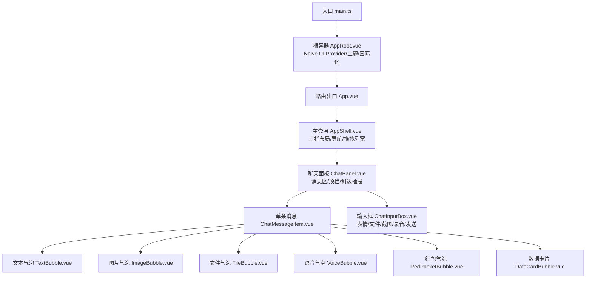
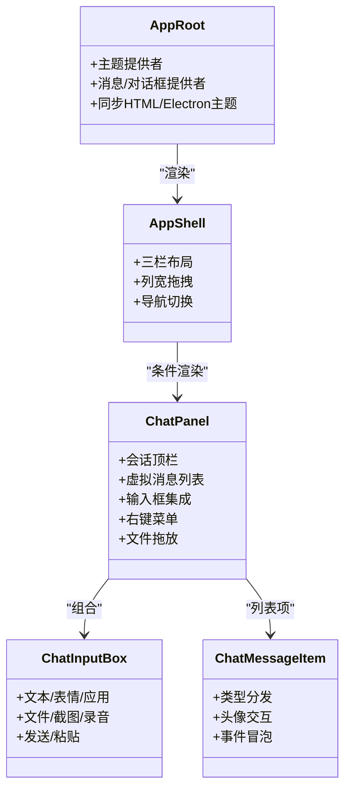
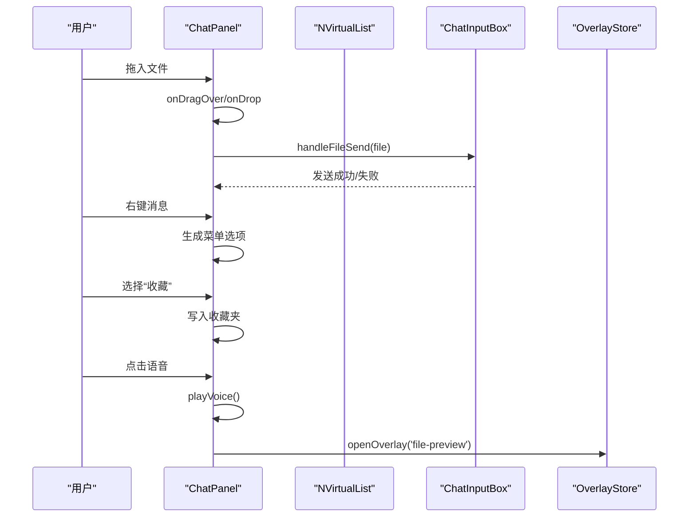
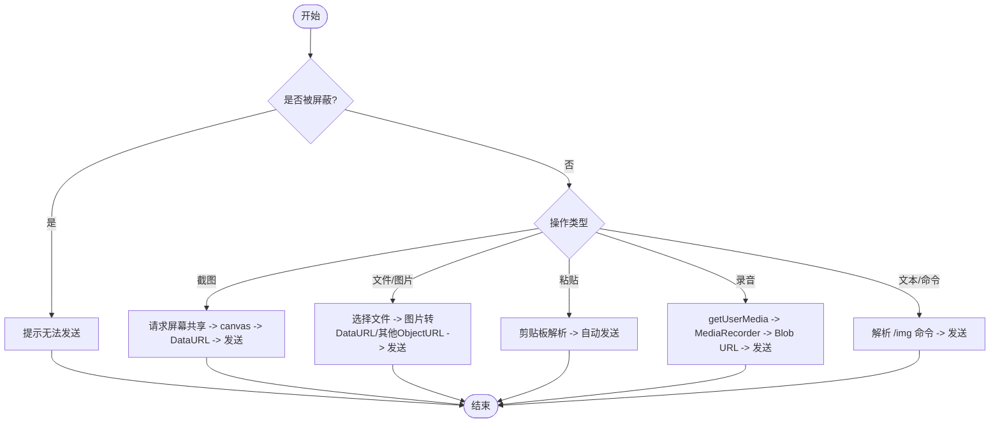
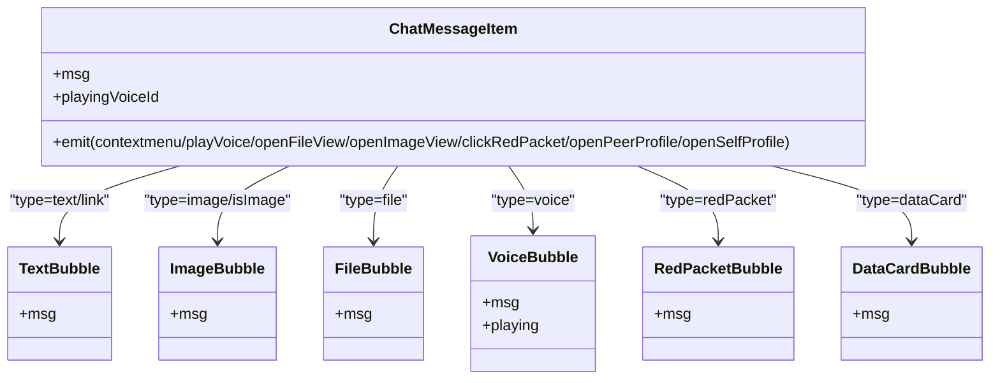
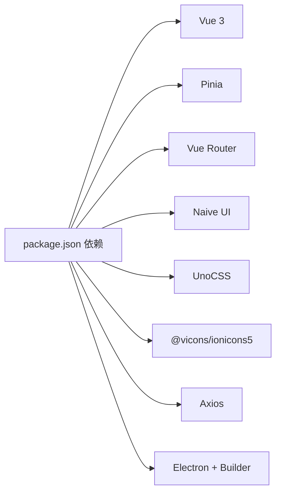

# UI 组件系统

<cite>
**本文引用的文件**
- [main.ts](file://linkx-client/src/main.ts)
- [AppRoot.vue](file://linkx-client/src/AppRoot.vue)
- [App.vue](file://linkx-client/src/App.vue)
- [styles.css](file://linkx-client/src/assets/styles.css)
- [vars.ts](file://linkx-client/src/theme/vars.ts)
- [package.json](file://linkx-client/package.json)
- [AppShell.vue](file://linkx-client/src/components/AppShell.vue)
- [ChatPanel.vue](file://linkx-client/src/components/ChatPanel.vue)
- [ChatInputBox.vue](file://linkx-client/src/components/chat/ChatInputBox.vue)
- [ChatMessageItem.vue](file://linkx-client/src/components/chat/ChatMessageItem.vue)
- [TextBubble.vue](file://linkx-client/src/components/chat/bubbles/TextBubble.vue)
- [ImageBubble.vue](file://linkx-client/src/components/chat/bubbles/ImageBubble.vue)
- [FileBubble.vue](file://linkx-client/src/components/chat/bubbles/FileBubble.vue)
- [VoiceBubble.vue](file://linkx-client/src/components/chat/bubbles/VoiceBubble.vue)
- [RedPacketBubble.vue](file://linkx-client/src/components/chat/bubbles/RedPacketBubble.vue)
- [DataCardBubble.vue](file://linkx-client/src/components/chat/bubbles/DataCardBubble.vue)
</cite>

## 目录
1. [简介](#简介)
2. [项目结构](#项目结构)
3. [核心组件](#核心组件)
4. [架构总览](#架构总览)
5. [详细组件分析](#详细组件分析)
6. [依赖关系分析](#依赖关系分析)
7. [性能与可访问性](#性能与可访问性)
8. [主题与样式定制指南](#主题与样式定制指南)
9. [故障排查](#故障排查)
10. [结论](#结论)

## 简介
本文件面向 LinkX 桌面客户端的 UI 组件系统，聚焦基于 Naive UI 的组件架构、自定义聊天组件实现与主题定制方案。文档覆盖：
- 核心布局（三栏主壳层）、聊天界面（消息列表、输入框、气泡）、对话框与弹窗体系
- 属性配置、事件处理、插槽使用与样式定制
- 响应式设计与跨浏览器兼容策略
- 无障碍访问支持要点
- 为开发者提供扩展与二次开发指导

## 项目结构
前端采用 Vue 3 + Pinia + Vue Router + Naive UI + UnoCSS 技术栈，通过 Electron 打包为桌面应用。UI 根容器负责全局主题与 Provider 注入，主壳层承载三栏布局与功能面板切换，聊天模块由 ChatPanel 组合多个子组件完成。

图示来源
- [main.ts:1-64](file://linkx-client/src/main.ts#L1-L64)
- [AppRoot.vue:1-105](file://linkx-client/src/AppRoot.vue#L1-L105)
- [App.vue:1-26](file://linkx-client/src/App.vue#L1-L26)
- [AppShell.vue:1-345](file://linkx-client/src/components/AppShell.vue#L1-L345)
- [ChatPanel.vue:1-800](file://linkx-client/src/components/ChatPanel.vue#L1-L800)
- [ChatMessageItem.vue:1-176](file://linkx-client/src/components/chat/ChatMessageItem.vue#L1-L176)
- [ChatInputBox.vue:1-749](file://linkx-client/src/components/chat/ChatInputBox.vue#L1-L749)

章节来源
- [main.ts:1-64](file://linkx-client/src/main.ts#L1-L64)
- [AppRoot.vue:1-105](file://linkx-client/src/AppRoot.vue#L1-L105)
- [App.vue:1-26](file://linkx-client/src/App.vue#L1-L26)
- [AppShell.vue:1-345](file://linkx-client/src/components/AppShell.vue#L1-L345)

## 核心组件
- 应用根容器（AppRoot）
  - 职责：挂载 Naive UI 全局 Provider（主题、语言、消息、对话框），同步 HTML data-theme 与 Electron 原生主题，渲染主应用与锁屏层。
  - 关键行为：根据 store 中的 theme 计算 darkTheme；通过 themeOverrides 统一圆角、主色、背景与文字色；监听主题变化并通知 Electron。
- 主壳层（AppShell）
  - 职责：三栏布局（左侧导航、中间列表、右侧内容），支持中间列宽度拖拽调整；按 navKey 动态渲染不同面板；管理全屏 Overlay 宿主。
  - 交互：窗口焦点态用于原生材质效果；拖拽分隔条限制最小/最大宽度。
- 聊天面板（ChatPanel）
  - 职责：会话顶栏（好友/群聊/我的手机）、消息虚拟列表、输入框、右键菜单、文件拖放、语音播放控制、Overlay 打开等。
  - 状态：当前会话、消息列表、回复目标、正在播放语音、加载历史消息等。
- 输入框（ChatInputBox）
  - 职责：文本输入、表情、应用快捷、文件/图片选择、截图、语音录制、红包、发送；支持粘贴自动发送、Enter 发送、Shift+Enter 换行。
  - 能力：MediaRecorder 录音、剪贴板读取、文件大小校验、DataURL 转换、URL.createObjectURL 生成临时链接。
- 消息项（ChatMessageItem）
  - 职责：根据消息类型分发到对应气泡组件；头像点击打开资料卡；向父级冒泡上下文菜单、播放、预览等事件。
- 气泡组件族
  - 文本气泡：识别链接类消息，展示引用条。
  - 图片气泡：点击触发父级图片预览。
  - 文件气泡：显示文件名、大小与状态条。
  - 语音气泡：时长格式化，播放态高亮。
  - 红包气泡：已领取状态与文案提示。
  - 数据卡片：结构化信息展示（如套餐）。

章节来源
- [AppRoot.vue:1-105](file://linkx-client/src/AppRoot.vue#L1-L105)
- [AppShell.vue:1-345](file://linkx-client/src/components/AppShell.vue#L1-L345)
- [ChatPanel.vue:1-800](file://linkx-client/src/components/ChatPanel.vue#L1-L800)
- [ChatInputBox.vue:1-749](file://linkx-client/src/components/chat/ChatInputBox.vue#L1-L749)
- [ChatMessageItem.vue:1-176](file://linkx-client/src/components/chat/ChatMessageItem.vue#L1-L176)
- [TextBubble.vue:1-33](file://linkx-client/src/components/chat/bubbles/TextBubble.vue#L1-L33)
- [ImageBubble.vue:1-19](file://linkx-client/src/components/chat/bubbles/ImageBubble.vue#L1-L19)
- [FileBubble.vue:1-32](file://linkx-client/src/components/chat/bubbles/FileBubble.vue#L1-L32)
- [VoiceBubble.vue:1-33](file://linkx-client/src/components/chat/bubbles/VoiceBubble.vue#L1-L33)
- [RedPacketBubble.vue:1-25](file://linkx-client/src/components/chat/bubbles/RedPacketBubble.vue#L1-L25)
- [DataCardBubble.vue:1-106](file://linkx-client/src/components/chat/bubbles/DataCardBubble.vue#L1-L106)

## 架构总览
整体遵循“Provider 注入 → 路由渲染 → 壳层布局 → 功能面板”的分层模式。主题与语言在根容器集中配置，业务面板通过 Pinia 共享状态，弹窗与浮层通过 Overlay 统一管理。

图示来源
- [AppRoot.vue:1-105](file://linkx-client/src/AppRoot.vue#L1-L105)
- [AppShell.vue:1-345](file://linkx-client/src/components/AppShell.vue#L1-L345)
- [ChatPanel.vue:1-800](file://linkx-client/src/components/ChatPanel.vue#L1-L800)
- [ChatInputBox.vue:1-749](file://linkx-client/src/components/chat/ChatInputBox.vue#L1-L749)
- [ChatMessageItem.vue:1-176](file://linkx-client/src/components/chat/ChatMessageItem.vue#L1-L176)

## 详细组件分析

### 聊天面板（ChatPanel）
- 视觉外观
  - 顶部操作区：好友会话显示头像、在线点、通话与更多按钮；群聊显示群名、群应用网格菜单、邀请与更多。
  - 消息区：支持自定义背景（渐变或变量），虚拟列表高效渲染，滚动到底部与加载更多历史消息。
  - 输入区：与 ChatInputBox 组合，支持拖放文件遮罩提示。
- 行为模式
  - 会话类型判断：好友/群聊/我的手机，分别渲染不同顶栏与侧边抽屉。
  - 右键菜单：复制、收藏、回复、撤回（仅自己消息）。
  - 文件拖放：dragover/dragleave/drop 控制遮罩与调用输入框发送。
  - 语音播放：单例 Audio 实例，播放结束清除状态。
- 用户交互
  - 点击对方头像打开联系人资料卡；点击自己头像打开个人资料。
  - 群应用网格菜单打开对应弹窗（群文件/相册/精华/公告）。
- 属性与事件
  - 内部维护 playingVoiceId、replyingTo、loadingMore 等状态。
  - 通过 ChatInputBox 暴露 handleFileSend 供外部拖放调用。
- 样式定制
  - 使用 CSS 变量控制背景、阴影、圆角与颜色；通过 chatBgStyle 动态设置背景。

图示来源
- [ChatPanel.vue:1-800](file://linkx-client/src/components/ChatPanel.vue#L1-L800)
- [ChatInputBox.vue:1-749](file://linkx-client/src/components/chat/ChatInputBox.vue#L1-L749)

章节来源
- [ChatPanel.vue:1-800](file://linkx-client/src/components/ChatPanel.vue#L1-L800)

### 输入框（ChatInputBox）
- 视觉外观
  - 多行文本输入框，工具栏包含表情、应用、文件、截图、红包、语音、通话与发送按钮。
  - 回复预览条带左边框强调色，关闭按钮悬停变危险色。
- 行为模式
  - 发送前校验：屏蔽联系人不可发送。
  - 截图：getDisplayMedia 捕获屏幕，canvas 转 DataURL，大小阈值校验。
  - 文件/图片：选择后统一走 handleFileSend，图片转 DataURL，其他文件用 Object URL。
  - 粘贴：自动识别图片/文件并发送。
  - 录音：MediaRecorder 录制，权限失败降级发送占位语音。
  - 命令：/img 开头作为图片发送。
- 用户交互
  - Enter 发送，Shift+Enter 换行；表情与应用面板弹出定位。
- 属性与事件
  - props：isMyPhone、isFriendChat、isGroupChat、replyingTo。
  - emits：update:replyingTo、scrollToBottom。
  - expose：handleFileSend。

图示来源
- [ChatInputBox.vue:1-749](file://linkx-client/src/components/chat/ChatInputBox.vue#L1-L749)

章节来源
- [ChatInputBox.vue:1-749](file://linkx-client/src/components/chat/ChatInputBox.vue#L1-L749)

### 消息项与气泡（ChatMessageItem 及 bubbles）
- 消息项
  - 根据 isSelf 决定左右对齐；非自己且好友会话时头像可点击打开资料卡。
  - 将 contextmenu、playVoice、openFileView、openImageView、clickRedPacket、openPeerProfile、openSelfProfile 等事件向上冒泡。
- 气泡组件
  - 文本气泡：识别链接类消息，展示引用条。
  - 图片气泡：点击触发父级图片预览。
  - 文件气泡：显示文件名、大小与状态条。
  - 语音气泡：时长格式化，playing 高亮。
  - 红包气泡：已领取状态与文案。
  - 数据卡片：结构化信息展示。

图示来源
- [ChatMessageItem.vue:1-176](file://linkx-client/src/components/chat/ChatMessageItem.vue#L1-L176)
- [TextBubble.vue:1-33](file://linkx-client/src/components/chat/bubbles/TextBubble.vue#L1-L33)
- [ImageBubble.vue:1-19](file://linkx-client/src/components/chat/bubbles/ImageBubble.vue#L1-L19)
- [FileBubble.vue:1-32](file://linkx-client/src/components/chat/bubbles/FileBubble.vue#L1-L32)
- [VoiceBubble.vue:1-33](file://linkx-client/src/components/chat/bubbles/VoiceBubble.vue#L1-L33)
- [RedPacketBubble.vue:1-25](file://linkx-client/src/components/chat/bubbles/RedPacketBubble.vue#L1-L25)
- [DataCardBubble.vue:1-106](file://linkx-client/src/components/chat/bubbles/DataCardBubble.vue#L1-L106)

章节来源
- [ChatMessageItem.vue:1-176](file://linkx-client/src/components/chat/ChatMessageItem.vue#L1-L176)
- [TextBubble.vue:1-33](file://linkx-client/src/components/chat/bubbles/TextBubble.vue#L1-L33)
- [ImageBubble.vue:1-19](file://linkx-client/src/components/chat/bubbles/ImageBubble.vue#L1-L19)
- [FileBubble.vue:1-32](file://linkx-client/src/components/chat/bubbles/FileBubble.vue#L1-L32)
- [VoiceBubble.vue:1-33](file://linkx-client/src/components/chat/bubbles/VoiceBubble.vue#L1-L33)
- [RedPacketBubble.vue:1-25](file://linkx-client/src/components/chat/bubbles/RedPacketBubble.vue#L1-L25)
- [DataCardBubble.vue:1-106](file://linkx-client/src/components/chat/bubbles/DataCardBubble.vue#L1-L106)

### 主壳层（AppShell）
- 视觉外观
  - 顶部状态栏、左侧固定宽度导航、中间可拖拽列宽列表、右侧主内容区；底部媒体播放条；Overlay 宿主。
- 行为模式
  - 根据 navKey 动态渲染不同面板（聊天、联系人、收藏、文件、日历、友链、应用）。
  - 拖拽分隔条更新中间列宽度，限制范围 200~500px。
  - 窗口焦点/失焦监听，影响原生材质表现。
- 用户交互
  - 鼠标拖拽改变列宽；在不同导航间切换。
- 样式定制
  - 大量使用 CSS 变量控制背景、阴影、圆角与分割线；resizer 悬停/拖拽高亮。

章节来源
- [AppShell.vue:1-345](file://linkx-client/src/components/AppShell.vue#L1-L345)

## 依赖关系分析
- 运行时依赖
  - Vue 3、Pinia、Vue Router、Naive UI、UnoCSS、Axios、Ionicons5 图标集。
- 构建与打包
  - Vite 构建，Electron + electron-builder 打包为 NSIS/DMG/AppImage。
- 组件耦合
  - AppRoot 提供全局主题与 Provider，AppShell 组织页面骨架，ChatPanel 组合输入与消息项，气泡组件低耦合只关注自身渲染。

图示来源
- [package.json:1-62](file://linkx-client/package.json#L1-L62)

章节来源
- [package.json:1-62](file://linkx-client/package.json#L1-L62)

## 性能与可访问性
- 性能
  - 聊天消息使用 NVirtualList 虚拟列表，减少长列表渲染开销。
  - 异步懒加载弹窗与面板，降低首屏包体积。
  - 语音播放使用单例 Audio，避免重复创建。
- 可访问性
  - 头像按钮添加 focus-visible 轮廓，提升键盘可达性。
  - 语义化标签与 aria 建议：为交互按钮提供 title 与 role，必要时补充 aria-label。
- 响应式与兼容性
  - 使用 Flexbox 与 CSS 变量实现自适应布局；隐藏滚动条但保留滚轮/触控滑动。
  - 截图与录音依赖现代 Web API，在不支持的浏览器中给出友好提示或降级。

[本节为通用指导，不直接分析具体文件]

## 主题与样式定制指南
- 设计 Token
  - styles.css 定义全局 CSS 变量（背景、品牌色、文字、边框、阴影、圆角等），并通过 [data-theme='dark'] 切换暗色。
  - vars.ts 提供脚本侧引用 lxVar 与 naiveThemeColors，确保模板与 Naive UI 主题一致。
- 主题同步
  - main.ts 启动时 applyDocumentTheme 并 initCrossWindowThemeSync 实现多窗口联动。
  - AppRoot.vue 根据 theme 计算 darkTheme 与 themeOverrides，并在 watch 中同步 HTML 与 Electron 原生主题。
- 组件内样式
  - 各组件优先使用 CSS 变量，避免硬编码颜色；通过 :deep() 覆盖 Naive UI 内部样式（如搜索框、输入框）。
- 最佳实践
  - 新增 Token 时在 styles.css 与 vars.ts 同步维护。
  - 主题切换时确保所有组件使用变量而非常量，避免样式漂移。

章节来源
- [styles.css:1-313](file://linkx-client/src/assets/styles.css#L1-L313)
- [vars.ts:1-30](file://linkx-client/src/theme/vars.ts#L1-L30)
- [main.ts:1-64](file://linkx-client/src/main.ts#L1-L64)
- [AppRoot.vue:1-105](file://linkx-client/src/AppRoot.vue#L1-L105)

## 故障排查
- 语音无法播放
  - 检查 voiceUrl 是否存在；Audio.play 可能因权限或格式问题失败，需捕获错误并提示。
- 截图失败
  - getDisplayMedia 需要用户授权；若拒绝或环境不支持，应提示并回退。
- 录音失败
  - getUserMedia 权限失败时降级发送占位语音；注意清理轨道释放设备占用。
- 主题不一致
  - 确认 document data-theme 与 Naive UI themeOverrides 一致；路由切换前重新应用主题。
- 弹窗层级异常
  - 高层级弹窗内的日期/下拉浮层 z-index 需高于弹窗本身，已在样式中处理。

章节来源
- [ChatPanel.vue:1-800](file://linkx-client/src/components/ChatPanel.vue#L1-L800)
- [ChatInputBox.vue:1-749](file://linkx-client/src/components/chat/ChatInputBox.vue#L1-L749)
- [styles.css:1-313](file://linkx-client/src/assets/styles.css#L1-L313)

## 结论
LinkX UI 组件系统以 Naive UI 为基础，结合 CSS 变量与主题覆盖实现一致的视觉风格；通过虚拟列表、懒加载与 Provider 注入保障性能与一致性。聊天模块围绕 ChatPanel 与 ChatInputBox 展开，配合多种气泡组件满足多样化消息形态。建议在扩展新功能时遵循现有 Token 与 Provider 约定，保持主题与交互体验的统一。