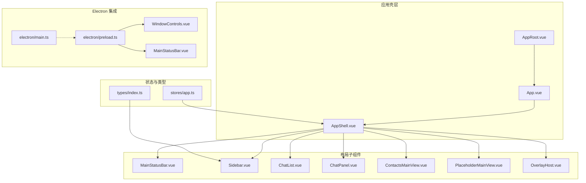
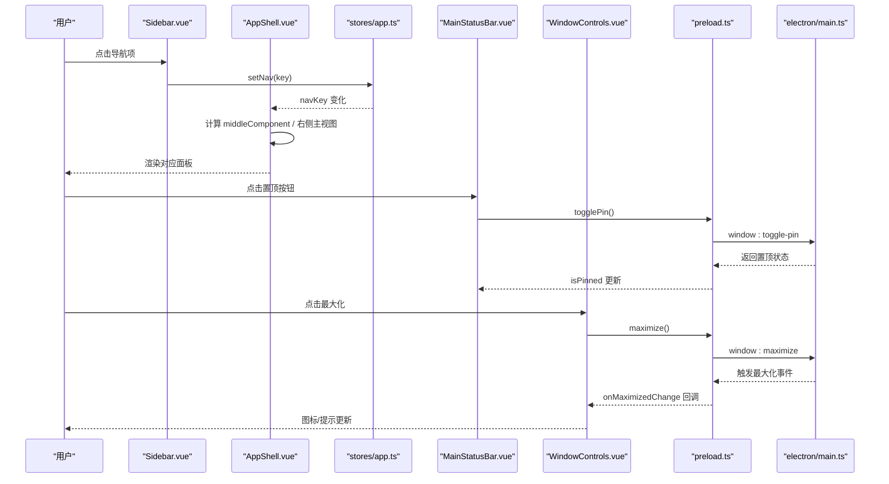
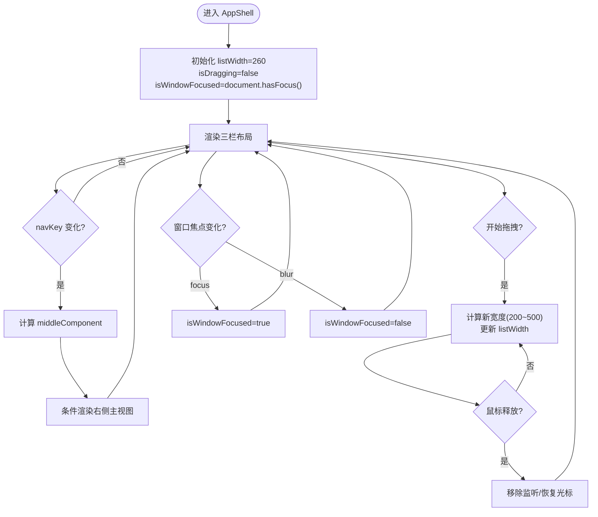
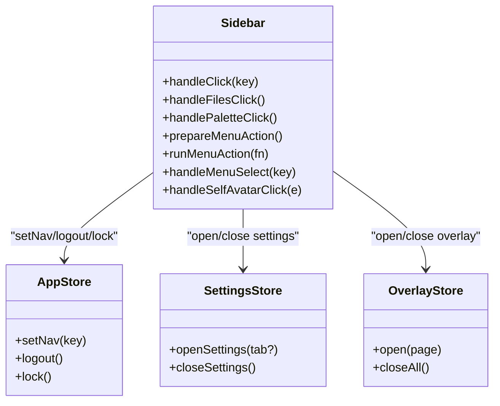
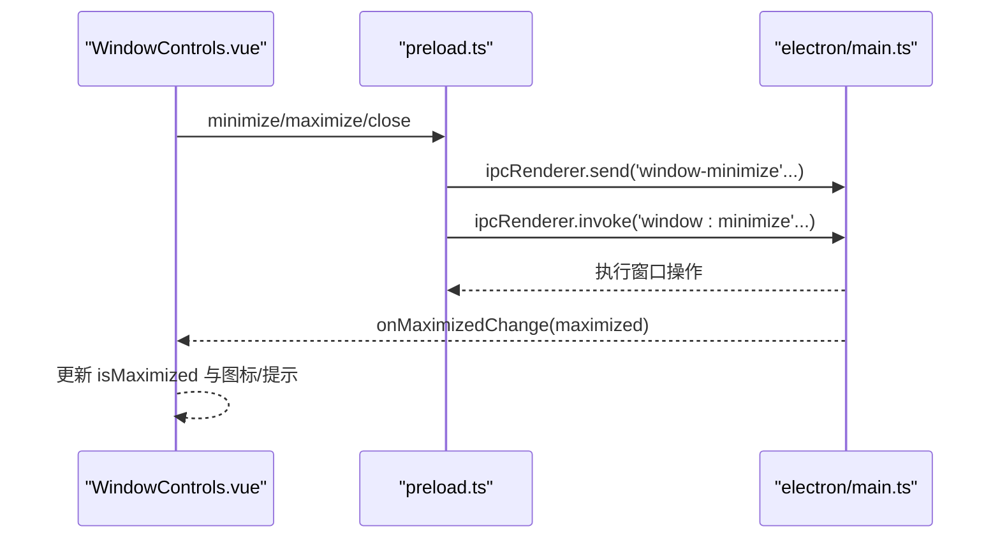
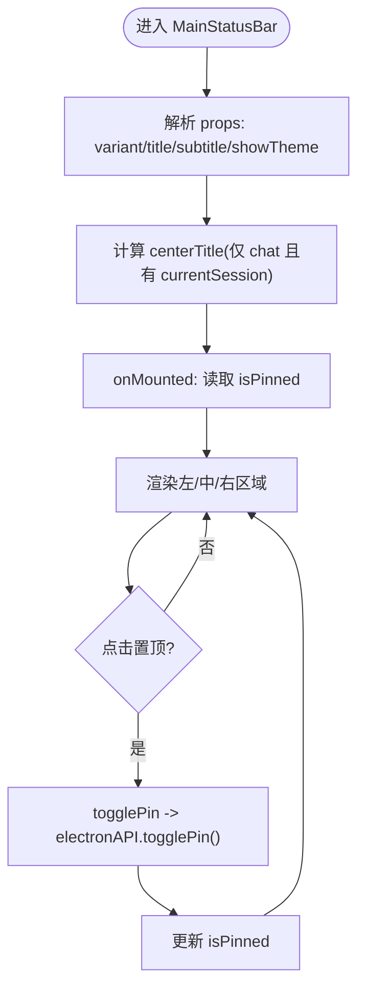
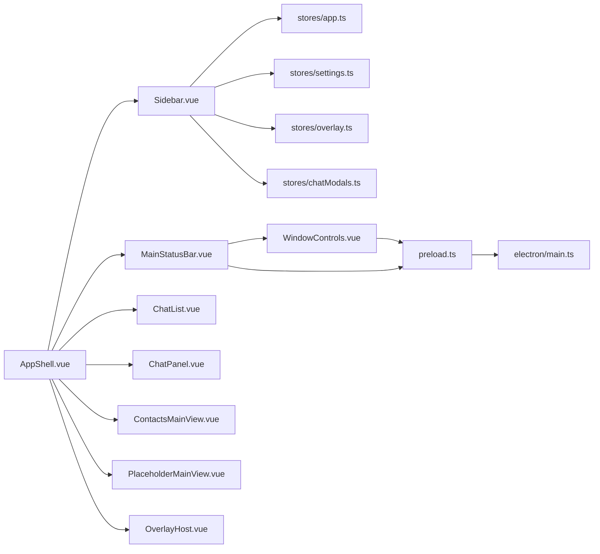

# 布局组件

<cite>
**本文引用的文件列表**   
- [AppShell.vue](file://linkx-client/src/components/AppShell.vue)
- [Sidebar.vue](file://linkx-client/src/components/Sidebar.vue)
- [WindowControls.vue](file://linkx-client/src/components/WindowControls.vue)
- [MainStatusBar.vue](file://linkx-client/src/components/MainStatusBar.vue)
- [AppRoot.vue](file://linkx-client/src/AppRoot.vue)
- [app.ts](file://linkx-client/src/stores/app.ts)
- [index.ts](file://linkx-client/src/types/index.ts)
- [themeSync.ts](file://linkx-client/src/utils/themeSync.ts)
- [preload.ts](file://linkx-client/electron/preload.ts)
- [main.ts](file://linkx-client/electron/main.ts)
</cite>

## 目录
1. [简介](#简介)
2. [项目结构](#项目结构)
3. [核心组件](#核心组件)
4. [架构总览](#架构总览)
5. [详细组件分析](#详细组件分析)
6. [依赖关系分析](#依赖关系分析)
7. [性能与体验优化](#性能与体验优化)
8. [故障排查指南](#故障排查指南)
9. [结论](#结论)
10. [附录：扩展与最佳实践](#附录扩展与最佳实践)

## 简介
本文件围绕 LinkX 的布局体系，系统性阐述应用外壳 AppShell 的三栏布局、侧边导航 Sidebar、窗口控制 WindowControls 以及主状态栏 MainStatusBar 的职责边界、交互流程与平台适配。文档同时覆盖属性配置、响应式断点处理、主题适配与自定义样式选项，并给出 Electron 窗口集成、多标签页管理与键盘快捷键支持的相关说明，帮助开发者快速理解并扩展布局能力。

## 项目结构
LinkX 前端采用 Vue 3 + TypeScript + Pinia 的组合，布局相关代码集中在 linkx-client/src/components 下，Electron 集成位于 electron 目录。根容器 AppRoot 负责全局主题与 UI 框架 Provider 注入；路由出口 App 渲染当前页面；布局由 AppShell 组织三栏区域，并通过 Store 驱动导航与内容切换。

图表来源
- [AppRoot.vue:1-105](file://linkx-client/src/AppRoot.vue#L1-L105)
- [App.vue:1-26](file://linkx-client/src/App.vue#L1-L26)
- [AppShell.vue:1-345](file://linkx-client/src/components/AppShell.vue#L1-L345)
- [MainStatusBar.vue:1-278](file://linkx-client/src/components/MainStatusBar.vue#L1-L278)
- [Sidebar.vue:1-355](file://linkx-client/src/components/Sidebar.vue#L1-L355)
- [WindowControls.vue:1-143](file://linkx-client/src/components/WindowControls.vue#L1-L143)
- [app.ts:128-200](file://linkx-client/src/stores/app.ts#L128-L200)
- [index.ts:1-129](file://linkx-client/src/types/index.ts#L1-L129)
- [preload.ts:1-37](file://linkx-client/electron/preload.ts#L1-L37)
- [main.ts:1-445](file://linkx-client/electron/main.ts#L1-L445)

章节来源
- [AppRoot.vue:1-105](file://linkx-client/src/AppRoot.vue#L1-L105)
- [App.vue:1-26](file://linkx-client/src/App.vue#L1-L26)
- [AppShell.vue:1-345](file://linkx-client/src/components/AppShell.vue#L1-L345)

## 核心组件
- AppShell：应用主壳层，实现顶部状态栏、左侧导航、中间列表、右侧主内容区、媒体播放条与弹窗宿主；提供列宽拖拽调整与窗口焦点态管理。
- Sidebar：左侧导航，提供模块切换（消息、联系人、收藏、文件、日历、应用、友链）、个人头像入口、主题快捷入口与更多菜单（设置、锁定、退出等）。
- WindowControls：Electron 窗口控制按钮组（最小化、最大化/还原、关闭），在浏览器环境提示需在 Electron 运行。
- MainStatusBar：顶部主状态栏，显示品牌标识、会话标题、置顶按钮与窗口控制插槽；中间区域支持拖拽移动窗口。

章节来源
- [AppShell.vue:1-345](file://linkx-client/src/components/AppShell.vue#L1-L345)
- [Sidebar.vue:1-355](file://linkx-client/src/components/Sidebar.vue#L1-L355)
- [WindowControls.vue:1-143](file://linkx-client/src/components/WindowControls.vue#L1-L143)
- [MainStatusBar.vue:1-278](file://linkx-client/src/components/MainStatusBar.vue#L1-L278)

## 架构总览
布局以 AppShell 为中心，通过 Pinia appStore 的 navKey 驱动中间列与右侧主视图的动态渲染；Sidebar 通过 setNav 更新 navKey；MainStatusBar 在 chat 变体下展示当前会话标题；WindowControls 通过 preload 暴露的 API 调用 Electron 主进程进行窗口操作；主题同步通过 themeSync 工具将主题写入 DOM 并通知 Electron。

图表来源
- [Sidebar.vue:100-120](file://linkx-client/src/components/Sidebar.vue#L100-L120)
- [AppShell.vue:137-166](file://linkx-client/src/components/AppShell.vue#L137-L166)
- [app.ts:195-200](file://linkx-client/src/stores/app.ts#L195-L200)
- [MainStatusBar.vue:59-64](file://linkx-client/src/components/MainStatusBar.vue#L59-L64)
- [WindowControls.vue:53-65](file://linkx-client/src/components/WindowControls.vue#L53-L65)
- [preload.ts:17-37](file://linkx-client/electron/preload.ts#L17-L37)
- [main.ts:91-114](file://linkx-client/electron/main.ts#L91-L114)

## 详细组件分析

### AppShell 三栏布局与交互
- 布局结构
  - 顶部：MainStatusBar
  - 主体：左侧 Sidebar、中间列表（宽度可拖拽）、右侧主内容区
  - 底部：MediaNowPlayingBar
  - 顶层：OverlayHost 与各异步弹窗
- 动态内容
  - 根据 navKey 选择中间列组件（聊天、联系人、收藏、文件、日历、友链、应用）
  - 右侧主视图按 navKey 条件渲染 ChatPanel、CalendarMainView、ContactsMainView 或 PlaceholderMainView
- 列宽拖拽
  - 监听 mousedown/mousemove/mouseup，限制范围 200~500px，减去固定侧栏宽度计算新宽度
- 窗口焦点态
  - 监听 focus/blur，用于原生材质效果（Mica）的类名切换
- 弹窗挂载
  - 大量弹窗使用 defineAsyncComponent 懒加载，减少首屏体积
  - 友链弹窗在非 Electron 环境下以全屏遮罩形式呈现

图表来源
- [AppShell.vue:76-135](file://linkx-client/src/components/AppShell.vue#L76-L135)
- [AppShell.vue:137-166](file://linkx-client/src/components/AppShell.vue#L137-L166)
- [AppShell.vue:169-226](file://linkx-client/src/components/AppShell.vue#L169-L226)

章节来源
- [AppShell.vue:1-345](file://linkx-client/src/components/AppShell.vue#L1-L345)

### Sidebar 导航管理
- 导航项定义
  - mainNav 数组包含键、图标与标签，键类型为 NavKey
- 导航切换
  - handleClick 根据 key 执行不同逻辑：友链在 Electron 下打开独立窗口，否则切换导航；文件导航直接切换到 files
- 更多菜单
  - 下拉菜单项包括聊天记录管理、检查更新、帮助、锁定、设置、退出账号
  - 为避免 dropdown 关闭清理被中断，统一用 setTimeout 延迟执行动作
- 主题快捷入口
  - 点击调色盘按钮先关闭 Overlay 与设置弹窗，再下一帧打开外观设置页
- 个人资料入口
  - 点击头像打开个人资料弹窗，传入昵称、用户名、头像文本与 URL

图表来源
- [Sidebar.vue:90-120](file://linkx-client/src/components/Sidebar.vue#L90-L120)
- [Sidebar.vue:126-147](file://linkx-client/src/components/Sidebar.vue#L126-L147)
- [Sidebar.vue:149-193](file://linkx-client/src/components/Sidebar.vue#L149-L193)
- [app.ts:195-200](file://linkx-client/src/stores/app.ts#L195-L200)

章节来源
- [Sidebar.vue:1-355](file://linkx-client/src/components/Sidebar.vue#L1-L355)
- [index.ts:1-129](file://linkx-client/src/types/index.ts#L1-L129)

### WindowControls 平台适配
- 功能
  - 提供最小化、最大化/还原、关闭三个按钮
  - 非 Electron 环境点击时弹出提示，引导用户使用 Electron 开发模式
- 状态同步
  - 组件挂载时查询当前最大化状态，并注册 onMaximizedChange 监听器
  - 最大化操作后重新同步状态，确保图标与提示一致
- 事件处理
  - 阻止冒泡与默认行为，避免触发标题栏拖拽

图表来源
- [WindowControls.vue:26-65](file://linkx-client/src/components/WindowControls.vue#L26-L65)
- [preload.ts:17-37](file://linkx-client/electron/preload.ts#L17-L37)
- [main.ts:91-114](file://linkx-client/electron/main.ts#L91-L114)

章节来源
- [WindowControls.vue:1-143](file://linkx-client/src/components/WindowControls.vue#L1-L143)

### MainStatusBar 功能实现
- 变体与标题
  - variant 支持 profile/chat/module，chat 变体下显示当前会话名称
  - title/subtitle 作为可选参数，用于其他变体的标题与副标题
- 置顶按钮
  - 挂载时读取置顶状态，点击调用 togglePin 并更新本地状态
- 拖拽移动窗口
  - 中间区域标记为可拖拽区域，配合 Electron 的 no-drag/no-drag 区域划分
- 窗口控制插槽
  - 右侧嵌入 WindowControls，保持无拖拽区域

图表来源
- [MainStatusBar.vue:20-64](file://linkx-client/src/components/MainStatusBar.vue#L20-L64)
- [MainStatusBar.vue:67-114](file://linkx-client/src/components/MainStatusBar.vue#L67-L114)

章节来源
- [MainStatusBar.vue:1-278](file://linkx-client/src/components/MainStatusBar.vue#L1-L278)

## 依赖关系分析
- 组件耦合
  - AppShell 依赖 Sidebar、MainStatusBar、各面板与 OverlayHost，通过 storeToRefs 解构 navKey 与 momentsModalOpen
  - Sidebar 依赖 appStore、settingsStore、overlayStore 与 chatModalsStore
  - WindowControls 与 MainStatusBar 均依赖 electronAPI（由 preload 注入）
- 外部依赖
  - Naive UI 提供图标、消息与对话框等基础能力
  - Ionicons5 提供导航与窗口控制图标
  - Electron IPC 通道用于窗口控制与置顶状态同步
- 潜在循环依赖
  - 组件间通过 Store 通信，未出现直接相互引用导致的循环依赖

图表来源
- [AppShell.vue:10-41](file://linkx-client/src/components/AppShell.vue#L10-L41)
- [Sidebar.vue:33-60](file://linkx-client/src/components/Sidebar.vue#L33-L60)
- [MainStatusBar.vue:10-18](file://linkx-client/src/components/MainStatusBar.vue#L10-L18)
- [WindowControls.vue:9-14](file://linkx-client/src/components/WindowControls.vue#L9-L14)
- [preload.ts:1-37](file://linkx-client/electron/preload.ts#L1-L37)
- [main.ts:91-114](file://linkx-client/electron/main.ts#L91-L114)

章节来源
- [AppShell.vue:1-345](file://linkx-client/src/components/AppShell.vue#L1-L345)
- [Sidebar.vue:1-355](file://linkx-client/src/components/Sidebar.vue#L1-L355)
- [MainStatusBar.vue:1-278](file://linkx-client/src/components/MainStatusBar.vue#L1-L278)
- [WindowControls.vue:1-143](file://linkx-client/src/components/WindowControls.vue#L1-L143)
- [preload.ts:1-37](file://linkx-client/electron/preload.ts#L1-L37)
- [main.ts:1-445](file://linkx-client/electron/main.ts#L1-L445)

## 性能与体验优化
- 首屏包体积
  - 大量弹窗使用 defineAsyncComponent 懒加载，降低初始渲染压力
- 拖拽交互
  - 拖拽过程中禁用文本选中与全局光标，提升交互流畅度
- 主题同步
  - 主题变更时同步到 document 与 Electron 主进程，避免闪烁与不一致
- 窗口焦点态
  - 基于 focus/blur 切换类名，便于原生材质效果按需启用

[本节为通用指导，不直接分析具体文件]

## 故障排查指南
- 窗口控制在浏览器环境无效
  - 现象：点击最小化/最大化/关闭按钮弹出提示
  - 原因：window.electronAPI 不存在
  - 解决：在 Electron 环境中运行（npm run electron:dev）
- 下拉菜单导致 UI 卡死
  - 现象：选择“历史记录/帮助/锁定/设置/退出”后界面卡顿
  - 原因：dropdown 关闭清理与 Modal/Overlay 在同一事件循环内冲突
  - 解决：使用 runMenuAction 延迟执行，确保清理完成
- 置顶状态不同步
  - 现象：点击置顶后状态未更新
  - 原因：未正确调用 togglePin 或未监听返回值
  - 解决：确认 MainStatusBar 已调用 electronAPI.togglePin 并更新 isPinned
- 主题不一致
  - 现象：UI 与原生背景色不一致
  - 原因：未同步主题到 document 或 Electron
  - 解决：在 AppRoot 与 appStore.toggleTheme 中调用 applyDocumentTheme 与 notifyElectronTheme

章节来源
- [WindowControls.vue:53-65](file://linkx-client/src/components/WindowControls.vue#L53-L65)
- [Sidebar.vue:145-147](file://linkx-client/src/components/Sidebar.vue#L145-L147)
- [MainStatusBar.vue:59-64](file://linkx-client/src/components/MainStatusBar.vue#L59-L64)
- [AppRoot.vue:68-77](file://linkx-client/src/AppRoot.vue#L68-L77)
- [app.ts:854-859](file://linkx-client/src/stores/app.ts#L854-L859)

## 结论
AppShell 作为布局中枢，结合 Sidebar 的导航管理、WindowControls 的平台适配与 MainStatusBar 的状态展示，构建了稳定且可扩展的三栏架构。通过 Pinia 驱动与 Electron IPC 集成，实现了跨环境的窗口控制与主题同步。建议在新增模块时遵循现有导航与渲染约定，并在必要时复用 Overlay 与弹窗懒加载策略，以保持性能与一致性。

[本节为总结性内容，不直接分析具体文件]

## 附录：扩展与最佳实践

### 属性配置与样式定制
- MainStatusBar 属性
  - variant：profile/chat/module，控制标题区渲染策略
  - title/subtitle：用于显示标题与副标题
  - showTheme：预留开关，用于未来主题切换入口
- 主题变量
  - 通过 CSS 变量（如 --lx-bg-card、--lx-text-nav、--lx-accent 等）实现明暗主题与品牌色定制
  - AppRoot 中通过 Naive UI 的 theme-overrides 统一圆角、主色与背景色
- 侧栏宽度
  - 通过 CSS 变量 --lx-sidebar-width 控制，也可在 AppShell 中通过 listWidth 调整中间列宽度

章节来源
- [MainStatusBar.vue:20-34](file://linkx-client/src/components/MainStatusBar.vue#L20-L34)
- [AppRoot.vue:47-66](file://linkx-client/src/AppRoot.vue#L47-L66)
- [AppShell.vue:280-298](file://linkx-client/src/components/AppShell.vue#L280-L298)

### 响应式断点处理
- 当前实现未显式引入断点判断，主要依赖 Flexbox 与百分比布局自适应
- 建议：如需在小屏设备隐藏中间列或折叠侧栏，可在 AppShell 中增加 computed 判断屏幕宽度并切换布局策略

[本节为通用指导，不直接分析具体文件]

### 主题适配与跨窗口同步
- 主题同步
  - applyDocumentTheme 设置 data-theme 属性
  - notifyElectronTheme 通知主进程切换原生背景色
  - initCrossWindowThemeSync 监听 storage 事件，实现多窗口主题同步
- 最佳实践
  - 在 AppRoot 挂载时立即同步一次主题
  - 监听主题变化并同步到所有窗口

章节来源
- [themeSync.ts:11-44](file://linkx-client/src/utils/themeSync.ts#L11-L44)
- [AppRoot.vue:68-77](file://linkx-client/src/AppRoot.vue#L68-L77)

### Electron 窗口集成
- 窗口控制
  - preload 暴露 minimize/maximize/close/isMaximized/onMaximizedChange
  - main 进程注册 IPC 处理器，执行窗口操作并推送状态变化
- 置顶控制
  - togglePin 返回最新置顶状态，供 UI 同步
- 多窗口管理
  - 友链与笔记编辑器通过 createMomentsWindow/createNoteEditorWindow 创建独立窗口
  - 注意窗口生命周期与最大化事件推送

章节来源
- [preload.ts:17-37](file://linkx-client/electron/preload.ts#L17-L37)
- [main.ts:91-114](file://linkx-client/electron/main.ts#L91-L114)
- [main.ts:246-286](file://linkx-client/electron/main.ts#L246-L286)
- [main.ts:292-344](file://linkx-client/electron/main.ts#L292-L344)

### 多标签页管理与键盘快捷键
- 多标签页
  - 当前布局为单窗口三栏，未实现传统意义上的多标签页
  - 可通过 Overlay 或独立窗口承载不同页面（如友链、笔记编辑器）
- 键盘快捷键
  - 全局快捷键 CommandOrControl+Shift+L 用于显示/隐藏主窗口
  - 可在需要时扩展快捷键映射至特定布局操作（如切换导航、打开设置）

章节来源
- [main.ts:235-244](file://linkx-client/electron/main.ts#L235-L244)

### 布局扩展指南
- 新增导航模块
  - 在 types/index.ts 的 NavKey 中添加新键
  - 在 Sidebar.mainNav 中追加导航项
  - 在 AppShell.middleComponent 与右侧条件渲染中处理新模块
- 新增弹窗
  - 使用 defineAsyncComponent 懒加载，并在 AppShell 模板中挂载
- 新增窗口控制
  - 在 preload 与 main 中注册新的 IPC 通道，并在组件中调用

章节来源
- [index.ts:7](file://linkx-client/src/types/index.ts#L7)
- [Sidebar.vue:90-98](file://linkx-client/src/components/Sidebar.vue#L90-L98)
- [AppShell.vue:137-166](file://linkx-client/src/components/AppShell.vue#L137-L166)
- [AppShell.vue:42-56](file://linkx-client/src/components/AppShell.vue#L42-L56)