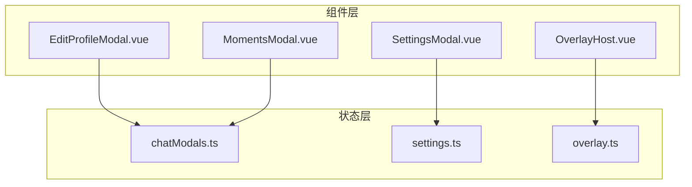
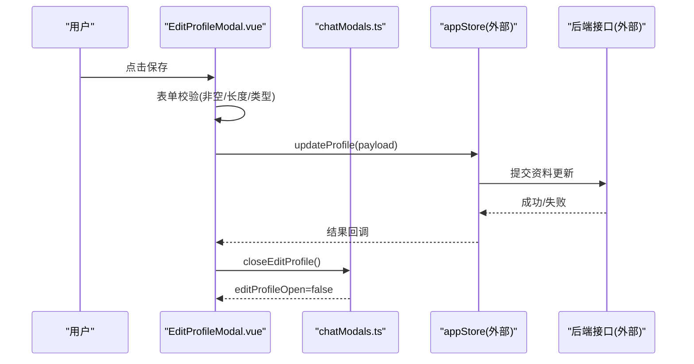
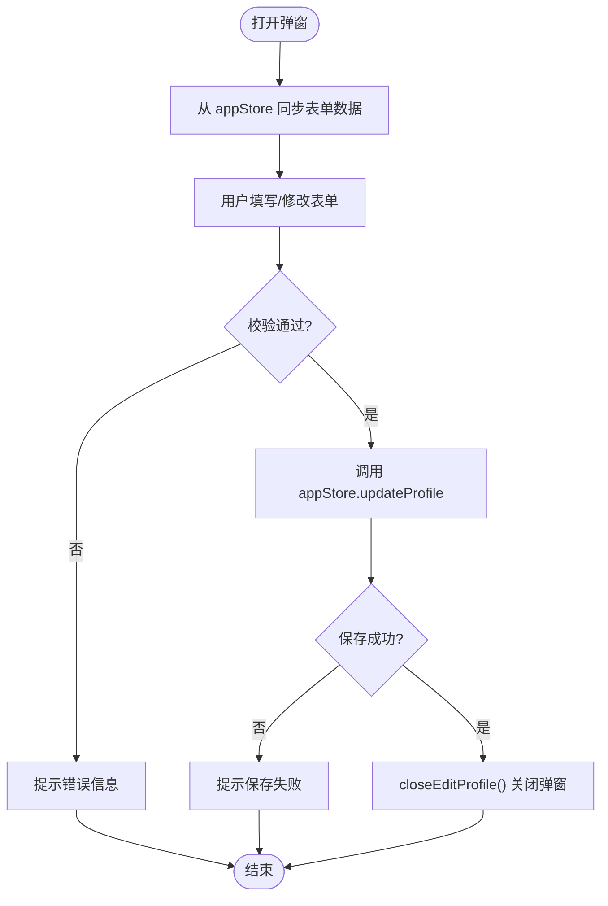
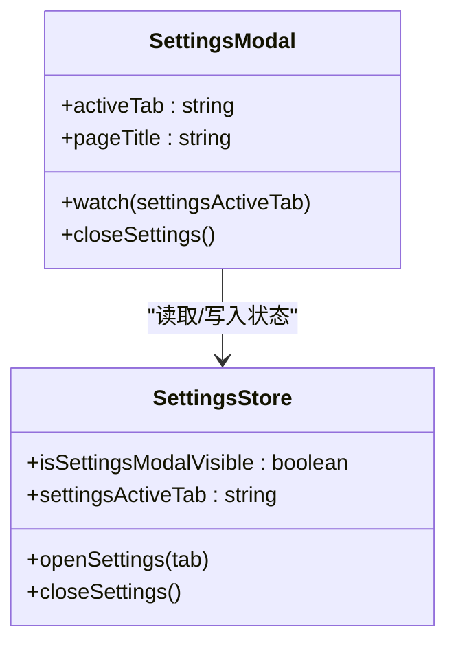
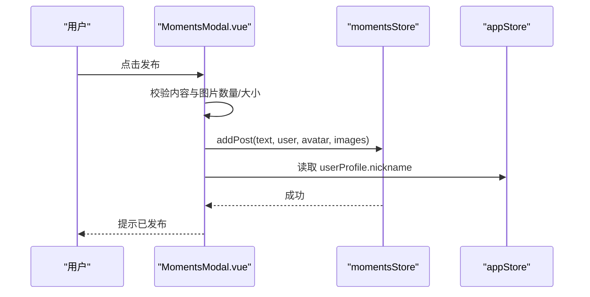
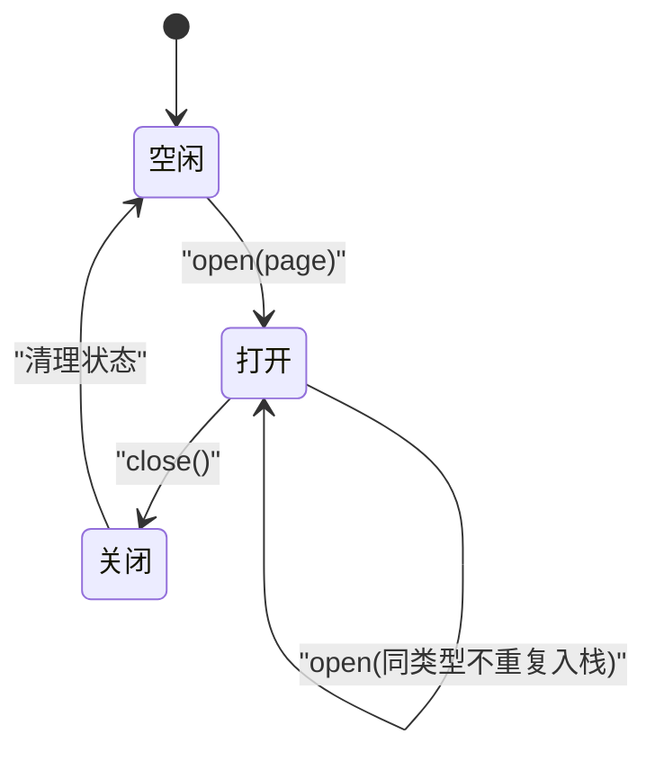
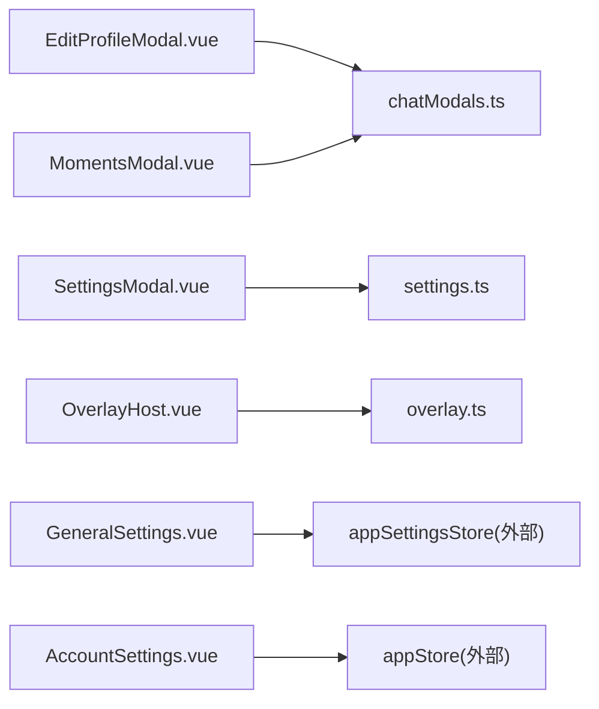

# 模态框与对话框

<cite>
**本文引用的文件**   
- [EditProfileModal.vue](file://linkx-client/src/components/EditProfileModal.vue)
- [SettingsModal.vue](file://linkx-client/src/components/SettingsModal.vue)
- [MomentsModal.vue](file://linkx-client/src/components/MomentsModal.vue)
- [OverlayHost.vue](file://linkx-client/src/components/overlay/OverlayHost.vue)
- [chatModals.ts](file://linkx-client/src/stores/chatModals.ts)
- [settings.ts](file://linkx-client/src/stores/settings.ts)
- [overlay.ts](file://linkx-client/src/stores/overlay.ts)
- [GeneralSettings.vue](file://linkx-client/src/components/settings/GeneralSettings.vue)
- [AccountSettings.vue](file://linkx-client/src/components/settings/AccountSettings.vue)
</cite>

## 目录
1. [简介](#简介)
2. [项目结构](#项目结构)
3. [核心组件](#核心组件)
4. [架构总览](#架构总览)
5. [详细组件分析](#详细组件分析)
6. [依赖关系分析](#依赖关系分析)
7. [性能考虑](#性能考虑)
8. [故障排查指南](#故障排查指南)
9. [结论](#结论)
10. [附录：定制与扩展指南](#附录定制与扩展指南)

## 简介
本文件面向 LinkX 前端中的模态框与对话框体系，聚焦以下四个关键组件及其状态管理：
- 个人资料编辑模态框 EditProfileModal：表单校验、头像上传、保存流程。
- 设置模态框 SettingsModal：多标签配置管理与页面切换。
- 朋友圈模态框 MomentsModal：内容展示、发布、点赞评论交互。
- 覆盖层 OverlayHost：全屏覆盖层的层级管理与动态页面加载。

文档将系统阐述生命周期管理、事件通信机制、动画过渡效果、键盘导航支持、响应式适配、无障碍访问与焦点管理策略，并提供开发者定制与扩展指南。

## 项目结构
围绕模态框与对话框的相关代码主要分布在 components 与 stores 两个层次：
- 组件层：各模态框与覆盖层容器组件负责 UI 渲染与用户交互。
- 状态层：Pinia Store 集中管理弹窗可见性、当前激活标签、覆盖层栈等全局状态。

图表来源
- [EditProfileModal.vue:1-120](file://linkx-client/src/components/EditProfileModal.vue#L1-L120)
- [SettingsModal.vue:1-60](file://linkx-client/src/components/SettingsModal.vue#L1-L60)
- [MomentsModal.vue:1-60](file://linkx-client/src/components/MomentsModal.vue#L1-L60)
- [OverlayHost.vue:1-60](file://linkx-client/src/components/overlay/OverlayHost.vue#L1-L60)
- [chatModals.ts:1-60](file://linkx-client/src/stores/chatModals.ts#L1-L60)
- [settings.ts:1-34](file://linkx-client/src/stores/settings.ts#L1-L34)
- [overlay.ts:1-40](file://linkx-client/src/stores/overlay.ts#L1-L40)

章节来源
- [EditProfileModal.vue:1-120](file://linkx-client/src/components/EditProfileModal.vue#L1-L120)
- [SettingsModal.vue:1-60](file://linkx-client/src/components/SettingsModal.vue#L1-L60)
- [MomentsModal.vue:1-60](file://linkx-client/src/components/MomentsModal.vue#L1-L60)
- [OverlayHost.vue:1-60](file://linkx-client/src/components/overlay/OverlayHost.vue#L1-L60)
- [chatModals.ts:1-60](file://linkx-client/src/stores/chatModals.ts#L1-L60)
- [settings.ts:1-34](file://linkx-client/src/stores/settings.ts#L1-L34)
- [overlay.ts:1-40](file://linkx-client/src/stores/overlay.ts#L1-L40)

## 核心组件
- EditProfileModal：基于 Naive UI 的卡片式模态框，提供昵称、性别、生日、地区选择与头像更换；通过 Pinia 读写用户资料并调用应用 Store 更新。
- SettingsModal：左侧导航 + 右侧内容的分栏布局，使用 Tabs 控制子页面显示，标题根据当前标签计算。
- MomentsModal：独立窗口或模态容器内的朋友圈界面，支持滚动渐变头部、搜索过滤、图片预览、发布、点赞与评论。
- OverlayHost：全屏覆盖层容器，按当前页面类型动态渲染子页面，提供返回按钮与窗口控制集成。

章节来源
- [EditProfileModal.vue:120-250](file://linkx-client/src/components/EditProfileModal.vue#L120-L250)
- [SettingsModal.vue:60-150](file://linkx-client/src/components/SettingsModal.vue#L60-L150)
- [MomentsModal.vue:200-340](file://linkx-client/src/components/MomentsModal.vue#L200-L340)
- [OverlayHost.vue:58-87](file://linkx-client/src/components/overlay/OverlayHost.vue#L58-L87)

## 架构总览
模态框与对话框采用“组件 + Store”的解耦模式：
- 组件只关注 UI 与交互，通过 storeToRefs 读取状态，调用 actions 修改状态。
- Store 作为单一事实来源，维护弹窗开关、标签页、覆盖层栈等。

图表来源
- [EditProfileModal.vue:66-94](file://linkx-client/src/components/EditProfileModal.vue#L66-L94)
- [chatModals.ts:187-194](file://linkx-client/src/stores/chatModals.ts#L187-L194)

章节来源
- [EditProfileModal.vue:66-94](file://linkx-client/src/components/EditProfileModal.vue#L66-L94)
- [chatModals.ts:187-194](file://linkx-client/src/stores/chatModals.ts#L187-L194)

## 详细组件分析

### 个人资料编辑模态框（EditProfileModal）
- 表单验证
  - 昵称必填且不超过指定长度。
  - 头像仅接受图片类型与大小限制。
- 数据同步
  - 打开时从 appStore.userProfile 同步到本地表单字段。
  - 保存后调用 appStore.updateProfile 并关闭弹窗。
- 头像上传
  - 触发隐藏 input 选择文件，校验类型与大小后调用 appStore.updateAvatar。
- 生命周期与事件
  - 监听 editProfileOpen 变化以同步数据。
  - 使用 after-leave 钩子确保关闭后清理状态。
- 可访问性与焦点
  - 关闭按钮具备 aria-label。
  - 建议为输入控件添加 aria-describedby 与错误提示关联。
- 动画与过渡
  - 使用 Naive UI Modal 内置过渡；遮罩可点击关闭。
- 键盘导航
  - 默认由 Naive UI 管理 Tab 顺序；建议在 ESC 时统一关闭。

图表来源
- [EditProfileModal.vue:53-64](file://linkx-client/src/components/EditProfileModal.vue#L53-L64)
- [EditProfileModal.vue:66-94](file://linkx-client/src/components/EditProfileModal.vue#L66-L94)
- [chatModals.ts:187-194](file://linkx-client/src/stores/chatModals.ts#L187-L194)

章节来源
- [EditProfileModal.vue:53-64](file://linkx-client/src/components/EditProfileModal.vue#L53-L64)
- [EditProfileModal.vue:66-94](file://linkx-client/src/components/EditProfileModal.vue#L66-L94)
- [EditProfileModal.vue:96-124](file://linkx-client/src/components/EditProfileModal.vue#L96-L124)
- [chatModals.ts:187-194](file://linkx-client/src/stores/chatModals.ts#L187-L194)

### 设置模态框（SettingsModal）
- 配置管理
  - 使用 settingsStore 管理 isSettingsModalVisible 与 settingsActiveTab。
  - 本地 activeTab 与外部 settingsActiveTab 双向同步。
- 子页面组织
  - 左侧 Tabs 导航，右侧 v-show 切换通用、账号、外观、演示、关于等子页面。
- 标题计算
  - 根据 activeTab 计算页面标题，提升可读性。
- 生命周期与事件
  - watch(settingsActiveTab, { immediate: true }) 实现外部驱动标签切换。
- 可访问性与焦点
  - 关闭按钮具备 aria-label；Tabs 元素应保证键盘可达。
- 动画与过渡
  - 使用 Naive UI Tabs 与 Modal 过渡；样式中自定义活跃态与悬停态。

图表来源
- [SettingsModal.vue:33-58](file://linkx-client/src/components/SettingsModal.vue#L33-L58)
- [settings.ts:10-34](file://linkx-client/src/stores/settings.ts#L10-L34)

章节来源
- [SettingsModal.vue:33-58](file://linkx-client/src/components/SettingsModal.vue#L33-L58)
- [SettingsModal.vue:60-150](file://linkx-client/src/components/SettingsModal.vue#L60-L150)
- [settings.ts:10-34](file://linkx-client/src/stores/settings.ts#L10-L34)

### 朋友圈模态框（MomentsModal）
- 内容展示
  - 顶部封面与用户信息，动态列表分页渲染，空状态占位。
- 交互能力
  - 发布动态（文本+图片），最多 9 张，单图大小限制。
  - 点赞/取消点赞，评论输入与提交。
  - 顶部搜索框实时过滤动态。
- 主题与窗口控制
  - 挂载时与应用主题同步，支持 Electron 最小化/关闭。
- 滚动与头部渐变
  - 监听滚动位置计算头部背景透明度与图标颜色。
- 可访问性与焦点
  - 操作面板与输入框需保证键盘可达；建议为图片添加 alt。
- 动画与过渡
  - 操作面板弹出使用 transform 与 opacity 过渡；头部背景渐变色过渡。

图表来源
- [MomentsModal.vue:138-154](file://linkx-client/src/components/MomentsModal.vue#L138-L154)
- [MomentsModal.vue:112-131](file://linkx-client/src/components/MomentsModal.vue#L112-L131)

章节来源
- [MomentsModal.vue:112-131](file://linkx-client/src/components/MomentsModal.vue#L112-L131)
- [MomentsModal.vue:138-154](file://linkx-client/src/components/MomentsModal.vue#L138-L154)
- [MomentsModal.vue:156-188](file://linkx-client/src/components/MomentsModal.vue#L156-L188)
- [MomentsModal.vue:196-205](file://linkx-client/src/components/MomentsModal.vue#L196-L205)

### 覆盖层（OverlayHost）
- 层级管理
  - 使用 overlayStore 的 stack 维护页面栈，currentPage 为栈顶。
  - open(page, payload) 入栈，close() 出栈并清理相关状态。
- 动态渲染
  - 根据 currentPage 条件渲染对应子页面（帮助、个人资料、添加好友、创建群聊、频道、天气、应用运行器、文件预览、聊天记录）。
- 标题映射
  - 根据页面类型映射标题，应用运行器使用应用名称。
- 窗口控制
  - 集成 WindowControls 组件，提供原生窗口控制能力。

图表来源
- [overlay.ts:43-74](file://linkx-client/src/stores/overlay.ts#L43-L74)
- [OverlayHost.vue:35-56](file://linkx-client/src/components/overlay/OverlayHost.vue#L35-L56)
- [OverlayHost.vue:74-86](file://linkx-client/src/components/overlay/OverlayHost.vue#L74-L86)

章节来源
- [overlay.ts:20-41](file://linkx-client/src/stores/overlay.ts#L20-L41)
- [overlay.ts:43-74](file://linkx-client/src/stores/overlay.ts#L43-L74)
- [OverlayHost.vue:35-56](file://linkx-client/src/components/overlay/OverlayHost.vue#L35-L56)
- [OverlayHost.vue:74-86](file://linkx-client/src/components/overlay/OverlayHost.vue#L74-L86)

## 依赖关系分析
- 组件对 Store 的依赖
  - EditProfileModal 依赖 chatModals.ts 的 editProfileOpen 与 closeEditProfile。
  - SettingsModal 依赖 settings.ts 的 isSettingsModalVisible 与 settingsActiveTab。
  - MomentsModal 依赖 chatModals.ts 的 momentsModalOpen 与 closeMomentsModal。
  - OverlayHost 依赖 overlay.ts 的 stack/currentPage/close。
- 子页面依赖
  - SettingsModal 的子页面 GeneralSettings、AccountSettings 分别依赖 appSettingsStore 与 appStore。

图表来源
- [EditProfileModal.vue:18-26](file://linkx-client/src/components/EditProfileModal.vue#L18-L26)
- [SettingsModal.vue:21-37](file://linkx-client/src/components/SettingsModal.vue#L21-L37)
- [MomentsModal.vue:34-49](file://linkx-client/src/components/MomentsModal.vue#L34-L49)
- [OverlayHost.vue:17-23](file://linkx-client/src/components/overlay/OverlayHost.vue#L17-L23)
- [GeneralSettings.vue:1-26](file://linkx-client/src/components/settings/GeneralSettings.vue#L1-L26)
- [AccountSettings.vue:1-23](file://linkx-client/src/components/settings/AccountSettings.vue#L1-L23)

章节来源
- [EditProfileModal.vue:18-26](file://linkx-client/src/components/EditProfileModal.vue#L18-L26)
- [SettingsModal.vue:21-37](file://linkx-client/src/components/SettingsModal.vue#L21-L37)
- [MomentsModal.vue:34-49](file://linkx-client/src/components/MomentsModal.vue#L34-L49)
- [OverlayHost.vue:17-23](file://linkx-client/src/components/overlay/OverlayHost.vue#L17-L23)
- [GeneralSettings.vue:1-26](file://linkx-client/src/components/settings/GeneralSettings.vue#L1-L26)
- [AccountSettings.vue:1-23](file://linkx-client/src/components/settings/AccountSettings.vue#L1-L23)

## 性能考虑
- 按需加载
  - OverlayHost 使用 defineAsyncComponent 异步加载子页面，减少首屏体积。
- 条件渲染
  - SettingsModal 使用 v-show 切换子页面，避免频繁销毁重建。
- 图片处理
  - MomentsModal 在本地将图片转为 Data URL 进行预览，注意内存占用与最大数量限制。
- 滚动优化
  - 滚动事件仅更新 scrollTop 与计算属性，避免重排重绘过多。

[本节为通用指导，无需具体文件引用]

## 故障排查指南
- 表单校验未生效
  - 检查昵称非空与长度限制逻辑是否被提前 return。
  - 确认 message 提示是否正确触发。
- 头像上传失败
  - 检查 accept 与类型判断、文件大小限制。
  - 确认 appStore.updateAvatar 的错误处理路径。
- 设置标签不同步
  - 确认 watch(settingsActiveTab, { immediate: true }) 是否执行。
  - 检查外部 openSettings(tab) 是否正确设置 settingsActiveTab。
- 覆盖层无法关闭
  - 检查 overlayStore.close() 是否弹出栈顶并清理状态。
  - 确认 OverlayHost 的返回按钮绑定 close。

章节来源
- [EditProfileModal.vue:66-94](file://linkx-client/src/components/EditProfileModal.vue#L66-L94)
- [EditProfileModal.vue:100-124](file://linkx-client/src/components/EditProfileModal.vue#L100-L124)
- [SettingsModal.vue:54-58](file://linkx-client/src/components/SettingsModal.vue#L54-L58)
- [settings.ts:23-31](file://linkx-client/src/stores/settings.ts#L23-L31)
- [overlay.ts:69-74](file://linkx-client/src/stores/overlay.ts#L69-L74)
- [OverlayHost.vue:62-72](file://linkx-client/src/components/overlay/OverlayHost.vue#L62-L72)

## 结论
LinkX 的模态框与对话框体系通过清晰的组件与 Store 分层实现了良好的可维护性与可扩展性。EditProfileModal 提供健壮的表单校验与头像上传流程；SettingsModal 以标签页组织复杂配置；MomentsModal 实现丰富的社交互动体验；OverlayHost 则以栈式管理覆盖层页面。结合统一的 Store 管理，整体具备良好的生命周期控制、事件通信与可扩展性。

[本节为总结性内容，无需具体文件引用]

## 附录：定制与扩展指南
- 新增模态框
  - 在对应 Store 中添加可见性状态与 open/close actions。
  - 在组件中使用 storeToRefs 读取状态，并在模板中绑定 v-model:show。
  - 在 after-leave 钩子中调用 close action 确保状态一致。
- 表单验证最佳实践
  - 在提交前进行本地校验，使用 message 提示错误。
  - 对敏感字段（如昵称、密码）增加长度与格式限制。
- 图片上传规范
  - 限制类型与大小，优先在客户端做基础校验。
  - 上传过程中禁用按钮并显示 loading 状态。
- 键盘导航与无障碍
  - 为所有交互元素提供语义化标签与 aria-* 属性。
  - 确保 Tab 顺序合理，ESC 键可关闭模态框。
- 响应式设计
  - 使用 max-width 与 vw 单位适配移动端。
  - 在小屏幕下调整内边距与字号，保持可读性。
- 动画与过渡
  - 利用框架提供的过渡类名，避免自定义复杂动画影响性能。
  - 对高频动画（如滚动渐变）使用 CSS transition 与 computed 值。

[本节为通用指导，无需具体文件引用]