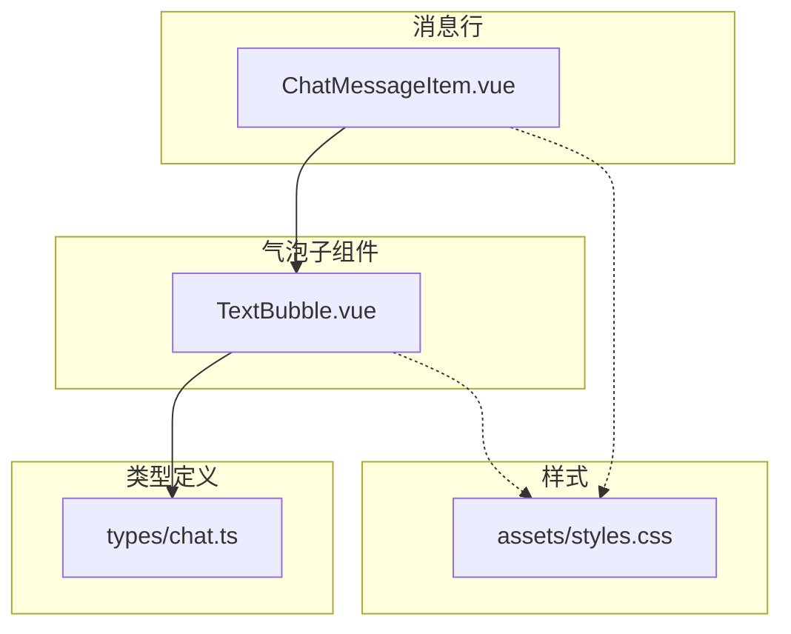
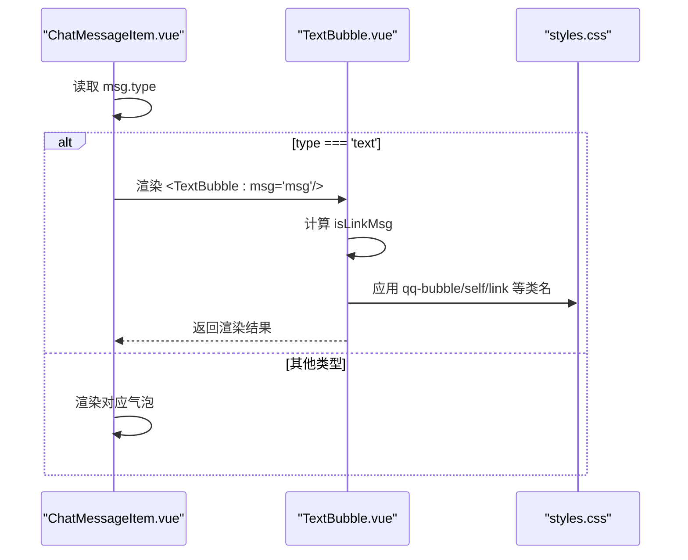
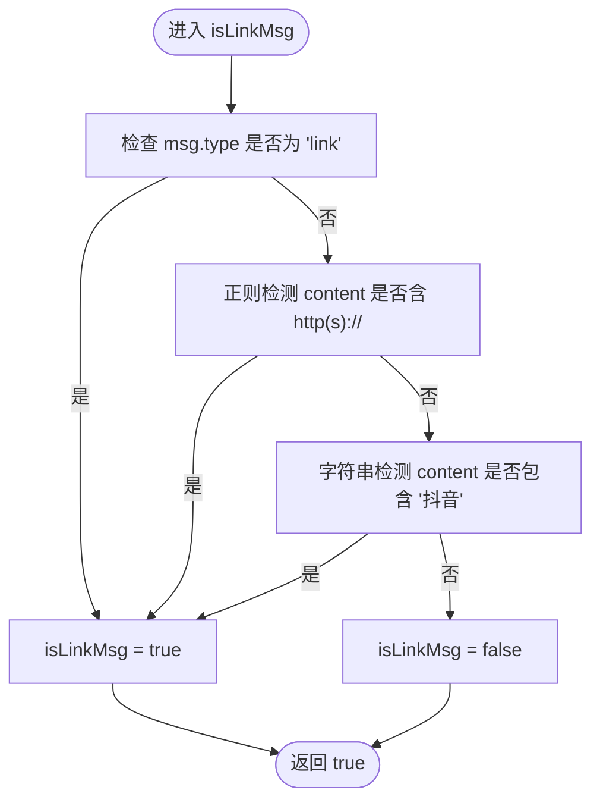
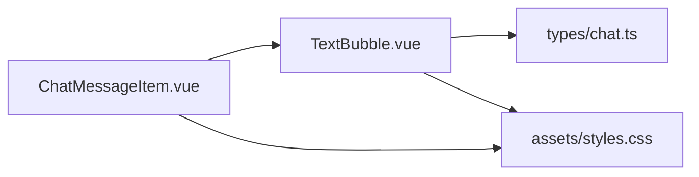

# 文本消息气泡

<cite>
**本文引用的文件**
- [TextBubble.vue](file://linkx-client/src/components/chat/bubbles/TextBubble.vue)
- [ChatMessageItem.vue](file://linkx-client/src/components/chat/ChatMessageItem.vue)
- [styles.css](file://linkx-client/src/assets/styles.css)
- [chat.ts](file://linkx-client/src/types/chat.ts)
</cite>

## 目录
1. [简介](#简介)
2. [项目结构](#项目结构)
3. [核心组件](#核心组件)
4. [架构总览](#架构总览)
5. [详细组件分析](#详细组件分析)
6. [依赖关系分析](#依赖关系分析)
7. [性能与可维护性](#性能与可维护性)
8. [故障排查指南](#故障排查指南)
9. [结论](#结论)
10. [附录：使用示例与样式定制](#附录使用示例与样式定制)

## 简介
本文件围绕“文本消息气泡”组件进行深度说明，重点覆盖以下方面：
- 文本消息的渲染机制：纯文本显示、链接自动识别与格式化、回复引用条的实现逻辑。
- isLinkMsg 计算属性的判断规则：type=link、http(s) URL 检测、抖音关键字匹配。
- 链接图标的显示条件。
- 气泡样式系统：self 类名控制左右对齐、link 类名的特殊样式处理。
- 组件使用示例与自定义样式方法。

## 项目结构
与文本消息气泡相关的代码主要位于聊天气泡子目录与全局样式文件中，并由消息行组件统一分发渲染。

图表来源
- [ChatMessageItem.vue:82-89](file://linkx-client/src/components/chat/ChatMessageItem.vue#L82-L89)
- [TextBubble.vue:1-33](file://linkx-client/src/components/chat/bubbles/TextBubble.vue#L1-L33)
- [styles.css:122-175](file://linkx-client/src/assets/styles.css#L122-L175)
- [chat.ts:15-28](file://linkx-client/src/types/chat.ts#L15-L28)

章节来源
- [ChatMessageItem.vue:82-89](file://linkx-client/src/components/chat/ChatMessageItem.vue#L82-L89)
- [TextBubble.vue:1-33](file://linkx-client/src/components/chat/bubbles/TextBubble.vue#L1-L33)
- [styles.css:122-175](file://linkx-client/src/assets/styles.css#L122-L175)
- [chat.ts:15-28](file://linkx-client/src/types/chat.ts#L15-L28)

## 核心组件
- TextBubble.vue：负责文本/链接气泡的渲染、链接判定、回复引用条展示以及链接图标显示。
- ChatMessageItem.vue：根据消息 type 将具体气泡子组件（包括 TextBubble）挂载到消息行中，并处理头像与事件透传。
- styles.css：提供气泡基础样式、self/link 等修饰样式、回复引用条样式等。
- types/chat.ts：定义消息数据结构，供组件消费。

章节来源
- [TextBubble.vue:1-33](file://linkx-client/src/components/chat/bubbles/TextBubble.vue#L1-L33)
- [ChatMessageItem.vue:82-89](file://linkx-client/src/components/chat/ChatMessageItem.vue#L82-L89)
- [styles.css:122-175](file://linkx-client/src/assets/styles.css#L122-L175)
- [chat.ts:15-28](file://linkx-client/src/types/chat.ts#L15-L28)

## 架构总览
文本消息从数据到视图的关键路径如下：
- 父层 ChatMessageItem 根据 msg.type 选择渲染 TextBubble。
- TextBubble 内部通过 computed 计算 isLinkMsg，决定 link 类名与链接图标是否显示。
- 模板中根据 msg.replyTo 是否存在，决定是否渲染回复引用条。
- 样式由全局样式文件提供，self 控制自身侧背景色，link 对文本换行与边距做特殊处理。

图表来源
- [ChatMessageItem.vue:82-89](file://linkx-client/src/components/chat/ChatMessageItem.vue#L82-L89)
- [TextBubble.vue:16-19](file://linkx-client/src/components/chat/bubbles/TextBubble.vue#L16-L19)
- [styles.css:122-175](file://linkx-client/src/assets/styles.css#L122-L175)

## 详细组件分析

### 文本消息渲染流程
- 父组件 ChatMessageItem 在消息行内按 type 分发到不同气泡子组件；当 type 为 text 时，渲染 TextBubble。
- TextBubble 接收 msg 作为 props，并在模板中输出：
  - 可选的回复引用条（基于 msg.replyTo）。
  - 文本内容段落（基于 msg.content）。
  - 链接图标（基于 isLinkMsg）。

章节来源
- [ChatMessageItem.vue:82-89](file://linkx-client/src/components/chat/ChatMessageItem.vue#L82-L89)
- [TextBubble.vue:22-31](file://linkx-client/src/components/chat/bubbles/TextBubble.vue#L22-L31)

### isLinkMsg 计算属性与链接识别规则
- 判定条件（满足任一即为链接类消息）：
  - 显式标记：msg.type === 'link'
  - 协议前缀匹配：content 包含 http:// 或 https://
  - 平台关键词：content 包含“抖音”
- 该计算属性用于：
  - 给外层气泡容器添加 link 类名，触发特殊样式。
  - 控制链接图标 n-icon 的显示。

图表来源
- [TextBubble.vue:16-19](file://linkx-client/src/components/chat/bubbles/TextBubble.vue#L16-L19)

章节来源
- [TextBubble.vue:16-19](file://linkx-client/src/components/chat/bubbles/TextBubble.vue#L16-L19)

### 回复引用条实现逻辑
- 条件渲染：当 msg.replyTo 存在时，渲染一个引用条，内容为发送者名称与引用内容的拼接。
- 样式：引用条采用较小字号、浅色背景、左侧强调边框，且单行省略溢出。

章节来源
- [TextBubble.vue:26-28](file://linkx-client/src/components/chat/bubbles/TextBubble.vue#L26-L28)
- [styles.css:155-159](file://linkx-client/src/assets/styles.css#L155-L159)

### 链接图标显示条件
- 图标仅在 isLinkMsg 为真时显示。
- 图标使用 Naive UI 的 NIcon 组件，传入 LinkOutline 图标。

章节来源
- [TextBubble.vue:30](file://linkx-client/src/components/chat/bubbles/TextBubble.vue#L30)

### 气泡样式系统
- 基础气泡：
  - 类名 qq-bubble：设置背景、圆角、内边距、字体大小与行高、阴影等。
- 自身侧对齐与背景：
  - 类名 self：当 msg.isSelf 为真时附加，改变气泡背景色以区分自己/对方。
- 链接类特殊样式：
  - 类名 link：当 isLinkMsg 为真时附加，调整文本段落的 margin 与换行策略，使长链接更紧凑可读。
- 链接图标：
  - 类名 qq-link-ico：默认隐藏，可通过外部样式按需显示。
- 文本段落：
  - 类名 qq-bubble-text：保留空白符、允许断词换行。

章节来源
- [styles.css:122-175](file://linkx-client/src/assets/styles.css#L122-L175)
- [TextBubble.vue:24](file://linkx-client/src/components/chat/bubbles/TextBubble.vue#L24)

### 数据模型与字段约定
- 消息体类型：
  - type 支持 text/image/file 等；对于链接场景，既可使用 type='link'，也可仅凭 content 中的 http(s) 或“抖音”关键字被识别为链接。
  - content 为文本主体。
  - isSelf 用于控制气泡自身侧样式。
  - replyTo 为可选对象，包含 senderName 与 content 用于引用条展示。

章节来源
- [chat.ts:15-28](file://linkx-client/src/types/chat.ts#L15-L28)
- [TextBubble.vue:26-28](file://linkx-client/src/components/chat/bubbles/TextBubble.vue#L26-L28)

## 依赖关系分析
- 组件间依赖：
  - ChatMessageItem 依赖 TextBubble 完成文本消息渲染。
  - TextBubble 依赖 Vue 的 computed 与 Naive UI 的 NIcon。
- 样式依赖：
  - 所有气泡样式集中在全局样式文件中，避免重复定义。
- 类型依赖：
  - 组件通过 TypeScript 接口约束消息结构，确保字段可用性与一致性。

图表来源
- [ChatMessageItem.vue:82-89](file://linkx-client/src/components/chat/ChatMessageItem.vue#L82-L89)
- [TextBubble.vue:1-33](file://linkx-client/src/components/chat/bubbles/TextBubble.vue#L1-L33)
- [styles.css:122-175](file://linkx-client/src/assets/styles.css#L122-L175)
- [chat.ts:15-28](file://linkx-client/src/types/chat.ts#L15-L28)

章节来源
- [ChatMessageItem.vue:82-89](file://linkx-client/src/components/chat/ChatMessageItem.vue#L82-L89)
- [TextBubble.vue:1-33](file://linkx-client/src/components/chat/bubbles/TextBubble.vue#L1-L33)
- [styles.css:122-175](file://linkx-client/src/assets/styles.css#L122-L175)
- [chat.ts:15-28](file://linkx-client/src/types/chat.ts#L15-L28)

## 性能与可维护性
- 计算属性 isLinkMsg 在每次 msg 变化时重新计算，复杂度极低（字符串匹配与正则），开销可忽略。
- 条件渲染减少不必要的 DOM 节点创建，提升滚动列表性能。
- 样式集中管理，便于主题化与统一修改。
- 建议：
  - 若未来链接识别规则增多，可将规则抽取为独立工具函数，提高可测试性与复用性。
  - 如需支持更多平台关键词，建议配置化扩展，避免硬编码。

[本节为通用指导，不直接分析具体文件]

## 故障排查指南
- 链接未识别：
  - 确认 msg.type 是否为 'link'，或 content 是否包含 http(s) 前缀，或是否包含“抖音”。
  - 检查 isLinkMsg 的计算结果是否符合预期。
- 引用条不显示：
  - 确认 msg.replyTo 是否存在且包含必要字段（senderName、content）。
- 链接图标不显示：
  - 确认 isLinkMsg 为真，且未通过外部样式强制隐藏 qq-link-ico。
- 样式异常：
  - 检查全局样式是否被覆盖，尤其是 .qq-bubble.self 与 .qq-bubble.link 的优先级。

章节来源
- [TextBubble.vue:16-19](file://linkx-client/src/components/chat/bubbles/TextBubble.vue#L16-L19)
- [TextBubble.vue:26-31](file://linkx-client/src/components/chat/bubbles/TextBubble.vue#L26-L31)
- [styles.css:122-175](file://linkx-client/src/assets/styles.css#L122-L175)

## 结论
TextBubble 组件以最小依赖实现了文本消息的基础能力：纯文本展示、链接识别与格式化、回复引用条与链接图标提示。其样式体系通过 self/link 类名清晰地区分状态，配合全局样式统一管理，具备良好的可维护性与可扩展性。

[本节为总结性内容，不直接分析具体文件]

## 附录：使用示例与样式定制

### 基本用法
- 在消息列表中，当消息类型为 text 时，父组件会自动渲染 TextBubble。
- 需要展示链接效果时，可直接在 content 中包含 http(s) 链接，或在业务层将 type 设置为 'link'。
- 需要展示回复引用时，在消息数据中提供 replyTo 对象。

章节来源
- [ChatMessageItem.vue:82-89](file://linkx-client/src/components/chat/ChatMessageItem.vue#L82-L89)
- [TextBubble.vue:26-31](file://linkx-client/src/components/chat/bubbles/TextBubble.vue#L26-L31)

### 自定义样式
- 修改气泡外观：
  - 覆盖 .qq-bubble 相关样式（背景、圆角、内边距、阴影等）。
- 调整自身侧背景：
  - 覆盖 .qq-bubble.self 的背景色。
- 调整链接文本排版：
  - 覆盖 .qq-bubble.link .qq-bubble-text 的 margin 与换行策略。
- 显示链接图标：
  - 通过外部样式将 .qq-link-ico 的 display 改为 inline-flex/block，并调整尺寸与颜色。

章节来源
- [styles.css:122-175](file://linkx-client/src/assets/styles.css#L122-L175)