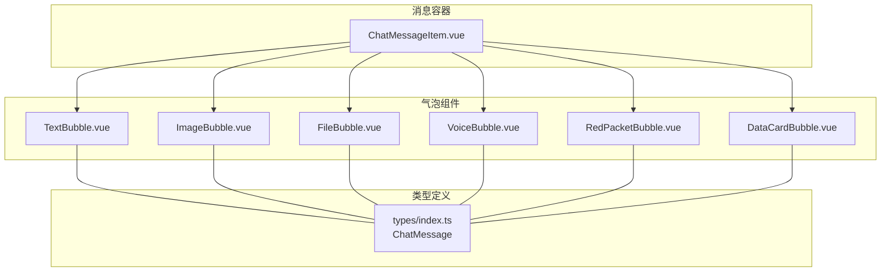
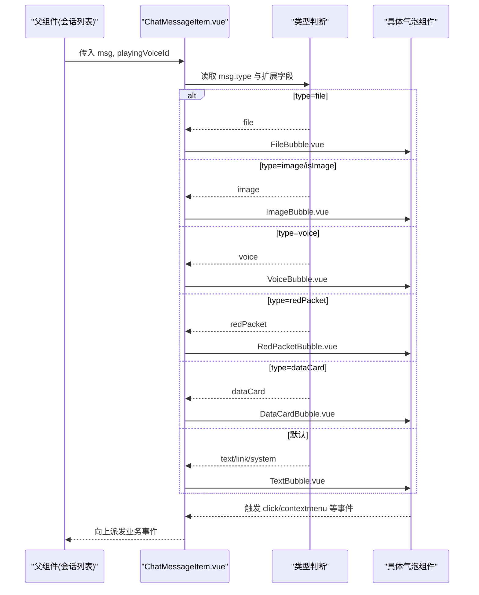
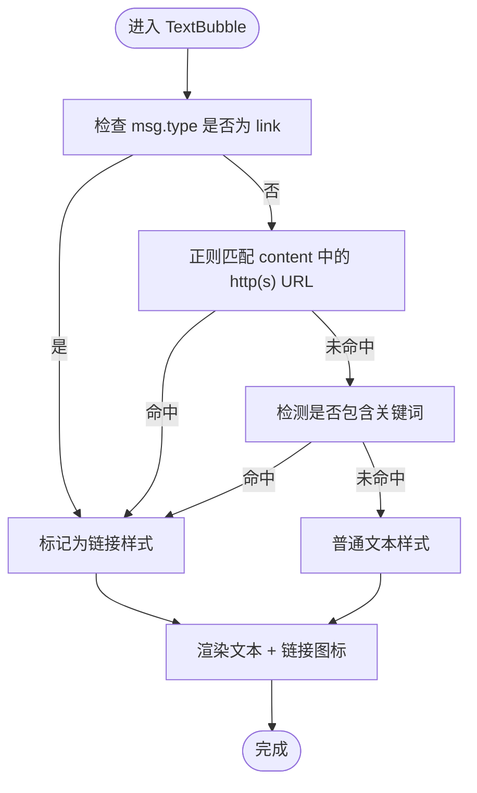
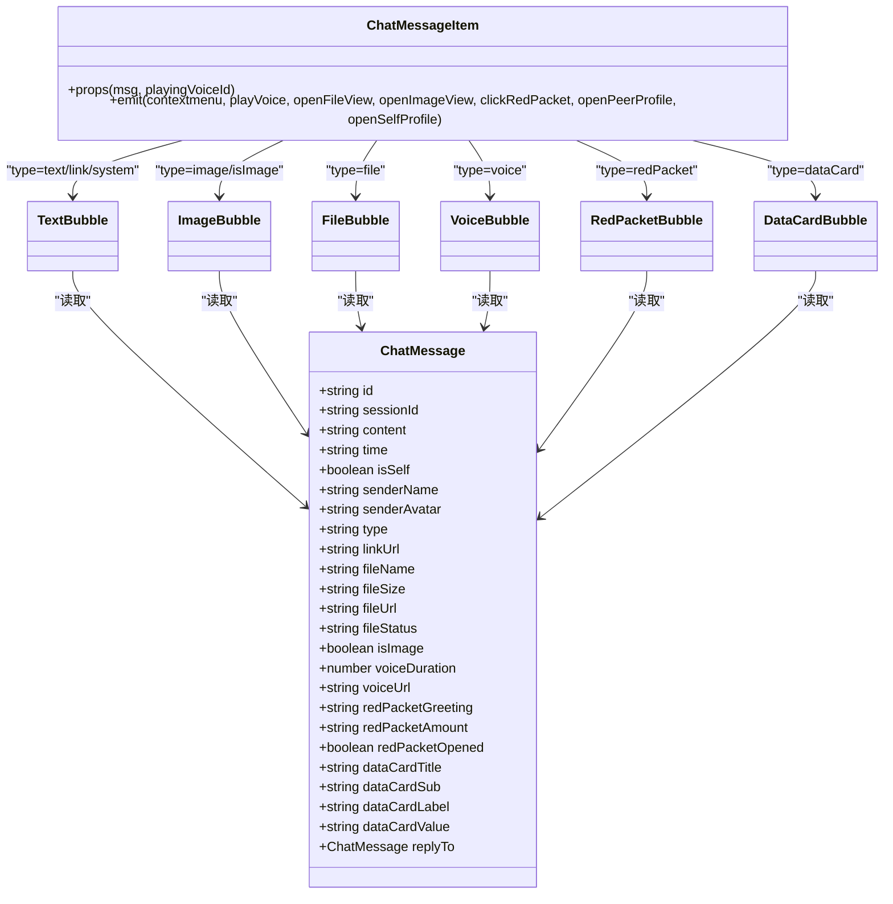

# 消息气泡组件

<cite>
**本文引用的文件**   
- [TextBubble.vue](file://linkx-client/src/components/chat/bubbles/TextBubble.vue)
- [ImageBubble.vue](file://linkx-client/src/components/chat/bubbles/ImageBubble.vue)
- [FileBubble.vue](file://linkx-client/src/components/chat/bubbles/FileBubble.vue)
- [VoiceBubble.vue](file://linkx-client/src/components/chat/bubbles/VoiceBubble.vue)
- [RedPacketBubble.vue](file://linkx-client/src/components/chat/bubbles/RedPacketBubble.vue)
- [DataCardBubble.vue](file://linkx-client/src/components/chat/bubbles/DataCardBubble.vue)
- [ChatMessageItem.vue](file://linkx-client/src/components/chat/ChatMessageItem.vue)
- [index.ts](file://linkx-client/src/types/index.ts)
</cite>

## 目录
1. [简介](#简介)
2. [项目结构](#项目结构)
3. [核心组件](#核心组件)
4. [架构总览](#架构总览)
5. [详细组件分析](#详细组件分析)
6. [依赖关系分析](#依赖关系分析)
7. [性能与安全](#性能与安全)
8. [样式定制与扩展机制](#样式定制与扩展机制)
9. [故障排查指南](#故障排查指南)
10. [结论](#结论)

## 简介
本文件为 LinkX 客户端“消息气泡组件系统”的技术文档，聚焦于聊天界面中各类消息的可视化呈现与交互：文本、图片、文件、语音、红包与数据卡片。文档从统一接口设计、渲染流程、样式定制、安全与性能优化、跨平台兼容等维度进行系统化说明，帮助开发者快速理解并扩展气泡能力。

## 项目结构
消息气泡位于 chat 模块下的 bubbles 子目录，由统一的单条消息容器 ChatMessageItem 根据消息类型分发到具体气泡组件。消息数据结构定义在 types/index.ts 的 ChatMessage 接口中。

图表来源
- [ChatMessageItem.vue:1-176](file://linkx-client/src/components/chat/ChatMessageItem.vue#L1-L176)
- [TextBubble.vue:1-33](file://linkx-client/src/components/chat/bubbles/TextBubble.vue#L1-L33)
- [ImageBubble.vue:1-19](file://linkx-client/src/components/chat/bubbles/ImageBubble.vue#L1-L19)
- [FileBubble.vue:1-32](file://linkx-client/src/components/chat/bubbles/FileBubble.vue#L1-L32)
- [VoiceBubble.vue:1-33](file://linkx-client/src/components/chat/bubbles/VoiceBubble.vue#L1-L33)
- [RedPacketBubble.vue:1-25](file://linkx-client/src/components/chat/bubbles/RedPacketBubble.vue#L1-L25)
- [DataCardBubble.vue:1-106](file://linkx-client/src/components/chat/bubbles/DataCardBubble.vue#L1-L106)
- [index.ts:43-83](file://linkx-client/src/types/index.ts#L43-L83)

章节来源
- [ChatMessageItem.vue:1-176](file://linkx-client/src/components/chat/ChatMessageItem.vue#L1-L176)
- [index.ts:43-83](file://linkx-client/src/types/index.ts#L43-L83)

## 核心组件
- 统一入口：ChatMessageItem 负责按消息 type 选择对应气泡组件，并向父层派发事件（如播放语音、打开图片/文件、点击红包等）。
- 统一数据契约：所有气泡通过 props.msg 接收 ChatMessage，遵循一致的字段约定；部分气泡还接收额外 props（如 VoiceBubble 的 playing）。
- 统一样式基类：基础气泡使用 qq-bubble 类，配合 self/link/playing/opened 等修饰类实现主题化与状态化展示。

章节来源
- [ChatMessageItem.vue:20-96](file://linkx-client/src/components/chat/ChatMessageItem.vue#L20-L96)
- [index.ts:43-83](file://linkx-client/src/types/index.ts#L43-L83)

## 架构总览
下图展示了消息从数据到视图的分发与渲染路径，以及各气泡组件的职责边界。

图表来源
- [ChatMessageItem.vue:81-96](file://linkx-client/src/components/chat/ChatMessageItem.vue#L81-L96)
- [TextBubble.vue:1-33](file://linkx-client/src/components/chat/bubbles/TextBubble.vue#L1-L33)
- [ImageBubble.vue:1-19](file://linkx-client/src/components/chat/bubbles/ImageBubble.vue#L1-L19)
- [FileBubble.vue:1-32](file://linkx-client/src/components/chat/bubbles/FileBubble.vue#L1-L32)
- [VoiceBubble.vue:1-33](file://linkx-client/src/components/chat/bubbles/VoiceBubble.vue#L1-L33)
- [RedPacketBubble.vue:1-25](file://linkx-client/src/components/chat/bubbles/RedPacketBubble.vue#L1-L25)
- [DataCardBubble.vue:1-106](file://linkx-client/src/components/chat/bubbles/DataCardBubble.vue#L1-L106)

## 详细组件分析

### TextBubble 文本消息
- 功能要点
  - 支持普通文本与链接样式的区分显示。
  - 当 type=link、content 包含 http(s) URL 或包含特定关键词时，以链接样式渲染并附加图标提示。
  - 支持回复引用条，展示被回复者的昵称与内容摘要。
- 关键逻辑
  - 链接判定：基于 type 与 content 的正则匹配及关键词检测。
  - 引用条：当存在 replyTo 时渲染引用信息。
- 事件与交互
  - 无直接事件派发，点击行为交由上层处理（如需跳转链接可在此扩展）。
- 样式与主题
  - 使用 qq-bubble 基础样式，self 修饰用于自己侧高亮，link 修饰用于链接样式。
- 安全与渲染
  - 当前以纯文本渲染，避免 XSS 风险；如需富文本需引入白名单过滤与转义策略。
- 复杂度与性能
  - 计算属性 isLinkMsg 仅做轻量字符串判断，开销极低。

图表来源
- [TextBubble.vue:15-19](file://linkx-client/src/components/chat/bubbles/TextBubble.vue#L15-L19)
- [TextBubble.vue:22-32](file://linkx-client/src/components/chat/bubbles/TextBubble.vue#L22-L32)

章节来源
- [TextBubble.vue:1-33](file://linkx-client/src/components/chat/bubbles/TextBubble.vue#L1-L33)

### ImageBubble 图片消息
- 功能要点
  - 渲染图片预览，content 可为远程 URL 或 DataURL。
  - 点击事件由父组件捕获，用于打开大图预览。
- 关键逻辑
  - 将 msg.content 作为 img 的 src 直接绑定。
- 事件与交互
  - 向上传播 click 事件，由 ChatMessageItem 转发给上层打开预览。
- 样式与主题
  - 使用 qq-bubble.image-bubble 包裹，限制最大宽高并圆角显示。
- 安全与渲染
  - 建议对 content 进行来源校验与协议白名单过滤，避免加载恶意资源。
- 性能与体验
  - 建议结合懒加载与缩略图策略，减少首屏压力。

章节来源
- [ImageBubble.vue:1-19](file://linkx-client/src/components/chat/bubbles/ImageBubble.vue#L1-L19)
- [ChatMessageItem.vue:84-85](file://linkx-client/src/components/chat/ChatMessageItem.vue#L84-L85)

### FileBubble 文件消息
- 功能要点
  - 展示文件名、大小与底部状态栏（已发送/已下载等）。
  - 点击可触发文件查看或下载流程。
- 关键逻辑
  - 优先使用 fileName，其次回退到 content 或固定文案。
  - 状态栏显示 fileStatus，若为空则根据 isSelf 给出默认文案。
- 事件与交互
  - 点击事件由父组件捕获，用于打开文件预览或下载。
- 样式与主题
  - 使用 qq-file-card 卡片样式，主区域含图标与元信息，底部为状态条。
- 安全与渲染
  - 文件名与大小来自服务端，建议前端二次校验与格式化。
- 性能与体验
  - 大文件场景建议提供进度反馈与断点续传（可在上层实现）。

章节来源
- [FileBubble.vue:1-32](file://linkx-client/src/components/chat/bubbles/FileBubble.vue#L1-L32)
- [ChatMessageItem.vue:83](file://linkx-client/src/components/chat/ChatMessageItem.vue#L83)

### VoiceBubble 语音消息
- 功能要点
  - 展示麦克风图标与时长，支持播放态高亮。
  - 时长格式化：小于 60 秒显示“秒”，否则显示“分'秒”。
- 关键逻辑
  - formatVoiceDuration 函数负责时长格式化。
  - 通过 playing prop 控制高亮样式。
- 事件与交互
  - 点击触发播放，由父组件管理播放状态与音频实例。
- 样式与主题
  - 使用 qq-bubble.voice-bubble，playing 修饰用于强调播放态。
- 安全与渲染
  - 音频 URL 应进行来源校验与 HTTPS 强制。
- 性能与体验
  - 建议复用 Audio 实例、预加载与节流点击，避免并发播放。

章节来源
- [VoiceBubble.vue:1-33](file://linkx-client/src/components/chat/bubbles/VoiceBubble.vue#L1-L33)
- [ChatMessageItem.vue:85](file://linkx-client/src/components/chat/ChatMessageItem.vue#L85)

### RedPacketBubble 红包消息
- 功能要点
  - 展示祝福语与领取状态，opened 时降低不透明度。
  - 根据 isSelf 与 opened 决定按钮文案。
- 关键逻辑
  - 标题优先使用 redPacketGreeting，否则回退到 content。
  - 子文案根据 opened 与 isSelf 动态切换。
- 事件与交互
  - 点击触发红包相关操作（如开红包），由父组件处理。
- 样式与主题
  - 使用渐变背景与阴影营造卡片质感，opened 修饰降低视觉强度。
- 安全与渲染
  - 文案来自服务端，建议做长度与字符集限制。
- 性能与体验
  - 动画效果可通过 CSS transition 实现，避免重排重绘。

章节来源
- [RedPacketBubble.vue:1-25](file://linkx-client/src/components/chat/bubbles/RedPacketBubble.vue#L1-L25)
- [ChatMessageItem.vue:86](file://linkx-client/src/components/chat/ChatMessageItem.vue#L86)

### DataCardBubble 数据卡片消息
- 功能要点
  - 结构化展示卡片信息：头部（图标、标题、副标题、标签）、分隔线、数值区（标签与值）。
  - 字段来源于 ChatMessage 的 dataCard* 扩展属性。
- 关键逻辑
  - 多字段具备默认回退值，保证空数据时的可读性。
- 事件与交互
  - 当前为只读展示，可按需在头部或数值区添加点击回调。
- 样式与主题
  - 独立 scoped 样式，使用主题变量控制背景、边框与文字色。
- 安全与渲染
  - 文本内容建议做长度截断与换行控制。
- 性能与体验
  - 卡片宽度固定，避免长列表滚动抖动。

章节来源
- [DataCardBubble.vue:1-106](file://linkx-client/src/components/chat/bubbles/DataCardBubble.vue#L1-L106)

## 依赖关系分析
- 组件耦合
  - ChatMessageItem 与气泡组件之间通过 props.msg 解耦，事件通过 emit 上抛，职责清晰。
- 外部依赖
  - 图标库：Naive UI 的 NIcon 与 @vicons/ionicons5。
  - 主题变量：全局 CSS 变量（如 --lx-bg-card、--lx-accent 等）驱动样式。
- 类型契约
  - ChatMessage 是所有气泡的数据契约，新增消息类型需同步扩展该接口。

图表来源
- [index.ts:43-83](file://linkx-client/src/types/index.ts#L43-L83)
- [ChatMessageItem.vue:20-96](file://linkx-client/src/components/chat/ChatMessageItem.vue#L20-L96)
- [TextBubble.vue:1-33](file://linkx-client/src/components/chat/bubbles/TextBubble.vue#L1-L33)
- [ImageBubble.vue:1-19](file://linkx-client/src/components/chat/bubbles/ImageBubble.vue#L1-L19)
- [FileBubble.vue:1-32](file://linkx-client/src/components/chat/bubbles/FileBubble.vue#L1-L32)
- [VoiceBubble.vue:1-33](file://linkx-client/src/components/chat/bubbles/VoiceBubble.vue#L1-L33)
- [RedPacketBubble.vue:1-25](file://linkx-client/src/components/chat/bubbles/RedPacketBubble.vue#L1-L25)
- [DataCardBubble.vue:1-106](file://linkx-client/src/components/chat/bubbles/DataCardBubble.vue#L1-L106)

章节来源
- [index.ts:43-83](file://linkx-client/src/types/index.ts#L43-L83)
- [ChatMessageItem.vue:20-96](file://linkx-client/src/components/chat/ChatMessageItem.vue#L20-L96)

## 性能与安全
- 安全渲染
  - 文本与卡片均使用纯文本渲染，避免 XSS；如需富文本，请引入白名单过滤与 HTML 转义。
  - 图片与文件 URL 应进行来源校验与协议白名单（https 优先）。
- 性能优化
  - 图片：建议使用缩略图、懒加载与占位图；必要时启用浏览器缓存。
  - 语音：复用 Audio 实例，避免并发播放；按需预加载。
  - 列表渲染：确保 key 稳定且唯一，避免不必要的重渲染。
- 跨平台兼容
  - Electron 环境下注意本地文件协议与权限；移动端 WebView 注意自动播放策略与用户手势要求。
  - 字体与图标在不同平台可能略有差异，建议通过 CSS 变量与 fallback 方案保障一致性。

[本节为通用指导，无需代码来源]

## 样式定制与扩展机制
- 统一样式基类
  - 基础气泡：qq-bubble，配合 self/link/playing/opened 等修饰类实现主题化与状态化。
  - 文件卡片：qq-file-card；图片气泡：image-bubble；语音气泡：voice-bubble；红包卡片：red-packet-card；数据卡片：data-card。
- 主题变量
  - 通过 CSS 变量（如 --lx-bg-card、--lx-radius、--lx-accent、--lx-text-body 等）实现一键换肤。
- 扩展新消息类型
  - 步骤一：在 ChatMessage 接口中新增 type 字面量与必要扩展字段。
  - 步骤二：新建气泡组件，遵循 props.msg 契约与 qq-bubble 基类规范。
  - 步骤三：在 ChatMessageItem 的类型分支中添加新类型的渲染与事件派发。
  - 步骤四：补充样式与主题变量，确保暗色模式与不同屏幕尺寸下表现一致。

章节来源
- [ChatMessageItem.vue:122-175](file://linkx-client/src/components/chat/ChatMessageItem.vue#L122-L175)
- [index.ts:43-83](file://linkx-client/src/types/index.ts#L43-L83)

## 故障排查指南
- 图片无法显示
  - 检查 content 是否为有效 URL 或 DataURL；确认网络可达与跨域策略。
  - 在开发环境开启控制台日志，观察请求状态码与错误信息。
- 语音不播放
  - 确认 voiceUrl 可用且为 https；检查浏览器自动播放策略与用户交互前置条件。
  - 验证 playing 状态是否正确传递与更新。
- 红包点击无效
  - 确认父组件已监听 clickRedPacket 事件并实现相应逻辑。
- 文件卡片点击无响应
  - 确认父组件已监听 openFileView 事件并实现打开/下载逻辑。
- 样式错乱
  - 检查 CSS 变量是否注入；确认 qq-bubble 及其修饰类未被覆盖。
  - 在移动端或 Electron 环境中检查缩放与像素密度导致的布局问题。

章节来源
- [ChatMessageItem.vue:81-96](file://linkx-client/src/components/chat/ChatMessageItem.vue#L81-L96)
- [ChatMessageItem.vue:122-175](file://linkx-client/src/components/chat/ChatMessageItem.vue#L122-L175)

## 结论
LinkX 的消息气泡组件体系以 ChatMessage 为统一数据契约，通过 ChatMessageItem 进行类型分发，各气泡组件专注单一职责与良好封装。整体架构清晰、可扩展性强，并通过 CSS 变量与统一基类实现主题化与一致性。建议在后续迭代中完善富文本白名单、图片缩略图与语音播放管理等增强特性，以提升安全性与用户体验。