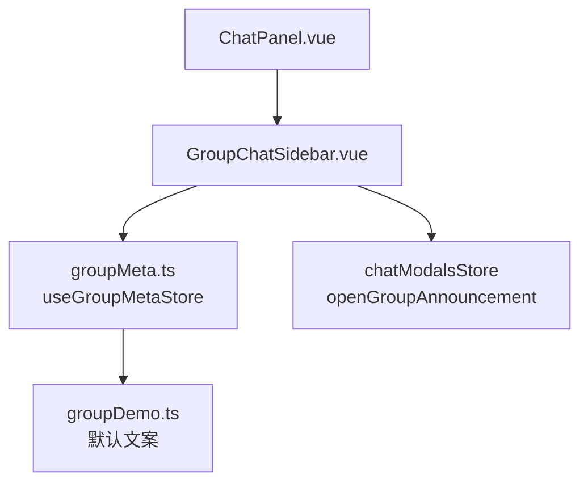
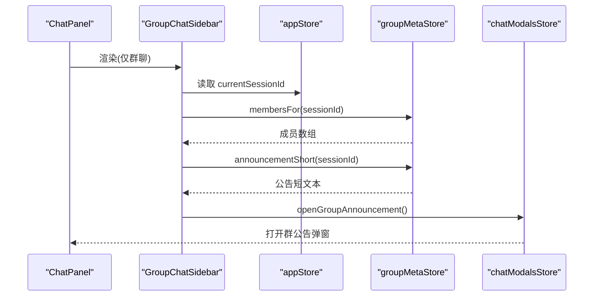
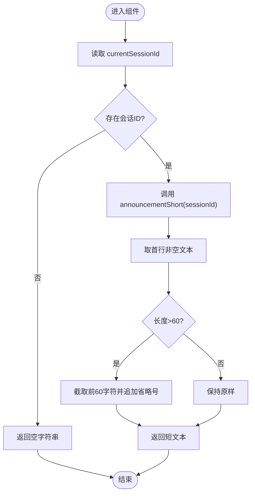
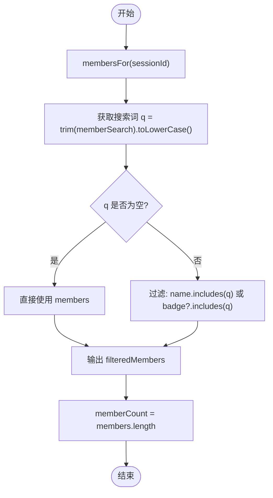
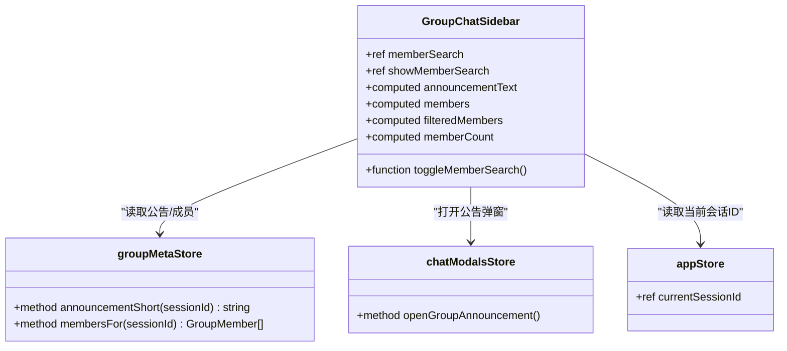

# 群组侧边栏

<cite>
**本文引用的文件**
- [GroupChatSidebar.vue](file://linkx-client/src/components/chat/GroupChatSidebar.vue)
- [groupMeta.ts](file://linkx-client/src/stores/groupMeta.ts)
- [groupDemo.ts](file://linkx-client/src/data/groupDemo.ts)
- [ChatPanel.vue](file://linkx-client/src/components/ChatPanel.vue)
</cite>

## 目录
1. [简介](#简介)
2. [项目结构](#项目结构)
3. [核心组件与职责](#核心组件与职责)
4. [架构总览](#架构总览)
5. [详细组件分析](#详细组件分析)
6. [依赖关系分析](#依赖关系分析)
7. [性能考量](#性能考量)
8. [故障排查指南](#故障排查指南)
9. [结论](#结论)
10. [附录：接口与样式定制](#附录接口与样式定制)

## 简介
本文件为 LinkX 群组侧边栏组件 GroupChatSidebar 的详细文档，聚焦以下能力：
- 群公告短文本展示与跳转查看完整公告
- 成员列表管理与搜索过滤（按昵称或徽章）
- 成员徽章系统（如“群主”“管理员”）
- 组件状态管理、计算属性与事件处理机制
- 与 groupMetaStore 的数据交互模式
- 响应式布局与样式定制选项

## 项目结构
GroupChatSidebar 作为聊天面板的右侧固定区域，仅在群聊会话中渲染。其数据来源于 Pinia store groupMetaStore，并通过 chatModalsStore 打开群公告弹窗。

图表来源
- [ChatPanel.vue:583-584](file://linkx-client/src/components/ChatPanel.vue#L583-L584)
- [GroupChatSidebar.vue:1-249](file://linkx-client/src/components/chat/GroupChatSidebar.vue#L1-L249)
- [groupMeta.ts:104-289](file://linkx-client/src/stores/groupMeta.ts#L104-L289)
- [groupDemo.ts:1-16](file://linkx-client/src/data/groupDemo.ts#L1-L16)

章节来源
- [ChatPanel.vue:583-584](file://linkx-client/src/components/ChatPanel.vue#L583-L584)
- [GroupChatSidebar.vue:1-249](file://linkx-client/src/components/chat/GroupChatSidebar.vue#L1-L249)
- [groupMeta.ts:104-289](file://linkx-client/src/stores/groupMeta.ts#L104-L289)
- [groupDemo.ts:1-16](file://linkx-client/src/data/groupDemo.ts#L1-L16)

## 核心组件与职责
- GroupChatSidebar.vue
  - 负责群公告短文本展示、点击跳转完整公告
  - 负责成员列表渲染、搜索输入框显示/隐藏、按昵称或徽章过滤
  - 通过 computed 派生 announcementText、members、filteredMembers、memberCount
  - 通过 ref 管理 memberSearch、showMemberSearch 本地状态
  - 通过 storeToRefs 读取 appStore.currentSessionId
  - 调用 chatModalsStore.openGroupAnnouncement 打开公告弹窗
- groupMeta.ts
  - 提供 announcementShort(sessionId)、membersFor(sessionId) 等只读方法
  - 懒加载默认数据（公告、成员、精华、文件、相册）
  - 支持更新公告、添加成员、添加文件/相册等操作
- ChatPanel.vue
  - 在 isGroupChat 为真时渲染 GroupChatSidebar
  - 将当前会话 ID 暴露给子组件使用

章节来源
- [GroupChatSidebar.vue:1-249](file://linkx-client/src/components/chat/GroupChatSidebar.vue#L1-L249)
- [groupMeta.ts:104-289](file://linkx-client/src/stores/groupMeta.ts#L104-L289)
- [ChatPanel.vue:583-584](file://linkx-client/src/components/ChatPanel.vue#L583-L584)

## 架构总览
下图展示了从父组件到侧边栏再到 Store 的数据流与事件流。

图表来源
- [ChatPanel.vue:583-584](file://linkx-client/src/components/ChatPanel.vue#L583-L584)
- [GroupChatSidebar.vue:17-21](file://linkx-client/src/components/chat/GroupChatSidebar.vue#L17-L21)
- [GroupChatSidebar.vue:28-32](file://linkx-client/src/components/chat/GroupChatSidebar.vue#L28-L32)
- [GroupChatSidebar.vue:34-39](file://linkx-client/src/components/chat/GroupChatSidebar.vue#L34-L39)
- [GroupChatSidebar.vue:67-73](file://linkx-client/src/components/chat/GroupChatSidebar.vue#L67-L73)
- [groupMeta.ts:136-140](file://linkx-client/src/stores/groupMeta.ts#L136-L140)
- [groupMeta.ts:195-200](file://linkx-client/src/stores/groupMeta.ts#L195-L200)

## 详细组件分析

### 群公告短文本展示逻辑
- 数据来源
  - 通过 currentSessionId 定位当前群会话
  - 调用 groupMetaStore.announcementShort(sessionId) 获取首行摘要，最多 60 字，超长以省略号结尾；若无内容则回退到演示短文案
- 交互行为
  - 点击按钮或文本区域均触发 openGroupAnnouncement，打开完整公告弹窗
- 计算属性
  - announcementText：基于 currentSessionId 与 groupMetaStore 派生的只读值

图表来源
- [GroupChatSidebar.vue:28-32](file://linkx-client/src/components/chat/GroupChatSidebar.vue#L28-L32)
- [groupMeta.ts:136-140](file://linkx-client/src/stores/groupMeta.ts#L136-L140)
- [groupDemo.ts:14-16](file://linkx-client/src/data/groupDemo.ts#L14-L16)

章节来源
- [GroupChatSidebar.vue:28-32](file://linkx-client/src/components/chat/GroupChatSidebar.vue#L28-L32)
- [groupMeta.ts:136-140](file://linkx-client/src/stores/groupMeta.ts#L136-L140)
- [groupDemo.ts:14-16](file://linkx-client/src/data/groupDemo.ts#L14-L16)

### 成员列表与搜索过滤
- 数据来源
  - members：通过 membersFor(sessionId) 获取成员数组（懒加载默认成员）
  - filteredMembers：根据 memberSearch 关键词对 members 进行过滤，匹配条件为昵称或徽章（不区分大小写）
  - memberCount：成员总数
- 交互行为
  - toggleMemberSearch：切换搜索框显示；关闭时清空搜索词
  - 当开启搜索且无结果时显示“无匹配成员”提示
- 计算属性
  - members、filteredMembers、memberCount 均为响应式派生

图表来源
- [GroupChatSidebar.vue:34-48](file://linkx-client/src/components/chat/GroupChatSidebar.vue#L34-L48)
- [GroupChatSidebar.vue:50-57](file://linkx-client/src/components/chat/GroupChatSidebar.vue#L50-L57)
- [groupMeta.ts:195-200](file://linkx-client/src/stores/groupMeta.ts#L195-L200)

章节来源
- [GroupChatSidebar.vue:34-48](file://linkx-client/src/components/chat/GroupChatSidebar.vue#L34-L48)
- [GroupChatSidebar.vue:50-57](file://linkx-client/src/components/chat/GroupChatSidebar.vue#L50-L57)
- [groupMeta.ts:195-200](file://linkx-client/src/stores/groupMeta.ts#L195-L200)

### 成员徽章系统
- 数据结构
  - GroupMember.badge 可选字段，用于显示角色标识（如“群主”“管理员”）
- 渲染逻辑
  - 若 m.badge 存在则显示对应徽章文本
- 数据来源
  - 默认成员包含示例徽章，实际可由后端或业务逻辑填充

章节来源
- [groupMeta.ts:28-35](file://linkx-client/src/stores/groupMeta.ts#L28-L35)
- [groupMeta.ts:76-81](file://linkx-client/src/stores/groupMeta.ts#L76-L81)
- [GroupChatSidebar.vue:88-94](file://linkx-client/src/components/chat/GroupChatSidebar.vue#L88-L94)

### 状态管理、计算属性与事件处理
- 本地状态
  - memberSearch：搜索关键词
  - showMemberSearch：是否显示搜索框
- 计算属性
  - announcementText、members、filteredMembers、memberCount
- 事件处理
  - 打开公告：openGroupAnnouncement
  - 切换搜索：toggleMemberSearch
  - 输入绑定：v-model 双向绑定 memberSearch

章节来源
- [GroupChatSidebar.vue:23-57](file://linkx-client/src/components/chat/GroupChatSidebar.vue#L23-L57)
- [GroupChatSidebar.vue:67-85](file://linkx-client/src/components/chat/GroupChatSidebar.vue#L67-L85)

### 与 groupMetaStore 的数据交互模式
- 读取
  - announcementShort(sessionId)：获取公告短文本
  - membersFor(sessionId)：获取成员列表（懒加载默认数据）
- 写入（由其他模块调用）
  - updateAnnouncement、addMembers、addFile、addAlbumImages 等
- 持久化
  - groupMetaStore 配置了持久化 key 与路径，保证刷新后数据保留

章节来源
- [groupMeta.ts:136-140](file://linkx-client/src/stores/groupMeta.ts#L136-L140)
- [groupMeta.ts:195-200](file://linkx-client/src/stores/groupMeta.ts#L195-L200)
- [groupMeta.ts:284-288](file://linkx-client/src/stores/groupMeta.ts#L284-L288)

### 响应式布局实现
- 侧边栏容器
  - 固定宽度 240px，flex-shrink: 0，高度 100%，背景与边框采用 CSS 变量
- 公告区块
  - 顶部标题与箭头按钮，短文本按钮全宽左对齐，支持换行与悬停高亮
- 成员区块
  - 头部显示成员数量与搜索图标；搜索框可展开/收起
  - 成员列表纵向滚动，行内头像+信息列，悬停高亮
- 主题适配
  - 大量使用 --lx-* 变量（背景、边框、文字色、圆角等），便于主题切换

章节来源
- [GroupChatSidebar.vue:100-248](file://linkx-client/src/components/chat/GroupChatSidebar.vue#L100-L248)

## 依赖关系分析
- 组件依赖
  - GroupChatSidebar.vue 依赖：
    - Vue 响应式 API（ref、computed）
    - Naive UI 图标 NIcon
    - Avatar 头像组件
    - Pinia storeToRefs
    - chatModalsStore（openGroupAnnouncement）
    - appStore（currentSessionId）
    - groupMetaStore（announcementShort、membersFor）
- 父组件集成
  - ChatPanel.vue 在 isGroupChat 为真时渲染 GroupChatSidebar

图表来源
- [GroupChatSidebar.vue:1-57](file://linkx-client/src/components/chat/GroupChatSidebar.vue#L1-L57)
- [groupMeta.ts:136-140](file://linkx-client/src/stores/groupMeta.ts#L136-L140)
- [groupMeta.ts:195-200](file://linkx-client/src/stores/groupMeta.ts#L195-L200)

章节来源
- [GroupChatSidebar.vue:1-57](file://linkx-client/src/components/chat/GroupChatSidebar.vue#L1-L57)
- [ChatPanel.vue:583-584](file://linkx-client/src/components/ChatPanel.vue#L583-L584)

## 性能考量
- 计算属性缓存
  - announcementText、members、filteredMembers、memberCount 均为计算属性，避免重复计算
- 前端过滤
  - filteredMembers 基于内存数组过滤，适用于中小规模成员列表；若成员数较大，建议引入防抖或虚拟列表
- 懒加载默认数据
  - groupMetaStore 在首次访问时按需初始化默认数据，减少初始开销
- 渲染优化
  - 列表项使用 v-for 渲染，key 使用唯一 id；必要时可结合虚拟列表提升长列表性能
- 事件节流
  - 搜索输入未做防抖，可在高频输入场景下增加 debounce 降低重渲染频率

[本节为通用指导，无需源码引用]

## 故障排查指南
- 公告短文本为空
  - 检查 currentSessionId 是否正确
  - 确认 groupMetaStore.announcementShort 是否能获取到内容（可能回退到演示短文案）
- 成员列表为空
  - 确认 membersFor(sessionId) 是否已初始化（懒加载默认成员）
  - 检查是否有外部逻辑向 members 映射写入数据
- 搜索无结果
  - 确认 memberSearch 是否被清空（关闭搜索框会重置）
  - 检查成员 name/badge 是否存在与大小写匹配逻辑
- 无法打开公告弹窗
  - 确认 chatModalsStore.openGroupAnnouncement 是否可用
  - 检查父组件是否正确传递相关上下文

章节来源
- [GroupChatSidebar.vue:28-32](file://linkx-client/src/components/chat/GroupChatSidebar.vue#L28-L32)
- [GroupChatSidebar.vue:34-48](file://linkx-client/src/components/chat/GroupChatSidebar.vue#L34-L48)
- [GroupChatSidebar.vue:54-57](file://linkx-client/src/components/chat/GroupChatSidebar.vue#L54-L57)
- [groupMeta.ts:136-140](file://linkx-client/src/stores/groupMeta.ts#L136-L140)
- [groupMeta.ts:195-200](file://linkx-client/src/stores/groupMeta.ts#L195-L200)

## 结论
GroupChatSidebar 以简洁的响应式设计与清晰的职责划分，实现了群公告短文本展示与成员列表管理。通过计算属性与 store 的解耦，保证了良好的可维护性与扩展性。后续可在大数据量场景下进一步优化搜索与渲染性能，并增强主题与样式定制能力。

[本节为总结，无需源码引用]

## 附录：接口与样式定制

### 组件对外接口（Props/Events）
- 该组件为内部嵌入组件，未显式声明 props/emits，通过父组件条件渲染与全局 store 共享状态完成协作
- 主要依赖
  - appStore.currentSessionId（只读）
  - groupMetaStore.announcementShort/membersFor（只读）
  - chatModalsStore.openGroupAnnouncement（事件触发）

章节来源
- [GroupChatSidebar.vue:17-21](file://linkx-client/src/components/chat/GroupChatSidebar.vue#L17-L21)
- [GroupChatSidebar.vue:28-32](file://linkx-client/src/components/chat/GroupChatSidebar.vue#L28-L32)
- [GroupChatSidebar.vue:34-39](file://linkx-client/src/components/chat/GroupChatSidebar.vue#L34-L39)
- [GroupChatSidebar.vue:67-73](file://linkx-client/src/components/chat/GroupChatSidebar.vue#L67-L73)

### 样式定制选项
- 主题变量
  - --lx-bg-panel、--lx-border-light、--lx-text-body、--lx-text-secondary、--lx-accent、--lx-radius 等
- 关键样式类
  - .group-side：侧边栏容器
  - .announce-block/.announce-head/.announce-text-btn：公告区块
  - .members-block/.members-head/.member-search/.member-list/.member-row/.m-name/.m-badge：成员区块
- 自定义建议
  - 覆盖 CSS 变量实现主题切换
  - 调整 .group-side 宽度以适配不同屏幕
  - 修改 .member-row 悬停背景与间距以统一风格

章节来源
- [GroupChatSidebar.vue:100-248](file://linkx-client/src/components/chat/GroupChatSidebar.vue#L100-L248)