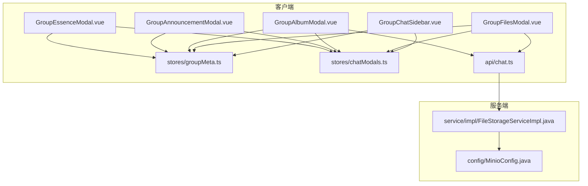
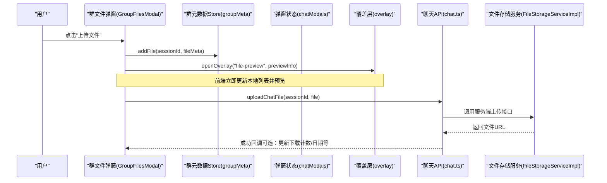
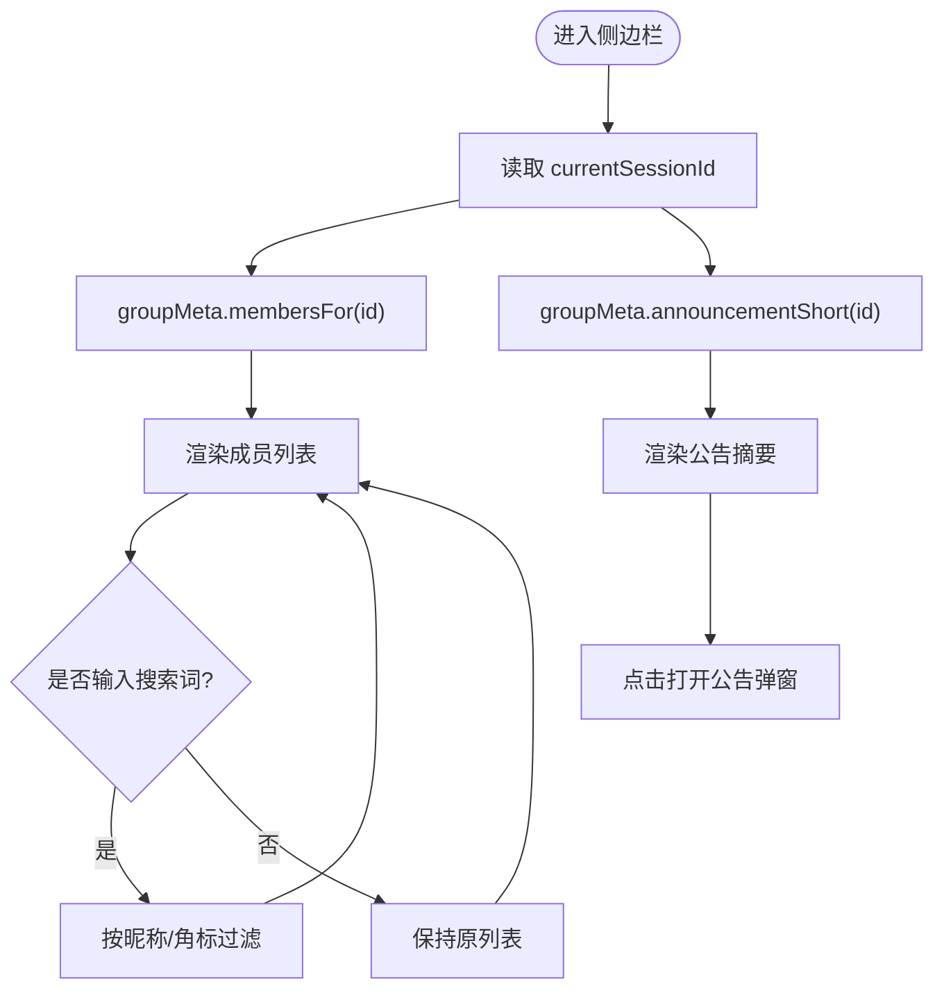
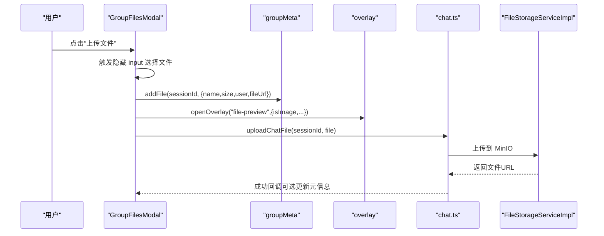
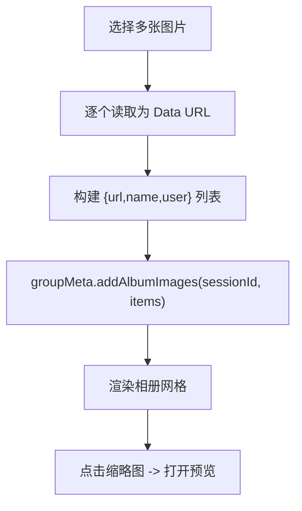
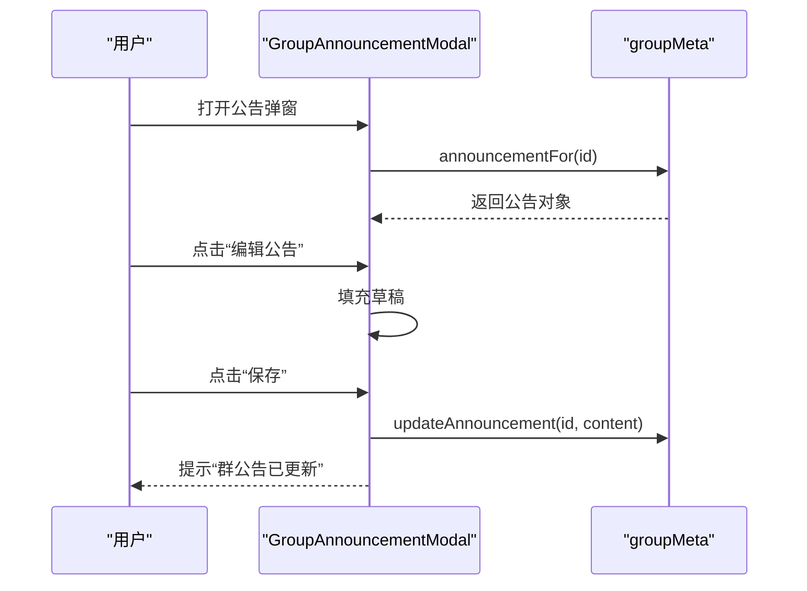
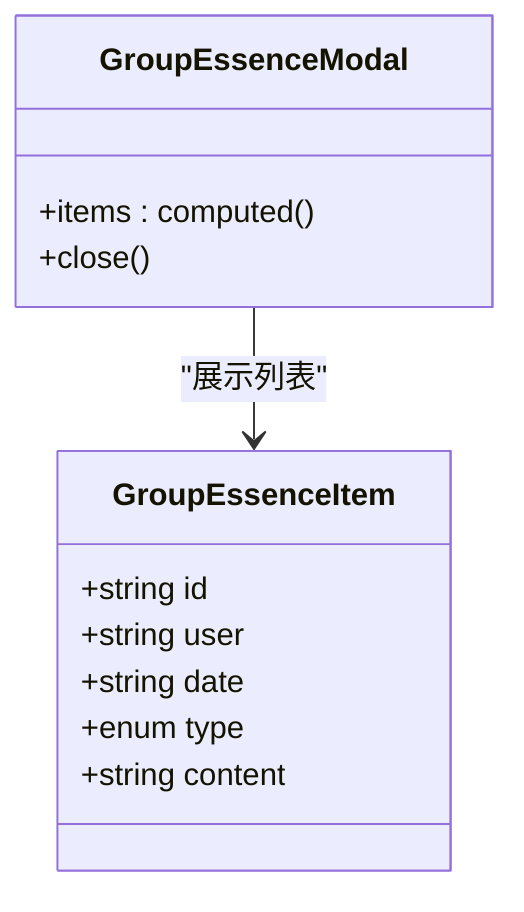
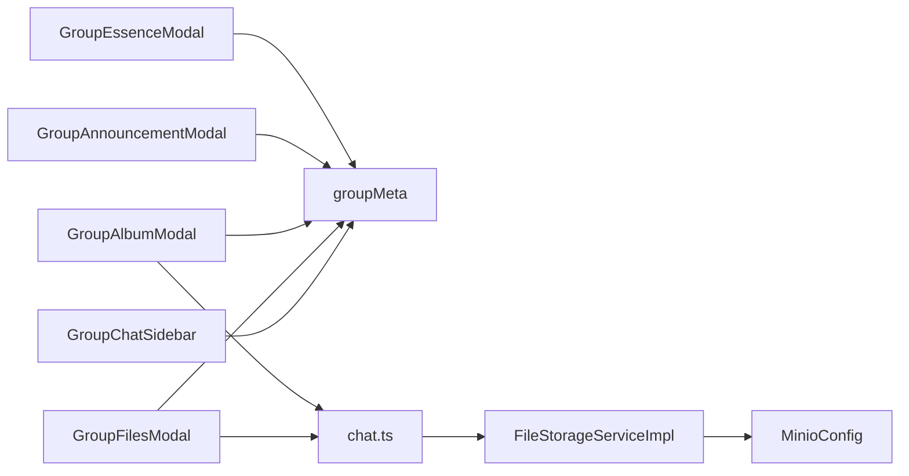
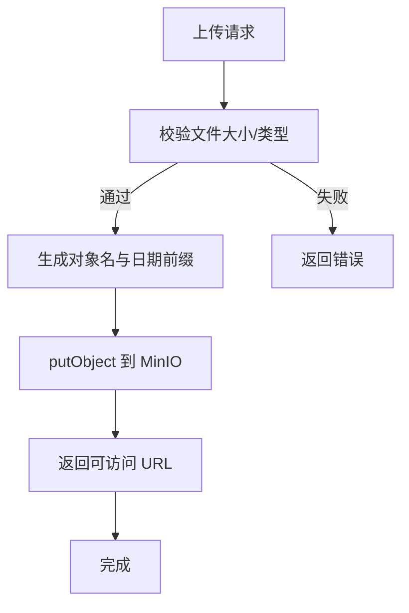

# 群聊特色功能

<cite>
**本文引用的文件**
- [GroupChatSidebar.vue](file://linkx-client/src/components/chat/GroupChatSidebar.vue)
- [GroupFilesModal.vue](file://linkx-client/src/components/chat/GroupFilesModal.vue)
- [GroupAlbumModal.vue](file://linkx-client/src/components/chat/GroupAlbumModal.vue)
- [GroupAnnouncementModal.vue](file://linkx-client/src/components/chat/GroupAnnouncementModal.vue)
- [GroupEssenceModal.vue](file://linkx-client/src/components/chat/GroupEssenceModal.vue)
- [groupMeta.ts](file://linkx-client/src/stores/groupMeta.ts)
- [chatModals.ts](file://linkx-client/src/stores/chatModals.ts)
- [groupDemo.ts](file://linkx-client/src/data/groupDemo.ts)
- [chat.ts](file://linkx-client/src/api/chat.ts)
- [MinioConfig.java](file://linkx-server/src/main/java/com/linkx/server/config/MinioConfig.java)
- [FileStorageServiceImpl.java](file://linkx-server/src/main/java/com/linkx/server/service/impl/FileStorageServiceImpl.java)
</cite>

## 目录
1. [简介](#简介)
2. [项目结构](#项目结构)
3. [核心组件](#核心组件)
4. [架构总览](#架构总览)
5. [详细组件分析](#详细组件分析)
6. [依赖关系分析](#依赖关系分析)
7. [性能与体验优化](#性能与体验优化)
8. [权限控制、消息过滤与内容审核](#权限控制消息过滤与内容审核)
9. [存储策略、访问控制与版本管理](#存储策略访问控制与版本管理)
10. [故障排查指南](#故障排查指南)
11. [结论](#结论)
12. [附录：扩展与定制开发指南](#附录扩展与定制开发指南)

## 简介
本文件面向 LinkX 的“群聊特色功能”，围绕以下能力进行系统化说明：
- 群组侧边栏：成员管理与公告摘要展示
- 群文件：上传、搜索、预览与管理
- 群相册：图片分享、浏览与筛选
- 群公告：发布、编辑与查看
- 精华消息：收藏与集中展示
- 权限控制、消息过滤与内容审核机制（前端实现现状与后端可扩展点）
- 资源存储策略、访问控制与版本管理（基于 MinIO 的后端能力）
- 定制与扩展开发指导（前端组件、Store、API 与服务端集成）

## 项目结构
群聊相关的前端 UI 位于 linkx-client/src/components/chat，数据状态集中在 Pinia Store groupMeta.ts，弹窗开关由 chatModals.ts 统一管理。服务端提供对象存储配置与文件上传服务，用于后续群文件/相册等资源的持久化。

图表来源
- [GroupChatSidebar.vue:1-249](file://linkx-client/src/components/chat/GroupChatSidebar.vue#L1-L249)
- [GroupFilesModal.vue:1-285](file://linkx-client/src/components/chat/GroupFilesModal.vue#L1-L285)
- [GroupAlbumModal.vue:1-329](file://linkx-client/src/components/chat/GroupAlbumModal.vue#L1-L329)
- [GroupAnnouncementModal.vue:1-229](file://linkx-client/src/components/chat/GroupAnnouncementModal.vue#L1-L229)
- [GroupEssenceModal.vue:1-151](file://linkx-client/src/components/chat/GroupEssenceModal.vue#L1-L151)
- [groupMeta.ts:1-289](file://linkx-client/src/stores/groupMeta.ts#L1-L289)
- [chatModals.ts:1-250](file://linkx-client/src/stores/chatModals.ts#L1-L250)
- [chat.ts:1-28](file://linkx-client/src/api/chat.ts#L1-L28)
- [MinioConfig.java:1-49](file://linkx-server/src/main/java/com/linkx/server/config/MinioConfig.java#L1-L49)
- [FileStorageServiceImpl.java:1-116](file://linkx-server/src/main/java/com/linkx/server/service/impl/FileStorageServiceImpl.java#L1-L116)

章节来源
- [GroupChatSidebar.vue:1-249](file://linkx-client/src/components/chat/GroupChatSidebar.vue#L1-L249)
- [GroupFilesModal.vue:1-285](file://linkx-client/src/components/chat/GroupFilesModal.vue#L1-L285)
- [GroupAlbumModal.vue:1-329](file://linkx-client/src/components/chat/GroupAlbumModal.vue#L1-L329)
- [GroupAnnouncementModal.vue:1-229](file://linkx-client/src/components/chat/GroupAnnouncementModal.vue#L1-L229)
- [GroupEssenceModal.vue:1-151](file://linkx-client/src/components/chat/GroupEssenceModal.vue#L1-L151)
- [groupMeta.ts:1-289](file://linkx-client/src/stores/groupMeta.ts#L1-L289)
- [chatModals.ts:1-250](file://linkx-client/src/stores/chatModals.ts#L1-L250)
- [chat.ts:1-28](file://linkx-client/src/api/chat.ts#L1-L28)
- [MinioConfig.java:1-49](file://linkx-server/src/main/java/com/linkx/server/config/MinioConfig.java#L1-L49)
- [FileStorageServiceImpl.java:1-116](file://linkx-server/src/main/java/com/linkx/server/service/impl/FileStorageServiceImpl.java#L1-L116)

## 核心组件
- GroupChatSidebar：展示群公告摘要与成员列表，支持成员搜索；点击可打开群公告弹窗。
- GroupFilesModal：群文件弹窗，支持搜索、分组展示、本地选择上传并加入群文件列表、打开覆盖层预览。
- GroupAlbumModal：群相册弹窗，支持标签切换（群动态/相册/与我相关）、批量上传图片、网格浏览与预览。
- GroupAnnouncementModal：群公告弹窗，支持查看与编辑保存，显示作者、角色与时间。
- GroupEssenceModal：精华消息弹窗，集中展示精华条目。

章节来源
- [GroupChatSidebar.vue:1-249](file://linkx-client/src/components/chat/GroupChatSidebar.vue#L1-L249)
- [GroupFilesModal.vue:1-285](file://linkx-client/src/components/chat/GroupFilesModal.vue#L1-L285)
- [GroupAlbumModal.vue:1-329](file://linkx-client/src/components/chat/GroupAlbumModal.vue#L1-L329)
- [GroupAnnouncementModal.vue:1-229](file://linkx-client/src/components/chat/GroupAnnouncementModal.vue#L1-L229)
- [GroupEssenceModal.vue:1-151](file://linkx-client/src/components/chat/GroupEssenceModal.vue#L1-L151)

## 架构总览
前端以 Vue 组件 + Pinia Store 组织群聊特色功能，UI 通过 Store 读写群元数据（公告、成员、文件、相册、精华），并通过全局覆盖层进行文件预览。服务端提供 MinIO 对象存储能力，用于文件上传与访问。

图表来源
- [GroupFilesModal.vue:1-285](file://linkx-client/src/components/chat/GroupFilesModal.vue#L1-L285)
- [groupMeta.ts:1-289](file://linkx-client/src/stores/groupMeta.ts#L1-L289)
- [chatModals.ts:1-250](file://linkx-client/src/stores/chatModals.ts#L1-L250)
- [chat.ts:1-28](file://linkx-client/src/api/chat.ts#L1-L28)
- [FileStorageServiceImpl.java:1-116](file://linkx-server/src/main/java/com/linkx/server/service/impl/FileStorageServiceImpl.java#L1-L116)

## 详细组件分析

### 群组侧边栏（GroupChatSidebar）
- 功能要点
  - 展示当前会话的公告短文本摘要，点击跳转至公告弹窗。
  - 展示成员列表，支持按昵称或角标搜索。
  - 通过 Pinia 读取当前会话 ID，从 groupMeta 获取成员与公告。
- 交互流程
  - 点击“查看群公告”按钮 -> 打开公告弹窗。
  - 输入关键词 -> 实时过滤成员列表。
- 关键依赖
  - chatModalsStore.openGroupAnnouncement
  - appStore.currentSessionId
  - groupMetaStore.membersFor / announcementShort

图表来源
- [GroupChatSidebar.vue:1-249](file://linkx-client/src/components/chat/GroupChatSidebar.vue#L1-L249)
- [groupMeta.ts:1-289](file://linkx-client/src/stores/groupMeta.ts#L1-L289)
- [chatModals.ts:1-250](file://linkx-client/src/stores/chatModals.ts#L1-L250)

章节来源
- [GroupChatSidebar.vue:1-249](file://linkx-client/src/components/chat/GroupChatSidebar.vue#L1-L249)
- [groupMeta.ts:1-289](file://linkx-client/src/stores/groupMeta.ts#L1-L289)
- [chatModals.ts:1-250](file://linkx-client/src/stores/chatModals.ts#L1-L250)

### 群文件（GroupFilesModal）
- 功能要点
  - 搜索文件名与上传者。
  - 将文件按月份分组展示（演示中固定为某月）。
  - 触发本地文件选择，生成 Data URL 并写入群文件列表，同时打开覆盖层预览。
  - 底部统计与上传按钮。
- 数据流
  - 本地选择文件 -> formatFileSize 格式化大小 -> groupMeta.addFile 插入记录 -> message 提示 -> overlay 打开预览。
- 与后端集成
  - 已暴露 uploadChatFile 接口，可在上传成功后更新服务端返回的 URL、下载计数等。

图表来源
- [GroupFilesModal.vue:1-285](file://linkx-client/src/components/chat/GroupFilesModal.vue#L1-L285)
- [groupMeta.ts:1-289](file://linkx-client/src/stores/groupMeta.ts#L1-L289)
- [chat.ts:1-28](file://linkx-client/src/api/chat.ts#L1-L28)
- [FileStorageServiceImpl.java:1-116](file://linkx-server/src/main/java/com/linkx/server/service/impl/FileStorageServiceImpl.java#L1-L116)

章节来源
- [GroupFilesModal.vue:1-285](file://linkx-client/src/components/chat/GroupFilesModal.vue#L1-L285)
- [groupMeta.ts:1-289](file://linkx-client/src/stores/groupMeta.ts#L1-L289)
- [chat.ts:1-28](file://linkx-client/src/api/chat.ts#L1-L28)
- [FileStorageServiceImpl.java:1-116](file://linkx-server/src/main/java/com/linkx/server/service/impl/FileStorageServiceImpl.java#L1-L116)

### 群相册（GroupAlbumModal）
- 功能要点
  - 三个标签页：群动态、相册、与我相关（仅显示当前用户上传的图片）。
  - 批量选择图片，逐个读取为 Data URL，写入 groupMeta.albums。
  - 网格展示缩略图，点击打开覆盖层预览。
- 数据流
  - onAlbumPicked -> readFileAsDataUrl -> groupMeta.addAlbumImages -> 刷新网格视图。

图表来源
- [GroupAlbumModal.vue:1-329](file://linkx-client/src/components/chat/GroupAlbumModal.vue#L1-L329)
- [groupMeta.ts:1-289](file://linkx-client/src/stores/groupMeta.ts#L1-L289)

章节来源
- [GroupAlbumModal.vue:1-329](file://linkx-client/src/components/chat/GroupAlbumModal.vue#L1-L329)
- [groupMeta.ts:1-289](file://linkx-client/src/stores/groupMeta.ts#L1-L289)

### 群公告（GroupAnnouncementModal）
- 功能要点
  - 查看模式：展示作者、角色、时间与正文。
  - 编辑模式：使用 NInput 编辑草稿，保存后更新 groupMeta 并提示成功。
- 数据来源
  - groupMeta.announcementFor(sessionId)，首次访问懒加载默认文案。

图表来源
- [GroupAnnouncementModal.vue:1-229](file://linkx-client/src/components/chat/GroupAnnouncementModal.vue#L1-L229)
- [groupMeta.ts:1-289](file://linkx-client/src/stores/groupMeta.ts#L1-L289)

章节来源
- [GroupAnnouncementModal.vue:1-229](file://linkx-client/src/components/chat/GroupAnnouncementModal.vue#L1-L229)
- [groupMeta.ts:1-289](file://linkx-client/src/stores/groupMeta.ts#L1-L289)

### 精华消息（GroupEssenceModal）
- 功能要点
  - 展示精华列表（链接/视频/文本类型），空状态提示。
- 数据来源
  - groupMeta.essenceFor(sessionId)，首次访问懒加载默认条目。

图表来源
- [GroupEssenceModal.vue:1-151](file://linkx-client/src/components/chat/GroupEssenceModal.vue#L1-L151)
- [groupMeta.ts:1-289](file://linkx-client/src/stores/groupMeta.ts#L1-L289)

章节来源
- [GroupEssenceModal.vue:1-151](file://linkx-client/src/components/chat/GroupEssenceModal.vue#L1-L151)
- [groupMeta.ts:1-289](file://linkx-client/src/stores/groupMeta.ts#L1-L289)

## 依赖关系分析
- 组件对 Store 的依赖
  - 所有群聊特色组件均依赖 groupMeta.ts 提供的读写方法，保证数据一致性。
  - 弹窗开关统一由 chatModals.ts 管理，避免多处状态分散。
- 组件对 API 的依赖
  - 群文件/相册上传路径已预留 chat.ts 的 uploadChatFile，便于接入后端 MinIO 服务。
- 服务端依赖
  - MinioConfig 负责初始化 MinIO 客户端并在启动时检查/创建 bucket。
  - FileStorageServiceImpl 实现上传、删除与预签名 URL 生成（当前简化为公开 URL）。

图表来源
- [GroupChatSidebar.vue:1-249](file://linkx-client/src/components/chat/GroupChatSidebar.vue#L1-L249)
- [GroupFilesModal.vue:1-285](file://linkx-client/src/components/chat/GroupFilesModal.vue#L1-L285)
- [GroupAlbumModal.vue:1-329](file://linkx-client/src/components/chat/GroupAlbumModal.vue#L1-L329)
- [GroupAnnouncementModal.vue:1-229](file://linkx-client/src/components/chat/GroupAnnouncementModal.vue#L1-L229)
- [GroupEssenceModal.vue:1-151](file://linkx-client/src/components/chat/GroupEssenceModal.vue#L1-L151)
- [groupMeta.ts:1-289](file://linkx-client/src/stores/groupMeta.ts#L1-L289)
- [chat.ts:1-28](file://linkx-client/src/api/chat.ts#L1-L28)
- [FileStorageServiceImpl.java:1-116](file://linkx-server/src/main/java/com/linkx/server/service/impl/FileStorageServiceImpl.java#L1-L116)
- [MinioConfig.java:1-49](file://linkx-server/src/main/java/com/linkx/server/config/MinioConfig.java#L1-L49)

章节来源
- [groupMeta.ts:1-289](file://linkx-client/src/stores/groupMeta.ts#L1-L289)
- [chatModals.ts:1-250](file://linkx-client/src/stores/chatModals.ts#L1-L250)
- [chat.ts:1-28](file://linkx-client/src/api/chat.ts#L1-L28)
- [MinioConfig.java:1-49](file://linkx-server/src/main/java/com/linkx/server/config/MinioConfig.java#L1-L49)
- [FileStorageServiceImpl.java:1-116](file://linkx-server/src/main/java/com/linkx/server/service/impl/FileStorageServiceImpl.java#L1-L116)

## 性能与体验优化
- 列表渲染
  - 成员与文件列表采用计算属性过滤，建议在大数据量场景引入虚拟滚动或分页加载。
- 图片处理
  - 相册上传使用 Data URL，适合小图；大图建议压缩后再上传，减少内存占用。
- 预览体验
  - 文件预览通过覆盖层统一处理，注意在关闭弹窗时释放 URL 引用，避免内存泄漏。
- 响应式状态
  - 弹窗开关集中管理，避免重复打开与状态不一致问题。

[本节为通用优化建议，不直接分析具体文件]

## 权限控制、消息过滤与内容审核
- 权限控制（前端现状）
  - 成员列表支持按昵称/角标过滤，但未实现基于角色的操作限制（如仅管理员可编辑公告）。
  - 建议：在 groupMeta 的成员项中增加 role 字段，并在组件内根据角色控制“编辑/添加成员/上传”等按钮可见性。
- 消息过滤（前端现状）
  - 群文件支持按名称与上传者过滤；群相册支持“与我相关”过滤。
  - 建议：在后端拉取数据时增加过滤参数（如时间范围、类型、上传者），减少前端计算压力。
- 内容审核（待扩展）
  - 当前未实现敏感词检测或人工审核流程。
  - 建议：在上传前后增加内容审核钩子（文本/图片），失败则阻断上传并提示。

章节来源
- [GroupChatSidebar.vue:1-249](file://linkx-client/src/components/chat/GroupChatSidebar.vue#L1-L249)
- [GroupFilesModal.vue:1-285](file://linkx-client/src/components/chat/GroupFilesModal.vue#L1-L285)
- [GroupAlbumModal.vue:1-329](file://linkx-client/src/components/chat/GroupAlbumModal.vue#L1-L329)
- [GroupAnnouncementModal.vue:1-229](file://linkx-client/src/components/chat/GroupAnnouncementModal.vue#L1-L229)
- [groupMeta.ts:1-289](file://linkx-client/src/stores/groupMeta.ts#L1-L289)

## 存储策略、访问控制与版本管理
- 存储策略（服务端）
  - MinIO 作为对象存储，启动时自动检查并创建 bucket。
  - 上传路径按日期前缀组织，便于归档与清理。
  - 文件大小受配置限制，超出则抛出异常。
- 访问控制
  - 当前 getPresignedUrl 返回公开 URL；如需私有访问，可改为生成带过期时间的预签名 URL。
- 版本管理
  - 当前未实现对象版本控制；如需保留历史版本，可在 MinIO 开启版本控制并在业务层维护版本号。

图表来源
- [MinioConfig.java:1-49](file://linkx-server/src/main/java/com/linkx/server/config/MinioConfig.java#L1-L49)
- [FileStorageServiceImpl.java:1-116](file://linkx-server/src/main/java/com/linkx/server/service/impl/FileStorageServiceImpl.java#L1-L116)

章节来源
- [MinioConfig.java:1-49](file://linkx-server/src/main/java/com/linkx/server/config/MinioConfig.java#L1-L49)
- [FileStorageServiceImpl.java:1-116](file://linkx-server/src/main/java/com/linkx/server/service/impl/FileStorageServiceImpl.java#L1-L116)

## 故障排查指南
- 上传失败
  - 检查 MinIO endpoint、accessKey、secretKey 与 bucketName 配置是否正确。
  - 确认文件大小未超过限制。
  - 查看服务端日志中的上传失败堆栈。
- 预览空白
  - 确认 fileUrl 是否为有效地址；若为 Data URL，确保未被释放。
- 公告未更新
  - 确认 groupMeta.updateAnnouncement 被调用且 sessionId 正确。
- 成员搜索无结果
  - 检查搜索词是否包含空格或大小写差异；确认 membersFor 返回的数据结构。

章节来源
- [FileStorageServiceImpl.java:1-116](file://linkx-server/src/main/java/com/linkx/server/service/impl/FileStorageServiceImpl.java#L1-L116)
- [groupMeta.ts:1-289](file://linkx-client/src/stores/groupMeta.ts#L1-L289)
- [GroupAnnouncementModal.vue:1-229](file://linkx-client/src/components/chat/GroupAnnouncementModal.vue#L1-L229)
- [GroupFilesModal.vue:1-285](file://linkx-client/src/components/chat/GroupFilesModal.vue#L1-L285)

## 结论
LinkX 的群聊特色功能在前端实现了完整的交互闭环：侧边栏成员与公告、群文件与相册的上传与预览、公告编辑与精华展示。后端提供了稳定的对象存储能力，可作为群资源持久化的基础。后续可在权限控制、内容审核与版本管理等方面进一步增强，以满足更严格的团队协作需求。

[本节为总结性内容，不直接分析具体文件]

## 附录：扩展与定制开发指南
- 新增群资源类型
  - 在 groupMeta.ts 中定义新数据结构与懒加载默认值，并提供增删改查 actions。
  - 在对应 Modal 中接入新的 Store 方法与预览逻辑。
- 接入后端真实上传
  - 在 GroupFilesModal/GroupAlbumModal 中调用 chat.ts 的 uploadChatFile，并在成功回调中更新本地元信息（如下载计数、日期、URL）。
- 权限控制扩展
  - 在 groupMeta 的成员项中增加 role 字段，组件根据角色控制操作按钮可见性与可用性。
- 内容审核扩展
  - 在上传前调用服务端审核接口，失败则中断上传并提示用户修改内容。
- 版本管理扩展
  - 在服务端启用 MinIO 版本控制，并在业务层维护版本号与回滚能力。

章节来源
- [groupMeta.ts:1-289](file://linkx-client/src/stores/groupMeta.ts#L1-L289)
- [GroupFilesModal.vue:1-285](file://linkx-client/src/components/chat/GroupFilesModal.vue#L1-L285)
- [GroupAlbumModal.vue:1-329](file://linkx-client/src/components/chat/GroupAlbumModal.vue#L1-L329)
- [chat.ts:1-28](file://linkx-client/src/api/chat.ts#L1-L28)
- [FileStorageServiceImpl.java:1-116](file://linkx-server/src/main/java/com/linkx/server/service/impl/FileStorageServiceImpl.java#L1-L116)