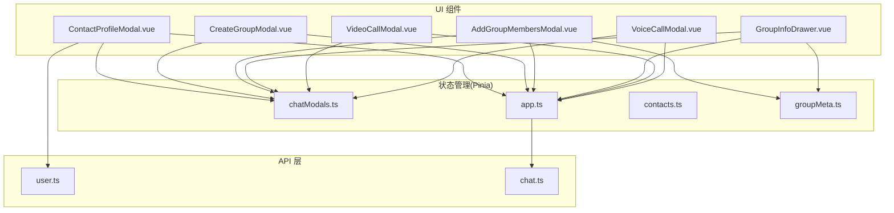
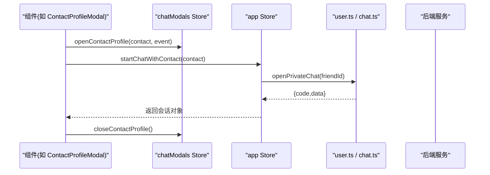
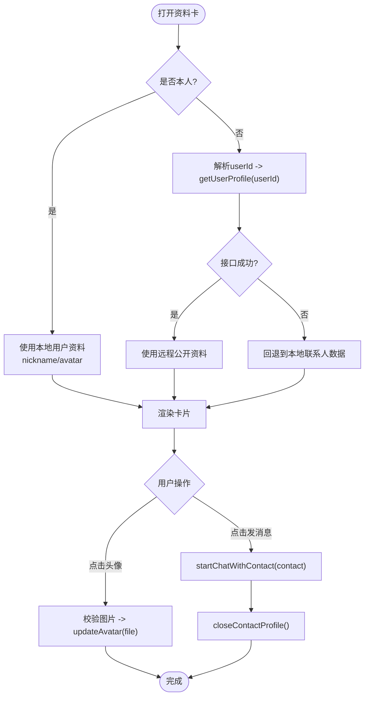
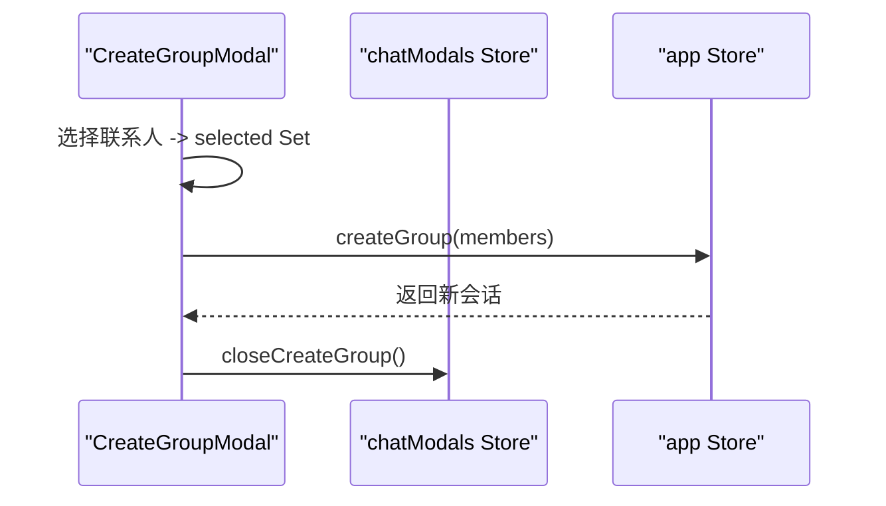
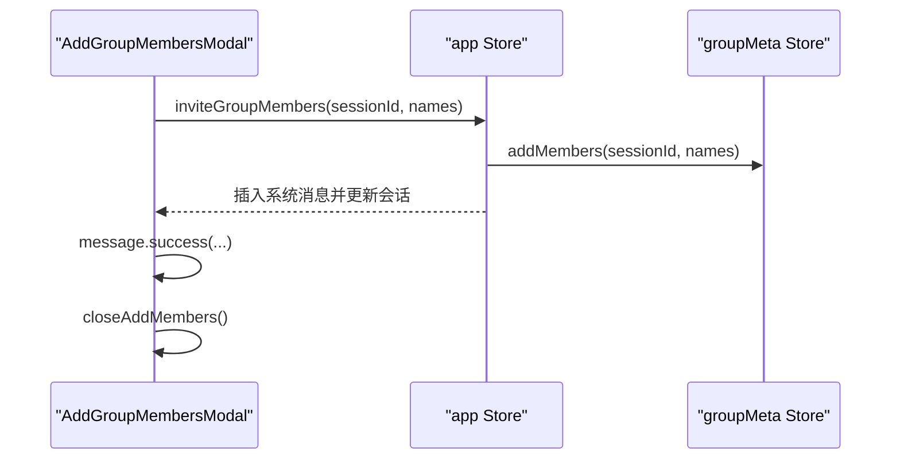
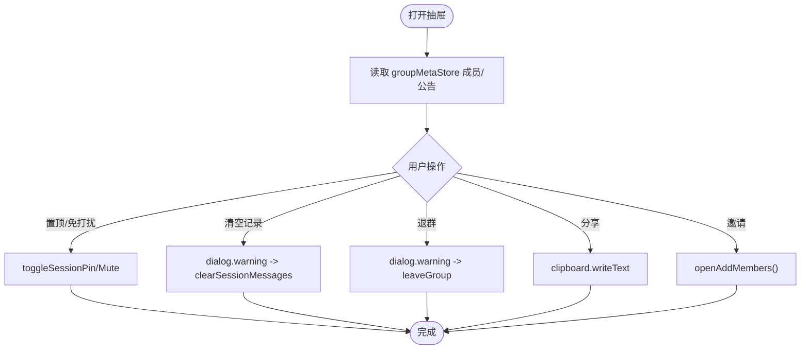
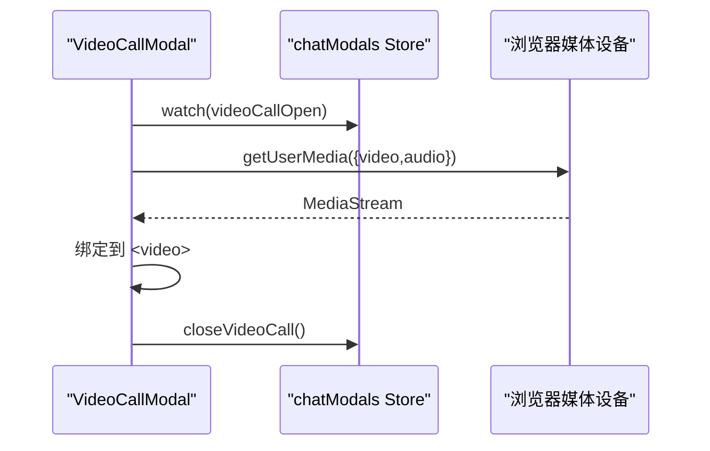
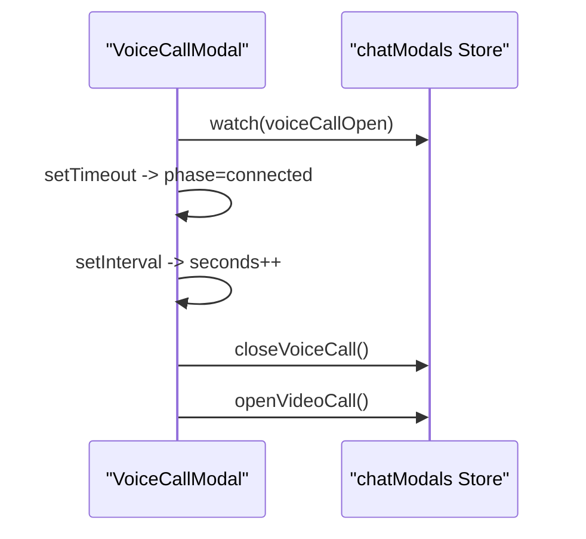
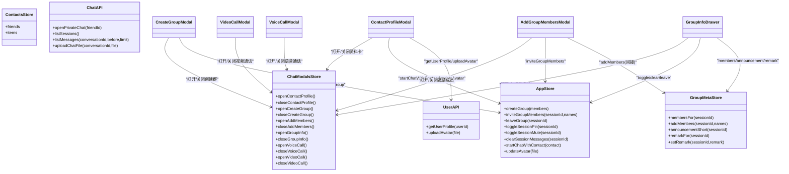

# 聊天模态框组件

<cite>
**本文引用的文件**
- [ContactProfileModal.vue](file://linkx-client/src/components/chat/ContactProfileModal.vue)
- [CreateGroupModal.vue](file://linkx-client/src/components/chat/CreateGroupModal.vue)
- [AddGroupMembersModal.vue](file://linkx-client/src/components/chat/AddGroupMembersModal.vue)
- [GroupInfoDrawer.vue](file://linkx-client/src/components/chat/GroupInfoDrawer.vue)
- [VideoCallModal.vue](file://linkx-client/src/components/chat/VideoCallModal.vue)
- [VoiceCallModal.vue](file://linkx-client/src/components/chat/VoiceCallModal.vue)
- [chatModals.ts](file://linkx-client/src/stores/chatModals.ts)
- [app.ts](file://linkx-client/src/stores/app.ts)
- [contacts.ts](file://linkx-client/src/stores/contacts.ts)
- [groupMeta.ts](file://linkx-client/src/stores/groupMeta.ts)
- [user.ts](file://linkx-client/src/api/user.ts)
- [chat.ts](file://linkx-client/src/api/chat.ts)
</cite>

## 目录
1. [简介](#简介)
2. [项目结构](#项目结构)
3. [核心组件](#核心组件)
4. [架构总览](#架构总览)
5. [详细组件分析](#详细组件分析)
6. [依赖关系分析](#依赖关系分析)
7. [性能与体验优化建议](#性能与体验优化建议)
8. [故障排查指南](#故障排查指南)
9. [结论](#结论)
10. [附录：集成开发指导](#附录集成开发指导)

## 简介
本文件围绕 LinkX 聊天模块中的关键模态框与抽屉组件，系统化解析以下能力：
- 联系人资料查看 ContactProfileModal：用户信息展示、头像上传、发起会话、编辑资料入口。
- 群组管理 CreateGroupModal 与 AddGroupMembersModal：创建群聊、邀请成员流程、附带聊天记录选项。
- 群组信息侧边栏 GroupInfoDrawer：群公告、成员网格、置顶/免打扰、清空记录、退群等。
- 视频通话 VideoCallModal 与语音通话 VoiceCallModal：媒体流获取、连接阶段模拟、计时与挂断。
- 模态框生命周期管理与状态同步机制（基于 Pinia Store）。
- 完整的群组功能与通话功能的集成开发指导。

## 项目结构
这些组件位于 linkx-client/src/components/chat 下，通过 chatModals Store 统一管理弹窗开关与位置；业务数据与操作由 app、contacts、groupMeta 三个 Store 协同完成；网络请求封装在 api 层。

图表来源
- [ContactProfileModal.vue:1-428](file://linkx-client/src/components/chat/ContactProfileModal.vue#L1-L428)
- [CreateGroupModal.vue:1-483](file://linkx-client/src/components/chat/CreateGroupModal.vue#L1-L483)
- [AddGroupMembersModal.vue:1-359](file://linkx-client/src/components/chat/AddGroupMembersModal.vue#L1-L359)
- [GroupInfoDrawer.vue:1-451](file://linkx-client/src/components/chat/GroupInfoDrawer.vue#L1-L451)
- [VideoCallModal.vue:1-270](file://linkx-client/src/components/chat/VideoCallModal.vue#L1-L270)
- [VoiceCallModal.vue:1-222](file://linkx-client/src/components/chat/VoiceCallModal.vue#L1-L222)
- [chatModals.ts:1-250](file://linkx-client/src/stores/chatModals.ts#L1-L250)
- [app.ts:1-800](file://linkx-client/src/stores/app.ts#L1-L800)
- [contacts.ts:1-128](file://linkx-client/src/stores/contacts.ts#L1-L128)
- [groupMeta.ts:1-289](file://linkx-client/src/stores/groupMeta.ts#L1-L289)
- [user.ts:1-60](file://linkx-client/src/api/user.ts#L1-L60)
- [chat.ts:1-28](file://linkx-client/src/api/chat.ts#L1-L28)

章节来源
- [chatModals.ts:1-250](file://linkx-client/src/stores/chatModals.ts#L1-L250)
- [app.ts:1-800](file://linkx-client/src/stores/app.ts#L1-L800)

## 核心组件
本节聚焦各组件的职责边界、关键交互与状态流转。

- ContactProfileModal
  - 职责：展示联系人资料卡（昵称、LinkX ID、头像、友链缩略图），支持本人头像上传、打开编辑资料、非本人时发起会话。
  - 状态：从 chatModalsStore 读取 contactProfileOpen、currentContactProfile、profileCardPos、profileCardIsSelf；从 appStore 读取 userProfile、savedLogin、sessions；从 momentsStore 读取 posts。
  - 远程数据：打开他人资料卡时调用 userApi.getUserProfile 拉取公开资料；失败回退到本地联系人数据。
  - 头像上传：点击头像触发 input[type=file]，校验类型与大小后调用 appStore.updateAvatar 更新并提示。
  - 会话跳转：点击“发消息”调用 appStore.startChatWithContact，成功后关闭卡片。

- CreateGroupModal
  - 职责：选择好友创建群聊，左侧为最近聊天与分组列表，右侧为已选成员预览。
  - 状态：使用 contactsStore 的 items 和 sessions 合并生成可选项；selected Set 维护选中项。
  - 确认创建：调用 appStore.createGroup(members)，成功后显示成功消息并关闭弹窗。

- AddGroupMembersModal
  - 职责：在当前群会话中邀请成员加入，支持搜索与“最近聊天”分组，可选“附带聊天记录”。
  - 状态：从 contactsStore.friends 映射为列表；selected Set 维护选中项。
  - 确认邀请：校验 currentSessionId 与 selected 数量，调用 appStore.inviteGroupMembers(sessionId, names)，成功后清空并关闭。

- GroupInfoDrawer
  - 职责：展示群头像、名称、群号、成员网格、公告、备注、置顶/免打扰、清空聊天记录、退出群聊、举报等。
  - 状态：从 groupMetaStore 读取公告摘要与成员列表；从 appStore 读写 pinned/muted 等会话属性。
  - 交互：失焦保存备注；二次确认后执行危险操作；分享复制群号。

- VideoCallModal
  - 职责：视频通话界面，包含麦克风/摄像头控制、屏幕共享/宫格占位、挂断。
  - 状态：phase 振铃/接通；videoOn/micOn；本地 MediaStream 绑定 video 元素；watch 监听弹窗开关与摄像头开关。
  - 资源清理：onUnmounted 与关闭时停止轨道、释放 srcObject。

- VoiceCallModal
  - 职责：语音通话界面，包含麦克风控制、切换视频、挂断、通话时长计时。
  - 状态：phase 振铃/接通；seconds 计时；watch 监听弹窗开关，定时器清理在 onUnmounted。

章节来源
- [ContactProfileModal.vue:1-428](file://linkx-client/src/components/chat/ContactProfileModal.vue#L1-L428)
- [CreateGroupModal.vue:1-483](file://linkx-client/src/components/chat/CreateGroupModal.vue#L1-L483)
- [AddGroupMembersModal.vue:1-359](file://linkx-client/src/components/chat/AddGroupMembersModal.vue#L1-L359)
- [GroupInfoDrawer.vue:1-451](file://linkx-client/src/components/chat/GroupInfoDrawer.vue#L1-L451)
- [VideoCallModal.vue:1-270](file://linkx-client/src/components/chat/VideoCallModal.vue#L1-L270)
- [VoiceCallModal.vue:1-222](file://linkx-client/src/components/chat/VoiceCallModal.vue#L1-L222)

## 架构总览
整体采用“组件 + Pinia Store + API 层”的分层架构。组件仅负责 UI 与交互，状态集中在 Store，网络请求统一在 API 层封装。

图表来源
- [ContactProfileModal.vue:132-140](file://linkx-client/src/components/chat/ContactProfileModal.vue#L132-L140)
- [app.ts:417-445](file://linkx-client/src/stores/app.ts#L417-L445)
- [chat.ts:9-11](file://linkx-client/src/api/chat.ts#L9-L11)
- [chatModals.ts:157-186](file://linkx-client/src/stores/chatModals.ts#L157-L186)

## 详细组件分析

### 联系人资料卡 ContactProfileModal
- 数据源与优先级
  - 本人资料：优先使用 appStore.userProfile 的 nickname/avatar，其次回退到当前联系人字段。
  - 他人资料：打开时根据 contact.id 解析 userId，调用 userApi.getUserProfile 拉取公开资料，失败则回退到本地联系人数据。
- 头像上传流程
  - 点击头像触发隐藏 input[type=file]，校验 image/* 与 10MB 限制，调用 appStore.updateAvatar(file) 更新头像并提示。
- 发起会话
  - 点击“发消息”调用 appStore.startChatWithContact，成功后关闭卡片。
- 定位策略
  - 依据 chatModalsStore.setProfileCardPosition 计算卡片坐标，避免溢出视口。

图表来源
- [ContactProfileModal.vue:49-70](file://linkx-client/src/components/chat/ContactProfileModal.vue#L49-L70)
- [ContactProfileModal.vue:148-174](file://linkx-client/src/components/chat/ContactProfileModal.vue#L148-L174)
- [ContactProfileModal.vue:132-140](file://linkx-client/src/components/chat/ContactProfileModal.vue#L132-L140)
- [chatModals.ts:199-217](file://linkx-client/src/stores/chatModals.ts#L199-L217)

章节来源
- [ContactProfileModal.vue:1-428](file://linkx-client/src/components/chat/ContactProfileModal.vue#L1-L428)
- [user.ts:57-59](file://linkx-client/src/api/user.ts#L57-L59)
- [chatModals.ts:157-217](file://linkx-client/src/stores/chatModals.ts#L157-L217)

### 创建群聊 CreateGroupModal
- 数据来源
  - 最近聊天：来自 appStore.sessions 过滤单聊且排除特殊会话，最多取前若干条，并与额外 mock 最近联系人合并去重。
  - 通讯录分组：来自 contactsStore.items，按组名折叠展开，支持搜索过滤。
- 选择与确认
  - selected Set 维护选中成员；canConfirm 判断至少一人；confirm 调用 appStore.createGroup(members) 创建会话并插入系统欢迎消息。
- 交互反馈
  - 成功提示并关闭弹窗；取消直接关闭。

图表来源
- [CreateGroupModal.vue:121-135](file://linkx-client/src/components/chat/CreateGroupModal.vue#L121-L135)
- [app.ts:264-296](file://linkx-client/src/stores/app.ts#L264-L296)
- [chatModals.ts:74-79](file://linkx-client/src/stores/chatModals.ts#L74-L79)

章节来源
- [CreateGroupModal.vue:1-483](file://linkx-client/src/components/chat/CreateGroupModal.vue#L1-L483)
- [app.ts:264-296](file://linkx-client/src/stores/app.ts#L264-L296)

### 添加群成员 AddGroupMembersModal
- 数据来源
  - 联系人列表：contactsStore.friends 映射为弹窗所需格式，支持搜索过滤。
- 邀请流程
  - 校验 currentSessionId 与 selected 数量；调用 appStore.inviteGroupMembers(sessionId, names)。
  - appStore 内部更新 groupMetaStore.members 并在当前会话插入系统消息，同时更新会话 lastMessage/time。
- 附加选项
  - “附带聊天记录”为 UI 选项，当前实现未持久化该参数到后端，仅作为原型提示。

图表来源
- [AddGroupMembersModal.vue:83-97](file://linkx-client/src/components/chat/AddGroupMembersModal.vue#L83-L97)
- [app.ts:586-607](file://linkx-client/src/stores/app.ts#L586-L607)
- [groupMeta.ts:207-218](file://linkx-client/src/stores/groupMeta.ts#L207-L218)

章节来源
- [AddGroupMembersModal.vue:1-359](file://linkx-client/src/components/chat/AddGroupMembersModal.vue#L1-L359)
- [app.ts:586-607](file://linkx-client/src/stores/app.ts#L586-L607)
- [groupMeta.ts:207-218](file://linkx-client/src/stores/groupMeta.ts#L207-L218)

### 群组信息侧边栏 GroupInfoDrawer
- 展示内容
  - 群头像/名称/群号（从 sessionId 提取数字后缀）；成员网格（groupMetaStore.membersFor）；公告短文本（announcementShort）。
- 交互
  - 置顶/免打扰：调用 appStore.toggleSessionPin/toggleSessionMute。
  - 清空聊天记录：二次确认后调用 appStore.clearSessionMessages。
  - 退出群聊：二次确认后调用 appStore.leaveGroup（等价于删除会话）。
  - 分享群号：navigator.clipboard.writeText。
  - 打开邀请成员：调用 chatModalsStore.openAddMembers。

图表来源
- [GroupInfoDrawer.vue:70-121](file://linkx-client/src/components/chat/GroupInfoDrawer.vue#L70-L121)
- [app.ts:543-573](file://linkx-client/src/stores/app.ts#L543-L573)
- [groupMeta.ts:136-140](file://linkx-client/src/stores/groupMeta.ts#L136-L140)

章节来源
- [GroupInfoDrawer.vue:1-451](file://linkx-client/src/components/chat/GroupInfoDrawer.vue#L1-L451)
- [app.ts:543-612](file://linkx-client/src/stores/app.ts#L543-L612)
- [groupMeta.ts:136-218](file://linkx-client/src/stores/groupMeta.ts#L136-L218)

### 视频通话 VideoCallModal
- 媒体流处理
  - 打开弹窗后进入 ringing 阶段，1.5s 后自动切换到 connected；若 videoOn 为真，调用 navigator.mediaDevices.getUserMedia 获取音视频流并绑定到 video 元素。
  - 切换 videoOn 时动态启停媒体流；关闭或卸载时停止所有轨道并释放 srcObject。
- 控制项
  - 麦克风开关（UI 状态）、摄像头开关、屏幕共享/宫格模式（占位不可用）、挂断关闭。

图表来源
- [VideoCallModal.vue:73-98](file://linkx-client/src/components/chat/VideoCallModal.vue#L73-L98)
- [VideoCallModal.vue:50-70](file://linkx-client/src/components/chat/VideoCallModal.vue#L50-L70)
- [chatModals.ts:98-103](file://linkx-client/src/stores/chatModals.ts#L98-L103)

章节来源
- [VideoCallModal.vue:1-270](file://linkx-client/src/components/chat/VideoCallModal.vue#L1-L270)

### 语音通话 VoiceCallModal
- 连接阶段与计时
  - 打开弹窗进入 ringing，1.8s 后切换到 connected，并开始每秒递增 seconds 计时器。
  - 挂断关闭弹窗；支持切换到视频通话（先关闭语音再打开视频）。
- 控制项
  - 麦克风开关、开启视频、屏幕共享（占位不可用）、挂断。

图表来源
- [VoiceCallModal.vue:55-70](file://linkx-client/src/components/chat/VoiceCallModal.vue#L55-L70)
- [chatModals.ts:92-103](file://linkx-client/src/stores/chatModals.ts#L92-L103)

章节来源
- [VoiceCallModal.vue:1-222](file://linkx-client/src/components/chat/VoiceCallModal.vue#L1-L222)

## 依赖关系分析
- 组件对 Store 的依赖
  - chatModals Store 集中管理所有弹窗/抽屉开关与资料卡位置，提供 open/close 方法。
  - app Store 提供会话管理、消息发送、群创建/邀请/退群、置顶/免打扰、头像上传等。
  - groupMeta Store 提供群公告、成员、备注、精华、文件、相册等元数据。
  - contacts Store 提供联系人列表与好友操作。
- 组件对 API 的依赖
  - user.ts：获取当前用户、更新资料、上传头像、获取他人公开资料。
  - chat.ts：会话列表、打开私聊、历史消息、文件上传。

图表来源
- [chatModals.ts:1-250](file://linkx-client/src/stores/chatModals.ts#L1-L250)
- [app.ts:264-612](file://linkx-client/src/stores/app.ts#L264-L612)
- [groupMeta.ts:104-289](file://linkx-client/src/stores/groupMeta.ts#L104-L289)
- [contacts.ts:1-128](file://linkx-client/src/stores/contacts.ts#L1-L128)
- [user.ts:1-60](file://linkx-client/src/api/user.ts#L1-L60)
- [chat.ts:1-28](file://linkx-client/src/api/chat.ts#L1-L28)

章节来源
- [chatModals.ts:1-250](file://linkx-client/src/stores/chatModals.ts#L1-L250)
- [app.ts:1-800](file://linkx-client/src/stores/app.ts#L1-L800)
- [groupMeta.ts:1-289](file://linkx-client/src/stores/groupMeta.ts#L1-L289)
- [contacts.ts:1-128](file://linkx-client/src/stores/contacts.ts#L1-L128)
- [user.ts:1-60](file://linkx-client/src/api/user.ts#L1-L60)
- [chat.ts:1-28](file://linkx-client/src/api/chat.ts#L1-L28)

## 性能与体验优化建议
- 媒体流与定时器
  - 确保在组件卸载与关闭时及时 stopTracks 与清除定时器，避免内存泄漏与后台运行。
- 头像上传
  - 前端进行类型与大小校验，减少无效请求；上传过程中禁用交互并给出加载反馈。
- 列表渲染
  - 联系人列表较长时考虑虚拟滚动或分页加载；搜索词变化时尽量使用计算属性缓存结果。
- 状态一致性
  - 群成员邀请后，确保 groupMetaStore 与 appStore 的消息/会话状态同步更新，避免 UI 不一致。
- 错误处理
  - 网络请求失败时保留降级数据（如联系人资料回退本地），并通过全局消息提示用户。

[本节为通用建议，不直接分析具体文件]

## 故障排查指南
- 无法获取摄像头/麦克风权限
  - 检查浏览器安全上下文（HTTPS 或 localhost），确认用户授权；查看控制台报错。
- 头像上传失败
  - 检查文件大小与类型限制；确认后端接口返回码与响应体；查看网络面板请求头 Content-Type。
- 邀请成员无效果
  - 确认 currentSessionId 存在；检查 groupMetaStore.addMembers 是否被调用；查看会话消息是否插入系统消息。
- 群资料抽屉异常
  - 检查 groupMetaStore 对应 sessionId 的数据是否存在；确认 pinned/muted 状态是否正确写入 appStore。
- 通话界面卡顿或黑屏
  - 检查 video 元素是否绑定 srcObject；确认 MediaStream 轨道是否仍在运行；清理旧引用。

章节来源
- [VideoCallModal.vue:63-70](file://linkx-client/src/components/chat/VideoCallModal.vue#L63-L70)
- [VoiceCallModal.vue:47-52](file://linkx-client/src/components/chat/VoiceCallModal.vue#L47-L52)
- [AddGroupMembersModal.vue:83-97](file://linkx-client/src/components/chat/AddGroupMembersModal.vue#L83-L97)
- [GroupInfoDrawer.vue:93-121](file://linkx-client/src/components/chat/GroupInfoDrawer.vue#L93-L121)

## 结论
本套聊天模态框组件以 Pinia Store 为核心，将 UI 与业务逻辑解耦，形成清晰的职责边界。联系人资料卡、群组管理、通话界面均具备完善的交互与状态同步机制。后续可在真实信令与媒体通道接入后，替换当前的模拟流程，进一步提升稳定性与扩展性。

[本节为总结，不直接分析具体文件]

## 附录：集成开发指导
- 群组功能集成要点
  - 创建群：CreateGroupModal 选择成员 -> appStore.createGroup -> 插入系统消息 -> 关闭弹窗。
  - 邀请成员：AddGroupMembersModal 选择成员 -> appStore.inviteGroupMembers -> groupMetaStore.addMembers -> 插入系统消息 -> 关闭弹窗。
  - 群信息：GroupInfoDrawer 读取 groupMetaStore 数据，操作 appStore 的 pinned/muted/clear/leave。
- 通话功能集成要点
  - 语音通话：VoiceCallModal 打开 -> ringing -> connected -> 计时 -> 挂断/切换视频。
  - 视频通话：VideoCallModal 打开 -> ringing -> connected -> 获取媒体流 -> 控制摄像头/麦克风 -> 挂断。
  - 未来接入 WebRTC/SFU：替换 getUserMedia 与阶段模拟，增加远端流渲染、信号交换与错误重试。
- 状态同步最佳实践
  - 所有弹窗开关统一由 chatModals Store 管理，避免多处状态不一致。
  - 涉及跨 Store 的状态变更（如邀请成员）应在同一 action 内原子更新，保证 UI 一致。
  - 对外部资源（媒体流、定时器）的生命周期严格管理，确保组件销毁时彻底清理。

章节来源
- [CreateGroupModal.vue:121-135](file://linkx-client/src/components/chat/CreateGroupModal.vue#L121-L135)
- [AddGroupMembersModal.vue:83-97](file://linkx-client/src/components/chat/AddGroupMembersModal.vue#L83-L97)
- [GroupInfoDrawer.vue:70-121](file://linkx-client/src/components/chat/GroupInfoDrawer.vue#L70-L121)
- [VideoCallModal.vue:73-98](file://linkx-client/src/components/chat/VideoCallModal.vue#L73-L98)
- [VoiceCallModal.vue:55-70](file://linkx-client/src/components/chat/VoiceCallModal.vue#L55-L70)
- [chatModals.ts:1-250](file://linkx-client/src/stores/chatModals.ts#L1-L250)
- [app.ts:264-612](file://linkx-client/src/stores/app.ts#L264-L612)
- [groupMeta.ts:207-218](file://linkx-client/src/stores/groupMeta.ts#L207-L218)