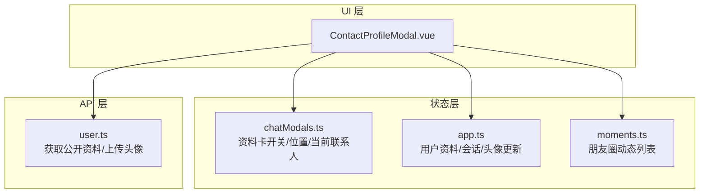
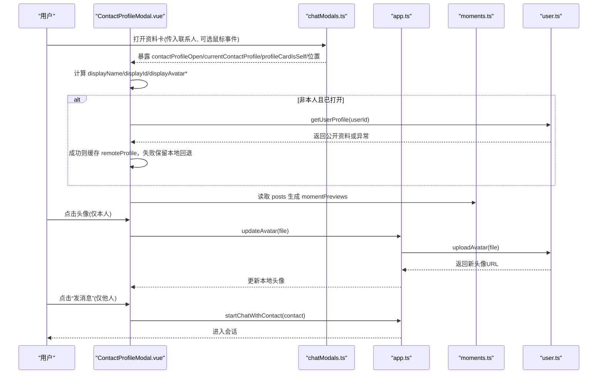
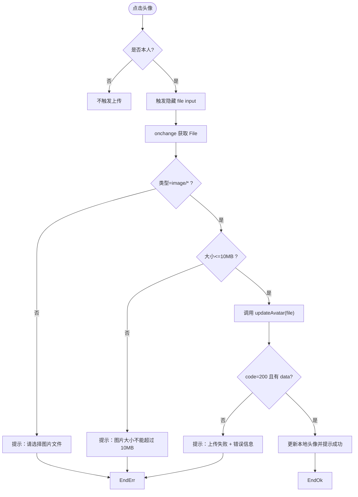
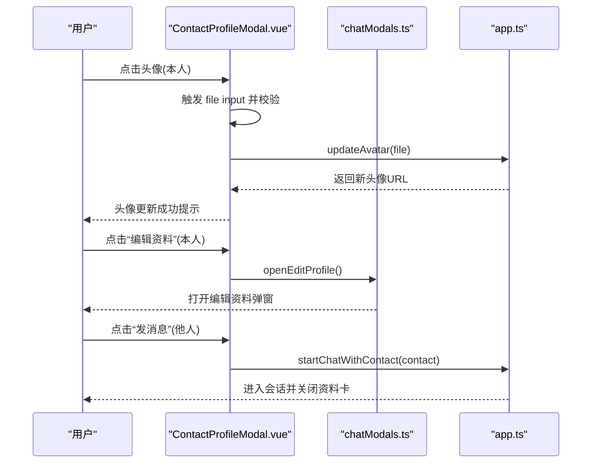
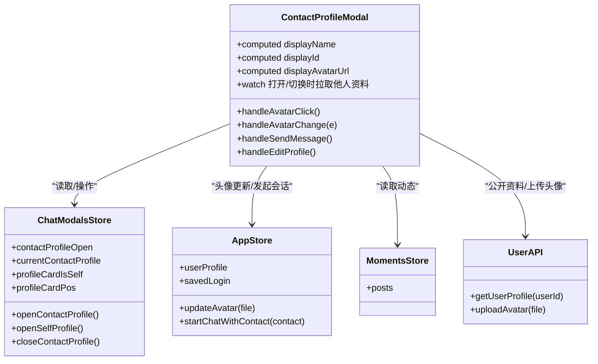

# 联系人资料卡模态框

<cite>
**本文引用的文件**   
- [ContactProfileModal.vue](file://linkx-client/src/components/chat/ContactProfileModal.vue)
- [chatModals.ts](file://linkx-client/src/stores/chatModals.ts)
- [app.ts](file://linkx-client/src/stores/app.ts)
- [moments.ts](file://linkx-client/src/stores/moments.ts)
- [user.ts](file://linkx-client/src/api/user.ts)
</cite>

## 目录
1. [简介](#简介)
2. [项目结构](#项目结构)
3. [核心组件与职责](#核心组件与职责)
4. [架构总览](#架构总览)
5. [详细组件分析](#详细组件分析)
6. [依赖关系分析](#依赖关系分析)
7. [性能与体验优化建议](#性能与体验优化建议)
8. [故障排查指南](#故障排查指南)
9. [结论](#结论)

## 简介
本文件围绕 ContactProfileModal 联系人资料卡模态框，系统化解析其用户信息展示、本人/他人资料卡差异处理、头像上传流程、朋友圈（动态）集成以及完整交互流程。文档面向前端开发者与产品/测试人员，既提供代码级细节，也给出可操作的排障与优化建议。

## 项目结构
该功能位于聊天模块的浮层组件中，通过 Pinia Store 管理状态，调用用户 API 获取公开资料，并读取朋友圈数据用于友链缩略图展示。

图表来源
- [ContactProfileModal.vue:1-179](file://linkx-client/src/components/chat/ContactProfileModal.vue#L1-L179)
- [chatModals.ts:12-250](file://linkx-client/src/stores/chatModals.ts#L12-L250)
- [app.ts:128-1156](file://linkx-client/src/stores/app.ts#L128-L1156)
- [moments.ts:73-166](file://linkx-client/src/stores/moments.ts#L73-L166)
- [user.ts:1-60](file://linkx-client/src/api/user.ts#L1-L60)

章节来源
- [ContactProfileModal.vue:1-179](file://linkx-client/src/components/chat/ContactProfileModal.vue#L1-L179)
- [chatModals.ts:12-250](file://linkx-client/src/stores/chatModals.ts#L12-L250)
- [app.ts:128-1156](file://linkx-client/src/stores/app.ts#L128-L1156)
- [moments.ts:73-166](file://linkx-client/src/stores/moments.ts#L73-L166)
- [user.ts:1-60](file://linkx-client/src/api/user.ts#L1-L60)

## 核心组件与职责
- ContactProfileModal.vue：负责资料卡 UI 渲染、点击事件处理、头像上传触发、发起会话、友链缩略图计算等。
- chatModals.ts：集中管理资料卡的打开/关闭、定位、当前联系人对象及“是否本人”标记。
- app.ts：维护登录用户资料、头像更新、从联系人发起会话等全局能力。
- moments.ts：提供朋友圈动态列表，供资料卡生成友链缩略图使用。
- user.ts：封装后端用户相关接口，包括获取公开资料、上传头像等。

章节来源
- [ContactProfileModal.vue:1-179](file://linkx-client/src/components/chat/ContactProfileModal.vue#L1-L179)
- [chatModals.ts:12-250](file://linkx-client/src/stores/chatModals.ts#L12-L250)
- [app.ts:128-1156](file://linkx-client/src/stores/app.ts#L128-L1156)
- [moments.ts:73-166](file://linkx-client/src/stores/moments.ts#L73-L166)
- [user.ts:1-60](file://linkx-client/src/api/user.ts#L1-L60)

## 架构总览
资料卡打开后，根据“是否本人”分支不同逻辑：
- 本人资料卡：直接读取本地 userProfile，支持点击头像更换；右侧显示“编辑资料”。
- 他人资料卡：根据联系人 id 解析 userId，拉取后端公开资料；若失败则回退到本地联系人 Mock 数据；底部显示“发消息”按钮。

图表来源
- [ContactProfileModal.vue:48-140](file://linkx-client/src/components/chat/ContactProfileModal.vue#L48-L140)
- [chatModals.ts:157-224](file://linkx-client/src/stores/chatModals.ts#L157-L224)
- [app.ts:911-919](file://linkx-client/src/stores/app.ts#L911-L919)
- [moments.ts:73-166](file://linkx-client/src/stores/moments.ts#L73-L166)
- [user.ts:42-59](file://linkx-client/src/api/user.ts#L42-L59)

## 详细组件分析

### 用户信息展示逻辑
- 昵称显示优先级
  - 本人：优先使用本地 userProfile.nickname，否则回退到联系人 name。
  - 他人：优先使用远程 public profile 的 nickname，否则回退到联系人 name。
- LinkX ID 显示
  - 本人：优先使用 savedLogin.username，其次 userProfile.username/nickname，最后占位符。
  - 他人：优先使用远程 username；若不可用，尝试将联系人 id 去前缀后判断是否为纯数字，是则直接使用，否则以 linkx_ 前缀拼接。
- 头像显示与占位
  - 本人：优先 userProfile.avatar，否则联系人 avatarUrl。
  - 他人：优先远程 avatar，否则联系人 avatarUrl。
  - 无图片时，使用首字符作为文本头像，颜色来自联系人预设或主题色。
- 加载反馈
  - 他人资料卡拉取期间在 ID 旁显示“加载中…”提示。

章节来源
- [ContactProfileModal.vue:72-114](file://linkx-client/src/components/chat/ContactProfileModal.vue#L72-L114)

### 本人资料卡 vs 他人资料卡差异
- 数据来源
  - 本人：完全基于本地 userProfile 与 savedLogin。
  - 他人：打开时按联系人 id 解析 userId，调用 getUserProfile 获取公开资料；失败则回退到本地联系人数据。
- 交互能力
  - 本人：头像可点击选择图片上传；右侧有“编辑资料”入口。
  - 他人：底部显示“发消息”，点击后通过 startChatWithContact 进入会话。
- 同步策略
  - 本人：监听 userProfile.avatar/nickname 变化，自动同步到当前联系人对象，确保卡片即时刷新。

章节来源
- [ContactProfileModal.vue:48-103](file://linkx-client/src/components/chat/ContactProfileModal.vue#L48-L103)
- [chatModals.ts:168-186](file://linkx-client/src/stores/chatModals.ts#L168-L186)

### 头像上传流程（文件验证、错误处理）
- 触发方式：本人资料卡点击头像区域，触发隐藏的 file input。
- 文件验证
  - 类型校验：仅接受 image/*。
  - 大小限制：最大 10MB。
- 上传执行
  - 调用 app.updateAvatar(file)，内部通过 userApi.uploadAvatar 提交 FormData。
  - 成功后更新本地 userProfile.avatar，并立即反映到卡片。
- 错误处理
  - 类型/大小不合法：提示相应错误。
  - 上传失败：捕获异常并提示“上传失败: 具体消息”。
- 进度处理
  - 当前实现未包含上传进度回调，仅在上传期间禁用头像点击以提升体验。

图表来源
- [ContactProfileModal.vue:142-174](file://linkx-client/src/components/chat/ContactProfileModal.vue#L142-L174)
- [app.ts:911-919](file://linkx-client/src/stores/app.ts#L911-L919)
- [user.ts:42-51](file://linkx-client/src/api/user.ts#L42-L51)

章节来源
- [ContactProfileModal.vue:142-174](file://linkx-client/src/components/chat/ContactProfileModal.vue#L142-L174)
- [app.ts:911-919](file://linkx-client/src/stores/app.ts#L911-L919)
- [user.ts:42-51](file://linkx-client/src/api/user.ts#L42-L51)

### 朋友圈系统集成（动态图片与占位图）
- 数据来源：读取 momentsStore.posts，筛选出发布者昵称等于当前联系人 name 的动态。
- 图片收集：遍历动态 images 字段，最多取前 4 张。
- 占位图策略：若不足 4 张，则以 picsum.photos 生成占位图，种子基于联系人 name 与序号，保证稳定且美观。
- 展示样式：固定尺寸缩略图，圆角与背景色适配主题。

章节来源
- [ContactProfileModal.vue:116-129](file://linkx-client/src/components/chat/ContactProfileModal.vue#L116-L129)
- [moments.ts:73-166](file://linkx-client/src/stores/moments.ts#L73-L166)

### 用户交互流程（点击头像编辑、发起会话）
- 点击头像（本人）：弹出系统文件选择器，完成上传后即时更新头像。
- 点击“编辑资料”（本人）：打开编辑资料弹窗（由 chatModals.openEditProfile 控制）。
- 点击“发消息”（他人）：调用 startChatWithContact，创建或切换到对应单聊会话，并关闭资料卡。

图表来源
- [ContactProfileModal.vue:131-178](file://linkx-client/src/components/chat/ContactProfileModal.vue#L131-L178)
- [chatModals.ts:187-194](file://linkx-client/src/stores/chatModals.ts#L187-L194)
- [app.ts:253-256](file://linkx-client/src/stores/app.ts#L253-L256)

章节来源
- [ContactProfileModal.vue:131-178](file://linkx-client/src/components/chat/ContactProfileModal.vue#L131-L178)
- [chatModals.ts:187-194](file://linkx-client/src/stores/chatModals.ts#L187-L194)
- [app.ts:253-256](file://linkx-client/src/stores/app.ts#L253-L256)

## 依赖关系分析
- 组件对 Store 的依赖
  - chatModals：控制资料卡可见性、当前位置、当前联系人对象与“是否本人”标记。
  - app：提供用户资料、头像更新、会话启动能力。
  - moments：提供朋友圈动态数据源。
- 组件对 API 的依赖
  - user.getUserProfile：获取他人公开资料。
  - user.uploadAvatar：上传头像。
- 关键耦合点
  - 联系人 id 解析为 userId 的逻辑集中在组件内，需保证与后端一致。
  - 头像更新成功后，组件会直接修改当前联系人对象的 avatarUrl/avatarColor，避免二次请求。

图表来源
- [ContactProfileModal.vue:1-179](file://linkx-client/src/components/chat/ContactProfileModal.vue#L1-L179)
- [chatModals.ts:12-250](file://linkx-client/src/stores/chatModals.ts#L12-L250)
- [app.ts:128-1156](file://linkx-client/src/stores/app.ts#L128-L1156)
- [moments.ts:73-166](file://linkx-client/src/stores/moments.ts#L73-L166)
- [user.ts:1-60](file://linkx-client/src/api/user.ts#L1-L60)

章节来源
- [ContactProfileModal.vue:1-179](file://linkx-client/src/components/chat/ContactProfileModal.vue#L1-L179)
- [chatModals.ts:12-250](file://linkx-client/src/stores/chatModals.ts#L12-L250)
- [app.ts:128-1156](file://linkx-client/src/stores/app.ts#L128-L1156)
- [moments.ts:73-166](file://linkx-client/src/stores/moments.ts#L73-L166)
- [user.ts:1-60](file://linkx-client/src/api/user.ts#L1-L60)

## 性能与体验优化建议
- 头像上传
  - 增加上传进度条与取消能力，提升大文件体验。
  - 客户端预压缩图片，减少带宽与存储压力。
- 他人资料卡
  - 增加本地缓存策略（如内存缓存或持久化），避免重复请求同一用户资料。
  - 失败重试与超时控制，增强网络不稳定场景下的鲁棒性。
- 友链缩略图
  - 懒加载与占位图骨架屏，降低首屏渲染开销。
  - 图片资源 CDN 与缓存头优化，提高加载速度。
- 交互反馈
  - 统一错误提示样式与可恢复操作（如重试）。
  - 对长昵称/ID 做截断与 Tooltip 展示，避免布局溢出。

[本节为通用建议，无需源码引用]

## 故障排查指南
- 他人资料卡无法显示昵称/头像
  - 检查 getUserProfile 返回码与数据结构，确认 code=200 且 data 存在。
  - 查看控制台是否有网络错误或鉴权失败。
- 头像上传失败
  - 确认文件类型为 image/* 且大小不超过 10MB。
  - 检查 uploadAvatar 响应码与 message，必要时打印请求体与响应体。
- 友链缩略图为空
  - 确认 momentsStore.posts 中存在与联系人 name 匹配的动态，且 images 数组非空。
- 点击“发消息”无效
  - 检查 startChatWithContact 是否正确接收 contact 参数，并确认会话创建/切换逻辑正常。

章节来源
- [ContactProfileModal.vue:48-140](file://linkx-client/src/components/chat/ContactProfileModal.vue#L48-L140)
- [app.ts:911-919](file://linkx-client/src/stores/app.ts#L911-L919)
- [moments.ts:73-166](file://linkx-client/src/stores/moments.ts#L73-L166)

## 结论
ContactProfileModal 实现了清晰的“本人/他人”双路径资料卡展示与交互：本人侧重资料编辑与头像更新，他人侧重公开资料展示与快速发起会话。通过朋友圈数据生成友链缩略图，增强了社交感。建议在后续迭代中补充上传进度、缓存与错误重试机制，进一步提升用户体验与稳定性。