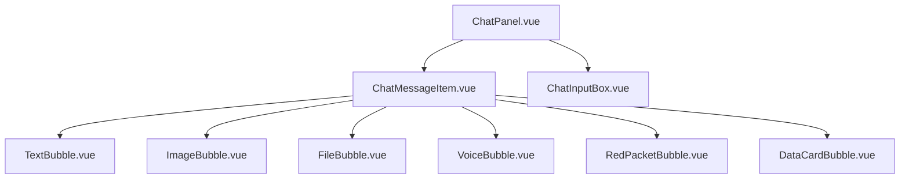
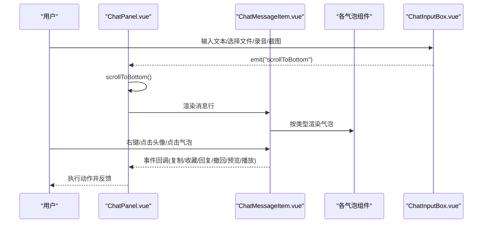
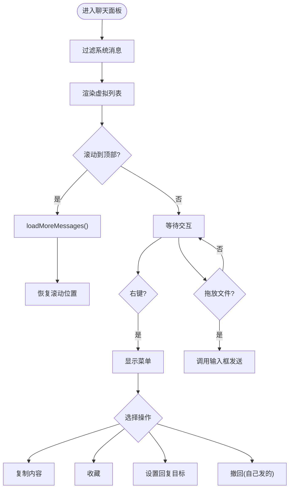
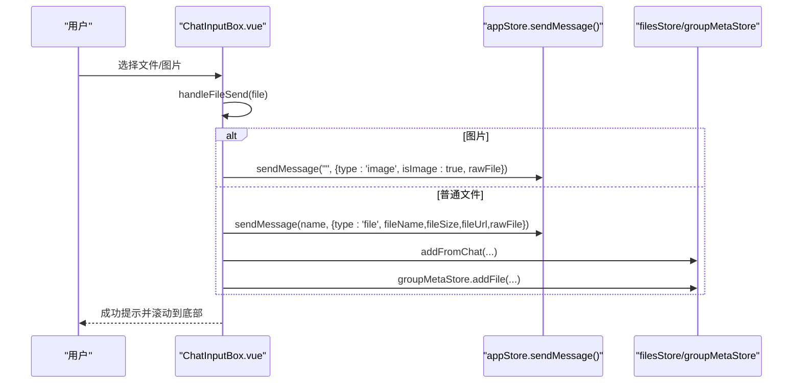
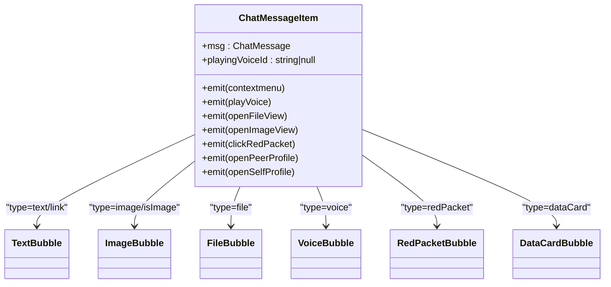
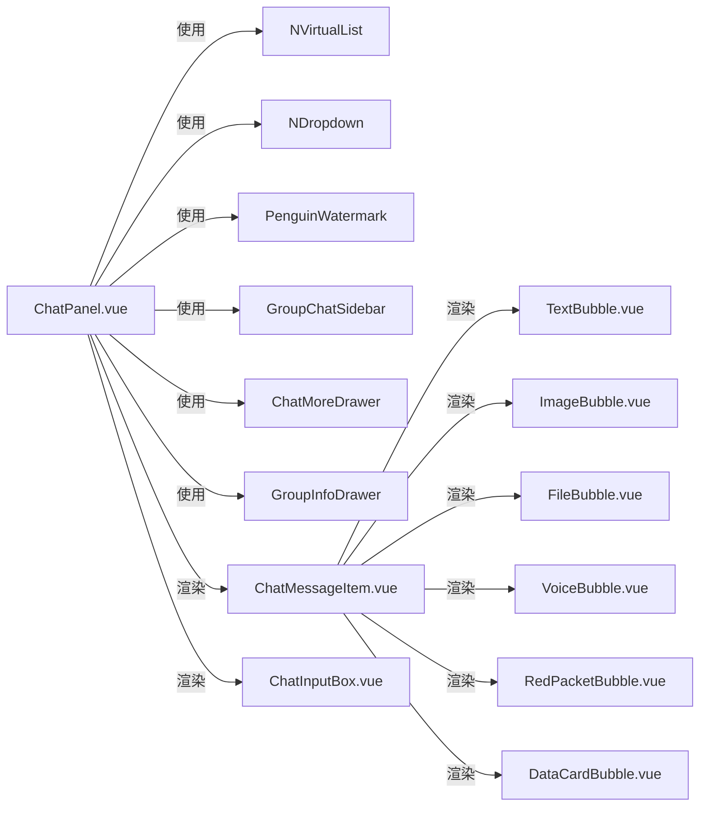
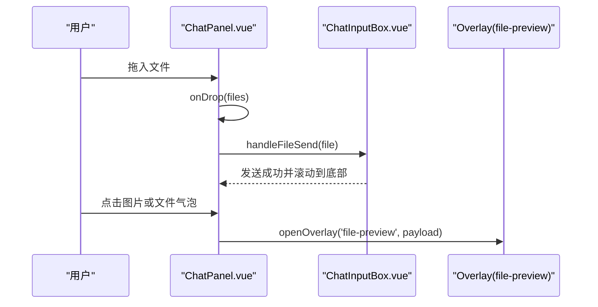

# 聊天界面组件

<cite>
**本文引用的文件**
- [ChatPanel.vue](file://linkx-client/src/components/ChatPanel.vue)
- [ChatInputBox.vue](file://linkx-client/src/components/chat/ChatInputBox.vue)
- [ChatMessageItem.vue](file://linkx-client/src/components/chat/ChatMessageItem.vue)
- [TextBubble.vue](file://linkx-client/src/components/chat/bubbles/TextBubble.vue)
- [ImageBubble.vue](file://linkx-client/src/components/chat/bubbles/ImageBubble.vue)
- [FileBubble.vue](file://linkx-client/src/components/chat/bubbles/FileBubble.vue)
- [VoiceBubble.vue](file://linkx-client/src/components/chat/bubbles/VoiceBubble.vue)
- [RedPacketBubble.vue](file://linkx-client/src/components/chat/bubbles/RedPacketBubble.vue)
- [DataCardBubble.vue](file://linkx-client/src/components/chat/bubbles/DataCardBubble.vue)
</cite>

## 目录
1. [简介](#简介)
2. [项目结构](#项目结构)
3. [核心组件](#核心组件)
4. [架构总览](#架构总览)
5. [详细组件分析](#详细组件分析)
6. [依赖关系分析](#依赖关系分析)
7. [性能与滚动优化](#性能与滚动优化)
8. [消息类型扩展机制](#消息类型扩展机制)
9. [富文本编辑器与输入增强](#富文本编辑器与输入增强)
10. [文件拖拽上传与图片预览](#文件拖拽上传与图片预览)
11. [故障排查指南](#故障排查指南)
12. [结论](#结论)

## 简介
本文件面向开发者，系统化梳理 LinkX 聊天界面的前端实现，覆盖以下关键能力：
- 聊天面板 ChatPanel 的消息展示、滚动加载、右键菜单、语音播放、图片/文件预览等
- 输入框 ChatInputBox 的多类型消息输入（文本、图片、文件、截图、语音、红包、快捷应用）
- 消息项 ChatMessageItem 的渲染分发机制
- 气泡组件 TextBubble、ImageBubble、FileBubble、VoiceBubble、RedPacketBubble、DataCardBubble 的显示效果与交互
- 消息类型的扩展方式与最佳实践
- 虚拟列表与滚动优化策略
- 文件拖拽上传与图片预览流程
- 针对富文本编辑器的集成建议与替代方案

## 项目结构
聊天相关的前端代码集中在 linkx-client/src/components 下，采用“功能域 + 子组件”的组织方式：
- 顶层容器：ChatPanel.vue 负责会话切换、消息区布局、事件编排与状态联动
- 输入区域：chat/ChatInputBox.vue 提供多模态输入与发送逻辑
- 消息行：chat/ChatMessageItem.vue 根据消息类型分发到对应气泡组件
- 气泡族：chat/bubbles/* 分别处理文本、图片、文件、语音、红包、数据卡片等展示

图表来源
- [ChatPanel.vue:536-567](file://linkx-client/src/components/ChatPanel.vue#L536-L567)
- [ChatMessageItem.vue:82-89](file://linkx-client/src/components/chat/ChatMessageItem.vue#L82-L89)
- [ChatInputBox.vue:405-527](file://linkx-client/src/components/chat/ChatInputBox.vue#L405-L527)

章节来源
- [ChatPanel.vue:1-120](file://linkx-client/src/components/ChatPanel.vue#L1-L120)
- [ChatMessageItem.vue:1-40](file://linkx-client/src/components/chat/ChatMessageItem.vue#L1-L40)
- [ChatInputBox.vue:1-44](file://linkx-client/src/components/chat/ChatInputBox.vue#L1-L44)

## 核心组件
- ChatPanel.vue
  - 管理当前会话、消息列表、背景样式、语音播放、图片/文件预览、右键菜单、历史消息加载、拖拽上传入口
  - 使用 Naive UI 的 NVirtualList 进行高性能渲染
- ChatInputBox.vue
  - 支持文本、表情、快捷应用、文件/图片选择、截图、语音录制、红包、通话入口
  - 统一 handleFileSend 处理图片与文件发送；粘贴自动识别图片/文件
- ChatMessageItem.vue
  - 按 msg.type 或 isImage 等字段分发到具体气泡组件
  - 透传头像点击、右键、播放语音、打开预览、红包领取等事件
- 气泡组件族
  - TextBubble：纯文本/链接样式，支持回复引用条
  - ImageBubble：图片展示，点击由父层打开预览
  - FileBubble：文件卡片，含文件名、大小、状态条
  - VoiceBubble：语音时长与播放态高亮
  - RedPacketBubble：红包卡片，区分已领取/未领取
  - DataCardBubble：结构化数据卡片（如套餐信息）

章节来源
- [ChatPanel.vue:211-273](file://linkx-client/src/components/ChatPanel.vue#L211-L273)
- [ChatInputBox.vue:216-258](file://linkx-client/src/components/chat/ChatInputBox.vue#L216-L258)
- [ChatMessageItem.vue:82-89](file://linkx-client/src/components/chat/ChatMessageItem.vue#L82-L89)
- [TextBubble.vue:15-32](file://linkx-client/src/components/chat/bubbles/TextBubble.vue#L15-L32)
- [ImageBubble.vue:13-18](file://linkx-client/src/components/chat/bubbles/ImageBubble.vue#L13-L18)
- [FileBubble.vue:15-31](file://linkx-client/src/components/chat/bubbles/FileBubble.vue#L15-L31)
- [VoiceBubble.vue:26-32](file://linkx-client/src/components/chat/bubbles/VoiceBubble.vue#L26-L32)
- [RedPacketBubble.vue:13-24](file://linkx-client/src/components/chat/bubbles/RedPacketBubble.vue#L13-L24)
- [DataCardBubble.vue:17-36](file://linkx-client/src/components/chat/bubbles/DataCardBubble.vue#L17-L36)

## 架构总览
聊天面板作为协调者，将用户操作与消息渲染解耦。输入框通过事件向上触发滚动到底部；消息行通过事件向上传播交互；气泡组件仅关注展示与最小交互。

图表来源
- [ChatPanel.vue:284-314](file://linkx-client/src/components/ChatPanel.vue#L284-L314)
- [ChatMessageItem.vue:35-43](file://linkx-client/src/components/chat/ChatMessageItem.vue#L35-L43)
- [ChatInputBox.vue:365-384](file://linkx-client/src/components/chat/ChatInputBox.vue#L365-L384)

## 详细组件分析

### ChatPanel.vue 分析
- 消息过滤与背景
  - 过滤 system 类型消息，仅展示用户可见消息
  - 根据设置动态计算聊天背景渐变
- 语音播放
  - 单例 Audio 控制，避免并发播放；播放结束自动清除状态
- 图片/文件预览
  - 打开 Overlay 的 file-preview 页面，传入 URL、文件名、是否图片等
- 右键菜单
  - 根据消息类型生成选项（复制/收藏/回复/撤回），支持坐标定位
- 历史消息加载
  - 监听滚动到顶部时调用 loadMoreMessages，保持滚动位置不变
- 拖拽上传
  - dragover/dragleave/drop 控制遮罩提示，drop 后委托给输入框发送

图表来源
- [ChatPanel.vue:121-139](file://linkx-client/src/components/ChatPanel.vue#L121-L139)
- [ChatPanel.vue:211-229](file://linkx-client/src/components/ChatPanel.vue#L211-L229)
- [ChatPanel.vue:231-258](file://linkx-client/src/components/ChatPanel.vue#L231-L258)
- [ChatPanel.vue:356-410](file://linkx-client/src/components/ChatPanel.vue#L356-L410)
- [ChatPanel.vue:299-314](file://linkx-client/src/components/ChatPanel.vue#L299-L314)
- [ChatPanel.vue:412-440](file://linkx-client/src/components/ChatPanel.vue#L412-L440)

章节来源
- [ChatPanel.vue:121-139](file://linkx-client/src/components/ChatPanel.vue#L121-L139)
- [ChatPanel.vue:211-229](file://linkx-client/src/components/ChatPanel.vue#L211-L229)
- [ChatPanel.vue:231-258](file://linkx-client/src/components/ChatPanel.vue#L231-L258)
- [ChatPanel.vue:284-314](file://linkx-client/src/components/ChatPanel.vue#L284-L314)
- [ChatPanel.vue:356-410](file://linkx-client/src/components/ChatPanel.vue#L356-L410)
- [ChatPanel.vue:412-440](file://linkx-client/src/components/ChatPanel.vue#L412-L440)

### ChatInputBox.vue 分析
- 输入与发送
  - Enter 发送，Shift+Enter 换行；支持 /img 命令快速发图
- 文件/图片发送
  - 统一 handleFileSend：图片转 DataURL 或直接发送；非图片使用 Object URL，并同步全局文件列表与群文件元数据
- 截图
  - getDisplayMedia 捕获屏幕，绘制 canvas 转 DataURL，带大小限制
- 语音录制
  - MediaRecorder 采集音频，失败降级为占位语音；结束时计算时长并发送 voice 类型
- 粘贴
  - 剪贴板中的 image/* 或 file 自动识别并发送
- 工具栏
  - 表情、快捷应用、文件、截图、红包、语音、通话、发送按钮

图表来源
- [ChatInputBox.vue:216-258](file://linkx-client/src/components/chat/ChatInputBox.vue#L216-L258)
- [ChatInputBox.vue:263-282](file://linkx-client/src/components/chat/ChatInputBox.vue#L263-L282)
- [ChatInputBox.vue:289-353](file://linkx-client/src/components/chat/ChatInputBox.vue#L289-L353)
- [ChatInputBox.vue:365-384](file://linkx-client/src/components/chat/ChatInputBox.vue#L365-L384)

章节来源
- [ChatInputBox.vue:108-119](file://linkx-client/src/components/chat/ChatInputBox.vue#L108-L119)
- [ChatInputBox.vue:130-165](file://linkx-client/src/components/chat/ChatInputBox.vue#L130-L165)
- [ChatInputBox.vue:216-258](file://linkx-client/src/components/chat/ChatInputBox.vue#L216-L258)
- [ChatInputBox.vue:263-282](file://linkx-client/src/components/chat/ChatInputBox.vue#L263-L282)
- [ChatInputBox.vue:289-353](file://linkx-client/src/components/chat/ChatInputBox.vue#L289-L353)
- [ChatInputBox.vue:365-384](file://linkx-client/src/components/chat/ChatInputBox.vue#L365-L384)

### ChatMessageItem.vue 分析
- 头像与对齐
  - 根据 isSelf 决定左右对齐；好友单聊可点击对方头像打开资料卡
- 气泡分发
  - 按 type 或 isImage 条件渲染不同气泡组件
- 事件透传
  - 右键、播放语音、打开文件/图片、红包、个人资料等事件向上传递

图表来源
- [ChatMessageItem.vue:82-89](file://linkx-client/src/components/chat/ChatMessageItem.vue#L82-L89)
- [ChatMessageItem.vue:35-43](file://linkx-client/src/components/chat/ChatMessageItem.vue#L35-L43)

章节来源
- [ChatMessageItem.vue:48-69](file://linkx-client/src/components/chat/ChatMessageItem.vue#L48-L69)
- [ChatMessageItem.vue:82-95](file://linkx-client/src/components/chat/ChatMessageItem.vue#L82-L95)

### 气泡组件分析
- TextBubble
  - 判断是否为链接类消息（type=link、包含 http(s)、或特定关键字），展示链接图标与引用条
- ImageBubble
  - 直接渲染 img，点击由父层打开预览
- FileBubble
  - 展示文件名、大小与状态条（已发送/已接收）
- VoiceBubble
  - 显示语音时长，播放中加 playing 样式
- RedPacketBubble
  - 展示祝福语与领取状态，已领取降低不透明度
- DataCardBubble
  - 结构化卡片：标题、副标题、标签、数值等

章节来源
- [TextBubble.vue:15-32](file://linkx-client/src/components/chat/bubbles/TextBubble.vue#L15-L32)
- [ImageBubble.vue:13-18](file://linkx-client/src/components/chat/bubbles/ImageBubble.vue#L13-L18)
- [FileBubble.vue:15-31](file://linkx-client/src/components/chat/bubbles/FileBubble.vue#L15-L31)
- [VoiceBubble.vue:26-32](file://linkx-client/src/components/chat/bubbles/VoiceBubble.vue#L26-L32)
- [RedPacketBubble.vue:13-24](file://linkx-client/src/components/chat/bubbles/RedPacketBubble.vue#L13-L24)
- [DataCardBubble.vue:17-36](file://linkx-client/src/components/chat/bubbles/DataCardBubble.vue#L17-L36)

## 依赖关系分析
- ChatPanel 依赖：
  - Pinia store：app、overlay、chatModals、appSettings、contacts、favorites
  - Naive UI：NVirtualList、NDropdown、NIcon、NPopover、useMessage
  - 子组件：Avatar、PenguinWatermark、GroupChatSidebar、ChatMoreDrawer、GroupInfoDrawer、ChatMessageItem、ChatInputBox
- ChatInputBox 依赖：
  - Pinia store：app、chatModals、secondaryView、files、groupMeta
  - 工具：formatFileSize、MAX_IMAGE_BYTES、CHAT_EMOJIS、mock apps
- ChatMessageItem 依赖：
  - 各气泡组件、Avatar、Pinia app store

图表来源
- [ChatPanel.vue:11-54](file://linkx-client/src/components/ChatPanel.vue#L11-L54)
- [ChatMessageItem.vue:20-26](file://linkx-client/src/components/chat/ChatMessageItem.vue#L20-L26)
- [ChatInputBox.vue:10-43](file://linkx-client/src/components/chat/ChatInputBox.vue#L10-L43)

章节来源
- [ChatPanel.vue:11-54](file://linkx-client/src/components/ChatPanel.vue#L11-L54)
- [ChatMessageItem.vue:20-26](file://linkx-client/src/components/chat/ChatMessageItem.vue#L20-L26)
- [ChatInputBox.vue:10-43](file://linkx-client/src/components/chat/ChatInputBox.vue#L10-L43)

## 性能与滚动优化
- 虚拟列表
  - 使用 NVirtualList 渲染消息列表，减少 DOM 节点数量，提升长列表滚动性能
  - item-resizable 允许自适应高度，item-key 指定唯一标识
- 滚动到底部
  - 优先调用 virtualListRef.scrollTo({ position:'bottom' })，降级到 DOM 滚动
- 历史消息加载
  - 在 scrollTop 接近顶部时触发 loadMoreMessages，记录 prevHeight 并在 nextTick 后恢复滚动位置，避免跳动
- 语音播放
  - 单例 Audio 实例，避免并发播放；播放结束清理状态
- 图片/文件预览
  - 使用 Overlay 的 file-preview 页面集中处理，避免重复创建大对象

章节来源
- [ChatPanel.vue:536-567](file://linkx-client/src/components/ChatPanel.vue#L536-L567)
- [ChatPanel.vue:284-297](file://linkx-client/src/components/ChatPanel.vue#L284-L297)
- [ChatPanel.vue:299-314](file://linkx-client/src/components/ChatPanel.vue#L299-L314)
- [ChatPanel.vue:211-229](file://linkx-client/src/components/ChatPanel.vue#L211-L229)
- [ChatPanel.vue:231-258](file://linkx-client/src/components/ChatPanel.vue#L231-L258)

## 消息类型扩展机制
当前支持的类型与渲染分支：
- text/link：TextBubble
- image/isImage：ImageBubble
- file：FileBubble
- voice：VoiceBubble
- redPacket：RedPacketBubble
- dataCard：DataCardBubble

扩展步骤建议：
- 在 ChatMessageItem.vue 的条件分支中添加新类型渲染
- 新增对应气泡组件于 chat/bubbles/ 目录
- 若需要特殊交互（如播放、预览、领取），在 ChatMessageItem 中透传事件至 ChatPanel 处理
- 如需在输入框支持新类型，可在 ChatInputBox 中增加相应入口与发送逻辑

章节来源
- [ChatMessageItem.vue:82-89](file://linkx-client/src/components/chat/ChatMessageItem.vue#L82-L89)
- [ChatInputBox.vue:365-384](file://linkx-client/src/components/chat/ChatInputBox.vue#L365-L384)

## 富文本编辑器与输入增强
- 现状
  - 当前输入框基于 NInput textarea，不支持富文本
- 建议方案
  - 替换为轻量富文本编辑器（如 Tiptap、Quill），以 v-model 绑定 HTML 内容
  - 发送前对内容进行安全清洗与长度校验
  - 对图片/附件插入点进行处理，转为消息对象（type='image'/'file'）
  - 保留现有快捷键（Enter 发送、Shift+Enter 换行）与粘贴行为
  - 注意移动端兼容性与无障碍访问

[本节为通用指导，不直接分析具体文件]

## 文件拖拽上传与图片预览
- 拖拽上传
  - 聊天面板监听 dragover/dragleave/drop，显示遮罩提示
  - drop 后将 files 逐个交给 ChatInputBox.handleFileSend 处理
- 图片预览
  - 点击 ImageBubble 触发 openImageView，打开 Overlay 的 file-preview 页面
- 文件预览
  - 点击 FileBubble 触发 openFileView，同样打开 file-preview 页面

图表来源
- [ChatPanel.vue:412-440](file://linkx-client/src/components/ChatPanel.vue#L412-L440)
- [ChatPanel.vue:231-258](file://linkx-client/src/components/ChatPanel.vue#L231-L258)
- [ChatInputBox.vue:216-258](file://linkx-client/src/components/chat/ChatInputBox.vue#L216-L258)

章节来源
- [ChatPanel.vue:412-440](file://linkx-client/src/components/ChatPanel.vue#L412-L440)
- [ChatPanel.vue:231-258](file://linkx-client/src/components/ChatPanel.vue#L231-L258)
- [ChatInputBox.vue:216-258](file://linkx-client/src/components/chat/ChatInputBox.vue#L216-L258)

## 故障排查指南
- 无法发送消息
  - 检查当前会话是否被屏蔽（ensureCanSend）
  - 真实会话可能限制部分功能（warnUnsupportedOnRealSession）
- 截图过大
  - 超过 MAX_IMAGE_BYTES 会提示缩小选区
- 语音权限失败
  - 降级为发送占位语音（无 URL，仅时长）
- 粘贴无效
  - 确认剪贴板 items 类型为 image/* 或 file
- 历史消息加载卡顿
  - 检查 loadMoreMessages 返回的数据量与网络状况
- 语音无法播放
  - 检查 voiceUrl 是否存在，浏览器是否允许自动播放

章节来源
- [ChatInputBox.vue:108-119](file://linkx-client/src/components/chat/ChatInputBox.vue#L108-L119)
- [ChatInputBox.vue:130-165](file://linkx-client/src/components/chat/ChatInputBox.vue#L130-L165)
- [ChatInputBox.vue:289-353](file://linkx-client/src/components/chat/ChatInputBox.vue#L289-L353)
- [ChatInputBox.vue:263-282](file://linkx-client/src/components/chat/ChatInputBox.vue#L263-L282)
- [ChatPanel.vue:299-314](file://linkx-client/src/components/ChatPanel.vue#L299-L314)
- [ChatPanel.vue:211-229](file://linkx-client/src/components/ChatPanel.vue#L211-L229)

## 结论
LinkX 聊天界面通过清晰的组件分层与事件驱动模型，实现了多类型消息的高效展示与丰富的输入能力。借助虚拟列表与统一的预览/播放逻辑，系统在长列表与多媒体场景下具备良好的性能表现。开发者可按需扩展消息类型与输入能力，遵循现有事件透传与渲染分发模式，即可平滑集成新功能。