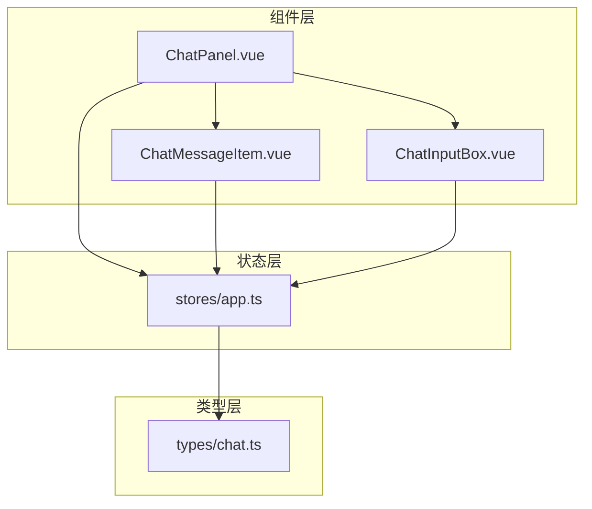
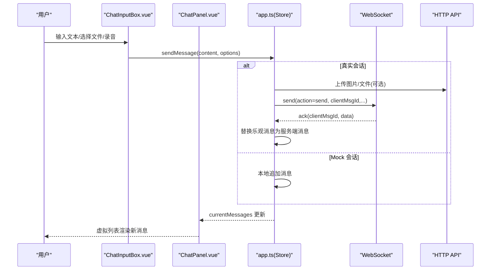
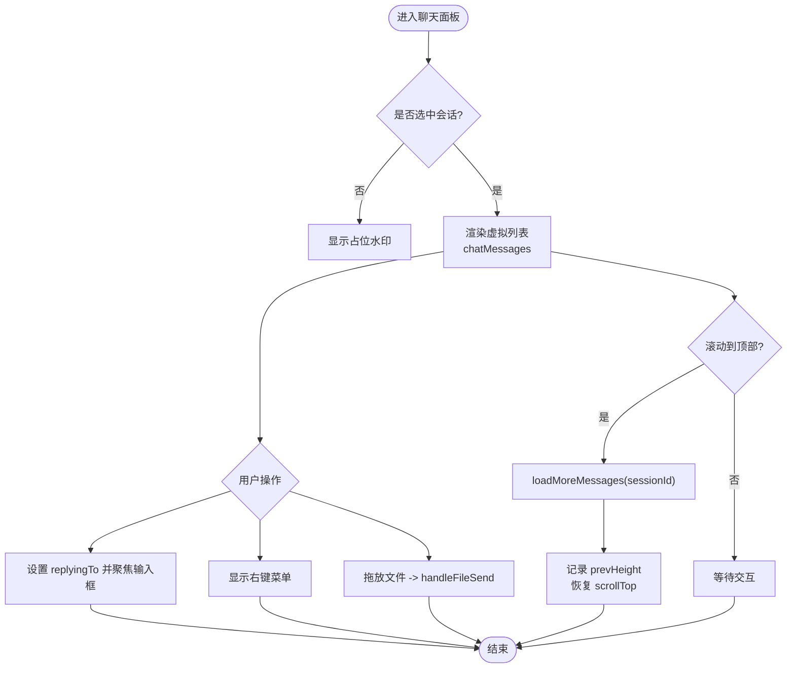
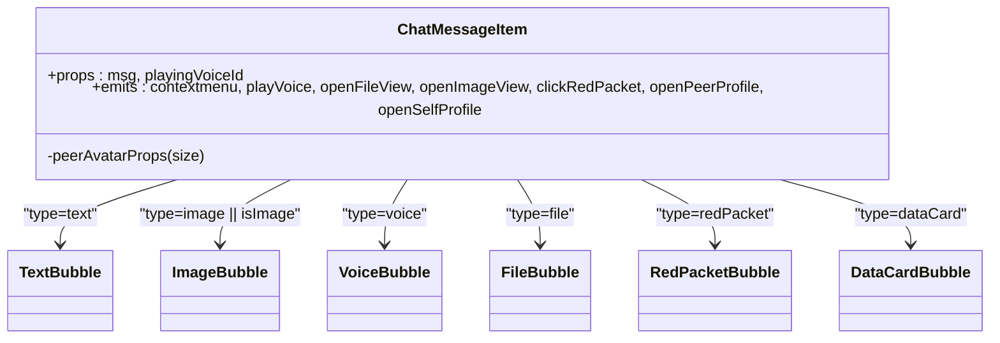
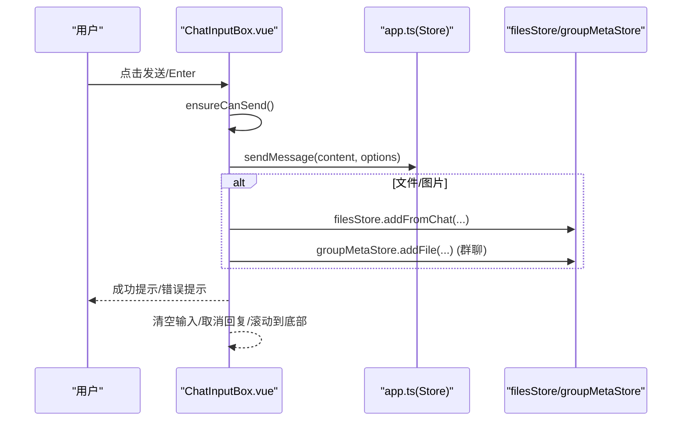
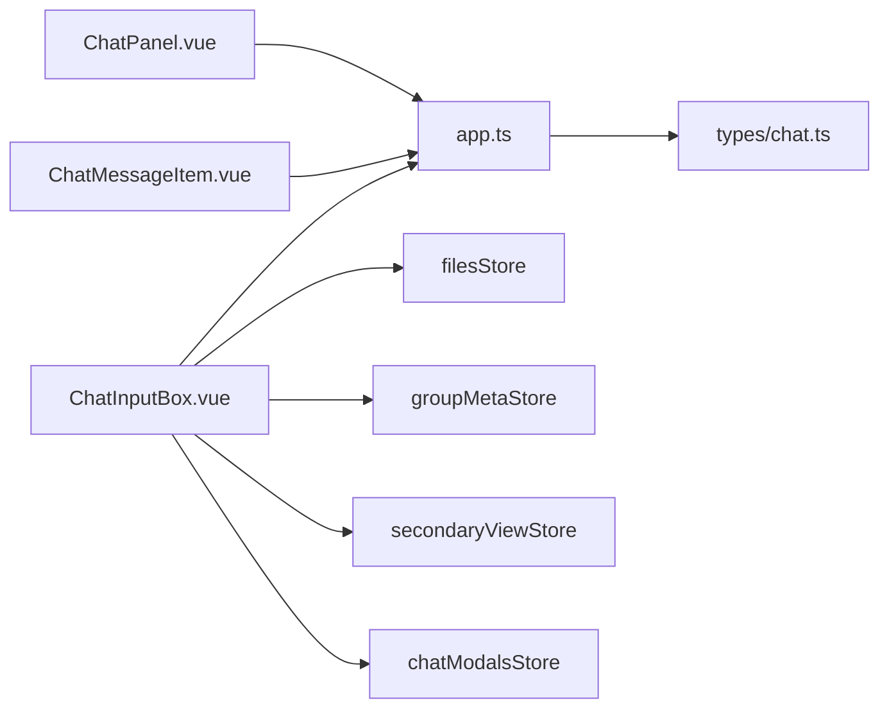
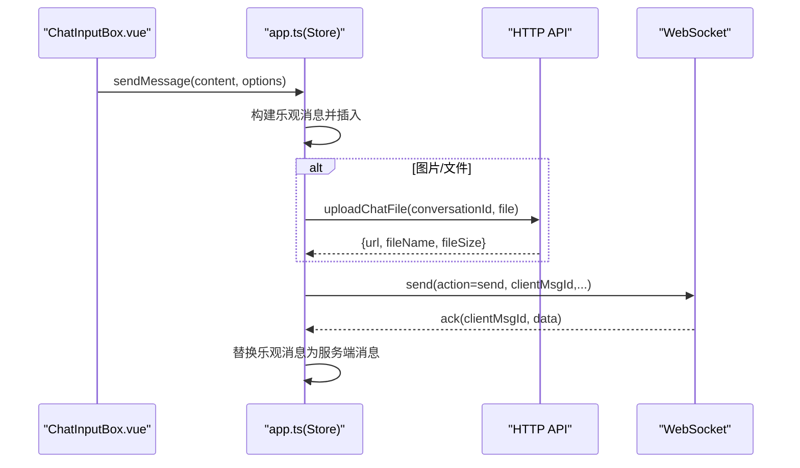
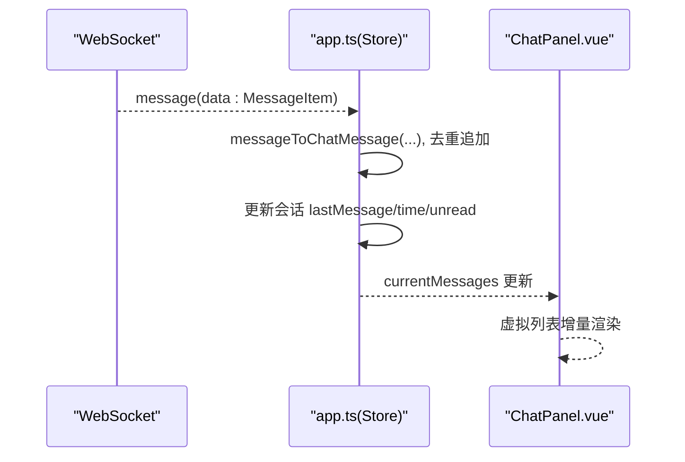
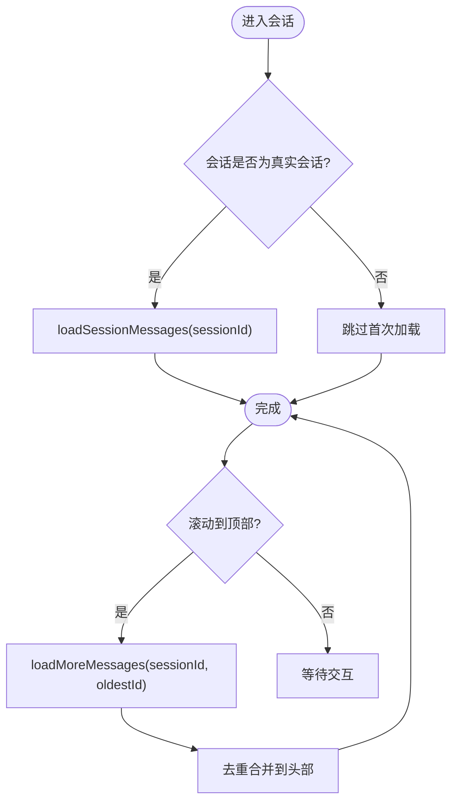

# 聊天面板核心组件

<cite>
**本文引用的文件**   
- [ChatPanel.vue](file://linkx-client/src/components/ChatPanel.vue)
- [ChatMessageItem.vue](file://linkx-client/src/components/chat/ChatMessageItem.vue)
- [ChatInputBox.vue](file://linkx-client/src/components/chat/ChatInputBox.vue)
- [app.ts](file://linkx-client/src/stores/app.ts)
- [chat.ts](file://linkx-client/src/types/chat.ts)
</cite>

## 目录
1. [简介](#简介)
2. [项目结构](#项目结构)
3. [核心组件](#核心组件)
4. [架构总览](#架构总览)
5. [详细组件分析](#详细组件分析)
6. [依赖关系分析](#依赖关系分析)
7. [性能与滚动优化](#性能与滚动优化)
8. [消息处理流程](#消息处理流程)
9. [错误处理机制](#错误处理机制)
10. [结论](#结论)

## 简介
本文件围绕 LinkX 聊天面板的核心前端组件，系统性解析 ChatPanel 主面板的消息渲染逻辑、会话管理与状态同步；深入说明 ChatMessageItem 消息项的组件化设计与动态渲染策略；全面介绍 ChatInputBox 输入框的多功能特性（文本编辑、表情选择、文件拖拽上传、截图、语音录制、快捷键）；并给出消息滚动优化、虚拟列表实现与性能调优建议，以及完整的消息处理与错误处理机制。

## 项目结构
聊天相关的前端代码集中在 linkx-client/src 下：
- 组件层：ChatPanel.vue、ChatMessageItem.vue、ChatInputBox.vue 及气泡子组件
- 状态层：stores/app.ts 管理会话、消息、发送与历史加载等
- 类型层：types/chat.ts 定义后端消息、WebSocket 帧等接口

图表来源
- [ChatPanel.vue:1-120](file://linkx-client/src/components/ChatPanel.vue#L1-L120)
- [ChatMessageItem.vue:1-70](file://linkx-client/src/components/chat/ChatMessageItem.vue#L1-L70)
- [ChatInputBox.vue:1-80](file://linkx-client/src/components/chat/ChatInputBox.vue#L1-L80)
- [app.ts:128-188](file://linkx-client/src/stores/app.ts#L128-L188)
- [chat.ts:15-57](file://linkx-client/src/types/chat.ts#L15-L57)

章节来源
- [ChatPanel.vue:1-120](file://linkx-client/src/components/ChatPanel.vue#L1-L120)
- [app.ts:128-188](file://linkx-client/src/stores/app.ts#L128-L188)

## 核心组件
- ChatPanel：主面板容器，负责会话顶栏、消息区（含虚拟列表）、输入区、右键菜单、拖放提示、侧边抽屉等。
- ChatMessageItem：单条消息行，按消息类型分发到不同气泡子组件，统一处理头像与事件冒泡。
- ChatInputBox：输入框与工具栏，支持文本、表情、应用快捷入口、文件/图片、截图、语音录制、红包、通话等。
- app Store：会话与消息的全局状态、发送/接收、历史加载、撤回、未读计数、离线态等。

章节来源
- [ChatPanel.vue:1-120](file://linkx-client/src/components/ChatPanel.vue#L1-L120)
- [ChatMessageItem.vue:1-70](file://linkx-client/src/components/chat/ChatMessageItem.vue#L1-L70)
- [ChatInputBox.vue:1-80](file://linkx-client/src/components/chat/ChatInputBox.vue#L1-L80)
- [app.ts:128-188](file://linkx-client/src/stores/app.ts#L128-L188)

## 架构总览
聊天面板采用“组件 + Pinia Store”的分层架构：
- 视图层（Vue 组件）只关注 UI 交互与展示
- 状态层（Pinia）集中管理会话、消息、发送与历史加载
- 网络层通过 WebSocket 与 HTTP API 协同完成消息收发与文件上传

图表来源
- [ChatInputBox.vue:365-384](file://linkx-client/src/components/chat/ChatInputBox.vue#L365-L384)
- [app.ts:617-749](file://linkx-client/src/stores/app.ts#L617-L749)
- [app.ts:503-523](file://linkx-client/src/stores/app.ts#L503-L523)
- [ChatPanel.vue:538-563](file://linkx-client/src/components/ChatPanel.vue#L538-L563)

## 详细组件分析

### ChatPanel 主面板
职责与要点
- 会话识别：根据 currentSession 判断好友单聊、群聊、“我的手机”等场景，分别渲染不同顶栏与行为。
- 消息过滤：仅显示非 system 类型的消息，system 用于系统通知不展示在气泡中。
- 语音播放：维护 playingVoiceId，控制 Audio 实例的播放/暂停与结束清理。
- 图片/文件预览：打开 Overlay 进行大图或文件预览。
- 右键菜单：复制、收藏、回复、撤回（仅自己发送的消息）。
- 拖放上传：dragover/dragleave/drop 控制遮罩，drop 后调用输入框 handleFileSend。
- 历史加载：监听消息区滚动到顶部时触发 loadMoreMessages，保持滚动位置稳定。
- 虚拟列表：使用 NVirtualList 渲染 chatMessages，item-key=id，提供 onMessageScroll 与 scrollToBottom。

关键数据流
- currentMessages 来自 appStore.currentMessages
- chatMessages = currentMessages.filter(m => m.type !== 'system')
- 滚动到底部：nextTick 后调用 virtualListRef.scrollTo({ position: 'bottom' })
- 加载更多：onMessageScroll 检测 scrollTop <= 80 且 messagesHasMore 为真时调用 loadMoreMessages

图表来源
- [ChatPanel.vue:121-124](file://linkx-client/src/components/ChatPanel.vue#L121-L124)
- [ChatPanel.vue:284-314](file://linkx-client/src/components/ChatPanel.vue#L284-L314)
- [ChatPanel.vue:412-440](file://linkx-client/src/components/ChatPanel.vue#L412-L440)
- [ChatPanel.vue:538-563](file://linkx-client/src/components/ChatPanel.vue#L538-L563)

章节来源
- [ChatPanel.vue:106-124](file://linkx-client/src/components/ChatPanel.vue#L106-L124)
- [ChatPanel.vue:211-245](file://linkx-client/src/components/ChatPanel.vue#L211-L245)
- [ChatPanel.vue:284-314](file://linkx-client/src/components/ChatPanel.vue#L284-L314)
- [ChatPanel.vue:412-440](file://linkx-client/src/components/ChatPanel.vue#L412-L440)
- [ChatPanel.vue:538-563](file://linkx-client/src/components/ChatPanel.vue#L538-L563)

### ChatMessageItem 消息项
职责与要点
- 布局：根据 isSelf 决定左/右对齐，左侧显示对方头像，右侧显示自己头像。
- 类型分发：依据 msg.type 与 isImage 条件渲染 FileBubble、ImageBubble、VoiceBubble、RedPacketBubble、DataCardBubble、TextBubble。
- 事件冒泡：将 contextmenu、playVoice、openFileView、openImageView、clickRedPacket、openPeerProfile、openSelfProfile 等事件向父级抛出。
- 资料卡：好友单聊时点击对方头像可打开联系人资料卡；自己头像点击打开个人资料。

图表来源
- [ChatMessageItem.vue:28-43](file://linkx-client/src/components/chat/ChatMessageItem.vue#L28-L43)
- [ChatMessageItem.vue:82-89](file://linkx-client/src/components/chat/ChatMessageItem.vue#L82-L89)

章节来源
- [ChatMessageItem.vue:48-69](file://linkx-client/src/components/chat/ChatMessageItem.vue#L48-L69)
- [ChatMessageItem.vue:72-96](file://linkx-client/src/components/chat/ChatMessageItem.vue#L72-L96)

### ChatInputBox 输入框
职责与要点
- 文本输入与命令：Enter 发送，Shift+Enter 换行；支持 /img URL 快速发图。
- 表情与应用：弹出表情网格与应用快捷入口，插入表情或切换二级视图应用。
- 文件/图片：隐藏 input 触发选择；粘贴剪贴板中的图片或文件自动发送；拖放由父组件转发至 handleFileSend。
- 截图：getDisplayMedia 捕获屏幕区域，绘制到 canvas 转 DataURL，大小校验后作为图片发送。
- 语音录制：getUserMedia + MediaRecorder 录制音频，失败则降级发送无 URL 的占位语音；结束后计算时长并发送 voice 类型消息。
- 红包与通话：打开对应弹窗；对真实会话限制部分能力并提示。
- 发送流程：先 ensureCanSend 校验屏蔽状态，再调用 appStore.sendMessage，成功后清空输入、取消回复引用并滚动到底部。

图表来源
- [ChatInputBox.vue:113-119](file://linkx-client/src/components/chat/ChatInputBox.vue#L113-L119)
- [ChatInputBox.vue:216-258](file://linkx-client/src/components/chat/ChatInputBox.vue#L216-L258)
- [ChatInputBox.vue:365-384](file://linkx-client/src/components/chat/ChatInputBox.vue#L365-L384)

章节来源
- [ChatInputBox.vue:77-106](file://linkx-client/src/components/chat/ChatInputBox.vue#L77-L106)
- [ChatInputBox.vue:130-165](file://linkx-client/src/components/chat/ChatInputBox.vue#L130-L165)
- [ChatInputBox.vue:289-353](file://linkx-client/src/components/chat/ChatInputBox.vue#L289-L353)
- [ChatInputBox.vue:365-384](file://linkx-client/src/components/chat/ChatInputBox.vue#L365-L384)

## 依赖关系分析
- ChatPanel 依赖 appStore 的 currentSession/currentMessages/loadMoreMessages/recallMessage 等方法，依赖 overlay 与 chatModals 控制弹窗/抽屉。
- ChatMessageItem 依赖 Avatar 与各类气泡子组件，依赖 appStore 获取当前会话信息以构造头像 props。
- ChatInputBox 依赖 appStore.sendMessage、secondaryViewStore.activeApp、filesStore、groupMetaStore、chatModalsStore 等。
- appStore 依赖 types/chat.ts 的 MessageItem/WsIncomingFrame 等类型，依赖 chatApi 与 chatSocket 完成网络通信。

图表来源
- [ChatPanel.vue:39-74](file://linkx-client/src/components/ChatPanel.vue#L39-L74)
- [ChatMessageItem.vue:17-26](file://linkx-client/src/components/chat/ChatMessageItem.vue#L17-L26)
- [ChatInputBox.vue:24-41](file://linkx-client/src/components/chat/ChatInputBox.vue#L24-L41)
- [app.ts:128-188](file://linkx-client/src/stores/app.ts#L128-L188)
- [chat.ts:15-57](file://linkx-client/src/types/chat.ts#L15-L57)

章节来源
- [ChatPanel.vue:39-74](file://linkx-client/src/components/ChatPanel.vue#L39-L74)
- [ChatMessageItem.vue:17-26](file://linkx-client/src/components/chat/ChatMessageItem.vue#L17-L26)
- [ChatInputBox.vue:24-41](file://linkx-client/src/components/chat/ChatInputBox.vue#L24-L41)
- [app.ts:128-188](file://linkx-client/src/stores/app.ts#L128-L188)
- [chat.ts:15-57](file://linkx-client/src/types/chat.ts#L15-L57)

## 性能与滚动优化
- 虚拟列表：使用 NVirtualList 渲染消息列表，避免大量 DOM 节点导致的卡顿；item-key=id 确保复用稳定。
- 按需加载历史：onMessageScroll 仅在 scrollTop<=80 且 messagesHasMore 为真时触发 loadMoreMessages，防止频繁请求。
- 滚动位置保持：加载前记录 prevHeight，加载后恢复 scrollTop，保证用户阅读位置不变。
- 平滑滚动：scrollToBottom 使用 nextTick 确保 DOM 更新后再执行 smooth 滚动。
- 资源释放：组件卸载时停止语音播放与麦克风轨道，避免内存泄漏与设备占用。

章节来源
- [ChatPanel.vue:284-314](file://linkx-client/src/components/ChatPanel.vue#L284-L314)
- [ChatPanel.vue:538-563](file://linkx-client/src/components/ChatPanel.vue#L538-L563)
- [ChatInputBox.vue:104-106](file://linkx-client/src/components/chat/ChatInputBox.vue#L104-L106)

## 消息处理流程

### 发送消息（真实会话）
- 输入框调用 appStore.sendMessage，若为真实会话走 sendMessageReal：
  - 参数校验（文本非空、图片/文件需有内容或 rawFile、语音时长/金额等）
  - 生成乐观消息（id 以 temp- 开头），立即插入当前会话消息数组，更新会话 lastMessage/time
  - 图片/文件：优先上传到服务器，得到 fileUrl/fileName/fileSize
  - 通过 WebSocket 发送 action=send，携带 clientMsgId、conversationId、msgType、content/fileUrl 等
  - 收到 ack 后，handleWsAck 用服务端消息替换乐观消息，并更新会话预览

图表来源
- [app.ts:617-749](file://linkx-client/src/stores/app.ts#L617-L749)
- [app.ts:503-523](file://linkx-client/src/stores/app.ts#L503-L523)

章节来源
- [app.ts:617-749](file://linkx-client/src/stores/app.ts#L617-L749)
- [app.ts:503-523](file://linkx-client/src/stores/app.ts#L503-L523)

### 接收消息（WebSocket）
- connectChatWebSocket 注册 onMessage/onAck 回调
- onMessage：handleIncomingWsMessage 将 MessageItem 映射为 ChatMessage，去重后追加到 messagesBySession，更新会话预览与未读数
- onAck：handleWsAck 用服务端消息替换乐观消息，确保一致性

图表来源
- [app.ts:448-470](file://linkx-client/src/stores/app.ts#L448-L470)
- [app.ts:479-501](file://linkx-client/src/stores/app.ts#L479-L501)
- [ChatPanel.vue:538-563](file://linkx-client/src/components/ChatPanel.vue#L538-L563)

章节来源
- [app.ts:448-470](file://linkx-client/src/stores/app.ts#L448-L470)
- [app.ts:479-501](file://linkx-client/src/stores/app.ts#L479-L501)

### 历史消息加载
- selectSession 时若会话为真实会话，调用 loadSessionMessages 拉取首屏历史
- onMessageScroll 检测到顶部滚动阈值时调用 loadMoreMessages，基于 oldestId 分页加载更早消息
- 去重策略：使用 Set(existingIds) 过滤重复 id，保证幂等

图表来源
- [app.ts:364-382](file://linkx-client/src/stores/app.ts#L364-L382)
- [app.ts:384-414](file://linkx-client/src/stores/app.ts#L384-L414)
- [ChatPanel.vue:299-314](file://linkx-client/src/components/ChatPanel.vue#L299-L314)

章节来源
- [app.ts:364-382](file://linkx-client/src/stores/app.ts#L364-L382)
- [app.ts:384-414](file://linkx-client/src/stores/app.ts#L384-L414)
- [ChatPanel.vue:299-314](file://linkx-client/src/components/ChatPanel.vue#L299-L314)

## 错误处理机制
- 发送前校验：ensureCanSend 检查会话是否被屏蔽，阻止发送并提示
- 截图尺寸限制：DataURL 长度超过 MAX_IMAGE_BYTES*1.4 时拒绝发送
- 权限降级：录音权限失败时发送无 URL 的占位语音消息
- 网络异常：sendMessageReal 捕获上传/发送异常，删除乐观消息并抛出错误
- 历史加载异常：catch 打印错误日志，finally 重置 loading 标志
- 语音播放异常：Audio.play 失败时提示无法播放

章节来源
- [ChatInputBox.vue:113-119](file://linkx-client/src/components/chat/ChatInputBox.vue#L113-L119)
- [ChatInputBox.vue:130-165](file://linkx-client/src/components/chat/ChatInputBox.vue#L130-L165)
- [ChatInputBox.vue:289-353](file://linkx-client/src/components/chat/ChatInputBox.vue#L289-L353)
- [app.ts:695-749](file://linkx-client/src/stores/app.ts#L695-L749)
- [app.ts:364-382](file://linkx-client/src/stores/app.ts#L364-L382)
- [ChatPanel.vue:211-229](file://linkx-client/src/components/ChatPanel.vue#L211-L229)

## 结论
LinkX 聊天面板通过清晰的组件分层与集中式状态管理，实现了高内聚、低耦合的消息渲染与交互体验。ChatPanel 负责编排与性能优化（虚拟列表、滚动定位、历史加载），ChatMessageItem 专注消息类型分发与事件冒泡，ChatInputBox 提供丰富的输入与多媒体能力。配合 app Store 的乐观更新与 WebSocket 确认机制，整体具备良好的一致性与鲁棒性。建议在后续迭代中继续完善：
- 针对超大图片/文件的分片上传与进度反馈
- 语音消息的压缩与断点续传
- 更细粒度的虚拟列表 item 高度估算与自适应
- 离线模式下的消息队列与重试策略