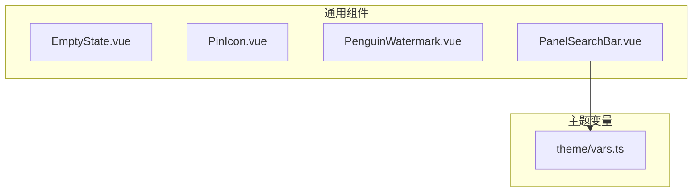
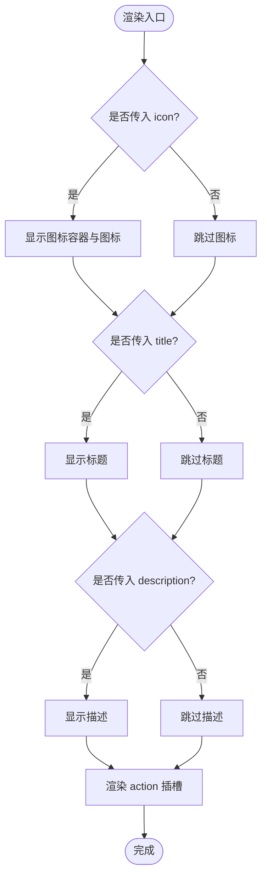
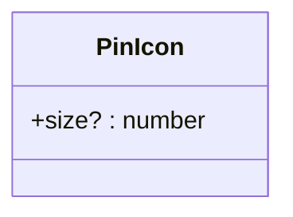
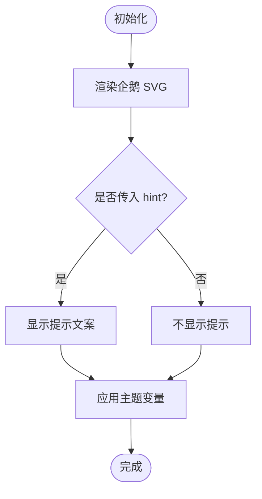
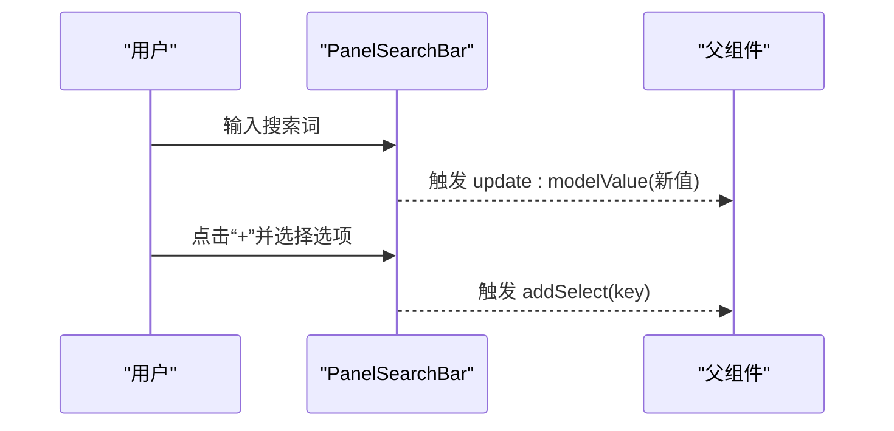
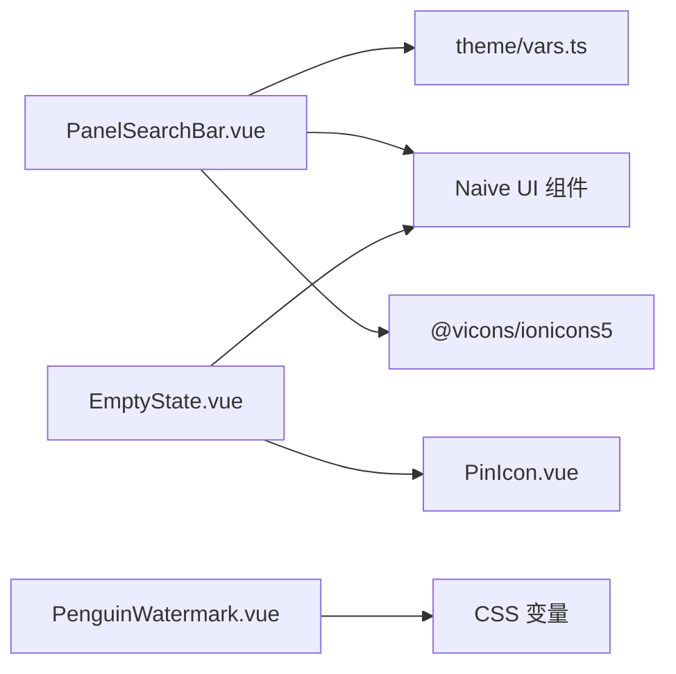

# 通用组件

<cite>
**本文引用的文件**   
- [EmptyState.vue](file://linkx-client/src/components/common/EmptyState.vue)
- [PinIcon.vue](file://linkx-client/src/components/icons/PinIcon.vue)
- [PenguinWatermark.vue](file://linkx-client/src/components/PenguinWatermark.vue)
- [PanelSearchBar.vue](file://linkx-client/src/components/PanelSearchBar.vue)
- [vars.ts](file://linkx-client/src/theme/vars.ts)
</cite>

## 目录
1. [简介](#简介)
2. [项目结构](#项目结构)
3. [核心组件](#核心组件)
4. [架构总览](#架构总览)
5. [详细组件分析](#详细组件分析)
6. [依赖关系分析](#依赖关系分析)
7. [性能与可复用性](#性能与可复用性)
8. [跨平台兼容性](#跨平台兼容性)
9. [故障排查指南](#故障排查指南)
10. [结论](#结论)

## 简介
本文件为 LinkX 前端通用组件的权威文档，聚焦以下四个组件：
- 空状态占位 EmptyState：用于无数据、无结果等场景的统一展示。
- 图标 PinIcon：基于 SVG 的置顶图钉图标，支持尺寸配置。
- 品牌水印 PenguinWatermark：企鹅插画占位，承载品牌识别与引导文案。
- 面板搜索栏 PanelSearchBar：提供搜索输入与可选“添加”下拉菜单，适配聊天列表、联系人列表等左侧面板顶部。

文档覆盖属性配置、插槽使用、样式定制、主题适配、可复用设计、性能优化策略与跨平台兼容处理，并提供使用示例路径与自定义开发指导。

## 项目结构
上述组件位于 linkx-client/src/components 下，按功能域组织：
- common：通用 UI 组件（如 EmptyState）
- icons：独立图标组件（如 PinIcon）
- 根级组件：PenguinWatermark、PanelSearchBar 等



图表来源
- [EmptyState.vue:1-77](file://linkx-client/src/components/common/EmptyState.vue#L1-L77)
- [PinIcon.vue:1-36](file://linkx-client/src/components/icons/PinIcon.vue#L1-L36)
- [PenguinWatermark.vue:1-85](file://linkx-client/src/components/PenguinWatermark.vue#L1-L85)
- [PanelSearchBar.vue:1-87](file://linkx-client/src/components/PanelSearchBar.vue#L1-L87)
- [vars.ts:1-30](file://linkx-client/src/theme/vars.ts#L1-L30)

章节来源
- [EmptyState.vue:1-77](file://linkx-client/src/components/common/EmptyState.vue#L1-L77)
- [PinIcon.vue:1-36](file://linkx-client/src/components/icons/PinIcon.vue#L1-L36)
- [PenguinWatermark.vue:1-85](file://linkx-client/src/components/PenguinWatermark.vue#L1-L85)
- [PanelSearchBar.vue:1-87](file://linkx-client/src/components/PanelSearchBar.vue#L1-L87)
- [vars.ts:1-30](file://linkx-client/src/theme/vars.ts#L1-L30)

## 核心组件
本节概览各组件的职责与对外接口，便于快速定位与选用。

- EmptyState
  - 职责：统一呈现空状态的图标、标题、描述与操作区。
  - 关键能力：可选图标、标题、描述；action 插槽扩展操作按钮。
  - 主题：通过 CSS 变量控制文本与背景色。

- PinIcon
  - 职责：提供可配置的 SVG 图钉图标。
  - 关键能力：size 属性控制宽高；currentColor 继承文字色。
  - 主题：跟随父级 color 或显式传入颜色。

- PenguinWatermark
  - 职责：以企鹅插画作为品牌占位，附带提示文案。
  - 关键能力：hint 属性控制底部提示文案。
  - 主题：大量使用 CSS 变量实现明暗主题适配。

- PanelSearchBar
  - 职责：面板顶部的搜索输入框与可选“添加”下拉。
  - 关键能力：v-model 双向绑定；placeholder 占位；addOptions 下拉选项；事件 update:modelValue 与 addSelect。
  - 主题：通过 lxVar 将 Naive UI 图标颜色与 CSS 变量对齐。

章节来源
- [EmptyState.vue:1-77](file://linkx-client/src/components/common/EmptyState.vue#L1-L77)
- [PinIcon.vue:1-36](file://linkx-client/src/components/icons/PinIcon.vue#L1-L36)
- [PenguinWatermark.vue:1-85](file://linkx-client/src/components/PenguinWatermark.vue#L1-L85)
- [PanelSearchBar.vue:1-87](file://linkx-client/src/components/PanelSearchBar.vue#L1-L87)
- [vars.ts:1-30](file://linkx-client/src/theme/vars.ts#L1-L30)

## 架构总览
组件间关系与主题集成如下：

```mermaid
classDiagram
class EmptyState {
+icon? : any
+title? : string
+description? : string
+slot action
}
class PinIcon {
+size? : number
}
class PenguinWatermark {
+hint? : string
}
class PanelSearchBar {
+modelValue : string
+placeholder? : string
+addOptions? : {label : string; key : string}[]
+事件 update : modelValue
+事件 addSelect
}
class ThemeVars {
+lxVar
}
PanelSearchBar --> ThemeVars : "读取 lxVar"
EmptyState ..> PinIcon : "可作为 icon 传入"
```

图表来源
- [EmptyState.vue:1-77](file://linkx-client/src/components/common/EmptyState.vue#L1-L77)
- [PinIcon.vue:1-36](file://linkx-client/src/components/icons/PinIcon.vue#L1-L36)
- [PenguinWatermark.vue:1-85](file://linkx-client/src/components/PenguinWatermark.vue#L1-L85)
- [PanelSearchBar.vue:1-87](file://linkx-client/src/components/PanelSearchBar.vue#L1-L87)
- [vars.ts:1-30](file://linkx-client/src/theme/vars.ts#L1-L30)

## 详细组件分析

### EmptyState 空状态占位
- 设计要点
  - 垂直居中布局，包含可选图标、主标题、描述与操作插槽。
  - 图标区域圆形容器，配合浅色背景突出视觉层级。
  - 文案采用 CSS 变量，确保与全局主题一致。
- 属性与插槽
  - icon：任意图标组件（例如 PinIcon），由外部传入。
  - title：主标题文案。
  - description：说明文案。
  - slot="action"：放置操作按钮或链接。
- 样式与主题
  - 使用 --lx-text、--lx-text-muted、--lx-bg-hover 等变量。
  - 可通过覆盖 CSS 变量或局部样式类进行定制。
- 使用建议
  - 在列表为空、搜索无结果、首次进入页面时展示。
  - 结合 action 插槽提供“新建”、“刷新”等引导行为。



图表来源
- [EmptyState.vue:1-77](file://linkx-client/src/components/common/EmptyState.vue#L1-L77)

章节来源
- [EmptyState.vue:1-77](file://linkx-client/src/components/common/EmptyState.vue#L1-L77)

### PinIcon 置顶图标
- 设计要点
  - 纯 SVG 矢量图标，支持 size 属性控制宽高。
  - 使用 currentColor 继承父级文字色，便于主题切换。
- 属性
  - size：数字类型，默认 16，单位像素。
- 使用建议
  - 作为 EmptyState.icon 或其他需要小图标的场景。
  - 通过外层容器设置 color 或使用主题变量控制颜色。



图表来源
- [PinIcon.vue:1-36](file://linkx-client/src/components/icons/PinIcon.vue#L1-L36)

章节来源
- [PinIcon.vue:1-36](file://linkx-client/src/components/icons/PinIcon.vue#L1-L36)

### PenguinWatermark 企鹅水印
- 设计要点
  - 以 SVG 绘制企鹅形象，整体透明度较低，营造“水印”氛围。
  - 底部提示文案 hint 可自定义，增强引导性。
  - 大量使用 CSS 变量，保证在不同主题下的可读性与一致性。
- 属性
  - hint：字符串，默认提示文案。
- 样式与主题
  - 使用 --lx-divider、--lx-bg-panel、--lx-bg-card、--lx-bg-panel-deep、--lx-bg-hover 等变量。
  - 通过 drop-shadow 与径向渐变提升层次感。
- 使用建议
  - 适用于未选择会话时的右侧主内容区占位。
  - 可根据业务替换 hint 文案，保持友好引导。



图表来源
- [PenguinWatermark.vue:1-85](file://linkx-client/src/components/PenguinWatermark.vue#L1-L85)

章节来源
- [PenguinWatermark.vue:1-85](file://linkx-client/src/components/PenguinWatermark.vue#L1-L85)

### PanelSearchBar 面板搜索栏
- 设计要点
  - 左侧面板顶部常用控件，包含搜索输入与可选“添加”下拉。
  - 使用 Naive UI 的 NInput 与 NDropdown，结合 Ionicons 图标。
  - 通过 lxVar 将图标颜色与 CSS 变量对齐，保障主题一致性。
- 属性
  - modelValue：字符串，v-model 双向绑定搜索关键词。
  - placeholder：占位文案，默认“搜索”。
  - addOptions：数组项 { label, key }，存在且长度大于 0 时显示“+”下拉。
- 事件
  - update:modelValue：当输入变化时触发，供父组件更新模型值。
  - addSelect：当点击下拉选项时触发，携带选中项的 key。
- 交互流程



图表来源
- [PanelSearchBar.vue:1-87](file://linkx-client/src/components/PanelSearchBar.vue#L1-L87)

章节来源
- [PanelSearchBar.vue:1-87](file://linkx-client/src/components/PanelSearchBar.vue#L1-L87)
- [vars.ts:1-30](file://linkx-client/src/theme/vars.ts#L1-L30)

## 依赖关系分析
- 组件内依赖
  - EmptyState 依赖 Naive UI 的 NIcon 渲染外部传入的图标组件。
  - PanelSearchBar 依赖 Naive UI 的 NInput、NIcon、NDropdown 以及 @vicons/ionicons5 的图标。
  - PanelSearchBar 通过 theme/vars.ts 的 lxVar 引用 CSS 变量，避免模板中直接写 var() 的不便。
- 主题系统
  - vars.ts 暴露 lxVar 与 naiveThemeColors，前者用于脚本侧访问 CSS 变量，后者用于 Naive UI 主题覆盖。
- 耦合与解耦
  - EmptyState 与具体图标解耦，通过 icon 属性注入，提高复用性。
  - PanelSearchBar 的事件驱动模式使搜索逻辑与展示分离，便于上层组合。



图表来源
- [PanelSearchBar.vue:1-87](file://linkx-client/src/components/PanelSearchBar.vue#L1-L87)
- [EmptyState.vue:1-77](file://linkx-client/src/components/common/EmptyState.vue#L1-L77)
- [PinIcon.vue:1-36](file://linkx-client/src/components/icons/PinIcon.vue#L1-L36)
- [PenguinWatermark.vue:1-85](file://linkx-client/src/components/PenguinWatermark.vue#L1-L85)
- [vars.ts:1-30](file://linkx-client/src/theme/vars.ts#L1-L30)

章节来源
- [PanelSearchBar.vue:1-87](file://linkx-client/src/components/PanelSearchBar.vue#L1-L87)
- [EmptyState.vue:1-77](file://linkx-client/src/components/common/EmptyState.vue#L1-L77)
- [PinIcon.vue:1-36](file://linkx-client/src/components/icons/PinIcon.vue#L1-L36)
- [PenguinWatermark.vue:1-85](file://linkx-client/src/components/PenguinWatermark.vue#L1-L85)
- [vars.ts:1-30](file://linkx-client/src/theme/vars.ts#L1-L30)

## 性能与可复用性
- 性能优化
  - 空状态与水印均为轻量静态渲染，无复杂计算，适合频繁出现场景。
  - 图标使用 SVG 矢量，缩放不失真，减少多分辨率资源。
  - 搜索栏仅维护必要状态，事件派发清晰，避免不必要的重渲染。
- 可复用设计
  - EmptyState 通过 icon/title/description/action 插槽形成高内聚低耦合的空态方案。
  - PinIcon 通过 size 属性实现尺寸可控，便于在多处复用。
  - PanelSearchBar 以 v-model 与事件驱动，易于嵌入不同面板。
- 主题适配
  - 广泛使用 CSS 变量，确保明暗主题、品牌色变更时无需修改组件内部样式。
  - 对 Naive UI 组件的颜色通过 lxVar 映射到 CSS 变量，保持一致性。

[本节为通用指导，无需列出具体文件来源]

## 跨平台兼容性
- 浏览器与 Electron
  - 组件基于 Vue 3 与标准 Web API，兼容主流浏览器与 Electron 环境。
  - SVG 与 CSS 变量在现代浏览器中均有良好支持。
- 无障碍
  - 图标与装饰性 SVG 设置 aria-hidden="true"，避免屏幕阅读器误读。
- 移动端适配
  - 组件以 Flex 布局为主，在小屏上表现稳定；必要时可在外层容器限制最大宽度。

[本节为通用指导，无需列出具体文件来源]

## 故障排查指南
- 主题变量未生效
  - 检查 styles.css 是否正确定义 --lx-* 系列变量。
  - 确认 PanelSearchBar 使用的 lxVar 映射是否与变量名一致。
- 图标颜色异常
  - 若使用 PinIcon，请确保父级设置了合适的 color，或通过 lxVar 传入对应变量。
- 搜索输入不更新
  - 确认父组件正确监听 update:modelValue 并使用 v-model 绑定。
- 空状态未显示
  - 检查 EmptyState 的 icon/title/description 是否为空；如需操作按钮，请确保 action 插槽已填充。
- 水印不可见
  - 检查外层容器高度与背景，确保 PenguinWatermark 的半透明效果可见。

章节来源
- [PanelSearchBar.vue:1-87](file://linkx-client/src/components/PanelSearchBar.vue#L1-L87)
- [EmptyState.vue:1-77](file://linkx-client/src/components/common/EmptyState.vue#L1-L77)
- [PinIcon.vue:1-36](file://linkx-client/src/components/icons/PinIcon.vue#L1-L36)
- [PenguinWatermark.vue:1-85](file://linkx-client/src/components/PenguinWatermark.vue#L1-L85)
- [vars.ts:1-30](file://linkx-client/src/theme/vars.ts#L1-L30)

## 结论
以上四个通用组件构成了 LinkX 前端的基础体验层：EmptyState 提供一致的空态表达，PinIcon 提供可复用的矢量图标，PenguinWatermark 强化品牌识别与引导，PanelSearchBar 满足常见面板搜索需求。通过 CSS 变量与主题映射，组件具备良好的主题适配能力与可扩展性。开发者可直接复用这些组件，并在其基础上进行二次定制与组合，以提升整体一致性与开发效率。