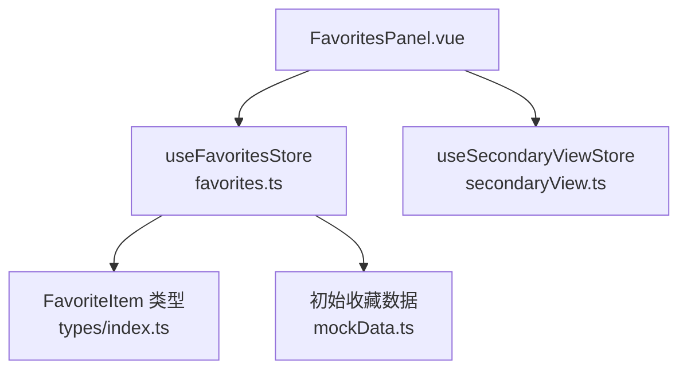
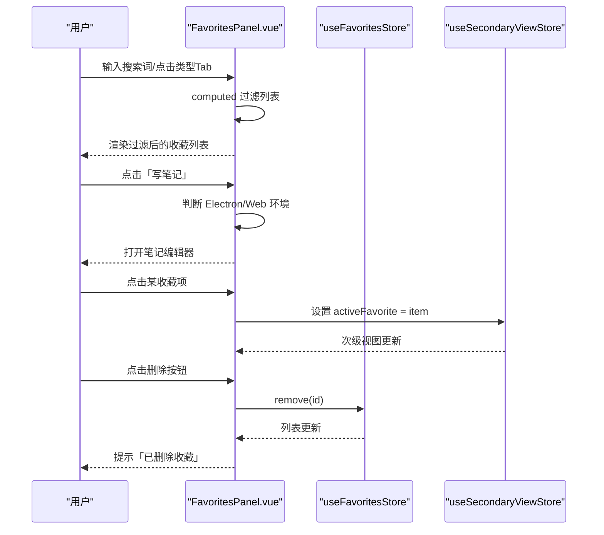
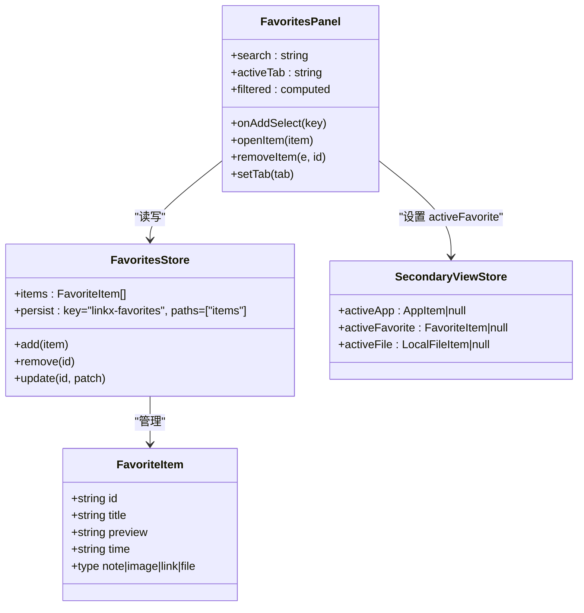
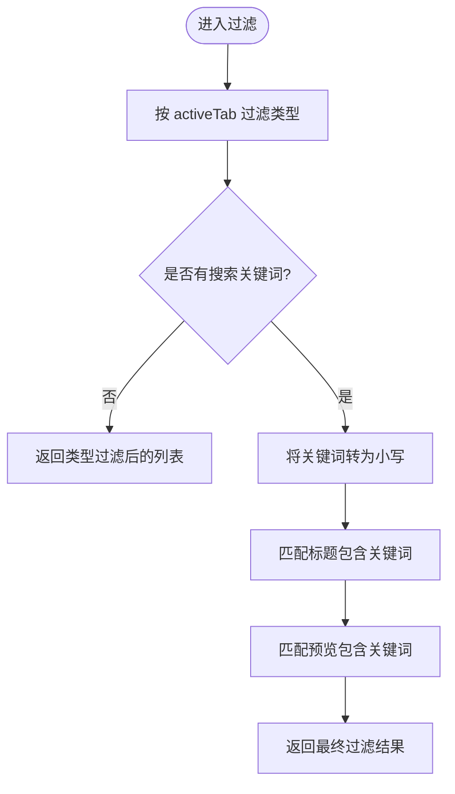
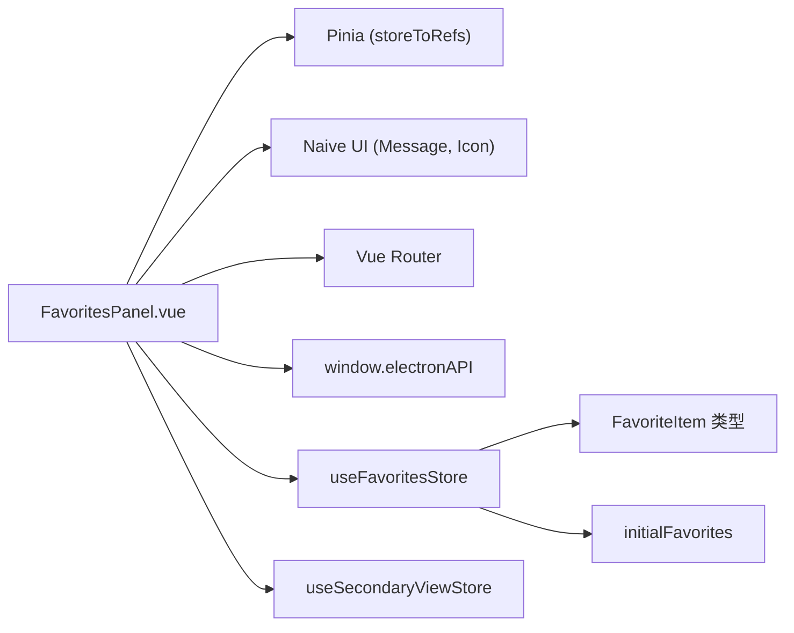

# 收藏面板 FavoritesPanel

<cite>
**本文引用的文件**   
- [FavoritesPanel.vue](file://linkx-client/src/components/FavoritesPanel.vue)
- [favorites.ts](file://linkx-client/src/stores/favorites.ts)
- [index.ts](file://linkx-client/src/types/index.ts)
- [mockData.ts](file://linkx-client/src/data/mockData.ts)
- [secondaryView.ts](file://linkx-client/src/stores/secondaryView.ts)
</cite>

## 目录
1. [简介](#简介)
2. [项目结构](#项目结构)
3. [核心组件与数据流](#核心组件与数据流)
4. [架构总览](#架构总览)
5. [详细组件分析](#详细组件分析)
6. [依赖关系分析](#依赖关系分析)
7. [性能考虑](#性能考虑)
8. [故障排查指南](#故障排查指南)
9. [结论](#结论)
10. [附录：使用指南与二次开发参考](#附录使用指南与二次开发参考)

## 简介
本文件为收藏面板组件 FavoritesPanel 的完整功能文档。内容覆盖收藏内容的分类管理、类型支持（笔记、链接、图片、文件）、搜索过滤、增删改查操作、本地持久化策略，以及与主视图的联动展示机制。同时提供二次开发建议与常见问题排查方法。

## 项目结构
收藏相关的前端实现集中在客户端模块中，关键文件如下：
- 组件层：FavoritesPanel.vue 负责收藏列表渲染、搜索过滤、类型 Tab 切换、删除交互等
- 状态层：stores/favorites.ts 通过 Pinia 管理收藏项集合及增删改动作，并配置本地持久化
- 类型定义：types/index.ts 中的 FavoriteItem 接口定义了收藏项的数据模型
- 初始数据：data/mockData.ts 提供演示用的初始收藏条目
- 次级视图：stores/secondaryView.ts 维护当前激活的收藏项，供右侧详情区展示

图表来源
- [FavoritesPanel.vue:1-273](file://linkx-client/src/components/FavoritesPanel.vue#L1-L273)
- [favorites.ts:1-65](file://linkx-client/src/stores/favorites.ts#L1-L65)
- [index.ts:98-105](file://linkx-client/src/types/index.ts#L98-L105)
- [mockData.ts:238-243](file://linkx-client/src/data/mockData.ts#L238-L243)
- [secondaryView.ts:1-22](file://linkx-client/src/stores/secondaryView.ts#L1-L22)

章节来源
- [FavoritesPanel.vue:1-273](file://linkx-client/src/components/FavoritesPanel.vue#L1-L273)
- [favorites.ts:1-65](file://linkx-client/src/stores/favorites.ts#L1-L65)
- [index.ts:98-105](file://linkx-client/src/types/index.ts#L98-L105)
- [mockData.ts:238-243](file://linkx-client/src/data/mockData.ts#L238-L243)
- [secondaryView.ts:1-22](file://linkx-client/src/stores/secondaryView.ts#L1-L22)

## 核心组件与数据流
- 组件职责
  - 渲染收藏列表，按类型 Tab 筛选
  - 提供关键词搜索，匹配标题与预览文本
  - 打开笔记编辑器（Electron 或 Web 路由）
  - 删除收藏项并提示成功
  - 选中收藏项并在次级视图激活，用于详情展示
- 数据流向
  - 组件从 favorites Store 读取 items 列表
  - 组件调用 store 的 add/remove/update 修改数据
  - 次级视图 Store 保存 activeFavorite，驱动右侧详情区域显示

图表来源
- [FavoritesPanel.vue:35-82](file://linkx-client/src/components/FavoritesPanel.vue#L35-L82)
- [favorites.ts:25-56](file://linkx-client/src/stores/favorites.ts#L25-L56)
- [secondaryView.ts:14-21](file://linkx-client/src/stores/secondaryView.ts#L14-L21)

章节来源
- [FavoritesPanel.vue:1-273](file://linkx-client/src/components/FavoritesPanel.vue#L1-L273)
- [favorites.ts:1-65](file://linkx-client/src/stores/favorites.ts#L1-L65)
- [secondaryView.ts:1-22](file://linkx-client/src/stores/secondaryView.ts#L1-L22)

## 架构总览
收藏系统采用“组件 + Store + 类型”的清晰分层：
- 组件层仅负责 UI 交互与计算属性过滤
- Store 层集中管理数据变更与持久化
- 类型层统一数据结构契约
- 次级视图 Store 作为跨组件共享的“当前激活项”

图表来源
- [index.ts:98-105](file://linkx-client/src/types/index.ts#L98-L105)
- [favorites.ts:19-64](file://linkx-client/src/stores/favorites.ts#L19-L64)
- [secondaryView.ts:14-21](file://linkx-client/src/stores/secondaryView.ts#L14-L21)
- [FavoritesPanel.vue:26-82](file://linkx-client/src/components/FavoritesPanel.vue#L26-L82)

## 详细组件分析

### 数据类型设计
- 收藏项模型
  - id：唯一标识，新增时若未提供则自动生成
  - title：标题
  - preview：预览摘要
  - time：时间标签（如“今天”）
  - type：类型枚举，支持 note、image、link、file
- 类型约束与扩展
  - 类型字段限定为四种，便于前端图标与样式区分
  - 如需扩展更多类型，需同步更新类型定义与组件映射逻辑

章节来源
- [index.ts:98-105](file://linkx-client/src/types/index.ts#L98-L105)
- [mockData.ts:238-243](file://linkx-client/src/data/mockData.ts#L238-L243)

### 本地存储策略与持久化
- 持久化位置
  - 使用 Pinia 插件进行本地持久化，key 为 linkx-favorites，仅持久化 items 路径
- 初始化数据
  - 首次加载时从 mockData 提供的初始收藏数据复制一份到 Store
- 注意事项
  - 当前未实现服务端同步，所有变更仅保存在本地
  - 如需多端同步，可在 actions 中增加网络请求与冲突解决策略

章节来源
- [favorites.ts:19-64](file://linkx-client/src/stores/favorites.ts#L19-L64)
- [mockData.ts:238-243](file://linkx-client/src/data/mockData.ts#L238-L243)

### 分类管理与类型支持
- 类型 Tab
  - 全部、链接、图片、文件、笔记五种视图
  - 点击切换 activeTab，computed 根据类型过滤
- 图标映射
  - 根据 type 返回对应图标组件，提升识别度
- 空状态
  - 当过滤结果为空时，显示“无匹配的收藏内容”

章节来源
- [FavoritesPanel.vue:27-64](file://linkx-client/src/components/FavoritesPanel.vue#L27-L64)
- [FavoritesPanel.vue:96-102](file://linkx-client/src/components/FavoritesPanel.vue#L96-L102)
- [FavoritesPanel.vue:125-128](file://linkx-client/src/components/FavoritesPanel.vue#L125-L128)

### 搜索与过滤
- 关键词过滤
  - 对标题与预览进行小写匹配，实时过滤
- 组合过滤
  - 先按类型过滤，再按关键词过滤，保证结果集最小化

图表来源
- [FavoritesPanel.vue:46-56](file://linkx-client/src/components/FavoritesPanel.vue#L46-L56)

章节来源
- [FavoritesPanel.vue:46-56](file://linkx-client/src/components/FavoritesPanel.vue#L46-L56)

### 增删改查操作
- 新增
  - 通过 store.add 插入到列表头部，自动分配 id 与默认时间标签
- 删除
  - 通过 store.remove 按 id 移除，若删除的是当前激活项则清空 activeFavorite
- 更新
  - 通过 store.update 部分合并字段（title、preview、type）
- 查询
  - 组件通过 computed 基于 activeTab 与 search 生成 filtered 列表

章节来源
- [favorites.ts:25-56](file://linkx-client/src/stores/favorites.ts#L25-L56)
- [FavoritesPanel.vue:71-82](file://linkx-client/src/components/FavoritesPanel.vue#L71-L82)

### 导入导出功能
- 现状
  - 当前未实现导入导出能力
- 建议方案
  - 导出：将 items 序列化为 JSON 并提供下载
  - 导入：解析上传的 JSON 文件，合并或替换现有 items，并进行去重校验
  - 批量操作：在 Store 中增加批量 add/remove/update 方法，配合多选状态管理

[本节为概念性建议，不直接分析具体文件]

### 批量操作
- 现状
  - 当前仅提供单条删除
- 建议方案
  - 在组件中引入多选状态数组 selectedIds
  - 在 Store 中增加 batchRemove(ids)、batchUpdate(patchMap) 等方法
  - 结合确认对话框与撤销机制提升用户体验

[本节为概念性建议，不直接分析具体文件]

### 与主视图联动
- 选中收藏项
  - 点击列表项时，将 item 写入 secondaryViewStore.activeFavorite
  - 右侧详情区域可据此渲染详细内容（例如笔记正文、链接跳转、图片预览、文件信息）

章节来源
- [FavoritesPanel.vue:66-69](file://linkx-client/src/components/FavoritesPanel.vue#L66-L69)
- [secondaryView.ts:14-21](file://linkx-client/src/stores/secondaryView.ts#L14-L21)

## 依赖关系分析
- 组件依赖
  - Vue 响应式 API（ref、computed）
  - Naive UI 消息提示与图标组件
  - Pinia storeToRefs 解构响应式状态
  - Vue Router 与 Electron API 条件分支处理
- Store 依赖
  - Pinia defineStore
  - 类型定义 FavoriteItem
  - Mock 初始数据
- 外部集成点
  - Electron 环境检测以决定打开笔记编辑器的方式
  - 次级视图 Store 共享当前激活项

图表来源
- [FavoritesPanel.vue:8-21](file://linkx-client/src/components/FavoritesPanel.vue#L8-L21)
- [favorites.ts:7-11](file://linkx-client/src/stores/favorites.ts#L7-L11)
- [index.ts:98-105](file://linkx-client/src/types/index.ts#L98-L105)
- [mockData.ts:238-243](file://linkx-client/src/data/mockData.ts#L238-L243)

章节来源
- [FavoritesPanel.vue:8-21](file://linkx-client/src/components/FavoritesPanel.vue#L8-L21)
- [favorites.ts:7-11](file://linkx-client/src/stores/favorites.ts#L7-L11)
- [index.ts:98-105](file://linkx-client/src/types/index.ts#L98-L105)
- [mockData.ts:238-243](file://linkx-client/src/data/mockData.ts#L238-L243)

## 性能考虑
- 计算属性优化
  - 使用 computed 缓存过滤结果，避免重复计算
- 列表渲染
  - 使用 v-for 的 key 绑定 id，提高 Diff 效率
- 大列表优化建议
  - 虚拟滚动：当收藏项数量较大时，可采用虚拟列表减少 DOM 节点
  - 分页加载：按需加载历史收藏，降低首屏压力
- 搜索优化
  - 防抖：对搜索输入进行防抖，减少频繁过滤
  - 索引：对标题与预览建立简单倒排索引以提升匹配速度

[本节为通用性能建议，不直接分析具体文件]

## 故障排查指南
- 搜索无结果
  - 检查关键词是否包含空格或大小写差异；组件已做 trim 与小写转换
  - 确认过滤逻辑是否被其他状态干扰
- 删除后详情未清空
  - 确保删除时比对 activeFavorite.id 并置空
- 新增项未显示
  - 确认 add 方法是否正确插入到 items 头部
  - 检查持久化是否生效（浏览器开发者工具查看本地存储）
- 类型图标不正确
  - 核对 iconFor 映射是否与类型枚举一致
- 笔记编辑器无法打开
  - 检查 window.electronAPI 是否存在；不存在时使用路由跳转

章节来源
- [FavoritesPanel.vue:46-56](file://linkx-client/src/components/FavoritesPanel.vue#L46-L56)
- [FavoritesPanel.vue:71-77](file://linkx-client/src/components/FavoritesPanel.vue#L71-L77)
- [FavoritesPanel.vue:35-44](file://linkx-client/src/components/FavoritesPanel.vue#L35-L44)
- [favorites.ts:30-38](file://linkx-client/src/stores/favorites.ts#L30-L38)

## 结论
FavoritesPanel 提供了简洁高效的收藏管理能力，涵盖分类、搜索、增删改与本地持久化。当前版本聚焦于本地体验，后续可扩展导入导出、批量操作与服务端同步，以满足更复杂的使用场景。

[本节为总结性内容，不直接分析具体文件]

## 附录：使用指南与二次开发参考

### 使用指南
- 添加收藏
  - 通过调用 store.add 传入 title、preview、type 即可新增
- 删除收藏
  - 调用 store.remove(id)，组件会自动清理选中项并提示
- 搜索与筛选
  - 在搜索框输入关键词，选择类型 Tab 快速定位目标
- 查看详情
  - 点击收藏项，右侧详情区域会显示该收藏的详细信息

章节来源
- [favorites.ts:25-56](file://linkx-client/src/stores/favorites.ts#L25-L56)
- [FavoritesPanel.vue:46-82](file://linkx-client/src/components/FavoritesPanel.vue#L46-L82)

### 二次开发参考
- 扩展类型
  - 在类型定义中添加新类型，并在组件中补充图标映射与样式
- 增加批量操作
  - 在 Store 中新增批量方法，组件侧增加多选状态与批量按钮
- 接入后端同步
  - 在 actions 中发起网络请求，处理并发与冲突，保持本地与远端一致性
- 导入导出
  - 导出：序列化 items 为 JSON 并触发下载
  - 导入：解析 JSON 文件，合并或替换现有数据，进行去重校验

[本节为概念性指导，不直接分析具体文件]