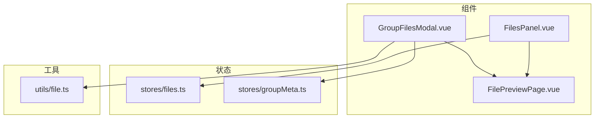
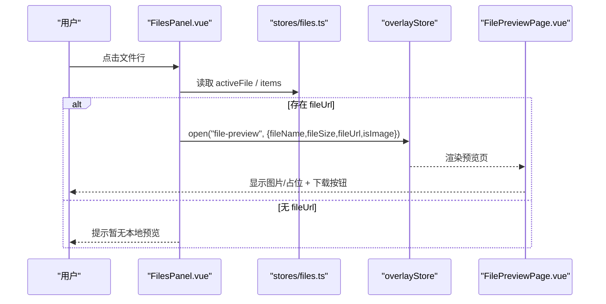
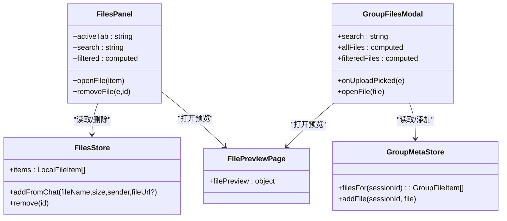
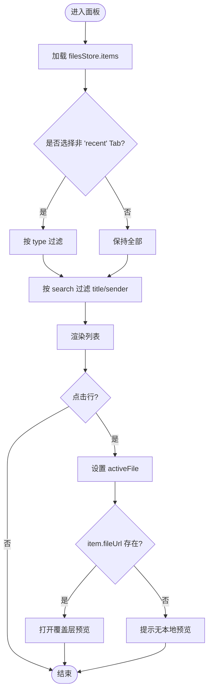
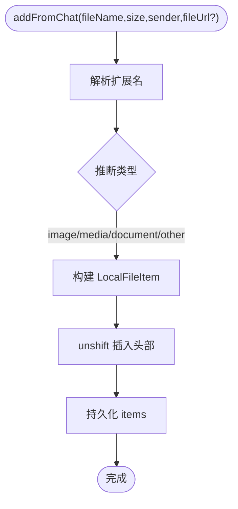
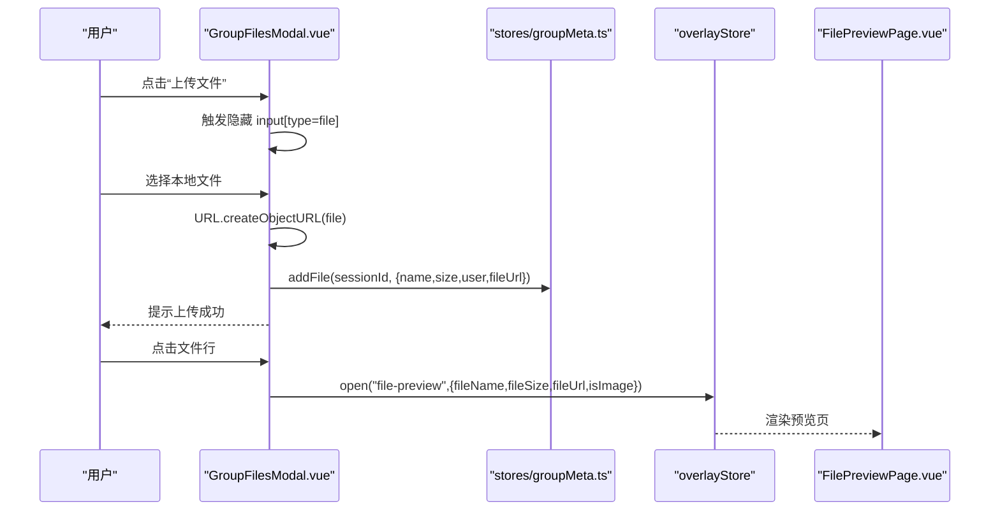
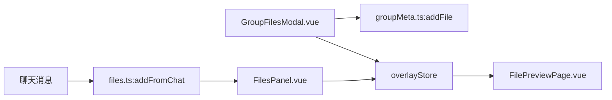

# 文件面板 FilesPanel

<cite>
**本文引用的文件**
- [FilesPanel.vue](file://linkx-client/src/components/FilesPanel.vue)
- [files.ts](file://linkx-client/src/stores/files.ts)
- [file.ts](file://linkx-client/src/utils/file.ts)
- [GroupFilesModal.vue](file://linkx-client/src/components/chat/GroupFilesModal.vue)
- [FilePreviewPage.vue](file://linkx-client/src/components/overlay/pages/FilePreviewPage.vue)
- [groupMeta.ts](file://linkx-client/src/stores/groupMeta.ts)
</cite>

## 目录
1. [简介](#简介)
2. [项目结构](#项目结构)
3. [核心组件与数据流](#核心组件与数据流)
4. [架构总览](#架构总览)
5. [详细组件分析](#详细组件分析)
6. [依赖关系分析](#依赖关系分析)
7. [性能与优化](#性能与优化)
8. [故障排查指南](#故障排查指南)
9. [结论](#结论)
10. [附录：API 参考](#附录api-参考)

## 简介
本技术文档围绕前端“文件面板”能力，聚焦以下目标：
- 文件浏览界面、分类筛选与搜索
- 批量操作能力（当前实现为单条删除）
- 文件管理系统架构、存储路径映射与元数据管理
- 上传下载进度显示、预览功能集成与存储空间管理
- 完整 API 接口与错误处理机制
- 大文件处理的优化策略

说明：
- 当前仓库中 FilesPanel 主要展示本地文件列表，支持按类型 Tab 过滤与关键词搜索，并可打开覆盖层进行图片预览。
- 群文件模块通过 GroupFilesModal 提供上传入口与预览；上传目前为本地模拟，未包含服务端交互与进度回调。
- 文件大小格式化与 Data URL 读取工具在 utils/file.ts 中提供。

## 项目结构
与 FilesPanel 相关的代码组织如下：
- 组件层
  - FilesPanel.vue：侧边文件面板，负责列表渲染、Tab 分类、搜索、选中高亮、删除与预览跳转
  - GroupFilesModal.vue：群文件弹窗，提供搜索、分组展示、上传触发与预览跳转
  - FilePreviewPage.vue：覆盖层中的文件预览页，支持图片直显与下载/打开链接
- 状态层
  - files.ts：本地文件 Store，维护 LocalFileItem 列表及增删动作，并持久化到浏览器存储
  - groupMeta.ts：群元数据 Store，维护群文件列表等元数据，并提供 addFile 方法
- 工具层
  - file.ts：文件大小格式化与 Data URL 读取工具

图表来源
- [FilesPanel.vue:1-275](file://linkx-client/src/components/FilesPanel.vue#L1-L275)
- [GroupFilesModal.vue:1-285](file://linkx-client/src/components/chat/GroupFilesModal.vue#L1-L285)
- [FilePreviewPage.vue:1-44](file://linkx-client/src/components/overlay/pages/FilePreviewPage.vue#L1-L44)
- [files.ts:1-79](file://linkx-client/src/stores/files.ts#L1-L79)
- [groupMeta.ts:1-289](file://linkx-client/src/stores/groupMeta.ts#L1-L289)
- [file.ts:1-30](file://linkx-client/src/utils/file.ts#L1-L30)

章节来源
- [FilesPanel.vue:1-275](file://linkx-client/src/components/FilesPanel.vue#L1-L275)
- [files.ts:1-79](file://linkx-client/src/stores/files.ts#L1-L79)
- [file.ts:1-30](file://linkx-client/src/utils/file.ts#L1-L30)
- [GroupFilesModal.vue:1-285](file://linkx-client/src/components/chat/GroupFilesModal.vue#L1-L285)
- [groupMeta.ts:1-289](file://linkx-client/src/stores/groupMeta.ts#L1-L289)
- [FilePreviewPage.vue:1-44](file://linkx-client/src/components/overlay/pages/FilePreviewPage.vue#L1-L44)

## 核心组件与数据流
- FilesPanel
  - 数据来源：Pinia store files.ts 的 items
  - 交互：Tab 切换（最近/文档/图片/音视频/其他）、搜索框过滤、点击行选中并尝试预览、删除条目
  - 预览：调用 overlayStore.open('file-preview', payload) 打开覆盖层预览
- GroupFilesModal
  - 数据来源：groupMeta.ts 的 filesFor(sessionId)
  - 交互：搜索、按月分组展示、点击预览、上传按钮触发 input[type=file]
  - 上传流程：选择文件后使用 formatFileSize 计算大小，URL.createObjectURL 生成临时预览 URL，写入 groupMeta.addFile
- FilePreviewPage
  - 根据 isImage 决定是否直接渲染 img；否则显示占位图标
  - 提供下载/打开按钮，基于 fileUrl 在新窗口打开

图表来源
- [FilesPanel.vue:58-82](file://linkx-client/src/components/FilesPanel.vue#L58-L82)
- [files.ts:30-78](file://linkx-client/src/stores/files.ts#L30-L78)
- [FilePreviewPage.vue:15-38](file://linkx-client/src/components/overlay/pages/FilePreviewPage.vue#L15-L38)

章节来源
- [FilesPanel.vue:27-90](file://linkx-client/src/components/FilesPanel.vue#L27-L90)
- [files.ts:30-78](file://linkx-client/src/stores/files.ts#L30-L78)
- [FilePreviewPage.vue:15-38](file://linkx-client/src/components/overlay/pages/FilePreviewPage.vue#L15-L38)

## 架构总览
从系统视角看，FilesPanel 属于“本地文件浏览与预览”的前端子系统，其职责边界清晰：
- 视图层：FilesPanel.vue、GroupFilesModal.vue、FilePreviewPage.vue
- 状态层：files.ts（个人文件）、groupMeta.ts（群文件）
- 工具层：file.ts（格式化工具）

图表来源
- [FilesPanel.vue:1-275](file://linkx-client/src/components/FilesPanel.vue#L1-L275)
- [files.ts:1-79](file://linkx-client/src/stores/files.ts#L1-L79)
- [GroupFilesModal.vue:1-285](file://linkx-client/src/components/chat/GroupFilesModal.vue#L1-L285)
- [groupMeta.ts:1-289](file://linkx-client/src/stores/groupMeta.ts#L1-L289)
- [FilePreviewPage.vue:1-44](file://linkx-client/src/components/overlay/pages/FilePreviewPage.vue#L1-L44)

## 详细组件分析

### FilesPanel 组件
- 功能要点
  - 分类 Tab：recent/document/image/media/other，非 recent 时按 type 过滤
  - 搜索：对 title 与 sender 做不区分大小写匹配
  - 选中高亮：将选中项写入 secondaryViewStore.activeFile
  - 预览：若 item.fileUrl 存在则打开覆盖层预览；否则提示无本地预览
  - 删除：调用 filesStore.remove(id)，并清空选中态
- 数据结构
  - 使用 LocalFileItem 描述文件项，包含 id/title/size/time/type/sender/fileUrl
- 样式与交互
  - 列表滚动区域、行 hover/active 态、删除按钮悬停可见

图表来源
- [FilesPanel.vue:27-90](file://linkx-client/src/components/FilesPanel.vue#L27-L90)

章节来源
- [FilesPanel.vue:27-90](file://linkx-client/src/components/FilesPanel.vue#L27-L90)
- [files.ts:10-18](file://linkx-client/src/stores/files.ts#L10-L18)

### 本地文件 Store（files.ts）
- 职责
  - 维护本地文件列表 items
  - 从聊天消息新增文件：根据扩展名推断类型，插入头部
  - 删除指定 id 的文件记录
  - 持久化：通过 pinia-plugin-persistedstate 将 items 持久化到浏览器存储
- 复杂度
  - addFromChat：O(1) 插入头部
  - remove：O(n) 过滤重建数组
- 可扩展点
  - 增加批量删除、分页/虚拟列表、去重逻辑、类型枚举扩展

图表来源
- [files.ts:44-62](file://linkx-client/src/stores/files.ts#L44-L62)
- [files.ts:74-77](file://linkx-client/src/stores/files.ts#L74-L77)

章节来源
- [files.ts:30-78](file://linkx-client/src/stores/files.ts#L30-L78)

### 群文件弹窗（GroupFilesModal.vue）
- 功能要点
  - 搜索：按 name/user 过滤
  - 分组：按月份分组展示（示例固定为某月）
  - 预览：构造 filePreview 参数打开覆盖层
  - 上传：隐藏 input[type=file]，选择后使用 URL.createObjectURL 生成预览 URL，formatFileSize 计算大小，写入 groupMeta.addFile
- 注意
  - 当前上传为本地模拟，未与服务端交互，也未实现进度回调
  - 文件 URL 为浏览器内存对象 URL，刷新后失效

图表来源
- [GroupFilesModal.vue:92-111](file://linkx-client/src/components/chat/GroupFilesModal.vue#L92-L111)
- [groupMeta.ts:236-250](file://linkx-client/src/stores/groupMeta.ts#L236-L250)
- [FilePreviewPage.vue:15-38](file://linkx-client/src/components/overlay/pages/FilePreviewPage.vue#L15-L38)

章节来源
- [GroupFilesModal.vue:44-111](file://linkx-client/src/components/chat/GroupFilesModal.vue#L44-L111)
- [groupMeta.ts:224-250](file://linkx-client/src/stores/groupMeta.ts#L224-L250)

### 文件预览页（FilePreviewPage.vue）
- 行为
  - 当 isImage 为真且存在 fileUrl 时，直接以 img 标签渲染
  - 否则显示占位图标
  - 提供下载/打开按钮，基于 fileUrl 在新窗口打开
- 限制
  - 仅支持图片直显；其他类型需后续扩展（如 PDF/Office 在线预览）

章节来源
- [FilePreviewPage.vue:15-38](file://linkx-client/src/components/overlay/pages/FilePreviewPage.vue#L15-L38)

### 工具函数（file.ts）
- formatFileSize(bytes)
  - 将字节数转换为人类可读字符串（B/KB/MB）
- readFileAsDataUrl(file)
  - 使用 FileReader 读取为 Data URL，用于本地图片预览或 base64 持久化
- MAX_IMAGE_BYTES
  - 定义本地图片消息大小上限（2MB），超过不应写入 localStorage

章节来源
- [file.ts:1-30](file://linkx-client/src/utils/file.ts#L1-L30)

## 依赖关系分析
- 组件依赖
  - FilesPanel.vue 依赖 stores/files.ts、stores/overlay.ts、stores/secondaryView.ts
  - GroupFilesModal.vue 依赖 stores/groupMeta.ts、stores/app.ts、stores/chatModals.ts、stores/overlay.ts、utils/file.ts
  - FilePreviewPage.vue 依赖 stores/overlay.ts
- 数据流向
  - 本地文件：chat -> filesStore.addFromChat -> FilesPanel 渲染
  - 群文件：GroupFilesModal -> groupMetaStore.addFile -> GroupFilesModal 渲染
  - 预览：任意入口 -> overlayStore.open('file-preview') -> FilePreviewPage 渲染

图表来源
- [files.ts:44-62](file://linkx-client/src/stores/files.ts#L44-L62)
- [groupMeta.ts:236-250](file://linkx-client/src/stores/groupMeta.ts#L236-L250)
- [FilesPanel.vue:63-76](file://linkx-client/src/components/FilesPanel.vue#L63-L76)
- [GroupFilesModal.vue:81-90](file://linkx-client/src/components/chat/GroupFilesModal.vue#L81-L90)
- [FilePreviewPage.vue:15-38](file://linkx-client/src/components/overlay/pages/FilePreviewPage.vue#L15-L38)

章节来源
- [files.ts:44-62](file://linkx-client/src/stores/files.ts#L44-L62)
- [groupMeta.ts:236-250](file://linkx-client/src/stores/groupMeta.ts#L236-L250)
- [FilesPanel.vue:63-76](file://linkx-client/src/components/FilesPanel.vue#L63-L76)
- [GroupFilesModal.vue:81-90](file://linkx-client/src/components/chat/GroupFilesModal.vue#L81-L90)
- [FilePreviewPage.vue:15-38](file://linkx-client/src/components/overlay/pages/FilePreviewPage.vue#L15-L38)

## 性能与优化
- 列表渲染
  - 当前使用 v-for 全量渲染，适合中小规模数据；当文件数量较大时建议引入虚拟滚动或分页加载
- 搜索与过滤
  - 当前在 computed 中执行 filter，时间复杂度 O(n)；可考虑建立索引或使用 Web Worker 提升大数据量下的响应性
- 预览资源
  - 图片直显使用 src 直链，避免 Base64 放大内存占用；对于超大图片建议缩略图+懒加载
- 上传体验
  - 当前为本地模拟，未实现分片上传与断点续传；建议后续接入后端分片与进度上报
- 存储容量
  - files.ts 使用浏览器持久化存储保存 items；应避免在此处存放二进制内容，仅保留元数据与访问 URL

[本节为通用指导，无需源码引用]

## 故障排查指南
- 预览失败
  - 现象：点击文件无预览或提示无本地预览
  - 排查：确认 item.fileUrl 是否存在；若来自本地对象 URL，刷新后会失效
  - 相关位置
    - [FilesPanel.vue:63-76](file://linkx-client/src/components/FilesPanel.vue#L63-L76)
- 上传后无法再次预览
  - 现象：上传成功后关闭弹窗再打开无法预览
  - 原因：URL.createObjectURL 生成的 URL 仅在会话内有效
  - 解决：将文件上传至服务端并返回稳定 URL；或在组内缓存 Blob URL（谨慎内存占用）
  - 相关位置
    - [GroupFilesModal.vue:92-111](file://linkx-client/src/components/chat/GroupFilesModal.vue#L92-L111)
- 搜索无结果
  - 现象：输入关键词后列表为空
  - 排查：确认搜索字段是否正确（title/sender 或 name/user）；检查大小写与空格
  - 相关位置
    - [FilesPanel.vue:27-37](file://linkx-client/src/components/FilesPanel.vue#L27-L37)
    - [GroupFilesModal.vue:51-57](file://linkx-client/src/components/chat/GroupFilesModal.vue#L51-L57)
- 存储空间不足
  - 现象：本地持久化失败或应用卡顿
  - 排查：避免在持久化中存储大体积数据；仅保存元数据与 URL
  - 相关位置
    - [files.ts:74-77](file://linkx-client/src/stores/files.ts#L74-L77)
    - [file.ts:28-30](file://linkx-client/src/utils/file.ts#L28-L30)

章节来源
- [FilesPanel.vue:63-76](file://linkx-client/src/components/FilesPanel.vue#L63-L76)
- [GroupFilesModal.vue:92-111](file://linkx-client/src/components/chat/GroupFilesModal.vue#L92-L111)
- [files.ts:74-77](file://linkx-client/src/stores/files.ts#L74-L77)
- [file.ts:28-30](file://linkx-client/src/utils/file.ts#L28-L30)

## 结论
FilesPanel 提供了简洁高效的本地文件浏览与预览入口，结合 GroupFilesModal 实现了群文件的上传与预览闭环。当前实现侧重于演示与快速落地，后续可在以下方面增强：
- 完善上传下载进度与断点续传
- 扩展多类型在线预览（PDF/Office）
- 引入虚拟列表与索引优化大数据量场景
- 对接服务端存储与权限控制，统一路径映射与元数据模型

[本节为总结，无需源码引用]

## 附录：API 参考

### 本地文件 Store（files.ts）
- addFromChat(fileName: string, fileSize: string, sender: string, fileUrl?: string)
  - 作用：从聊天消息新增文件到本地列表，自动推断类型并插入头部
  - 返回值：无
  - 副作用：更新 items 并持久化
- remove(id: string)
  - 作用：按 id 删除文件记录
  - 返回值：无
  - 副作用：更新 items 并持久化

章节来源
- [files.ts:44-70](file://linkx-client/src/stores/files.ts#L44-L70)

### 群元数据 Store（groupMeta.ts）
- filesFor(sessionId: string): GroupFileItem[]
  - 作用：获取某群的群文件列表（不存在则懒加载默认值）
- addFile(sessionId: string, file: Omit<GroupFileItem,'id'|'downloads'|'date'> & { date?: string })
  - 作用：向某群添加一条文件记录（自动生成 id/downloads/date）
  - 返回值：无
  - 副作用：更新 files[sessionId] 并持久化

章节来源
- [groupMeta.ts:224-250](file://linkx-client/src/stores/groupMeta.ts#L224-L250)

### 工具函数（file.ts）
- formatFileSize(bytes: number): string
  - 作用：将字节数格式化为人类可读字符串
- readFileAsDataUrl(file: File): Promise<string>
  - 作用：将本地 File 读取为 Data URL
- MAX_IMAGE_BYTES: number
  - 作用：本地图片消息大小上限常量

章节来源
- [file.ts:1-30](file://linkx-client/src/utils/file.ts#L1-L30)