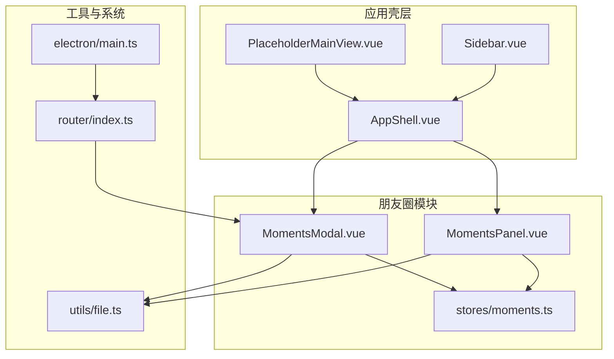
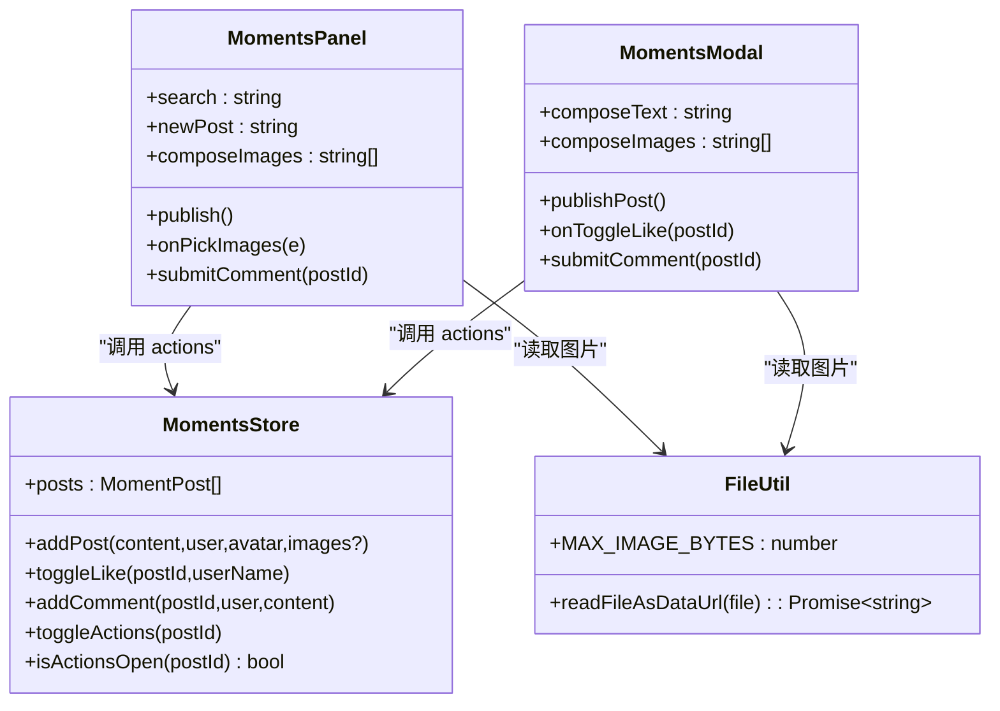
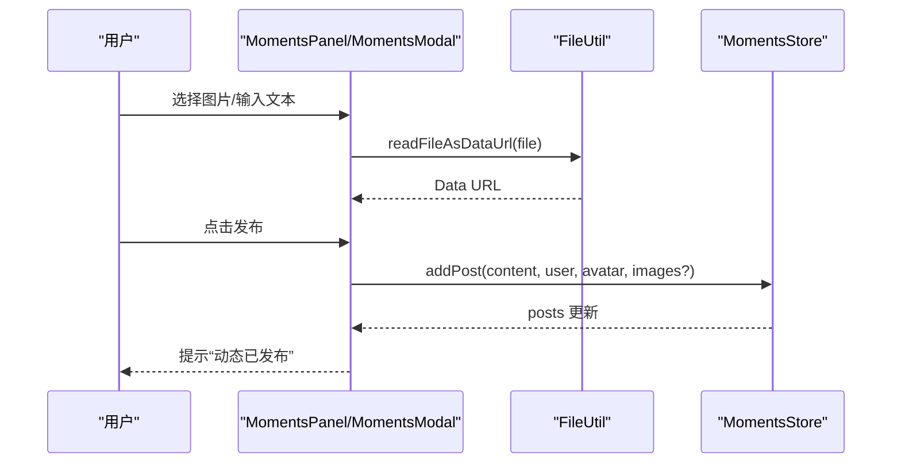
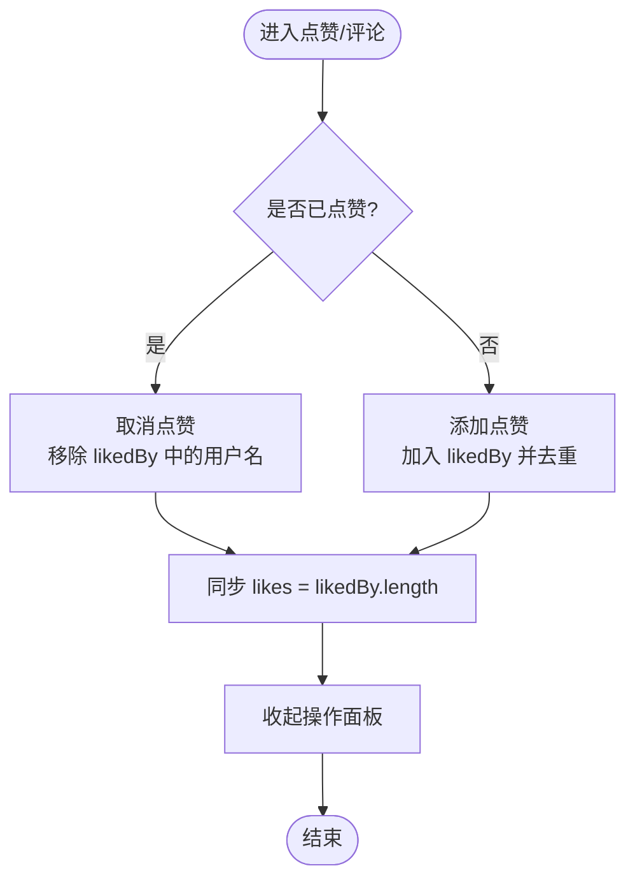
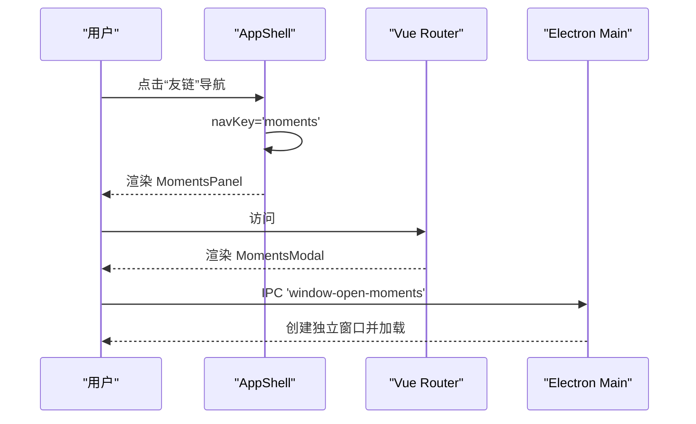
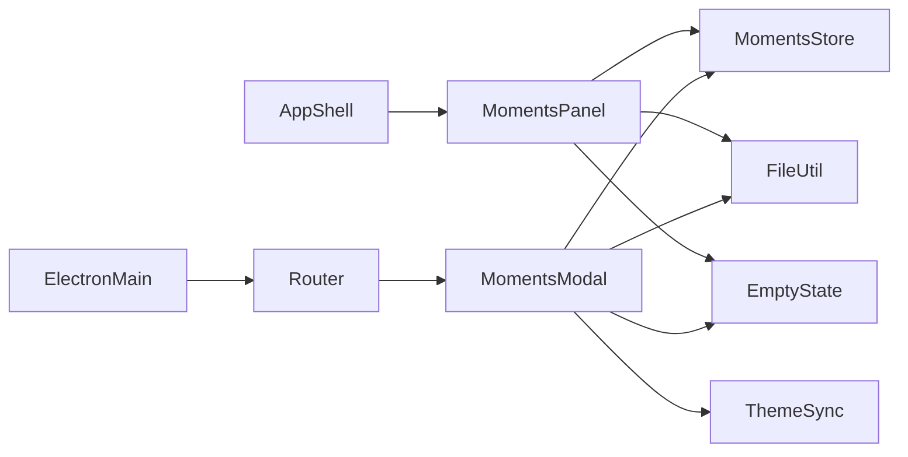

# 朋友圈面板 MomentsPanel

<cite>
**本文引用的文件**   
- [MomentsPanel.vue](file://linkx-client/src/components/MomentsPanel.vue)
- [moments.ts](file://linkx-client/src/stores/moments.ts)
- [file.ts](file://linkx-client/src/utils/file.ts)
- [AppShell.vue](file://linkx-client/src/components/AppShell.vue)
- [router/index.ts](file://linkx-client/src/router/index.ts)
- [electron/main.ts](file://linkx-client/electron/main.ts)
</cite>

## 目录
1. [简介](#简介)
2. [项目结构](#项目结构)
3. [核心组件与数据流](#核心组件与数据流)
4. [架构总览](#架构总览)
5. [详细组件分析](#详细组件分析)
6. [依赖关系分析](#依赖关系分析)
7. [性能与优化建议](#性能与优化建议)
8. [故障排查指南](#故障排查指南)
9. [结论](#结论)
10. [附录：交互设计与后端对接指南](#附录交互设计与后端对接指南)

## 简介
本文件为“朋友圈面板”功能模块的完整技术文档，聚焦于 MomentsPanel 组件及其相关 Store、工具函数与集成方式。内容涵盖动态展示、点赞评论互动、图片预览与上传限制、搜索过滤、持久化存储、独立窗口模式与侧栏内嵌模式等能力，并提供用户交互设计要点与后端接口对接建议（概念性说明）。

## 项目结构
- 前端侧栏内嵌版：在应用主壳层中通过导航键渲染 MomentsPanel，作为中间列表或右侧占位视图的一部分。
- 独立窗口版：通过路由 /moments 打开 MomentsModal，提供全屏/独立窗口的朋友圈体验。
- 状态管理：使用 Pinia 的 moments store 维护动态列表、点赞与评论等状态，并支持本地持久化。
- 媒体处理：基于浏览器 FileReader 将图片转为 Data URL 进行本地预览与持久化，内置大小限制。

图表来源
- [AppShell.vue:138-166](file://linkx-client/src/components/AppShell.vue#L138-L166)
- [router/index.ts:16-20](file://linkx-client/src/router/index.ts#L16-L20)
- [electron/main.ts:245-288](file://linkx-client/electron/main.ts#L245-L288)

章节来源
- [AppShell.vue:138-166](file://linkx-client/src/components/AppShell.vue#L138-L166)
- [router/index.ts:16-20](file://linkx-client/src/router/index.ts#L16-L20)
- [electron/main.ts:245-288](file://linkx-client/electron/main.ts#L245-L288)

## 核心组件与数据流
- 组件职责
  - MomentsPanel：侧栏内嵌的朋友圈面板，负责发布、点赞、评论、图片选择与预览、搜索过滤。
  - MomentsModal：独立窗口版朋友圈，具备封面、顶部渐变标题栏、搜索、刷新、最小化/关闭等能力。
  - moments store：集中管理 posts 列表、点赞与评论操作，以及 UI 展开状态；支持持久化 posts。
  - file 工具：提供图片读取为 Data URL 与大小限制常量。
- 数据流
  - 用户在 MomentsPanel/MomentsModal 触发发布、点赞、评论等操作。
  - 调用 moments store 的 actions 更新 posts 与 likedBy/comments 等字段。
  - 组件根据响应式数据自动重渲染。
  - posts 通过 Pinia persist 配置写入本地存储，实现刷新不丢失。

章节来源
- [MomentsPanel.vue:1-112](file://linkx-client/src/components/MomentsPanel.vue#L1-L112)
- [moments.ts:73-166](file://linkx-client/src/stores/moments.ts#L73-L166)
- [file.ts:1-30](file://linkx-client/src/utils/file.ts#L1-L30)

## 架构总览
下图展示了 MomentsPanel 与相关模块的交互关系，包括组件、Store、工具与系统集成点。

图表来源
- [MomentsPanel.vue:1-112](file://linkx-client/src/components/MomentsPanel.vue#L1-L112)
- [MomentsModal.vue:1-206](file://linkx-client/src/components/MomentsModal.vue#L1-L206)
- [moments.ts:73-166](file://linkx-client/src/stores/moments.ts#L73-L166)
- [file.ts:1-30](file://linkx-client/src/utils/file.ts#L1-L30)

## 详细组件分析

### 数据模型与持久化
- 单条评论 MomentComment
  - id: 字符串标识
  - user: 评论者昵称
  - content: 评论内容
- 单条动态 MomentPost
  - id: 动态标识
  - user: 发布者昵称
  - avatar: 头像 URL
  - content: 文字内容
  - images?: 可选图片 URL 列表（Data URL）
  - time: 相对时间标签
  - likes: 点赞数（与 likedBy 长度同步）
  - liked: 当前用户是否已赞
  - likedBy: 点赞用户昵称列表
  - comments: 评论列表
- 持久化策略
  - 仅持久化 posts 字段，UI 展开状态不持久化。
  - 通过 Pinia persist 配置 key 与 paths 控制。

章节来源
- [moments.ts:10-28](file://linkx-client/src/stores/moments.ts#L10-L28)
- [moments.ts:160-166](file://linkx-client/src/stores/moments.ts#L160-L166)

### 动态发布流程
- 输入校验
  - 文本为空且无图片时提示不可空。
- 图片选择
  - 最多 9 张，单张不超过 2MB，失败或超限给出提示。
  - 使用 FileReader 读取为 Data URL 用于本地预览与持久化。
- 发布动作
  - 调用 addPost 插入到列表头部，设置时间为“刚刚”，清空输入区并提示成功。

图表来源
- [MomentsPanel.vue:59-101](file://linkx-client/src/components/MomentsPanel.vue#L59-L101)
- [MomentsModal.vue:111-154](file://linkx-client/src/components/MomentsModal.vue#L111-L154)
- [file.ts:19-26](file://linkx-client/src/utils/file.ts#L19-L26)
- [moments.ts:88-101](file://linkx-client/src/stores/moments.ts#L88-L101)

章节来源
- [MomentsPanel.vue:59-101](file://linkx-client/src/components/MomentsPanel.vue#L59-L101)
- [MomentsModal.vue:111-154](file://linkx-client/src/components/MomentsModal.vue#L111-L154)
- [file.ts:19-26](file://linkx-client/src/utils/file.ts#L19-L26)
- [moments.ts:88-101](file://linkx-client/src/stores/moments.ts#L88-L101)

### 点赞与评论互动
- 点赞
  - toggleLike 切换 liked 状态，维护 likedBy 去重，并同步 likes 计数。
  - 操作后收起操作面板。
- 评论
  - addComment 向目标动态追加评论，清空草稿并提示成功。
  - 评论输入框可回车提交。

图表来源
- [moments.ts:108-124](file://linkx-client/src/stores/moments.ts#L108-L124)

章节来源
- [moments.ts:108-141](file://linkx-client/src/stores/moments.ts#L108-L141)
- [MomentsPanel.vue:169-186](file://linkx-client/src/components/MomentsPanel.vue#L169-L186)
- [MomentsModal.vue:162-181](file://linkx-client/src/components/MomentsModal.vue#L162-L181)

### 图片预览与上传限制
- 最大数量：9 张
- 单张上限：2MB（超过则跳过并提示）
- 读取方式：FileReader 转 Data URL，便于本地预览与持久化
- 错误处理：读取失败提示具体文件名

章节来源
- [MomentsPanel.vue:59-78](file://linkx-client/src/components/MomentsPanel.vue#L59-L78)
- [MomentsModal.vue:111-131](file://linkx-client/src/components/MomentsModal.vue#L111-L131)
- [file.ts:19-30](file://linkx-client/src/utils/file.ts#L19-L30)

### 搜索与过滤
- 支持按用户昵称与内容关键词过滤
- 侧栏版使用 PanelSearchBar 绑定 search
- 独立窗口版提供顶部搜索切换与实时过滤

章节来源
- [MomentsPanel.vue:36-56](file://linkx-client/src/components/MomentsPanel.vue#L36-L56)
- [MomentsModal.vue:68-75](file://linkx-client/src/components/MomentsModal.vue#L68-L75)

### 页面集成与窗口模式
- 侧栏内嵌模式
  - AppShell 根据 navKey 渲染 MomentsPanel
- 独立窗口模式
  - 路由 /moments 指向 MomentsModal
  - Electron main 监听 IPC 事件创建独立窗口并加载对应路由

图表来源
- [AppShell.vue:138-166](file://linkx-client/src/components/AppShell.vue#L138-L166)
- [router/index.ts:16-20](file://linkx-client/src/router/index.ts#L16-L20)
- [electron/main.ts:287-288](file://linkx-client/electron/main.ts#L287-L288)

章节来源
- [AppShell.vue:138-166](file://linkx-client/src/components/AppShell.vue#L138-L166)
- [router/index.ts:16-20](file://linkx-client/src/router/index.ts#L16-L20)
- [electron/main.ts:245-288](file://linkx-client/electron/main.ts#L245-L288)

## 依赖关系分析
- 组件依赖
  - MomentsPanel 依赖：Pinia store、Naive UI 组件、图标库、工具函数、通用组件（EmptyState、PanelSearchBar、Avatar）
  - MomentsModal 依赖：主题同步工具、聊天弹窗状态、应用全局状态、文件工具、空状态组件
- 外部依赖
  - Vue 3 组合式 API
  - Naive UI 组件库
  - Ionicons5 图标
  - Pinia 状态管理与持久化插件
  - Electron IPC（独立窗口场景）

图表来源
- [MomentsPanel.vue:1-22](file://linkx-client/src/components/MomentsPanel.vue#L1-L22)
- [MomentsModal.vue:1-33](file://linkx-client/src/components/MomentsModal.vue#L1-L33)
- [AppShell.vue:138-166](file://linkx-client/src/components/AppShell.vue#L138-L166)
- [router/index.ts:16-20](file://linkx-client/src/router/index.ts#L16-L20)
- [electron/main.ts:287-288](file://linkx-client/electron/main.ts#L287-L288)

章节来源
- [MomentsPanel.vue:1-22](file://linkx-client/src/components/MomentsPanel.vue#L1-L22)
- [MomentsModal.vue:1-33](file://linkx-client/src/components/MomentsModal.vue#L1-L33)
- [AppShell.vue:138-166](file://linkx-client/src/components/AppShell.vue#L138-L166)
- [router/index.ts:16-20](file://linkx-client/src/router/index.ts#L16-L20)
- [electron/main.ts:287-288](file://linkx-client/electron/main.ts#L287-L288)

## 性能与优化建议
- 图片体积与内存
  - 当前采用 Data URL 本地预览与持久化，适合小图；大图会显著增加 localStorage 占用与渲染开销。
  - 建议：对图片进行压缩与缩略图生成，优先上传至对象存储返回 CDN URL，本地仅缓存缩略图。
- 列表渲染
  - 当前 posts 全量渲染；当数据增长后可引入虚拟滚动或分页加载以减少 DOM 节点数量。
- 网络请求
  - 当前为纯前端演示逻辑；接入后端后应增加请求节流、重试与错误降级策略。
- 主题与样式
  - 独立窗口模式下主题同步已在挂载与 watch 中处理，避免闪烁与不一致。

[本节为通用性能建议，不直接分析具体文件]

## 故障排查指南
- 图片无法预览
  - 检查文件大小是否超过 2MB 限制；查看控制台是否有 FileReader 错误。
- 发布失败或无提示
  - 确认输入是否为空；检查消息提示实例是否正确初始化。
- 点赞/评论未生效
  - 检查 store 方法是否被正确调用；确认 postId 与当前用户昵称参数传递无误。
- 独立窗口无法打开
  - 检查 Electron main 是否监听 IPC 事件；确认路由路径与 hash 模式配置。

章节来源
- [MomentsPanel.vue:59-101](file://linkx-client/src/components/MomentsPanel.vue#L59-L101)
- [moments.ts:108-141](file://linkx-client/src/stores/moments.ts#L108-L141)
- [electron/main.ts:287-288](file://linkx-client/electron/main.ts#L287-L288)

## 结论
MomentsPanel 与 MomentsModal 共同构成朋友圈功能的两种呈现形态：侧栏内嵌与独立窗口。两者共享同一套数据模型与业务逻辑（点赞、评论、发布），并通过 Pinia 实现状态管理与本地持久化。当前实现以本地演示为主，后续可按需扩展分页加载、服务端存储、审核机制与实时通知等能力。

[本节为总结性内容，不直接分析具体文件]

## 附录：交互设计与后端对接指南

### 用户交互设计要点
- 发布器
  - 支持多行文本与多图（最多 9 张），单张上限 2MB；发布前进行非空校验。
- 互动区
  - 点赞按钮即时反馈，显示点赞人数与点赞用户列表；评论输入框支持回车提交。
- 搜索
  - 支持按用户与内容关键词过滤；独立窗口提供顶部搜索切换与透明背景随滚动变化。
- 窗口行为
  - 独立窗口支持最小化与关闭；浏览器环境下以全屏遮罩形式展示。

章节来源
- [MomentsPanel.vue:114-191](file://linkx-client/src/components/MomentsPanel.vue#L114-L191)
- [MomentsModal.vue:208-341](file://linkx-client/src/components/MomentsModal.vue#L208-L341)

### 后端接口对接建议（概念性）
- 认证与会话
  - 使用 JWT 或会话令牌保护接口；登录态失效时引导重新登录。
- 动态列表
  - GET /api/moments?page&size&keyword：分页获取动态列表，支持关键词过滤。
- 发布动态
  - POST /api/moments：提交文本与图片（建议先上传图片，再提交图片 URL 列表）。
- 点赞
  - POST /api/moments/:id/like：切换点赞状态。
- 评论
  - POST /api/moments/:id/comment：提交评论内容。
- 媒体处理
  - 图片上传：POST /api/upload/image，返回 CDN URL；服务端进行格式、大小与恶意内容检测。
- 审核机制
  - 异步审核队列：敏感词/图像识别；违规内容标记并延迟展示，管理员后台处理。
- 社交关系链
  - 基于好友关系过滤可见范围；支持隐私分组与黑名单。
- 实时通知
  - WebSocket 推送新评论、点赞提醒；客户端合并去重并更新 UI。

[本节为概念性对接指南，不直接分析具体文件]