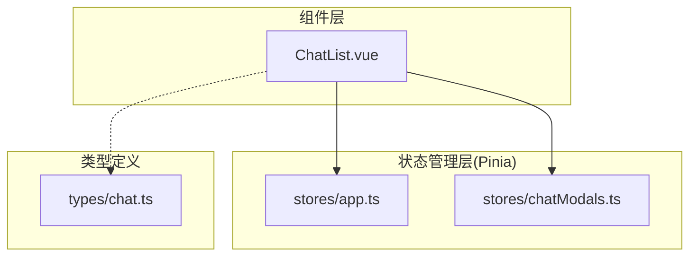
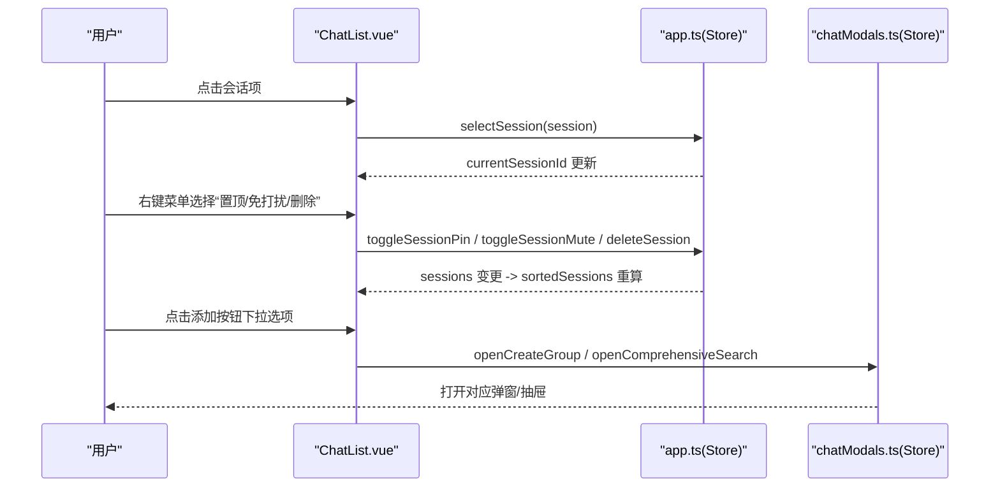
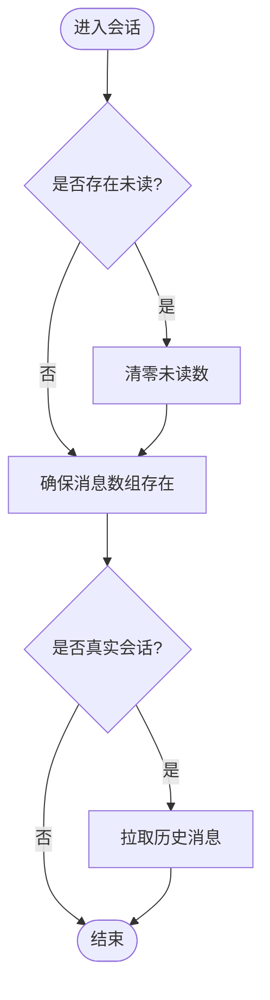
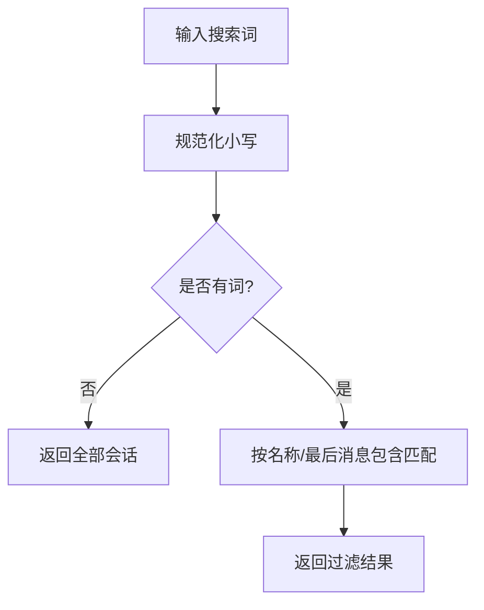
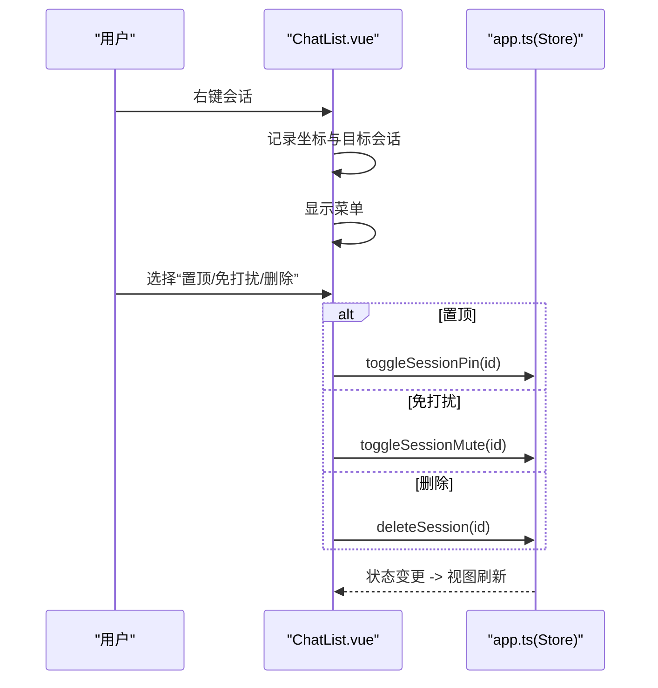
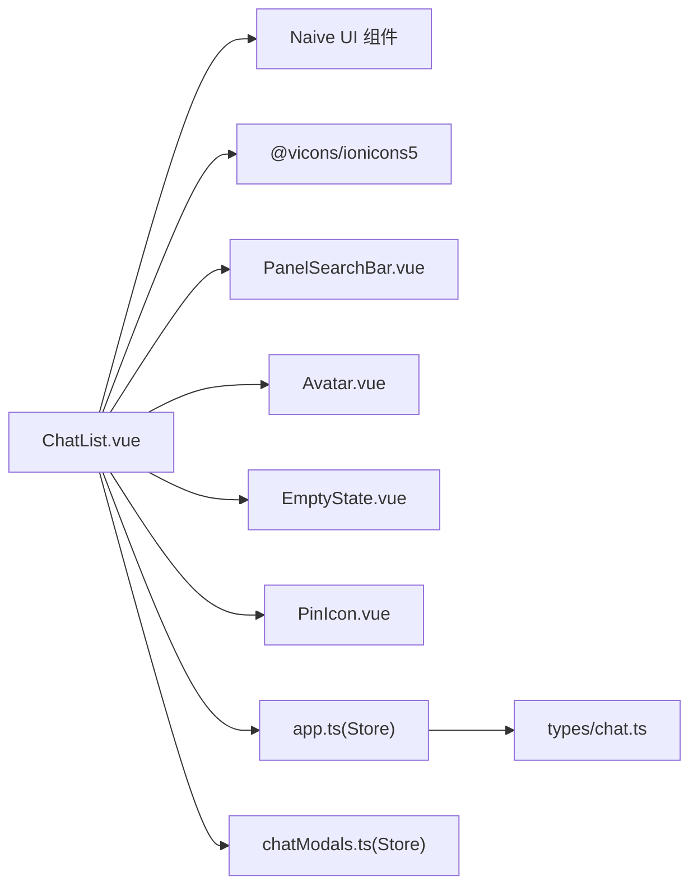

# 聊天列表组件 ChatList

<cite>
**本文引用的文件**   
- [ChatList.vue](file://linkx-client/src/components/ChatList.vue)
- [app.ts](file://linkx-client/src/stores/app.ts)
- [chatModals.ts](file://linkx-client/src/stores/chatModals.ts)
- [chat.ts](file://linkx-client/src/types/chat.ts)
</cite>

## 目录
1. [简介](#简介)
2. [项目结构](#项目结构)
3. [核心组件](#核心组件)
4. [架构总览](#架构总览)
5. [详细组件分析](#详细组件分析)
6. [依赖关系分析](#依赖关系分析)
7. [性能考量](#性能考量)
8. [故障排查指南](#故障排查指南)
9. [结论](#结论)
10. [附录：使用与扩展示例](#附录使用与扩展示例)

## 简介
本技术文档围绕聊天列表组件 ChatList，系统性解析其数据管理、虚拟滚动实现、搜索过滤、右键菜单操作、会话排序（置顶优先）、未读消息计数逻辑、离线状态检测与骨架屏加载机制。同时说明与 Pinia 状态管理的集成方式、事件处理流程以及性能优化策略，并提供完整的使用示例与自定义扩展指导，帮助开发者快速理解并高效扩展该组件。

## 项目结构
ChatList 位于前端客户端的 components 目录下，负责会话列表的展示与交互；其数据来源于应用级 Store app，弹窗与抽屉等 UI 状态由 chatModals 统一管理；类型定义集中在 types 模块中。

图表来源
- [ChatList.vue:1-120](file://linkx-client/src/components/ChatList.vue#L1-L120)
- [app.ts:128-188](file://linkx-client/src/stores/app.ts#L128-L188)
- [chatModals.ts:12-35](file://linkx-client/src/stores/chatModals.ts#L12-L35)
- [chat.ts:1-57](file://linkx-client/src/types/chat.ts#L1-L57)

章节来源
- [ChatList.vue:1-120](file://linkx-client/src/components/ChatList.vue#L1-L120)
- [app.ts:128-188](file://linkx-client/src/stores/app.ts#L128-L188)
- [chatModals.ts:12-35](file://linkx-client/src/stores/chatModals.ts#L12-L35)
- [chat.ts:1-57](file://linkx-client/src/types/chat.ts#L1-L57)

## 核心组件
- 会话列表渲染：基于 Naive UI 的 NVirtualList 实现虚拟滚动，固定行高 item-size=68，按 id 作为唯一键。
- 搜索过滤：通过 computed 计算 filteredSessions，支持对会话名称与最后消息进行大小写不敏感匹配。
- 右键菜单：手动定位的 NDropdown，提供“置顶/取消置顶”、“免打扰/取消免打扰”、“删除会话”三项操作。
- 离线提示：当 isOffline 为真时显示横幅提示。
- 骨架屏加载：isLoading 为真时渲染占位骨架项。
- 未读角标：根据 session.unread 与 session.muted 控制是否显示及数值上限 99+。

章节来源
- [ChatList.vue:54-72](file://linkx-client/src/components/ChatList.vue#L54-L72)
- [ChatList.vue:125-226](file://linkx-client/src/components/ChatList.vue#L125-L226)
- [ChatList.vue:162-211](file://linkx-client/src/components/ChatList.vue#L162-L211)
- [ChatList.vue:137-140](file://linkx-client/src/components/ChatList.vue#L137-L140)
- [ChatList.vue:145-153](file://linkx-client/src/components/ChatList.vue#L145-L153)
- [ChatList.vue:183-185](file://linkx-client/src/components/ChatList.vue#L183-L185)

## 架构总览
ChatList 通过 storeToRefs 订阅 appStore 的 sortedSessions、currentSessionId、isLoading、isOffline，并调用 appStore 暴露的 selectSession、toggleSessionPin、toggleSessionMute、deleteSession 等方法完成交互。创建群聊与综合搜索通过 chatModalsStore 的 openCreateGroup、openComprehensiveSearch 触发。

图表来源
- [ChatList.vue:80-94](file://linkx-client/src/components/ChatList.vue#L80-L94)
- [ChatList.vue:106-122](file://linkx-client/src/components/ChatList.vue#L106-L122)
- [app.ts:211-247](file://linkx-client/src/stores/app.ts#L211-L247)
- [chatModals.ts:74-85](file://linkx-client/src/stores/chatModals.ts#L74-L85)

## 详细组件分析

### 数据管理与排序算法
- 数据来源：appStore.sessions 维护所有会话对象；sortedSessions 为只读 getter，将 pinned=true 的会话排在前面，其余保持原序。
- 选中会话：selectSession 会清空目标会话未读数，确保 messagesBySession 存在，并对真实会话触发历史消息拉取。
- 新增/加入会话：ensureSession 保证会话唯一性，必要时插入到列表顶部并选中。
- 删除会话：deleteSession 从 sessions 移除并清理对应消息映射，若删除当前会话则自动切换到首个会话。

图表来源
- [app.ts:211-224](file://linkx-client/src/stores/app.ts#L211-L224)
- [app.ts:231-247](file://linkx-client/src/stores/app.ts#L231-L247)
- [app.ts:558-564](file://linkx-client/src/stores/app.ts#L558-L564)

章节来源
- [app.ts:176-183](file://linkx-client/src/stores/app.ts#L176-L183)
- [app.ts:211-247](file://linkx-client/src/stores/app.ts#L211-L247)
- [app.ts:558-564](file://linkx-client/src/stores/app.ts#L558-L564)

### 虚拟滚动实现
- 使用 NVirtualList 渲染 filteredSessions，item-key=id，item-size=68，容器高度自适应父级。
- 优势：在大量会话场景下仅渲染可视区域节点，显著降低 DOM 节点数量与重排开销。

章节来源
- [ChatList.vue:162-211](file://linkx-client/src/components/ChatList.vue#L162-L211)

### 搜索过滤功能
- 通过 ref 保存 searchValue，computed 生成 filteredSessions。
- 过滤规则：当关键词非空时，匹配会话 name 或 lastMessage 的小写版本。

图表来源
- [ChatList.vue:54-60](file://linkx-client/src/components/ChatList.vue#L54-L60)

章节来源
- [ChatList.vue:54-60](file://linkx-client/src/components/ChatList.vue#L54-L60)

### 右键菜单操作
- 右键事件 onSessionContext 记录目标会话与坐标，显示 NDropdown。
- 菜单项动态生成 contextMenuOptions，依据当前会话的 pinned/muted 状态切换文案。
- 操作回调：
  - pin：调用 toggleSessionPin，改变置顶状态并给出成功提示。
  - mute：调用 toggleSessionMute，切换免打扰并提示。
  - delete：调用 deleteSession，删除会话并提示。

图表来源
- [ChatList.vue:97-122](file://linkx-client/src/components/ChatList.vue#L97-L122)
- [app.ts:543-552](file://linkx-client/src/stores/app.ts#L543-L552)
- [app.ts:558-564](file://linkx-client/src/stores/app.ts#L558-L564)

章节来源
- [ChatList.vue:63-72](file://linkx-client/src/components/ChatList.vue#L63-L72)
- [ChatList.vue:97-122](file://linkx-client/src/components/ChatList.vue#L97-L122)
- [app.ts:543-552](file://linkx-client/src/stores/app.ts#L543-L552)
- [app.ts:558-564](file://linkx-client/src/stores/app.ts#L558-L564)

### 未读消息计数逻辑
- 进入会话时清零未读：selectSession 中对目标会话 unread 置零。
- 收到新消息时递增：handleIncomingWsMessage 在非当前会话且未开启免打扰时 unread+1。
- 模拟消息也遵循相同规则：simulateIncomingMessage 仅在非免打扰时增加未读。

章节来源
- [app.ts:211-224](file://linkx-client/src/stores/app.ts#L211-L224)
- [app.ts:479-501](file://linkx-client/src/stores/app.ts#L479-L501)
- [app.ts:1091-1134](file://linkx-client/src/stores/app.ts#L1091-L1134)

### 离线状态检测
- WebSocket 连接生命周期：connectChatWebSocket 监听 onOpen/onClose/onError，设置 isOffline 标志。
- 组件层面：当 isOffline 为真时，渲染离线横幅提示。

章节来源
- [app.ts:448-476](file://linkx-client/src/stores/app.ts#L448-L476)
- [ChatList.vue:137-140](file://linkx-client/src/components/ChatList.vue#L137-L140)

### 骨架屏加载机制
- isLoading 为真时渲染若干骨架项，模拟头像、标题与描述占位。
- 适用于登录、初始化等异步阶段，提升首屏体验。

章节来源
- [ChatList.vue:145-153](file://linkx-client/src/components/ChatList.vue#L145-L153)

### Pinia 状态管理集成
- 读取：storeToRefs(appStore) 解构 sortedSessions、currentSessionId、isLoading、isOffline。
- 写入：调用 appStore 的 selectSession、toggleSessionPin、toggleSessionMute、deleteSession。
- 弹窗联动：通过 chatModalsStore 的 openCreateGroup、openComprehensiveSearch 触发展示。

章节来源
- [ChatList.vue:24-43](file://linkx-client/src/components/ChatList.vue#L24-L43)
- [ChatList.vue:80-94](file://linkx-client/src/components/ChatList.vue#L80-L94)
- [chatModals.ts:74-85](file://linkx-client/src/stores/chatModals.ts#L74-L85)

### 事件处理流程
- 点击会话：onSelect -> selectSession。
- 右键菜单：onSessionContext -> 显示菜单 -> onContextMenuSelect -> 执行具体动作。
- 添加按钮：onAddSelect -> openCreateGroup/openComprehensiveSearch。

章节来源
- [ChatList.vue:80-94](file://linkx-client/src/components/ChatList.vue#L80-L94)
- [ChatList.vue:97-122](file://linkx-client/src/components/ChatList.vue#L97-L122)

## 依赖关系分析
- 组件依赖：
  - Naive UI：NIcon、NSkeleton、NDropdown、NVirtualList、useMessage。
  - 图标库：@vicons/ionicons5。
  - 内部组件：PanelSearchBar、Avatar、EmptyState、PinIcon。
- 状态依赖：
  - appStore：会话数据、排序、选中态、加载与离线状态、操作方法。
  - chatModalsStore：弹窗开关与位置。
- 类型依赖：
  - ChatSession 来自 types/index（被 ChatList.vue 引用）。
  - MessageItem 用于 WS 消息处理（app.ts 中使用）。

图表来源
- [ChatList.vue:10-22](file://linkx-client/src/components/ChatList.vue#L10-L22)
- [app.ts:128-188](file://linkx-client/src/stores/app.ts#L128-L188)
- [chatModals.ts:12-35](file://linkx-client/src/stores/chatModals.ts#L12-L35)
- [chat.ts:1-57](file://linkx-client/src/types/chat.ts#L1-L57)

章节来源
- [ChatList.vue:10-22](file://linkx-client/src/components/ChatList.vue#L10-L22)
- [app.ts:128-188](file://linkx-client/src/stores/app.ts#L128-L188)
- [chatModals.ts:12-35](file://linkx-client/src/stores/chatModals.ts#L12-L35)
- [chat.ts:1-57](file://linkx-client/src/types/chat.ts#L1-L57)

## 性能考量
- 虚拟滚动：NVirtualList 固定行高与 key 稳定，避免不必要的重渲染。
- 计算属性缓存：filteredSessions 基于 searchValue 与 sortedSessions 计算，减少重复过滤。
- 最小化 DOM：骨架屏仅在加载中渲染固定数量占位项。
- 未读增量：仅在非当前会话且未免打扰时累加，避免无意义更新。
- 建议优化：
  - 对长列表可考虑更细粒度的 item-key 与 memoization。
  - 搜索时可引入防抖以减少频繁计算。
  - 对于超大会话数，可对 filteredSessions 做分页或懒加载。

[本节为通用性能建议，无需源码引用]

## 故障排查指南
- 右键菜单不出现：检查 onSessionContext 是否正确阻止默认行为并设置坐标；确认 NDropdown 的 show/x/y/options 绑定正确。
- 未读数不更新：确认 handleIncomingWsMessage 与 simulateIncomingMessage 中的 muted 判断逻辑；检查 selectSession 是否在进入会话后清零未读。
- 离线横幅不显示：确认 WebSocket onClose 是否设置 isOffline=true；组件模板中 v-if="isOffline" 条件是否生效。
- 骨架屏异常：检查 isLoading 状态流转，确保在合适时机置 true/false。

章节来源
- [ChatList.vue:97-103](file://linkx-client/src/components/ChatList.vue#L97-L103)
- [ChatList.vue:137-140](file://linkx-client/src/components/ChatList.vue#L137-L140)
- [ChatList.vue:145-153](file://linkx-client/src/components/ChatList.vue#L145-L153)
- [app.ts:448-476](file://linkx-client/src/stores/app.ts#L448-L476)
- [app.ts:479-501](file://linkx-client/src/stores/app.ts#L479-L501)
- [app.ts:211-224](file://linkx-client/src/stores/app.ts#L211-L224)

## 结论
ChatList 以简洁清晰的职责划分实现了高效的会话列表展示与交互：通过 Pinia 集中管理数据与状态，借助 NVirtualList 保障大列表性能，配合搜索过滤与右键菜单增强用户体验。结合离线提示与骨架屏，整体具备较好的可用性与可扩展性。

[本节为总结性内容，无需源码引用]

## 附录：使用与扩展示例

### 基本用法
- 在页面中直接引入并使用 ChatList 组件即可，无需额外配置。
- 组件会自动从 appStore 获取会话数据并进行渲染。

章节来源
- [ChatList.vue:125-226](file://linkx-client/src/components/ChatList.vue#L125-L226)

### 自定义扩展
- 扩展右键菜单：
  - 在 contextMenuOptions 中添加新的 DropdownOption。
  - 在 onContextMenuSelect 中处理新 key 的逻辑，例如“屏蔽/取消屏蔽”。
- 扩展搜索维度：
  - 在 filteredSessions 的计算中加入更多字段匹配，如 peerUsername、peerNickname 等。
- 扩展未读样式：
  - 调整 unread-badge 的 CSS 样式，或根据业务需求限制最大显示值。

章节来源
- [ChatList.vue:63-72](file://linkx-client/src/components/ChatList.vue#L63-L72)
- [ChatList.vue:54-60](file://linkx-client/src/components/ChatList.vue#L54-L60)
- [ChatList.vue:288-305](file://linkx-client/src/components/ChatList.vue#L288-L305)

### 与后端数据对接
- 会话列表：loadChatSessions 从后端拉取 ConversationItem 并转换为 ChatSession。
- 历史消息：loadSessionMessages/loadMoreMessages 拉取 MessageItem 并转换为 ChatMessage。
- 实时消息：handleIncomingWsMessage/handleWsAck 处理 WebSocket 推送与确认。

章节来源
- [app.ts:350-362](file://linkx-client/src/stores/app.ts#L350-L362)
- [app.ts:365-414](file://linkx-client/src/stores/app.ts#L365-L414)
- [app.ts:479-523](file://linkx-client/src/stores/app.ts#L479-L523)
- [chat.ts:3-13](file://linkx-client/src/types/chat.ts#L3-L13)
- [chat.ts:15-28](file://linkx-client/src/types/chat.ts#L15-L28)