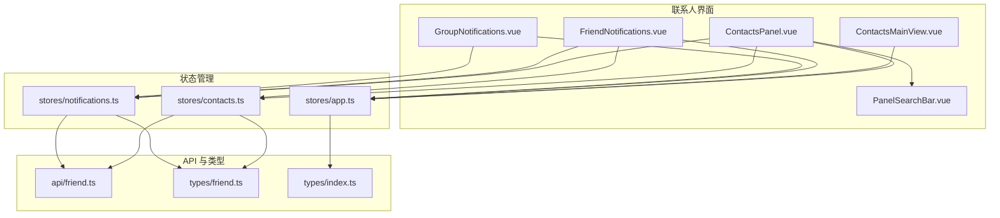
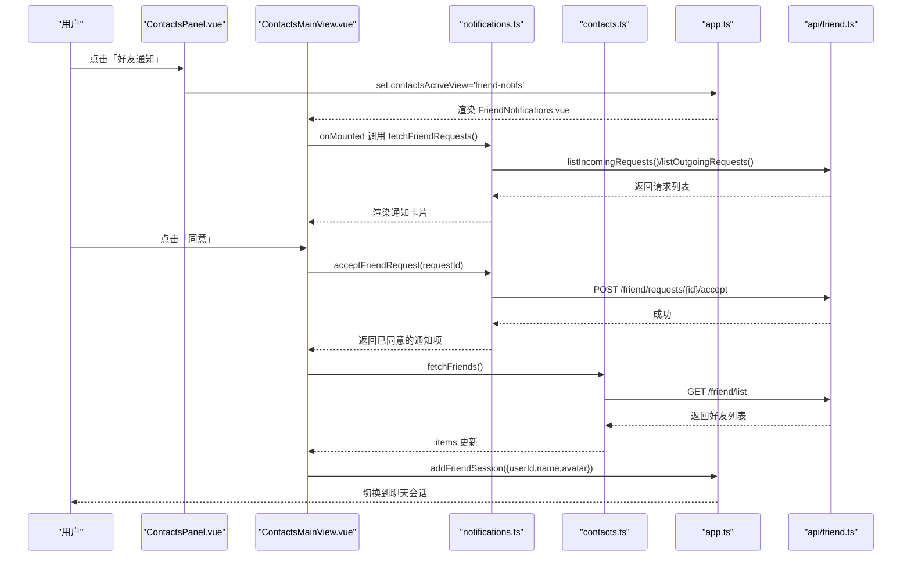
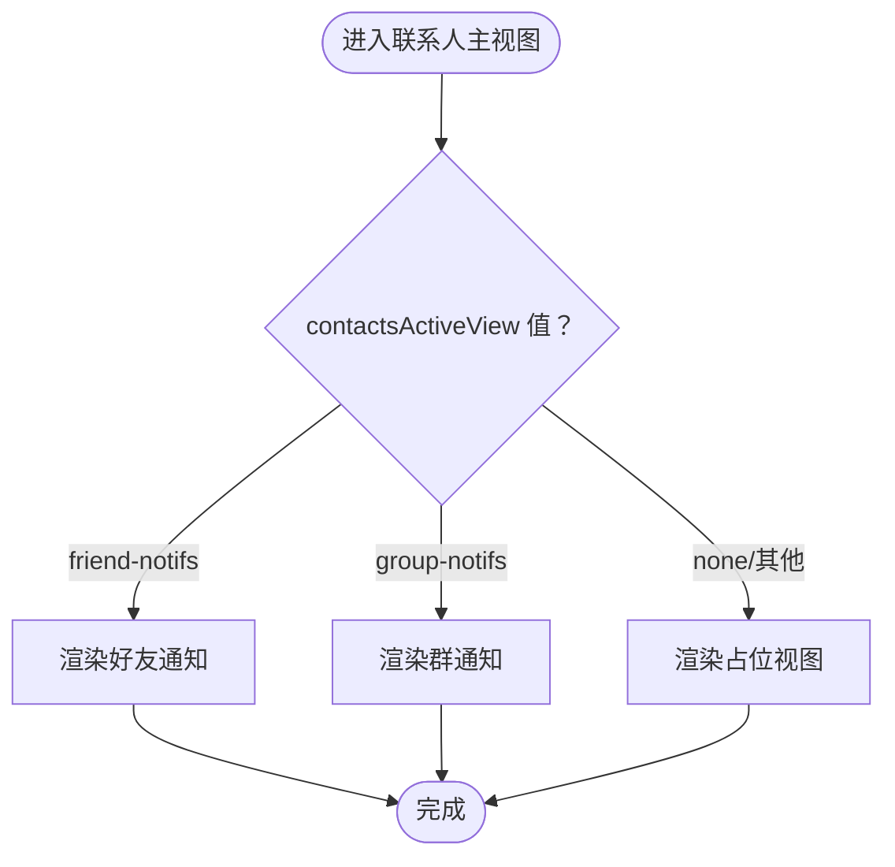
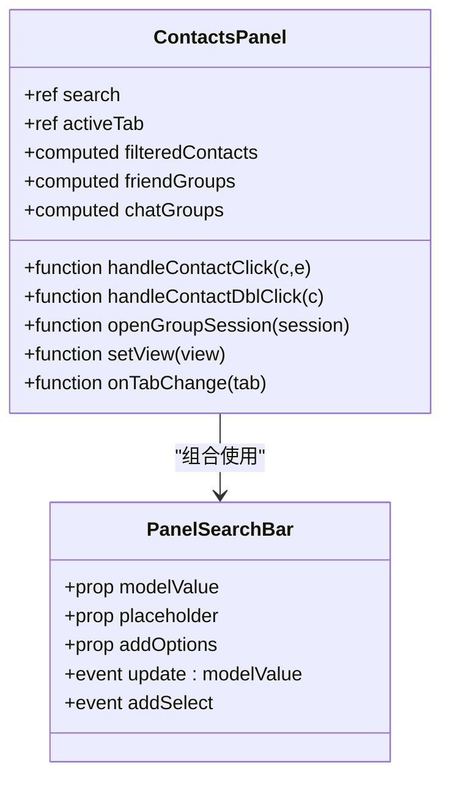
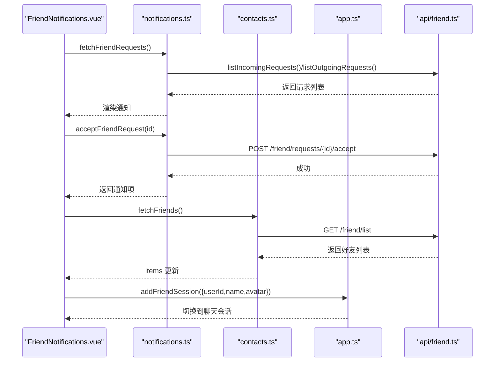
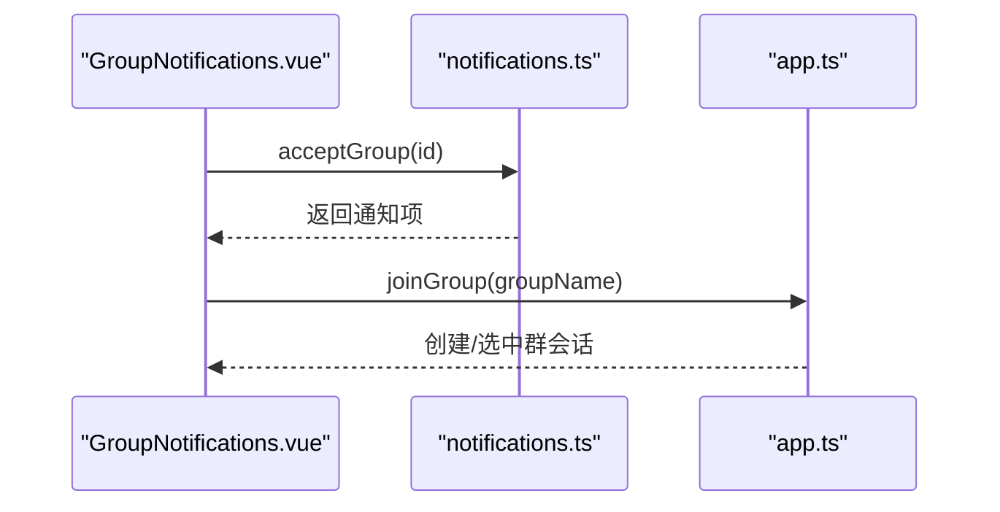
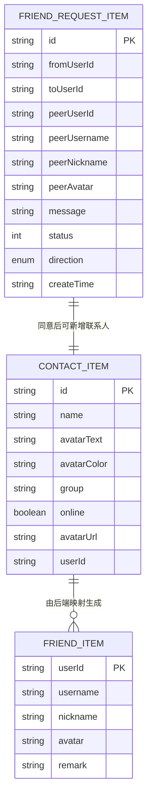
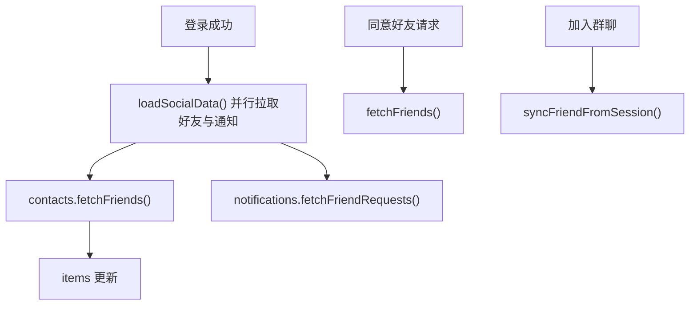
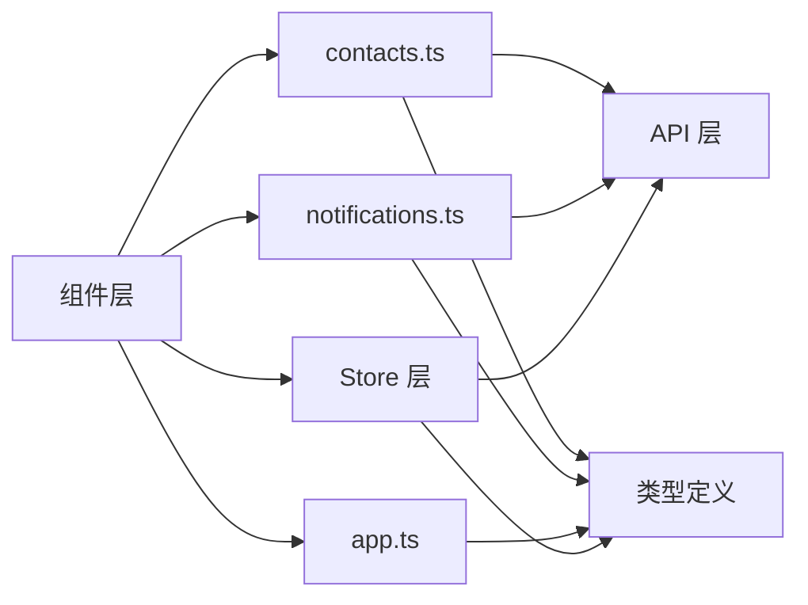

# 联系人主视图 ContactsMainView

<cite>
**本文引用的文件**   
- [ContactsMainView.vue](file://linkx-client/src/components/ContactsMainView.vue)
- [ContactsPanel.vue](file://linkx-client/src/components/ContactsPanel.vue)
- [FriendNotifications.vue](file://linkx-client/src/components/contacts/FriendNotifications.vue)
- [GroupNotifications.vue](file://linkx-client/src/components/contacts/GroupNotifications.vue)
- [contacts.ts](file://linkx-client/src/stores/contacts.ts)
- [notifications.ts](file://linkx-client/src/stores/notifications.ts)
- [app.ts](file://linkx-client/src/stores/app.ts)
- [friend.ts](file://linkx-client/src/api/friend.ts)
- [friend.ts（类型）](file://linkx-client/src/types/friend.ts)
- [index.ts（全局类型）](file://linkx-client/src/types/index.ts)
- [PanelSearchBar.vue](file://linkx-client/src/components/PanelSearchBar.vue)
</cite>

## 目录
1. [简介](#简介)
2. [项目结构](#项目结构)
3. [核心组件与职责](#核心组件与职责)
4. [架构总览](#架构总览)
5. [详细组件分析](#详细组件分析)
6. [依赖关系分析](#依赖关系分析)
7. [性能与体验优化](#性能与体验优化)
8. [故障排查指南](#故障排查指南)
9. [结论](#结论)
10. [附录：扩展开发指南](#附录扩展开发指南)

## 简介
本技术文档围绕联系人主视图组件 ContactsMainView，系统性梳理其右侧主视图的展示逻辑、左侧联系人面板的分组与在线状态显示、搜索过滤、批量操作入口、好友申请处理、群组管理集成以及权限控制实现。同时给出数据模型、关系映射与状态同步机制的深入解析，并提供完整工作流与扩展开发建议，帮助读者快速理解并在此基础上进行二次开发。

## 项目结构
联系人模块由“左侧面板 + 右侧主视图”构成：
- 左侧面板：ContactsPanel.vue，负责好友列表分组、群聊分组、搜索过滤、通知入口、会话选择等
- 右侧主视图：ContactsMainView.vue，根据 contactsActiveView 切换好友通知、群通知或占位视图
- 子视图：FriendNotifications.vue、GroupNotifications.vue，分别处理好友与群邀请的通知交互
- Store 层：contacts.ts（联系人数据）、notifications.ts（通知数据）、app.ts（全局导航与会话）
- API 层：friend.ts（好友相关接口封装）
- 类型定义：types/friend.ts、types/index.ts

图表来源
- [ContactsPanel.vue:1-140](file://linkx-client/src/components/ContactsPanel.vue#L1-L140)
- [ContactsMainView.vue:1-33](file://linkx-client/src/components/ContactsMainView.vue#L1-L33)
- [FriendNotifications.vue:1-64](file://linkx-client/src/components/contacts/FriendNotifications.vue#L1-L64)
- [GroupNotifications.vue:1-46](file://linkx-client/src/components/contacts/GroupNotifications.vue#L1-L46)
- [contacts.ts:1-128](file://linkx-client/src/stores/contacts.ts#L1-L128)
- [notifications.ts:1-176](file://linkx-client/src/stores/notifications.ts#L1-L176)
- [app.ts:130-210](file://linkx-client/src/stores/app.ts#L130-L210)
- [friend.ts:1-43](file://linkx-client/src/api/friend.ts#L1-L43)
- [friend.ts（类型）:1-38](file://linkx-client/src/types/friend.ts#L1-L38)
- [index.ts（全局类型）:85-96](file://linkx-client/src/types/index.ts#L85-L96)

章节来源
- [ContactsPanel.vue:1-140](file://linkx-client/src/components/ContactsPanel.vue#L1-L140)
- [ContactsMainView.vue:1-33](file://linkx-client/src/components/ContactsMainView.vue#L1-L33)
- [FriendNotifications.vue:1-64](file://linkx-client/src/components/contacts/FriendNotifications.vue#L1-L64)
- [GroupNotifications.vue:1-46](file://linkx-client/src/components/contacts/GroupNotifications.vue#L1-L46)
- [contacts.ts:1-128](file://linkx-client/src/stores/contacts.ts#L1-L128)
- [notifications.ts:1-176](file://linkx-client/src/stores/notifications.ts#L1-L176)
- [app.ts:130-210](file://linkx-client/src/stores/app.ts#L130-L210)
- [friend.ts:1-43](file://linkx-client/src/api/friend.ts#L1-L43)
- [friend.ts（类型）:1-38](file://linkx-client/src/types/friend.ts#L1-L38)
- [index.ts（全局类型）:85-96](file://linkx-client/src/types/index.ts#L85-L96)

## 核心组件与职责
- ContactsMainView.vue：右侧主视图容器，依据 contactsActiveView 渲染好友通知、群通知或默认占位视图
- ContactsPanel.vue：左侧联系人面板，提供好友/群聊分组、搜索过滤、通知入口、双击发起聊天、打开资料卡等
- FriendNotifications.vue：好友通知详情与处理（同意/拒绝），成功后刷新好友列表并创建会话
- GroupNotifications.vue：群邀请通知处理（同意/拒绝），同意后加入群聊
- contacts.ts：联系人数据模型、增删改查、从后端拉取、与聊天会话同步
- notifications.ts：好友/群通知数据与处理逻辑，含状态映射与持久化
- app.ts：全局导航与会话管理，包含通讯录子视图切换、会话选择、加入群聊、加好友后创建会话等
- friend.ts：好友相关 HTTP 接口封装（搜索、请求、接受/拒绝、列表、删除）
- types：ContactItem、FriendItem、FriendRequestItem 等类型定义

章节来源
- [ContactsMainView.vue:1-33](file://linkx-client/src/components/ContactsMainView.vue#L1-L33)
- [ContactsPanel.vue:1-140](file://linkx-client/src/components/ContactsPanel.vue#L1-L140)
- [FriendNotifications.vue:1-64](file://linkx-client/src/components/contacts/FriendNotifications.vue#L1-L64)
- [GroupNotifications.vue:1-46](file://linkx-client/src/components/contacts/GroupNotifications.vue#L1-L46)
- [contacts.ts:1-128](file://linkx-client/src/stores/contacts.ts#L1-L128)
- [notifications.ts:1-176](file://linkx-client/src/stores/notifications.ts#L1-L176)
- [app.ts:130-210](file://linkx-client/src/stores/app.ts#L130-L210)
- [friend.ts:1-43](file://linkx-client/src/api/friend.ts#L1-L43)
- [friend.ts（类型）:1-38](file://linkx-client/src/types/friend.ts#L1-L38)
- [index.ts（全局类型）:85-96](file://linkx-client/src/types/index.ts#L85-L96)

## 架构总览
联系人主视图采用“左面板 + 右主视图”的双栏布局，通过 Pinia Store 驱动 UI 状态，API 层负责与后端通信，类型系统保证数据结构一致性。

图表来源
- [ContactsPanel.vue:130-140](file://linkx-client/src/components/ContactsPanel.vue#L130-L140)
- [ContactsMainView.vue:25-32](file://linkx-client/src/components/ContactsMainView.vue#L25-L32)
- [FriendNotifications.vue:22-45](file://linkx-client/src/components/contacts/FriendNotifications.vue#L22-L45)
- [notifications.ts:104-144](file://linkx-client/src/stores/notifications.ts#L104-L144)
- [contacts.ts:103-115](file://linkx-client/src/stores/contacts.ts#L103-L115)
- [app.ts:335-337](file://linkx-client/src/stores/app.ts#L335-L337)
- [friend.ts:20-34](file://linkx-client/src/api/friend.ts#L20-L34)

## 详细组件分析

### 联系人主视图 ContactsMainView.vue
- 功能要点
  - 根据 contactsActiveView 条件渲染：好友通知、群通知或占位视图
  - 使用 storeToRefs 解构响应式引用，避免重复订阅
- 关键路径
  - 路由切换：当左侧面板设置 contactsActiveView 时，右侧自动切换对应子视图
  - 默认行为：未命中特定视图时渲染 PlaceholderMainView，并传入 navKey

图表来源
- [ContactsMainView.vue:25-32](file://linkx-client/src/components/ContactsMainView.vue#L25-L32)

章节来源
- [ContactsMainView.vue:1-33](file://linkx-client/src/components/ContactsMainView.vue#L1-L33)

### 联系人面板 ContactsPanel.vue
- 功能要点
  - 顶部搜索栏：支持关键词过滤联系人和群聊
  - 通知入口：好友通知（带未读计数）、群通知
  - Tab 切换：好友/群聊
  - 好友列表：分组为「我的好友」，显示在线状态与总数统计；虚拟滚动提升性能
  - 群聊列表：分组为「置顶群聊」「我加入的群聊」，按 pinned 排序
  - 交互：单击打开资料卡，双击发起单聊；选中群聊则重置右侧视图并选中会话
- 关键计算属性
  - filteredContacts：基于搜索词过滤联系人
  - friendGroups：仅「我的好友」分组，统计 online 与 total
  - chatGroups：筛选 isGroup 会话，按 pinned 分组，支持搜索过滤
- 关键方法
  - contactSessionId：将联系人映射到单聊会话 ID
  - openGroupSession：重置右侧视图并选中群会话
  - handleContactClick/handleContactDblClick：打开资料卡/发起聊天
  - setView/onTabChange：切换右侧视图与 Tab

图表来源
- [ContactsPanel.vue:73-140](file://linkx-client/src/components/ContactsPanel.vue#L73-L140)
- [PanelSearchBar.vue:1-87](file://linkx-client/src/components/PanelSearchBar.vue#L1-L87)

章节来源
- [ContactsPanel.vue:73-140](file://linkx-client/src/components/ContactsPanel.vue#L73-L140)
- [PanelSearchBar.vue:1-87](file://linkx-client/src/components/PanelSearchBar.vue#L1-L87)

### 好友通知 FriendNotifications.vue
- 功能要点
  - 加载好友请求（incoming/outgoing），渲染通知卡片
  - 同意/拒绝：调用通知 Store 的 accept/reject 方法，成功后刷新好友列表并创建会话
  - 清空通知：清空本地通知列表
- 错误处理
  - 捕获网络错误并提示用户

图表来源
- [FriendNotifications.vue:22-45](file://linkx-client/src/components/contacts/FriendNotifications.vue#L22-L45)
- [notifications.ts:104-144](file://linkx-client/src/stores/notifications.ts#L104-L144)
- [contacts.ts:103-115](file://linkx-client/src/stores/contacts.ts#L103-L115)
- [app.ts:335-337](file://linkx-client/src/stores/app.ts#L335-L337)
- [friend.ts:20-34](file://linkx-client/src/api/friend.ts#L20-L34)

章节来源
- [FriendNotifications.vue:1-64](file://linkx-client/src/components/contacts/FriendNotifications.vue#L1-L64)
- [notifications.ts:104-144](file://linkx-client/src/stores/notifications.ts#L104-L144)
- [contacts.ts:103-115](file://linkx-client/src/stores/contacts.ts#L103-L115)
- [app.ts:335-337](file://linkx-client/src/stores/app.ts#L335-L337)
- [friend.ts:20-34](file://linkx-client/src/api/friend.ts#L20-L34)

### 群通知 GroupNotifications.vue
- 功能要点
  - 渲染群邀请通知，支持同意/拒绝
  - 同意：调用 appStore.joinGroup 加入群聊并提示
- 状态变更
  - 同意/拒绝后更新本地通知状态

图表来源
- [GroupNotifications.vue:26-33](file://linkx-client/src/components/contacts/GroupNotifications.vue#L26-L33)
- [notifications.ts:146-155](file://linkx-client/src/stores/notifications.ts#L146-L155)
- [app.ts:302-333](file://linkx-client/src/stores/app.ts#L302-L333)

章节来源
- [GroupNotifications.vue:1-46](file://linkx-client/src/components/contacts/GroupNotifications.vue#L1-L46)
- [notifications.ts:146-155](file://linkx-client/src/stores/notifications.ts#L146-L155)
- [app.ts:302-333](file://linkx-client/src/stores/app.ts#L302-L333)

### 联系人数据模型与关系映射
- ContactItem：联系人项，包含 id、name、头像、分组、在线状态、userId 等
- FriendItem：后端返回的好友信息，包含 userId、username、nickname、remark、avatar 等
- FriendRequestItem：好友请求项，包含方向、状态、时间戳等
- 映射关系
  - friendToContact：将后端 FriendItem 转换为前端 ContactItem，优先使用 remark/nickname/username 作为显示名
  - mapRequestItem：将后端 FriendRequestItem 转换为前端 FriendNotification，统一状态与日期格式

图表来源
- [index.ts（全局类型）:85-96](file://linkx-client/src/types/index.ts#L85-L96)
- [friend.ts（类型）:1-38](file://linkx-client/src/types/friend.ts#L1-L38)
- [contacts.ts:13-24](file://linkx-client/src/stores/contacts.ts#L13-L24)
- [notifications.ts:68-87](file://linkx-client/src/stores/notifications.ts#L68-L87)

章节来源
- [index.ts（全局类型）:85-96](file://linkx-client/src/types/index.ts#L85-L96)
- [friend.ts（类型）:1-38](file://linkx-client/src/types/friend.ts#L1-L38)
- [contacts.ts:13-24](file://linkx-client/src/stores/contacts.ts#L13-L24)
- [notifications.ts:68-87](file://linkx-client/src/stores/notifications.ts#L68-L87)

### 状态同步机制
- 登录成功后并行拉取好友列表与好友通知，随后加载聊天会话并连接 WebSocket
- 同意好友请求后刷新好友列表，并在应用 Store 中创建会话
- 加入群聊后，将群会话同步到通讯录（演示逻辑）
- 通知持久化：群通知持久化，好友通知不持久化

图表来源
- [app.ts:340-347](file://linkx-client/src/stores/app.ts#L340-L347)
- [contacts.ts:103-115](file://linkx-client/src/stores/contacts.ts#L103-L115)
- [notifications.ts:104-122](file://linkx-client/src/stores/notifications.ts#L104-L122)
- [app.ts:302-333](file://linkx-client/src/stores/app.ts#L302-L333)

章节来源
- [app.ts:340-347](file://linkx-client/src/stores/app.ts#L340-L347)
- [contacts.ts:103-115](file://linkx-client/src/stores/contacts.ts#L103-L115)
- [notifications.ts:104-122](file://linkx-client/src/stores/notifications.ts#L104-L122)
- [app.ts:302-333](file://linkx-client/src/stores/app.ts#L302-L333)

## 依赖关系分析
- 组件依赖
  - ContactsMainView.vue 依赖 appStore 的 contactsActiveView 与 navKey
  - ContactsPanel.vue 依赖 contactsStore、notificationsStore、appStore、chatModalsStore
  - FriendNotifications.vue 依赖 notificationsStore、contactsStore、appStore
  - GroupNotifications.vue 依赖 notificationsStore、appStore
- Store 依赖
  - contacts.ts 依赖 friend.ts API
  - notifications.ts 依赖 friend.ts API
  - app.ts 依赖 chat API、WebSocket、contactsStore、groupMetaStore
- 类型依赖
  - 全局类型 index.ts 定义 ChatSession、ContactItem 等
  - friend.ts 类型定义好友与请求数据结构

图表来源
- [ContactsMainView.vue:1-33](file://linkx-client/src/components/ContactsMainView.vue#L1-L33)
- [ContactsPanel.vue:1-140](file://linkx-client/src/components/ContactsPanel.vue#L1-L140)
- [FriendNotifications.vue:1-64](file://linkx-client/src/components/contacts/FriendNotifications.vue#L1-L64)
- [GroupNotifications.vue:1-46](file://linkx-client/src/components/contacts/GroupNotifications.vue#L1-L46)
- [contacts.ts:1-128](file://linkx-client/src/stores/contacts.ts#L1-L128)
- [notifications.ts:1-176](file://linkx-client/src/stores/notifications.ts#L1-L176)
- [app.ts:130-210](file://linkx-client/src/stores/app.ts#L130-L210)
- [friend.ts:1-43](file://linkx-client/src/api/friend.ts#L1-L43)
- [friend.ts（类型）:1-38](file://linkx-client/src/types/friend.ts#L1-L38)
- [index.ts（全局类型）:85-96](file://linkx-client/src/types/index.ts#L85-L96)

章节来源
- [ContactsMainView.vue:1-33](file://linkx-client/src/components/ContactsMainView.vue#L1-L33)
- [ContactsPanel.vue:1-140](file://linkx-client/src/components/ContactsPanel.vue#L1-L140)
- [FriendNotifications.vue:1-64](file://linkx-client/src/components/contacts/FriendNotifications.vue#L1-L64)
- [GroupNotifications.vue:1-46](file://linkx-client/src/components/contacts/GroupNotifications.vue#L1-L46)
- [contacts.ts:1-128](file://linkx-client/src/stores/contacts.ts#L1-L128)
- [notifications.ts:1-176](file://linkx-client/src/stores/notifications.ts#L1-L176)
- [app.ts:130-210](file://linkx-client/src/stores/app.ts#L130-L210)
- [friend.ts:1-43](file://linkx-client/src/api/friend.ts#L1-L43)
- [friend.ts（类型）:1-38](file://linkx-client/src/types/friend.ts#L1-L38)
- [index.ts（全局类型）:85-96](file://linkx-client/src/types/index.ts#L85-L96)

## 性能与体验优化
- 虚拟滚动：好友列表使用 NVirtualList，减少大量 DOM 节点渲染开销
- 分组与过滤：在 computed 中提前过滤与分组，避免模板内复杂计算
- 懒加载历史消息：会话首次进入才拉取历史，避免首屏过重
- 乐观更新：发送消息先插入本地，收到 ACK 再替换，提升交互流畅度
- 空状态与骨架屏：无结果或加载中提供友好反馈

[本节为通用指导，无需源码引用]

## 故障排查指南
- 好友通知加载失败
  - 检查 notificationsStore.fetchFriendRequests 是否抛出异常
  - 确认 friendApi.listIncomingRequests/listOutgoingRequests 返回码
- 同意好友请求失败
  - 检查 acceptFriendRequest 返回值与错误消息
  - 确认后续 fetchFriends 与 addFriendSession 执行顺序
- 群邀请同意无效
  - 检查 acceptGroup 是否找到目标通知
  - 确认 joinGroup 是否正确创建/选中会话
- 联系人列表为空
  - 检查 contactsStore.fetchFriends 是否成功
  - 确认 friendApi.listFriends 返回数据格式

章节来源
- [FriendNotifications.vue:41-58](file://linkx-client/src/components/contacts/FriendNotifications.vue#L41-L58)
- [notifications.ts:104-144](file://linkx-client/src/stores/notifications.ts#L104-L144)
- [contacts.ts:103-115](file://linkx-client/src/stores/contacts.ts#L103-L115)
- [GroupNotifications.vue:26-33](file://linkx-client/src/components/contacts/GroupNotifications.vue#L26-L33)

## 结论
ContactsMainView 作为联系人模块的右侧主视图，配合左侧面板与多个 Store，实现了好友通知、群通知、联系人分组与在线状态展示、搜索过滤、批量操作入口、好友申请处理与群组管理集成的完整链路。通过清晰的数据模型与状态同步机制，系统在用户体验与可维护性方面达到良好平衡。

[本节为总结，无需源码引用]

## 附录：扩展开发指南
- 新增联系人分组
  - 在 contacts.ts 中扩展分组逻辑与映射函数
  - 在 ContactsPanel.vue 中增加分组计算与渲染
- 批量操作
  - 在联系人行增加多选框，收集选中项
  - 在顶部工具栏添加批量删除/移动分组按钮
  - 调用 contactsStore.removeByUserId 或自定义批量 API
- 权限控制
  - 在同意/拒绝前校验当前用户角色或会话权限
  - 对敏感操作增加二次确认与日志记录
- 在线状态同步
  - 结合 WebSocket 推送更新 ContactItem.online
  - 在联系人面板实时刷新在线状态
- 搜索增强
  - 支持多字段搜索（昵称、备注、用户名）
  - 引入防抖与分页加载

[本节为概念性指导，无需源码引用]