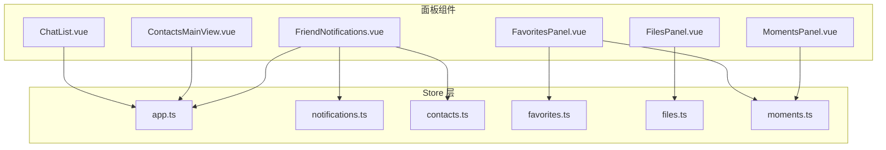
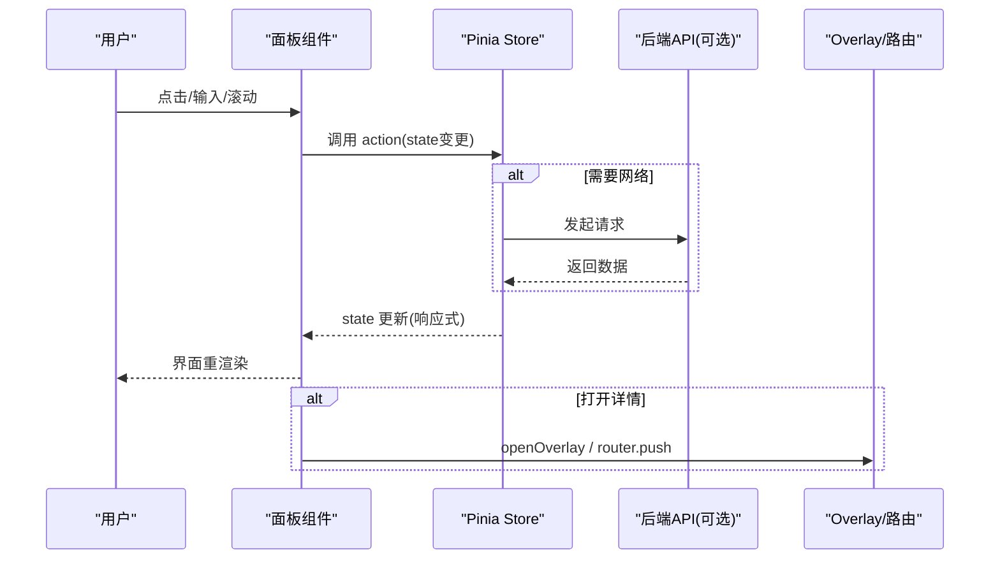
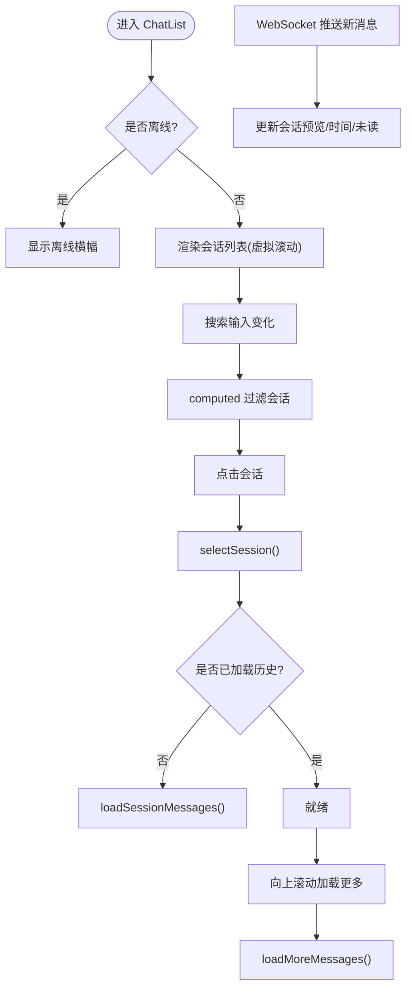
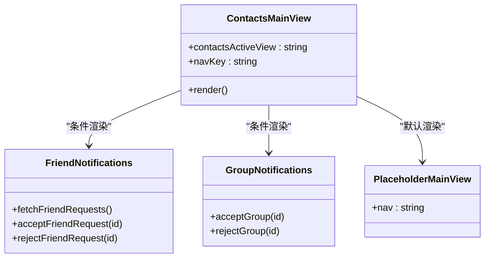
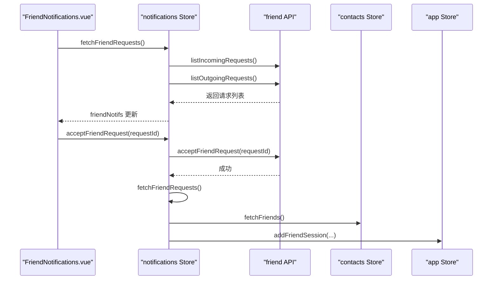
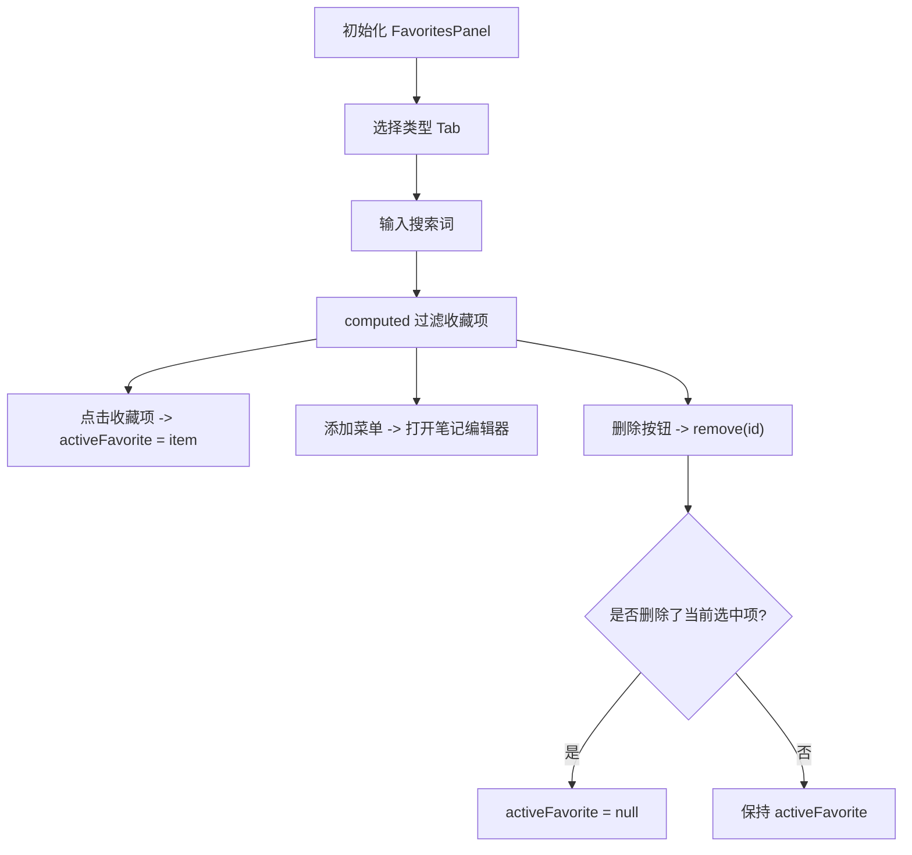
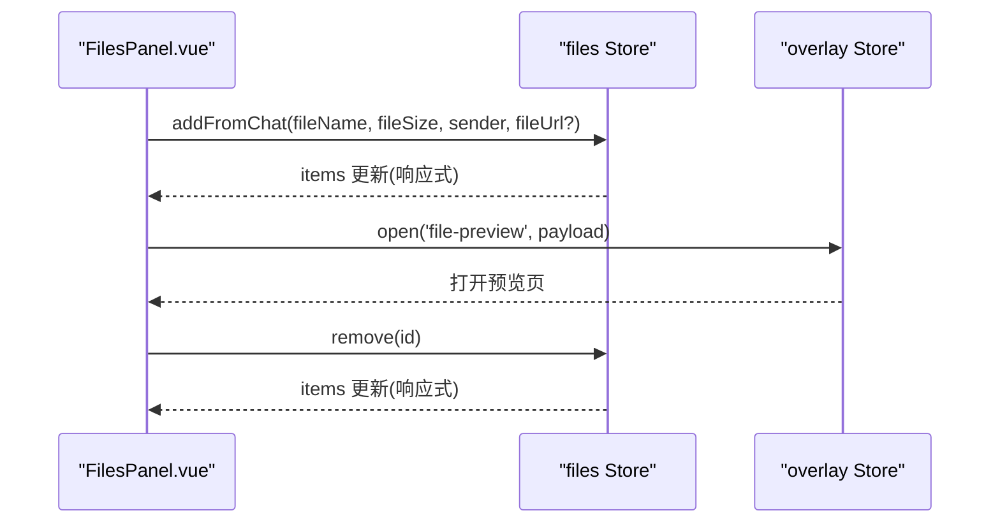
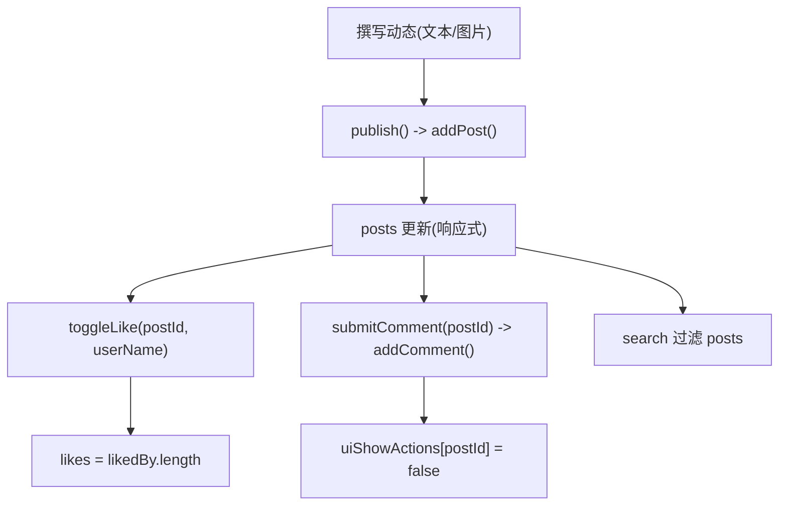
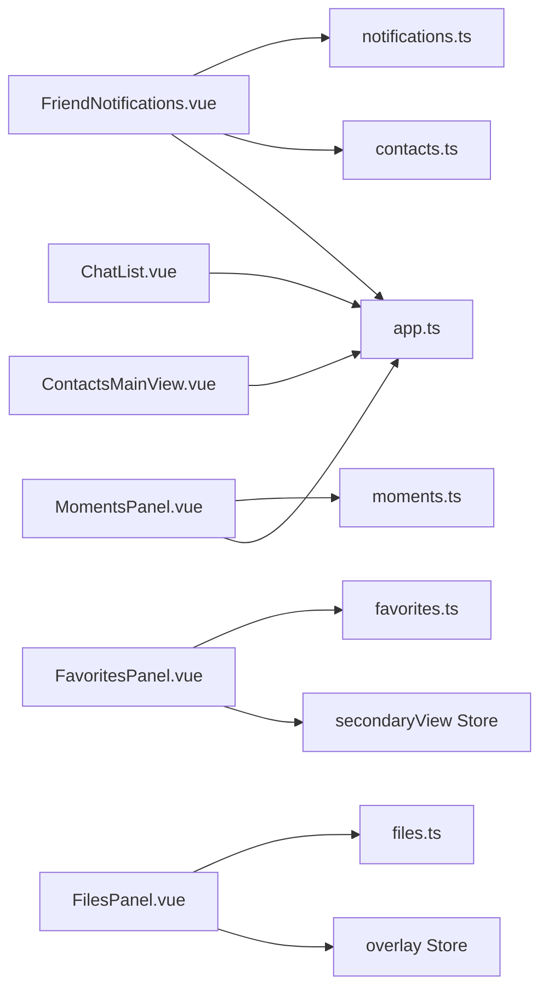

# 面板视图组件

<cite>
**本文引用的文件列表**
- [ChatList.vue](file://linkx-client/src/components/ChatList.vue)
- [ContactsMainView.vue](file://linkx-client/src/components/ContactsMainView.vue)
- [FriendNotifications.vue](file://linkx-client/src/components/contacts/FriendNotifications.vue)
- [FavoritesPanel.vue](file://linkx-client/src/components/FavoritesPanel.vue)
- [FilesPanel.vue](file://linkx-client/src/components/FilesPanel.vue)
- [MomentsPanel.vue](file://linkx-client/src/components/MomentsPanel.vue)
- [app.ts](file://linkx-client/src/stores/app.ts)
- [favorites.ts](file://linkx-client/src/stores/favorites.ts)
- [files.ts](file://linkx-client/src/stores/files.ts)
- [moments.ts](file://linkx-client/src/stores/moments.ts)
- [notifications.ts](file://linkx-client/src/stores/notifications.ts)
- [contacts.ts](file://linkx-client/src/stores/contacts.ts)
</cite>

## 目录
1. [简介](#简介)
2. [项目结构](#项目结构)
3. [核心组件](#核心组件)
4. [架构总览](#架构总览)
5. [详细组件分析](#详细组件分析)
6. [依赖关系分析](#依赖关系分析)
7. [性能与内存优化](#性能与内存优化)
8. [故障排查指南](#故障排查指南)
9. [结论](#结论)
10. [附录：扩展开发指南](#附录扩展开发指南)

## 简介
本文件面向 LinkX 前端客户端的面板视图组件，聚焦以下五个侧栏/主视图组件：
- 聊天列表 ChatList：会话管理、搜索过滤、虚拟滚动、右键菜单（置顶/免打扰/删除）、离线提示。
- 联系人主视图 ContactsMainView：根据状态切换好友通知与群通知子视图。
- 收藏面板 FavoritesPanel：按类型 Tab 与关键词过滤收藏项，支持打开笔记编辑器与删除收藏。
- 文件面板 FilesPanel：分类 Tab、搜索、预览与删除文件记录。
- 朋友圈面板 MomentsPanel：动态发布、点赞、评论与搜索过滤。

文档将详细说明各面板的数据加载策略、分页加载实现、搜索过滤功能、状态同步机制，并给出虚拟滚动优化、懒加载技术与内存管理策略，为开发者提供完整的面板扩展开发与性能优化指导。

## 项目结构
面板组件位于 linkx-client/src/components 下，数据状态由 Pinia Store 管理，部分面板通过 Overlay 或路由打开详情页面。整体采用“组件 + Store”的解耦模式：UI 仅负责展示与交互，业务逻辑集中在 Store 中。

图表来源
- [ChatList.vue:1-120](file://linkx-client/src/components/ChatList.vue#L1-L120)
- [ContactsMainView.vue:1-33](file://linkx-client/src/components/ContactsMainView.vue#L1-L33)
- [FriendNotifications.vue:1-64](file://linkx-client/src/components/contacts/FriendNotifications.vue#L1-L64)
- [FavoritesPanel.vue:1-83](file://linkx-client/src/components/FavoritesPanel.vue#L1-L83)
- [FilesPanel.vue:1-91](file://linkx-client/src/components/FilesPanel.vue#L1-L91)
- [MomentsPanel.vue:1-112](file://linkx-client/src/components/MomentsPanel.vue#L1-L112)
- [app.ts:128-224](file://linkx-client/src/stores/app.ts#L128-L224)
- [notifications.ts:89-122](file://linkx-client/src/stores/notifications.ts#L89-L122)
- [contacts.ts:26-42](file://linkx-client/src/stores/contacts.ts#L26-L42)
- [favorites.ts:19-57](file://linkx-client/src/stores/favorites.ts#L19-L57)
- [files.ts:30-71](file://linkx-client/src/stores/files.ts#L30-L71)
- [moments.ts:73-158](file://linkx-client/src/stores/moments.ts#L73-L158)

章节来源
- [ChatList.vue:1-120](file://linkx-client/src/components/ChatList.vue#L1-L120)
- [ContactsMainView.vue:1-33](file://linkx-client/src/components/ContactsMainView.vue#L1-L33)
- [FriendNotifications.vue:1-64](file://linkx-client/src/components/contacts/FriendNotifications.vue#L1-L64)
- [FavoritesPanel.vue:1-83](file://linkx-client/src/components/FavoritesPanel.vue#L1-L83)
- [FilesPanel.vue:1-91](file://linkx-client/src/components/FilesPanel.vue#L1-L91)
- [MomentsPanel.vue:1-112](file://linkx-client/src/components/MomentsPanel.vue#L1-L112)
- [app.ts:128-224](file://linkx-client/src/stores/app.ts#L128-L224)
- [notifications.ts:89-122](file://linkx-client/src/stores/notifications.ts#L89-L122)
- [contacts.ts:26-42](file://linkx-client/src/stores/contacts.ts#L26-L42)
- [favorites.ts:19-57](file://linkx-client/src/stores/favorites.ts#L19-L57)
- [files.ts:30-71](file://linkx-client/src/stores/files.ts#L30-L71)
- [moments.ts:73-158](file://linkx-client/src/stores/moments.ts#L73-L158)

## 核心组件
本节概述各面板的职责与关键能力：
- ChatList：会话列表渲染、搜索过滤、虚拟滚动、右键菜单操作、离线提示；与 app Store 的会话与消息状态联动。
- ContactsMainView：根据 contactsActiveView 切换好友通知与群通知子视图。
- FriendNotifications：拉取并处理好友请求，接受/拒绝后刷新列表并创建会话。
- FavoritesPanel：按类型筛选与关键词搜索收藏项，支持打开笔记编辑器与删除收藏。
- FilesPanel：按分类 Tab 与关键词搜索文件记录，支持打开 overlay 预览与删除记录。
- MomentsPanel：发布动态、图片选择与上传限制、点赞与评论、搜索过滤。

章节来源
- [ChatList.vue:1-120](file://linkx-client/src/components/ChatList.vue#L1-L120)
- [ContactsMainView.vue:1-33](file://linkx-client/src/components/ContactsMainView.vue#L1-L33)
- [FriendNotifications.vue:1-64](file://linkx-client/src/components/contacts/FriendNotifications.vue#L1-L64)
- [FavoritesPanel.vue:1-83](file://linkx-client/src/components/FavoritesPanel.vue#L1-L83)
- [FilesPanel.vue:1-91](file://linkx-client/src/components/FilesPanel.vue#L1-L91)
- [MomentsPanel.vue:1-112](file://linkx-client/src/components/MomentsPanel.vue#L1-L112)

## 架构总览
面板组件通过 Pinia Store 进行状态管理与跨组件通信。典型流程如下：
- 用户交互触发组件方法，调用对应 Store action。
- Store 更新响应式 state，组件通过 computed 或 storeToRefs 自动重渲染。
- 需要持久化的数据在 Store 配置 persist 字段，刷新不丢失。
- 部分面板通过 Overlay 或路由打开详情页（如文件预览、笔记编辑器）。

图表来源
- [ChatList.vue:1-120](file://linkx-client/src/components/ChatList.vue#L1-L120)
- [app.ts:340-414](file://linkx-client/src/stores/app.ts#L340-L414)
- [notifications.ts:104-144](file://linkx-client/src/stores/notifications.ts#L104-L144)
- [files.ts:44-71](file://linkx-client/src/stores/files.ts#L44-L71)
- [favorites.ts:30-57](file://linkx-client/src/stores/favorites.ts#L30-L57)
- [moments.ts:88-141](file://linkx-client/src/stores/moments.ts#L88-L141)

## 详细组件分析

### 聊天列表 ChatList
- 会话管理
  - 选中会话：清除未读、确保消息数组存在、真实会话懒加载历史消息。
  - 置顶/免打扰/删除：直接修改 app Store 中的会话对象属性或删除。
  - 右键菜单：动态生成选项，基于当前会话状态显示不同文案。
- 搜索过滤
  - 使用 computed 对 sortedSessions 进行本地过滤，匹配名称或最后消息。
- 虚拟滚动
  - 使用 Naive UI 的 NVirtualList 渲染长列表，固定 item-size，提升大列表性能。
- 离线提示
  - 监听 app Store 的 isOffline 状态，顶部横幅提示网络连接断开。
- 数据加载策略
  - 首次进入会话时懒加载历史消息；向上滚动加载更多历史消息（分页）。
  - WebSocket 推送新消息时实时更新会话预览与未读数。

图表来源
- [ChatList.vue:54-122](file://linkx-client/src/components/ChatList.vue#L54-L122)
- [app.ts:211-224](file://linkx-client/src/stores/app.ts#L211-L224)
- [app.ts:364-414](file://linkx-client/src/stores/app.ts#L364-L414)
- [app.ts:478-523](file://linkx-client/src/stores/app.ts#L478-L523)

章节来源
- [ChatList.vue:1-120](file://linkx-client/src/components/ChatList.vue#L1-L120)
- [app.ts:211-224](file://linkx-client/src/stores/app.ts#L211-L224)
- [app.ts:364-414](file://linkx-client/src/stores/app.ts#L364-L414)
- [app.ts:478-523](file://linkx-client/src/stores/app.ts#L478-L523)

### 联系人主视图 ContactsMainView
- 视图切换
  - 根据 app Store 的 contactsActiveView 值决定渲染好友通知或群通知子视图，否则显示占位视图。
- 导航键
  - 通过 navKey 向占位视图传递当前导航上下文。

图表来源
- [ContactsMainView.vue:1-33](file://linkx-client/src/components/ContactsMainView.vue#L1-L33)
- [FriendNotifications.vue:1-64](file://linkx-client/src/components/contacts/FriendNotifications.vue#L1-L64)

章节来源
- [ContactsMainView.vue:1-33](file://linkx-client/src/components/ContactsMainView.vue#L1-L33)

### 好友通知 FriendNotifications
- 数据加载
  - 组件挂载时拉取好友请求列表（入站/出站），合并并按创建时间倒序排序。
- 操作处理
  - 同意：调用后端接口，成功后刷新列表并创建会话；拒绝：调用后端接口并刷新列表。
  - 清空通知：清空本地 friendNotifs。
- 状态同步
  - 通过 notifications Store 的 loading 控制加载态；错误信息通过 message 提示。

图表来源
- [FriendNotifications.vue:22-45](file://linkx-client/src/components/contacts/FriendNotifications.vue#L22-L45)
- [notifications.ts:104-144](file://linkx-client/src/stores/notifications.ts#L104-L144)
- [contacts.ts:103-115](file://linkx-client/src/stores/contacts.ts#L103-L115)
- [app.ts:335-337](file://linkx-client/src/stores/app.ts#L335-L337)

章节来源
- [FriendNotifications.vue:1-64](file://linkx-client/src/components/contacts/FriendNotifications.vue#L1-L64)
- [notifications.ts:89-144](file://linkx-client/src/stores/notifications.ts#L89-L144)
- [contacts.ts:103-115](file://linkx-client/src/stores/contacts.ts#L103-L115)
- [app.ts:335-337](file://linkx-client/src/stores/app.ts#L335-L337)

### 收藏面板 FavoritesPanel
- 内容收藏
  - 按类型 Tab（全部/链接/图片/文件/笔记）与关键词过滤收藏项。
  - 打开笔记编辑器：Electron 环境调用 window.electronAPI.openNoteEditor，Web 环境走路由。
  - 删除收藏：移除 items 并清空 activeFavorite（若被删的是当前选中项）。
- 状态同步
  - favorites Store 维护 items 列表，支持增删改与持久化。

图表来源
- [FavoritesPanel.vue:46-83](file://linkx-client/src/components/FavoritesPanel.vue#L46-L83)
- [favorites.ts:30-57](file://linkx-client/src/stores/favorites.ts#L30-L57)

章节来源
- [FavoritesPanel.vue:1-83](file://linkx-client/src/components/FavoritesPanel.vue#L1-L83)
- [favorites.ts:19-57](file://linkx-client/src/stores/favorites.ts#L19-L57)

### 文件面板 FilesPanel
- 文件管理
  - 分类 Tab（最近/文档/图片/音视频/其他）与关键词搜索（文件名/发送者）。
  - 打开 overlay 文件预览页：传入文件名、大小、URL、是否图片等参数。
  - 删除文件记录：移除 items 并清空 activeFile（若被删的是当前选中项）。
- 状态同步
  - files Store 维护本地文件列表，支持从聊天消息添加与删除，持久化存储。

图表来源
- [FilesPanel.vue:27-91](file://linkx-client/src/components/FilesPanel.vue#L27-L91)
- [files.ts:44-71](file://linkx-client/src/stores/files.ts#L44-L71)

章节来源
- [FilesPanel.vue:1-91](file://linkx-client/src/components/FilesPanel.vue#L1-L91)
- [files.ts:30-71](file://linkx-client/src/stores/files.ts#L30-L71)

### 朋友圈面板 MomentsPanel
- 动态展示
  - 发布动态：文本+多张图片（最多9张，单张不超过 2MB），发布后插入列表头部。
  - 点赞/评论：切换 liked 状态与 likedBy 列表，新增评论并收起操作栏。
  - 搜索过滤：按发布者昵称或内容关键字过滤。
- 状态同步
  - moments Store 维护 posts 列表与 UI 展开状态，持久化帖子数据。

图表来源
- [MomentsPanel.vue:86-112](file://linkx-client/src/components/MomentsPanel.vue#L86-L112)
- [moments.ts:88-141](file://linkx-client/src/stores/moments.ts#L88-L141)

章节来源
- [MomentsPanel.vue:1-112](file://linkx-client/src/components/MomentsPanel.vue#L1-L112)
- [moments.ts:73-158](file://linkx-client/src/stores/moments.ts#L73-L158)

## 依赖关系分析
- 组件到 Store 的依赖
  - ChatList → app Store（会话、消息、离线状态）
  - ContactsMainView → app Store（contactsActiveView、navKey）
  - FriendNotifications → notifications Store、contacts Store、app Store
  - FavoritesPanel → favorites Store、secondaryView Store、router
  - FilesPanel → files Store、overlay Store、secondaryView Store
  - MomentsPanel → moments Store、app Store（用户资料）
- Store 间协作
  - 好友申请同意后，notifications Store 刷新列表，contacts Store 拉取好友，app Store 创建会话。
  - 文件面板与聊天模块通过 files Store 同步文件记录。

图表来源
- [ChatList.vue:1-120](file://linkx-client/src/components/ChatList.vue#L1-L120)
- [ContactsMainView.vue:1-33](file://linkx-client/src/components/ContactsMainView.vue#L1-L33)
- [FriendNotifications.vue:1-64](file://linkx-client/src/components/contacts/FriendNotifications.vue#L1-L64)
- [FavoritesPanel.vue:1-83](file://linkx-client/src/components/FavoritesPanel.vue#L1-L83)
- [FilesPanel.vue:1-91](file://linkx-client/src/components/FilesPanel.vue#L1-L91)
- [MomentsPanel.vue:1-112](file://linkx-client/src/components/MomentsPanel.vue#L1-L112)
- [app.ts:128-224](file://linkx-client/src/stores/app.ts#L128-L224)
- [notifications.ts:89-122](file://linkx-client/src/stores/notifications.ts#L89-L122)
- [contacts.ts:26-42](file://linkx-client/src/stores/contacts.ts#L26-L42)
- [favorites.ts:19-57](file://linkx-client/src/stores/favorites.ts#L19-L57)
- [files.ts:30-71](file://linkx-client/src/stores/files.ts#L30-L71)
- [moments.ts:73-158](file://linkx-client/src/stores/moments.ts#L73-L158)

章节来源
- [ChatList.vue:1-120](file://linkx-client/src/components/ChatList.vue#L1-L120)
- [ContactsMainView.vue:1-33](file://linkx-client/src/components/ContactsMainView.vue#L1-L33)
- [FriendNotifications.vue:1-64](file://linkx-client/src/components/contacts/FriendNotifications.vue#L1-L64)
- [FavoritesPanel.vue:1-83](file://linkx-client/src/components/FavoritesPanel.vue#L1-L83)
- [FilesPanel.vue:1-91](file://linkx-client/src/components/FilesPanel.vue#L1-L91)
- [MomentsPanel.vue:1-112](file://linkx-client/src/components/MomentsPanel.vue#L1-L112)
- [app.ts:128-224](file://linkx-client/src/stores/app.ts#L128-L224)
- [notifications.ts:89-122](file://linkx-client/src/stores/notifications.ts#L89-L122)
- [contacts.ts:26-42](file://linkx-client/src/stores/contacts.ts#L26-L42)
- [favorites.ts:19-57](file://linkx-client/src/stores/favorites.ts#L19-L57)
- [files.ts:30-71](file://linkx-client/src/stores/files.ts#L30-L71)
- [moments.ts:73-158](file://linkx-client/src/stores/moments.ts#L73-L158)

## 性能与内存优化
- 虚拟滚动
  - ChatList 使用 NVirtualList 渲染长列表，固定 item-size，避免一次性渲染大量 DOM，显著降低内存占用与重排开销。
- 懒加载技术
  - 会话历史消息按需加载：首次进入会话拉取首屏消息，向上滚动再加载更多；messagesLoaded/messagesHasMore/messagesLoading 三态控制重复加载与边界情况。
- 搜索过滤
  - 使用 computed 进行本地过滤，避免频繁重新计算与不必要的渲染；对大数据集可考虑防抖与分片过滤。
- 状态同步机制
  - 通过 Pinia 的响应式 state 与 getters，组件自动订阅变化；WebSocket 推送实时同步会话预览与未读数，减少轮询成本。
- 内存管理策略
  - 登出时重置聊天相关状态（disconnectChatWebSocket、清理 messagesBySession、重置加载标记），防止残留引用导致内存泄漏。
  - 文件与收藏等列表持久化时仅保存必要字段，避免过大对象影响序列化与反序列化性能。
- 图片与媒体优化
  - MomentsPanel 限制图片数量与大小，读取为 Data URL 用于预览；后续可引入缩略图与懒加载进一步降低带宽与内存消耗。

章节来源
- [ChatList.vue:160-212](file://linkx-client/src/components/ChatList.vue#L160-L212)
- [app.ts:364-414](file://linkx-client/src/stores/app.ts#L364-L414)
- [app.ts:525-540](file://linkx-client/src/stores/app.ts#L525-L540)
- [moments.ts:88-101](file://linkx-client/src/stores/moments.ts#L88-L101)
- [files.ts:44-71](file://linkx-client/src/stores/files.ts#L44-L71)
- [favorites.ts:60-64](file://linkx-client/src/stores/favorites.ts#L60-L64)

## 故障排查指南
- 聊天列表无数据或无法加载
  - 检查 WebSocket 连接状态与 isOffline 标志；确认 loadChatSessions 与 loadSessionMessages 是否执行成功。
  - 查看控制台错误日志，确认 API 返回码与数据结构是否符合预期。
- 好友通知处理失败
  - 确认 accept/reject 接口返回码；检查 fetchFriendRequests 是否正确刷新列表；验证 addFriendSession 是否成功创建会话。
- 收藏/文件列表异常
  - 检查 Store 的 persist 配置与 key 命名冲突；确认 add/remove/update 方法是否正确触发响应式更新。
- 朋友圈发布失败
  - 校验图片大小与数量限制；确认 readFileAsDataUrl 是否抛出异常；检查 addPost 后 posts 是否更新。

章节来源
- [app.ts:340-414](file://linkx-client/src/stores/app.ts#L340-L414)
- [notifications.ts:104-144](file://linkx-client/src/stores/notifications.ts#L104-L144)
- [favorites.ts:30-57](file://linkx-client/src/stores/favorites.ts#L30-L57)
- [files.ts:44-71](file://linkx-client/src/stores/files.ts#L44-L71)
- [moments.ts:88-101](file://linkx-client/src/stores/moments.ts#L88-L101)

## 结论
LinkX 面板视图组件以“组件 + Store”为核心架构，实现了会话管理、好友管理、收藏与文件管理、朋友圈动态展示等功能。通过虚拟滚动、懒加载与响应式状态同步，系统在性能与用户体验方面达到良好平衡。建议在生产环境中结合后端分页与增量更新进一步优化大数据量场景，并对图片与媒体资源引入更完善的缓存与压缩策略。

## 附录：扩展开发指南
- 新增面板
  - 在 components 目录下新建 Vue 组件，定义模板与脚本逻辑。
  - 在 stores 目录下新建或复用现有 Store，定义 state/actions/getters，并在组件中使用 storeToRefs 绑定响应式数据。
  - 如需持久化，在 Store 配置 persist 字段，指定 key 与 paths。
- 数据加载策略
  - 优先使用懒加载与分页：首次加载首屏数据，滚动到底部或特定阈值触发加载更多。
  - 使用 computed 做本地过滤与排序，避免频繁网络请求。
- 状态同步机制
  - 所有跨组件共享的状态应放在 Store 中，组件只负责展示与交互。
  - 对于实时数据，使用 WebSocket 推送并结合乐观更新与 ACK 替换机制保证一致性。
- 性能优化
  - 长列表使用虚拟滚动；图片与媒体使用缩略图与懒加载；避免在模板中进行复杂计算。
  - 定期清理无用状态与事件监听器，防止内存泄漏。
- 错误处理
  - 统一捕获网络请求异常，使用 message 提示用户；在 Store 中保留错误日志便于调试。
  - 对关键路径增加重试与降级策略，提升系统健壮性。