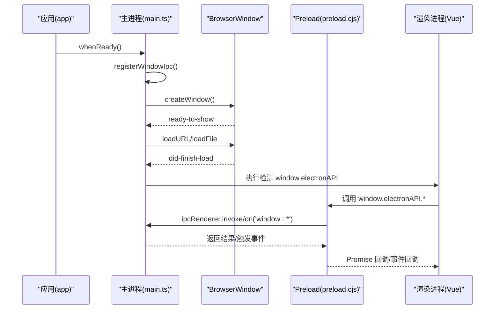
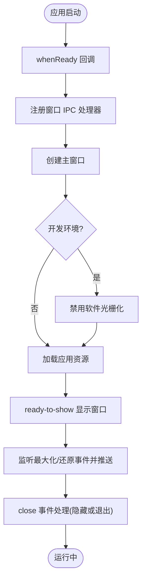
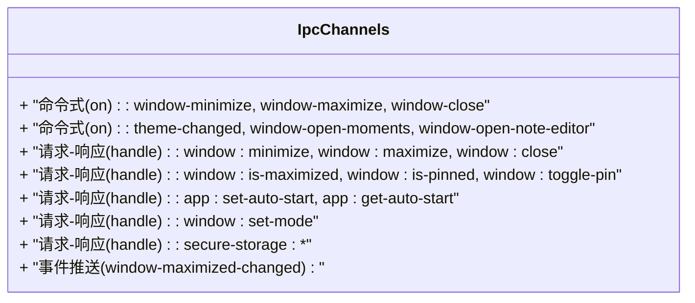
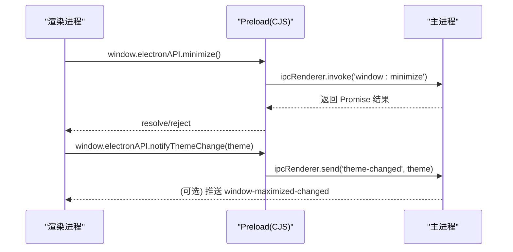
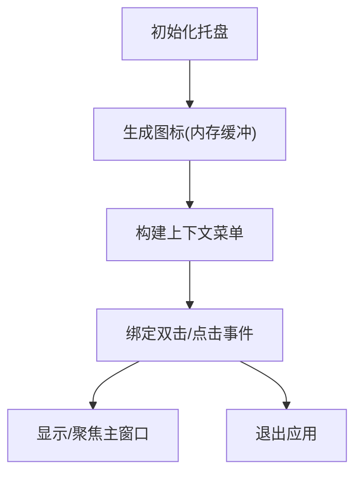
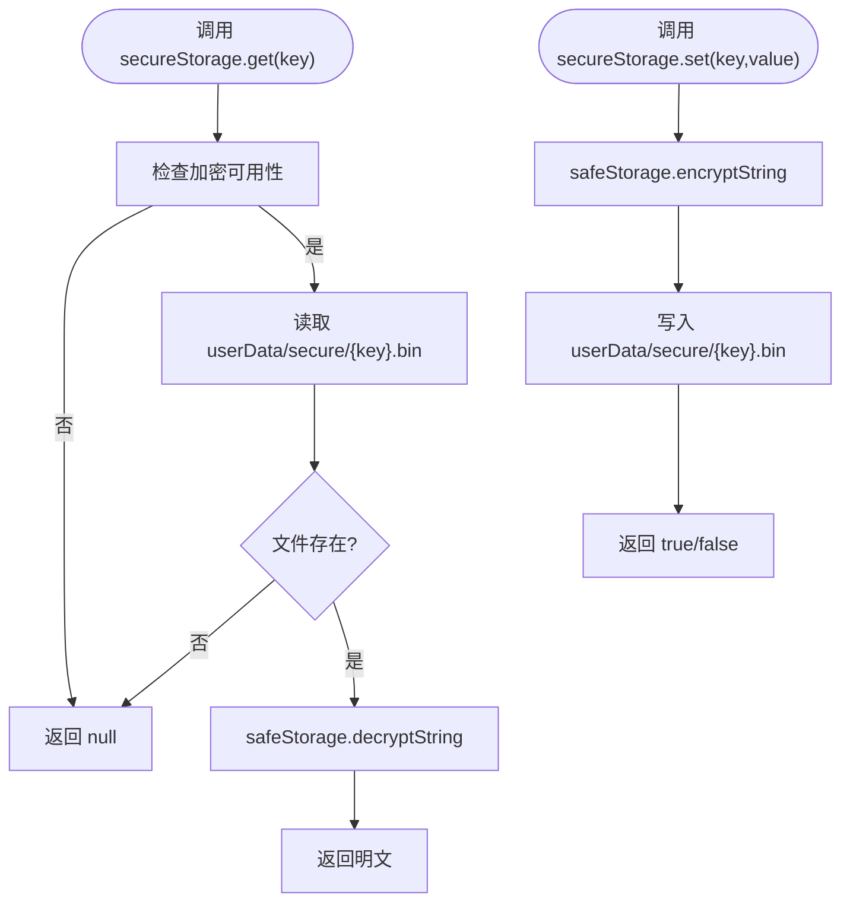
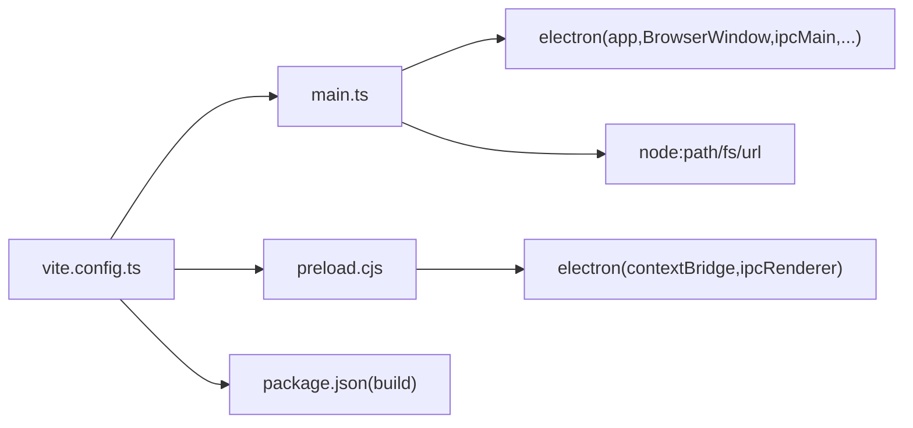

# Electron 主进程架构

<cite>
**本文引用的文件**   
- [main.ts](file://linkx-client/electron/main.ts)
- [preload.cjs](file://linkx-client/electron/preload.cjs)
- [preload.ts](file://linkx-client/electron/preload.ts)
- [vite.config.ts](file://linkx-client/vite.config.ts)
- [package.json](file://linkx-client/package.json)
- [electron.d.ts](file://linkx-client/src/types/electron.d.ts)
</cite>

## 目录
1. [简介](#简介)
2. [项目结构](#项目结构)
3. [核心组件](#核心组件)
4. [架构总览](#架构总览)
5. [详细组件分析](#详细组件分析)
6. [依赖关系分析](#依赖关系分析)
7. [性能与稳定性考量](#性能与稳定性考量)
8. [故障排查指南](#故障排查指南)
9. [结论](#结论)
10. [附录：最佳实践与安全清单](#附录最佳实践与安全清单)

## 简介
本技术文档围绕 LinkX Electron 客户端的主进程架构，系统性阐述窗口管理、进程间通信（IPC）、安全隔离机制与系统集成能力。重点说明 preload 脚本的安全桥接模式、上下文隔离配置与 API 暴露策略，覆盖主进程启动流程、生命周期管理、菜单系统、托盘功能、全局快捷键等特性，并提供主进程与渲染进程通信的最佳实践与安全注意事项，帮助开发者理解并扩展桌面应用功能。

## 项目结构
本项目采用 Vite + Vue 作为渲染层，Electron 作为宿主运行时。主进程入口位于 electron 目录，preload 同时提供 CJS 与 TS 两种实现，构建期通过 Vite 插件将 CJS 版本复制到 dist-electron 供主进程加载。

```mermaid
graph TB
A["Vite 配置<br/>vite.config.ts"] --> B["主进程入口<br/>electron/main.ts"]
A --> C["复制 CJS Preload<br/>dist-electron/preload/preload.cjs"]
B --> D["渲染进程(浏览器上下文)<br/>Vue 应用"]
B --> E["Preload 脚本(CJS)<br/>electron/preload.cjs"]
D <- --> E
E <- --> B
F["类型声明<br/>src/types/electron.d.ts"] -.-> D
G["打包配置<br/>package.json"] --> B
```

图示来源
- [vite.config.ts:1-76](file://linkx-client/vite.config.ts#L1-L76)
- [main.ts:1-445](file://linkx-client/electron/main.ts#L1-L445)
- [preload.cjs:1-31](file://linkx-client/electron/preload.cjs#L1-L31)
- [electron.d.ts:1-34](file://linkx-client/src/types/electron.d.ts#L1-L34)
- [package.json:1-62](file://linkx-client/package.json#L1-L62)

章节来源
- [vite.config.ts:1-76](file://linkx-client/vite.config.ts#L1-L76)
- [package.json:1-62](file://linkx-client/package.json#L1-L62)

## 核心组件
- 主进程模块
  - 负责应用生命周期、窗口创建与管理、托盘与菜单、全局快捷键、主题同步、开机自启设置、安全存储封装等。
- Preload 桥接模块
  - 使用 contextBridge 向渲染进程暴露最小化、最大化、关闭、置顶、主题变更通知、独立子窗口打开、安全存储等 API。
- 类型定义
  - 为 Window.electronAPI 提供 TypeScript 类型，便于在渲染端进行类型提示与约束。

章节来源
- [main.ts:1-445](file://linkx-client/electron/main.ts#L1-L445)
- [preload.cjs:1-31](file://linkx-client/electron/preload.cjs#L1-L31)
- [preload.ts:1-37](file://linkx-client/electron/preload.ts#L1-L37)
- [electron.d.ts:1-34](file://linkx-client/src/types/electron.d.ts#L1-L34)

## 架构总览
下图展示了主进程、Preload 与渲染进程之间的交互关系，以及关键 IPC 通道与事件流。



图示来源
- [main.ts:421-434](file://linkx-client/electron/main.ts#L421-L434)
- [main.ts:346-419](file://linkx-client/electron/main.ts#L346-L419)
- [main.ts:72-177](file://linkx-client/electron/main.ts#L72-L177)
- [preload.cjs:1-31](file://linkx-client/electron/preload.cjs#L1-L31)

## 详细组件分析

### 主进程：窗口管理与生命周期
- 启动流程
  - 监听 app.whenReady，注册 IPC、创建主窗口、初始化托盘与全局快捷键。
  - 开发模式下禁用软件光栅化以提升渲染性能。
- 窗口创建与模式切换
  - 登录窗口与主窗口尺寸、可调整性、背景材质与颜色由 set-mode 控制。
  - 最大化状态变化通过事件推送至渲染端，用于 UI 联动。
- 关闭行为
  - macOS 遵循原生行为；其他平台默认隐藏到托盘而非退出。
- 辅助函数
  - winFromSender 根据事件来源获取对应窗口实例，避免跨窗口误操作。



图示来源
- [main.ts:40-42](file://linkx-client/electron/main.ts#L40-L42)
- [main.ts:421-434](file://linkx-client/electron/main.ts#L421-L434)
- [main.ts:346-419](file://linkx-client/electron/main.ts#L346-L419)
- [main.ts:128-147](file://linkx-client/electron/main.ts#L128-L147)
- [main.ts:66-70](file://linkx-client/electron/main.ts#L66-L70)

章节来源
- [main.ts:40-42](file://linkx-client/electron/main.ts#L40-L42)
- [main.ts:421-434](file://linkx-client/electron/main.ts#L421-L434)
- [main.ts:346-419](file://linkx-client/electron/main.ts#L346-L419)
- [main.ts:128-147](file://linkx-client/electron/main.ts#L128-L147)
- [main.ts:66-70](file://linkx-client/electron/main.ts#L66-L70)

### 主进程：IPC 通道设计
- 命令式通道（on）
  - window-minimize / window-maximize / window-close：直接触发窗口动作。
  - theme-changed：接收渲染端主题变更，批量更新所有窗口背景色。
  - window-open-moments / window-open-note-editor：打开独立子窗口。
- 请求-响应通道（handle）
  - window:minimize / window:maximize / window:close：返回 Promise 结果。
  - window:is-maximized / window:is-pinned / window:toggle-pin：查询/切换置顶。
  - app:set-auto-start / app:get-auto-start：设置/读取开机自启。
  - window:set-mode：切换登录/主界面窗口模式。
  - secure-storage:*：安全存储的可用性与读写删除。
- 事件推送
  - window-maximized-changed：从主进程推送到渲染端，用于 UI 同步。



图示来源
- [main.ts:72-177](file://linkx-client/electron/main.ts#L72-L177)
- [main.ts:190-192](file://linkx-client/electron/main.ts#L190-L192)
- [main.ts:288-290](file://linkx-client/electron/main.ts#L288-L290)
- [main.ts:342-344](file://linkx-client/electron/main.ts#L342-L344)
- [main.ts:66-70](file://linkx-client/electron/main.ts#L66-L70)

章节来源
- [main.ts:72-177](file://linkx-client/electron/main.ts#L72-L177)
- [main.ts:190-192](file://linkx-client/electron/main.ts#L190-L192)
- [main.ts:288-290](file://linkx-client/electron/main.ts#L288-L290)
- [main.ts:342-344](file://linkx-client/electron/main.ts#L342-L344)
- [main.ts:66-70](file://linkx-client/electron/main.ts#L66-L70)

### Preload 安全桥接与上下文隔离
- 安全桥接模式
  - 使用 contextBridge.exposeInMainWorld 仅暴露必要 API，避免直接暴露 Node/Electron 对象。
  - 提供 minimize/maximize/close/openMoments/openNoteEditor/isMaximized/isPinned/togglePin/setAutoStart/getAutoStart/notifyThemeChange/setWindowMode/secureStorage 等方法。
- 上下文隔离配置
  - 所有 BrowserWindow 均启用 contextIsolation: true，nodeIntegration: false，sandbox: false，确保渲染进程无法直接访问 Node 能力。
- 双实现兼容
  - 提供 CJS 与 TS 两个版本，CJS 用于生产构建注入，TS 用于开发调试参考。
- 类型支持
  - 通过 src/types/electron.d.ts 为 Window.electronAPI 提供类型声明，提升 DX 与安全性。



图示来源
- [preload.cjs:1-31](file://linkx-client/electron/preload.cjs#L1-L31)
- [preload.ts:1-37](file://linkx-client/electron/preload.ts#L1-37)
- [electron.d.ts:1-34](file://linkx-client/src/types/electron.d.ts#L1-L34)
- [main.ts:72-177](file://linkx-client/electron/main.ts#L72-L177)

章节来源
- [preload.cjs:1-31](file://linkx-client/electron/preload.cjs#L1-L31)
- [preload.ts:1-37](file://linkx-client/electron/preload.ts#L1-37)
- [electron.d.ts:1-34](file://linkx-client/src/types/electron.d.ts#L1-L34)
- [main.ts:72-177](file://linkx-client/electron/main.ts#L72-L177)

### 托盘与菜单
- 托盘图标
  - 动态生成 16x16 像素蓝色圆形图标，避免外部资源依赖。
- 上下文菜单
  - 包含“显示主窗口”和“退出”两项，双击托盘也可显示主窗口。
- 生命周期
  - 应用激活时若没有窗口则创建新窗口，否则聚焦现有窗口。



图示来源
- [main.ts:194-233](file://linkx-client/electron/main.ts#L194-L233)
- [main.ts:421-434](file://linkx-client/electron/main.ts#L421-L434)

章节来源
- [main.ts:194-233](file://linkx-client/electron/main.ts#L194-L233)
- [main.ts:421-434](file://linkx-client/electron/main.ts#L421-L434)

### 全局快捷键
- 快捷键组合
  - CommandOrControl+Shift+L：在主窗口可见时隐藏，不可见时显示并聚焦。
- 生命周期
  - 应用退出时注销所有快捷键，避免残留。

章节来源
- [main.ts:235-244](file://linkx-client/electron/main.ts#L235-L244)
- [main.ts:436-438](file://linkx-client/electron/main.ts#L436-L438)

### 独立子窗口：友链与笔记编辑器
- 友链窗口
  - 固定尺寸、无边框、亚克力背景，开发模式按路由 hash 加载。
- 笔记编辑器窗口
  - 可调整大小、mica 背景、最大化状态推送至渲染端。
- 打开方式
  - 通过 IPC 事件 window-open-moments / window-open-note-editor 触发。

章节来源
- [main.ts:246-286](file://linkx-client/electron/main.ts#L246-L286)
- [main.ts:288-290](file://linkx-client/electron/main.ts#L288-L290)
- [main.ts:292-344](file://linkx-client/electron/main.ts#L292-L344)
- [main.ts:342-344](file://linkx-client/electron/main.ts#L342-L344)

### 安全存储（OS 级加密）
- 能力检测
  - 通过 safeStorage.isEncryptionAvailable 判断是否可用。
- 存储路径
  - 使用 app.getPath('userData') 下的 secure 子目录，每个 key 对应一个 .bin 文件。
- 读写删
  - get/set/remove 分别读取解密字符串、写入加密数据、删除文件。
- 错误处理
  - 读取失败返回 null，写入失败返回 false，保证上层稳定。



图示来源
- [main.ts:9-21](file://linkx-client/electron/main.ts#L9-L21)
- [main.ts:149-176](file://linkx-client/electron/main.ts#L149-L176)

章节来源
- [main.ts:9-21](file://linkx-client/electron/main.ts#L9-L21)
- [main.ts:149-176](file://linkx-client/electron/main.ts#L149-L176)

### 构建与打包集成
- Vite 插件
  - vite-plugin-electron 编译 main.ts 到 dist-electron/main。
  - 自定义插件在构建开始时复制 electron/preload.cjs 到 dist-electron/preload，解决 Windows 下 ESM preload 注入问题。
- 打包配置
  - package.json 中指定 main 入口、产物输出目录与平台目标。

章节来源
- [vite.config.ts:9-16](file://linkx-client/vite.config.ts#L9-L16)
- [vite.config.ts:43-73](file://linkx-client/vite.config.ts#L43-L73)
- [package.json:7-14](file://linkx-client/package.json#L7-L14)
- [package.json:40-60](file://linkx-client/package.json#L40-L60)

## 依赖关系分析
- 主进程依赖
  - Electron 内置模块：app、BrowserWindow、ipcMain、Tray、Menu、nativeImage、globalShortcut、safeStorage。
  - Node.js 模块：path、fs、url。
- Preload 依赖
  - Electron 内置模块：contextBridge、ipcRenderer。
- 构建工具链
  - Vite、vite-plugin-electron、vite-plugin-electron-renderer、electron-builder。



图示来源
- [main.ts:1-5](file://linkx-client/electron/main.ts#L1-L5)
- [preload.cjs:1-1](file://linkx-client/electron/preload.cjs#L1-L1)
- [vite.config.ts:1-8](file://linkx-client/vite.config.ts#L1-L8)
- [package.json:40-60](file://linkx-client/package.json#L40-L60)

章节来源
- [main.ts:1-5](file://linkx-client/electron/main.ts#L1-L5)
- [preload.cjs:1-1](file://linkx-client/electron/preload.cjs#L1-L1)
- [vite.config.ts:1-8](file://linkx-client/vite.config.ts#L1-L8)
- [package.json:40-60](file://linkx-client/package.json#L40-L60)

## 性能与稳定性考量
- 预渲染优化
  - 开发模式禁用软件光栅化，减少 CPU 软解压力。
- 窗口背景色批量更新
  - 主题变更时遍历所有窗口统一设置背景色，避免重复计算。
- 事件去抖与订阅清理
  - onMaximizedChange 返回取消订阅函数，防止内存泄漏。
- 资源加载
  - 使用 once('ready-to-show') 延迟显示，避免闪烁。

[本节为通用建议，不直接分析具体文件]

## 故障排查指南
- preload 未找到或加载失败
  - 现象：控制台打印 preload not found 或 preload-error。
  - 排查：确认 dist-electron/preload/preload.cjs 是否存在；检查 resolvePreloadPath 候选路径；确认 Vite 构建阶段是否执行了 copyPreloadCjs。
- window.electronAPI 未注入
  - 现象：did-finish-load 后检测到 typeof window.electronAPI !== "undefined" 为 false。
  - 排查：确认 webPreferences.preload 指向正确的 CJS 文件；确认 contextIsolation 为 true 且 preload 成功执行。
- 安全存储不可用
  - 现象：secureStorage.isAvailable 返回 false。
  - 排查：当前平台不支持 OS 级加密；降级方案应回退到应用内加密或提示用户。
- 托盘/快捷键无效
  - 现象：托盘无菜单或快捷键不生效。
  - 排查：确认托盘已创建；确认全局快捷键注册时机；应用退出时是否被注销。

章节来源
- [main.ts:24-36](file://linkx-client/electron/main.ts#L24-L36)
- [main.ts:384-406](file://linkx-client/electron/main.ts#L384-L406)
- [main.ts:149-176](file://linkx-client/electron/main.ts#L149-L176)
- [main.ts:222-233](file://linkx-client/electron/main.ts#L222-L233)
- [main.ts:235-244](file://linkx-client/electron/main.ts#L235-L244)
- [vite.config.ts:9-16](file://linkx-client/vite.config.ts#L9-L16)

## 结论
LinkX 的 Electron 主进程以清晰的职责划分实现了窗口管理、IPC 桥接、托盘与全局快捷键、安全存储等核心能力。通过严格的上下文隔离与最小化 API 暴露策略，有效降低了安全风险。结合 Vite 插件与构建脚本，保证了多环境下 preload 的稳定注入。建议在后续迭代中继续完善错误上报、日志分级与权限校验，进一步提升健壮性与可维护性。

[本节为总结性内容，不直接分析具体文件]

## 附录：最佳实践与安全清单
- 安全隔离
  - 始终启用 contextIsolation: true，禁用 nodeIntegration。
  - 仅通过 preload 暴露必要 API，避免泄露敏感方法。
- IPC 设计
  - 优先使用 handle 实现请求-响应，避免在渲染端直接发送危险命令。
  - 对事件通道进行白名单校验，拒绝未知频道。
- 窗口管理
  - 使用 fromWebContents 定位窗口，避免跨窗口误操作。
  - 对 close 行为做平台差异化处理，macOS 遵循原生逻辑。
- 安全存储
  - 使用 safeStorage 进行敏感数据加解密，仅在可用时启用。
  - 文件落盘路径置于 userData 下的私有目录。
- 构建与部署
  - 确保 preload.cjs 在构建期正确复制到 dist-electron/preload。
  - 发布前验证各平台托盘、快捷键与自启行为。

[本节为通用建议，不直接分析具体文件]