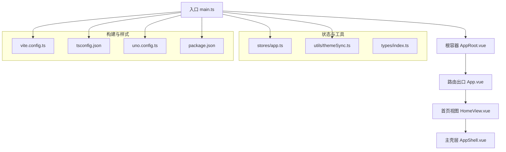
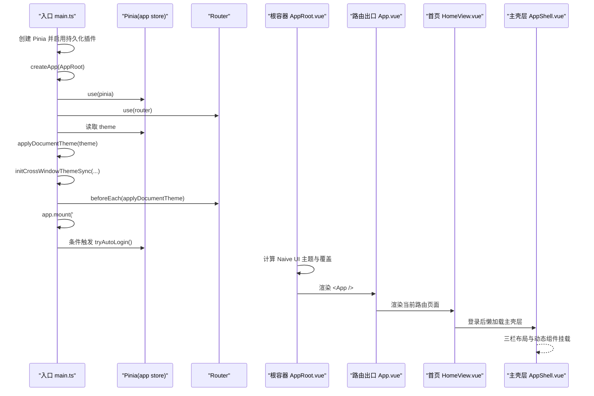
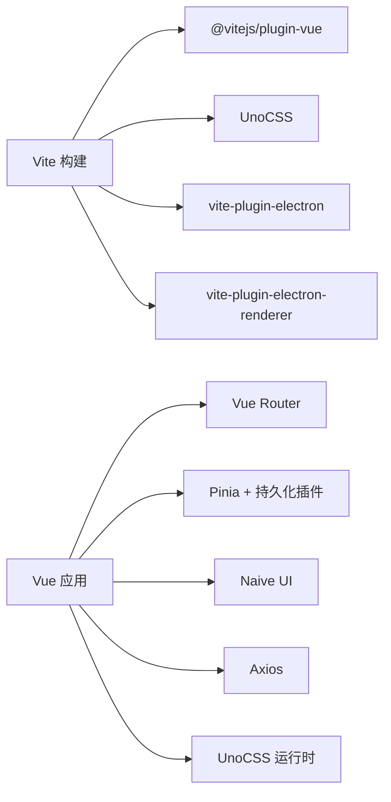

# Vue 3 应用架构

<cite>
**本文引用的文件**
- [main.ts](file://linkx-client/src/main.ts)
- [AppRoot.vue](file://linkx-client/src/AppRoot.vue)
- [App.vue](file://linkx-client/src/App.vue)
- [HomeView.vue](file://linkx-client/src/views/HomeView.vue)
- [index.ts（路由）](file://linkx-client/src/router/index.ts)
- [vite.config.ts](file://linkx-client/vite.config.ts)
- [tsconfig.json](file://linkx-client/tsconfig.json)
- [uno.config.ts](file://linkx-client/uno.config.ts)
- [package.json](file://linkx-client/package.json)
- [app.ts（应用 Store）](file://linkx-client/src/stores/app.ts)
- [themeSync.ts](file://linkx-client/src/utils/themeSync.ts)
- [index.ts（类型定义）](file://linkx-client/src/types/index.ts)
- [AppShell.vue](file://linkx-client/src/components/AppShell.vue)
</cite>

## 目录
1. [简介](#简介)
2. [项目结构](#项目结构)
3. [核心组件与模块](#核心组件与模块)
4. [架构总览](#架构总览)
5. [详细组件分析](#详细组件分析)
6. [依赖关系分析](#依赖关系分析)
7. [性能优化策略](#性能优化策略)
8. [故障排查指南](#故障排查指南)
9. [结论](#结论)
10. [附录：开发环境与构建脚本](#附录开发环境与构建脚本)

## 简介
本文件为 LinkX Vue 3 桌面客户端的前端架构文档，聚焦于基于 Composition API 的应用结构设计、应用初始化流程、插件注册机制、全局配置管理、路由与构建优化、TypeScript 类型系统以及模块导入策略。目标是帮助开发者快速理解并维护该 Vue 3 应用的架构与最佳实践。

## 项目结构
前端工程位于 linkx-client 目录，采用 Vite + Vue 3 + TypeScript + Pinia + Vue Router + Naive UI + UnoCSS 的技术栈，并通过 vite-plugin-electron 集成 Electron 主进程与渲染进程。

图表来源
- [main.ts:1-64](file://linkx-client/src/main.ts#L1-L64)
- [AppRoot.vue:1-105](file://linkx-client/src/AppRoot.vue#L1-L105)
- [App.vue:1-26](file://linkx-client/src/App.vue#L1-L26)
- [HomeView.vue:1-85](file://linkx-client/src/views/HomeView.vue#L1-L85)
- [AppShell.vue:1-345](file://linkx-client/src/components/AppShell.vue#L1-L345)
- [app.ts（应用 Store）:1-1156](file://linkx-client/src/stores/app.ts#L1-L1156)
- [themeSync.ts:1-45](file://linkx-client/src/utils/themeSync.ts#L1-L45)
- [index.ts（类型定义）:1-129](file://linkx-client/src/types/index.ts#L1-L129)
- [vite.config.ts:1-76](file://linkx-client/vite.config.ts#L1-L76)
- [tsconfig.json:1-22](file://linkx-client/tsconfig.json#L1-L22)
- [uno.config.ts:1-6](file://linkx-client/uno.config.ts#L1-L6)
- [package.json:1-62](file://linkx-client/package.json#L1-L62)

章节来源
- [main.ts:1-64](file://linkx-client/src/main.ts#L1-L64)
- [AppRoot.vue:1-105](file://linkx-client/src/AppRoot.vue#L1-L105)
- [App.vue:1-26](file://linkx-client/src/App.vue#L1-L26)
- [HomeView.vue:1-85](file://linkx-client/src/views/HomeView.vue#L1-L85)
- [AppShell.vue:1-345](file://linkx-client/src/components/AppShell.vue#L1-L345)
- [vite.config.ts:1-76](file://linkx-client/vite.config.ts#L1-L76)
- [tsconfig.json:1-22](file://linkx-client/tsconfig.json#L1-L22)
- [uno.config.ts:1-6](file://linkx-client/uno.config.ts#L1-L6)
- [package.json:1-62](file://linkx-client/package.json#L1-L62)

## 核心组件与模块
- 应用入口与插件注册
  - 创建 Pinia 实例并启用持久化插件；挂载 Vue 应用、Pinia、Vue Router；在挂载前读取主题并同步到 DOM；监听跨窗口主题变化；路由切换前再次应用主题；最后挂载到 #app。
- 根容器与全局 Provider
  - 使用 Naive UI 的 ConfigProvider、MessageProvider、DialogProvider 提供全局主题、语言与弹窗能力；根据主题计算覆盖配置；异步加载设置弹窗；锁屏通过 Teleport 挂载至 body。
- 路由与页面组织
  - 使用 Hash 历史模式，兼容 Electron file:// 部署；首页按登录态动态懒加载主界面或登录页；独立子窗口路由用于友链与笔记编辑器。
- 状态管理与持久化
  - 应用级 Store 集中管理导航、会话、消息、用户资料、主题、锁屏、离线等；通过 pinia-plugin-persistedstate 将关键路径持久化到 localStorage，并在序列化前进行清洗。
- 主题与跨窗口同步
  - 通过 data-theme 属性驱动 CSS 变量切换；Electron 环境下通知主进程更新原生主题；监听 storage 事件实现多窗口主题联动。
- 构建与类型系统
  - Vite 配置包含 Vue 编译选项、UnoCSS、Electron 插件、分包策略；TypeScript 严格模式与 ESNext 模块解析；UnoCSS 原子化样式预设。

章节来源
- [main.ts:1-64](file://linkx-client/src/main.ts#L1-L64)
- [AppRoot.vue:1-105](file://linkx-client/src/AppRoot.vue#L1-L105)
- [index.ts（路由）:1-31](file://linkx-client/src/router/index.ts#L1-L31)
- [app.ts（应用 Store）:1-1156](file://linkx-client/src/stores/app.ts#L1-L1156)
- [themeSync.ts:1-45](file://linkx-client/src/utils/themeSync.ts#L1-L45)
- [vite.config.ts:1-76](file://linkx-client/vite.config.ts#L1-L76)
- [tsconfig.json:1-22](file://linkx-client/tsconfig.json#L1-L22)
- [uno.config.ts:1-6](file://linkx-client/uno.config.ts#L1-L6)

## 架构总览
下图展示了从应用启动到首屏渲染的关键调用链与数据流，包括插件注册、主题同步、自动登录与路由渲染。

图表来源
- [main.ts:1-64](file://linkx-client/src/main.ts#L1-L64)
- [AppRoot.vue:1-105](file://linkx-client/src/AppRoot.vue#L1-L105)
- [App.vue:1-26](file://linkx-client/src/App.vue#L1-L26)
- [HomeView.vue:1-85](file://linkx-client/src/views/HomeView.vue#L1-L85)
- [AppShell.vue:1-345](file://linkx-client/src/components/AppShell.vue#L1-L345)
- [app.ts（应用 Store）:1008-1045](file://linkx-client/src/stores/app.ts#L1008-L1045)

## 详细组件分析

### 应用入口与初始化流程
- 创建并挂载 Pinia、Vue Router；在挂载前应用主题；监听跨窗口主题变更；路由守卫中确保主题一致；按需尝试自动登录。
- 自动登录逻辑由 app store 的 tryAutoLogin 负责，避免无 token 时阻塞首屏。

章节来源
- [main.ts:1-64](file://linkx-client/src/main.ts#L1-L64)
- [app.ts（应用 Store）:1008-1045](file://linkx-client/src/stores/app.ts#L1008-L1045)

### 根容器与全局 Provider
- 使用 Naive UI 的 ConfigProvider 注入主题与覆盖；MessageProvider 与 DialogProvider 提供全局提示与对话框能力。
- 根据 theme 计算 naiveTheme 与 themeOverrides，统一圆角、主色、背景与文字色。
- 设置弹窗异步加载，锁屏通过 Teleport 挂载到 body。

章节来源
- [AppRoot.vue:1-105](file://linkx-client/src/AppRoot.vue#L1-L105)

### 路由与页面组织
- 使用 Hash 模式，便于 Electron 本地运行与 Web 部署。
- 首页根据登录态与自动登录恢复状态，懒加载主壳层或登录页，减少首屏体积。
- 独立子窗口路由用于“友链”和“笔记编辑器”。

章节来源
- [index.ts（路由）:1-31](file://linkx-client/src/router/index.ts#L1-L31)
- [HomeView.vue:1-85](file://linkx-client/src/views/HomeView.vue#L1-L85)

### 主壳层与三栏布局
- 左侧导航、中间列表、右侧内容区；支持中间列拖拽调整宽度；根据 navKey 动态渲染不同面板。
- 大量弹窗组件异步懒加载，降低首屏包体。

章节来源
- [AppShell.vue:1-345](file://linkx-client/src/components/AppShell.vue#L1-L345)

### 应用 Store 与业务域
- 集中管理导航、会话、消息、用户资料、主题、锁屏、离线等状态。
- 提供会话管理、消息发送（含乐观更新）、WebSocket 连接与消息处理、历史分页加载、群聊操作、用户资料更新、登出清理、锁屏 PIN 校验等动作。
- 持久化关键路径，并在序列化前清洗敏感或过大字段。

章节来源
- [app.ts（应用 Store）:1-1156](file://linkx-client/src/stores/app.ts#L1-L1156)

### 主题同步与跨窗口联动
- 通过 data-theme 驱动 CSS 变量切换；Electron 下通知主进程更新原生主题；监听 storage 事件实现多窗口主题同步。

章节来源
- [themeSync.ts:1-45](file://linkx-client/src/utils/themeSync.ts#L1-L45)

### 类型系统与模块导入策略
- types/index.ts 统一定义 NavKey、OverlayPage、ChatSession、ChatMessage、ContactItem、FavoriteItem、AppItem 等核心类型，保证全链路类型安全。
- 组件内广泛使用 defineAsyncComponent 与路由级 import() 实现按需加载，减小首屏体积。

章节来源
- [index.ts（类型定义）:1-129](file://linkx-client/src/types/index.ts#L1-L129)
- [HomeView.vue:1-85](file://linkx-client/src/views/HomeView.vue#L1-L85)
- [AppShell.vue:1-345](file://linkx-client/src/components/AppShell.vue#L1-L345)

## 依赖关系分析
- 运行时依赖
  - vue、vue-router、pinia、naive-ui、axios、unocss、pinia-plugin-persistedstate。
- 构建与开发依赖
  - vite、@vitejs/plugin-vue、typescript、vue-tsc、electron、vite-plugin-electron、vite-plugin-electron-renderer、electron-builder、unocss。
- 构建产物与打包
  - electron-builder 输出 Windows NSIS、macOS DMG、Linux AppImage。

图表来源
- [package.json:1-62](file://linkx-client/package.json#L1-L62)
- [vite.config.ts:1-76](file://linkx-client/vite.config.ts#L1-L76)

章节来源
- [package.json:1-62](file://linkx-client/package.json#L1-L62)
- [vite.config.ts:1-76](file://linkx-client/vite.config.ts#L1-L76)

## 性能优化策略
- 代码分割与分包
  - 手动分包：将 naive-ui 与 vue/vue-router/pinia 拆分为独立 chunk，提升缓存命中率与并行加载效率。
- 组件懒加载
  - 路由级与组件级均使用动态 import 与 defineAsyncComponent，显著降低首屏解析与执行时间。
- 构建优化
  - 关闭 emit（noEmit），仅做类型检查与打包；开启 sourcemap（Electron 模式）便于调试；限制 chunkSizeWarningLimit 避免大包。
- 样式优化
  - 使用 UnoCSS 原子化样式，按需生成，减少冗余 CSS。
- 主题与渲染
  - 仅在必要时写入 data-theme，避免频繁重排；Electron 模式下通过 IPC 通知主进程更新原生主题，避免重复渲染。

章节来源
- [vite.config.ts:1-76](file://linkx-client/vite.config.ts#L1-L76)
- [HomeView.vue:1-85](file://linkx-client/src/views/HomeView.vue#L1-L85)
- [AppShell.vue:1-345](file://linkx-client/src/components/AppShell.vue#L1-L345)
- [uno.config.ts:1-6](file://linkx-client/uno.config.ts#L1-L6)

## 故障排查指南
- 自动登录卡住或白屏
  - 现象：启动后长时间停留在加载态。
  - 排查：确认 savedLogin 配置与 refreshToken 是否存在；检查 tryAutoLogin 分支是否进入；查看网络请求与错误日志。
  - 参考位置：[app.ts（应用 Store）:1008-1045](file://linkx-client/src/stores/app.ts#L1008-L1045)
- 主题不生效或多窗口不一致
  - 现象：切换主题无效或副窗口未跟随。
  - 排查：检查 data-theme 是否正确设置；确认跨窗口 storage 事件是否触发；验证 notifyElectronTheme 是否在 Electron 环境可用。
  - 参考位置：[themeSync.ts:1-45](file://linkx-client/src/utils/themeSync.ts#L1-L45)、[AppRoot.vue:1-105](file://linkx-client/src/AppRoot.vue#L1-L105)
- WebSocket 消息丢失或重复
  - 现象：消息未显示或重复出现。
  - 排查：检查 handleIncomingWsMessage 去重逻辑；确认消息 ID 唯一性；核对乐观消息替换与 ack 处理。
  - 参考位置：[app.ts（应用 Store）:478-523](file://linkx-client/src/stores/app.ts#L478-L523)
- 构建失败或类型报错
  - 现象：vue-tsc 报错或打包异常。
  - 排查：确认 tsconfig 严格模式与模块解析；检查引入类型与 .d.ts 声明；核对 Vite 插件顺序与外部依赖。
  - 参考位置：[tsconfig.json:1-22](file://linkx-client/tsconfig.json#L1-L22)、[vite.config.ts:1-76](file://linkx-client/vite.config.ts#L1-L76)

章节来源
- [app.ts（应用 Store）:478-523](file://linkx-client/src/stores/app.ts#L478-L523)
- [app.ts（应用 Store）:1008-1045](file://linkx-client/src/stores/app.ts#L1008-L1045)
- [themeSync.ts:1-45](file://linkx-client/src/utils/themeSync.ts#L1-L45)
- [AppRoot.vue:1-105](file://linkx-client/src/AppRoot.vue#L1-L105)
- [tsconfig.json:1-22](file://linkx-client/tsconfig.json#L1-L22)
- [vite.config.ts:1-76](file://linkx-client/vite.config.ts#L1-L76)

## 结论
LinkX 前端采用清晰的模块化与分层设计：以 main.ts 为入口，AppRoot 作为全局 Provider 容器，App 作为路由出口，HomeView 控制登录态与首屏渲染，AppShell 承载三栏布局与功能面板。配合 Pinia 集中式状态管理、Naive UI 主题体系、UnoCSS 原子化样式与 Vite 构建优化，实现了良好的可维护性与性能表现。建议后续持续完善类型约束、错误边界与监控埋点，进一步提升稳定性与可观测性。

## 附录：开发环境与构建脚本
- 开发命令
  - dev：启动 Vite 开发服务器。
  - build：类型检查 + 生产构建。
  - preview：预览生产构建产物。
  - electron:dev：以 Electron 模式启动开发。
  - electron:build：类型检查 + 构建 + electron-builder 打包。
  - electron:preview：直接运行已打包的 Electron 主进程。
- 构建产物
  - dist：渲染进程产物。
  - dist-electron：主进程与 preload 产物。
  - release：平台安装包（NSIS/DMG/AppImage）。

章节来源
- [package.json:1-62](file://linkx-client/package.json#L1-L62)