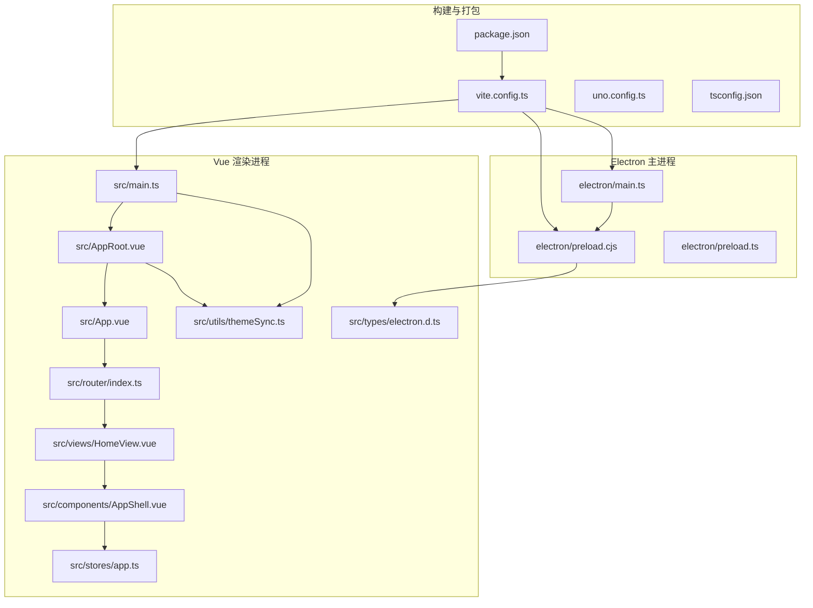
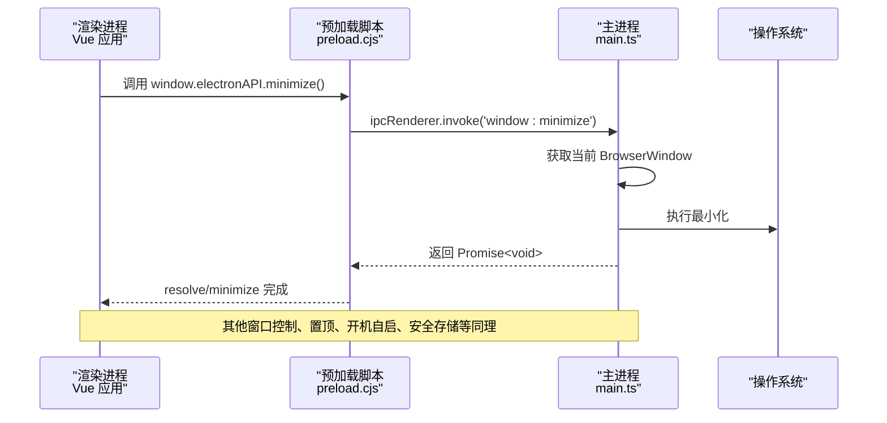
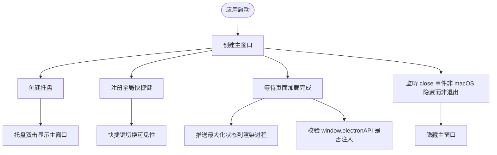
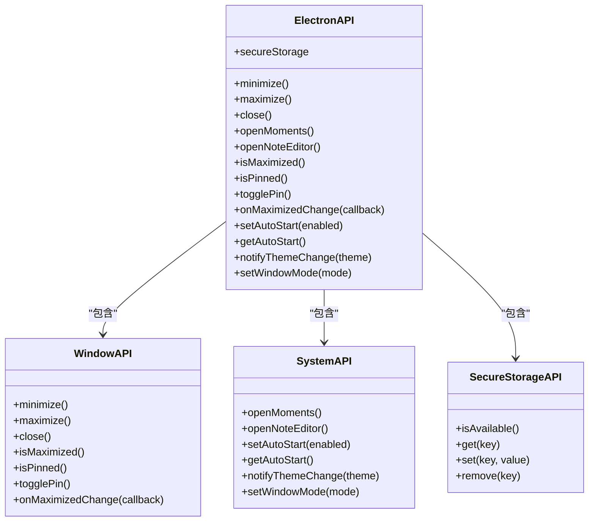
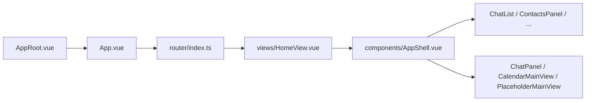
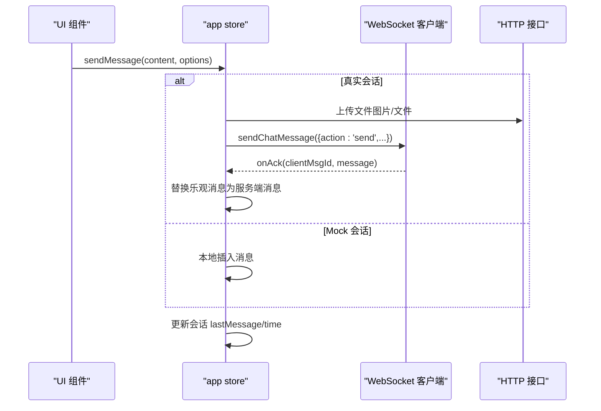
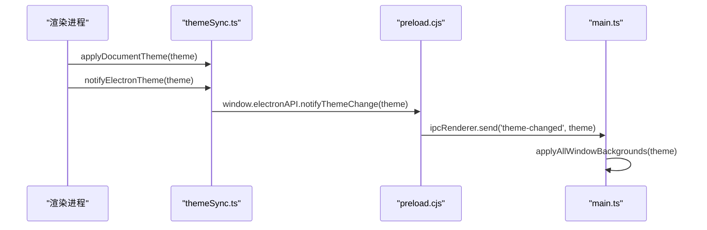
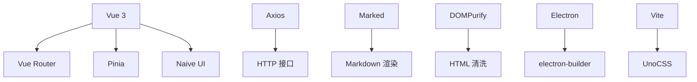

# 前端架构设计

<cite>
**本文引用的文件**   
- [package.json](file://linkx-client/package.json)
- [vite.config.ts](file://linkx-client/vite.config.ts)
- [electron/main.ts](file://linkx-client/electron/main.ts)
- [electron/preload.cjs](file://linkx-client/electron/preload.cjs)
- [electron/preload.ts](file://linkx-client/electron/preload.ts)
- [src/main.ts](file://linkx-client/src/main.ts)
- [src/AppRoot.vue](file://linkx-client/src/AppRoot.vue)
- [src/App.vue](file://linkx-client/src/App.vue)
- [src/router/index.ts](file://linkx-client/src/router/index.ts)
- [src/components/AppShell.vue](file://linkx-client/src/components/AppShell.vue)
- [src/views/HomeView.vue](file://linkx-client/src/views/HomeView.vue)
- [src/stores/app.ts](file://linkx-client/src/stores/app.ts)
- [src/utils/themeSync.ts](file://linkx-client/src/utils/themeSync.ts)
- [uno.config.ts](file://linkx-client/uno.config.ts)
- [tsconfig.json](file://linkx-client/tsconfig.json)
- [src/types/electron.d.ts](file://linkx-client/src/types/electron.d.ts)
</cite>

## 目录
1. [简介](#简介)
2. [项目结构](#项目结构)
3. [核心组件](#核心组件)
4. [架构总览](#架构总览)
5. [详细组件分析](#详细组件分析)
6. [依赖关系分析](#依赖关系分析)
7. [性能考量](#性能考量)
8. [故障排查指南](#故障排查指南)
9. [结论](#结论)
10. [附录](#附录)

## 简介
本文件为 LinkX 桌面客户端的前端架构文档，聚焦于基于 Electron + Vue 3 的架构设计与实现。内容涵盖：
- 主进程与渲染进程的通信机制与安全隔离
- Vue 3 组件化架构、状态管理与路由设计
- Electron 主进程职责划分、窗口管理与系统集成能力
- Vite 构建配置、TypeScript 类型系统、UnoCSS 样式架构与组件层次结构
- 面向开发者的扩展指导与最佳实践

## 项目结构
前端工程位于 linkx-client 目录，采用“功能域 + 分层”组织方式：
- electron：Electron 主进程与预加载脚本
- src：Vue 3 应用源码（视图、组件、路由、状态、工具、类型）
- 构建与样式：Vite、UnoCSS、TypeScript 配置

图表来源
- [package.json:1-62](file://linkx-client/package.json#L1-L62)
- [vite.config.ts:1-76](file://linkx-client/vite.config.ts#L1-L76)
- [electron/main.ts:1-445](file://linkx-client/electron/main.ts#L1-L445)
- [electron/preload.cjs:1-31](file://linkx-client/electron/preload.cjs#L1-L31)
- [electron/preload.ts:1-37](file://linkx-client/electron/preload.ts#L1-L37)
- [src/main.ts:1-64](file://linkx-client/src/main.ts#L1-L64)
- [src/AppRoot.vue:1-105](file://linkx-client/src/AppRoot.vue#L1-L105)
- [src/App.vue:1-26](file://linkx-client/src/App.vue#L1-L26)
- [src/router/index.ts:1-31](file://linkx-client/src/router/index.ts#L1-L31)
- [src/views/HomeView.vue:1-85](file://linkx-client/src/views/HomeView.vue#L1-L85)
- [src/components/AppShell.vue:1-345](file://linkx-client/src/components/AppShell.vue#L1-L345)
- [src/stores/app.ts:1-800](file://linkx-client/src/stores/app.ts#L1-L800)
- [src/utils/themeSync.ts:1-45](file://linkx-client/src/utils/themeSync.ts#L1-L45)
- [uno.config.ts:1-6](file://linkx-client/uno.config.ts#L1-L6)
- [tsconfig.json:1-22](file://linkx-client/tsconfig.json#L1-L22)
- [src/types/electron.d.ts:1-34](file://linkx-client/src/types/electron.d.ts#L1-L34)

章节来源
- [package.json:1-62](file://linkx-client/package.json#L1-L62)
- [vite.config.ts:1-76](file://linkx-client/vite.config.ts#L1-L76)

## 核心组件
- 应用入口与根容器
  - 入口初始化 Pinia、Router、主题同步与自动登录策略
  - 根容器提供 Naive UI 全局主题覆盖、消息与对话框 Provider，并挂载锁屏层
- 路由与页面
  - Hash 模式路由，支持主窗口与独立子窗口（友链、笔记编辑器）
  - 首页根据登录态切换主壳层与登录页，并在 Electron 下同步窗口尺寸模式
- 主壳层布局
  - 三栏布局（侧边导航、中间列表、右侧主内容），支持列宽拖拽与焦点态材质效果
- 状态管理
  - app store 集中管理会话、消息、用户资料、主题、登录态、离线态等
  - 通过 WebSocket 与后端 IM 服务交互，处理消息发送、确认与历史分页
- 主题与跨窗口同步
  - 通过 data-theme 驱动 CSS 变量，跨窗口使用 storage 事件联动
  - 通知主进程更新原生窗口背景色以匹配主题

章节来源
- [src/main.ts:1-64](file://linkx-client/src/main.ts#L1-L64)
- [src/AppRoot.vue:1-105](file://linkx-client/src/AppRoot.vue#L1-L105)
- [src/App.vue:1-26](file://linkx-client/src/App.vue#L1-L26)
- [src/router/index.ts:1-31](file://linkx-client/src/router/index.ts#L1-L31)
- [src/views/HomeView.vue:1-85](file://linkx-client/src/views/HomeView.vue#L1-L85)
- [src/components/AppShell.vue:1-345](file://linkx-client/src/components/AppShell.vue#L1-L345)
- [src/stores/app.ts:1-800](file://linkx-client/src/stores/app.ts#L1-L800)
- [src/utils/themeSync.ts:1-45](file://linkx-client/src/utils/themeSync.ts#L1-L45)

## 架构总览
LinkX 前端采用“主进程 + 渲染进程”的双进程模型。渲染进程由 Vue 3 驱动，负责 UI 与业务逻辑；主进程负责窗口管理、系统集成与敏感操作。两者通过 preload 暴露的安全 API 进行 IPC 通信。

图表来源
- [electron/preload.cjs:1-31](file://linkx-client/electron/preload.cjs#L1-L31)
- [electron/main.ts:72-177](file://linkx-client/electron/main.ts#L72-L177)

章节来源
- [electron/main.ts:1-445](file://linkx-client/electron/main.ts#L1-L445)
- [electron/preload.cjs:1-31](file://linkx-client/electron/preload.cjs#L1-L31)
- [src/types/electron.d.ts:1-34](file://linkx-client/src/types/electron.d.ts#L1-L34)

## 详细组件分析

### Electron 主进程职责与窗口管理
- 窗口生命周期
  - 创建主窗口与两个独立子窗口（友链、笔记编辑器），统一设置 webPreferences（contextIsolation=true、nodeIntegration=false、sandbox=false）
  - 监听最大化/还原事件，向渲染进程推送状态变化
- 系统集成
  - 托盘菜单、全局快捷键、开机自启、关闭行为（macOS 与其他平台差异）
- 安全存储
  - 使用 safeStorage 加密本地文件，提供 get/set/remove/isAvailable 接口
- 主题同步
  - 接收渲染进程主题变更，批量更新所有窗口背景色

图表来源
- [electron/main.ts:346-445](file://linkx-client/electron/main.ts#L346-L445)
- [electron/main.ts:212-244](file://linkx-client/electron/main.ts#L212-L244)
- [electron/main.ts:189-192](file://linkx-client/electron/main.ts#L189-L192)
- [electron/main.ts:149-176](file://linkx-client/electron/main.ts#L149-L176)

章节来源
- [electron/main.ts:1-445](file://linkx-client/electron/main.ts#L1-L445)

### 预加载脚本与安全隔离
- 通过 contextBridge.exposeInMainWorld 暴露受限 API（窗口控制、主题通知、安全存储等）
- 同时提供 CJS 与 TS 两种版本，确保在 Windows 环境下正确注入
- 渲染进程通过 window.electronAPI 访问，Web 环境自动降级

图表来源
- [electron/preload.cjs:1-31](file://linkx-client/electron/preload.cjs#L1-L31)
- [electron/preload.ts:1-37](file://linkx-client/electron/preload.ts#L1-L37)
- [src/types/electron.d.ts:1-34](file://linkx-client/src/types/electron.d.ts#L1-L34)

章节来源
- [electron/preload.cjs:1-31](file://linkx-client/electron/preload.cjs#L1-L31)
- [electron/preload.ts:1-37](file://linkx-client/electron/preload.ts#L1-L37)
- [src/types/electron.d.ts:1-34](file://linkx-client/src/types/electron.d.ts#L1-L34)

### Vue 3 组件化架构与路由设计
- 组件层次
  - AppRoot 提供全局主题与弹窗 Provider，App 作为路由出口，HomeView 根据登录态选择 AppShell 或 LoginView
  - AppShell 实现三栏布局与动态面板切换，大量弹窗异步懒加载
- 路由设计
  - Hash 模式，兼容 file:// 部署
  - 支持主窗口与独立子窗口路由（#/moments、#/note-editor）

图表来源
- [src/AppRoot.vue:1-105](file://linkx-client/src/AppRoot.vue#L1-L105)
- [src/App.vue:1-26](file://linkx-client/src/App.vue#L1-L26)
- [src/router/index.ts:1-31](file://linkx-client/src/router/index.ts#L1-L31)
- [src/views/HomeView.vue:1-85](file://linkx-client/src/views/HomeView.vue#L1-L85)
- [src/components/AppShell.vue:1-345](file://linkx-client/src/components/AppShell.vue#L1-L345)

章节来源
- [src/AppRoot.vue:1-105](file://linkx-client/src/AppRoot.vue#L1-L105)
- [src/App.vue:1-26](file://linkx-client/src/App.vue#L1-L26)
- [src/router/index.ts:1-31](file://linkx-client/src/router/index.ts#L1-L31)
- [src/views/HomeView.vue:1-85](file://linkx-client/src/views/HomeView.vue#L1-L85)
- [src/components/AppShell.vue:1-345](file://linkx-client/src/components/AppShell.vue#L1-L345)

### 状态管理策略（Pinia）
- app store 承担核心业务状态：会话、消息、用户资料、主题、登录态、离线态、锁屏等
- 关键流程
  - 登录后拉取好友、通知与会话，连接 WebSocket
  - 消息发送：真实会话走 WebSocket，Mock 会话本地写入
  - 历史消息分页加载与去重
  - 登出时重置聊天相关状态与 UI 覆盖层

图表来源
- [src/stores/app.ts:617-749](file://linkx-client/src/stores/app.ts#L617-L749)
- [src/stores/app.ts:339-347](file://linkx-client/src/stores/app.ts#L339-L347)
- [src/stores/app.ts:364-414](file://linkx-client/src/stores/app.ts#L364-L414)

章节来源
- [src/stores/app.ts:1-800](file://linkx-client/src/stores/app.ts#L1-L800)

### 主题与跨窗口同步
- 渲染进程通过 applyDocumentTheme 设置 data-theme，并通过 notifyElectronTheme 通知主进程
- 主进程收到 theme-changed 后批量更新所有窗口背景色
- 多窗口间通过 localStorage 的 storage 事件同步主题

图表来源
- [src/utils/themeSync.ts:1-45](file://linkx-client/src/utils/themeSync.ts#L1-L45)
- [electron/preload.cjs:1-31](file://linkx-client/electron/preload.cjs#L1-L31)
- [electron/main.ts:189-192](file://linkx-client/electron/main.ts#L189-L192)

章节来源
- [src/utils/themeSync.ts:1-45](file://linkx-client/src/utils/themeSync.ts#L1-L45)
- [electron/main.ts:189-192](file://linkx-client/electron/main.ts#L189-L192)

### 构建与样式体系（Vite + UnoCSS + TypeScript）
- Vite 插件
  - @vitejs/plugin-vue：识别 <webview> 自定义元素
  - unocss/vite：原子化样式
  - vite-plugin-electron 与 renderer：主进程与渲染进程构建
  - 自定义插件：复制 CJS 预加载脚本到 dist-electron
- 分包策略
  - naive-ui 与 vue-vendor 手动分包，提升缓存命中率
- UnoCSS
  - 使用 presetUno，配合 CSS 变量与 data-theme 实现主题
- TypeScript
  - strict 模式，ESNext 模块，bundler 解析，isolatedModules
  - 扩展 Window.electronAPI 类型定义，保证类型安全

章节来源
- [vite.config.ts:1-76](file://linkx-client/vite.config.ts#L1-L76)
- [uno.config.ts:1-6](file://linkx-client/uno.config.ts#L1-L6)
- [tsconfig.json:1-22](file://linkx-client/tsconfig.json#L1-L22)
- [src/types/electron.d.ts:1-34](file://linkx-client/src/types/electron.d.ts#L1-L34)

## 依赖关系分析
- 运行时依赖
  - Vue 3、Vue Router、Pinia、Naive UI、Axios、marked、dompurify
- 开发依赖
  - Electron、electron-builder、Vite、unocss、typescript、vue-tsc
- 构建产物
  - 渲染产物输出至 dist，主进程与预加载输出至 dist-electron

图表来源
- [package.json:16-39](file://linkx-client/package.json#L16-L39)

章节来源
- [package.json:1-62](file://linkx-client/package.json#L1-L62)

## 性能考量
- 首屏优化
  - 路由与大型组件异步加载（Suspense + defineAsyncComponent）
  - 手动分包减少单包体积
- 渲染优化
  - 仅按需引入 Naive UI，避免全量引入
  - 列表项虚拟滚动与分页加载（历史消息分页）
- 网络与状态
  - WebSocket 断线重连与离线态提示
  - 乐观更新 + ACK 替换，提升用户体验
- 构建优化
  - SourceMap 仅在开发启用，生产开启压缩
  - 预加载脚本 CJS 直拷，避免 ESM 注入问题

[本节为通用建议，不直接分析具体文件]

## 故障排查指南
- preload 未注入
  - 现象：window.electronAPI 未定义
  - 排查：检查 preload 路径解析与复制插件是否生效，确认 CJS 文件存在
- 窗口控制无效
  - 现象：最小化/最大化/关闭无响应
  - 排查：确认 IPC 通道名称一致，主进程 handle/on 已注册
- 主题不同步
  - 现象：主窗口与子窗口颜色不一致
  - 排查：确认 theme-changed 事件触发与 applyAllWindowBackgrounds 执行
- 安全存储不可用
  - 现象：secureStorage.get/set 失败
  - 排查：检查 isEncryptionAvailable 返回值与 secure 目录权限

章节来源
- [electron/main.ts:384-407](file://linkx-client/electron/main.ts#L384-L407)
- [electron/main.ts:149-176](file://linkx-client/electron/main.ts#L149-L176)
- [electron/main.ts:189-192](file://linkx-client/electron/main.ts#L189-L192)

## 结论
LinkX 前端以 Electron + Vue 3 为核心，结合 Pinia 与 Vue Router 构建了清晰的组件化与状态管理体系。通过 preload 安全桥接主进程能力，实现了窗口管理、系统集成与敏感数据保护。Vite 与 UnoCSS 提供了高效的构建与样式方案，TypeScript 保障类型安全。整体架构具备良好的可扩展性与可维护性，适合持续迭代与企业级场景。

[本节为总结性内容，不直接分析具体文件]

## 附录
- 扩展指引
  - 新增窗口：在主进程创建 BrowserWindow，配置 webPreferences，注册路由与 IPC
  - 新增 API：在 preload 中暴露方法，在主进程注册 handle/on，补充类型定义
  - 新增主题变量：在 styles.css 中定义 CSS 变量，通过 data-theme 切换
  - 新增 Store：遵循 Pinia 规范，必要时配置持久化与清理策略

[本节为概念性内容，不直接分析具体文件]