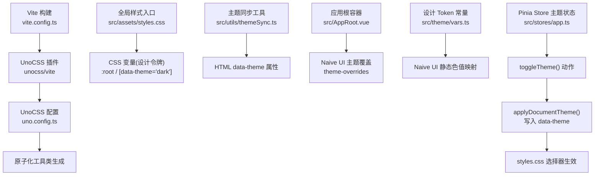
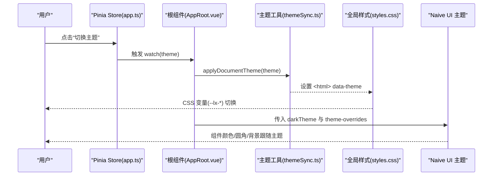
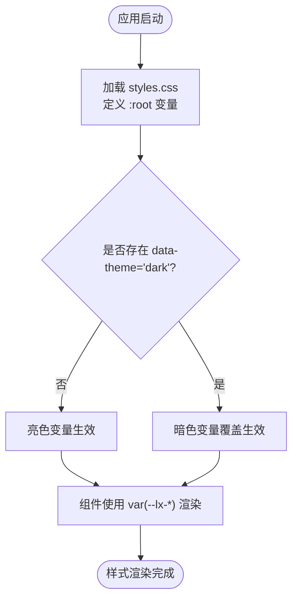
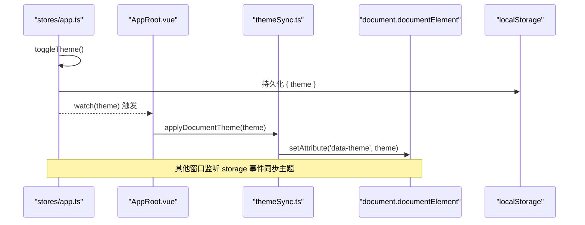
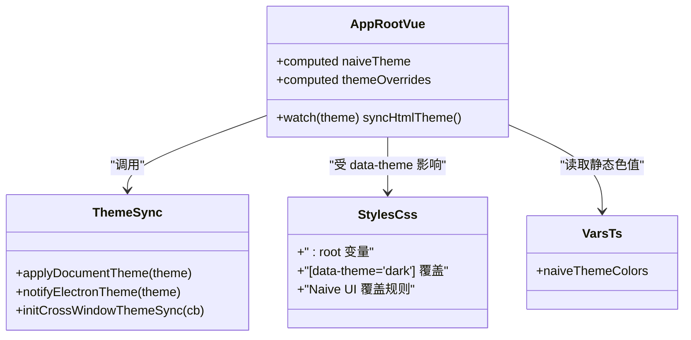
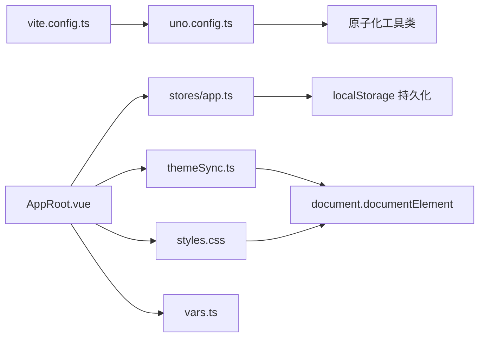

# 样式系统设计

<cite>
**本文引用的文件**
- [uno.config.ts](file://linkx-client/uno.config.ts)
- [vite.config.ts](file://linkx-client/vite.config.ts)
- [styles.css](file://linkx-client/src/assets/styles.css)
- [vars.ts](file://linkx-client/src/theme/vars.ts)
- [themeSync.ts](file://linkx-client/src/utils/themeSync.ts)
- [AppRoot.vue](file://linkx-client/src/AppRoot.vue)
- [app.ts](file://linkx-client/src/stores/app.ts)
</cite>

## 目录
1. [简介](#简介)
2. [项目结构](#项目结构)
3. [核心组件](#核心组件)
4. [架构总览](#架构总览)
5. [详细组件分析](#详细组件分析)
6. [依赖关系分析](#依赖关系分析)
7. [性能考虑](#性能考虑)
8. [故障排查指南](#故障排查指南)
9. [结论](#结论)
10. [附录](#附录)

## 简介
本文件系统化梳理 LinkX 前端样式系统，围绕基于 UnoCSS 的原子化样式架构展开，覆盖样式配置、主题系统与响应式策略。重点说明 CSS 变量定义、主题切换机制、样式优先级管理、性能优化方案，并给出 UnoCSS 配置选项、自定义工具类、组件样式封装与调试技巧，以及开发规范与最佳实践（主题定制、响应式适配、跨浏览器兼容）。

## 项目结构
LinkX 前端的样式体系由以下关键部分构成：
- 构建与集成：Vite + UnoCSS 插件启用原子化样式能力
- 设计令牌：全局 CSS 变量集中定义，支持明暗主题
- 运行时主题：通过 data-theme 属性驱动主题切换，并与 UI 库主题联动
- 组件样式：在公共样式中统一覆盖第三方 UI 组件外观，形成一致的视觉语言
- 脚本侧 Token 引用：为模板无法直接写 CSS 变量的场景提供常量映射

图表来源
- [vite.config.ts:1-76](file://linkx-client/vite.config.ts#L1-L76)
- [uno.config.ts:1-6](file://linkx-client/uno.config.ts#L1-L6)
- [styles.css:1-313](file://linkx-client/src/assets/styles.css#L1-L313)
- [themeSync.ts:1-45](file://linkx-client/src/utils/themeSync.ts#L1-L45)
- [AppRoot.vue:1-105](file://linkx-client/src/AppRoot.vue#L1-L105)
- [vars.ts:1-30](file://linkx-client/src/theme/vars.ts#L1-L30)
- [app.ts:128-163](file://linkx-client/src/stores/app.ts#L128-L163)

章节来源
- [vite.config.ts:1-76](file://linkx-client/vite.config.ts#L1-L76)
- [uno.config.ts:1-6](file://linkx-client/uno.config.ts#L1-L6)

## 核心组件
- UnoCSS 配置与集成
  - Vite 插件启用 UnoCSS，使用 presetUno 预设提供基础原子化能力
  - 当前配置简洁，便于后续扩展自定义规则或预设
- 设计令牌与主题
  - styles.css 集中定义 --lx-* 系列 CSS 变量，按背景、品牌色、文字、边框、功能色、圆角、阴影、渐变等维度组织
  - 通过 [data-theme='dark'] 选择器覆盖变量实现暗色主题
- 运行时主题切换
  - AppRoot.vue 监听 store 中的 theme 变化，调用 applyDocumentTheme 设置 data-theme
  - themeSync.ts 提供 applyDocumentTheme、notifyElectronTheme、initCrossWindowThemeSync 等工具
  - stores/app.ts 暴露 toggleTheme 动作，持久化主题到 localStorage
- Naive UI 主题联动
  - AppRoot.vue 根据 theme 动态选择 darkTheme 或 null，并通过 theme-overrides 注入主色、圆角、背景与文字色
  - vars.ts 提供 naiveThemeColors 静态色值，确保与 CSS 变量一致

章节来源
- [vite.config.ts:34-42](file://linkx-client/vite.config.ts#L34-L42)
- [uno.config.ts:1-6](file://linkx-client/uno.config.ts#L1-L6)
- [styles.css:1-112](file://linkx-client/src/assets/styles.css#L1-L112)
- [themeSync.ts:7-13](file://linkx-client/src/utils/themeSync.ts#L7-L13)
- [AppRoot.vue:44-77](file://linkx-client/src/AppRoot.vue#L44-L77)
- [vars.ts:20-30](file://linkx-client/src/theme/vars.ts#L20-L30)
- [app.ts:128-163](file://linkx-client/src/stores/app.ts#L128-L163)

## 架构总览
下图展示从用户操作到样式生效的完整链路：Store 变更触发 HTML 属性更新，CSS 变量随之切换，同时 Naive UI 组件通过 theme-overrides 同步主题。

图表来源
- [app.ts:128-163](file://linkx-client/src/stores/app.ts#L128-L163)
- [AppRoot.vue:68-77](file://linkx-client/src/AppRoot.vue#L68-L77)
- [themeSync.ts:7-13](file://linkx-client/src/utils/themeSync.ts#L7-L13)
- [styles.css:71-112](file://linkx-client/src/assets/styles.css#L71-L112)

## 详细组件分析

### UnoCSS 配置与集成
- 启用方式：在 vite.config.ts 中引入 unocss/vite 插件，并在 uno.config.ts 中使用 defineConfig 与 presetUno
- 当前策略：仅启用 presetUno，未添加自定义规则；适合快速起步与后续按需扩展
- 建议扩展点：
  - 新增自定义工具类（如业务专用间距、尺寸）
  - 增加变体（如 hover、focus、group-hover）
  - 合并多预设（如图标、动画、排版）

章节来源
- [vite.config.ts:34-42](file://linkx-client/vite.config.ts#L34-L42)
- [uno.config.ts:1-6](file://linkx-client/uno.config.ts#L1-L6)

### 设计令牌与主题系统
- 变量组织
  - 背景层级：窗口、面板、卡片、列表、输入框、悬浮态、遮罩等
  - 品牌色：主色、悬停、浅色、柔光、背景柔光
  - 文字：正文、次要、弱化、导航、强调
  - 边框与分割线：默认、轻量、强调、分割线
  - 功能色：成功、危险、警告、图片图标占位
  - 圆角与尺寸：统一半径、头像半径、侧边栏宽度
  - 阴影：软阴影、面板、卡片、下拉、弹窗、颜色深浅
  - 渐变：品牌渐变、强调渐变
- 主题切换
  - 通过 [data-theme='dark'] 覆盖变量，实现一键切换
  - 组件内可直接使用 var(--lx-*) 读取当前主题值
- 组件样式覆盖
  - 对 Naive UI 的 dropdown、popover、modal、input 等进行统一圆角、阴影与背景覆盖
  - 针对 Electron 拖拽区域与浮层 z-index 进行适配

图表来源
- [styles.css:1-112](file://linkx-client/src/assets/styles.css#L1-L112)

章节来源
- [styles.css:1-313](file://linkx-client/src/assets/styles.css#L1-L313)

### 运行时主题切换与跨窗口同步
- 切换流程
  - stores/app.ts 暴露 toggleTheme，修改 theme 并持久化
  - AppRoot.vue 监听 theme，调用 applyDocumentTheme 设置 data-theme
  - themeSync.ts 提供 applyDocumentTheme、notifyElectronTheme、initCrossWindowThemeSync
- 跨窗口同步
  - 监听 storage 事件，当 linkx-app 键变化时解析新主题并回调
  - 保证多窗口间主题一致性

图表来源
- [app.ts:128-163](file://linkx-client/src/stores/app.ts#L128-L163)
- [AppRoot.vue:68-77](file://linkx-client/src/AppRoot.vue#L68-L77)
- [themeSync.ts:29-44](file://linkx-client/src/utils/themeSync.ts#L29-L44)

章节来源
- [themeSync.ts:1-45](file://linkx-client/src/utils/themeSync.ts#L1-L45)
- [AppRoot.vue:68-77](file://linkx-client/src/AppRoot.vue#L68-L77)
- [app.ts:128-163](file://linkx-client/src/stores/app.ts#L128-L163)

### Naive UI 主题联动与组件样式封装
- 主题联动
  - AppRoot.vue 根据 theme 选择 darkTheme 或 null，并计算 theme-overrides
  - vars.ts 提供 naiveThemeColors，确保主色、圆角与 CSS 变量一致
- 组件样式封装
  - 在 styles.css 中对 Naive UI 的菜单、气泡、模态、输入框等进行统一覆盖
  - 针对 Electron 环境设置 -webkit-app-region 与浮层 z-index

图表来源
- [AppRoot.vue:44-77](file://linkx-client/src/AppRoot.vue#L44-L77)
- [themeSync.ts:7-21](file://linkx-client/src/utils/themeSync.ts#L7-L21)
- [styles.css:254-313](file://linkx-client/src/assets/styles.css#L254-L313)
- [vars.ts:20-30](file://linkx-client/src/theme/vars.ts#L20-L30)

章节来源
- [AppRoot.vue:44-77](file://linkx-client/src/AppRoot.vue#L44-L77)
- [vars.ts:20-30](file://linkx-client/src/theme/vars.ts#L20-L30)
- [styles.css:254-313](file://linkx-client/src/assets/styles.css#L254-L313)

### 自定义工具类与通用样式
- 公共工具类
  - 文本颜色：.lx-text-muted、.lx-text-secondary、.lx-text-accent
  - 背景色：.lx-bg-panel、.lx-bg-card、.lx-bg-input
  - 阴影与圆角：.lx-shadow-dropdown、.lx-shadow-card、.lx-radius
  - 头像与骨架屏：.n-avatar、.skeleton-avatar :deep(.n-skeleton)
  - 搜索输入框：.lx-search-input 及其内部子元素覆盖
  - 图标按钮：.lx-icon-btn 交互反馈
- 组件样式覆盖
  - 下拉菜单、气泡、模态、卡片头部与内容区在暗色下的适配
  - 浮层 z-index 提升以覆盖高层级弹窗

章节来源
- [styles.css:148-253](file://linkx-client/src/assets/styles.css#L148-L253)
- [styles.css:254-313](file://linkx-client/src/assets/styles.css#L254-L313)

## 依赖关系分析
- 构建层
  - vite.config.ts 引入 @vitejs/plugin-vue 与 unocss/vite
  - uno.config.ts 使用 presetUno 提供基础原子化能力
- 运行层
  - AppRoot.vue 依赖 stores/app.ts 的主题状态与 actions
  - AppRoot.vue 依赖 themeSync.ts 的工具函数
  - styles.css 通过 data-theme 选择器与 CSS 变量驱动主题
  - vars.ts 提供 Naive UI 静态色值，与 CSS 变量保持一致

图表来源
- [vite.config.ts:1-76](file://linkx-client/vite.config.ts#L1-L76)
- [uno.config.ts:1-6](file://linkx-client/uno.config.ts#L1-L6)
- [AppRoot.vue:1-105](file://linkx-client/src/AppRoot.vue#L1-L105)
- [app.ts:128-163](file://linkx-client/src/stores/app.ts#L128-L163)
- [themeSync.ts:1-45](file://linkx-client/src/utils/themeSync.ts#L1-L45)
- [styles.css:1-313](file://linkx-client/src/assets/styles.css#L1-L313)
- [vars.ts:1-30](file://linkx-client/src/theme/vars.ts#L1-L30)

章节来源
- [vite.config.ts:1-76](file://linkx-client/vite.config.ts#L1-L76)
- [uno.config.ts:1-6](file://linkx-client/uno.config.ts#L1-L6)

## 性能考虑
- 构建期优化
  - 使用 UnoCSS 原子化，按需生成工具类，减少冗余 CSS
  - Vite 手动分包将 naive-ui 与 vue 生态分离，利于缓存与并行加载
- 运行时优化
  - 主题切换通过 CSS 变量与 data-theme 选择器，避免大量重绘
  - 组件样式覆盖集中在 styles.css，减少重复样式与冲突
- 可维护性优化
  - 设计令牌集中管理，降低主题定制成本
  - 通过 vars.ts 保持 Naive UI 与 CSS 变量的一致性，避免不一致导致的额外样式修复

## 故障排查指南
- 主题未生效
  - 检查 document.documentElement 是否包含 data-theme 属性
  - 确认 AppRoot.vue 是否正确监听 theme 并调用 applyDocumentTheme
  - 验证 styles.css 中对应变量是否被覆盖
- 组件样式异常
  - 检查 Naive UI 覆盖规则是否被 !important 或更高优先级选择器覆盖
  - 确认 Electron 环境下 -webkit-app-region 与浮层 z-index 设置
- 多窗口主题不同步
  - 检查 initCrossWindowThemeSync 是否正确监听 storage 事件
  - 确认 linkx-app 键的持久化结构与 theme 字段合法

章节来源
- [AppRoot.vue:68-77](file://linkx-client/src/AppRoot.vue#L68-L77)
- [themeSync.ts:29-44](file://linkx-client/src/utils/themeSync.ts#L29-L44)
- [styles.css:254-313](file://linkx-client/src/assets/styles.css#L254-L313)

## 结论
LinkX 的样式系统以 UnoCSS 为基础，结合集中化的 CSS 变量与 data-theme 驱动的主题切换，实现了高一致性与易维护的视觉体系。通过 AppRoot.vue 与 themeSync.ts 的协作，主题在运行时高效切换，并与 Naive UI 主题深度联动。建议在现有基础上逐步扩展 UnoCSS 自定义规则与组件样式封装，进一步提升开发效率与跨平台兼容性。

## 附录
- 开发规范与最佳实践
  - 优先使用 CSS 变量表达设计令牌，避免硬编码颜色与尺寸
  - 主题定制仅在 styles.css 中覆盖变量，保持逻辑与样式解耦
  - 组件样式封装遵循“最小覆盖”原则，必要时使用 :deep() 穿透
  - 响应式适配建议使用 UnoCSS 内置断点与变体，减少手写媒体查询
  - 跨浏览器兼容关注滚动条隐藏、backdrop-filter、z-index 层级等差异
- 样式调试技巧
  - 使用浏览器开发者工具查看 data-theme 属性与 CSS 变量值
  - 定位 Naive UI 组件样式时，优先检查覆盖规则与优先级
  - 多窗口主题不同步时，检查 storage 事件与持久化键值结构