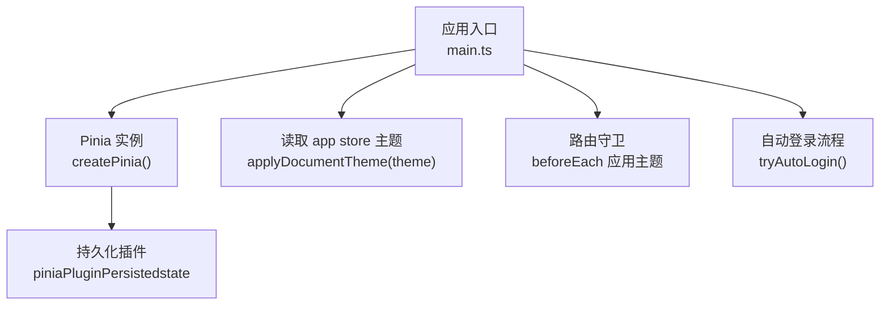
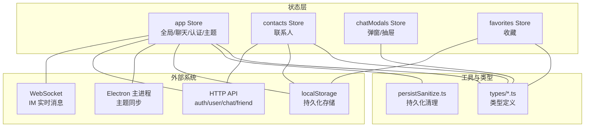
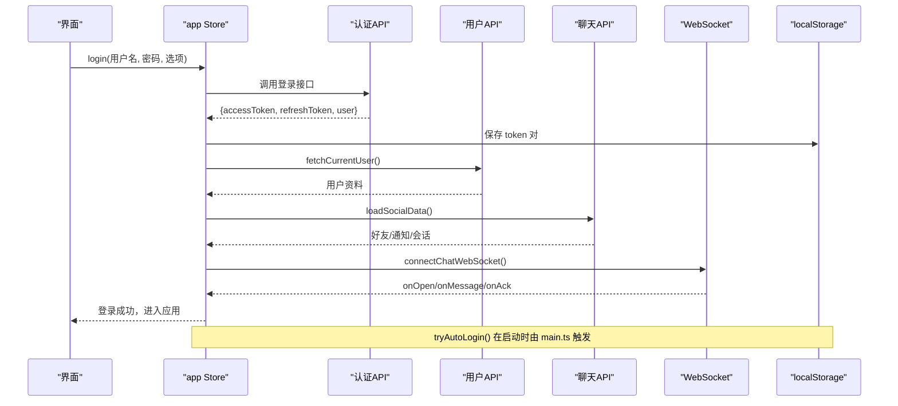
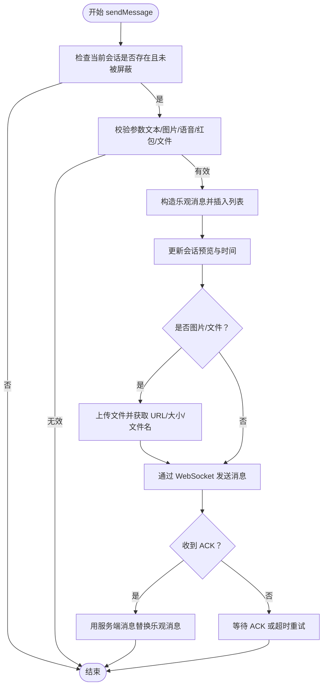
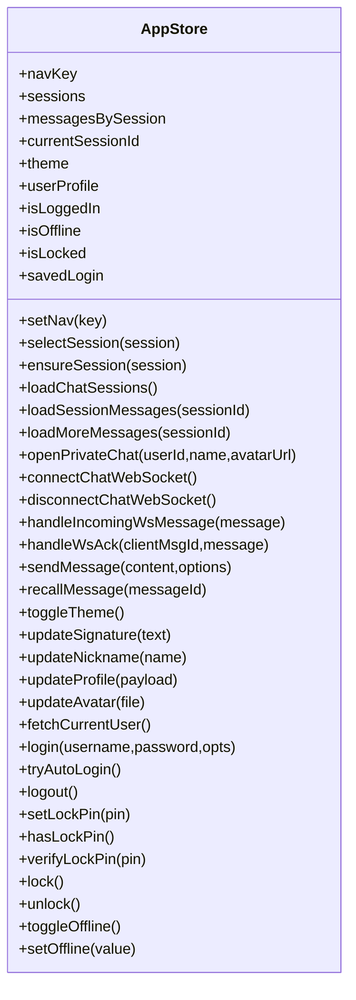
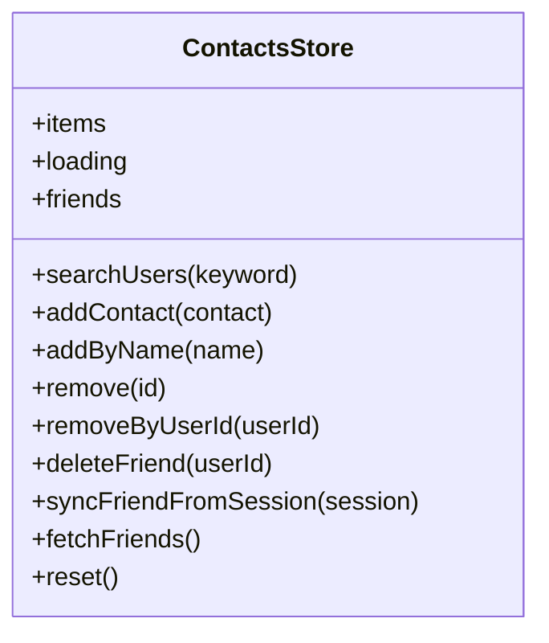
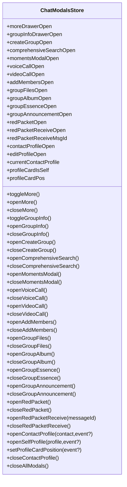
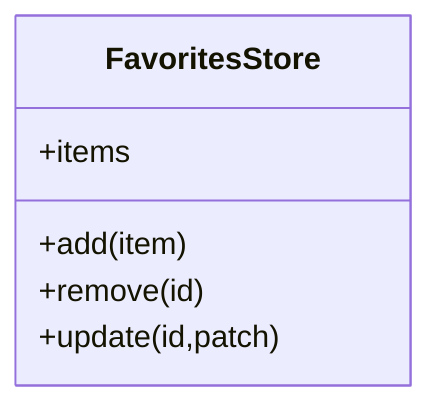
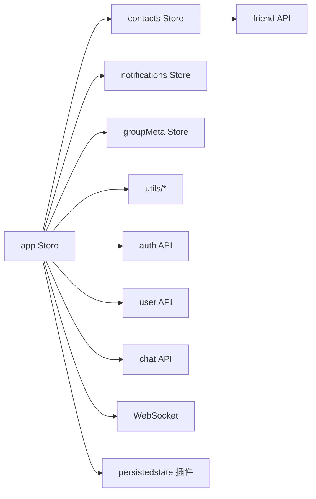

# 状态管理系统

<cite>
**本文引用的文件**   
- [main.ts](file://linkx-client/src/main.ts)
- [app.ts](file://linkx-client/src/stores/app.ts)
- [contacts.ts](file://linkx-client/src/stores/contacts.ts)
- [chatModals.ts](file://linkx-client/src/stores/chatModals.ts)
- [favorites.ts](file://linkx-client/src/stores/favorites.ts)
- [persist.d.ts](file://linkx-client/src/stores/persist.d.ts)
- [persistSanitize.ts](file://linkx-client/src/utils/persistSanitize.ts)
- [package.json](file://linkx-client/package.json)
</cite>

## 目录
1. [简介](#简介)
2. [项目结构](#项目结构)
3. [核心组件](#核心组件)
4. [架构总览](#架构总览)
5. [详细组件分析](#详细组件分析)
6. [依赖关系分析](#依赖关系分析)
7. [性能考虑](#性能考虑)
8. [故障排查指南](#故障排查指南)
9. [结论](#结论)
10. [附录](#附录)

## 简介
本技术文档聚焦于 LinkX 前端基于 Pinia 的模块化状态管理设计，围绕以下目标展开：
- Store 组织结构与职责划分：app、contacts、chatModals、favorites 等
- 状态持久化策略：pinia-plugin-persistedstate + 自定义序列化清理
- 跨组件状态共享机制：Pinia 全局实例 + 多窗口主题联动
- 响应式数据绑定、异步状态更新与错误处理策略
- 最佳实践与性能优化建议（含具体使用模式）

## 项目结构
本项目采用“按领域拆分 Store”的组织方式，每个业务域一个独立 Store 文件，便于维护与测试。关键入口在应用启动时创建 Pinia 并注册持久化插件，随后根据持久化的主题进行初始化，并在路由切换前统一应用主题。

图表来源
- [main.ts:21-31](file://linkx-client/src/main.ts#L21-L31)
- [main.ts:33-56](file://linkx-client/src/main.ts#L33-L56)
- [main.ts:61-63](file://linkx-client/src/main.ts#L61-L63)

章节来源
- [main.ts:1-64](file://linkx-client/src/main.ts#L1-L64)

## 核心组件
- app Store：应用全局状态（导航、会话、消息、主题、用户资料、锁屏、离线态）、聊天生命周期、WebSocket 收发、登录/登出、头像与签名更新、历史消息分页加载、乐观发送与 ACK 替换等
- contacts Store：联系人列表、好友搜索、从会话同步联系人、删除好友
- chatModals Store：聊天相关弹层与抽屉开关、联系人资料卡展示与定位
- favorites Store：收藏项增删改、本地持久化

章节来源
- [app.ts:128-163](file://linkx-client/src/stores/app.ts#L128-L163)
- [contacts.ts:26-42](file://linkx-client/src/stores/contacts.ts#L26-L42)
- [chatModals.ts:12-35](file://linkx-client/src/stores/chatModals.ts#L12-L35)
- [favorites.ts:19-23](file://linkx-client/src/stores/favorites.ts#L19-L23)

## 架构总览
下图展示了各 Store 的职责边界与交互关系，以及持久化与外部系统（HTTP/WebSocket/Electron）的集成点。

图表来源
- [app.ts:128-163](file://linkx-client/src/stores/app.ts#L128-L163)
- [app.ts:1137-1154](file://linkx-client/src/stores/app.ts#L1137-L1154)
- [persistSanitize.ts:48-57](file://linkx-client/src/utils/persistSanitize.ts#L48-L57)
- [contacts.ts:123-127](file://linkx-client/src/stores/contacts.ts#L123-L127)
- [favorites.ts:59-64](file://linkx-client/src/stores/favorites.ts#L59-L64)

## 详细组件分析

### app Store 分析
职责范围
- 全局导航与会话管理：选择会话、确保会话存在、置顶/免打扰/拉黑/删除/清空消息
- 聊天消息：历史加载、向上翻页、WebSocket 推送处理、ACK 替换、撤回、红包标记已领取
- 认证与用户资料：登录、自动登录（Refresh Token）、登出、更新昵称/签名/头像、获取当前用户
- 主题与锁屏：明暗主题切换并同步到 DOM 与 Electron；PIN 设置与校验、锁屏/解锁
- 离线态：WebSocket 连接状态映射为 isOffline
- 持久化：仅持久化必要字段，并通过 sanitize 清理大体积图片与临时 URL

关键流程（登录与自动登录）

图表来源
- [app.ts:973-1003](file://linkx-client/src/stores/app.ts#L973-L1003)
- [app.ts:1008-1045](file://linkx-client/src/stores/app.ts#L1008-L1045)
- [app.ts:339-347](file://linkx-client/src/stores/app.ts#L339-L347)
- [app.ts:448-470](file://linkx-client/src/stores/app.ts#L448-L470)
- [main.ts:37-43](file://linkx-client/src/main.ts#L37-L43)
- [main.ts:61-63](file://linkx-client/src/main.ts#L61-L63)

消息发送流程（真实会话）

图表来源
- [app.ts:617-635](file://linkx-client/src/stores/app.ts#L617-L635)
- [app.ts:638-749](file://linkx-client/src/stores/app.ts#L638-L749)
- [app.ts:504-523](file://linkx-client/src/stores/app.ts#L504-L523)

类图（app Store 主要方法与状态）

图表来源
- [app.ts:128-163](file://linkx-client/src/stores/app.ts#L128-L163)
- [app.ts:190-247](file://linkx-client/src/stores/app.ts#L190-L247)
- [app.ts:340-414](file://linkx-client/src/stores/app.ts#L340-L414)
- [app.ts:448-523](file://linkx-client/src/stores/app.ts#L448-L523)
- [app.ts:617-749](file://linkx-client/src/stores/app.ts#L617-L749)
- [app.ts:854-919](file://linkx-client/src/stores/app.ts#L854-L919)
- [app.ts:938-1045](file://linkx-client/src/stores/app.ts#L938-L1045)
- [app.ts:1047-1085](file://linkx-client/src/stores/app.ts#L1047-L1085)

章节来源
- [app.ts:128-163](file://linkx-client/src/stores/app.ts#L128-L163)
- [app.ts:190-247](file://linkx-client/src/stores/app.ts#L190-L247)
- [app.ts:340-414](file://linkx-client/src/stores/app.ts#L340-L414)
- [app.ts:448-523](file://linkx-client/src/stores/app.ts#L448-L523)
- [app.ts:617-749](file://linkx-client/src/stores/app.ts#L617-L749)
- [app.ts:854-919](file://linkx-client/src/stores/app.ts#L854-L919)
- [app.ts:938-1045](file://linkx-client/src/stores/app.ts#L938-L1045)
- [app.ts:1047-1085](file://linkx-client/src/stores/app.ts#L1047-L1085)
- [app.ts:1137-1154](file://linkx-client/src/stores/app.ts#L1137-L1154)

### contacts Store 分析
职责范围
- 联系人列表维护、按名称搜索
- 从会话同步联系人（演示逻辑）
- 删除好友（调用后端 API）
- 持久化联系人列表

图表来源
- [contacts.ts:26-42](file://linkx-client/src/stores/contacts.ts#L26-L42)
- [contacts.ts:44-121](file://linkx-client/src/stores/contacts.ts#L44-L121)

章节来源
- [contacts.ts:26-42](file://linkx-client/src/stores/contacts.ts#L26-L42)
- [contacts.ts:44-121](file://linkx-client/src/stores/contacts.ts#L44-L121)
- [contacts.ts:123-127](file://linkx-client/src/stores/contacts.ts#L123-L127)

### chatModals Store 分析
职责范围
- 统一管理聊天界面中的各类弹层与抽屉开关
- 联系人资料卡显示与定位（跟随鼠标或居中）
- 一键关闭所有聊天相关弹层

图表来源
- [chatModals.ts:12-35](file://linkx-client/src/stores/chatModals.ts#L12-L35)
- [chatModals.ts:39-248](file://linkx-client/src/stores/chatModals.ts#L39-L248)

章节来源
- [chatModals.ts:12-35](file://linkx-client/src/stores/chatModals.ts#L12-L35)
- [chatModals.ts:39-248](file://linkx-client/src/stores/chatModals.ts#L39-L248)

### favorites Store 分析
职责范围
- 收藏项新增（头部插入）、删除、部分更新
- 持久化收藏列表

图表来源
- [favorites.ts:19-23](file://linkx-client/src/stores/favorites.ts#L19-L23)
- [favorites.ts:25-57](file://linkx-client/src/stores/favorites.ts#L25-L57)
- [favorites.ts:59-64](file://linkx-client/src/stores/favorites.ts#L59-L64)

章节来源
- [favorites.ts:19-23](file://linkx-client/src/stores/favorites.ts#L19-L23)
- [favorites.ts:25-57](file://linkx-client/src/stores/favorites.ts#L25-L57)
- [favorites.ts:59-64](file://linkx-client/src/stores/favorites.ts#L59-L64)

## 依赖关系分析
- 模块耦合
  - app Store 依赖 contacts、notifications、groupMeta 等其它 Store 以完成社交数据聚合与群成员元数据更新
  - app Store 依赖 utils 工具（chatMapper、chatSocket、themeSync、persistSanitize、tokenStorage、lockPin、validation）
  - contacts Store 依赖 friend API
  - favorites Store 无外部依赖，纯本地持久化
- 外部依赖
  - pinia-plugin-persistedstate 提供持久化能力
  - WebSocket 用于 IM 实时消息
  - HTTP API 用于认证、用户资料、聊天会话与消息、好友管理等

图表来源
- [app.ts:26-45](file://linkx-client/src/stores/app.ts#L26-L45)
- [contacts.ts:9](file://linkx-client/src/stores/contacts.ts#L9)
- [package.json:20-23](file://linkx-client/package.json#L20-L23)

章节来源
- [app.ts:26-45](file://linkx-client/src/stores/app.ts#L26-L45)
- [contacts.ts:9](file://linkx-client/src/stores/contacts.ts#L9)
- [package.json:20-23](file://linkx-client/package.json#L20-L23)

## 性能考虑
- 持久化体积控制
  - 针对大体积 base64 图片与 blob URL 做清理，避免 localStorage 超限
  - 仅持久化必要字段，减少序列化开销
- 消息列表渲染
  - 懒加载历史消息，按需分页加载更早消息
  - 使用 Set 去重，避免重复消息导致渲染抖动
- 响应式更新粒度
  - 局部更新（如 $patch）减少不必要的重渲染
- 网络与并发
  - 登录成功后并行拉取好友、通知与会话，缩短首屏等待
- 主题同步
  - 监听多窗口主题变更，避免重复计算与样式漂移

章节来源
- [persistSanitize.ts:13-41](file://linkx-client/src/utils/persistSanitize.ts#L13-L41)
- [persistSanitize.ts:48-57](file://linkx-client/src/utils/persistSanitize.ts#L48-L57)
- [app.ts:364-414](file://linkx-client/src/stores/app.ts#L364-L414)
- [app.ts:339-347](file://linkx-client/src/stores/app.ts#L339-L347)
- [main.ts:44-51](file://linkx-client/src/main.ts#L44-L51)

## 故障排查指南
- 登录失败
  - 检查认证 API 返回码与 message
  - 确认 token 是否正确保存到本地存储
  - 自动登录失败会清除本地 token 并重置自动登录标志
- WebSocket 异常
  - 非 401 错误会记录警告日志
  - 断线后 isOffline 置位，需提示用户网络状态
- 消息发送失败
  - 文件上传失败会抛出错误并移除乐观消息
  - 若未建立连接，会自动尝试重连
- 持久化异常
  - 大图片被替换为占位符，刷新后需重新拉取或再次发送
  - blob URL 会被清理，刷新后不可用

章节来源
- [app.ts:973-1003](file://linkx-client/src/stores/app.ts#L973-L1003)
- [app.ts:1008-1045](file://linkx-client/src/stores/app.ts#L1008-L1045)
- [app.ts:458-469](file://linkx-client/src/stores/app.ts#L458-L469)
- [app.ts:742-748](file://linkx-client/src/stores/app.ts#L742-L748)
- [persistSanitize.ts:13-41](file://linkx-client/src/utils/persistSanitize.ts#L13-L41)

## 结论
LinkX 的状态管理以 Pinia 为核心，采用按领域拆分的 Store 组织方式，结合 pinia-plugin-persistedstate 实现细粒度的持久化策略。app Store 承担全局与聊天核心逻辑，通过 WebSocket 与 HTTP API 协同工作；contacts、favorites 等 Store 专注各自领域并提供必要的持久化。整体架构清晰、职责明确，具备良好的可维护性与扩展性。

## 附录
- 持久化类型声明
  - 通过类型声明为 defineStore 的 options 增加 persist 配置项支持，允许布尔值或对象形式指定 key 与 paths
- 插件与依赖
  - package.json 中引入 pinia 与 pinia-plugin-persistedstate，作为状态管理与持久化的基础依赖

章节来源
- [persist.d.ts:1-20](file://linkx-client/src/stores/persist.d.ts#L1-L20)
- [package.json:20-23](file://linkx-client/package.json#L20-L23)