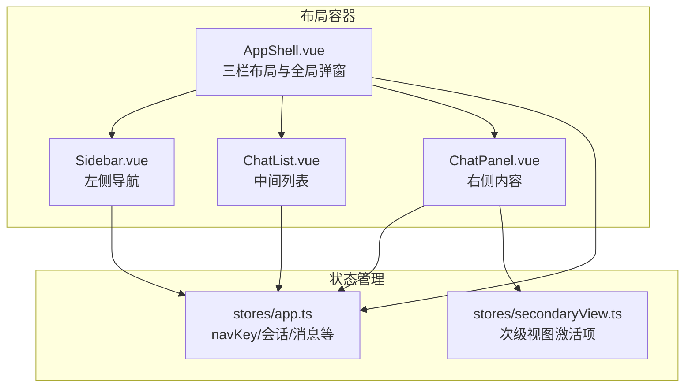
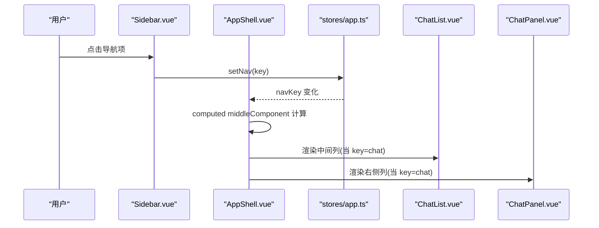
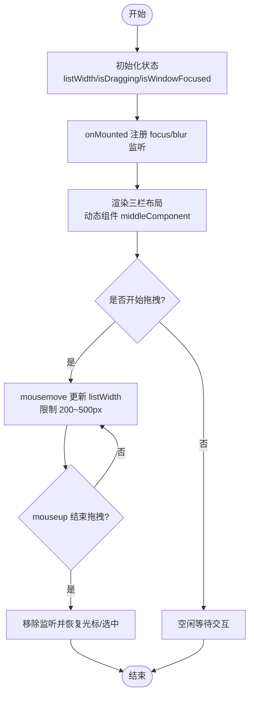
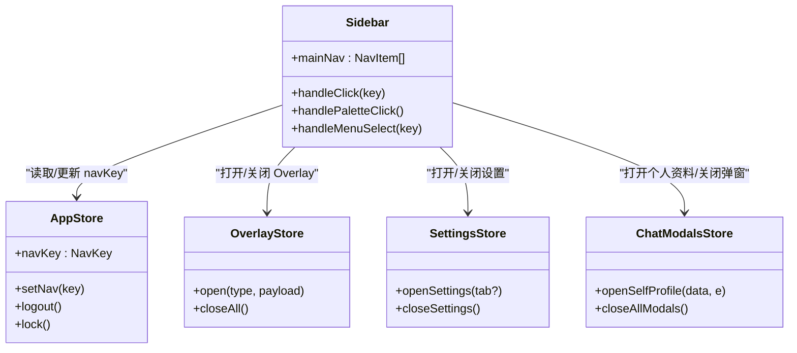
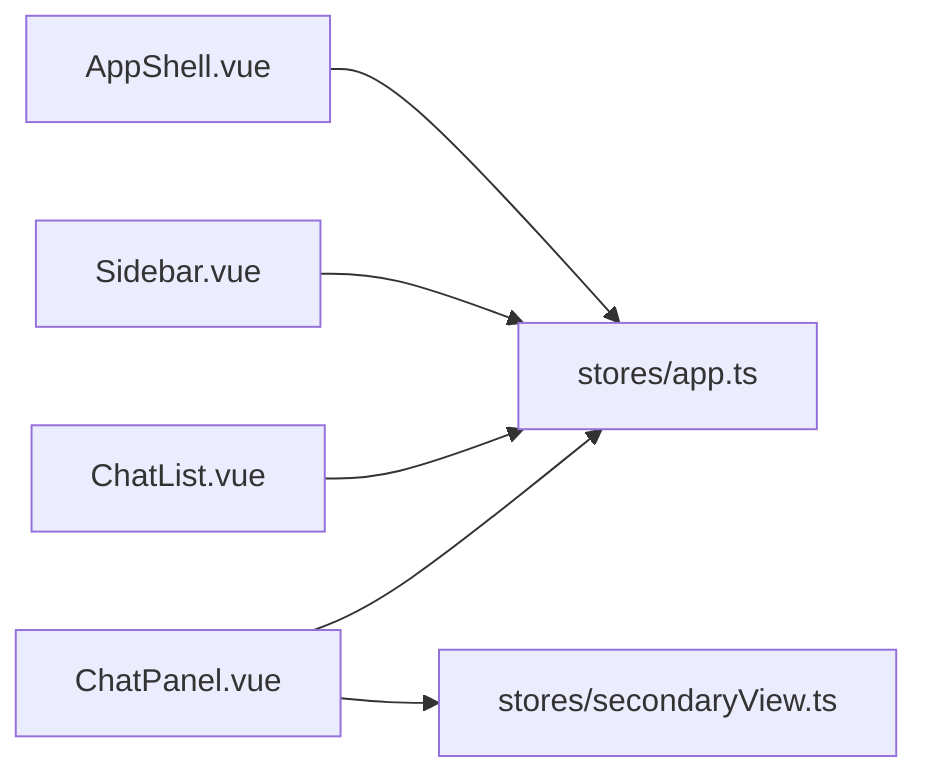

# 布局组件

<cite>
**本文引用的文件**   
- [AppShell.vue](file://linkx-client/src/components/AppShell.vue)
- [Sidebar.vue](file://linkx-client/src/components/Sidebar.vue)
- [ChatList.vue](file://linkx-client/src/components/ChatList.vue)
- [ChatPanel.vue](file://linkx-client/src/components/ChatPanel.vue)
- [app.ts](file://linkx-client/src/stores/app.ts)
- [secondaryView.ts](file://linkx-client/src/stores/secondaryView.ts)
</cite>

## 目录
1. [简介](#简介)
2. [项目结构](#项目结构)
3. [核心组件](#核心组件)
4. [架构总览](#架构总览)
5. [详细组件分析](#详细组件分析)
6. [依赖关系分析](#依赖关系分析)
7. [性能考量](#性能考量)
8. [故障排查指南](#故障排查指南)
9. [结论](#结论)
10. [附录：配置与扩展示例](#附录配置与扩展示例)

## 简介
本文件聚焦 LinkX 前端应用中的布局体系，围绕 AppShell 主壳层组件的三栏布局（左侧导航、中间列表、右侧内容）进行系统化说明。文档涵盖以下主题：
- 三栏布局策略与响应式处理
- Sidebar 侧边栏的导航逻辑、图标管理与状态同步
- 窗口焦点管理（用于原生材质等效果）
- 列宽拖拽调整实现细节
- 动态组件加载策略（含异步懒加载）
- 样式隔离方案
- 布局配置示例与自定义扩展方法
- 性能优化建议与最佳实践

## 项目结构
布局相关的前端代码集中在 linkx-client/src/components 与 linkx-client/src/stores 下。其中：
- AppShell.vue 作为应用主壳层，组织三栏布局与全局弹窗挂载
- Sidebar.vue 提供左侧导航与更多菜单
- ChatList.vue 为聊天会话列表（中间列默认视图）
- ChatPanel.vue 为聊天主面板（右侧列默认视图）
- app.ts 维护全局导航键 navKey 与当前会话等核心状态
- secondaryView.ts 管理次级视图激活项（如内嵌 WebView 打开的应用或收藏项）

图表来源
- [AppShell.vue:1-345](file://linkx-client/src/components/AppShell.vue#L1-L345)
- [Sidebar.vue:1-355](file://linkx-client/src/components/Sidebar.vue#L1-L355)
- [ChatList.vue:1-378](file://linkx-client/src/components/ChatList.vue#L1-L378)
- [ChatPanel.vue:1-986](file://linkx-client/src/components/ChatPanel.vue#L1-L986)
- [app.ts:1-1156](file://linkx-client/src/stores/app.ts#L1-L1156)
- [secondaryView.ts:1-22](file://linkx-client/src/stores/secondaryView.ts#L1-L22)

章节来源
- [AppShell.vue:1-345](file://linkx-client/src/components/AppShell.vue#L1-L345)
- [Sidebar.vue:1-355](file://linkx-client/src/components/Sidebar.vue#L1-L355)
- [ChatList.vue:1-378](file://linkx-client/src/components/ChatList.vue#L1-L378)
- [ChatPanel.vue:1-986](file://linkx-client/src/components/ChatPanel.vue#L1-L986)
- [app.ts:1-1156](file://linkx-client/src/stores/app.ts#L1-L1156)
- [secondaryView.ts:1-22](file://linkx-client/src/stores/secondaryView.ts#L1-L22)

## 核心组件
- AppShell 主壳层
  - 负责三栏布局渲染、中间列宽度拖拽、窗口焦点监听、全局弹窗挂载与动态组件切换
- Sidebar 侧边栏
  - 提供主导航按钮组、个人头像入口、主题快捷入口与更多菜单；通过 Pinia 更新 navKey 驱动 AppShell 动态组件
- ChatList 聊天列表
  - 展示会话列表、搜索过滤、右键菜单（置顶/免打扰/删除）、虚拟滚动
- ChatPanel 聊天主面板
  - 展示消息列表、输入框、群/好友顶栏操作、语音播放、文件拖放、消息右键菜单等

章节来源
- [AppShell.vue:1-345](file://linkx-client/src/components/AppShell.vue#L1-L345)
- [Sidebar.vue:1-355](file://linkx-client/src/components/Sidebar.vue#L1-L355)
- [ChatList.vue:1-378](file://linkx-client/src/components/ChatList.vue#L1-L378)
- [ChatPanel.vue:1-986](file://linkx-client/src/components/ChatPanel.vue#L1-L986)

## 架构总览
AppShell 作为布局中枢，依据 navKey 决定中间列与右侧列的动态组件。Sidebar 通过 setNav 修改 navKey，从而触发 AppShell 的 computed 计算属性重新选择组件。同时，AppShell 在挂载时注册窗口 focus/blur 事件以控制 isWindowFocused 状态，影响原生材质表现。

图表来源
- [Sidebar.vue:100-119](file://linkx-client/src/components/Sidebar.vue#L100-L119)
- [app.ts:195-200](file://linkx-client/src/stores/app.ts#L195-L200)
- [AppShell.vue:137-166](file://linkx-client/src/components/AppShell.vue#L137-L166)
- [AppShell.vue:184-201](file://linkx-client/src/components/AppShell.vue#L184-L201)

## 详细组件分析

### AppShell 主壳层组件
- 三栏布局策略
  - 左侧固定宽度侧栏（CSS 变量控制），中间列表列宽度可拖拽调整，右侧内容区自适应填充
  - 使用 Flexbox 行布局，content-wrapper 内部按 col-list、resizer、col-chat 顺序排列
- 响应式处理
  - 通过 CSS 变量与 flex 布局实现自适应；未引入媒体查询断点，主要依赖弹性布局与最小/最大宽度约束
- 窗口焦点管理
  - 监听 window focus/blur，设置 isWindowFocused，配合 .is-focused 类名用于原生材质背景
- 列宽拖拽调整
  - 鼠标按下 resizer 后，document 级别监听 mousemove/mouseup，根据 clientX 减去 SIDEBAR_WIDTH 计算新宽度，限制在 200~500px
- 动态组件加载策略
  - 中间列通过 computed middleComponent 返回对应组件引用，模板中使用 <component :is="middleComponent"/> 动态渲染
  - 大量弹窗组件使用 defineAsyncComponent 异步懒加载，减小首屏包体积
- 样式隔离方案
  - 所有样式使用 scoped，避免污染全局；通过 CSS 变量统一主题色与尺寸

图表来源
- [AppShell.vue:76-135](file://linkx-client/src/components/AppShell.vue#L76-L135)
- [AppShell.vue:137-166](file://linkx-client/src/components/AppShell.vue#L137-L166)
- [AppShell.vue:184-201](file://linkx-client/src/components/AppShell.vue#L184-L201)
- [AppShell.vue:229-344](file://linkx-client/src/components/AppShell.vue#L229-L344)

章节来源
- [AppShell.vue:1-345](file://linkx-client/src/components/AppShell.vue#L1-L345)

### Sidebar 侧边栏组件
- 导航逻辑
  - mainNav 定义导航项（消息、联系人、收藏、文件、日历、应用、友链），点击调用 setNav 更新 navKey
  - 特殊处理：
    - 友链：Electron 环境调用 openMoments 打开独立窗口，浏览器环境则切换导航
    - 文件：进入 files 导航
- 图标管理
  - 使用 Ionicons5 图标库，通过 NIcon 渲染；下拉菜单图标通过 renderIcon 工厂函数生成
- 状态同步机制
  - 通过 storeToRefs 解构 navKey/userProfile/savedLogin，结合 actions（setNav/logout/lock）与多个 Store（chatModals/settings/overlay）协同完成 UI 联动
- 更多菜单
  - 包含聊天记录管理、检查更新、帮助、锁定、设置、退出账号等选项；为避免 dropdown 关闭清理与 Modal/Overlay 冲突，使用 setTimeout 延迟执行

图表来源
- [Sidebar.vue:90-119](file://linkx-client/src/components/Sidebar.vue#L90-L119)
- [Sidebar.vue:126-147](file://linkx-client/src/components/Sidebar.vue#L126-L147)
- [Sidebar.vue:150-193](file://linkx-client/src/components/Sidebar.vue#L150-L193)
- [app.ts:195-200](file://linkx-client/src/stores/app.ts#L195-L200)

章节来源
- [Sidebar.vue:1-355](file://linkx-client/src/components/Sidebar.vue#L1-L355)
- [app.ts:195-200](file://linkx-client/src/stores/app.ts#L195-L200)

### ChatList 聊天列表组件
- 功能要点
  - 顶部搜索栏支持关键词过滤
  - 离线提示横幅
  - 虚拟滚动提升长列表性能
  - 右键菜单：置顶/免打扰/删除
  - 添加按钮下拉：发起群聊/添加好友或群聊
- 数据绑定
  - 从 appStore 获取 sortedSessions/currentSessionId/isLoading/isOffline，调用 selectSession/toggleSessionPin/toggleSessionMute/deleteSession 等方法

章节来源
- [ChatList.vue:1-378](file://linkx-client/src/components/ChatList.vue#L1-L378)
- [app.ts:165-188](file://linkx-client/src/stores/app.ts#L165-L188)

### ChatPanel 聊天主面板组件
- 功能要点
  - 区分好友单聊与群聊顶栏，支持语音/视频通话、更多抽屉、群应用网格菜单
  - 消息区域支持虚拟滚动、历史消息上拉加载更多、复制/收藏/回复/撤回
  - 文件拖放发送、图片预览、红包领取
  - 语音播放控制与自动停止上一段
- 数据绑定
  - 从 appStore 获取 currentSession/currentMessages/currentSessionId，调用 recallMessage/loadMoreMessages 等
  - 通过 overlayStore/chatModalsStore 打开各类全屏/抽屉/弹窗

章节来源
- [ChatPanel.vue:1-986](file://linkx-client/src/components/ChatPanel.vue#L1-L986)
- [app.ts:814-838](file://linkx-client/src/stores/app.ts#L814-L838)

## 依赖关系分析
- 组件到 Store 的依赖
  - AppShell 依赖 appStore 的 navKey 与 chatModalsStore 的 momentsModalOpen
  - Sidebar 依赖 appStore/navKey/actions、settingsStore、overlayStore、chatModalsStore
  - ChatList/ChatPanel 依赖 appStore 的会话与消息状态及操作方法
- 组件间耦合
  - AppShell 通过 computed 与 <component :is> 松耦合地组合中间列与右侧列组件
  - Sidebar 仅通过 setNav 与 AppShell 通信，不直接引用具体中间/右侧组件

图表来源
- [AppShell.vue:58-71](file://linkx-client/src/components/AppShell.vue#L58-L71)
- [Sidebar.vue:46-60](file://linkx-client/src/components/Sidebar.vue#L46-L60)
- [ChatList.vue:24-43](file://linkx-client/src/components/ChatList.vue#L24-L43)
- [ChatPanel.vue:55-93](file://linkx-client/src/components/ChatPanel.vue#L55-L93)
- [secondaryView.ts:14-21](file://linkx-client/src/stores/secondaryView.ts#L14-L21)

章节来源
- [AppShell.vue:58-71](file://linkx-client/src/components/AppShell.vue#L58-L71)
- [Sidebar.vue:46-60](file://linkx-client/src/components/Sidebar.vue#L46-L60)
- [ChatList.vue:24-43](file://linkx-client/src/components/ChatList.vue#L24-L43)
- [ChatPanel.vue:55-93](file://linkx-client/src/components/ChatPanel.vue#L55-L93)
- [secondaryView.ts:14-21](file://linkx-client/src/stores/secondaryView.ts#L14-L21)

## 性能考量
- 虚拟滚动
  - ChatList 与 ChatPanel 的消息列表均使用 NVirtualList，显著降低大数据量下的渲染开销
- 异步懒加载
  - AppShell 中大量弹窗组件使用 defineAsyncComponent，减少首屏包体与初始渲染时间
- 拖拽性能
  - 拖拽过程中仅更新 listWidth 数值，避免重排其他区域；使用 document 级别监听确保跨元素移动稳定
- 历史消息增量加载
  - ChatPanel 在滚动到顶部时按需加载更早消息，避免一次性加载全部历史
- 资源释放
  - onUnmounted 中清理语音 Audio 实例与事件监听，防止内存泄漏

[本节为通用性能指导，无需特定文件引用]

## 故障排查指南
- 拖拽无效或卡顿
  - 确认 resizer 的 mousedown 已触发 startDrag，且 document 的 mousemove/mouseup 监听已正确注册与移除
  - 检查 body 的 cursor 与 userSelect 样式是否在 stopDrag 中恢复
- 导航切换无响应
  - 检查 Sidebar 的 handleClick/setNav 是否正确调用，navKey 是否被更新
  - 确认 AppShell 的 computed middleComponent 分支覆盖目标 key
- 弹窗遮挡或点击穿透
  - Sidebar 的更多菜单使用 setTimeout 延迟执行以避免 dropdown 关闭清理未完成导致的监听器泄漏
- 语音播放异常
  - 检查 ChatPanel 的 playingVoiceId 与 Audio 实例生命周期，确保 onUnmounted 中 pause

章节来源
- [AppShell.vue:94-135](file://linkx-client/src/components/AppShell.vue#L94-L135)
- [Sidebar.vue:145-147](file://linkx-client/src/components/Sidebar.vue#L145-L147)
- [ChatPanel.vue:242-245](file://linkx-client/src/components/ChatPanel.vue#L242-L245)

## 结论
LinkX 的布局体系以 AppShell 为核心，采用三栏 Flex 布局与动态组件组合，结合 Pinia 的状态驱动与 Vue 的 computed 机制，实现了高内聚低耦合的界面架构。Sidebar 通过统一的导航键与多 Store 协作，完成复杂交互；ChatList 与 ChatPanel 借助虚拟滚动与增量加载保障性能。整体方案具备良好的可扩展性与可维护性。

[本节为总结性内容，无需特定文件引用]

## 附录：配置与扩展示例

- 布局配置示例
  - 侧栏宽度：通过 CSS 变量 --lx-sidebar-width 控制（见 AppShell 样式）
  - 中间列宽度范围：拖拽逻辑限制 200~500px（见 AppShell 拖拽函数）
  - 动态组件映射：在 AppShell 的 middleComponent computed 中添加新的 case 与组件引用即可扩展中间列视图

- 自定义扩展方法
  - 新增导航项
    - 在 Sidebar 的 mainNav 数组中增加一项（key/icon/label）
    - 在 AppShell 的 middleComponent 与 showPlaceholder/showChatPanel 等 computed 中补充对应分支
  - 新增右侧主视图
    - 在 AppShell 的右侧列条件渲染处添加 v-if/v-else-if 分支，引入新组件
  - 新增弹窗组件
    - 使用 defineAsyncComponent 在 AppShell 中声明，并在模板中挂载
  - 次级视图扩展
    - 在 secondaryView Store 中扩展 activeApp/activeFavorite/activeFile 的类型与逻辑，并在需要展示的组件中订阅

章节来源
- [AppShell.vue:137-166](file://linkx-client/src/components/AppShell.vue#L137-L166)
- [AppShell.vue:184-201](file://linkx-client/src/components/AppShell.vue#L184-L201)
- [Sidebar.vue:90-98](file://linkx-client/src/components/Sidebar.vue#L90-L98)
- [secondaryView.ts:14-21](file://linkx-client/src/stores/secondaryView.ts#L14-L21)