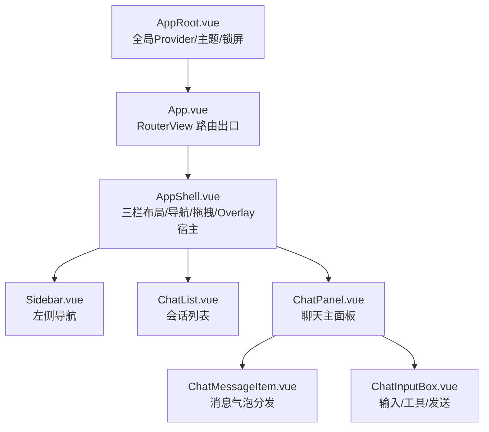
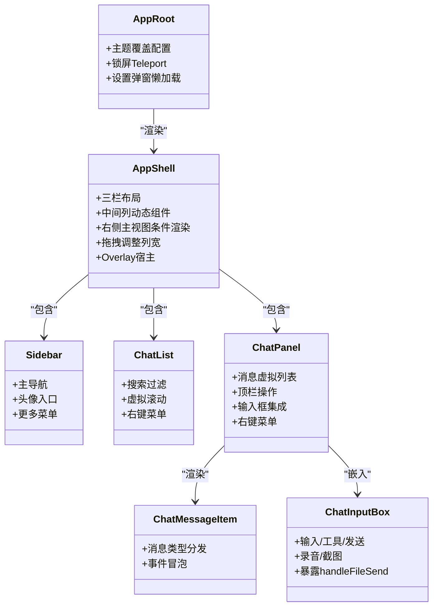
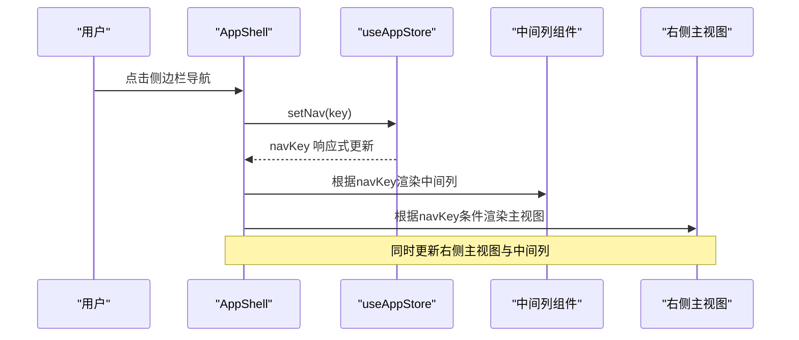
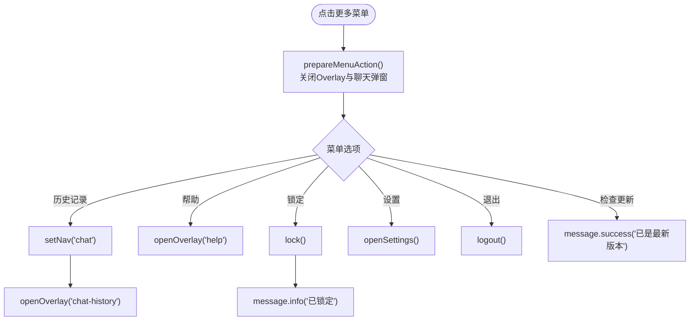
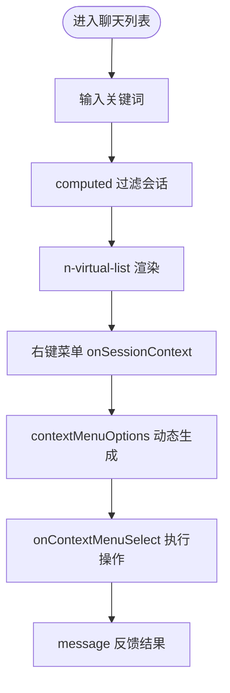
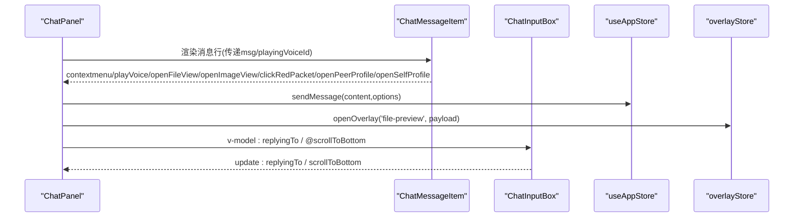
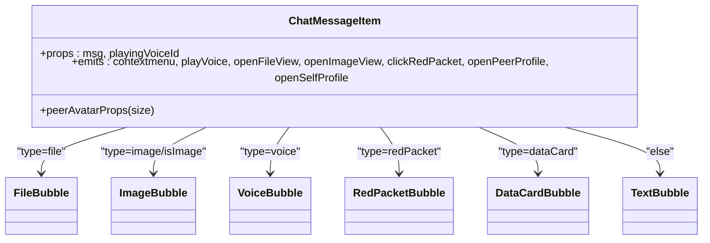
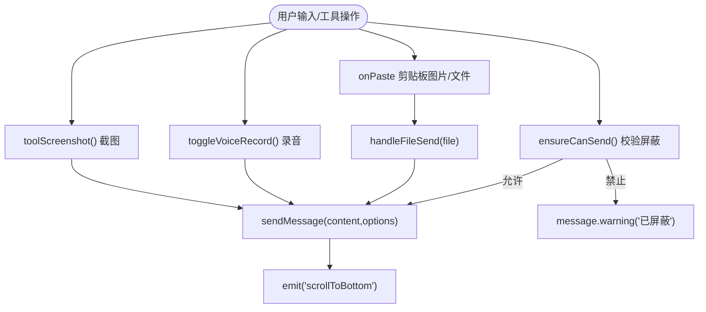
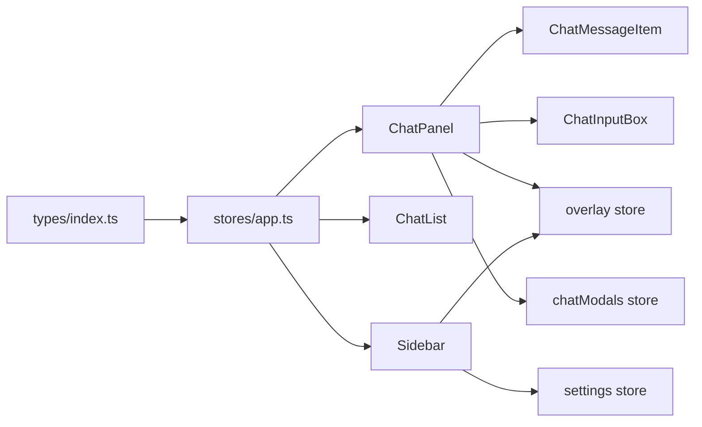

# 组件系统设计

<cite>
**本文引用的文件**   
- [AppRoot.vue](file://linkx-client/src/AppRoot.vue)
- [App.vue](file://linkx-client/src/App.vue)
- [AppShell.vue](file://linkx-client/src/components/AppShell.vue)
- [Sidebar.vue](file://linkx-client/src/components/Sidebar.vue)
- [ChatList.vue](file://linkx-client/src/components/ChatList.vue)
- [ChatPanel.vue](file://linkx-client/src/components/ChatPanel.vue)
- [ChatMessageItem.vue](file://linkx-client/src/components/chat/ChatMessageItem.vue)
- [ChatInputBox.vue](file://linkx-client/src/components/chat/ChatInputBox.vue)
- [app.ts](file://linkx-client/src/stores/app.ts)
- [index.ts](file://linkx-client/src/types/index.ts)
</cite>

## 目录
1. [简介](#简介)
2. [项目结构](#项目结构)
3. [核心组件](#核心组件)
4. [架构总览](#架构总览)
5. [详细组件分析](#详细组件分析)
6. [依赖关系分析](#依赖关系分析)
7. [性能与体验优化](#性能与体验优化)
8. [故障排查指南](#故障排查指南)
9. [结论](#结论)
10. [附录：开发规范与最佳实践](#附录开发规范与最佳实践)

## 简介
本文件面向 LinkX 前端（Vue 3 + TypeScript）的组件系统，聚焦于基于 Vue 3 的组件化架构设计。文档围绕以下目标展开：
- 描述组件层次结构与职责划分
- 解释三栏布局主壳层 AppShell、侧边栏 Sidebar、聊天列表 ChatList、聊天面板 ChatPanel 等核心组件的功能与交互
- 总结组件间通信模式（Props/Events）、插槽使用、组件复用策略与样式隔离方案
- 提供组件开发规范与最佳实践，并给出具体使用示例与自定义扩展方法

## 项目结构
LinkX 客户端采用“应用根容器 -> 路由出口 -> 应用主壳层 -> 功能模块面板”的分层组织方式：
- 应用根容器负责全局主题、消息与对话框 Provider、锁屏挂载
- 路由出口负责页面级切换与过渡动画
- 应用主壳层实现三栏布局与全局弹窗宿主
- 各功能面板（聊天、联系人、收藏、文件、日历、友链、应用）在中间列动态渲染，右侧为主内容区

图表来源
- [AppRoot.vue:1-105](file://linkx-client/src/AppRoot.vue#L1-L105)
- [App.vue:1-26](file://linkx-client/src/App.vue#L1-L26)
- [AppShell.vue:1-345](file://linkx-client/src/components/AppShell.vue#L1-L345)
- [Sidebar.vue:1-355](file://linkx-client/src/components/Sidebar.vue#L1-L355)
- [ChatList.vue:1-378](file://linkx-client/src/components/ChatList.vue#L1-L378)
- [ChatPanel.vue:1-986](file://linkx-client/src/components/ChatPanel.vue#L1-L986)
- [ChatMessageItem.vue:1-176](file://linkx-client/src/components/chat/ChatMessageItem.vue#L1-L176)
- [ChatInputBox.vue:1-749](file://linkx-client/src/components/chat/ChatInputBox.vue#L1-L749)

章节来源
- [AppRoot.vue:1-105](file://linkx-client/src/AppRoot.vue#L1-L105)
- [App.vue:1-26](file://linkx-client/src/App.vue#L1-L26)
- [AppShell.vue:1-345](file://linkx-client/src/components/AppShell.vue#L1-L345)

## 核心组件
本节概述关键组件的职责与协作关系，为后续深入分析奠定基础。

- AppRoot
  - 作用：应用根容器，注入 Naive UI 主题与全局提示/对话框 Provider，管理锁屏 Teleport 挂载
  - 关键点：根据主题计算覆盖配置；同步 HTML 与 Electron 主题；异步加载设置弹窗

- AppShell
  - 作用：应用主壳层，实现三栏布局（侧栏、列表、主内容），处理窗口焦点态、中间列宽度拖拽、动态渲染中间列组件与右侧主视图
  - 关键点：根据导航键选择中间列组件；控制右侧主内容区显示 ChatPanel/CalendarMainView/ContactsMainView/PlaceholderMainView；集中挂载各类弹窗与 OverlayHost

- Sidebar
  - 作用：左侧导航，提供主导航项、个人头像入口、主题快捷入口与更多菜单（设置、锁定、退出等）
  - 关键点：通过 Pinia 更新导航状态；Electron 环境下打开独立窗口；下拉菜单动作延迟执行避免 UI 卡死

- ChatList
  - 作用：会话列表，支持搜索过滤、虚拟滚动、右键菜单（置顶/免打扰/删除）、添加按钮（发起群聊/添加好友）
  - 关键点：计算属性过滤会话；右键菜单坐标定位；离线横幅提示

- ChatPanel
  - 作用：聊天主面板，展示当前会话消息、输入框与顶栏操作，支持语音播放、图片预览、文件拖放、消息右键菜单（复制/收藏/回复/撤回）
  - 关键点：按会话类型区分顶栏；消息虚拟列表与历史消息上拉加载；引用回复与滚动到底部；与 Overlay/Modals 联动

- ChatMessageItem
  - 作用：单条消息行，按类型分发到不同气泡子组件，统一事件向上传递
  - 关键点：props 传入消息体与正在播放语音 ID；emits 向上抛出上下文菜单、播放、打开文件/图片、红包、资料卡等事件

- ChatInputBox
  - 作用：聊天输入框，提供文本输入、表情、文件/图片发送、截图、语音录制、红包与快捷应用入口
  - 关键点：粘贴自动发送图片/文件；Enter 发送/Shift+Enter 换行；暴露 handleFileSend 供外部调用；录音资源清理

章节来源
- [AppRoot.vue:1-105](file://linkx-client/src/AppRoot.vue#L1-L105)
- [AppShell.vue:1-345](file://linkx-client/src/components/AppShell.vue#L1-L345)
- [Sidebar.vue:1-355](file://linkx-client/src/components/Sidebar.vue#L1-L355)
- [ChatList.vue:1-378](file://linkx-client/src/components/ChatList.vue#L1-L378)
- [ChatPanel.vue:1-986](file://linkx-client/src/components/ChatPanel.vue#L1-L986)
- [ChatMessageItem.vue:1-176](file://linkx-client/src/components/chat/ChatMessageItem.vue#L1-L176)
- [ChatInputBox.vue:1-749](file://linkx-client/src/components/chat/ChatInputBox.vue#L1-L749)

## 架构总览
整体架构遵循“容器-布局-业务面板-通用气泡/输入”分层：
- 容器层：AppRoot 提供全局能力（主题、消息、对话框、锁屏）
- 布局层：AppShell 承载三栏布局与全局弹窗宿主
- 业务层：Sidebar、ChatList、ChatPanel 等面板组件
- 通用层：ChatMessageItem、ChatInputBox 及气泡子组件

图表来源
- [AppRoot.vue:1-105](file://linkx-client/src/AppRoot.vue#L1-L105)
- [AppShell.vue:1-345](file://linkx-client/src/components/AppShell.vue#L1-L345)
- [Sidebar.vue:1-355](file://linkx-client/src/components/Sidebar.vue#L1-L355)
- [ChatList.vue:1-378](file://linkx-client/src/components/ChatList.vue#L1-L378)
- [ChatPanel.vue:1-986](file://linkx-client/src/components/ChatPanel.vue#L1-L986)
- [ChatMessageItem.vue:1-176](file://linkx-client/src/components/chat/ChatMessageItem.vue#L1-L176)
- [ChatInputBox.vue:1-749](file://linkx-client/src/components/chat/ChatInputBox.vue#L1-L749)

## 详细组件分析

### AppShell 三栏布局与交互
- 布局结构
  - 顶部状态栏 MainStatusBar
  - 左侧固定宽度侧栏 Sidebar
  - 中间可拖拽宽度列表列（ChatList 或 ContactsPanel/FavoritesPanel/FilesPanel/CalendarPanel/MomentsPanel/AppsPanel）
  - 右侧主内容区（ChatPanel/CalendarMainView/ContactsMainView/PlaceholderMainView）
- 交互逻辑
  - 中间列宽度拖拽：记录鼠标位置，限制最小/最大宽度，更新 listWidth
  - 窗口焦点监听：用于原生材质效果（Mica）
  - 动态组件渲染：根据 navKey 决定中间列组件
  - 右侧主视图条件渲染：根据 navKey 显示对应主视图
  - 全局弹窗集中挂载：创建群聊、综合搜索、音视频通话、群相关弹窗、个人资料、编辑资料、友链弹窗、OverlayHost

图表来源
- [AppShell.vue:137-200](file://linkx-client/src/components/AppShell.vue#L137-L200)
- [app.ts:190-206](file://linkx-client/src/stores/app.ts#L190-L206)

章节来源
- [AppShell.vue:1-345](file://linkx-client/src/components/AppShell.vue#L1-L345)
- [app.ts:190-206](file://linkx-client/src/stores/app.ts#L190-L206)

### Sidebar 侧边栏导航
- 功能要点
  - 主导航项：消息、联系人、收藏、文件、日历、应用、友链
  - 个人头像入口：打开个人资料卡片
  - 主题调色盘：关闭 Overlay 与设置后打开外观设置
  - 更多菜单：聊天记录管理、检查更新、帮助、锁定、设置、退出账号
- 交互细节
  - 友链在 Electron 下打开独立窗口，浏览器内切换导航
  - 更多菜单动作统一延迟执行，确保 dropdown 关闭清理完成，避免 UI 卡死
  - 登出前清理 Overlay 与聊天弹窗

图表来源
- [Sidebar.vue:135-193](file://linkx-client/src/components/Sidebar.vue#L135-L193)

章节来源
- [Sidebar.vue:1-355](file://linkx-client/src/components/Sidebar.vue#L1-L355)

### ChatList 聊天列表
- 功能要点
  - 搜索过滤：按名称与最后消息匹配
  - 虚拟滚动：n-virtual-list 提升长列表性能
  - 右键菜单：置顶/取消置顶、免打扰/取消免打扰、删除会话
  - 添加按钮：发起群聊、添加好友/群聊（综合搜索）
  - 离线横幅：WebSocket 断开时提示
- 交互细节
  - 选中会话：清除未读、确保消息数组存在、真实会话拉取历史
  - 右键菜单坐标定位：手动触发 n-dropdown

图表来源
- [ChatList.vue:53-123](file://linkx-client/src/components/ChatList.vue#L53-L123)

章节来源
- [ChatList.vue:1-378](file://linkx-client/src/components/ChatList.vue#L1-L378)

### ChatPanel 聊天面板
- 功能要点
  - 顶栏：好友聊天（头像、在线状态、语音/视频/更多）、群聊（群应用、邀请、更多）、我的手机等
  - 消息区域：虚拟列表、背景样式、历史消息上拉加载、右键菜单（复制/收藏/回复/撤回）
  - 输入框：文本、表情、文件/图片、截图、语音录制、红包、快捷应用
  - 侧边抽屉：好友更多、群成员侧栏、群信息抽屉
- 交互细节
  - 语音播放：Audio 实例管理，结束自动清除状态
  - 图片/文件预览：打开 Overlay 文件预览
  - 引用回复：设置 replyingTo 并聚焦输入框
  - 拖拽文件：dragover/dragleave/drop 显示遮罩并通过输入框发送
  - 滚动到底部：nextTick 后调用虚拟列表 scrollTo

图表来源
- [ChatPanel.vue:1-986](file://linkx-client/src/components/ChatPanel.vue#L1-L986)
- [ChatMessageItem.vue:1-176](file://linkx-client/src/components/chat/ChatMessageItem.vue#L1-L176)
- [ChatInputBox.vue:1-749](file://linkx-client/src/components/chat/ChatInputBox.vue#L1-L749)
- [app.ts:617-749](file://linkx-client/src/stores/app.ts#L617-L749)

章节来源
- [ChatPanel.vue:1-986](file://linkx-client/src/components/ChatPanel.vue#L1-L986)
- [ChatMessageItem.vue:1-176](file://linkx-client/src/components/chat/ChatMessageItem.vue#L1-L176)
- [ChatInputBox.vue:1-749](file://linkx-client/src/components/chat/ChatInputBox.vue#L1-L749)
- [app.ts:617-749](file://linkx-client/src/stores/app.ts#L617-L749)

### ChatMessageItem 消息气泡分发
- 职责：根据消息类型渲染对应气泡子组件（文件、图片、语音、红包、数据卡片、文本），统一事件向上传递
- Props/Events：
  - Props：msg、playingVoiceId
  - Events：contextmenu、playVoice、openFileView、openImageView、clickRedPacket、openPeerProfile、openSelfProfile

图表来源
- [ChatMessageItem.vue:1-176](file://linkx-client/src/components/chat/ChatMessageItem.vue#L1-L176)

章节来源
- [ChatMessageItem.vue:1-176](file://linkx-client/src/components/chat/ChatMessageItem.vue#L1-L176)

### ChatInputBox 输入与工具
- 职责：文本输入、表情、文件/图片发送、截图、语音录制、红包与快捷应用入口；支持回复预览、粘贴自动发送、Enter 发送
- Props/Events：
  - Props：isMyPhone、isFriendChat、isGroupChat、replyingTo
  - Events：update:replyingTo、scrollToBottom
- 对外暴露：handleFileSend（供父组件拖拽/外部调用）

图表来源
- [ChatInputBox.vue:113-384](file://linkx-client/src/components/chat/ChatInputBox.vue#L113-L384)

章节来源
- [ChatInputBox.vue:1-749](file://linkx-client/src/components/chat/ChatInputBox.vue#L1-L749)

## 依赖关系分析
- 组件耦合与内聚
  - AppShell 作为布局容器，低内聚地组合多个面板组件，通过 computed 与条件渲染解耦
  - ChatPanel 聚合消息渲染与输入逻辑，通过事件与 props 与子组件通信，保持高内聚
  - ChatMessageItem 仅负责类型分发与事件转发，职责单一
- 直接/间接依赖
  - 所有面板组件依赖 Pinia store（app、chatModals、overlay、contacts、favorites 等）
  - ChatPanel 依赖 ChatMessageItem 与 ChatInputBox
  - Sidebar 依赖 overlay、settings、chatModals 等
- 外部依赖与集成点
  - Naive UI 组件（NIcon、NDropdown、NVirtualList、NPopover、NConfigProvider 等）
  - Electron API（window.electronAPI）
  - WebSocket（chatSocket）与 HTTP API（chat/auth/user）
- 接口契约与实现细节
  - types/index.ts 定义 NavKey、ChatSession、ChatMessage、ContactItem 等核心类型
  - app.ts 提供会话/消息/导航/发送等核心 actions/getters/state

图表来源
- [index.ts:1-129](file://linkx-client/src/types/index.ts#L1-L129)
- [app.ts:128-206](file://linkx-client/src/stores/app.ts#L128-L206)
- [ChatPanel.vue:1-986](file://linkx-client/src/components/ChatPanel.vue#L1-L986)
- [ChatList.vue:1-378](file://linkx-client/src/components/ChatList.vue#L1-L378)
- [Sidebar.vue:1-355](file://linkx-client/src/components/Sidebar.vue#L1-L355)

章节来源
- [index.ts:1-129](file://linkx-client/src/types/index.ts#L1-L129)
- [app.ts:128-206](file://linkx-client/src/stores/app.ts#L128-L206)
- [ChatPanel.vue:1-986](file://linkx-client/src/components/ChatPanel.vue#L1-L986)
- [ChatList.vue:1-378](file://linkx-client/src/components/ChatList.vue#L1-L378)
- [Sidebar.vue:1-355](file://linkx-client/src/components/Sidebar.vue#L1-L355)

## 性能与体验优化
- 虚拟列表：ChatList 与 ChatPanel 的消息列表均使用 NVirtualList，减少 DOM 节点数量，提升长列表滚动性能
- 懒加载与异步组件：AppRoot 中设置弹窗、AppShell 中大量弹窗使用 defineAsyncComponent 降低首屏包体积
- 历史消息分页：ChatPanel 上拉加载更早消息，避免一次性加载全部历史
- 拖拽与焦点监听：AppShell 在 onMounted/onUnmounted 中注册/移除事件，避免内存泄漏
- 音频资源管理：ChatPanel 在 onUnmounted 停止语音播放，防止后台占用
- 输入法与键盘事件：ChatInputBox 支持 Enter 发送与 Shift+Enter 换行，提升输入效率

[本节为通用指导，不直接分析具体文件]

## 故障排查指南
- 下拉菜单导致 UI 卡死
  - 现象：点击更多菜单后立即触发 Modal/Overlay/路由切换，dropdown 关闭清理被打断，点击监听器泄漏
  - 解决：Sidebar 中对菜单动作使用 setTimeout 延迟执行，确保 dropdown 先完成关闭清理
- 语音无法播放
  - 现象：无 voiceUrl 或权限失败
  - 解决：ChatPanel 对无 URL 的语音进行提示；ChatInputBox 在权限失败时降级发送占位语音
- 文件拖放无效
  - 现象：拖入聊天区无反应
  - 解决：确认 hasSession 为真；检查 dragover/dragleave/drop 事件；通过 chatInputRef.handleFileSend 发送
- 消息右键菜单异常
  - 现象：菜单不出现或位置错误
  - 解决：确保 onMsgContext 记录坐标并阻止默认行为；n-dropdown trigger="manual" 配合 x/y 定位

章节来源
- [Sidebar.vue:141-193](file://linkx-client/src/components/Sidebar.vue#L141-L193)
- [ChatPanel.vue:212-245](file://linkx-client/src/components/ChatPanel.vue#L212-L245)
- [ChatPanel.vue:416-440](file://linkx-client/src/components/ChatPanel.vue#L416-L440)
- [ChatPanel.vue:379-397](file://linkx-client/src/components/ChatPanel.vue#L379-L397)

## 结论
LinkX 组件系统以 AppShell 为核心布局容器，结合 Sidebar、ChatList、ChatPanel 等面板组件，形成清晰的三栏布局与职责划分。通过 Pinia 管理全局状态，组件间以 Props/Events 通信，广泛使用虚拟列表与异步组件优化性能，并提供完善的样式隔离与主题覆盖方案。该架构具备良好的可扩展性与维护性，便于后续新增功能模块与定制扩展。

[本节为总结，不直接分析具体文件]

## 附录：开发规范与最佳实践

- 组件设计原则
  - 单一职责：每个组件聚焦一个明确功能（如 ChatMessageItem 仅负责消息类型分发）
  - 低耦合高内聚：通过 props/events 通信，避免跨层级直接访问 DOM 或全局变量
  - 可复用性：通用气泡与输入组件抽象为独立模块，便于在不同场景复用

- Props/Events 通信模式
  - Props 只读：组件内部不修改 props，通过 emit 通知父组件
  - 事件命名清晰：如 openFileView、playVoice、update:replyingTo
  - 复杂对象透传：如 ChatMessageItem 接收完整 msg 对象，由子气泡按需消费字段

- 插槽使用
  - 当前代码主要使用具名插槽（如 NVirtualList #default），建议在需要高度定制的列表/表格中使用插槽增强灵活性

- 组件复用策略
  - 气泡组件按类型拆分（TextBubble/ImageBubble/FileBubble/VoiceBubble/RedPacketBubble/DataCardBubble）
  - 输入与工具封装为 ChatInputBox，暴露 handleFileSend 供外部调用

- 样式隔离方案
  - 使用 scoped 样式隔离组件样式
  - 通过 CSS 变量（--lx-*）统一管理主题色、圆角、阴影等，便于明暗主题切换
  - 全局气泡样式在 ChatMessageItem 中以非 scoped 块引入，避免重复定义

- 组件开发规范
  - 使用 TypeScript 严格定义 props/emits/types
  - 使用 defineExpose 暴露必要方法（如 ChatInputBox.handleFileSend）
  - 生命周期钩子中正确注册/移除事件监听，避免内存泄漏
  - 对外部 API 调用增加错误处理与用户反馈（message）

- 使用示例与自定义扩展
  - 新增消息类型
    - 在 ChatMessageItem 中新增类型分支，引入新气泡组件
    - 在 ChatPanel 右键菜单中按需扩展操作（如分享、翻译）
  - 扩展输入工具
    - 在 ChatInputBox 工具栏新增按钮，绑定相应逻辑（如插入模板、快速链接）
  - 扩展侧边栏导航
    - 在 Sidebar mainNav 中添加新项，并在 AppShell middleComponent 中映射对应面板组件

章节来源
- [ChatMessageItem.vue:1-176](file://linkx-client/src/components/chat/ChatMessageItem.vue#L1-L176)
- [ChatInputBox.vue:399-403](file://linkx-client/src/components/chat/ChatInputBox.vue#L399-L403)
- [ChatPanel.vue:362-397](file://linkx-client/src/components/ChatPanel.vue#L362-L397)
- [Sidebar.vue:89-98](file://linkx-client/src/components/Sidebar.vue#L89-L98)
- [AppShell.vue:137-166](file://linkx-client/src/components/AppShell.vue#L137-L166)