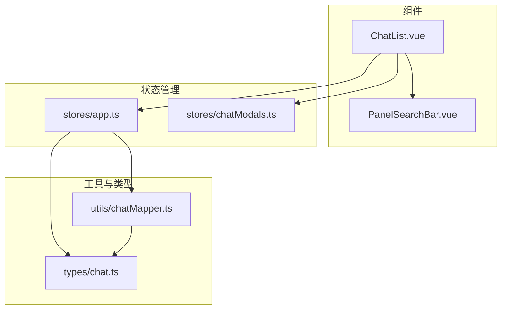
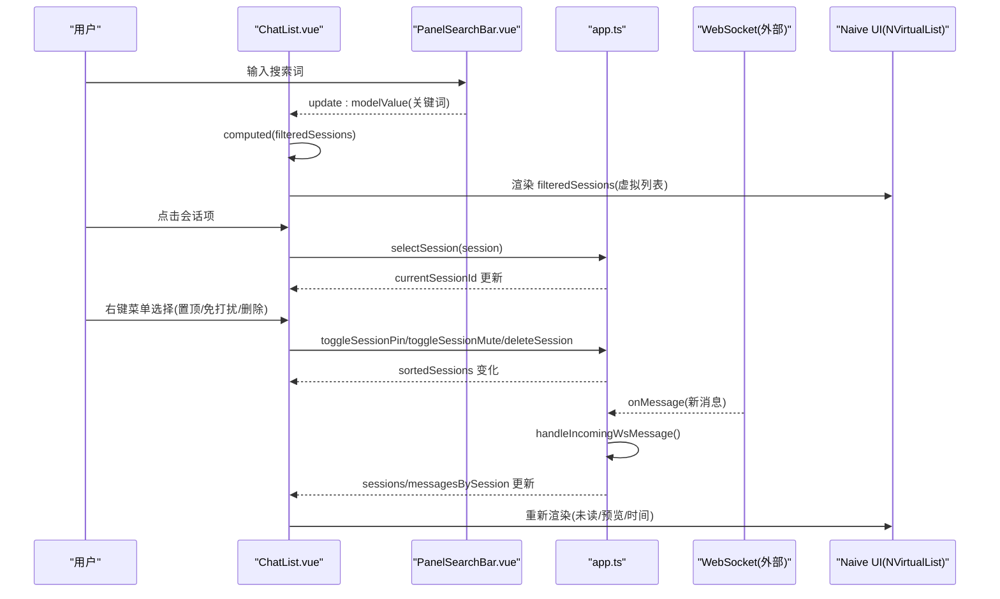
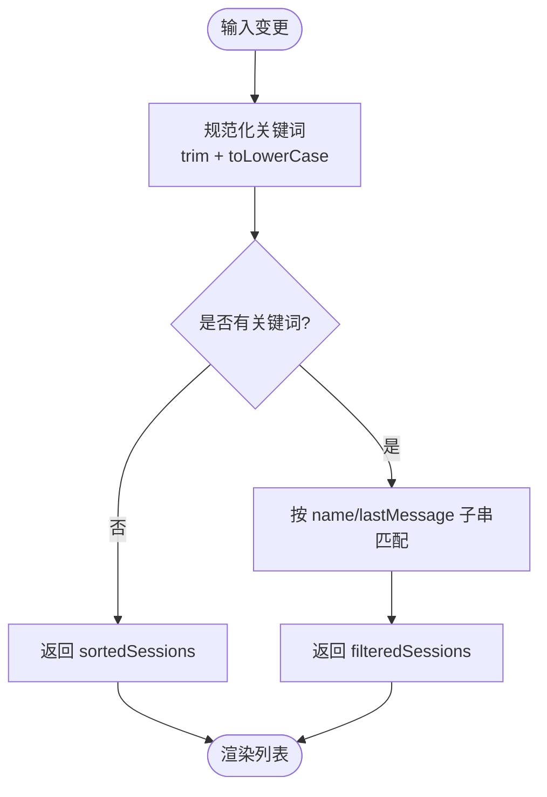
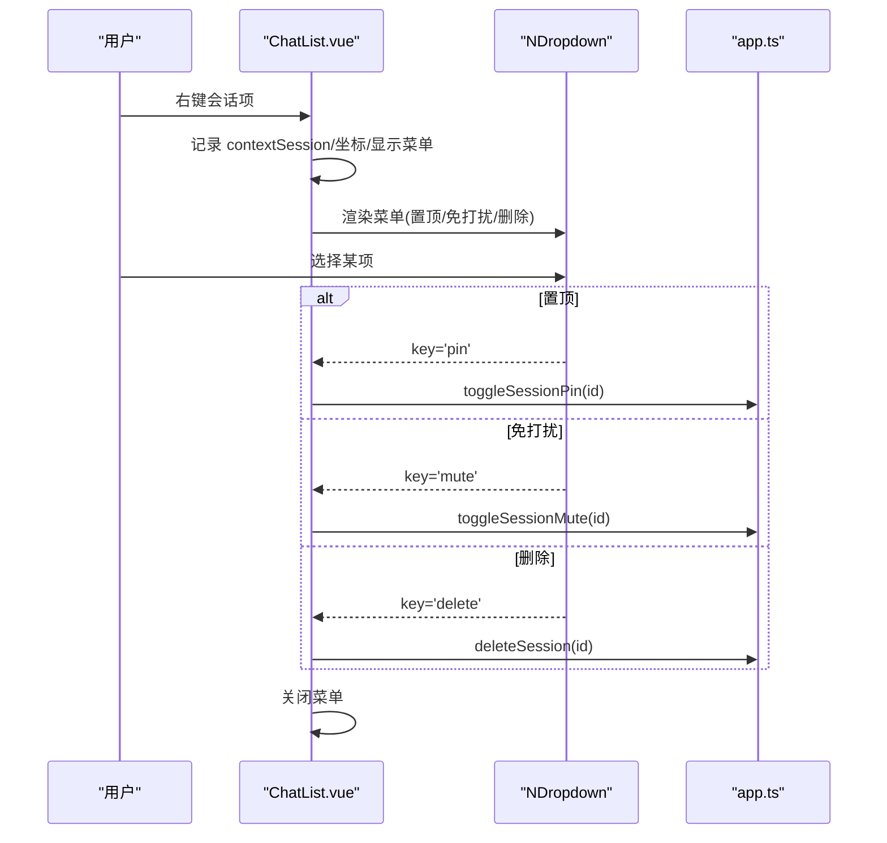
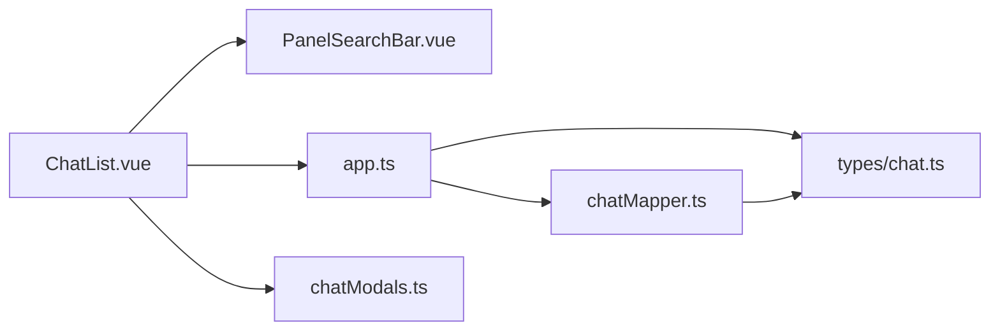

# 聊天列表组件

<cite>
**本文引用的文件**   
- [ChatList.vue](file://linkx-client/src/components/ChatList.vue)
- [PanelSearchBar.vue](file://linkx-client/src/components/PanelSearchBar.vue)
- [app.ts](file://linkx-client/src/stores/app.ts)
- [chatModals.ts](file://linkx-client/src/stores/chatModals.ts)
- [chatMapper.ts](file://linkx-client/src/utils/chatMapper.ts)
- [chat.ts](file://linkx-client/src/types/chat.ts)
</cite>

## 目录
1. [简介](#简介)
2. [项目结构](#项目结构)
3. [核心组件与职责](#核心组件与职责)
4. [架构总览](#架构总览)
5. [详细实现分析](#详细实现分析)
6. [依赖关系分析](#依赖关系分析)
7. [性能与优化](#性能与优化)
8. [故障排查指南](#故障排查指南)
9. [结论](#结论)
10. [附录：配置、事件与样式定制](#附录配置事件与样式定制)

## 简介
本技术文档聚焦于 ChatList 聊天列表组件，系统性解析其渲染机制、虚拟滚动实现与性能优化策略；深入说明搜索过滤（实时搜索、关键词匹配）的实现原理；详解右键菜单（置顶、免打扰、删除）的状态管理与交互逻辑；解释未读消息角标显示规则、离线状态提示与网络连接监控机制；并补充会话选择、排序算法与状态同步的实现细节。最后提供组件配置选项、事件处理与样式定制方法，帮助开发者快速理解与扩展该组件。

## 项目结构
围绕 ChatList 的相关代码主要位于前端客户端模块中，涉及组件、状态管理、工具映射与类型定义等层次：
- 组件层：ChatList.vue 负责会话列表的展示与交互；PanelSearchBar.vue 提供顶部搜索栏与添加下拉。
- 状态层：app.ts 维护会话列表、当前会话、消息、网络状态等全局状态，并提供排序、选择、置顶、免打扰、删除等操作；chatModals.ts 管理弹窗与抽屉开关。
- 工具层：chatMapper.ts 负责后端数据到前端会话/消息模型的转换。
- 类型层：chat.ts 定义后端返回的数据结构与 WebSocket 帧结构。

图表来源
- [ChatList.vue:1-120](file://linkx-client/src/components/ChatList.vue#L1-L120)
- [PanelSearchBar.vue:1-40](file://linkx-client/src/components/PanelSearchBar.vue#L1-L40)
- [app.ts:128-188](file://linkx-client/src/stores/app.ts#L128-L188)
- [chatMapper.ts:1-57](file://linkx-client/src/utils/chatMapper.ts#L1-L57)
- [chat.ts:1-57](file://linkx-client/src/types/chat.ts#L1-L57)

章节来源
- [ChatList.vue:1-120](file://linkx-client/src/components/ChatList.vue#L1-L120)
- [PanelSearchBar.vue:1-40](file://linkx-client/src/components/PanelSearchBar.vue#L1-L40)
- [app.ts:128-188](file://linkx-client/src/stores/app.ts#L128-L188)
- [chatMapper.ts:1-57](file://linkx-client/src/utils/chatMapper.ts#L1-L57)
- [chat.ts:1-57](file://linkx-client/src/types/chat.ts#L1-L57)

## 核心组件与职责
- ChatList.vue
  - 负责会话列表渲染、搜索过滤、虚拟滚动、右键菜单、离线横幅、骨架屏加载态与空态。
  - 通过 Pinia 获取 sortedSessions、currentSessionId、isLoading、isOffline 等状态，调用 appStore 的 selectSession、toggleSessionPin、toggleSessionMute、deleteSession 等方法。
  - 使用 PanelSearchBar 进行实时搜索输入，结合 computed 计算 filteredSessions。
  - 使用 Naive UI 的 NVirtualList 实现高性能列表渲染。
- PanelSearchBar.vue
  - 提供 v-model 双向绑定的搜索输入框与可选的“添加”下拉按钮，向父组件派发 update:modelValue 与 addSelect 事件。
- app.ts
  - 维护 sessions、messagesBySession、currentSessionId、isOffline 等核心状态。
  - 提供 sortedSessions 计算属性（置顶优先），selectSession（选中会话并清未读）、toggleSessionPin/toggleSessionMute/deleteSession 等动作。
  - 负责 WebSocket 连接、消息推送处理、历史消息拉取与加载更多。
- chatMapper.ts
  - conversationToSession：将后端 ConversationItem 转换为前端 ChatSession。
  - messageToChatMessage：将后端 MessageItem 转换为前端 ChatMessage。
  - messagePreviewFromItem：生成会话预览文案。
- chat.ts
  - 定义 ConversationItem、MessageItem、WsIncomingFrame 等数据结构，为前后端数据契约。

章节来源
- [ChatList.vue:1-120](file://linkx-client/src/components/ChatList.vue#L1-L120)
- [PanelSearchBar.vue:1-40](file://linkx-client/src/components/PanelSearchBar.vue#L1-L40)
- [app.ts:128-188](file://linkx-client/src/stores/app.ts#L128-L188)
- [chatMapper.ts:1-57](file://linkx-client/src/utils/chatMapper.ts#L1-L57)
- [chat.ts:1-57](file://linkx-client/src/types/chat.ts#L1-L57)

## 架构总览
ChatList 作为视图层，通过 Pinia 与 appStore 通信，读取排序后的会话列表并进行渲染；搜索过滤在组件内基于 computed 实时计算；右键菜单操作直接调用 appStore 的动作更新状态；WebSocket 推送由 appStore 统一处理，更新会话预览与未读数；虚拟滚动由 NVirtualList 承担，确保大数据量下的流畅体验。

图表来源
- [ChatList.vue:54-122](file://linkx-client/src/components/ChatList.vue#L54-L122)
- [PanelSearchBar.vue:30-40](file://linkx-client/src/components/PanelSearchBar.vue#L30-L40)
- [app.ts:165-188](file://linkx-client/src/stores/app.ts#L165-L188)
- [app.ts:478-523](file://linkx-client/src/stores/app.ts#L478-L523)

## 详细实现分析

### 渲染机制与虚拟滚动
- 渲染流程
  - 当 isLoading 为真时，渲染骨架屏占位项。
  - 若 filteredSessions 为空，渲染 EmptyState 空态。
  - 否则使用 NVirtualList 渲染会话项，每项高度固定为 68px，item-key 使用 id，提升渲染性能与稳定性。
- 会话项内容
  - 头像区域：根据 session.avatarText、avatarColor 渲染 Avatar，并在特定名称下显示手机图标。
  - 未读角标：当 session.unread > 0 且 !session.muted 时显示，超过 99 显示 “99+”。
  - 会话信息：名称前显示置顶图标（pinned），右侧显示免打扰图标（muted）与时间。
  - 最后消息：单行省略显示。
- 虚拟滚动参数
  - item-size=68 与容器 max-height/height 配合，保证只渲染可视区域内的条目，降低 DOM 节点数量。

章节来源
- [ChatList.vue:125-227](file://linkx-client/src/components/ChatList.vue#L125-L227)
- [ChatList.vue:229-378](file://linkx-client/src/components/ChatList.vue#L229-L378)

### 搜索过滤功能
- 实时搜索
  - 通过 PanelSearchBar 的 v-model 绑定 searchValue，输入触发 update:modelValue 事件，ChatList 监听并更新 searchValue。
- 关键词匹配算法
  - 使用 computed 计算 filteredSessions：对 searchValue 进行 trim 与小写规范化，若无关键词则返回全部 sortedSessions；否则按 name 与 lastMessage 的 includes 子串匹配过滤。
- 搜索结果高亮
  - 当前实现未包含高亮逻辑，仅做过滤显示。如需高亮，可在模板中对匹配片段进行包裹与样式处理。

图表来源
- [ChatList.vue:54-60](file://linkx-client/src/components/ChatList.vue#L54-L60)
- [PanelSearchBar.vue:30-40](file://linkx-client/src/components/PanelSearchBar.vue#L30-L40)

章节来源
- [ChatList.vue:54-60](file://linkx-client/src/components/ChatList.vue#L54-L60)
- [PanelSearchBar.vue:30-40](file://linkx-client/src/components/PanelSearchBar.vue#L30-L40)

### 右键菜单功能（置顶、免打扰、删除）
- 菜单触发
  - 在会话项上监听 contextmenu 事件，阻止默认菜单，记录目标会话与鼠标坐标，设置 contextMenuShow=true 显示 NDropdown。
- 动态菜单选项
  - 根据当前会话的 pinned/muted 状态动态生成菜单项文本（如“置顶/取消置顶”、“免打扰/取消免打扰”）。
- 状态管理与交互
  - pin：调用 toggleSessionPin，切换 pinned 状态，并通过 message.success 反馈结果。
  - mute：调用 toggleSessionMute，切换 muted 状态，并反馈结果。
  - delete：调用 deleteSession，从 sessions 移除会话及其消息，若删除的是当前会话则自动选择列表第一项。
- 关闭菜单
  - 选择后或点击外部区域时关闭菜单。

图表来源
- [ChatList.vue:96-122](file://linkx-client/src/components/ChatList.vue#L96-L122)
- [app.ts:542-564](file://linkx-client/src/stores/app.ts#L542-L564)

章节来源
- [ChatList.vue:96-122](file://linkx-client/src/components/ChatList.vue#L96-L122)
- [app.ts:542-564](file://linkx-client/src/stores/app.ts#L542-L564)

### 未读消息角标显示规则
- 显示条件
  - 当 session.unread > 0 且 !session.muted 时显示角标。
  - 数值大于 99 时显示 “99+”，否则显示实际数字。
- 更新时机
  - 进入会话时（selectSession）清空 unread。
  - 收到新消息时（handleIncomingWsMessage）若非当前会话且未开启免打扰，unread 自增。
  - 模拟消息（simulateIncomingMessage）在非免打扰情况下也会增加 unread。

章节来源
- [ChatList.vue:183-185](file://linkx-client/src/components/ChatList.vue#L183-L185)
- [app.ts:211-224](file://linkx-client/src/stores/app.ts#L211-L224)
- [app.ts:478-501](file://linkx-client/src/stores/app.ts#L478-L501)
- [app.ts:1091-1134](file://linkx-client/src/stores/app.ts#L1091-L1134)

### 离线状态提示与网络连接监控
- 离线横幅
  - 当 isOffline 为真时，在列表顶部显示警告横幅，提示检查网络设置。
- 连接监控
  - appStore 在 connectChatWebSocket 中注册 onOpen/onClose/onError 回调，onOpen 时将 isOffline 置为 false，onClose 且在已登录状态下置为 true。
  - 提供 toggleOffline/setOffline 手动控制离线状态，便于测试与调试。

章节来源
- [ChatList.vue:137-140](file://linkx-client/src/components/ChatList.vue#L137-L140)
- [app.ts:448-476](file://linkx-client/src/stores/app.ts#L448-L476)
- [app.ts:1077-1085](file://linkx-client/src/stores/app.ts#L1077-L1085)

### 会话选择、排序算法与状态同步
- 会话选择
  - selectSession 会切换到对应会话、清空未读、懒初始化消息数组，并对真实会话触发 loadSessionMessages。
- 排序算法
  - sortedSessions 将 pinned 的会话排在前面，其余保持原顺序。
- 状态同步
  - WebSocket 推送新消息时，更新 messagesBySession、会话预览与时间，并根据是否当前会话与免打扰状态决定是否增加 unread。
  - 发送确认（ack）时替换乐观消息，确保最终一致性。

章节来源
- [app.ts:165-188](file://linkx-client/src/stores/app.ts#L165-L188)
- [app.ts:211-224](file://linkx-client/src/stores/app.ts#L211-L224)
- [app.ts:478-523](file://linkx-client/src/stores/app.ts#L478-L523)

### 数据模型与映射
- 后端数据到前端会话
  - conversationToSession 将 ConversationItem 映射为 ChatSession，包括名称、预览、时间、头像等字段。
- 后端消息到前端消息
  - messageToChatMessage 将 MessageItem 映射为 ChatMessage，处理不同类型（文本、图片、文件）的内容与元数据。
- 预览文案
  - messagePreviewFromItem 用于生成会话预览文案，避免直接暴露原始内容。

章节来源
- [chatMapper.ts:13-56](file://linkx-client/src/utils/chatMapper.ts#L13-L56)
- [chat.ts:3-28](file://linkx-client/src/types/chat.ts#L3-L28)

## 依赖关系分析
- 组件依赖
  - ChatList.vue 依赖 PanelSearchBar.vue 提供搜索输入与添加下拉。
  - ChatList.vue 依赖 Naive UI 的 NVirtualList、NDropdown、NSkeleton、NIcon 等组件。
  - ChatList.vue 依赖 Pinia store（app.ts、chatModals.ts）。
- Store 依赖
  - app.ts 依赖 chatMapper.ts 进行数据映射，依赖 types/chat.ts 的类型定义，依赖 chatSocket 工具进行 WebSocket 通信。
- 类型契约
  - chat.ts 定义了 ConversationItem、MessageItem、WsIncomingFrame 等，约束前后端数据格式。

图表来源
- [ChatList.vue:1-44](file://linkx-client/src/components/ChatList.vue#L1-L44)
- [app.ts:128-188](file://linkx-client/src/stores/app.ts#L128-L188)
- [chatMapper.ts:1-57](file://linkx-client/src/utils/chatMapper.ts#L1-L57)
- [chat.ts:1-57](file://linkx-client/src/types/chat.ts#L1-L57)

章节来源
- [ChatList.vue:1-44](file://linkx-client/src/components/ChatList.vue#L1-L44)
- [app.ts:128-188](file://linkx-client/src/stores/app.ts#L128-L188)
- [chatMapper.ts:1-57](file://linkx-client/src/utils/chatMapper.ts#L1-L57)
- [chat.ts:1-57](file://linkx-client/src/types/chat.ts#L1-L57)

## 性能与优化
- 虚拟滚动
  - 使用 NVirtualList 固定 item-size 与容器高度，仅渲染可视区域条目，显著减少 DOM 节点与重排开销。
- 计算属性缓存
  - filteredSessions 基于 computed 缓存，仅在 searchValue 变化时重新计算，避免频繁过滤带来的性能损耗。
- 列表键稳定
  - item-key 使用唯一 id，提高虚拟列表的复用与定位效率。
- 骨架屏与空态
  - 在加载与无结果场景分别渲染骨架屏与空态，提升用户体验与感知性能。
- 建议优化
  - 搜索高亮可考虑防抖与正则匹配优化，避免长文本频繁重绘。
  - 对于超大列表，可进一步调整 item-size 与缓冲策略，或在必要时引入分页加载。

[本节为通用性能讨论，不直接分析具体文件]

## 故障排查指南
- 搜索无效
  - 检查 PanelSearchBar 是否正确派发 update:modelValue 事件，以及 ChatList 是否监听并更新 searchValue。
- 未读角标不更新
  - 确认 handleIncomingWsMessage 是否正确判断当前会话与免打扰状态，并递增 unread。
- 右键菜单不生效
  - 检查 contextmenu 事件是否被阻止默认行为，以及 NDropdown 的 show/x/y/options 是否正确绑定。
- 离线横幅不显示
  - 确认 WebSocket onClose 回调是否在已登录状态下设置 isOffline=true，或是否手动调用了 setOffline(true)。

章节来源
- [PanelSearchBar.vue:30-40](file://linkx-client/src/components/PanelSearchBar.vue#L30-L40)
- [ChatList.vue:96-122](file://linkx-client/src/components/ChatList.vue#L96-L122)
- [app.ts:478-501](file://linkx-client/src/stores/app.ts#L478-L501)
- [app.ts:448-476](file://linkx-client/src/stores/app.ts#L448-L476)

## 结论
ChatList 组件通过 Vue 响应式与 Pinia 状态管理实现了高效的会话列表渲染与交互。借助 NVirtualList 的虚拟滚动与 computed 的缓存机制，保证了大数据量下的流畅体验。搜索过滤采用简单的子串匹配，易于扩展为更复杂的匹配与高亮。右键菜单与未读角标逻辑清晰，结合 WebSocket 推送实现了实时的状态同步与通知。整体架构分层明确，便于后续功能扩展与性能优化。

[本节为总结性内容，不直接分析具体文件]

## 附录：配置、事件与样式定制

### 组件配置选项
- ChatList.vue
  - 无需显式 props，内部通过 Pinia 获取状态与方法。
  - 可通过修改 NVirtualList 的 item-size 与容器高度调整列表密度与可视区域。
- PanelSearchBar.vue
  - modelValue：搜索关键词（v-model 双向绑定）。
  - placeholder：输入框占位文字。
  - addOptions：添加下拉菜单选项（label/key 数组），可选。

章节来源
- [PanelSearchBar.vue:17-28](file://linkx-client/src/components/PanelSearchBar.vue#L17-L28)
- [ChatList.vue:129-134](file://linkx-client/src/components/ChatList.vue#L129-L134)

### 事件处理
- PanelSearchBar.vue
  - update:modelValue：输入值变化事件。
  - addSelect：添加下拉选项选中事件。
- ChatList.vue
  - onSelect：会话项点击事件，调用 appStore.selectSession。
  - onAddSelect：添加下拉选中事件，打开发起群聊或综合搜索弹窗。
  - onSessionContext：会话项右键事件，打开上下文菜单。
  - onContextMenuSelect：右键菜单选项选中事件，执行置顶/免打扰/删除。

章节来源
- [PanelSearchBar.vue:30-40](file://linkx-client/src/components/PanelSearchBar.vue#L30-L40)
- [ChatList.vue:80-122](file://linkx-client/src/components/ChatList.vue#L80-L122)

### 样式定制方法
- 主题变量
  - 使用 CSS 变量（如 --lx-bg-panel、--lx-text-body、--lx-danger 等）进行主题化定制。
- 关键样式类
  - .chat-list：列表容器背景与布局。
  - .offline-banner：离线横幅样式。
  - .session-item：会话项样式，支持 active/pinned 修饰类。
  - .unread-badge：未读角标样式，支持渐变与阴影。
  - .skeleton-item/skeleton-info：骨架屏占位样式。
- 自定义建议
  - 通过覆盖 CSS 变量或局部样式类，调整颜色、圆角、间距与字体大小，以适配不同主题与品牌风格。

章节来源
- [ChatList.vue:229-378](file://linkx-client/src/components/ChatList.vue#L229-L378)