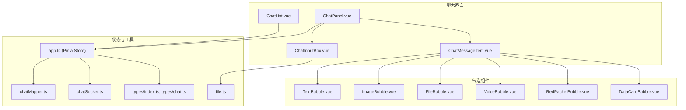
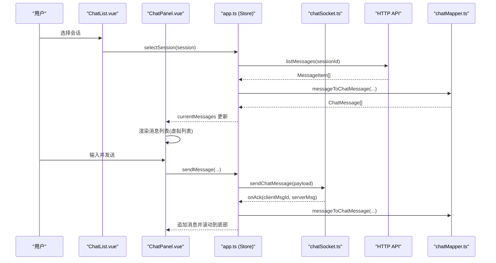
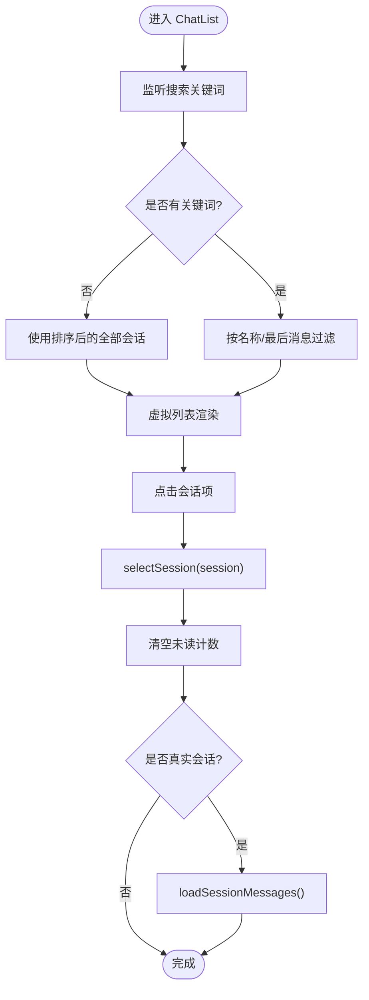
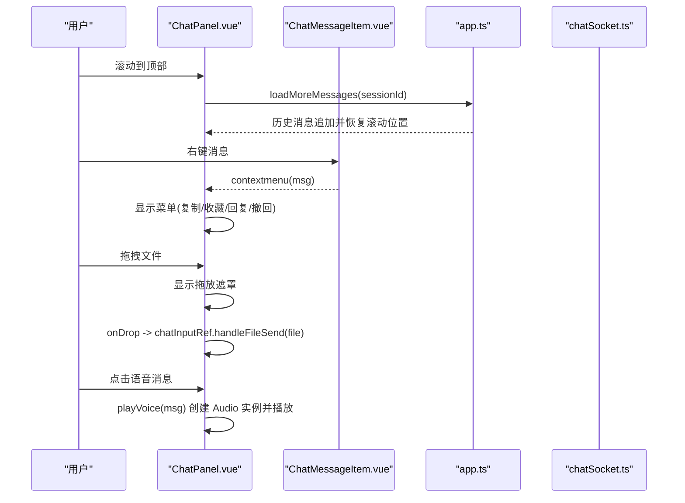
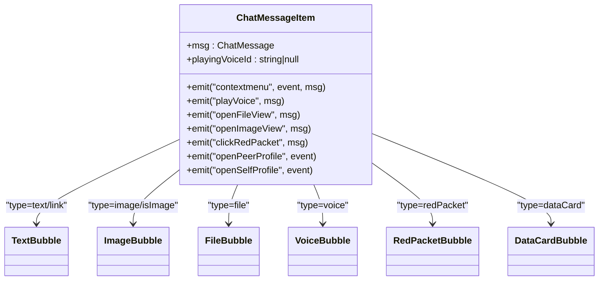
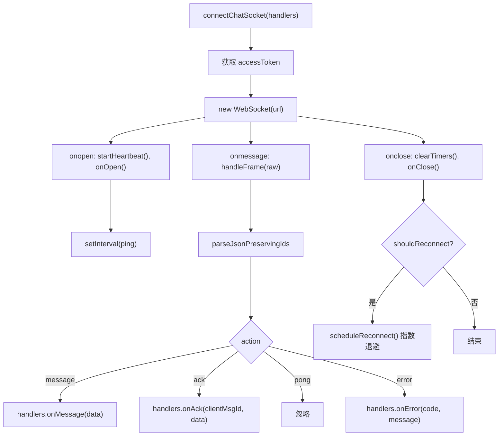
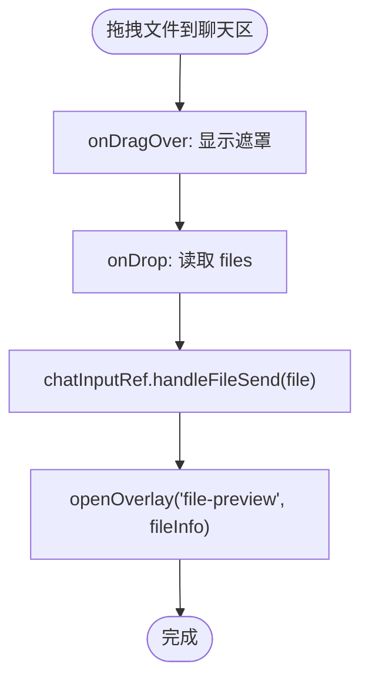
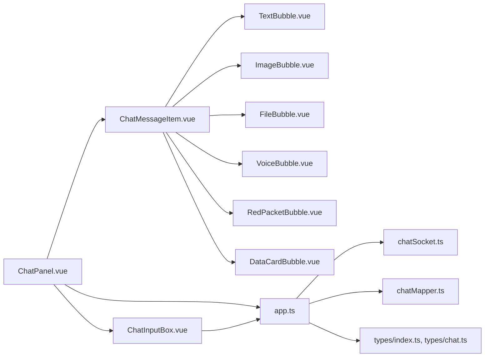

# 聊天组件

<cite>
**本文引用的文件**   
- [ChatList.vue](file://linkx-client/src/components/ChatList.vue)
- [ChatPanel.vue](file://linkx-client/src/components/ChatPanel.vue)
- [ChatMessageItem.vue](file://linkx-client/src/components/chat/ChatMessageItem.vue)
- [TextBubble.vue](file://linkx-client/src/components/chat/bubbles/TextBubble.vue)
- [ImageBubble.vue](file://linkx-client/src/components/chat/bubbles/ImageBubble.vue)
- [FileBubble.vue](file://linkx-client/src/components/chat/bubbles/FileBubble.vue)
- [VoiceBubble.vue](file://linkx-client/src/components/chat/bubbles/VoiceBubble.vue)
- [RedPacketBubble.vue](file://linkx-client/src/components/chat/bubbles/RedPacketBubble.vue)
- [DataCardBubble.vue](file://linkx-client/src/components/chat/bubbles/DataCardBubble.vue)
- [chatSocket.ts](file://linkx-client/src/utils/chatSocket.ts)
- [app.ts](file://linkx-client/src/stores/app.ts)
- [chatMapper.ts](file://linkx-client/src/utils/chatMapper.ts)
- [chat.ts](file://linkx-client/src/types/chat.ts)
- [index.ts](file://linkx-client/src/types/index.ts)
- [ChatInputBox.vue](file://linkx-client/src/components/chat/ChatInputBox.vue)
- [file.ts](file://linkx-client/src/utils/file.ts)
</cite>

## 目录
1. [简介](#简介)
2. [项目结构](#项目结构)
3. [核心组件](#核心组件)
4. [架构总览](#架构总览)
5. [详细组件分析](#详细组件分析)
6. [依赖关系分析](#依赖关系分析)
7. [性能与体验优化](#性能与体验优化)
8. [故障排查指南](#故障排查指南)
9. [结论](#结论)
10. [附录：集成与扩展](#附录集成与扩展)

## 简介
本技术文档围绕 LinkX 聊天组件系统，系统性阐述以下能力：
- ChatList 聊天列表：会话管理、搜索过滤、未读状态显示、右键菜单（置顶/免打扰/删除）、虚拟滚动。
- ChatPanel 聊天面板：消息渲染、输入处理、历史加载、拖拽发送、语音播放、图片预览、红包交互、群功能入口。
- ChatMessageItem 消息项：多类型消息支持（文本、图片、文件、语音、红包、数据卡片）与气泡样式系统。
- 状态管理与 WebSocket：应用级状态集中管理、WebSocket 连接与心跳重连、消息收发与 ACK 流程。
- 文件上传下载：本地读取为 Data URL、截图发送、文件拖放与预览。
- 用户体验优化：骨架屏、空态、离线提示、虚拟列表、平滑滚动等。
- 集成示例与扩展方法：如何接入真实后端、新增自定义消息类型与气泡。

## 项目结构
前端采用 Vue 3 + Pinia + Naive UI 的模块化组织方式，聊天相关代码主要位于 linkx-client/src/components 与 linkx-client/src/utils、stores、types 下。

图表来源
- [ChatList.vue:1-120](file://linkx-client/src/components/ChatList.vue#L1-L120)
- [ChatPanel.vue:1-120](file://linkx-client/src/components/ChatPanel.vue#L1-L120)
- [ChatMessageItem.vue:1-90](file://linkx-client/src/components/chat/ChatMessageItem.vue#L1-L90)
- [TextBubble.vue:1-33](file://linkx-client/src/components/chat/bubbles/TextBubble.vue#L1-L33)
- [ImageBubble.vue:1-19](file://linkx-client/src/components/chat/bubbles/ImageBubble.vue#L1-L19)
- [FileBubble.vue:1-32](file://linkx-client/src/components/chat/bubbles/FileBubble.vue#L1-L32)
- [VoiceBubble.vue:1-33](file://linkx-client/src/components/chat/bubbles/VoiceBubble.vue#L1-L33)
- [RedPacketBubble.vue:1-25](file://linkx-client/src/components/chat/bubbles/RedPacketBubble.vue#L1-L25)
- [DataCardBubble.vue:1-106](file://linkx-client/src/components/chat/bubbles/DataCardBubble.vue#L1-L106)
- [app.ts:128-200](file://linkx-client/src/stores/app.ts#L128-L200)
- [chatMapper.ts:1-57](file://linkx-client/src/utils/chatMapper.ts#L1-L57)
- [chatSocket.ts:1-144](file://linkx-client/src/utils/chatSocket.ts#L1-L144)
- [index.ts:22-83](file://linkx-client/src/types/index.ts#L22-L83)
- [chat.ts:15-57](file://linkx-client/src/types/chat.ts#L15-L57)
- [ChatInputBox.vue:1-120](file://linkx-client/src/components/chat/ChatInputBox.vue#L1-L120)
- [file.ts:1-30](file://linkx-client/src/utils/file.ts#L1-L30)

章节来源
- [ChatList.vue:1-120](file://linkx-client/src/components/ChatList.vue#L1-L120)
- [ChatPanel.vue:1-120](file://linkx-client/src/components/ChatPanel.vue#L1-L120)
- [ChatMessageItem.vue:1-90](file://linkx-client/src/components/chat/ChatMessageItem.vue#L1-L90)
- [app.ts:128-200](file://linkx-client/src/stores/app.ts#L128-L200)
- [chatSocket.ts:1-144](file://linkx-client/src/utils/chatSocket.ts#L1-L144)
- [chatMapper.ts:1-57](file://linkx-client/src/utils/chatMapper.ts#L1-L57)
- [index.ts:22-83](file://linkx-client/src/types/index.ts#L22-L83)
- [chat.ts:15-57](file://linkx-client/src/types/chat.ts#L15-L57)
- [ChatInputBox.vue:1-120](file://linkx-client/src/components/chat/ChatInputBox.vue#L1-L120)
- [file.ts:1-30](file://linkx-client/src/utils/file.ts#L1-L30)

## 核心组件
- ChatList：负责会话列表展示、搜索过滤、未读角标、右键菜单操作（置顶/免打扰/删除）、添加按钮（发起群聊/综合搜索）。使用虚拟列表提升长列表性能。
- ChatPanel：承载当前会话的消息区、顶栏（好友/群/我的手机）、输入框、侧边抽屉；提供消息右键（复制/收藏/回复/撤回）、拖拽发送、历史加载、语音播放、图片预览、红包点击等。
- ChatMessageItem：根据消息类型分发到对应气泡子组件，统一处理头像与事件冒泡。
- 气泡组件族：TextBubble、ImageBubble、FileBubble、VoiceBubble、RedPacketBubble、DataCardBubble，分别实现不同消息类型的渲染与交互。
- ChatInputBox：文本输入、表情、文件/图片发送、截图、语音录制、红包、快捷应用入口，支持 Enter 发送与 Shift+Enter 换行。

章节来源
- [ChatList.vue:1-120](file://linkx-client/src/components/ChatList.vue#L1-L120)
- [ChatPanel.vue:1-120](file://linkx-client/src/components/ChatPanel.vue#L1-L120)
- [ChatMessageItem.vue:1-90](file://linkx-client/src/components/chat/ChatMessageItem.vue#L1-L90)
- [ChatInputBox.vue:1-120](file://linkx-client/src/components/chat/ChatInputBox.vue#L1-L120)

## 架构总览
聊天系统以 Pinia store 为中心进行状态管理，组件通过 store 读写会话与消息；WebSocket 负责实时通信，HTTP API 负责会话与历史拉取；消息类型由类型定义约束，并通过映射器适配前后端数据结构。

图表来源
- [ChatList.vue:80-120](file://linkx-client/src/components/ChatList.vue#L80-L120)
- [ChatPanel.vue:284-314](file://linkx-client/src/components/ChatPanel.vue#L284-L314)
- [app.ts:349-400](file://linkx-client/src/stores/app.ts#L349-L400)
- [chatSocket.ts:80-144](file://linkx-client/src/utils/chatSocket.ts#L80-L144)
- [chatMapper.ts:28-57](file://linkx-client/src/utils/chatMapper.ts#L28-L57)

## 详细组件分析

### ChatList 聊天列表
- 会话管理
  - 选中会话时清空未读计数，确保消息数组存在，若为真实会话则触发历史加载。
  - 支持新建会话插入顶部并自动选中。
- 搜索过滤
  - 基于名称或最后消息内容模糊匹配，大小写归一化。
- 未读状态显示
  - 在头像右上角显示未读数，超过阈值显示“99+”，免打扰时不显示。
- 右键菜单
  - 动态生成选项：置顶/取消置顶、免打扰/取消免打扰、删除会话，操作后给出成功提示。
- 性能优化
  - 使用虚拟列表渲染大量会话项，减少 DOM 节点数量。
  - 加载中骨架屏与无结果空状态提升感知体验。

图表来源
- [ChatList.vue:54-120](file://linkx-client/src/components/ChatList.vue#L54-L120)
- [app.ts:211-224](file://linkx-client/src/stores/app.ts#L211-L224)
- [app.ts:364-382](file://linkx-client/src/stores/app.ts#L364-L382)

章节来源
- [ChatList.vue:1-120](file://linkx-client/src/components/ChatList.vue#L1-L120)
- [app.ts:211-224](file://linkx-client/src/stores/app.ts#L211-L224)
- [app.ts:364-382](file://linkx-client/src/stores/app.ts#L364-L382)

### ChatPanel 聊天面板
- 消息渲染
  - 使用虚拟列表渲染当前会话消息，过滤 system 类型仅展示用户可见消息。
  - 根据背景设置动态计算消息区背景样式。
- 输入处理
  - 通过 ChatInputBox 组件处理文本、表情、文件/图片、截图、语音、红包等输入。
  - 支持 Enter 发送、Shift+Enter 换行、粘贴图片/文件。
- 实时通信
  - 通过 app store 调用 WebSocket 发送消息，接收 ACK 后将服务端消息转换为本地 ChatMessage 并追加。
- 历史加载
  - 滚动到顶部时触发加载更多更早的历史消息，保持滚动位置稳定。
- 交互能力
  - 消息右键：复制、收藏、回复、撤回（仅自己发送的消息）。
  - 拖拽文件到聊天区，打开文件预览 Overlay，语音播放控制，红包点击领取。

图表来源
- [ChatPanel.vue:284-314](file://linkx-client/src/components/ChatPanel.vue#L284-L314)
- [ChatPanel.vue:316-410](file://linkx-client/src/components/ChatPanel.vue#L316-L410)
- [ChatPanel.vue:412-441](file://linkx-client/src/components/ChatPanel.vue#L412-L441)
- [ChatPanel.vue:211-229](file://linkx-client/src/components/ChatPanel.vue#L211-L229)
- [ChatMessageItem.vue:72-96](file://linkx-client/src/components/chat/ChatMessageItem.vue#L72-L96)

章节来源
- [ChatPanel.vue:120-441](file://linkx-client/src/components/ChatPanel.vue#L120-L441)
- [ChatMessageItem.vue:72-96](file://linkx-client/src/components/chat/ChatMessageItem.vue#L72-L96)

### ChatMessageItem 消息项与气泡样式系统
- 消息分发
  - 根据 msg.type 与 isImage 条件分发到 FileBubble、ImageBubble、VoiceBubble、RedPacketBubble、DataCardBubble、TextBubble。
- 头像与布局
  - 单聊非自己消息可点击头像打开资料卡；自己消息头像可打开个人资料。
- 气泡样式
  - 全局样式类 qq-bubble、qq-file-card、voice-bubble、red-packet-card 等，统一圆角、阴影、颜色与间距。
  - 链接消息识别（type=link、含 http(s) URL、含特定关键字），显示外链图标。
  - 语音气泡支持 playing 高亮，显示时长格式化。
  - 红包卡片支持 opened 状态降低透明度。

图表来源
- [ChatMessageItem.vue:20-96](file://linkx-client/src/components/chat/ChatMessageItem.vue#L20-L96)
- [TextBubble.vue:1-33](file://linkx-client/src/components/chat/bubbles/TextBubble.vue#L1-L33)
- [ImageBubble.vue:1-19](file://linkx-client/src/components/chat/bubbles/ImageBubble.vue#L1-L19)
- [FileBubble.vue:1-32](file://linkx-client/src/components/chat/bubbles/FileBubble.vue#L1-L32)
- [VoiceBubble.vue:1-33](file://linkx-client/src/components/chat/bubbles/VoiceBubble.vue#L1-L33)
- [RedPacketBubble.vue:1-25](file://linkx-client/src/components/chat/bubbles/RedPacketBubble.vue#L1-L25)
- [DataCardBubble.vue:1-106](file://linkx-client/src/components/chat/bubbles/DataCardBubble.vue#L1-L106)

章节来源
- [ChatMessageItem.vue:1-176](file://linkx-client/src/components/chat/ChatMessageItem.vue#L1-L176)
- [TextBubble.vue:1-33](file://linkx-client/src/components/chat/bubbles/TextBubble.vue#L1-L33)
- [ImageBubble.vue:1-19](file://linkx-client/src/components/chat/bubbles/ImageBubble.vue#L1-L19)
- [FileBubble.vue:1-32](file://linkx-client/src/components/chat/bubbles/FileBubble.vue#L1-L32)
- [VoiceBubble.vue:1-33](file://linkx-client/src/components/chat/bubbles/VoiceBubble.vue#L1-L33)
- [RedPacketBubble.vue:1-25](file://linkx-client/src/components/chat/bubbles/RedPacketBubble.vue#L1-L25)
- [DataCardBubble.vue:1-106](file://linkx-client/src/components/chat/bubbles/DataCardBubble.vue#L1-L106)

### WebSocket 消息处理与心跳重连
- 连接建立
  - 从 token 存储获取 accessToken，拼接 ws 地址并建立连接。
- 心跳保活
  - 每 25 秒发送 ping，收到 pong 忽略。
- 帧解析
  - 将 JSON 字符串解析为 WsIncomingFrame，根据 action 分发到 onMessage/onAck/onError。
- 断线重连
  - 指数退避策略，最大间隔 30 秒，关闭时清理定时器并重置状态。
- 发送消息
  - 校验连接状态后发送 WsSendPayload，包含 clientMsgId、conversationId、msgType 及附件字段。

图表来源
- [chatSocket.ts:1-144](file://linkx-client/src/utils/chatSocket.ts#L1-L144)
- [chat.ts:37-57](file://linkx-client/src/types/chat.ts#L37-L57)

章节来源
- [chatSocket.ts:1-144](file://linkx-client/src/utils/chatSocket.ts#L1-L144)
- [chat.ts:37-57](file://linkx-client/src/types/chat.ts#L37-L57)

### 文件上传下载与截图发送
- 本地读取
  - readFileAsDataUrl 将 File 对象转为 Data URL，用于图片消息本地预览与持久化。
- 截图发送
  - 使用 getDisplayMedia 捕获屏幕流，绘制到 canvas 转 DataURL，并进行大小上限校验。
- 拖拽发送
  - 聊天面板监听 dragover/dragleave/drop，drop 时将文件交给输入框组件发送。
- 文件预览
  - 通过 openOverlay('file-preview', {...}) 打开文件预览页，支持图片与通用文件。

图表来源
- [ChatPanel.vue:412-441](file://linkx-client/src/components/ChatPanel.vue#L412-L441)
- [ChatInputBox.vue:120-200](file://linkx-client/src/components/chat/ChatInputBox.vue#L120-L200)
- [file.ts:1-30](file://linkx-client/src/utils/file.ts#L1-L30)

章节来源
- [ChatPanel.vue:412-441](file://linkx-client/src/components/ChatPanel.vue#L412-L441)
- [ChatInputBox.vue:120-200](file://linkx-client/src/components/chat/ChatInputBox.vue#L120-L200)
- [file.ts:1-30](file://linkx-client/src/utils/file.ts#L1-L30)

## 依赖关系分析
- 组件耦合
  - ChatPanel 依赖 ChatMessageItem 与 ChatInputBox，通过 props 与事件传递消息与交互。
  - ChatMessageItem 依赖各气泡组件，按类型分发渲染。
- 状态依赖
  - 所有聊天组件通过 Pinia app store 访问 currentSession、currentMessages 等方法。
  - WebSocket 连接与消息发送由 app store 统一管理，组件仅调用接口。
- 外部依赖
  - Naive UI 提供虚拟列表、下拉菜单、消息提示等基础能力。
  - Ionicons5 提供图标资源。
  - Electron 主进程主题同步与锁屏机制（与本聊天模块间接相关）。

图表来源
- [ChatPanel.vue:1-120](file://linkx-client/src/components/ChatPanel.vue#L1-L120)
- [ChatMessageItem.vue:1-90](file://linkx-client/src/components/chat/ChatMessageItem.vue#L1-L90)
- [ChatInputBox.vue:1-120](file://linkx-client/src/components/chat/ChatInputBox.vue#L1-L120)
- [app.ts:128-200](file://linkx-client/src/stores/app.ts#L128-L200)
- [chatSocket.ts:1-144](file://linkx-client/src/utils/chatSocket.ts#L1-L144)
- [chatMapper.ts:1-57](file://linkx-client/src/utils/chatMapper.ts#L1-L57)
- [index.ts:22-83](file://linkx-client/src/types/index.ts#L22-L83)
- [chat.ts:15-57](file://linkx-client/src/types/chat.ts#L15-L57)

章节来源
- [ChatPanel.vue:1-120](file://linkx-client/src/components/ChatPanel.vue#L1-L120)
- [ChatMessageItem.vue:1-90](file://linkx-client/src/components/chat/ChatMessageItem.vue#L1-L90)
- [ChatInputBox.vue:1-120](file://linkx-client/src/components/chat/ChatInputBox.vue#L1-L120)
- [app.ts:128-200](file://linkx-client/src/stores/app.ts#L128-L200)
- [chatSocket.ts:1-144](file://linkx-client/src/utils/chatSocket.ts#L1-L144)
- [chatMapper.ts:1-57](file://linkx-client/src/utils/chatMapper.ts#L1-L57)
- [index.ts:22-83](file://linkx-client/src/types/index.ts#L22-L83)
- [chat.ts:15-57](file://linkx-client/src/types/chat.ts#L15-L57)

## 性能与体验优化
- 虚拟列表
  - 会话列表与消息列表均使用 NVirtualList，显著降低大列表渲染开销。
- 骨架屏与空态
  - 列表加载阶段展示骨架屏，无结果时展示空态提示，提升感知体验。
- 平滑滚动
  - 新消息到达或历史加载完成后，使用 nextTick 与 smooth 滚动定位到底部或保持滚动位置。
- 离线提示
  - WebSocket 断开时显示横幅提示，引导用户检查网络设置。
- 图片与文件大小限制
  - 截图发送前进行大小估算与上限校验，避免过大导致内存压力。
- 语音播放
  - 单例 Audio 实例，切换播放时自动暂停上一段，播放结束清除状态。

[本节为通用指导，无需列出具体文件来源]

## 故障排查指南
- WebSocket 连接异常
  - 检查 token 是否存在且有效；确认 WS_BASE_URL 配置正确；查看 onerror 回调错误码与消息。
- 消息未送达或未显示
  - 确认 onAck 回调是否被触发；检查 clientMsgId 与服务端返回的 data 是否正确映射为 ChatMessage。
- 历史消息加载失败
  - 检查 HTTP API 返回码与数据结构；确认 oldestId 是否为服务端 ID（临时 ID 不应触发加载）。
- 语音无法播放
  - 检查 voiceUrl 是否存在；浏览器权限与媒体资源可用性；Audio.play 的 Promise 拒绝处理。
- 文件拖放无效
  - 确认 dragover/dragleave/drop 事件未被阻止；files 列表是否为空；handleFileSend 是否被调用。

章节来源
- [chatSocket.ts:80-144](file://linkx-client/src/utils/chatSocket.ts#L80-L144)
- [app.ts:364-400](file://linkx-client/src/stores/app.ts#L364-L400)
- [ChatPanel.vue:211-229](file://linkx-client/src/components/ChatPanel.vue#L211-L229)
- [ChatPanel.vue:412-441](file://linkx-client/src/components/ChatPanel.vue#L412-L441)

## 结论
LinkX 聊天组件系统通过清晰的组件分层与 Pinia 状态管理，实现了高效的会话与消息渲染、稳定的 WebSocket 实时通信、完善的文件与多媒体处理能力，并在用户体验层面提供了丰富的交互与反馈。整体架构具备良好的可扩展性，便于后续引入更多消息类型与业务特性。

[本节为总结性内容，无需列出具体文件来源]

## 附录：集成与扩展

### 组件集成示例
- 在应用根组件中初始化 app store 并加载社交数据与会话列表，随后连接 WebSocket。
- 在页面中并列放置 ChatList 与 ChatPanel，二者共享 app store 的 currentSession 与 currentMessages。
- 通过 ChatInputBox 的 ref 暴露 handleFileSend 方法，供父组件拖放事件调用。

章节来源
- [app.ts:339-347](file://linkx-client/src/stores/app.ts#L339-L347)
- [ChatPanel.vue:570-578](file://linkx-client/src/components/ChatPanel.vue#L570-L578)

### 自定义消息类型与气泡扩展
- 扩展类型定义
  - 在 ChatMessage.type 中添加新类型字面量，并在 ChatMessage 上增加必要扩展字段。
- 新增气泡组件
  - 在 bubbles 目录下创建新气泡组件，遵循 props={msg: ChatMessage} 约定，实现模板与样式。
- 路由分发
  - 在 ChatMessageItem 的条件分支中增加对新类型的判断，渲染对应气泡组件。
- 输入与发送
  - 在 ChatInputBox 与 app store 的 sendMessage 中支持新类型 payload 构造与发送。
- 映射适配
  - 在 chatMapper.messageToChatMessage 中为新类型做字段映射与默认值填充。

章节来源
- [index.ts:44-83](file://linkx-client/src/types/index.ts#L44-L83)
- [ChatMessageItem.vue:82-89](file://linkx-client/src/components/chat/ChatMessageItem.vue#L82-L89)
- [chatMapper.ts:28-57](file://linkx-client/src/utils/chatMapper.ts#L28-L57)
- [app.ts:47-60](file://linkx-client/src/stores/app.ts#L47-L60)