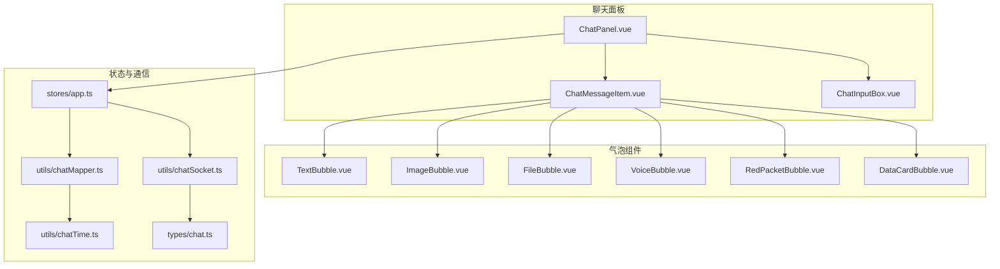
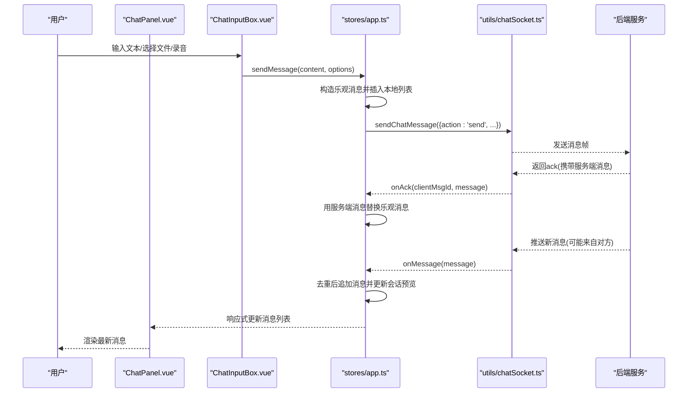
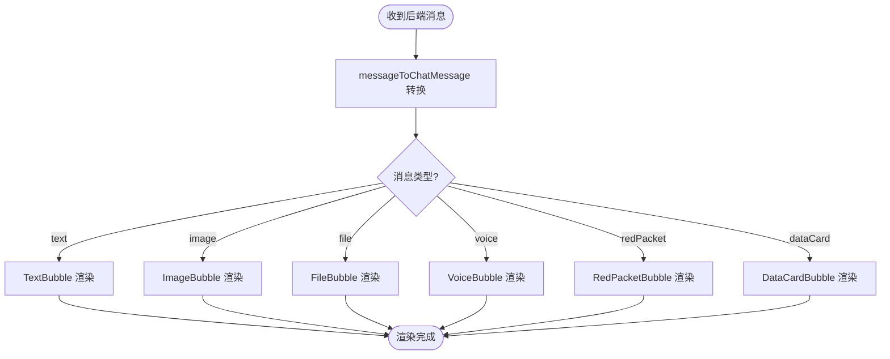
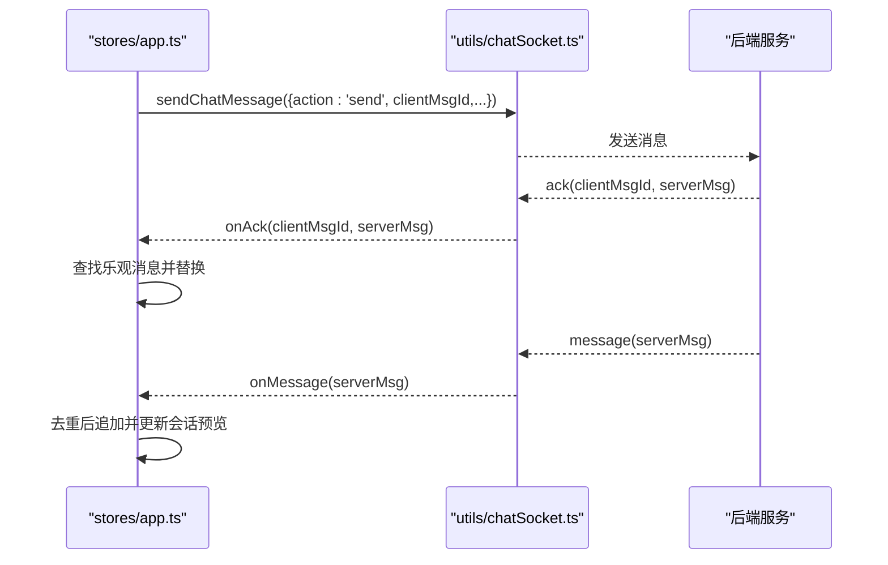
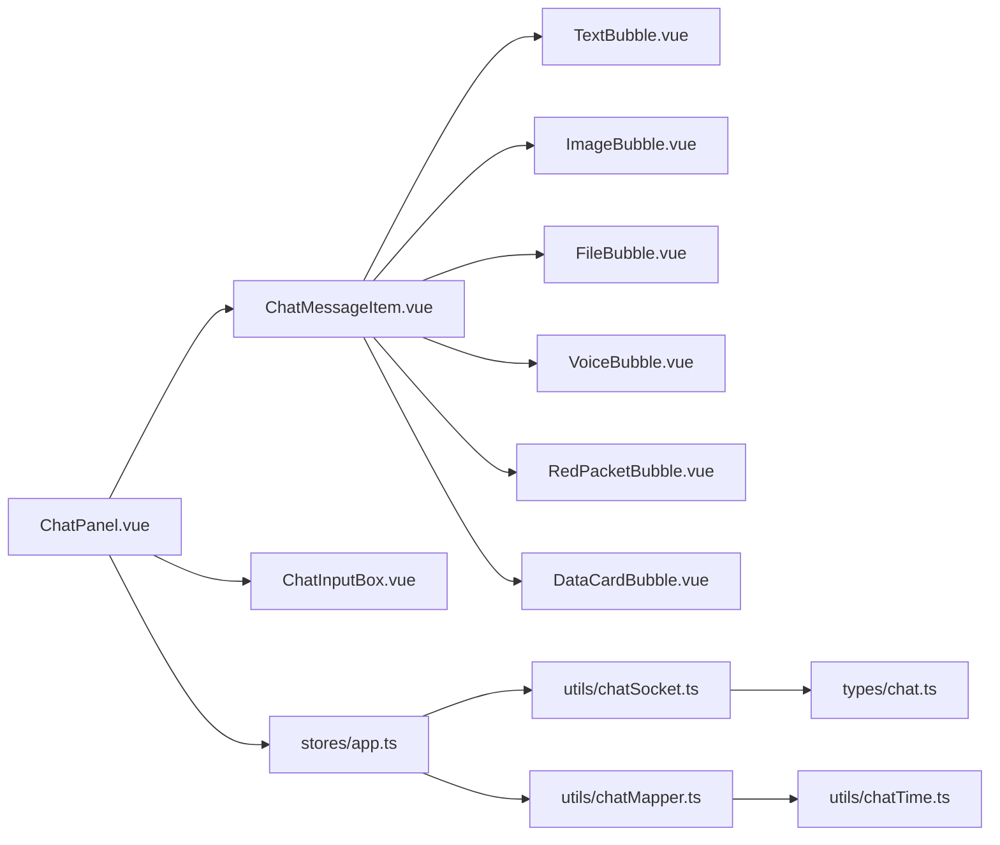

# 聊天面板组件

<cite>
**本文引用的文件**   
- [ChatPanel.vue](file://linkx-client/src/components/ChatPanel.vue)
- [ChatMessageItem.vue](file://linkx-client/src/components/chat/ChatMessageItem.vue)
- [ChatInputBox.vue](file://linkx-client/src/components/chat/ChatInputBox.vue)
- [FileBubble.vue](file://linkx-client/src/components/chat/bubbles/FileBubble.vue)
- [ImageBubble.vue](file://linkx-client/src/components/chat/bubbles/ImageBubble.vue)
- [VoiceBubble.vue](file://linkx-client/src/components/chat/bubbles/VoiceBubble.vue)
- [TextBubble.vue](file://linkx-client/src/components/chat/bubbles/TextBubble.vue)
- [RedPacketBubble.vue](file://linkx-client/src/components/chat/bubbles/RedPacketBubble.vue)
- [DataCardBubble.vue](file://linkx-client/src/components/chat/bubbles/DataCardBubble.vue)
- [app.ts](file://linkx-client/src/stores/app.ts)
- [chatSocket.ts](file://linkx-client/src/utils/chatSocket.ts)
- [chatMapper.ts](file://linkx-client/src/utils/chatMapper.ts)
- [chatTime.ts](file://linkx-client/src/utils/chatTime.ts)
- [chat.ts](file://linkx-client/src/types/chat.ts)
</cite>

## 目录
1. [简介](#简介)
2. [项目结构](#项目结构)
3. [核心组件](#核心组件)
4. [架构总览](#架构总览)
5. [详细组件分析](#详细组件分析)
6. [依赖关系分析](#依赖关系分析)
7. [性能与优化](#性能与优化)
8. [故障排查指南](#故障排查指南)
9. [结论](#结论)
10. [附录：扩展与主题定制](#附录扩展与主题定制)

## 简介
本技术文档围绕 ChatPanel 聊天面板组件，系统性阐述其整体架构、消息渲染流程、实时通信机制、本地存储同步与去重策略、媒体交互（图片预览、语音播放）、文件上传下载进度展示、搜索定位与滚动记忆、以及自定义消息类型与主题定制方法。目标读者既包括前端开发者，也包括希望快速理解系统行为的非技术用户。

## 项目结构
聊天面板位于 linkx-client 前端工程内，采用 Vue 3 + Naive UI + Pinia 的模块化组织方式。核心文件与职责如下：
- 主面板：负责会话顶栏、消息区域布局、输入框集成、工具栏管理、拖拽发送、右键菜单等
- 单条消息行：按消息类型分发到具体气泡子组件
- 气泡组件：文本、图片、文件、语音、红包、数据卡片等
- 输入框：文本输入、表情、应用快捷入口、截图、文件/图片选择、语音录制、红包与通话入口
- Store：会话与消息状态、历史加载、WebSocket 连接与消息处理、乐观更新与确认替换
- WebSocket 客户端：连接、心跳、重连、消息收发
- 映射与时间工具：后端消息到前端模型转换、时间/文件大小格式化

图表来源
- [ChatPanel.vue:1-800](file://linkx-client/src/components/ChatPanel.vue#L1-L800)
- [ChatMessageItem.vue:1-176](file://linkx-client/src/components/chat/ChatMessageItem.vue#L1-L176)
- [ChatInputBox.vue:1-749](file://linkx-client/src/components/chat/ChatInputBox.vue#L1-L749)
- [app.ts:1-800](file://linkx-client/src/stores/app.ts#L1-L800)
- [chatSocket.ts:1-144](file://linkx-client/src/utils/chatSocket.ts#L1-L144)
- [chatMapper.ts:1-57](file://linkx-client/src/utils/chatMapper.ts#L1-L57)
- [chatTime.ts:1-24](file://linkx-client/src/utils/chatTime.ts#L1-L24)
- [chat.ts:1-57](file://linkx-client/src/types/chat.ts#L1-L57)

章节来源
- [ChatPanel.vue:1-800](file://linkx-client/src/components/ChatPanel.vue#L1-L800)
- [ChatMessageItem.vue:1-176](file://linkx-client/src/components/chat/ChatMessageItem.vue#L1-L176)
- [ChatInputBox.vue:1-749](file://linkx-client/src/components/chat/ChatInputBox.vue#L1-L749)
- [app.ts:1-800](file://linkx-client/src/stores/app.ts#L1-L800)
- [chatSocket.ts:1-144](file://linkx-client/src/utils/chatSocket.ts#L1-L144)
- [chatMapper.ts:1-57](file://linkx-client/src/utils/chatMapper.ts#L1-L57)
- [chatTime.ts:1-24](file://linkx-client/src/utils/chatTime.ts#L1-L24)
- [chat.ts:1-57](file://linkx-client/src/types/chat.ts#L1-L57)

## 核心组件
- ChatPanel.vue：聊天面板容器，负责会话顶栏（好友/群聊/我的手机）、消息区布局、虚拟列表渲染、输入框集成、拖拽发送、右键菜单、语音播放控制、图片预览、红包点击、侧边抽屉与群应用菜单等。
- ChatMessageItem.vue：单条消息行，根据消息类型分发到对应气泡组件，并处理头像与事件冒泡。
- ChatInputBox.vue：输入框与工具栏，支持文本、表情、应用快捷、截图、文件/图片选择、语音录制、红包与通话入口，统一走 appStore.sendMessage。
- 气泡组件族：TextBubble、ImageBubble、FileBubble、VoiceBubble、RedPacketBubble、DataCardBubble，分别实现不同消息类型的渲染与交互。
- app.ts：全局状态与业务逻辑，包含会话管理、历史加载、WebSocket 连接与消息处理、乐观更新与 ack 替换、消息预览生成等。
- chatSocket.ts：WebSocket 客户端封装，提供连接、心跳、重连、发送与回调分发。
- chatMapper.ts：后端 MessageItem 到前端 ChatMessage 的转换，含时间与大小格式化。
- chatTime.ts：时间戳与文件大小格式化。
- types/chat.ts：WebSocket 协议与消息类型定义。

章节来源
- [ChatPanel.vue:1-800](file://linkx-client/src/components/ChatPanel.vue#L1-L800)
- [ChatMessageItem.vue:1-176](file://linkx-client/src/components/chat/ChatMessageItem.vue#L1-L176)
- [ChatInputBox.vue:1-749](file://linkx-client/src/components/chat/ChatInputBox.vue#L1-L749)
- [app.ts:1-800](file://linkx-client/src/stores/app.ts#L1-L800)
- [chatSocket.ts:1-144](file://linkx-client/src/utils/chatSocket.ts#L1-L144)
- [chatMapper.ts:1-57](file://linkx-client/src/utils/chatMapper.ts#L1-L57)
- [chatTime.ts:1-24](file://linkx-client/src/utils/chatTime.ts#L1-L24)
- [chat.ts:1-57](file://linkx-client/src/types/chat.ts#L1-L57)

## 架构总览
聊天面板采用“视图层（Vue 组件）—状态层（Pinia Store）—通信层（WebSocket）”的分层架构。消息渲染由 ChatPanel 驱动，通过 ChatMessageItem 分发至各气泡组件；输入与操作通过 ChatInputBox 触发 appStore 的发送逻辑；真实会话经由 WebSocket 进行双向通信，配合乐观更新与 ack 确认完成最终一致性。

图表来源
- [ChatInputBox.vue:365-384](file://linkx-client/src/components/chat/ChatInputBox.vue#L365-L384)
- [app.ts:617-749](file://linkx-client/src/stores/app.ts#L617-L749)
- [chatSocket.ts:134-139](file://linkx-client/src/utils/chatSocket.ts#L134-L139)
- [app.ts:478-523](file://linkx-client/src/stores/app.ts#L478-L523)

## 详细组件分析

### ChatPanel.vue：消息区域布局、输入框集成与工具栏管理
- 布局结构
  - 功能区域：顶部会话头（好友/群聊/我的手机），中间消息区，底部输入框，右侧抽屉（群成员/群信息）。
  - 消息区使用虚拟列表 NVirtualList 提升长列表性能，监听滚动以加载更多历史消息。
- 输入框集成
  - 通过 ref 暴露 handleFileSend，支持拖拽文件到聊天区直接发送。
  - 回复引用通过 v-model:replyingTo 双向绑定，聚焦输入框以便继续编辑。
- 工具栏与交互
  - 右键菜单：复制、收藏、回复、撤回（仅自己发送的消息）。
  - 语音播放：维护 playingVoiceId，切换播放/暂停，组件卸载时停止播放。
  - 图片预览：打开 Overlay 的文件预览页。
  - 拖拽发送：dragover/dragleave/drop 显示遮罩提示，drop 调用输入框发送。
- 背景与样式
  - 根据设置动态计算消息区背景渐变或默认色。

章节来源
- [ChatPanel.vue:1-800](file://linkx-client/src/components/ChatPanel.vue#L1-L800)

### ChatMessageItem.vue：消息类型识别与气泡分发
- 类型识别
  - 根据 msg.type 与 isImage 字段判断图片消息，依次匹配 file/image/voice/redPacket/dataCard/text。
- 事件冒泡
  - 将 contextmenu、playVoice、openFileView、openImageView、clickRedPacket、openPeerProfile、openSelfProfile 等事件向父级传递。
- 头像与对齐
  - 单聊且非自己发送时，可点击头像打开联系人资料卡；消息气泡最大宽度限制，左右对齐。

章节来源
- [ChatMessageItem.vue:1-176](file://linkx-client/src/components/chat/ChatMessageItem.vue#L1-L176)

### 气泡组件族：样式与应用
- TextBubble.vue：纯文本与链接样式，支持回复引用条。
- ImageBubble.vue：图片展示，点击由父组件打开预览。
- FileBubble.vue：文件名、大小与状态条（已发送/接收/发送中）。
- VoiceBubble.vue：麦克风图标与时长，playing 高亮。
- RedPacketBubble.vue：红包卡片，已领取状态。
- DataCardBubble.vue：结构化数据卡片（如套餐信息）。

章节来源
- [TextBubble.vue:1-33](file://linkx-client/src/components/chat/bubbles/TextBubble.vue#L1-L33)
- [ImageBubble.vue:1-19](file://linkx-client/src/components/chat/bubbles/ImageBubble.vue#L1-L19)
- [FileBubble.vue:1-32](file://linkx-client/src/components/chat/bubbles/FileBubble.vue#L1-L32)
- [VoiceBubble.vue:1-33](file://linkx-client/src/components/chat/bubbles/VoiceBubble.vue#L1-L33)
- [RedPacketBubble.vue:1-25](file://linkx-client/src/components/chat/bubbles/RedPacketBubble.vue#L1-L25)
- [DataCardBubble.vue:1-106](file://linkx-client/src/components/chat/bubbles/DataCardBubble.vue#L1-L106)

### ChatInputBox.vue：输入框与工具栏
- 文本输入与命令
  - Enter 发送，Shift+Enter 换行；支持 /img URL 快捷发送图片。
- 表情与应用快捷
  - 表情面板与内置应用网格，点击应用打开二级视图。
- 文件与图片
  - 隐藏 input 触发选择；粘贴自动检测图片/文件并发送；图片转 DataURL 或上传后回写 URL。
- 截图
  - 使用 getDisplayMedia 捕获屏幕，绘制 canvas 为 PNG，校验大小后发送。
- 语音录制
  - MediaRecorder 录音，权限失败降级为占位语音；结束录音计算时长并发送 voice 消息。
- 红包与通话
  - 打开红包弹窗与语音通话弹窗。
- 统一发送
  - 所有操作最终调用 appStore.sendMessage，传入类型与附件参数。

章节来源
- [ChatInputBox.vue:1-749](file://linkx-client/src/components/chat/ChatInputBox.vue#L1-L749)

### 消息渲染流程：类型识别、气泡样式与时间戳格式化
- 类型识别
  - ChatMessageItem.vue 根据 type 与 isImage 分支渲染对应气泡。
- 气泡样式
  - 各气泡组件内部定义样式类，结合 self 类区分自己/对方。
- 时间戳格式化
  - chatMapper.messageToChatMessage 调用 formatChatTime 将 createTime 转为 HH:mm。
  - 文件大小通过 formatFileSize 格式化。

图表来源
- [chatMapper.ts:28-50](file://linkx-client/src/utils/chatMapper.ts#L28-L50)
- [chatTime.ts:1-24](file://linkx-client/src/utils/chatTime.ts#L1-L24)
- [ChatMessageItem.vue:82-89](file://linkx-client/src/components/chat/ChatMessageItem.vue#L82-L89)

章节来源
- [ChatMessageItem.vue:82-89](file://linkx-client/src/components/chat/ChatMessageItem.vue#L82-L89)
- [chatMapper.ts:28-50](file://linkx-client/src/utils/chatMapper.ts#L28-L50)
- [chatTime.ts:1-24](file://linkx-client/src/utils/chatTime.ts#L1-L24)

### WebSocket 实时通信：消息接收、本地同步与去重
- 连接与心跳
  - connectChatSocket 建立连接，启动心跳 ping，异常关闭后指数退避重连。
- 消息分发
  - onMessage 转发给 appStore.handleIncomingWsMessage；onAck 用于替换乐观消息。
- 本地同步与去重
  - handleIncomingWsMessage 先检查 id 是否已存在，避免重复插入；同时更新会话 lastMessage/time 与未读数。
  - handleWsAck 查找 clientMsgId 对应的乐观消息并替换为服务端消息，若不存在则再次去重追加。
- 发送路径
  - sendMessageReal 构造乐观消息，必要时上传图片/文件，再 sendChatMessage 发送；错误时移除乐观消息。

图表来源
- [app.ts:617-749](file://linkx-client/src/stores/app.ts#L617-L749)
- [app.ts:478-523](file://linkx-client/src/stores/app.ts#L478-L523)
- [chatSocket.ts:80-144](file://linkx-client/src/utils/chatSocket.ts#L80-L144)

章节来源
- [app.ts:478-523](file://linkx-client/src/stores/app.ts#L478-L523)
- [app.ts:617-749](file://linkx-client/src/stores/app.ts#L617-L749)
- [chatSocket.ts:80-144](file://linkx-client/src/utils/chatSocket.ts#L80-L144)

### 文件上传下载进度显示与图片预览
- 上传进度
  - 当前实现中，文件上传成功后写入 fileUrl/fileSize，并在乐观消息中设置 fileStatus 为“发送中...”，随后被 ack 替换为“已发送”。未实现实时进度条，可在后续扩展 uploadChatFile 的回调以驱动进度。
- 下载与预览
  - 文件/图片点击打开 Overlay 的文件预览页，图片可直接在预览中查看。
- 图片发送
  - 支持 dataURL 与 rawFile 两种形式，前者转换为 File 对象上传，后者直接上传。

章节来源
- [app.ts:695-749](file://linkx-client/src/stores/app.ts#L695-L749)
- [ChatPanel.vue:232-258](file://linkx-client/src/components/ChatPanel.vue#L232-L258)
- [ChatInputBox.vue:216-258](file://linkx-client/src/components/chat/ChatInputBox.vue#L216-L258)

### 语音消息播放控制
- 播放控制
  - ChatPanel.vue 维护 playingVoiceId，点击语音气泡触发 playVoice，Audio 实例创建与 onended 清理。
- 录制与发送
  - ChatInputBox.vue 使用 MediaRecorder 录音，权限失败降级为无 URL 的占位语音，发送 voice 类型消息。

章节来源
- [ChatPanel.vue:212-229](file://linkx-client/src/components/ChatPanel.vue#L212-L229)
- [ChatInputBox.vue:289-353](file://linkx-client/src/components/chat/ChatInputBox.vue#L289-L353)

### 消息搜索定位、滚动位置记忆与性能优化
- 滚动位置记忆
  - 向上滚动到顶部时触发 onMessageScroll，调用 loadMoreMessages 加载更早历史，并通过 prevHeight 差值保持滚动位置不变。
- 性能优化
  - 使用 NVirtualList 虚拟列表渲染消息，减少 DOM 节点数量。
  - 历史加载防抖：loadingMore 标志防止重复触发。
- 搜索定位
  - 当前未实现消息内容搜索与定位功能，可在 ChatPanel 增加搜索输入与过滤逻辑，并结合虚拟列表 scrollTo 定位。

章节来源
- [ChatPanel.vue:299-314](file://linkx-client/src/components/ChatPanel.vue#L299-L314)
- [ChatPanel.vue:538-563](file://linkx-client/src/components/ChatPanel.vue#L538-L563)
- [app.ts:384-414](file://linkx-client/src/stores/app.ts#L384-L414)

## 依赖关系分析
- 组件依赖
  - ChatPanel.vue 依赖 ChatMessageItem.vue、ChatInputBox.vue、各类气泡组件与多个 Store。
  - ChatMessageItem.vue 依赖 Avatar 与各气泡组件。
  - ChatInputBox.vue 依赖 appStore、chatModalsStore、secondaryViewStore、filesStore、groupMetaStore 等。
- 状态与通信
  - app.ts 依赖 chatSocket、chatMapper、chatTime、chatApi 等。
  - chatSocket.ts 依赖 tokenStorage、parseJsonPreservingIds 与 types/chat.ts。
- 外部库
  - Naive UI（NIcon、NPopover、NDropdown、NVirtualList、useMessage）
  - Ionicons5 图标集

图表来源
- [ChatPanel.vue:1-800](file://linkx-client/src/components/ChatPanel.vue#L1-L800)
- [ChatMessageItem.vue:1-176](file://linkx-client/src/components/chat/ChatMessageItem.vue#L1-L176)
- [ChatInputBox.vue:1-749](file://linkx-client/src/components/chat/ChatInputBox.vue#L1-L749)
- [app.ts:1-800](file://linkx-client/src/stores/app.ts#L1-L800)
- [chatSocket.ts:1-144](file://linkx-client/src/utils/chatSocket.ts#L1-L144)
- [chatMapper.ts:1-57](file://linkx-client/src/utils/chatMapper.ts#L1-L57)
- [chatTime.ts:1-24](file://linkx-client/src/utils/chatTime.ts#L1-L24)
- [chat.ts:1-57](file://linkx-client/src/types/chat.ts#L1-L57)

章节来源
- [ChatPanel.vue:1-800](file://linkx-client/src/components/ChatPanel.vue#L1-L800)
- [ChatMessageItem.vue:1-176](file://linkx-client/src/components/chat/ChatMessageItem.vue#L1-L176)
- [ChatInputBox.vue:1-749](file://linkx-client/src/components/chat/ChatInputBox.vue#L1-L749)
- [app.ts:1-800](file://linkx-client/src/stores/app.ts#L1-L800)
- [chatSocket.ts:1-144](file://linkx-client/src/utils/chatSocket.ts#L1-L144)
- [chatMapper.ts:1-57](file://linkx-client/src/utils/chatMapper.ts#L1-L57)
- [chatTime.ts:1-24](file://linkx-client/src/utils/chatTime.ts#L1-L24)
- [chat.ts:1-57](file://linkx-client/src/types/chat.ts#L1-L57)

## 性能与优化
- 虚拟列表：NVirtualList 大幅降低大量消息时的渲染开销。
- 历史分页加载：基于 oldestId 分页，避免一次性加载过多数据。
- 去重机制：handleIncomingWsMessage 与 handleWsAck 均基于 id 去重，确保消息唯一性。
- 资源释放：组件卸载时停止语音播放与麦克风轨道，避免内存泄漏。
- 建议优化
  - 为文件上传添加进度回调，驱动 FileBubble 中的进度条。
  - 对图片消息增加懒加载与缩略图策略。
  - 引入消息索引与搜索定位，结合虚拟列表 scrollTo 精准跳转。

[本节为通用指导，不直接分析具体文件]

## 故障排查指南
- WebSocket 连接问题
  - 检查 getToken 是否成功获取 accessToken；确认 WS_BASE 配置正确；观察 onOpen/onClose/onError 回调日志。
- 消息未显示或重复
  - 核对 message.id 是否唯一；检查 handleIncomingWsMessage 的去重逻辑；确认 ack 替换是否命中 clientMsgId。
- 文件上传失败
  - 检查 uploadChatFile 返回值；确认 content 是否为 dataURL 或 fileUrl；注意 rawFile 与 blob URL 的处理路径。
- 语音无法播放
  - 浏览器权限是否允许麦克风；voiceUrl 是否存在；组件卸载时是否正确停止 Audio。

章节来源
- [chatSocket.ts:80-144](file://linkx-client/src/utils/chatSocket.ts#L80-L144)
- [app.ts:478-523](file://linkx-client/src/stores/app.ts#L478-L523)
- [app.ts:695-749](file://linkx-client/src/stores/app.ts#L695-L749)
- [ChatPanel.vue:212-229](file://linkx-client/src/components/ChatPanel.vue#L212-L229)

## 结论
ChatPanel 组件通过清晰的层次划分与稳健的状态管理，实现了多类型消息渲染、实时通信、本地同步与去重、媒体交互与文件传输等核心能力。在此基础上，可通过扩展气泡组件与 Store 逻辑，灵活支持更多消息类型与高级特性（如进度条、搜索定位、富文本等）。

[本节为总结，不直接分析具体文件]

## 附录：扩展与主题定制

### 自定义消息类型扩展方法
- 新增气泡组件
  - 在 bubbles 目录下新建 XXBubble.vue，实现结构与样式。
- 注册类型分发
  - 在 ChatMessageItem.vue 的类型分支中添加对新类型的判断与渲染。
- 适配发送与预览
  - 在 app.ts 的 sendMessageReal/sendMessageLocal 中支持新类型参数；在 messagePreviewFromItem 中补充预览文案。
- 类型定义
  - 在 types/chat.ts 的 MessageItem 与 WsSendPayload 中扩展字段（如 fileName、fileSize、fileUrl 等）。

章节来源
- [ChatMessageItem.vue:82-89](file://linkx-client/src/components/chat/ChatMessageItem.vue#L82-L89)
- [app.ts:617-749](file://linkx-client/src/stores/app.ts#L617-L749)
- [chat.ts:15-46](file://linkx-client/src/types/chat.ts#L15-L46)

### 主题定制指南
- 变量覆盖
  - 通过 CSS 变量 --lx-bg-panel、--lx-accent、--lx-text-body 等覆盖默认主题色与背景。
- 聊天背景
  - ChatPanel.vue 根据 chatBackground 设置计算消息区背景渐变，可新增主题 ID 与对应渐变样式。
- 气泡样式
  - 各气泡组件使用统一的 qq-bubble 基础样式与 self 修饰类，便于全局主题化。

章节来源
- [ChatPanel.vue:130-139](file://linkx-client/src/components/ChatPanel.vue#L130-L139)
- [ChatMessageItem.vue:122-175](file://linkx-client/src/components/chat/ChatMessageItem.vue#L122-L175)