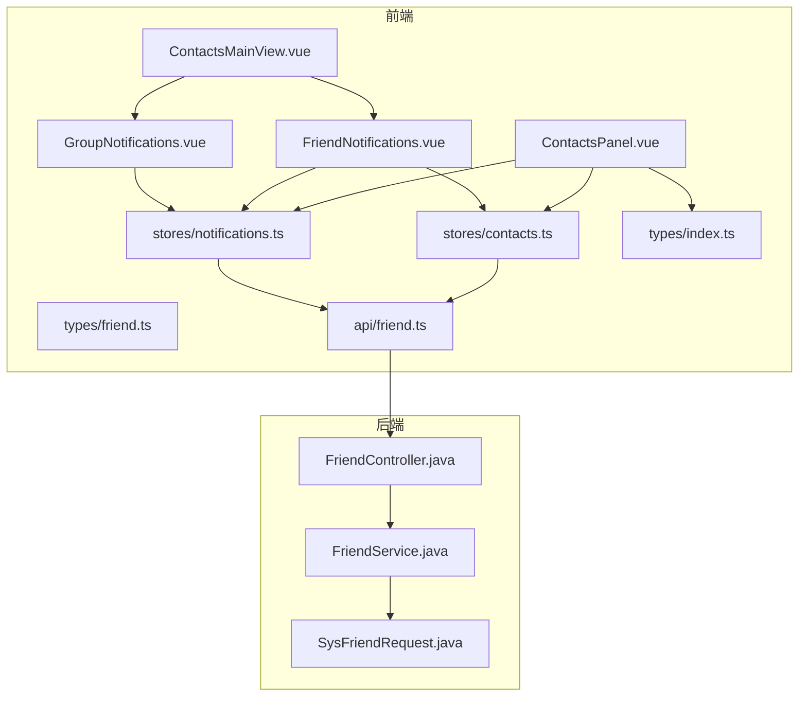
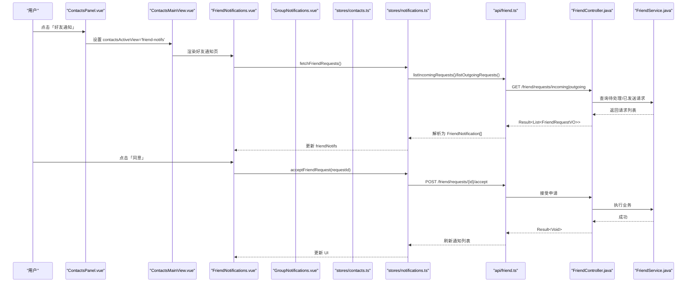
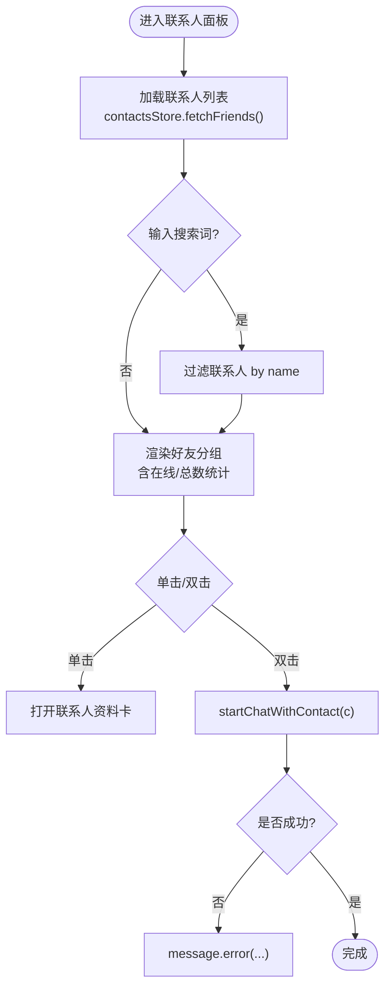
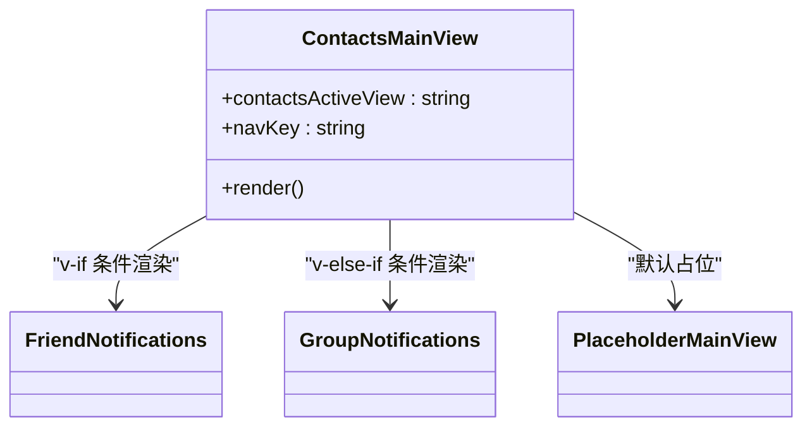
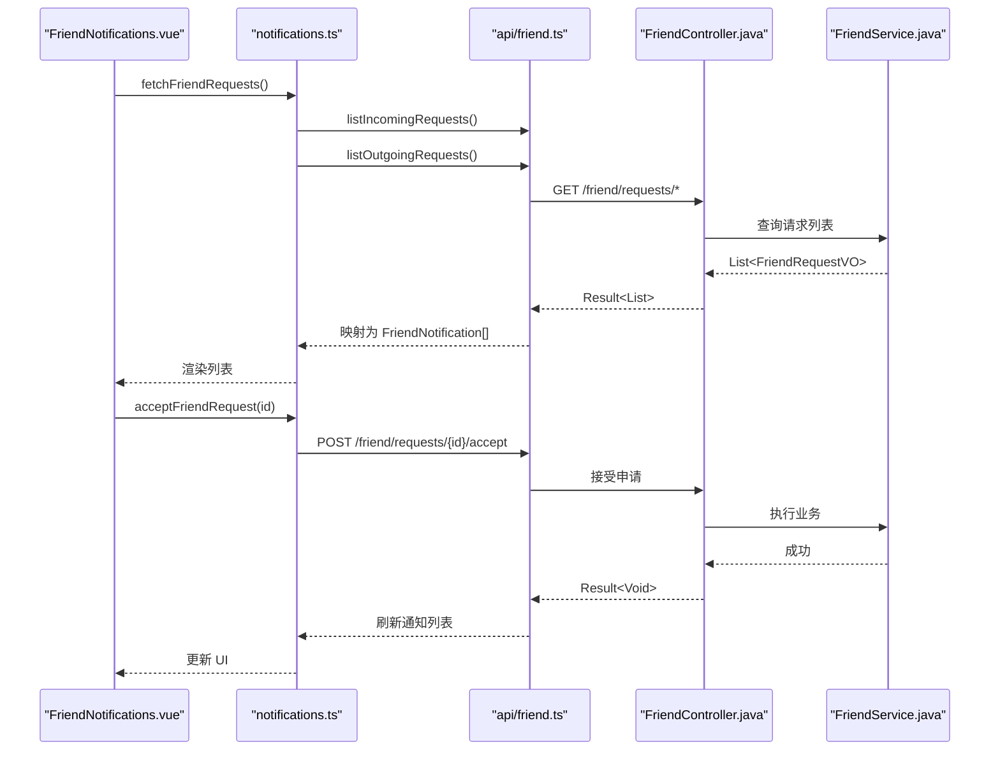
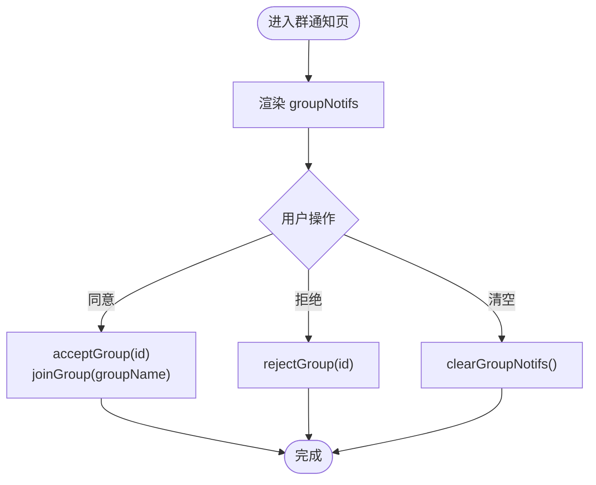
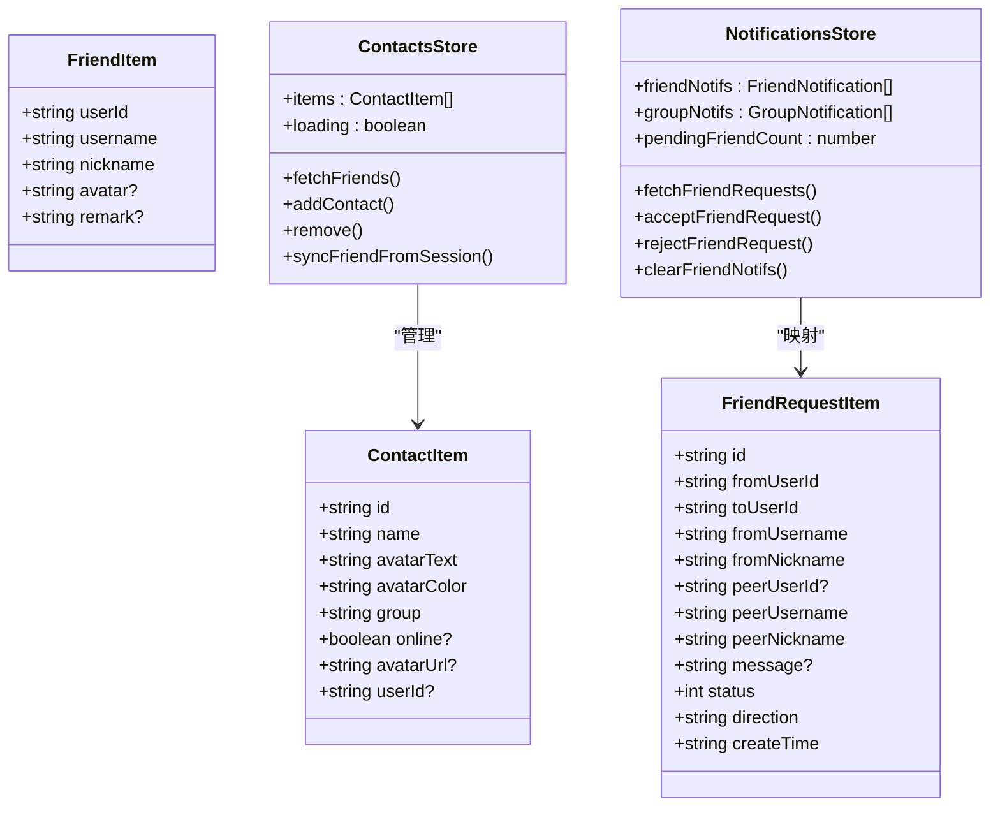
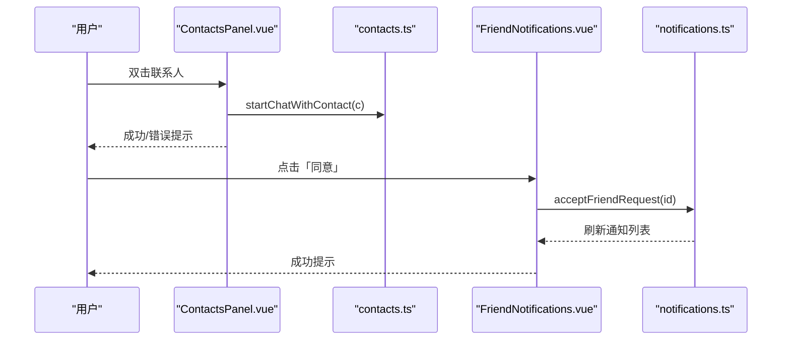
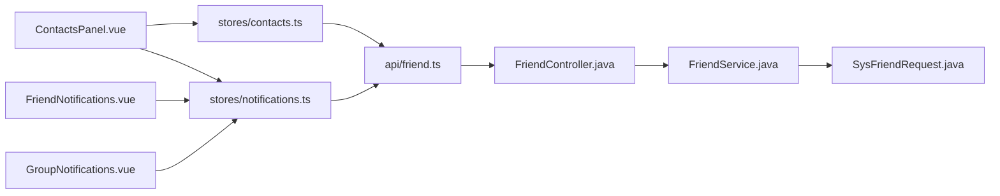

# 联系人组件

<cite>
**本文引用的文件**   
- [ContactsPanel.vue](file://linkx-client/src/components/ContactsPanel.vue)
- [ContactsMainView.vue](file://linkx-client/src/components/ContactsMainView.vue)
- [FriendNotifications.vue](file://linkx-client/src/components/contacts/FriendNotifications.vue)
- [GroupNotifications.vue](file://linkx-client/src/components/contacts/GroupNotifications.vue)
- [contacts.ts](file://linkx-client/src/stores/contacts.ts)
- [notifications.ts](file://linkx-client/src/stores/notifications.ts)
- [friend.ts](file://linkx-client/src/api/friend.ts)
- [index.ts](file://linkx-client/src/types/index.ts)
- [friend.ts](file://linkx-client/src/types/friend.ts)
- [FriendController.java](file://linkx-server/src/main/java/com/linkx/server/controller/FriendController.java)
- [FriendService.java](file://linkx-server/src/main/java/com/linkx/server/service/FriendService.java)
- [SysFriendRequest.java](file://linkx-server/src/main/java/com/linkx/server/entity/SysFriendRequest.java)
</cite>

## 目录
1. [简介](#简介)
2. [项目结构](#项目结构)
3. [核心组件](#核心组件)
4. [架构总览](#架构总览)
5. [详细组件分析](#详细组件分析)
6. [依赖关系分析](#依赖关系分析)
7. [性能与体验优化](#性能与体验优化)
8. [故障排查指南](#故障排查指南)
9. [结论](#结论)
10. [附录：数据模型与API契约](#附录数据模型与api契约)

## 简介
本技术文档围绕 LinkX 联系人模块，系统性梳理并解释以下能力：
- ContactsPanel 联系人面板的好友列表管理、分组显示与在线状态同步
- ContactsMainView 联系人主视图的右侧内容切换（好友通知、群通知）
- 好友通知系统与群组通知处理流程
- 联系人搜索过滤与批量操作（清空通知等）
- 联系人数据模型定义、API 调用模式与用户交互流程

该模块采用 Vue 3 + Pinia 前端架构，后端基于 Spring Boot 提供 RESTful 接口，前后端通过 JSON 协议交互。

## 项目结构
联系人相关的前端代码主要分布在 components、stores、types、api 四个层次；后端集中在 controller、service、entity 三层。

图表来源
- [ContactsPanel.vue:1-141](file://linkx-client/src/components/ContactsPanel.vue#L1-L141)
- [ContactsMainView.vue:1-33](file://linkx-client/src/components/ContactsMainView.vue#L1-L33)
- [FriendNotifications.vue:1-64](file://linkx-client/src/components/contacts/FriendNotifications.vue#L1-L64)
- [GroupNotifications.vue:1-46](file://linkx-client/src/components/contacts/GroupNotifications.vue#L1-L46)
- [contacts.ts:1-128](file://linkx-client/src/stores/contacts.ts#L1-L128)
- [notifications.ts:1-176](file://linkx-client/src/stores/notifications.ts#L1-L176)
- [friend.ts](file://linkx-client/src/api/friend.ts)
- [index.ts:85-96](file://linkx-client/src/types/index.ts#L85-L96)
- [friend.ts:1-38](file://linkx-client/src/types/friend.ts#L1-L38)
- [FriendController.java:1-96](file://linkx-server/src/main/java/com/linkx/server/controller/FriendController.java#L1-L96)
- [FriendService.java:1-28](file://linkx-server/src/main/java/com/linkx/server/service/FriendService.java#L1-L28)
- [SysFriendRequest.java:1-55](file://linkx-server/src/main/java/com/linkx/server/entity/SysFriendRequest.java#L1-L55)

章节来源
- [ContactsPanel.vue:1-141](file://linkx-client/src/components/ContactsPanel.vue#L1-L141)
- [ContactsMainView.vue:1-33](file://linkx-client/src/components/ContactsMainView.vue#L1-L33)
- [contacts.ts:1-128](file://linkx-client/src/stores/contacts.ts#L1-L128)
- [notifications.ts:1-176](file://linkx-client/src/stores/notifications.ts#L1-L176)
- [friend.ts](file://linkx-client/src/api/friend.ts)
- [index.ts:85-96](file://linkx-client/src/types/index.ts#L85-L96)
- [friend.ts:1-38](file://linkx-client/src/types/friend.ts#L1-L38)
- [FriendController.java:1-96](file://linkx-server/src/main/java/com/linkx/server/controller/FriendController.java#L1-L96)
- [FriendService.java:1-28](file://linkx-server/src/main/java/com/linkx/server/service/FriendService.java#L1-L28)
- [SysFriendRequest.java:1-55](file://linkx-server/src/main/java/com/linkx/server/entity/SysFriendRequest.java#L1-L55)

## 核心组件
- ContactsPanel：左侧联系人面板，负责好友列表展示、分组统计、搜索过滤、Tab 切换、通知入口、双击发起聊天等。
- ContactsMainView：右侧主视图容器，根据 contactsActiveView 路由到好友通知或群通知页面。
- FriendNotifications：好友请求通知列表，支持同意/拒绝、清空、刷新。
- GroupNotifications：群邀请通知列表，支持同意/拒绝、清空。
- stores/contacts.ts：联系人数据源，包含增删改查、从会话同步、持久化等。
- stores/notifications.ts：通知数据源，包含好友/群通知拉取、状态变更、计数器等。
- api/friend.ts：统一封装好友相关 API 调用。
- types/index.ts、types/friend.ts：全局类型与好友领域类型定义。

章节来源
- [ContactsPanel.vue:1-141](file://linkx-client/src/components/ContactsPanel.vue#L1-L141)
- [ContactsMainView.vue:1-33](file://linkx-client/src/components/ContactsMainView.vue#L1-L33)
- [FriendNotifications.vue:1-64](file://linkx-client/src/components/contacts/FriendNotifications.vue#L1-L64)
- [GroupNotifications.vue:1-46](file://linkx-client/src/components/contacts/GroupNotifications.vue#L1-L46)
- [contacts.ts:1-128](file://linkx-client/src/stores/contacts.ts#L1-L128)
- [notifications.ts:1-176](file://linkx-client/src/stores/notifications.ts#L1-L176)
- [friend.ts](file://linkx-client/src/api/friend.ts)
- [index.ts:85-96](file://linkx-client/src/types/index.ts#L85-L96)
- [friend.ts:1-38](file://linkx-client/src/types/friend.ts#L1-L38)

## 架构总览
联系人模块遵循“视图-状态-服务-接口”的分层组织方式：
- 视图层：Vue 组件负责渲染与交互
- 状态层：Pinia Store 维护联系人和通知数据
- 服务层：前端 API 封装调用后端 REST 接口
- 后端层：Spring Controller/Service/Entity 实现业务逻辑与数据访问

图表来源
- [ContactsPanel.vue:130-141](file://linkx-client/src/components/ContactsPanel.vue#L130-L141)
- [ContactsMainView.vue:25-33](file://linkx-client/src/components/ContactsMainView.vue#L25-L33)
- [FriendNotifications.vue:22-45](file://linkx-client/src/components/contacts/FriendNotifications.vue#L22-L45)
- [notifications.ts:104-144](file://linkx-client/src/stores/notifications.ts#L104-L144)
- [friend.ts:20-34](file://linkx-client/src/api/friend.ts#L20-L34)
- [FriendController.java:43-71](file://linkx-server/src/main/java/com/linkx/server/controller/FriendController.java#L43-L71)
- [FriendService.java:16-22](file://linkx-server/src/main/java/com/linkx/server/service/FriendService.java#L16-L22)

## 详细组件分析

### ContactsPanel 联系人面板
职责与功能
- 顶部搜索栏：按名称过滤联系人
- 好友/群聊 Tab 切换：分别渲染好友列表与群聊列表
- 好友分组与在线统计：计算在线人数与总数
- 通知入口：跳转至好友通知与群通知视图
- 单击打开资料卡、双击发起单聊
- 虚拟滚动：使用 n-virtual-list 提升长列表性能

关键实现要点
- 搜索过滤：对 items 进行大小写不敏感匹配
- 分组计算：仅保留“我的好友”分组，统计 online 数量
- 群聊分组：区分置顶与非置顶，支持搜索时隐藏空分组
- 会话关联：根据联系人 id/name 查找对应单聊会话 id
- 错误提示：双击发起聊天失败时弹出消息提示

图表来源
- [ContactsPanel.vue:73-128](file://linkx-client/src/components/ContactsPanel.vue#L73-L128)
- [contacts.ts:103-115](file://linkx-client/src/stores/contacts.ts#L103-L115)

章节来源
- [ContactsPanel.vue:1-141](file://linkx-client/src/components/ContactsPanel.vue#L1-L141)
- [contacts.ts:103-115](file://linkx-client/src/stores/contacts.ts#L103-L115)

### ContactsMainView 联系人主视图
职责与功能
- 根据 contactsActiveView 动态渲染子视图：好友通知、群通知或占位视图
- 与导航键 navKey 联动，保持整体导航一致性

图表来源
- [ContactsMainView.vue:25-33](file://linkx-client/src/components/ContactsMainView.vue#L25-L33)

章节来源
- [ContactsMainView.vue:1-33](file://linkx-client/src/components/ContactsMainView.vue#L1-L33)

### 好友通知系统（FriendNotifications）
职责与功能
- 拉取 incoming/outgoing 好友请求，合并并按时间倒序排列
- 支持同意/拒绝单个请求，成功后刷新列表
- 清空全部好友通知
- 同意成功后自动刷新好友列表并尝试加入会话

图表来源
- [FriendNotifications.vue:22-58](file://linkx-client/src/components/contacts/FriendNotifications.vue#L22-L58)
- [notifications.ts:104-144](file://linkx-client/src/stores/notifications.ts#L104-L144)
- [friend.ts:20-34](file://linkx-client/src/api/friend.ts#L20-L34)
- [FriendController.java:43-71](file://linkx-server/src/main/java/com/linkx/server/controller/FriendController.java#L43-L71)
- [FriendService.java:16-22](file://linkx-server/src/main/java/com/linkx/server/service/FriendService.java#L16-L22)

章节来源
- [FriendNotifications.vue:1-64](file://linkx-client/src/components/contacts/FriendNotifications.vue#L1-L64)
- [notifications.ts:104-144](file://linkx-client/src/stores/notifications.ts#L104-L144)
- [friend.ts:20-34](file://linkx-client/src/api/friend.ts#L20-L34)
- [FriendController.java:43-71](file://linkx-server/src/main/java/com/linkx/server/controller/FriendController.java#L43-L71)
- [FriendService.java:16-22](file://linkx-server/src/main/java/com/linkx/server/service/FriendService.java#L16-L22)

### 群组通知处理（GroupNotifications）
职责与功能
- 本地维护群邀请通知列表（初始示例数据），支持同意/拒绝与清空
- 同意后将触发加入群聊动作（由 app store 提供 joinGroup）

图表来源
- [GroupNotifications.vue:26-46](file://linkx-client/src/components/contacts/GroupNotifications.vue#L26-L46)
- [notifications.ts:146-163](file://linkx-client/src/stores/notifications.ts#L146-L163)

章节来源
- [GroupNotifications.vue:1-46](file://linkx-client/src/components/contacts/GroupNotifications.vue#L1-L46)
- [notifications.ts:146-163](file://linkx-client/src/stores/notifications.ts#L146-L163)

### 联系人数据模型与状态管理
- ContactItem：联系人项，包含 id、name、头像信息、分组、在线状态、userId 等
- FriendItem/FriendRequestItem：好友与好友请求的数据结构
- contacts.ts：提供 add/remove/sync/fetch 等操作，支持持久化
- notifications.ts：提供好友/群通知的拉取、状态变更、计数器等

图表来源
- [index.ts:85-96](file://linkx-client/src/types/index.ts#L85-L96)
- [friend.ts:1-38](file://linkx-client/src/types/friend.ts#L1-L38)
- [contacts.ts:1-128](file://linkx-client/src/stores/contacts.ts#L1-L128)
- [notifications.ts:1-176](file://linkx-client/src/stores/notifications.ts#L1-L176)

章节来源
- [index.ts:85-96](file://linkx-client/src/types/index.ts#L85-L96)
- [friend.ts:1-38](file://linkx-client/src/types/friend.ts#L1-L38)
- [contacts.ts:1-128](file://linkx-client/src/stores/contacts.ts#L1-L128)
- [notifications.ts:1-176](file://linkx-client/src/stores/notifications.ts#L1-L176)

### 用户交互流程与权限控制
- 双击联系人：优先尝试直接发起聊天，失败则提示错误
- 单击联系人：打开资料卡弹窗
- 好友通知：仅对 incoming 且等待验证的请求显示同意/拒绝按钮
- 群通知：对等待验证的邀请显示同意/拒绝按钮
- 删除好友：通过 contactsStore.deleteFriend 调用后端接口，成功后移除本地条目

图表来源
- [ContactsPanel.vue:120-128](file://linkx-client/src/components/ContactsPanel.vue#L120-L128)
- [FriendNotifications.vue:26-45](file://linkx-client/src/components/contacts/FriendNotifications.vue#L26-L45)
- [notifications.ts:128-144](file://linkx-client/src/stores/notifications.ts#L128-L144)

章节来源
- [ContactsPanel.vue:120-128](file://linkx-client/src/components/ContactsPanel.vue#L120-L128)
- [FriendNotifications.vue:26-45](file://linkx-client/src/components/contacts/FriendNotifications.vue#L26-L45)
- [notifications.ts:128-144](file://linkx-client/src/stores/notifications.ts#L128-L144)

## 依赖关系分析
- 组件依赖 Store：ContactsPanel、FriendNotifications、GroupNotifications 均依赖 Pinia Store 获取/更新数据
- Store 依赖 API：contacts.ts 与 notifications.ts 通过 api/friend.ts 调用后端
- 后端依赖 Service/Entity：FriendController 调用 FriendService，Service 操作数据库实体 SysFriendRequest

图表来源
- [ContactsPanel.vue:1-141](file://linkx-client/src/components/ContactsPanel.vue#L1-L141)
- [FriendNotifications.vue:1-64](file://linkx-client/src/components/contacts/FriendNotifications.vue#L1-L64)
- [GroupNotifications.vue:1-46](file://linkx-client/src/components/contacts/GroupNotifications.vue#L1-L46)
- [contacts.ts:1-128](file://linkx-client/src/stores/contacts.ts#L1-L128)
- [notifications.ts:1-176](file://linkx-client/src/stores/notifications.ts#L1-L176)
- [friend.ts](file://linkx-client/src/api/friend.ts)
- [FriendController.java:1-96](file://linkx-server/src/main/java/com/linkx/server/controller/FriendController.java#L1-L96)
- [FriendService.java:1-28](file://linkx-server/src/main/java/com/linkx/server/service/FriendService.java#L1-L28)
- [SysFriendRequest.java:1-55](file://linkx-server/src/main/java/com/linkx/server/entity/SysFriendRequest.java#L1-L55)

章节来源
- [ContactsPanel.vue:1-141](file://linkx-client/src/components/ContactsPanel.vue#L1-L141)
- [FriendNotifications.vue:1-64](file://linkx-client/src/components/contacts/FriendNotifications.vue#L1-L64)
- [GroupNotifications.vue:1-46](file://linkx-client/src/components/contacts/GroupNotifications.vue#L1-L46)
- [contacts.ts:1-128](file://linkx-client/src/stores/contacts.ts#L1-L128)
- [notifications.ts:1-176](file://linkx-client/src/stores/notifications.ts#L1-L176)
- [friend.ts](file://linkx-client/src/api/friend.ts)
- [FriendController.java:1-96](file://linkx-server/src/main/java/com/linkx/server/controller/FriendController.java#L1-L96)
- [FriendService.java:1-28](file://linkx-server/src/main/java/com/linkx/server/service/FriendService.java#L1-L28)
- [SysFriendRequest.java:1-55](file://linkx-server/src/main/java/com/linkx/server/entity/SysFriendRequest.java#L1-L55)

## 性能与体验优化
- 虚拟滚动：联系人列表使用 n-virtual-list，减少 DOM 节点数量，提升渲染性能
- 骨架屏：加载期间展示骨架屏，改善感知性能
- 计算属性缓存：搜索过滤与分组统计使用 computed，避免重复计算
- 并行请求：拉取 incoming/outgoing 好友请求时使用 Promise.all 并发请求，降低总耗时
- 持久化：联系人列表与部分通知状态持久化，减少重复初始化开销

[本节为通用建议，无需具体文件引用]

## 故障排查指南
- 好友通知为空：检查 fetchFriendRequests 是否正确调用，确认后端 /friend/requests/incoming 与 /friend/requests/outgoing 返回格式
- 同意/拒绝失败：查看 accept/reject 接口返回码与 message，确认 requestId 合法性
- 删除好友失败：检查 deleteFriend 返回值，确认 userId 与后端一致
- 双击聊天失败：捕获异常并提示，必要时检查 startChatWithContact 的实现与权限

章节来源
- [FriendNotifications.vue:41-58](file://linkx-client/src/components/contacts/FriendNotifications.vue#L41-L58)
- [contacts.ts:71-77](file://linkx-client/src/stores/contacts.ts#L71-L77)
- [notifications.ts:128-144](file://linkx-client/src/stores/notifications.ts#L128-L144)

## 结论
联系人模块以清晰的组件分层与状态管理实现了好友列表管理、分组显示、在线状态同步、通知处理与搜索过滤等核心能力。前后端通过明确的 API 契约协作，具备良好的可维护性与扩展性。后续可在在线状态实时同步、批量操作、更丰富的筛选维度等方面持续增强。

[本节为总结性内容，无需具体文件引用]

## 附录：数据模型与API契约

### 前端数据模型
- ContactItem：联系人项
- FriendItem：好友项
- FriendRequestItem：好友请求项

章节来源
- [index.ts:85-96](file://linkx-client/src/types/index.ts#L85-L96)
- [friend.ts:1-38](file://linkx-client/src/types/friend.ts#L1-L38)

### 后端实体
- SysFriendRequest：好友申请实体，包含 id、fromUserId、toUserId、message、status、createTime 等字段

章节来源
- [SysFriendRequest.java:1-55](file://linkx-server/src/main/java/com/linkx/server/entity/SysFriendRequest.java#L1-L55)

### API 接口清单
- GET /friend/search?keyword=...：搜索用户
- POST /friend/request：发送好友请求
- GET /friend/requests/incoming：获取收到的好友请求
- GET /friend/requests/outgoing：获取发出的好友请求
- POST /friend/requests/{id}/accept：同意好友请求
- POST /friend/requests/{id}/reject：拒绝好友请求
- GET /friend/list：获取好友列表
- DELETE /friend/{friendId}：删除好友

章节来源
- [FriendController.java:26-86](file://linkx-server/src/main/java/com/linkx/server/controller/FriendController.java#L26-L86)
- [friend.ts:10-43](file://linkx-client/src/api/friend.ts#L10-L43)