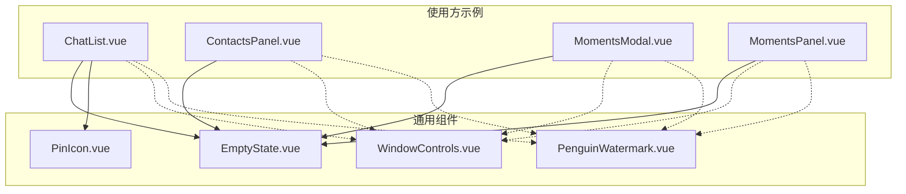
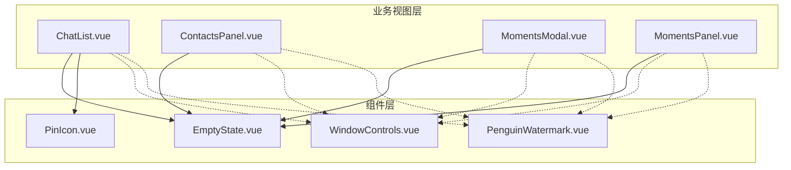
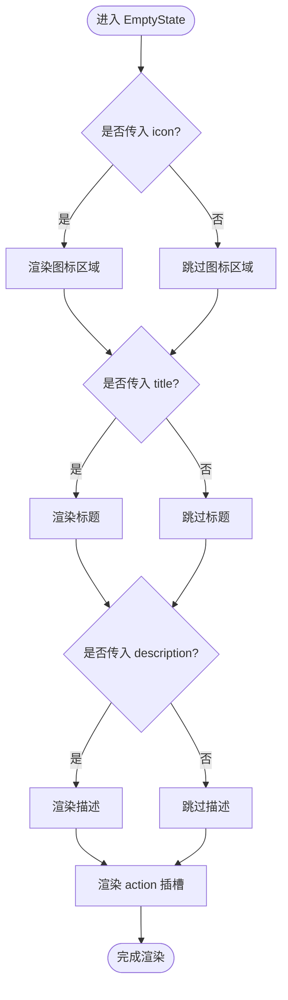
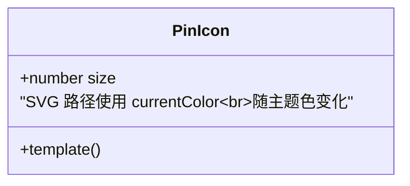
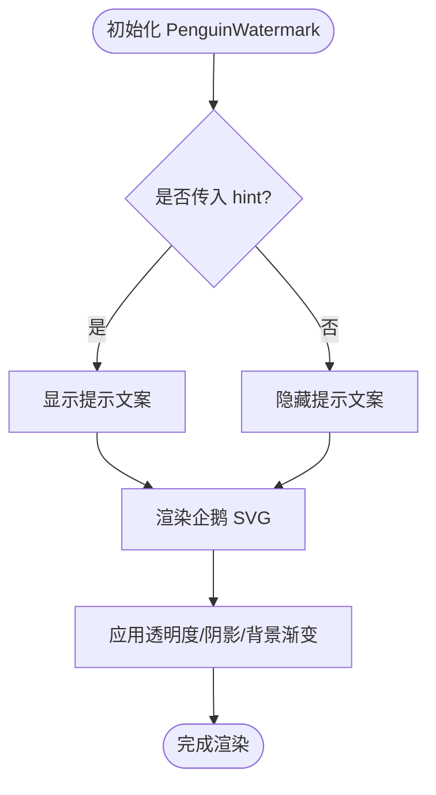
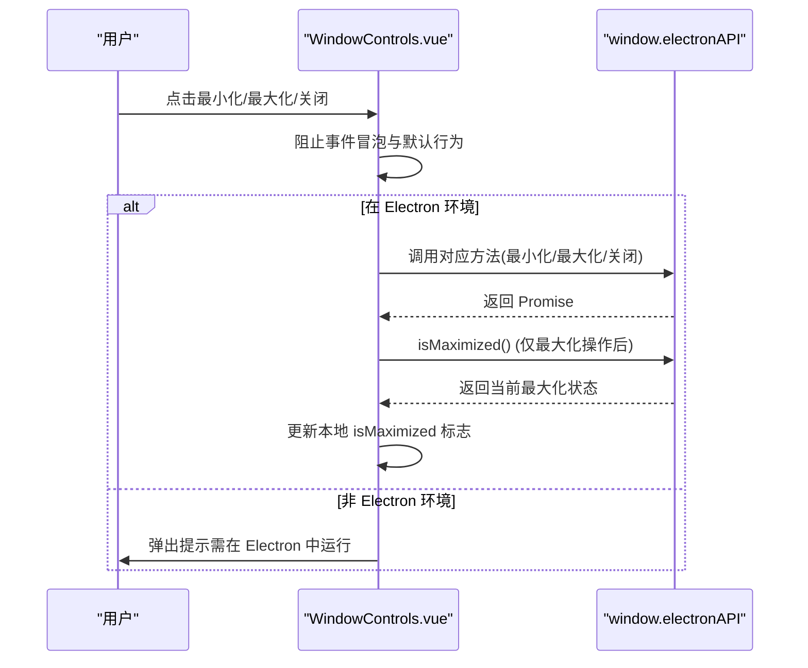
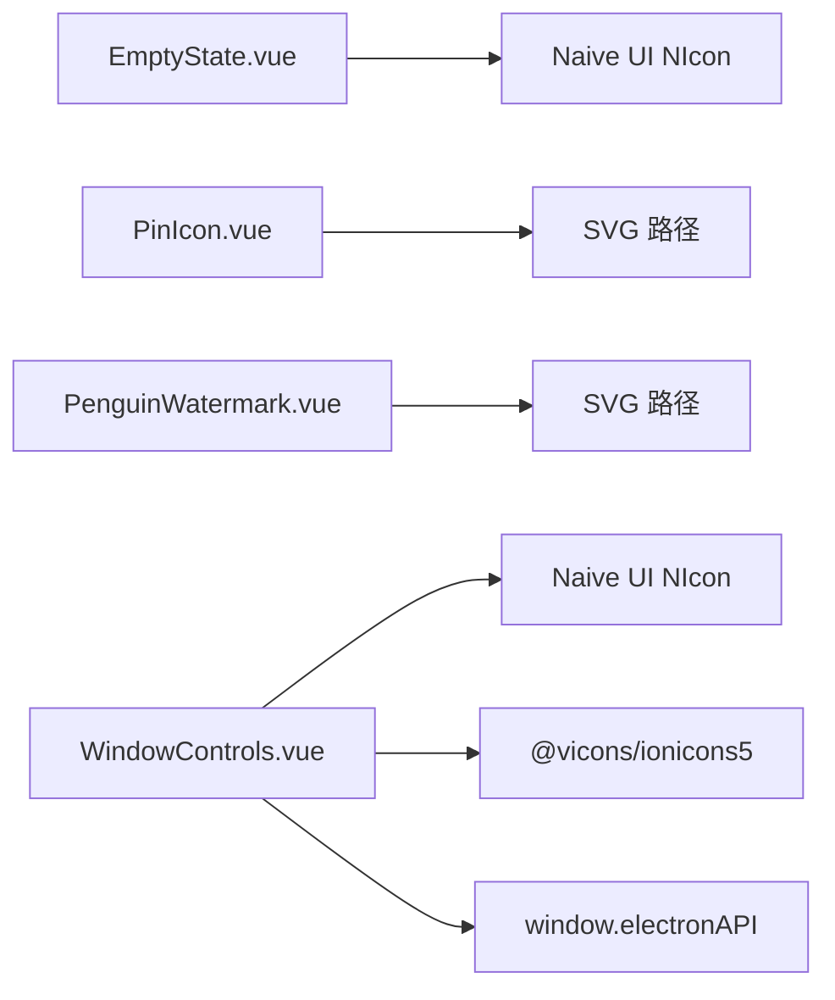

# 通用工具组件

<cite>
**本文引用的文件**
- [EmptyState.vue](file://linkx-client/src/components/common/EmptyState.vue)
- [PinIcon.vue](file://linkx-client/src/components/icons/PinIcon.vue)
- [PenguinWatermark.vue](file://linkx-client/src/components/PenguinWatermark.vue)
- [WindowControls.vue](file://linkx-client/src/components/WindowControls.vue)
- [ChatList.vue](file://linkx-client/src/components/ChatList.vue)
- [ContactsPanel.vue](file://linkx-client/src/components/ContactsPanel.vue)
- [MomentsModal.vue](file://linkx-client/src/components/MomentsModal.vue)
- [MomentsPanel.vue](file://linkx-client/src/components/MomentsPanel.vue)
</cite>

## 目录
1. [简介](#简介)
2. [项目结构](#项目结构)
3. [核心组件](#核心组件)
4. [架构总览](#架构总览)
5. [详细组件分析](#详细组件分析)
6. [依赖关系分析](#依赖关系分析)
7. [性能考虑](#性能考虑)
8. [故障排查指南](#故障排查指南)
9. [结论](#结论)
10. [附录](#附录)

## 简介
本指南面向 LinkX 前端工程中的通用工具组件，聚焦以下四个可复用组件：
- EmptyState 空状态占位组件：提供统一的无数据展示模式与插槽扩展能力。
- PinIcon 图标组件：基于 SVG 的置顶图钉图标，支持尺寸配置与主题色适配。
- PenguinWatermark 企鹅水印组件：品牌化占位图形与提示文案的可控展示。
- WindowControls 窗口控制组件：在 Electron 环境下集成原生窗口操作（最小化、最大化/还原、关闭），并提供跨环境兼容与样式定制方案。

文档将覆盖组件职责、属性与插槽、使用场景、主题与样式定制、最佳实践与常见问题定位方法，帮助开发者快速掌握并高效复用这些组件。

## 项目结构
上述组件位于 linkx-client/src/components 目录下，按功能域组织：
- common：通用 UI 组件（如 EmptyState）
- icons：独立图标组件（如 PinIcon）
- 业务容器内嵌的通用占位与窗口控制（如 PenguinWatermark、WindowControls）

图表来源
- [EmptyState.vue:1-77](file://linkx-client/src/components/common/EmptyState.vue#L1-L77)
- [PinIcon.vue:1-36](file://linkx-client/src/components/icons/PinIcon.vue#L1-L36)
- [PenguinWatermark.vue:1-85](file://linkx-client/src/components/PenguinWatermark.vue#L1-L85)
- [WindowControls.vue:1-143](file://linkx-client/src/components/WindowControls.vue#L1-L143)
- [ChatList.vue:150-349](file://linkx-client/src/components/ChatList.vue#L150-L349)
- [ContactsPanel.vue:185-384](file://linkx-client/src/components/ContactsPanel.vue#L185-L384)
- [MomentsModal.vue:290-489](file://linkx-client/src/components/MomentsModal.vue#L290-L489)
- [MomentsPanel.vue:140-339](file://linkx-client/src/components/MomentsPanel.vue#L140-L339)

章节来源
- [EmptyState.vue:1-77](file://linkx-client/src/components/common/EmptyState.vue#L1-L77)
- [PinIcon.vue:1-36](file://linkx-client/src/components/icons/PinIcon.vue#L1-L36)
- [PenguinWatermark.vue:1-85](file://linkx-client/src/components/PenguinWatermark.vue#L1-L85)
- [WindowControls.vue:1-143](file://linkx-client/src/components/WindowControls.vue#L1-L143)
- [ChatList.vue:150-349](file://linkx-client/src/components/ChatList.vue#L150-L349)
- [ContactsPanel.vue:185-384](file://linkx-client/src/components/ContactsPanel.vue#L185-L384)
- [MomentsModal.vue:290-489](file://linkx-client/src/components/MomentsModal.vue#L290-L489)
- [MomentsPanel.vue:140-339](file://linkx-client/src/components/MomentsPanel.vue#L140-L339)

## 核心组件
本节对四个通用组件进行概览式说明，后续章节将深入展开实现细节与最佳实践。

- EmptyState 空状态组件
  - 作用：统一列表/页面空态展示，支持可选图标、标题、描述与操作插槽。
  - 关键特性：响应式条件渲染、主题变量驱动颜色、居中布局与最大宽度限制。
  - 典型用法：搜索无结果、列表为空、初始化引导等。

- PinIcon 图标组件
  - 作用：提供可配置的 SVG 置顶图钉图标，默认尺寸 16px，可通过 size 属性调整。
  - 关键特性：SVG stroke 使用 currentColor 以跟随主题；flex-shrink 防止压缩。
  - 典型用法：会话置顶标记、重要条目标识等。

- PenguinWatermark 企鹅水印组件
  - 作用：品牌化占位图形，附带底部提示文案 hint，用于主面板未选择会话时的友好提示。
  - 关键特性：SVG 多元素组合、透明度与阴影营造氛围感、hint 可选显示。
  - 典型用法：聊天主面板空白区、占位引导页等。

- WindowControls 窗口控制组件
  - 作用：在 Electron 环境下提供最小化、最大化/还原、关闭按钮，自动同步最大化状态。
  - 关键特性：通过 window.electronAPI 调用原生 API；非 Electron 环境降级提示；事件阻止冒泡避免拖拽冲突；CSS 禁用拖拽区域。
  - 典型用法：应用标题栏右侧系统按钮区。

章节来源
- [EmptyState.vue:1-77](file://linkx-client/src/components/common/EmptyState.vue#L1-L77)
- [PinIcon.vue:1-36](file://linkx-client/src/components/icons/PinIcon.vue#L1-L36)
- [PenguinWatermark.vue:1-85](file://linkx-client/src/components/PenguinWatermark.vue#L1-L85)
- [WindowControls.vue:1-143](file://linkx-client/src/components/WindowControls.vue#L1-L143)

## 架构总览
从组件交互角度，通用工具组件被多个业务视图复用，形成“低耦合、高内聚”的组件层。

图表来源
- [EmptyState.vue:1-77](file://linkx-client/src/components/common/EmptyState.vue#L1-L77)
- [PinIcon.vue:1-36](file://linkx-client/src/components/icons/PinIcon.vue#L1-L36)
- [PenguinWatermark.vue:1-85](file://linkx-client/src/components/PenguinWatermark.vue#L1-L85)
- [WindowControls.vue:1-143](file://linkx-client/src/components/WindowControls.vue#L1-L143)
- [ChatList.vue:150-349](file://linkx-client/src/components/ChatList.vue#L150-L349)
- [ContactsPanel.vue:185-384](file://linkx-client/src/components/ContactsPanel.vue#L185-L384)
- [MomentsModal.vue:290-489](file://linkx-client/src/components/MomentsModal.vue#L290-L489)
- [MomentsPanel.vue:140-339](file://linkx-client/src/components/MomentsPanel.vue#L140-L339)

## 详细组件分析

### EmptyState 空状态组件
- 设计目标
  - 为无数据或无匹配结果提供一致的视觉反馈与交互入口。
- 属性与插槽
  - icon：可选图标组件（由上层传入）。
  - title：主标题文本。
  - description：副标题/说明文本。
  - action 插槽：用于放置操作按钮或链接。
- 展示逻辑
  - 条件渲染：仅当对应属性存在时显示相应区域。
  - 布局：垂直居中、固定高度、最大宽度限制，保证在不同容器中稳定呈现。
  - 主题：颜色采用 CSS 变量，便于全局主题切换。
- 使用建议
  - 在搜索无结果、列表为空、加载失败后重试前等场景使用。
  - 通过 action 插槽提供“刷新”、“清空筛选”、“新建”等动作。
- 复杂度与性能
  - 纯展示型组件，无复杂计算，渲染开销极低。
- 错误处理
  - 对外部传入的 icon 组件做 v-if 保护，避免未定义导致的渲染异常。

图表来源
- [EmptyState.vue:1-77](file://linkx-client/src/components/common/EmptyState.vue#L1-L77)

章节来源
- [EmptyState.vue:1-77](file://linkx-client/src/components/common/EmptyState.vue#L1-L77)
- [ChatList.vue:150-349](file://linkx-client/src/components/ChatList.vue#L150-L349)
- [ContactsPanel.vue:185-384](file://linkx-client/src/components/ContactsPanel.vue#L185-L384)
- [MomentsModal.vue:290-489](file://linkx-client/src/components/MomentsModal.vue#L290-L489)
- [MomentsPanel.vue:140-339](file://linkx-client/src/components/MomentsPanel.vue#L140-L339)

### PinIcon 图标组件
- 设计目标
  - 提供轻量、可复用的置顶图钉图标，支持尺寸与主题色自适应。
- 属性
  - size：数字类型，单位 px，默认 16。
- 主题适配
  - SVG path 的 stroke 使用 currentColor，继承父级 color，从而跟随主题变量。
- 使用建议
  - 在列表项、卡片头部等位置作为状态指示器。
  - 根据上下文合理设置 size，保持视觉一致性。
- 性能与兼容性
  - 纯 SVG 矢量图，缩放不失真；display:block 与 flex-shrink:0 确保布局稳定。

图表来源
- [PinIcon.vue:1-36](file://linkx-client/src/components/icons/PinIcon.vue#L1-L36)

章节来源
- [PinIcon.vue:1-36](file://linkx-client/src/components/icons/PinIcon.vue#L1-L36)
- [ChatList.vue:150-349](file://linkx-client/src/components/ChatList.vue#L150-L349)

### PenguinWatermark 企鹅水印组件
- 设计目标
  - 以品牌化的企鹅图形配合提示文案，提升空态体验与品牌识别度。
- 属性
  - hint：字符串，底部提示文案，默认值用于引导用户选择会话。
- 展示逻辑
  - 条件渲染 hint，仅在传入非空值时显示。
  - 图形使用多层 SVG 元素组合，并通过 CSS 变量与透明度营造柔和氛围。
- 位置控制
  - 外层容器使用弹性布局居中，适合嵌入任意面板空白区域。
- 使用建议
  - 在主面板未选择会话、初次打开应用等场景使用。
  - 可根据产品策略自定义 hint 文案，增强引导效果。

图表来源
- [PenguinWatermark.vue:1-85](file://linkx-client/src/components/PenguinWatermark.vue#L1-L85)

章节来源
- [PenguinWatermark.vue:1-85](file://linkx-client/src/components/PenguinWatermark.vue#L1-L85)

### WindowControls 窗口控制组件
- 设计目标
  - 在 Electron 环境下提供原生窗口控制按钮，并在浏览器环境中给出明确提示。
- 功能要点
  - 最小化、最大化/还原、关闭三个操作。
  - 组件挂载时同步当前窗口最大化状态，并监听变化实时更新本地标志。
  - 点击事件阻止冒泡与默认行为，避免与标题栏拖拽冲突。
  - 非 Electron 环境弹出提示，引导用户使用 electron:dev 启动。
- 跨平台兼容
  - 通过 window.electronAPI 判断运行环境，缺失则降级提示。
  - CSS 使用 -webkit-app-region: no-drag 确保按钮区域不被当作拖拽区。
- 样式定制
  - 按钮 hover 态使用主题变量，关闭按钮 hover 使用危险色，便于语义化区分。
  - 图标大小与缩放微调，保证视觉对齐。

图表来源
- [WindowControls.vue:1-143](file://linkx-client/src/components/WindowControls.vue#L1-L143)

章节来源
- [WindowControls.vue:1-143](file://linkx-client/src/components/WindowControls.vue#L1-L143)

## 依赖关系分析
- EmptyState 依赖 Naive UI 的 NIcon 组件用于渲染外部传入的图标。
- PinIcon 不依赖第三方图标库，完全自包含 SVG。
- PenguinWatermark 不依赖第三方图标库，完全自包含 SVG。
- WindowControls 依赖 Naive UI 的 NIcon 与 Ionicons5 图标集，并通过 window.electronAPI 与 Electron 主进程通信。

图表来源
- [EmptyState.vue:1-77](file://linkx-client/src/components/common/EmptyState.vue#L1-L77)
- [PinIcon.vue:1-36](file://linkx-client/src/components/icons/PinIcon.vue#L1-L36)
- [PenguinWatermark.vue:1-85](file://linkx-client/src/components/PenguinWatermark.vue#L1-L85)
- [WindowControls.vue:1-143](file://linkx-client/src/components/WindowControls.vue#L1-L143)

章节来源
- [EmptyState.vue:1-77](file://linkx-client/src/components/common/EmptyState.vue#L1-L77)
- [PinIcon.vue:1-36](file://linkx-client/src/components/icons/PinIcon.vue#L1-L36)
- [PenguinWatermark.vue:1-85](file://linkx-client/src/components/PenguinWatermark.vue#L1-L85)
- [WindowControls.vue:1-143](file://linkx-client/src/components/WindowControls.vue#L1-L143)

## 性能考虑
- EmptyState：纯展示组件，条件渲染开销小，适合频繁出现于列表空态。
- PinIcon：SVG 矢量图，缩放无损，渲染成本低；注意避免过大尺寸导致重绘。
- PenguinWatermark：SVG 元素较多但静态，建议使用懒加载或按需引入以提升首屏性能。
- WindowControls：仅在挂载时查询一次状态并注册监听，卸载时清理监听，避免内存泄漏；事件处理轻量。

[本节为通用指导，无需源码引用]

## 故障排查指南
- WindowControls 在非 Electron 环境无效
  - 现象：点击按钮无反应或提示需在 Electron 中运行。
  - 排查：确认是否在 electron:dev 或打包后的 Electron 应用中运行；检查 window.electronAPI 是否存在。
  - 参考：组件内部的环境判断与降级提示逻辑。
- EmptyState 未显示
  - 现象：空态区域不出现。
  - 排查：确认是否传入了 title/description/icon 任一属性；检查 action 插槽是否覆盖了内容区域。
- PinIcon 颜色不正确
  - 现象：图标颜色未按主题变化。
  - 排查：确认父级 color 是否正确设置；检查 CSS 变量是否生效。
- PenguinWatermark 提示文案不显示
  - 现象：hint 未显示。
  - 排查：确认是否传入非空字符串；检查 v-if 条件与模板绑定。

章节来源
- [WindowControls.vue:1-143](file://linkx-client/src/components/WindowControls.vue#L1-L143)
- [EmptyState.vue:1-77](file://linkx-client/src/components/common/EmptyState.vue#L1-L77)
- [PinIcon.vue:1-36](file://linkx-client/src/components/icons/PinIcon.vue#L1-L36)
- [PenguinWatermark.vue:1-85](file://linkx-client/src/components/PenguinWatermark.vue#L1-L85)

## 结论
以上四个通用工具组件在 LinkX 前端工程中承担关键的展示与交互职责：
- EmptyState 提供一致的空态体验与可扩展插槽。
- PinIcon 以 SVG 为核心，兼顾主题与尺寸灵活性。
- PenguinWatermark 强化品牌感知与用户引导。
- WindowControls 桥接 Electron 原生能力，保障跨环境可用性与用户体验。

遵循本文的最佳实践与注意事项，可在不同业务场景中稳定复用这些组件，提升开发效率与界面一致性。

[本节为总结性内容，无需源码引用]

## 附录
- 组件复用策略
  - 将空态、占位与窗口控制抽象为通用组件，减少重复代码。
  - 通过属性与插槽实现灵活定制，避免硬编码。
- 图标资源管理
  - 优先使用 SVG 与 currentColor 实现主题适配。
  - 集中管理常用图标，建立命名规范与尺寸约定。
- 样式定制最佳实践
  - 使用 CSS 变量统一管理主题色、间距与圆角。
  - 针对交互态（hover、active）提供明确的视觉反馈。
  - 在 Electron 环境中合理使用 -webkit-app-region 控制拖拽区域。

[本节为通用指导，无需源码引用]