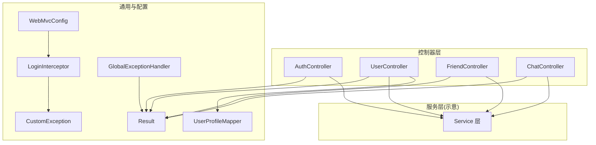
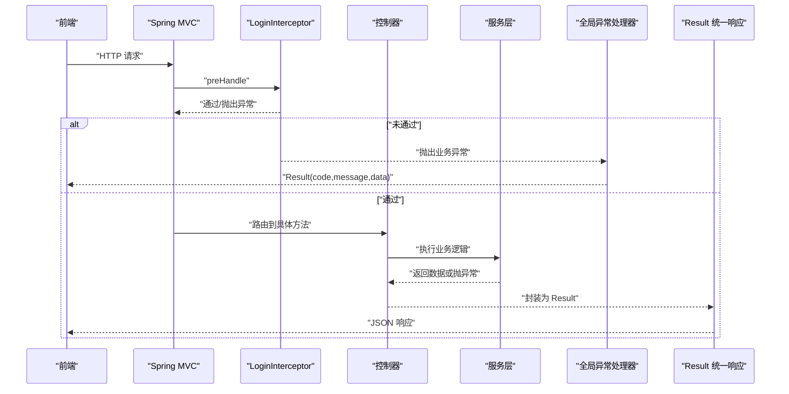
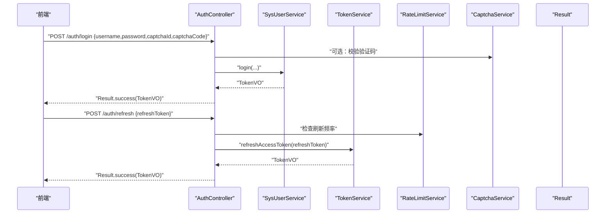
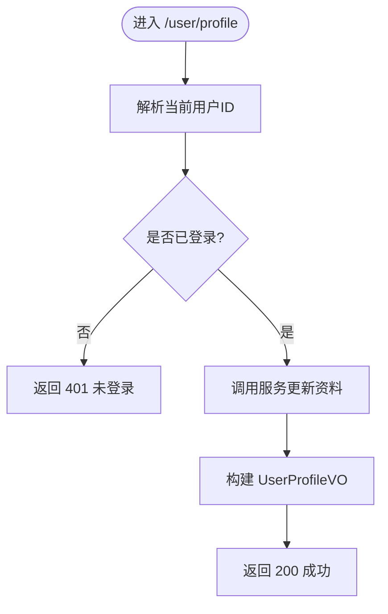
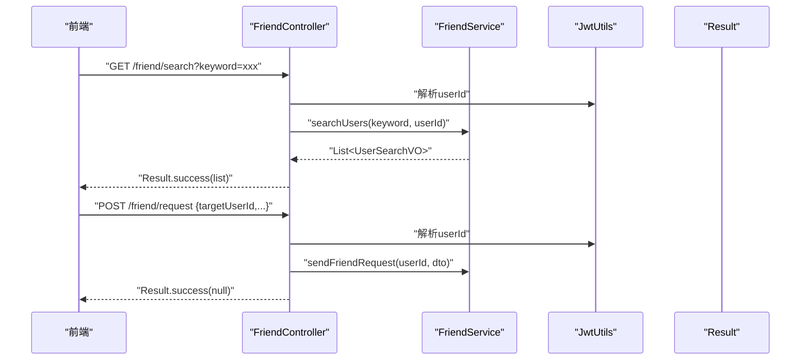
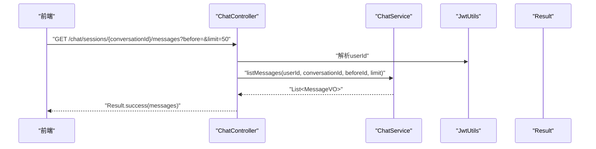
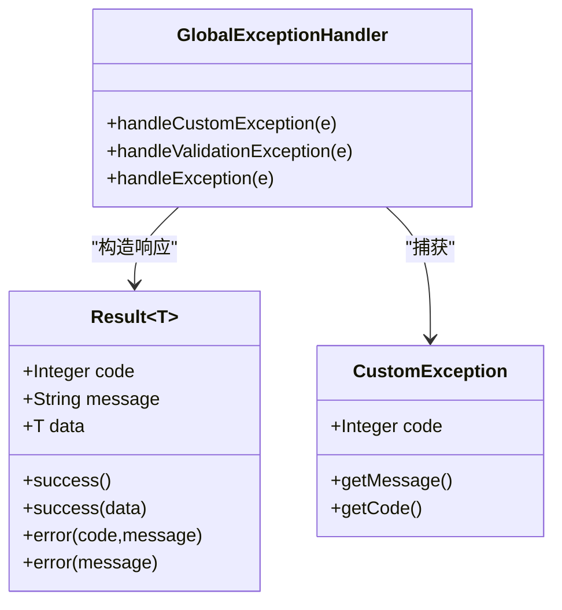
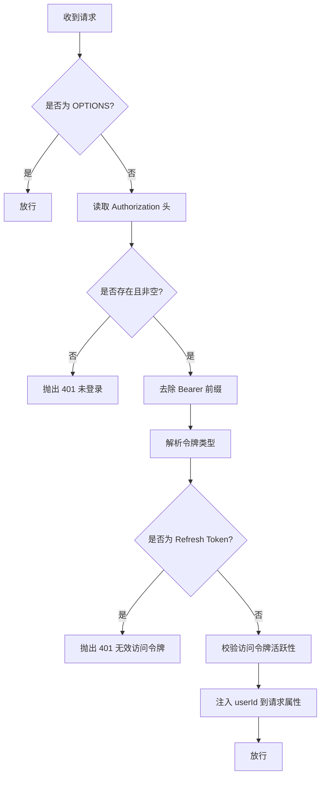
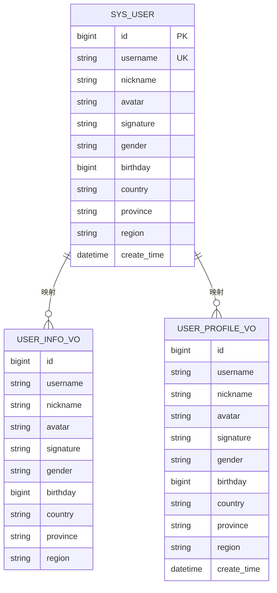
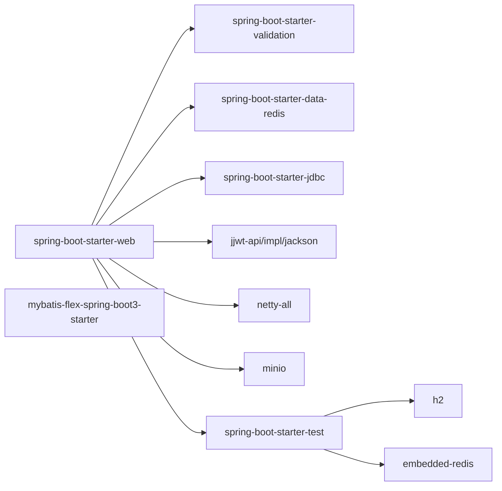

# API 接口设计

<cite>
**本文引用的文件**   
- [Result.java](file://linkx-server/src/main/java/com/linkx/server/common/Result.java)
- [AuthController.java](file://linkx-server/src/main/java/com/linkx/server/controller/AuthController.java)
- [UserController.java](file://linkx-server/src/main/java/com/linkx/server/controller/UserController.java)
- [FriendController.java](file://linkx-server/src/main/java/com/linkx/server/controller/FriendController.java)
- [ChatController.java](file://linkx-server/src/main/java/com/linkx/server/controller/ChatController.java)
- [GlobalExceptionHandler.java](file://linkx-server/src/main/java/com/linkx/server/exception/GlobalExceptionHandler.java)
- [CustomException.java](file://linkx-server/src/main/java/com/linkx/server/exception/CustomException.java)
- [WebMvcConfig.java](file://linkx-server/src/main/java/com/linkx/server/config/WebMvcConfig.java)
- [LoginInterceptor.java](file://linkx-server/src/main/java/com/linkx/server/config/interceptor/LoginInterceptor.java)
- [UserProfileMapper.java](file://linkx-server/src/main/java/com/linkx/server/common/UserProfileMapper.java)
- [UserInfoVO.java](file://linkx-server/src/main/java/com/linkx/server/controller/vo/UserInfoVO.java)
- [UserProfileVO.java](file://linkx-server/src/main/java/com/linkx/server/controller/vo/UserProfileVO.java)
- [LoginDTO.java](file://linkx-server/src/main/java/com/linkx/server/controller/dto/LoginDTO.java)
- [RegisterDTO.java](file://linkx-server/src/main/java/com/linkx/server/controller/dto/RegisterDTO.java)
- [UpdateProfileDTO.java](file://linkx-server/src/main/java/com/linkx/server/controller/dto/UpdateProfileDTO.java)
- [pom.xml](file://linkx-server/pom.xml)
</cite>

## 目录
1. [简介](#简介)
2. [项目结构](#项目结构)
3. [核心组件](#核心组件)
4. [架构总览](#架构总览)
5. [详细组件分析](#详细组件分析)
6. [依赖分析](#依赖分析)
7. [性能考虑](#性能考虑)
8. [故障排查指南](#故障排查指南)
9. [结论](#结论)
10. [附录](#附录)

## 简介
本文件为 LinkX RESTful API 的接口规范与设计文档，面向前后端开发者与集成方。内容覆盖：
- 基于 Spring MVC 的控制器层设计模式与统一响应包装 Result 类
- DTO/VO 数据传输对象与视图对象转换策略
- 认证鉴权、参数校验、错误处理机制
- 分页查询与批量操作的最佳实践建议
- 接口文档生成（Swagger）集成方案、API 测试策略与性能监控指标
- 前端调用指南与示例

## 项目结构
后端采用分层架构：controller -> service -> mapper/entity，配合拦截器进行鉴权，全局异常处理器统一返回格式。关键路径如下：
- 控制器：auth、user、friend、chat 等模块
- 通用：统一响应 Result、用户资料映射 UserProfileMapper
- 配置：WebMvcConfig（拦截器、CORS）、登录拦截器 LoginInterceptor
- 异常：自定义异常 CustomException 与全局异常处理器 GlobalExceptionHandler
- DTO/VO：请求参数 DTO 与响应 VO 分离，避免敏感字段泄露

图表来源
- [AuthController.java:1-84](file://linkx-server/src/main/java/com/linkx/server/controller/AuthController.java#L1-L84)
- [UserController.java:1-145](file://linkx-server/src/main/java/com/linkx/server/controller/UserController.java#L1-L145)
- [FriendController.java:1-96](file://linkx-server/src/main/java/com/linkx/server/controller/FriendController.java#L1-L96)
- [ChatController.java:1-72](file://linkx-server/src/main/java/com/linkx/server/controller/ChatController.java#L1-L72)
- [Result.java:1-95](file://linkx-server/src/main/java/com/linkx/server/common/Result.java#L1-L95)
- [WebMvcConfig.java:1-47](file://linkx-server/src/main/java/com/linkx/server/config/WebMvcConfig.java#L1-L47)
- [LoginInterceptor.java:1-53](file://linkx-server/src/main/java/com/linkx/server/config/interceptor/LoginInterceptor.java#L1-L53)
- [GlobalExceptionHandler.java:1-53](file://linkx-server/src/main/java/com/linkx/server/exception/GlobalExceptionHandler.java#L1-L53)
- [CustomException.java:1-40](file://linkx-server/src/main/java/com/linkx/server/exception/CustomException.java#L1-L40)
- [UserProfileMapper.java:1-52](file://linkx-server/src/main/java/com/linkx/server/common/UserProfileMapper.java#L1-L52)

章节来源
- [AuthController.java:1-84](file://linkx-server/src/main/java/com/linkx/server/controller/AuthController.java#L1-L84)
- [UserController.java:1-145](file://linkx-server/src/main/java/com/linkx/server/controller/UserController.java#L1-L145)
- [FriendController.java:1-96](file://linkx-server/src/main/java/com/linkx/server/controller/FriendController.java#L1-L96)
- [ChatController.java:1-72](file://linkx-server/src/main/java/com/linkx/server/controller/ChatController.java#L1-L72)
- [WebMvcConfig.java:1-47](file://linkx-server/src/main/java/com/linkx/server/config/WebMvcConfig.java#L1-L47)
- [LoginInterceptor.java:1-53](file://linkx-server/src/main/java/com/linkx/server/config/interceptor/LoginInterceptor.java#L1-L53)
- [GlobalExceptionHandler.java:1-53](file://linkx-server/src/main/java/com/linkx/server/exception/GlobalExceptionHandler.java#L1-L53)
- [CustomException.java:1-40](file://linkx-server/src/main/java/com/linkx/server/exception/CustomException.java#L1-L40)
- [UserProfileMapper.java:1-52](file://linkx-server/src/main/java/com/linkx/server/common/UserProfileMapper.java#L1-L52)

## 核心组件
- 统一响应 Result<T>
  - 字段：code、message、data；提供 success()/error() 静态工厂方法
  - 作用：前后端约定一致的 JSON 响应结构，便于前端统一处理
- 全局异常处理
  - 捕获业务异常、参数校验异常与未知异常，统一封装为 Result
  - 将业务码映射到合适的 HTTP 状态码
- 登录拦截器
  - 解析 Authorization 头，校验访问令牌类型与有效性，注入 userId 到请求属性
- DTO/VO 与映射
  - DTO 用于入参校验（如 LoginDTO、RegisterDTO、UpdateProfileDTO）
  - VO 用于出参展示（如 UserInfoVO、UserProfileVO），通过 UserProfileMapper 从实体构建

章节来源
- [Result.java:1-95](file://linkx-server/src/main/java/com/linkx/server/common/Result.java#L1-L95)
- [GlobalExceptionHandler.java:1-53](file://linkx-server/src/main/java/com/linkx/server/exception/GlobalExceptionHandler.java#L1-L53)
- [LoginInterceptor.java:1-53](file://linkx-server/src/main/java/com/linkx/server/config/interceptor/LoginInterceptor.java#L1-L53)
- [LoginDTO.java:1-23](file://linkx-server/src/main/java/com/linkx/server/controller/dto/LoginDTO.java#L1-L23)
- [RegisterDTO.java:1-28](file://linkx-server/src/main/java/com/linkx/server/controller/dto/RegisterDTO.java#L1-L28)
- [UpdateProfileDTO.java:1-54](file://linkx-server/src/main/java/com/linkx/server/controller/dto/UpdateProfileDTO.java#L1-L54)
- [UserInfoVO.java:1-49](file://linkx-server/src/main/java/com/linkx/server/controller/vo/UserInfoVO.java#L1-L49)
- [UserProfileVO.java:1-70](file://linkx-server/src/main/java/com/linkx/server/controller/vo/UserProfileVO.java#L1-L70)
- [UserProfileMapper.java:1-52](file://linkx-server/src/main/java/com/linkx/server/common/UserProfileMapper.java#L1-L52)

## 架构总览
下图展示了典型请求在控制器层的处理流程，包括鉴权、参数校验、业务处理与统一响应。

图表来源
- [WebMvcConfig.java:1-47](file://linkx-server/src/main/java/com/linkx/server/config/WebMvcConfig.java#L1-L47)
- [LoginInterceptor.java:1-53](file://linkx-server/src/main/java/com/linkx/server/config/interceptor/LoginInterceptor.java#L1-L53)
- [GlobalExceptionHandler.java:1-53](file://linkx-server/src/main/java/com/linkx/server/exception/GlobalExceptionHandler.java#L1-L53)
- [Result.java:1-95](file://linkx-server/src/main/java/com/linkx/server/common/Result.java#L1-L95)

## 详细组件分析

### 认证与授权（AuthController）
- 能力概览
  - 获取验证码、注册、登录、刷新令牌、登出
  - 可选开启验证码校验，按 IP 对刷新接口限流
- 请求与响应
  - 登录/注册：请求体使用 DTO（用户名、密码、昵称、验证码等），响应为 Result<TokenVO>/Result<Void>
  - 刷新：请求体包含 refreshToken，响应为 Result<TokenVO>
  - 登出：支持从请求体或上下文获取 refreshToken，响应为 Result<Void>
- 安全与校验
  - 登录拦截器排除 /auth/* 路径，无需鉴权
  - 登录/注册时根据配置决定是否校验验证码
  - 刷新接口按客户端 IP 做速率限制

图表来源
- [AuthController.java:1-84](file://linkx-server/src/main/java/com/linkx/server/controller/AuthController.java#L1-L84)
- [LoginDTO.java:1-23](file://linkx-server/src/main/java/com/linkx/server/controller/dto/LoginDTO.java#L1-L23)
- [RegisterDTO.java:1-28](file://linkx-server/src/main/java/com/linkx/server/controller/dto/RegisterDTO.java#L1-L28)

章节来源
- [AuthController.java:1-84](file://linkx-server/src/main/java/com/linkx/server/controller/AuthController.java#L1-L84)

### 用户资料（UserController）
- 能力概览
  - 获取当前用户信息、更新个人资料、上传头像、查看他人公开资料
- 鉴权
  - 通过拦截器注入的 userId 或 Authorization 头解析当前用户
- 文件上传
  - 仅允许图片类型，上传后更新用户头像并返回 URL
- 响应
  - 返回 UserProfileVO，由 UserProfileMapper 从实体构建

图表来源
- [UserController.java:1-145](file://linkx-server/src/main/java/com/linkx/server/controller/UserController.java#L1-L145)
- [UserProfileMapper.java:1-52](file://linkx-server/src/main/java/com/linkx/server/common/UserProfileMapper.java#L1-L52)

章节来源
- [UserController.java:1-145](file://linkx-server/src/main/java/com/linkx/server/controller/UserController.java#L1-L145)
- [UserProfileMapper.java:1-52](file://linkx-server/src/main/java/com/linkx/server/common/UserProfileMapper.java#L1-L52)

### 好友关系（FriendController）
- 能力概览
  - 搜索用户、发送好友申请、查看收/发申请列表、接受/拒绝申请、删除好友
- 鉴权
  - 所有接口均需登录态，通过 JwtUtils 解析 userId
- 参数校验
  - 请求体使用 DTO 注解校验；路径 ID 非法时抛出业务异常

图表来源
- [FriendController.java:1-96](file://linkx-server/src/main/java/com/linkx/server/controller/FriendController.java#L1-L96)

章节来源
- [FriendController.java:1-96](file://linkx-server/src/main/java/com/linkx/server/controller/FriendController.java#L1-L96)

### 聊天会话（ChatController）
- 能力概览
  - 列出会话、打开私聊会话、分页拉取消息、上传聊天文件
- 分页
  - 通过 before 游标与 limit 控制分页，默认每次 50 条
- 鉴权
  - 所有接口需登录态

图表来源
- [ChatController.java:1-72](file://linkx-server/src/main/java/com/linkx/server/controller/ChatController.java#L1-L72)

章节来源
- [ChatController.java:1-72](file://linkx-server/src/main/java/com/linkx/server/controller/ChatController.java#L1-L72)

### 统一响应与错误处理
- 统一响应 Result<T>
  - code/message/data 三字段，success()/error() 工厂方法
- 全局异常处理
  - 业务异常：按 code 映射 HTTP 状态码并返回 Result
  - 参数校验异常：返回 400 与第一条校验错误信息
  - 未知异常：返回 500 与友好提示
- 自定义异常
  - 携带业务码与消息，供全局处理器消费

图表来源
- [Result.java:1-95](file://linkx-server/src/main/java/com/linkx/server/common/Result.java#L1-L95)
- [CustomException.java:1-40](file://linkx-server/src/main/java/com/linkx/server/exception/CustomException.java#L1-L40)
- [GlobalExceptionHandler.java:1-53](file://linkx-server/src/main/java/com/linkx/server/exception/GlobalExceptionHandler.java#L1-L53)

章节来源
- [Result.java:1-95](file://linkx-server/src/main/java/com/linkx/server/common/Result.java#L1-L95)
- [CustomException.java:1-40](file://linkx-server/src/main/java/com/linkx/server/exception/CustomException.java#L1-L40)
- [GlobalExceptionHandler.java:1-53](file://linkx-server/src/main/java/com/linkx/server/exception/GlobalExceptionHandler.java#L1-L53)

### 鉴权与拦截器
- 登录拦截器
  - 跳过 OPTIONS 预检
  - 解析 Authorization 头，去除 Bearer 前缀
  - 校验令牌类型（禁止 Refresh Token 访问受保护资源）
  - 校验访问令牌活跃性，注入 userId 到 request 属性
- WebMvc 配置
  - 注册登录拦截器，排除认证相关路径
  - 配置 CORS，支持本地开发域名白名单

图表来源
- [LoginInterceptor.java:1-53](file://linkx-server/src/main/java/com/linkx/server/config/interceptor/LoginInterceptor.java#L1-L53)
- [WebMvcConfig.java:1-47](file://linkx-server/src/main/java/com/linkx/server/config/WebMvcConfig.java#L1-L47)

章节来源
- [LoginInterceptor.java:1-53](file://linkx-server/src/main/java/com/linkx/server/config/interceptor/LoginInterceptor.java#L1-L53)
- [WebMvcConfig.java:1-47](file://linkx-server/src/main/java/com/linkx/server/config/WebMvcConfig.java#L1-L47)

### DTO/VO 与数据模型
- DTO（入参）
  - LoginDTO：用户名、密码、验证码
  - RegisterDTO：用户名、密码、昵称、验证码
  - UpdateProfileDTO：昵称、签名、性别、生日、地区信息等
- VO（出参）
  - UserInfoVO：登录成功后返回的用户基本信息
  - UserProfileVO：用户资料详情，含创建时间
- 映射
  - UserProfileMapper：从实体构建不同场景的 VO，屏蔽敏感字段

图表来源
- [UserInfoVO.java:1-49](file://linkx-server/src/main/java/com/linkx/server/controller/vo/UserInfoVO.java#L1-L49)
- [UserProfileVO.java:1-70](file://linkx-server/src/main/java/com/linkx/server/controller/vo/UserProfileVO.java#L1-L70)
- [UserProfileMapper.java:1-52](file://linkx-server/src/main/java/com/linkx/server/common/UserProfileMapper.java#L1-L52)

章节来源
- [LoginDTO.java:1-23](file://linkx-server/src/main/java/com/linkx/server/controller/dto/LoginDTO.java#L1-L23)
- [RegisterDTO.java:1-28](file://linkx-server/src/main/java/com/linkx/server/controller/dto/RegisterDTO.java#L1-L28)
- [UpdateProfileDTO.java:1-54](file://linkx-server/src/main/java/com/linkx/server/controller/dto/UpdateProfileDTO.java#L1-L54)
- [UserInfoVO.java:1-49](file://linkx-server/src/main/java/com/linkx/server/controller/vo/UserInfoVO.java#L1-L49)
- [UserProfileVO.java:1-70](file://linkx-server/src/main/java/com/linkx/server/controller/vo/UserProfileVO.java#L1-L70)
- [UserProfileMapper.java:1-52](file://linkx-server/src/main/java/com/linkx/server/common/UserProfileMapper.java#L1-L52)

## 依赖分析
- 框架与工具
  - Spring Boot Web、Validation、Redis、JDBC、MyBatis-Flex、JWT、Netty、MinIO、Lombok、BCrypt
- 测试依赖
  - Spring Boot Test、H2、嵌入式 Redis（集成测试）

图表来源
- [pom.xml:1-168](file://linkx-server/pom.xml#L1-L168)

章节来源
- [pom.xml:1-168](file://linkx-server/pom.xml#L1-L168)

## 性能考虑
- 分页与游标
  - 聊天消息采用 before 游标+limit 的分页方式，避免深度分页带来的数据库压力
- 缓存与限流
  - 刷新令牌接口按客户端 IP 限流，防止滥用
  - 可结合 Redis 缓存热点数据（如用户资料、会话列表）
- 文件上传
  - 头像与聊天文件走对象存储，减少应用服务器 IO 压力
- 连接池与序列化
  - 合理配置数据库连接池与 Jackson 序列化选项，降低 GC 与序列化开销

[本节为通用指导，不直接分析具体文件]

## 故障排查指南
- 常见错误码与含义
  - 400：参数校验失败或业务规则不满足
  - 401：未登录或登录已过期、无效的访问令牌
  - 403：无权限
  - 429：请求过于频繁
  - 500：系统内部繁忙
- 定位步骤
  - 检查请求头 Authorization 是否正确携带 Bearer Token
  - 确认登录拦截器是否放行对应路径
  - 查看全局异常处理器日志输出，区分业务异常与系统异常
  - 对于参数校验失败，关注第一条校验错误信息

章节来源
- [GlobalExceptionHandler.java:1-53](file://linkx-server/src/main/java/com/linkx/server/exception/GlobalExceptionHandler.java#L1-L53)
- [CustomException.java:1-40](file://linkx-server/src/main/java/com/linkx/server/exception/CustomException.java#L1-L40)
- [LoginInterceptor.java:1-53](file://linkx-server/src/main/java/com/linkx/server/config/interceptor/LoginInterceptor.java#L1-L53)

## 结论
LinkX 后端采用清晰的 Spring MVC 分层与统一的 Result 响应包装，结合登录拦截器与全局异常处理，形成稳定可靠的 RESTful API 基础。通过 DTO/VO 分离与 Mapper 转换，有效隔离了入参与出参结构，提升了安全性与可维护性。建议在后续迭代中完善接口版本管理、补充 Swagger 文档、完善分页与批量操作的边界条件，并引入更完善的监控与压测体系。

[本节为总结性内容，不直接分析具体文件]

## 附录

### 接口清单与调用要点
- 认证
  - GET /auth/captcha：获取验证码
  - POST /auth/register：注册
  - POST /auth/login：登录
  - POST /auth/refresh：刷新访问令牌
  - POST /auth/logout：登出
- 用户
  - GET /user/me：获取当前用户资料
  - PUT /user/profile：更新用户资料
  - POST /user/avatar：上传头像
  - GET /user/{userId}/profile：查看他人公开资料
- 好友
  - GET /friend/search：搜索用户
  - POST /friend/request：发送好友申请
  - GET /friend/requests/incoming：接收到的申请列表
  - GET /friend/requests/outgoing：发出的申请列表
  - POST /friend/requests/{id}/accept：接受申请
  - POST /friend/requests/{id}/reject：拒绝申请
  - GET /friend/list：好友列表
  - DELETE /friend/{friendId}：删除好友
- 聊天
  - GET /chat/sessions：会话列表
  - POST /chat/private/{friendId}：打开私聊会话
  - GET /chat/sessions/{conversationId}/messages：分页拉取消息（before、limit）
  - POST /chat/sessions/{conversationId}/upload：上传聊天文件

调用要点
- 除认证相关接口外，其他接口需在请求头携带 Authorization: Bearer <accessToken>
- 所有请求体使用 application/json；文件上传使用 multipart/form-data
- 统一响应结构：{ code, message, data }

章节来源
- [AuthController.java:1-84](file://linkx-server/src/main/java/com/linkx/server/controller/AuthController.java#L1-L84)
- [UserController.java:1-145](file://linkx-server/src/main/java/com/linkx/server/controller/UserController.java#L1-L145)
- [FriendController.java:1-96](file://linkx-server/src/main/java/com/linkx/server/controller/FriendController.java#L1-L96)
- [ChatController.java:1-72](file://linkx-server/src/main/java/com/linkx/server/controller/ChatController.java#L1-L72)

### 接口文档生成（Swagger）集成建议
- 添加依赖
  - springdoc-openapi-starter-webmvc-ui（或同类 OpenAPI 实现）
- 启用注解
  - 在 Controller/DTO/VO 上使用 @Operation、@Parameter、@Schema 等描述接口
- 访问地址
  - 启动后访问 /swagger-ui.html 或 /v3/api-docs 查看文档与在线调试

[本节为通用指导，不直接分析具体文件]

### API 测试策略
- 单元测试
  - 针对 Service 层与工具类编写单测，Mock 外部依赖
- 集成测试
  - 使用 SpringBootTest + MockMvc 验证控制器行为
  - 使用 H2 内存数据库与嵌入式 Redis 模拟外部依赖
- 契约测试
  - 基于 OpenAPI 定义生成契约，确保前后端一致

章节来源
- [pom.xml:1-168](file://linkx-server/pom.xml#L1-L168)

### 性能监控指标
- JVM 与线程
  - CPU/内存/GC 次数与耗时、线程数与阻塞情况
- 应用指标
  - QPS、P95/P99 延迟、错误率、慢请求占比
- 外部依赖
  - 数据库连接池使用率、SQL 执行时长、Redis 命中率、对象存储上传成功率

[本节为通用指导，不直接分析具体文件]