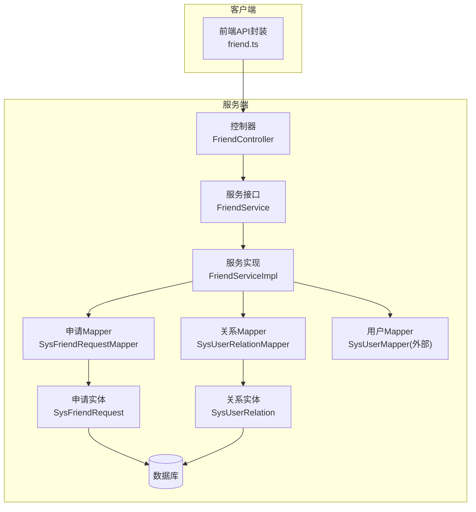
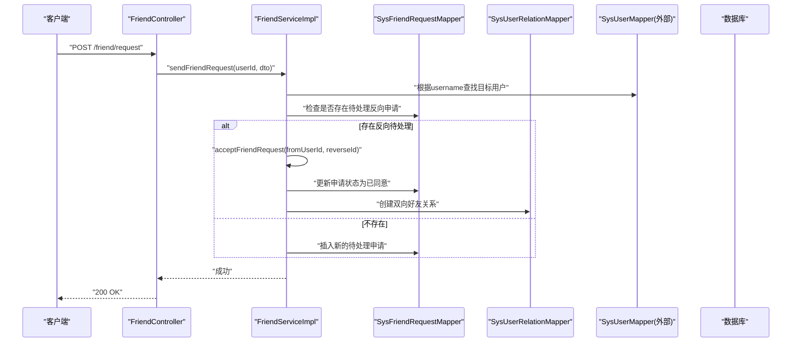
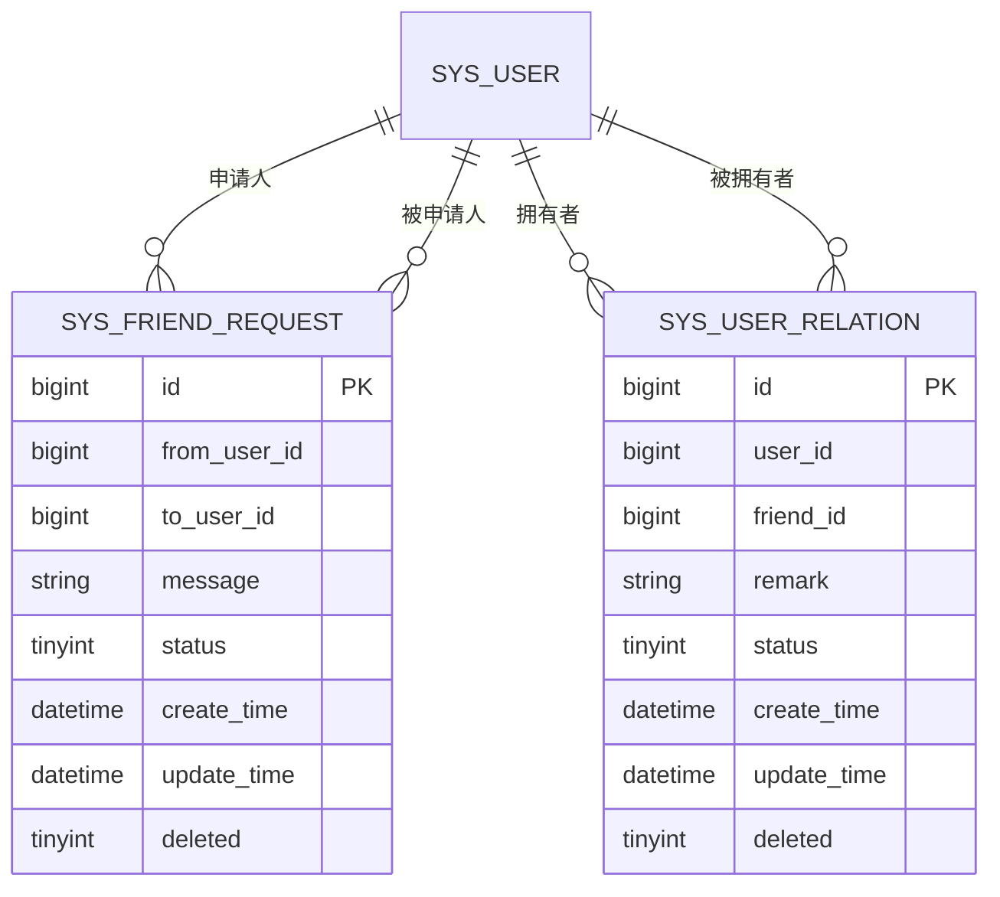
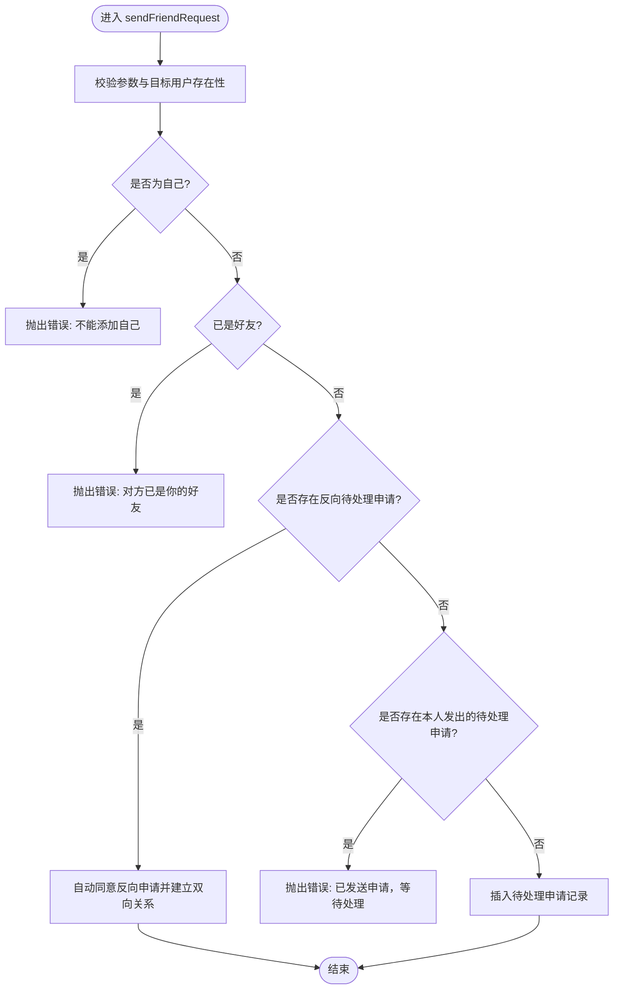
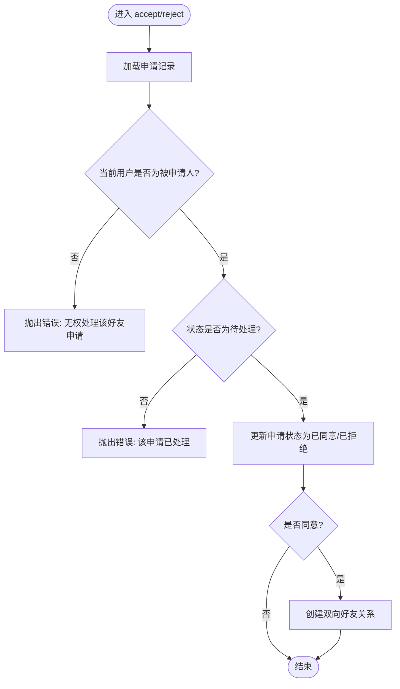
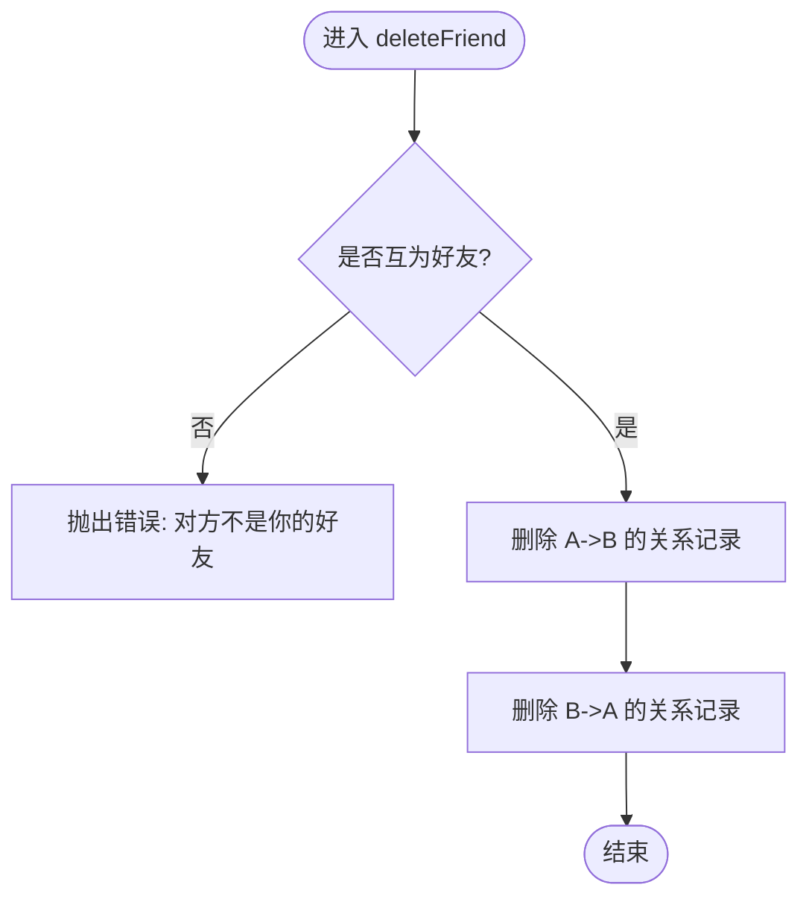
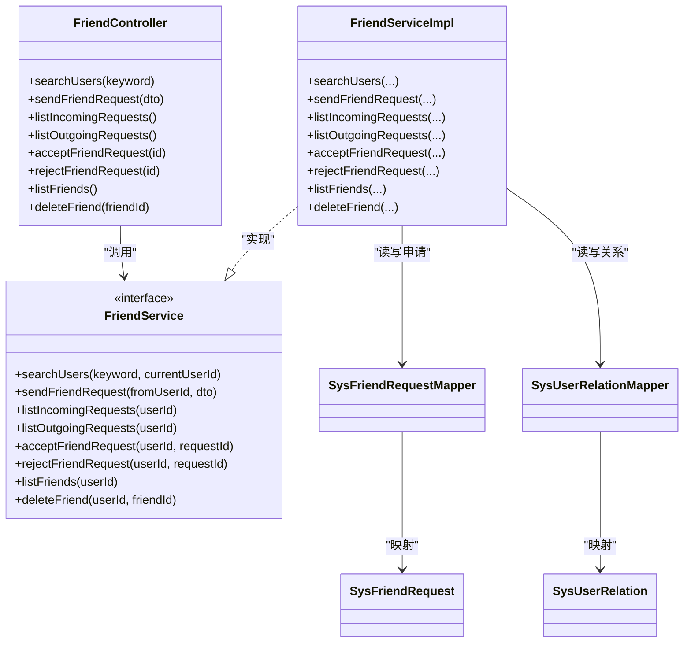
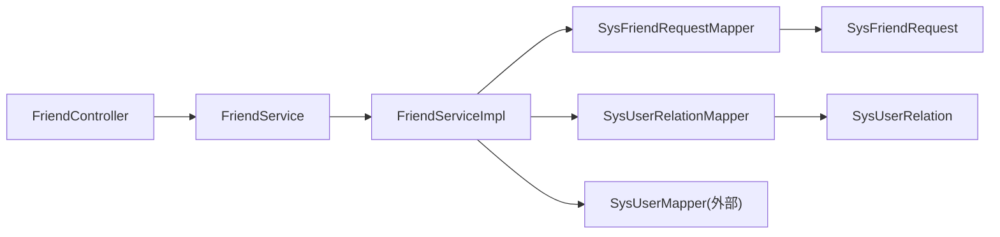

# 好友接口

<cite>
**本文引用的文件**   
- [FriendController.java](file://linkx-server/src/main/java/com/linkx/server/controller/FriendController.java)
- [FriendService.java](file://linkx-server/src/main/java/com/linkx/server/service/FriendService.java)
- [FriendServiceImpl.java](file://linkx-server/src/main/java/com/linkx/server/service/impl/FriendServiceImpl.java)
- [SysUserRelation.java](file://linkx-server/src/main/java/com/linkx/server/entity/SysUserRelation.java)
- [SysFriendRequest.java](file://linkx-server/src/main/java/com/linkx/server/entity/SysFriendRequest.java)
- [SysUserRelationMapper.java](file://linkx-server/src/main/java/com/linkx/server/mapper/SysUserRelationMapper.java)
- [SysFriendRequestMapper.java](file://linkx-server/src/main/java/com/linkx/server/mapper/SysFriendRequestMapper.java)
- [SendFriendRequestDTO.java](file://linkx-server/src/main/java/com/linkx/server/controller/dto/SendFriendRequestDTO.java)
- [FriendItemVO.java](file://linkx-server/src/main/java/com/linkx/server/controller/vo/FriendItemVO.java)
- [FriendRequestVO.java](file://linkx-server/src/main/java/com/linkx/server/controller/vo/FriendRequestVO.java)
- [UserSearchVO.java](file://linkx-server/src/main/java/com/linkx/server/controller/vo/UserSearchVO.java)
- [friend.ts](file://linkx-client/src/api/friend.ts)
- [friend.ts（类型）](file://linkx-client/src/types/friend.ts)
- [001_add_user_profile_and_friend_tables.sql](file://linkx-server/migrations/001_add_user_profile_and_friend_tables.sql)
</cite>

## 目录
1. [简介](#简介)
2. [项目结构](#项目结构)
3. [核心组件](#核心组件)
4. [架构总览](#架构总览)
5. [详细组件分析](#详细组件分析)
6. [依赖关系分析](#依赖关系分析)
7. [性能与并发优化建议](#性能与并发优化建议)
8. [故障排查指南](#故障排查指南)
9. [结论](#结论)
10. [附录：接口清单与调用示例](#附录接口清单与调用示例)

## 简介
本文件为 LinkX 联系人管理系统“好友”模块的 RESTful API 文档，覆盖以下能力：
- 好友列表管理：查询、删除好友
- 好友申请处理：发送申请、查看收/发列表、同意/拒绝
- 用户搜索：按账号或昵称模糊匹配
- 数据模型与状态机：好友关系表、好友申请表及状态流转
- 同步与通知策略：基于现有 WebSocket 通道进行状态变更推送的建议方案
- 高级功能扩展点：群组权限控制、成员管理与群公告发布的设计建议与最佳实践

## 项目结构
后端采用 Spring Boot + MyBatis-Flex 分层架构：
- Controller 层：暴露 /friend 前缀的 REST 接口
- Service 层：封装业务逻辑，含事务与校验
- Mapper 层：MyBatis-Flex 数据访问接口
- Entity 层：数据库实体映射
- DTO/VO：请求参数与响应对象
- Client 端：前端 TypeScript 封装了所有接口调用

图表来源
- [FriendController.java:1-96](file://linkx-server/src/main/java/com/linkx/server/controller/FriendController.java#L1-L96)
- [FriendService.java:1-28](file://linkx-server/src/main/java/com/linkx/server/service/FriendService.java#L1-L28)
- [FriendServiceImpl.java:1-333](file://linkx-server/src/main/java/com/linkx/server/service/impl/FriendServiceImpl.java#L1-L333)
- [SysFriendRequestMapper.java:1-10](file://linkx-server/src/main/java/com/linkx/server/mapper/SysFriendRequestMapper.java#L1-L10)
- [SysUserRelationMapper.java:1-21](file://linkx-server/src/main/java/com/linkx/server/mapper/SysUserRelationMapper.java#L1-L21)
- [SysFriendRequest.java:1-55](file://linkx-server/src/main/java/com/linkx/server/entity/SysFriendRequest.java#L1-L55)
- [SysUserRelation.java:1-71](file://linkx-server/src/main/java/com/linkx/server/entity/SysUserRelation.java#L1-L71)

章节来源
- [FriendController.java:1-96](file://linkx-server/src/main/java/com/linkx/server/controller/FriendController.java#L1-L96)
- [FriendService.java:1-28](file://linkx-server/src/main/java/com/linkx/server/service/FriendService.java#L1-L28)
- [FriendServiceImpl.java:1-333](file://linkx-server/src/main/java/com/linkx/server/service/impl/FriendServiceImpl.java#L1-L333)

## 核心组件
- 控制器 FriendController：定义 /friend 下所有 REST 端点，统一鉴权与参数解析
- 服务接口与实现 FriendService/FriendServiceImpl：实现搜索、申请、同意/拒绝、列表、删除等核心流程
- 数据实体 SysFriendRequest、SysUserRelation：分别表示好友申请与双向好友关系
- 数据访问 SysFriendRequestMapper、SysUserRelationMapper：基于 MyBatis-Flex 的通用 CRUD
- 前端封装 friend.ts：将 HTTP 调用封装为 TS 函数，供 UI 使用

章节来源
- [FriendController.java:1-96](file://linkx-server/src/main/java/com/linkx/server/controller/FriendController.java#L1-L96)
- [FriendService.java:1-28](file://linkx-server/src/main/java/com/linkx/server/service/FriendService.java#L1-L28)
- [FriendServiceImpl.java:1-333](file://linkx-server/src/main/java/com/linkx/server/service/impl/FriendServiceImpl.java#L1-L333)
- [SysFriendRequest.java:1-55](file://linkx-server/src/main/java/com/linkx/server/entity/SysFriendRequest.java#L1-L55)
- [SysUserRelation.java:1-71](file://linkx-server/src/main/java/com/linkx/server/entity/SysUserRelation.java#L1-L71)
- [SysFriendRequestMapper.java:1-10](file://linkx-server/src/main/java/com/linkx/server/mapper/SysFriendRequestMapper.java#L1-L10)
- [SysUserRelationMapper.java:1-21](file://linkx-server/src/main/java/com/linkx/server/mapper/SysUserRelationMapper.java#L1-L21)
- [friend.ts](file://linkx-client/src/api/friend.ts)

## 架构总览
下图展示了从前端到后端的完整调用链路以及关键的数据落库路径。

图表来源
- [FriendController.java:34-41](file://linkx-server/src/main/java/com/linkx/server/controller/FriendController.java#L34-L41)
- [FriendServiceImpl.java:92-138](file://linkx-server/src/main/java/com/linkx/server/service/impl/FriendServiceImpl.java#L92-L138)
- [SysFriendRequestMapper.java:1-10](file://linkx-server/src/main/java/com/linkx/server/mapper/SysFriendRequestMapper.java#L1-L10)
- [SysUserRelationMapper.java:1-21](file://linkx-server/src/main/java/com/linkx/server/mapper/SysUserRelationMapper.java#L1-L21)

## 详细组件分析

### 接口清单与语义
- 搜索用户
  - GET /friend/search?keyword=xxx
  - 说明：优先精确匹配 username；否则返回 username/nickname 模糊结果，限制条数
- 发送好友申请
  - POST /friend/request
  - 请求体：{ username, message? }
  - 说明：若对方已向你发起待处理申请，则自动同意并建立好友关系
- 获取收到的申请列表
  - GET /friend/requests/incoming
- 获取发出的申请列表
  - GET /friend/requests/outgoing
- 同意申请
  - POST /friend/requests/{id}/accept
- 拒绝申请
  - POST /friend/requests/{id}/reject
- 列出好友
  - GET /friend/list
- 删除好友
  - DELETE /friend/{friendId}

章节来源
- [FriendController.java:26-86](file://linkx-server/src/main/java/com/linkx/server/controller/FriendController.java#L26-L86)
- [FriendService.java:10-27](file://linkx-server/src/main/java/com/linkx/server/service/FriendService.java#L10-L27)

### 数据模型与状态机
- 好友申请 SysFriendRequest
  - 关键字段：fromUserId、toUserId、message、status(create/update/deleted)
  - 状态：0=待处理、1=已同意、2=已拒绝
- 好友关系 SysUserRelation
  - 关键字段：userId、friendId、remark、status(create/update/deleted)
  - 状态：1=正常、2=拉黑
  - 唯一约束：(user_id, friend_id) 保证单向关系不重复

图表来源
- [001_add_user_profile_and_friend_tables.sql:51-79](file://linkx-server/migrations/001_add_user_profile_and_friend_tables.sql#L51-L79)
- [SysFriendRequest.java:1-55](file://linkx-server/src/main/java/com/linkx/server/entity/SysFriendRequest.java#L1-L55)
- [SysUserRelation.java:1-71](file://linkx-server/src/main/java/com/linkx/server/entity/SysUserRelation.java#L1-L71)

### 业务流程图

#### 发送好友申请（含自动同意反向申请）

图表来源
- [FriendServiceImpl.java:92-138](file://linkx-server/src/main/java/com/linkx/server/service/impl/FriendServiceImpl.java#L92-L138)

#### 同意/拒绝申请

图表来源
- [FriendServiceImpl.java:160-192](file://linkx-server/src/main/java/com/linkx/server/service/impl/FriendServiceImpl.java#L160-L192)

#### 删除好友

图表来源
- [FriendServiceImpl.java:235-243](file://linkx-server/src/main/java/com/linkx/server/service/impl/FriendServiceImpl.java#L235-L243)

### 类关系图

图表来源
- [FriendController.java:1-96](file://linkx-server/src/main/java/com/linkx/server/controller/FriendController.java#L1-L96)
- [FriendService.java:1-28](file://linkx-server/src/main/java/com/linkx/server/service/FriendService.java#L1-L28)
- [FriendServiceImpl.java:1-333](file://linkx-server/src/main/java/com/linkx/server/service/impl/FriendServiceImpl.java#L1-L333)
- [SysFriendRequestMapper.java:1-10](file://linkx-server/src/main/java/com/linkx/server/mapper/SysFriendRequestMapper.java#L1-L10)
- [SysUserRelationMapper.java:1-21](file://linkx-server/src/main/java/com/linkx/server/mapper/SysUserRelationMapper.java#L1-L21)
- [SysFriendRequest.java:1-55](file://linkx-server/src/main/java/com/linkx/server/entity/SysFriendRequest.java#L1-L55)
- [SysUserRelation.java:1-71](file://linkx-server/src/main/java/com/linkx/server/entity/SysUserRelation.java#L1-L71)

### 前端集成
- 前端通过 friend.ts 封装了所有接口调用，类型定义位于 types/friend.ts
- 典型用法：在页面中调用 searchUsers、sendFriendRequest、listFriends 等方法，并根据 ApiResult 包装结构处理成功/失败分支

章节来源
- [friend.ts](file://linkx-client/src/api/friend.ts)
- [friend.ts（类型）](file://linkx-client/src/types/friend.ts)

## 依赖关系分析
- 控制器依赖 JwtUtils/AuthUtils 完成鉴权
- 服务实现依赖三个 Mapper：用户、申请、关系
- 数据模型与迁移脚本保持一致，确保表结构与实体字段一致

图表来源
- [FriendController.java:1-96](file://linkx-server/src/main/java/com/linkx/server/controller/FriendController.java#L1-L96)
- [FriendServiceImpl.java:1-333](file://linkx-server/src/main/java/com/linkx/server/service/impl/FriendServiceImpl.java#L1-L333)

## 性能与并发优化建议
- 批量操作优化
  - 当前未提供批量接口。建议在 Service 层新增批量同意/拒绝接口，内部使用单事务批量更新申请状态，减少往返次数
  - 对 listFriends 可考虑分页与缓存热点用户信息，降低 N+1 查询开销
- 并发安全
  - 同意/拒绝与建关系操作已在方法级加事务注解，避免部分写入
  - 针对“重复申请”和“反向申请自动同意”场景，建议在数据库层增加唯一索引（如 from_user_id + to_user_id + status），并在应用层捕获唯一键冲突异常，提升幂等性与健壮性
- 查询优化
  - 搜索接口已限制返回数量，建议为 username/nickname 建立合适索引
  - 列表接口可按 createTime 倒序分页，避免一次性加载大量数据

[本节为通用性能建议，无需特定文件引用]

## 故障排查指南
- 常见错误码与原因
  - 400 无效的申请 ID：路径参数无法解析为数字
  - 400 搜索关键词至少2个字符：keyword 长度不足
  - 404 用户不存在：目标用户不存在
  - 400 不能添加自己：向自己发送申请
  - 400 对方已是你的好友：已存在有效好友关系
  - 400 已发送好友申请，请等待对方处理：存在同向待处理申请
  - 403 无权处理该好友申请：非被申请人尝试处理
  - 400 该申请已处理：申请状态非待处理
  - 404 好友申请不存在：申请记录不存在
  - 404 对方不是你的好友：删除时关系不存在
- 定位步骤
  - 确认请求头携带有效 Token（鉴权由控制器前置处理）
  - 核对请求参数是否符合 DTO 校验规则
  - 检查数据库中对应申请/关系记录的状态与时间戳
  - 关注日志中的 CustomException 消息，快速定位业务校验失败点

章节来源
- [FriendController.java:88-94](file://linkx-server/src/main/java/com/linkx/server/controller/FriendController.java#L88-L94)
- [FriendServiceImpl.java:40-44](file://linkx-server/src/main/java/com/linkx/server/service/impl/FriendServiceImpl.java#L40-L44)
- [FriendServiceImpl.java:92-138](file://linkx-server/src/main/java/com/linkx/server/service/impl/FriendServiceImpl.java#L92-L138)
- [FriendServiceImpl.java:160-192](file://linkx-server/src/main/java/com/linkx/server/service/impl/FriendServiceImpl.java#L160-L192)
- [FriendServiceImpl.java:235-243](file://linkx-server/src/main/java/com/linkx/server/service/impl/FriendServiceImpl.java#L235-L243)

## 结论
本模块实现了好友关系的增删改查与申请审批的核心闭环，具备清晰的领域模型与事务保障。后续可在以下方面增强：
- 引入批量接口与分页查询，提升大数据量下的吞吐与体验
- 结合数据库唯一约束与应用层幂等设计，强化并发安全性
- 基于现有 WebSocket 通道完善状态同步与通知推送策略，实现实时体验

[本节为总结性内容，无需特定文件引用]

## 附录：接口清单与调用示例

### 接口清单
- 搜索用户
  - GET /friend/search?keyword=xxx
  - 响应：ApiResult<UserSearchResult[]>
- 发送好友申请
  - POST /friend/request
  - 请求体：{ username, message? }
  - 响应：ApiResult<null>
- 获取收到的申请列表
  - GET /friend/requests/incoming
  - 响应：ApiResult<FriendRequestItem[]>
- 获取发出的申请列表
  - GET /friend/requests/outgoing
  - 响应：ApiResult<FriendRequestItem[]>
- 同意申请
  - POST /friend/requests/{id}/accept
  - 响应：ApiResult<null>
- 拒绝申请
  - POST /friend/requests/{id}/reject
  - 响应：ApiResult<null>
- 列出好友
  - GET /friend/list
  - 响应：ApiResult<FriendItem[]>
- 删除好友
  - DELETE /friend/{friendId}
  - 响应：ApiResult<null>

章节来源
- [FriendController.java:26-86](file://linkx-server/src/main/java/com/linkx/server/controller/FriendController.java#L26-L86)
- [friend.ts](file://linkx-client/src/api/friend.ts)
- [friend.ts（类型）](file://linkx-client/src/types/friend.ts)

### 调用示例（概念性）
- 搜索用户
  - 请求：GET /friend/search?keyword=abc
  - 响应：包含匹配的用户列表
- 发送好友申请
  - 请求：POST /friend/request { "username": "target", "message": "你好" }
  - 响应：成功即返回空体
- 同意申请
  - 请求：POST /friend/requests/123456/accept
  - 响应：成功即返回空体
- 删除好友
  - 请求：DELETE /friend/123456
  - 响应：成功即返回空体

[本节为概念性示例，不包含具体代码片段]

### 状态同步机制与通知推送策略（建议）
- 触发时机
  - 申请状态变更（同意/拒绝）
  - 好友关系变更（新增/删除）
- 推送方式
  - 复用现有 WebSocket 通道，向相关用户会话推送事件
  - 事件载荷包含：事件类型、关联对象ID、时间戳
- 可靠性
  - 服务端在事务提交成功后再推送，确保最终一致性
  - 客户端重连后按需增量拉取最新状态（如重新拉取申请列表与好友列表）

[本节为架构建议，无需特定文件引用]

### 群组权限控制、成员管理与群公告发布（扩展建议）
- 权限模型
  - 角色：群主、管理员、普通成员
  - 动作：邀请/移除成员、修改群资料、发布公告、置顶精华、上传文件等
- 成员管理
  - 维护群成员表（群ID、用户ID、角色、加入时间、状态）
  - 操作需校验角色权限，防止越权
- 群公告
  - 独立公告表（群ID、内容、版本、生效时间、发布者）
  - 客户端拉取最新版本号，增量同步变更
- 与好友模块的协同
  - 好友列表可作为推荐入群或邀请入口
  - 群内消息与好友私聊消息共用 IM 通道，但路由与会话隔离

[本节为概念性扩展建议，无需特定文件引用]