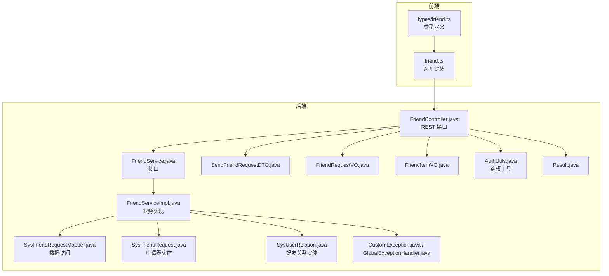
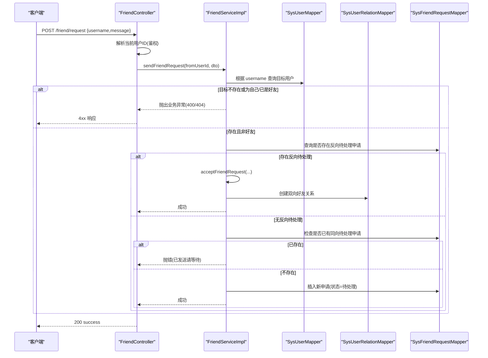
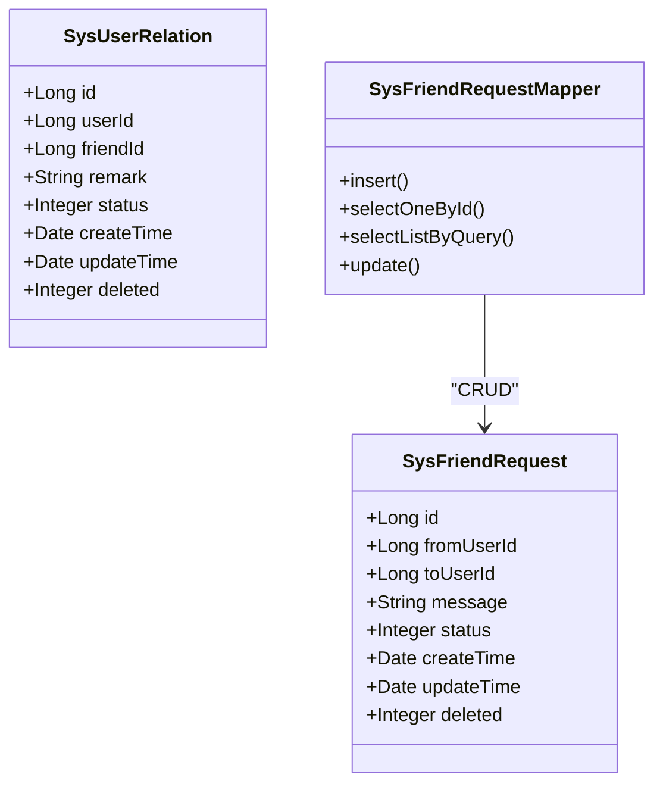
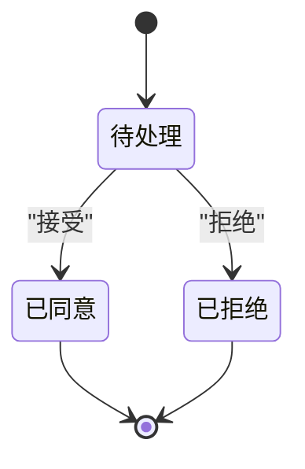
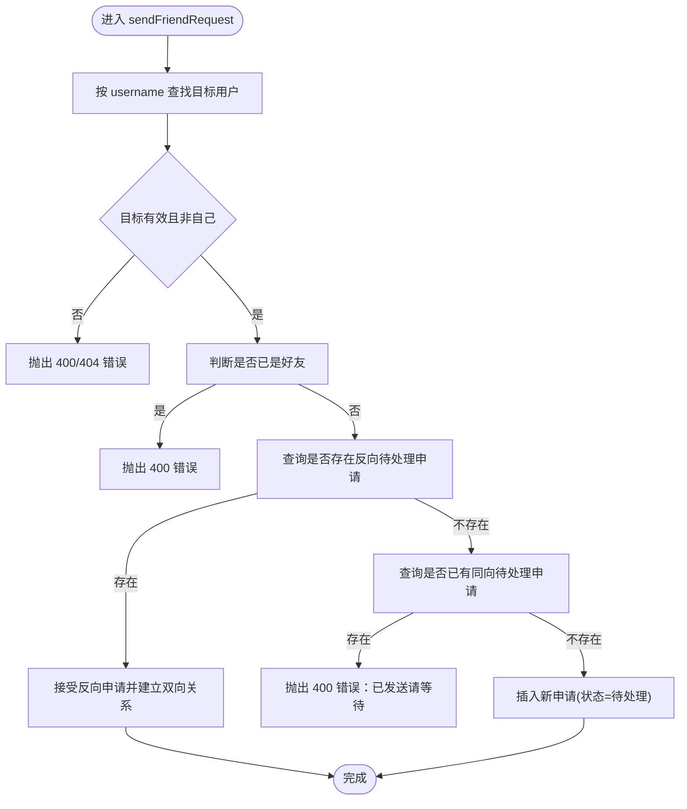
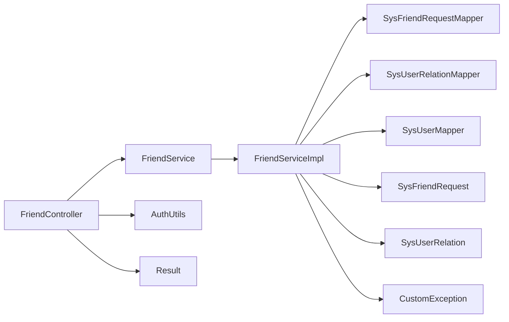

# 好友申请接口

<cite>
**本文引用的文件**
- [FriendController.java](file://linkx-server/src/main/java/com/linkx/server/controller/FriendController.java)
- [FriendService.java](file://linkx-server/src/main/java/com/linkx/server/service/FriendService.java)
- [FriendServiceImpl.java](file://linkx-server/src/main/java/com/linkx/server/service/impl/FriendServiceImpl.java)
- [SysFriendRequest.java](file://linkx-server/src/main/java/com/linkx/server/entity/SysFriendRequest.java)
- [SysUserRelation.java](file://linkx-server/src/main/java/com/linkx/server/entity/SysUserRelation.java)
- [SysFriendRequestMapper.java](file://linkx-server/src/main/java/com/linkx/server/mapper/SysFriendRequestMapper.java)
- [SendFriendRequestDTO.java](file://linkx-server/src/main/java/com/linkx/server/controller/dto/SendFriendRequestDTO.java)
- [FriendRequestVO.java](file://linkx-server/src/main/java/com/linkx/server/controller/vo/FriendRequestVO.java)
- [FriendItemVO.java](file://linkx-server/src/main/java/com/linkx/server/controller/vo/FriendItemVO.java)
- [001_add_user_profile_and_friend_tables.sql](file://linkx-server/migrations/001_add_user_profile_and_friend_tables.sql)
- [friend.ts](file://linkx-client/src/api/friend.ts)
- [friend.ts（类型）](file://linkx-client/src/types/friend.ts)
- [Result.java](file://linkx-server/src/main/java/com/linkx/server/common/Result.java)
- [CustomException.java](file://linkx-server/src/main/java/com/linkx/server/exception/CustomException.java)
- [GlobalExceptionHandler.java](file://linkx-server/src/main/java/com/linkx/server/exception/GlobalExceptionHandler.java)
- [AuthUtils.java](file://linkx-server/src/main/java/com/linkx/server/common/AuthUtils.java)
</cite>

## 目录
1. [简介](#简介)
2. [项目结构](#项目结构)
3. [核心组件](#核心组件)
4. [架构总览](#架构总览)
5. [详细组件分析](#详细组件分析)
6. [依赖关系分析](#依赖关系分析)
7. [性能与索引优化](#性能与索引优化)
8. [故障排查指南](#故障排查指南)
9. [结论](#结论)
10. [附录：接口定义与示例](#附录接口定义与示例)

## 简介
本文件为 LinkX 好友申请系统的 API 文档，覆盖发送好友申请、查看待处理申请、接受/拒绝申请等完整流程。文档深入解释状态管理机制（含防重复申请逻辑）、实体设计与数据库表结构、索引优化与查询性能考虑，并提供业务流程图、状态机设计、调用示例与错误处理方案，帮助前后端开发者快速集成与排障。

## 项目结构
后端采用 Controller-Service-Mapper 分层：
- 控制器层：暴露 REST 接口，负责参数校验与鉴权提取
- 服务层：实现业务规则（防重、状态流转、双向关系创建）
- 持久层：MyBatis-Flex Mapper 访问数据库
- 统一响应与异常：Result 封装、全局异常处理器、自定义业务异常
- 前端：TypeScript 客户端封装与类型定义

图表来源
- [FriendController.java:1-96](file://linkx-server/src/main/java/com/linkx/server/controller/FriendController.java#L1-L96)
- [FriendService.java:1-28](file://linkx-server/src/main/java/com/linkx/server/service/FriendService.java#L1-L28)
- [FriendServiceImpl.java:1-333](file://linkx-server/src/main/java/com/linkx/server/service/impl/FriendServiceImpl.java#L1-L333)
- [SysFriendRequest.java:1-55](file://linkx-server/src/main/java/com/linkx/server/entity/SysFriendRequest.java#L1-L55)
- [SysUserRelation.java:1-71](file://linkx-server/src/main/java/com/linkx/server/entity/SysUserRelation.java#L1-L71)
- [SysFriendRequestMapper.java:1-10](file://linkx-server/src/main/java/com/linkx/server/mapper/SysFriendRequestMapper.java#L1-L10)
- [SendFriendRequestDTO.java:1-17](file://linkx-server/src/main/java/com/linkx/server/controller/dto/SendFriendRequestDTO.java#L1-L17)
- [FriendRequestVO.java:1-48](file://linkx-server/src/main/java/com/linkx/server/controller/vo/FriendRequestVO.java#L1-L48)
- [FriendItemVO.java:1-23](file://linkx-server/src/main/java/com/linkx/server/controller/vo/FriendItemVO.java#L1-L23)
- [AuthUtils.java:1-43](file://linkx-server/src/main/java/com/linkx/server/common/AuthUtils.java#L1-L43)
- [CustomException.java:1-40](file://linkx-server/src/main/java/com/linkx/server/exception/CustomException.java#L1-L40)
- [GlobalExceptionHandler.java:1-53](file://linkx-server/src/main/java/com/linkx/server/exception/GlobalExceptionHandler.java#L1-L53)
- [Result.java:1-95](file://linkx-server/src/main/java/com/linkx/server/common/Result.java#L1-L95)
- [friend.ts:1-43](file://linkx-client/src/api/friend.ts#L1-L43)
- [friend.ts（类型）:1-38](file://linkx-client/src/types/friend.ts#L1-L38)

章节来源
- [FriendController.java:1-96](file://linkx-server/src/main/java/com/linkx/server/controller/FriendController.java#L1-L96)
- [FriendServiceImpl.java:1-333](file://linkx-server/src/main/java/com/linkx/server/service/impl/FriendServiceImpl.java#L1-L333)
- [friend.ts:1-43](file://linkx-client/src/api/friend.ts#L1-L43)

## 核心组件
- 控制器层
  - 提供搜索用户、发送申请、查看收发列表、接受/拒绝申请、好友列表与删除等接口
  - 通过 AuthUtils 从请求中解析当前登录用户 ID，未登录抛出 401
- 服务层
  - 实现防重复申请、反向自动同意、状态更新、双向好友关系创建与删除
  - 使用事务保证关键路径一致性
- 实体与映射
  - 申请表 SysFriendRequest：包含申请人、被申请人、消息、状态、时间戳、逻辑删除
  - 好友关系表 SysUserRelation：记录双向关系、备注、状态、时间戳、逻辑删除
  - Mapper 基于 MyBatis-Flex BaseMapper 提供基础 CRUD
- 数据传输对象
  - SendFriendRequestDTO：入参校验（账号长度、验证信息长度）
  - FriendRequestVO/FriendItemVO：出参字段与序列化策略
- 统一响应与异常
  - Result 统一返回格式
  - CustomException 携带业务码，由 GlobalExceptionHandler 转为 HTTP 状态码与 JSON

章节来源
- [FriendController.java:1-96](file://linkx-server/src/main/java/com/linkx/server/controller/FriendController.java#L1-L96)
- [FriendService.java:1-28](file://linkx-server/src/main/java/com/linkx/server/service/FriendService.java#L1-L28)
- [FriendServiceImpl.java:1-333](file://linkx-server/src/main/java/com/linkx/server/service/impl/FriendServiceImpl.java#L1-L333)
- [SysFriendRequest.java:1-55](file://linkx-server/src/main/java/com/linkx/server/entity/SysFriendRequest.java#L1-L55)
- [SysUserRelation.java:1-71](file://linkx-server/src/main/java/com/linkx/server/entity/SysUserRelation.java#L1-L71)
- [SysFriendRequestMapper.java:1-10](file://linkx-server/src/main/java/com/linkx/server/mapper/SysFriendRequestMapper.java#L1-L10)
- [SendFriendRequestDTO.java:1-17](file://linkx-server/src/main/java/com/linkx/server/controller/dto/SendFriendRequestDTO.java#L1-L17)
- [FriendRequestVO.java:1-48](file://linkx-server/src/main/java/com/linkx/server/controller/vo/FriendRequestVO.java#L1-L48)
- [FriendItemVO.java:1-23](file://linkx-server/src/main/java/com/linkx/server/controller/vo/FriendItemVO.java#L1-L23)
- [Result.java:1-95](file://linkx-server/src/main/java/com/linkx/server/common/Result.java#L1-L95)
- [CustomException.java:1-40](file://linkx-server/src/main/java/com/linkx/server/exception/CustomException.java#L1-L40)
- [GlobalExceptionHandler.java:1-53](file://linkx-server/src/main/java/com/linkx/server/exception/GlobalExceptionHandler.java#L1-L53)
- [AuthUtils.java:1-43](file://linkx-server/src/main/java/com/linkx/server/common/AuthUtils.java#L1-L43)

## 架构总览
下图展示一次“发送好友申请”的端到端调用链与关键决策点。

图表来源
- [FriendController.java:34-41](file://linkx-server/src/main/java/com/linkx/server/controller/FriendController.java#L34-L41)
- [FriendServiceImpl.java:92-138](file://linkx-server/src/main/java/com/linkx/server/service/impl/FriendServiceImpl.java#L92-L138)
- [SysFriendRequestMapper.java:1-10](file://linkx-server/src/main/java/com/linkx/server/mapper/SysFriendRequestMapper.java#L1-L10)
- [SysUserRelationMapper.java](file://linkx-server/src/main/java/com/linkx/server/mapper/SysUserRelationMapper.java)

## 详细组件分析

### 实体与数据模型
- 好友申请实体 SysFriendRequest
  - 主键：雪花算法生成
  - 关键字段：fromUserId、toUserId、message、status、createTime、updateTime、deleted
  - 状态常量：待处理(0)、已同意(1)、已拒绝(2)
- 好友关系实体 SysUserRelation
  - 主键：雪花算法生成
  - 关键字段：userId、friendId、remark、status、createTime、updateTime、deleted
  - 关系状态：正常(1)、拉黑(2)

图表来源
- [SysFriendRequest.java:1-55](file://linkx-server/src/main/java/com/linkx/server/entity/SysFriendRequest.java#L1-L55)
- [SysUserRelation.java:1-71](file://linkx-server/src/main/java/com/linkx/server/entity/SysUserRelation.java#L1-L71)
- [SysFriendRequestMapper.java:1-10](file://linkx-server/src/main/java/com/linkx/server/mapper/SysFriendRequestMapper.java#L1-L10)

章节来源
- [SysFriendRequest.java:1-55](file://linkx-server/src/main/java/com/linkx/server/entity/SysFriendRequest.java#L1-L55)
- [SysUserRelation.java:1-71](file://linkx-server/src/main/java/com/linkx/server/entity/SysUserRelation.java#L1-L71)

### 业务状态管理与流程图
- 状态定义
  - 0=待处理，1=已同意，2=已拒绝
- 状态机

- 发送申请关键流程（含防重与反向自动同意）

图表来源
- [FriendServiceImpl.java:92-138](file://linkx-server/src/main/java/com/linkx/server/service/impl/FriendServiceImpl.java#L92-L138)
- [FriendServiceImpl.java:160-176](file://linkx-server/src/main/java/com/linkx/server/service/impl/FriendServiceImpl.java#L160-L176)
- [FriendServiceImpl.java:178-192](file://linkx-server/src/main/java/com/linkx/server/service/impl/FriendServiceImpl.java#L178-L192)
- [FriendServiceImpl.java:262-282](file://linkx-server/src/main/java/com/linkx/server/service/impl/FriendServiceImpl.java#L262-L282)

章节来源
- [FriendServiceImpl.java:92-138](file://linkx-server/src/main/java/com/linkx/server/service/impl/FriendServiceImpl.java#L92-L138)
- [FriendServiceImpl.java:160-192](file://linkx-server/src/main/java/com/linkx/server/service/impl/FriendServiceImpl.java#L160-L192)
- [FriendServiceImpl.java:262-282](file://linkx-server/src/main/java/com/linkx/server/service/impl/FriendServiceImpl.java#L262-L282)

### 接口清单与行为说明
- 搜索用户
  - GET /friend/search?keyword=xxx
  - 行为：优先精确匹配 username，其次模糊匹配 username/nickname，限制返回数量
- 发送好友申请
  - POST /friend/request
  - 入参：username、message；校验失败返回 400
  - 行为：防重复申请、反向自动同意、插入待处理申请
- 查看收到的申请
  - GET /friend/requests/incoming
  - 行为：按创建时间倒序返回
- 查看发出的申请
  - GET /friend/requests/outgoing
  - 行为：按创建时间倒序返回
- 接受申请
  - POST /friend/requests/{id}/accept
  - 行为：校验权限与状态，更新为已同意，创建双向好友关系
- 拒绝申请
  - POST /friend/requests/{id}/reject
  - 行为：校验权限与状态，更新为已拒绝
- 获取好友列表
  - GET /friend/list
  - 行为：返回当前用户的有效好友及备注
- 删除好友
  - DELETE /friend/{friendId}
  - 行为：校验好友关系，删除双向关系记录

章节来源
- [FriendController.java:26-86](file://linkx-server/src/main/java/com/linkx/server/controller/FriendController.java#L26-L86)
- [FriendServiceImpl.java:39-81](file://linkx-server/src/main/java/com/linkx/server/service/impl/FriendServiceImpl.java#L39-L81)
- [FriendServiceImpl.java:140-158](file://linkx-server/src/main/java/com/linkx/server/service/impl/FriendServiceImpl.java#L140-L158)
- [FriendServiceImpl.java:194-233](file://linkx-server/src/main/java/com/linkx/server/service/impl/FriendServiceImpl.java#L194-L233)
- [FriendServiceImpl.java:235-243](file://linkx-server/src/main/java/com/linkx/server/service/impl/FriendServiceImpl.java#L235-L243)

### 鉴权与参数校验
- 鉴权
  - 通过 AuthUtils.requireUserId 从 Authorization 头解析 JWT，未登录返回 401
- 参数校验
  - SendFriendRequestDTO 使用注解校验 username 与 message 长度
  - 非法参数由全局异常处理器转换为 400 响应

章节来源
- [AuthUtils.java:35-41](file://linkx-server/src/main/java/com/linkx/server/common/AuthUtils.java#L35-L41)
- [SendFriendRequestDTO.java:1-17](file://linkx-server/src/main/java/com/linkx/server/controller/dto/SendFriendRequestDTO.java#L1-L17)
- [GlobalExceptionHandler.java:22-31](file://linkx-server/src/main/java/com/linkx/server/exception/GlobalExceptionHandler.java#L22-L31)

### 前端集成要点
- TypeScript 类型定义
  - UserSearchResult、FriendItem、FriendRequestItem、SendFriendRequestPayload
- API 封装
  - 对应后端接口的函数封装，统一返回 ApiResult<T>

章节来源
- [friend.ts（类型）:1-38](file://linkx-client/src/types/friend.ts#L1-L38)
- [friend.ts:1-43](file://linkx-client/src/api/friend.ts#L1-L43)

## 依赖关系分析
- 控制器依赖服务接口与工具类
- 服务实现依赖多个 Mapper 与实体
- 统一响应与异常贯穿全链路
- 前端通过 TypeScript 类型与 API 模块对接后端

图表来源
- [FriendController.java:1-96](file://linkx-server/src/main/java/com/linkx/server/controller/FriendController.java#L1-L96)
- [FriendServiceImpl.java:1-333](file://linkx-server/src/main/java/com/linkx/server/service/impl/FriendServiceImpl.java#L1-L333)
- [SysFriendRequestMapper.java:1-10](file://linkx-server/src/main/java/com/linkx/server/mapper/SysFriendRequestMapper.java#L1-L10)
- [AuthUtils.java:1-43](file://linkx-server/src/main/java/com/linkx/server/common/AuthUtils.java#L1-L43)
- [Result.java:1-95](file://linkx-server/src/main/java/com/linkx/server/common/Result.java#L1-L95)
- [CustomException.java:1-40](file://linkx-server/src/main/java/com/linkx/server/exception/CustomException.java#L1-L40)

## 性能与索引优化
- 申请表 sys_friend_request
  - 复合索引 (to_user_id, status)：加速“我收到的待处理申请”查询
  - 单列索引 (from_user_id)：加速“我发出的申请”查询
- 好友关系表 sys_user_relation
  - 唯一索引 (user_id, friend_id)：防止重复关系
  - 单列索引 user_id、friend_id：加速按用户维度的关系查询
- 查询优化建议
  - 列表接口按 create_time 倒序，避免全表扫描
  - 批量加载用户信息时采用 IN 查询减少往返
  - 对高频条件字段建立合适索引，避免回表过多

章节来源
- [001_add_user_profile_and_friend_tables.sql:51-79](file://linkx-server/migrations/001_add_user_profile_and_friend_tables.sql#L51-L79)
- [FriendServiceImpl.java:140-158](file://linkx-server/src/main/java/com/linkx/server/service/impl/FriendServiceImpl.java#L140-L158)
- [FriendServiceImpl.java:194-233](file://linkx-server/src/main/java/com/linkx/server/service/impl/FriendServiceImpl.java#L194-L233)

## 故障排查指南
- 常见错误码与含义
  - 400：参数校验失败、业务冲突（如已发送申请、对方已是好友、申请已处理）
  - 401：未登录或登录过期
  - 403：无权处理该申请
  - 404：用户不存在、申请不存在、对方不是好友
  - 500：系统内部繁忙
- 定位步骤
  - 确认 Authorization 头是否正确携带 Bearer Token
  - 检查请求体是否符合 DTO 约束（username/message 长度）
  - 查看日志中的业务异常信息与堆栈
  - 核对数据库中申请状态与关系记录是否一致
- 幂等与重试
  - 发送申请具备防重逻辑，重复提交会返回明确提示
  - 接受/拒绝操作在状态非待处理时会拒绝执行，避免重复处理

章节来源
- [GlobalExceptionHandler.java:16-38](file://linkx-server/src/main/java/com/linkx/server/exception/GlobalExceptionHandler.java#L16-L38)
- [CustomException.java:14-39](file://linkx-server/src/main/java/com/linkx/server/exception/CustomException.java#L14-L39)
- [FriendServiceImpl.java:92-138](file://linkx-server/src/main/java/com/linkx/server/service/impl/FriendServiceImpl.java#L92-L138)
- [FriendServiceImpl.java:160-192](file://linkx-server/src/main/java/com/linkx/server/service/impl/FriendServiceImpl.java#L160-L192)

## 结论
本系统通过清晰的分层架构与严格的状态管理，实现了安全、可靠的好友申请流程。借助合理的索引设计与事务保障，系统在并发与一致性方面具备良好的表现。结合统一的响应与异常机制，前后端协作顺畅，便于扩展与维护。

## 附录：接口定义与示例

### 通用约定
- 统一响应体
  - code：业务状态码（200 成功，其他为错误码）
  - message：提示信息
  - data：业务数据
- 鉴权方式
  - 请求头 Authorization: Bearer <token>

章节来源
- [Result.java:18-95](file://linkx-server/src/main/java/com/linkx/server/common/Result.java#L18-L95)
- [AuthUtils.java:15-41](file://linkx-server/src/main/java/com/linkx/server/common/AuthUtils.java#L15-L41)

### 接口详情与示例

- 搜索用户
  - 方法：GET
  - 路径：/friend/search
  - 查询参数：keyword（至少2个字符）
  - 成功响应：code=200，data=UserSearchResult[]
  - 失败示例：
    - 400：关键词过短
    - 401：未登录

- 发送好友申请
  - 方法：POST
  - 路径：/friend/request
  - 请求体：{ username, message? }
  - 成功响应：code=200，data=null
  - 失败示例：
    - 400：不能添加自己、对方已是好友、已发送请等待
    - 404：用户不存在
    - 401：未登录

- 查看收到的申请
  - 方法：GET
  - 路径：/friend/requests/incoming
  - 成功响应：code=200，data=FriendRequestItem[]

- 查看发出的申请
  - 方法：GET
  - 路径：/friend/requests/outgoing
  - 成功响应：code=200，data=FriendRequestItem[]

- 接受申请
  - 方法：POST
  - 路径：/friend/requests/{id}/accept
  - 成功响应：code=200，data=null
  - 失败示例：
    - 400：申请已处理
    - 403：无权处理
    - 404：申请不存在
    - 401：未登录

- 拒绝申请
  - 方法：POST
  - 路径：/friend/requests/{id}/reject
  - 成功响应：code=200，data=null
  - 失败示例：同上

- 获取好友列表
  - 方法：GET
  - 路径：/friend/list
  - 成功响应：code=200，data=FriendItem[]

- 删除好友
  - 方法：DELETE
  - 路径：/friend/{friendId}
  - 成功响应：code=200，data=null
  - 失败示例：
    - 404：对方不是你的好友
    - 401：未登录

章节来源
- [FriendController.java:26-86](file://linkx-server/src/main/java/com/linkx/server/controller/FriendController.java#L26-L86)
- [SendFriendRequestDTO.java:1-17](file://linkx-server/src/main/java/com/linkx/server/controller/dto/SendFriendRequestDTO.java#L1-L17)
- [FriendRequestVO.java:1-48](file://linkx-server/src/main/java/com/linkx/server/controller/vo/FriendRequestVO.java#L1-L48)
- [FriendItemVO.java:1-23](file://linkx-server/src/main/java/com/linkx/server/controller/vo/FriendItemVO.java#L1-L23)
- [friend.ts:1-43](file://linkx-client/src/api/friend.ts#L1-L43)
- [friend.ts（类型）:1-38](file://linkx-client/src/types/friend.ts#L1-L38)

### 超时与幂等策略
- 超时处理
  - 当前未实现申请自动过期逻辑；如需支持，可在定时任务中扫描超时的待处理申请并置为已拒绝
- 幂等性
  - 发送申请具备防重逻辑
  - 接受/拒绝在非待处理状态下直接拒绝，避免重复处理

[本节为概念性说明，不直接分析具体文件，故无章节来源]