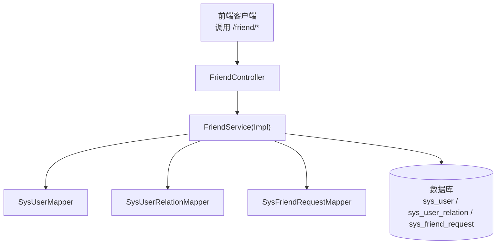
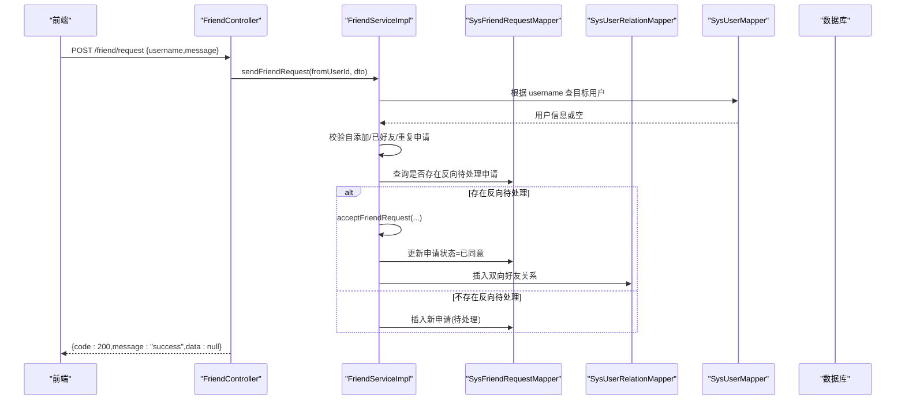
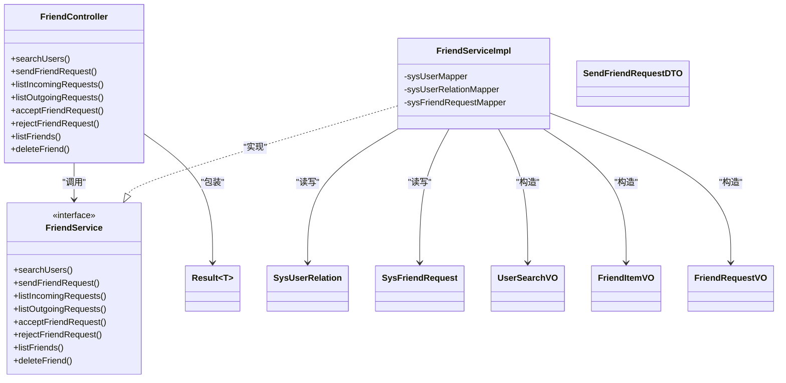
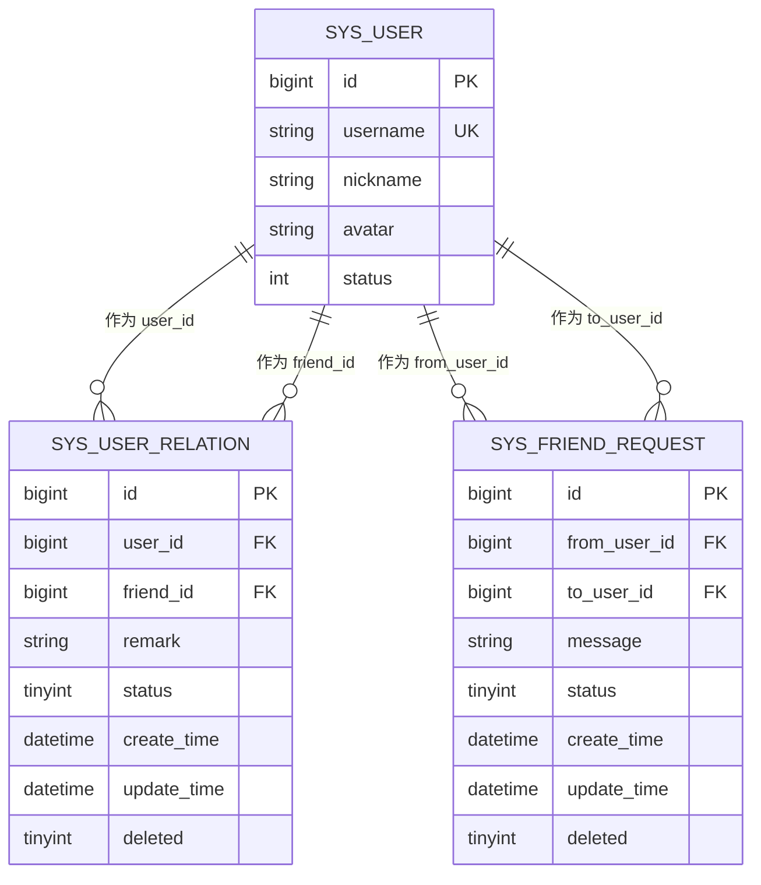

# 好友管理接口

<cite>
**本文引用的文件**   
- [FriendController.java](file://linkx-server/src/main/java/com/linkx/server/controller/FriendController.java)
- [FriendService.java](file://linkx-server/src/main/java/com/linkx/server/service/FriendService.java)
- [FriendServiceImpl.java](file://linkx-server/src/main/java/com/linkx/server/service/impl/FriendServiceImpl.java)
- [SysUserRelation.java](file://linkx-server/src/main/java/com/linkx/server/entity/SysUserRelation.java)
- [SysFriendRequest.java](file://linkx-server/src/main/java/com/linkx/server/entity/SysFriendRequest.java)
- [SendFriendRequestDTO.java](file://linkx-server/src/main/java/com/linkx/server/controller/dto/SendFriendRequestDTO.java)
- [FriendItemVO.java](file://linkx-server/src/main/java/com/linkx/server/controller/vo/FriendItemVO.java)
- [FriendRequestVO.java](file://linkx-server/src/main/java/com/linkx/server/controller/vo/FriendRequestVO.java)
- [UserSearchVO.java](file://linkx-server/src/main/java/com/linkx/server/controller/vo/UserSearchVO.java)
- [Result.java](file://linkx-server/src/main/java/com/linkx/server/common/Result.java)
- [GlobalExceptionHandler.java](file://linkx-server/src/main/java/com/linkx/server/exception/GlobalExceptionHandler.java)
- [001_add_user_profile_and_friend_tables.sql](file://linkx-server/migrations/001_add_user_profile_and_friend_tables.sql)
- [friend.ts](file://linkx-client/src/api/friend.ts)
- [friend.ts（类型）](file://linkx-client/src/types/friend.ts)
</cite>

## 目录
1. [简介](#简介)
2. [项目结构](#项目结构)
3. [核心组件](#核心组件)
4. [架构总览](#架构总览)
5. [详细接口说明](#详细接口说明)
6. [依赖关系分析](#依赖关系分析)
7. [性能与并发建议](#性能与并发建议)
8. [故障排查指南](#故障排查指南)
9. [结论](#结论)
10. [附录：数据模型与字段规则](#附录数据模型与字段规则)

## 简介
本文件为 LinkX 好友管理功能的 RESTful API 文档，覆盖用户搜索、发送好友申请、查看待处理/已发出申请、同意/拒绝申请、好友列表查询、删除好友等核心能力。文档同时给出请求/响应示例、错误码约定、数据模型设计要点以及并发安全与性能优化建议，帮助前后端团队快速集成与稳定上线。

## 项目结构
后端采用 Spring MVC + MyBatis-Flex 分层架构：
- Controller 层：暴露 /friend 前缀的 REST 接口，统一鉴权与参数校验
- Service 层：实现业务逻辑（搜索、申请、同意/拒绝、列表、删除）
- Entity/Mapper 层：持久化访问（关系表、申请表、用户表）
- VO/DTO：对外返回/接收的数据结构
- 全局异常处理：统一错误码与 HTTP 状态映射

图表来源
- [FriendController.java:18-96](file://linkx-server/src/main/java/com/linkx/server/controller/FriendController.java#L18-L96)
- [FriendServiceImpl.java:28-333](file://linkx-server/src/main/java/com/linkx/server/service/impl/FriendServiceImpl.java#L28-L333)
- [001_add_user_profile_and_friend_tables.sql:51-79](file://linkx-server/migrations/001_add_user_profile_and_friend_tables.sql#L51-L79)

章节来源
- [FriendController.java:18-96](file://linkx-server/src/main/java/com/linkx/server/controller/FriendController.java#L18-L96)
- [FriendService.java:10-27](file://linkx-server/src/main/java/com/linkx/server/service/FriendService.java#L10-L27)
- [FriendServiceImpl.java:28-333](file://linkx-server/src/main/java/com/linkx/server/service/impl/FriendServiceImpl.java#L28-L333)

## 核心组件
- 控制器：FriendController 提供 /friend 命名空间下的所有接口
- 服务：FriendService 及其实现类封装了搜索、申请、同意/拒绝、列表、删除等业务
- 实体：SysUserRelation（好友关系）、SysFriendRequest（好友申请）
- 传输对象：SendFriendRequestDTO（发送申请入参），UserSearchVO、FriendItemVO、FriendRequestVO（出参）
- 统一响应：Result<T> 包含 code/message/data
- 全局异常：GlobalExceptionHandler 将业务异常映射到标准 HTTP 状态码与 Result

章节来源
- [FriendController.java:18-96](file://linkx-server/src/main/java/com/linkx/server/controller/FriendController.java#L18-L96)
- [FriendService.java:10-27](file://linkx-server/src/main/java/com/linkx/server/service/FriendService.java#L10-L27)
- [FriendServiceImpl.java:28-333](file://linkx-server/src/main/java/com/linkx/server/service/impl/FriendServiceImpl.java#L28-L333)
- [SysUserRelation.java:28-71](file://linkx-server/src/main/java/com/linkx/server/entity/SysUserRelation.java#L28-L71)
- [SysFriendRequest.java:16-55](file://linkx-server/src/main/java/com/linkx/server/entity/SysFriendRequest.java#L16-L55)
- [SendFriendRequestDTO.java:7-17](file://linkx-server/src/main/java/com/linkx/server/controller/dto/SendFriendRequestDTO.java#L7-L17)
- [UserSearchVO.java:8-21](file://linkx-server/src/main/java/com/linkx/server/controller/vo/UserSearchVO.java#L8-L21)
- [FriendItemVO.java:8-23](file://linkx-server/src/main/java/com/linkx/server/controller/vo/FriendItemVO.java#L8-L23)
- [FriendRequestVO.java:10-48](file://linkx-server/src/main/java/com/linkx/server/controller/vo/FriendRequestVO.java#L10-L48)
- [Result.java:18-95](file://linkx-server/src/main/java/com/linkx/server/common/Result.java#L18-L95)
- [GlobalExceptionHandler.java:12-53](file://linkx-server/src/main/java/com/linkx/server/exception/GlobalExceptionHandler.java#L12-L53)

## 架构总览
以下时序图展示“发送好友申请”的端到端流程，包括参数校验、重复申请检测、反向申请自动同意、双向关系创建等关键步骤。

图表来源
- [FriendController.java:34-41](file://linkx-server/src/main/java/com/linkx/server/controller/FriendController.java#L34-L41)
- [FriendServiceImpl.java:92-138](file://linkx-server/src/main/java/com/linkx/server/service/impl/FriendServiceImpl.java#L92-L138)
- [FriendServiceImpl.java:160-176](file://linkx-server/src/main/java/com/linkx/server/service/impl/FriendServiceImpl.java#L160-L176)
- [FriendServiceImpl.java:262-282](file://linkx-server/src/main/java/com/linkx/server/service/impl/FriendServiceImpl.java#L262-L282)

## 详细接口说明

### 通用约定
- 基础路径：/friend
- 认证方式：请求需携带有效 JWT（由拦截器/工具解析当前用户 ID）
- 统一响应体：{ "code": 200, "message": "success", "data": ... }
- 错误码：业务异常通过自定义异常抛出，全局处理器将其映射为对应 HTTP 状态码与 Result.error(code,message)

章节来源
- [FriendController.java:18-96](file://linkx-server/src/main/java/com/linkx/server/controller/FriendController.java#L18-L96)
- [Result.java:18-95](file://linkx-server/src/main/java/com/linkx/server/common/Result.java#L18-L95)
- [GlobalExceptionHandler.java:12-53](file://linkx-server/src/main/java/com/linkx/server/exception/GlobalExceptionHandler.java#L12-L53)

---

### 1) 搜索用户
- 方法：GET
- 路径：/friend/search
- 鉴权：需要
- 查询参数：
  - keyword: string，必填，至少 2 个字符
- 成功响应 data：UserSearchVO[]
  - id: string（Long 序列化）
  - username: string
  - nickname: string
  - avatar?: string
- 失败场景：
  - 关键词长度不足：400
  - 未登录/无效令牌：401
  - 系统异常：500

请求示例
- GET /friend/search?keyword=abc

成功响应示例
- { "code": 200, "message": "success", "data": [{ "id": "1234567890123456789", "username": "alice", "nickname": "Alice", "avatar": "https://..." }] }

失败响应示例
- { "code": 400, "message": "搜索关键词至少2个字符", "data": null }

章节来源
- [FriendController.java:26-32](file://linkx-server/src/main/java/com/linkx/server/controller/FriendController.java#L26-L32)
- [FriendServiceImpl.java:39-81](file://linkx-server/src/main/java/com/linkx/server/service/impl/FriendServiceImpl.java#L39-L81)
- [UserSearchVO.java:8-21](file://linkx-server/src/main/java/com/linkx/server/controller/vo/UserSearchVO.java#L8-L21)
- [friend.ts:10-14](file://linkx-client/src/api/friend.ts#L10-L14)
- [friend.ts（类型）:1-6](file://linkx-client/src/types/friend.ts#L1-L6)

---

### 2) 发送好友申请
- 方法：POST
- 路径：/friend/request
- 鉴权：需要
- 请求体：SendFriendRequestDTO
  - username: string，必填，长度 4-32
  - message?: string，可选，最大 255 字符
- 成功响应 data：null
- 失败场景：
  - 参数校验失败：400
  - 用户不存在：404
  - 不能添加自己：400
  - 已是好友：400
  - 已发送申请等待处理：400
  - 系统异常：500

请求示例
- POST /friend/request
- Body: { "username": "bob", "message": "你好，我是 alice" }

成功响应示例
- { "code": 200, "message": "success", "data": null }

失败响应示例
- { "code": 400, "message": "账号长度为 4-32 个字符", "data": null }
- { "code": 404, "message": "用户不存在", "data": null }
- { "code": 400, "message": "已发送好友申请，请等待对方处理", "data": null }

章节来源
- [FriendController.java:34-41](file://linkx-server/src/main/java/com/linkx/server/controller/FriendController.java#L34-L41)
- [FriendServiceImpl.java:92-138](file://linkx-server/src/main/java/com/linkx/server/service/impl/FriendServiceImpl.java#L92-L138)
- [SendFriendRequestDTO.java:7-17](file://linkx-server/src/main/java/com/linkx/server/controller/dto/SendFriendRequestDTO.java#L7-L17)
- [friend.ts:16-18](file://linkx-client/src/api/friend.ts#L16-L18)
- [friend.ts（类型）:34-37](file://linkx-client/src/types/friend.ts#L34-L37)

---

### 3) 获取我收到的好友申请
- 方法：GET
- 路径：/friend/requests/incoming
- 鉴权：需要
- 成功响应 data：FriendRequestVO[]
  - id/fromUserId/toUserId/peerUserId: string（Long 序列化）
  - fromUsername/fromNickname/fromAvatar
  - peerUsername/peerNickname/peerAvatar
  - message?: string
  - status: integer（0=待处理，1=已同意，2=已拒绝）
  - direction: "incoming"
  - createTime: string（时间戳）
- 失败场景：401/500

请求示例
- GET /friend/requests/incoming

成功响应示例
- { "code": 200, "message": "success", "data": [{ "id": "...", "fromUserId": "...", "toUserId": "...", "fromUsername": "bob", "fromNickname": "Bob", "fromAvatar": "...", "peerUserId": "...", "peerUsername": "alice", "peerNickname": "Alice", "peerAvatar": "...", "message": "你好", "status": 0, "direction": "incoming", "createTime": "2024-01-01T00:00:00Z" }] }

章节来源
- [FriendController.java:43-47](file://linkx-server/src/main/java/com/linkx/server/controller/FriendController.java#L43-L47)
- [FriendServiceImpl.java:140-148](file://linkx-server/src/main/java/com/linkx/server/service/impl/FriendServiceImpl.java#L140-L148)
- [FriendRequestVO.java:10-48](file://linkx-server/src/main/java/com/linkx/server/controller/vo/FriendRequestVO.java#L10-L48)
- [friend.ts:20-22](file://linkx-client/src/api/friend.ts#L20-L22)
- [friend.ts（类型）:16-32](file://linkx-client/src/types/friend.ts#L16-L32)

---

### 4) 获取我已发出的好友申请
- 方法：GET
- 路径：/friend/requests/outgoing
- 鉴权：需要
- 成功响应 data：FriendRequestVO[]（direction="outgoing"）
- 失败场景：401/500

请求示例
- GET /friend/requests/outgoing

成功响应示例
- { "code": 200, "message": "success", "data": [{ "id": "...", "fromUserId": "...", "toUserId": "...", "fromUsername": "alice", "fromNickname": "Alice", "fromAvatar": "...", "peerUserId": "...", "peerUsername": "bob", "peerNickname": "Bob", "peerAvatar": "...", "message": "你好", "status": 0, "direction": "outgoing", "createTime": "2024-01-01T00:00:00Z" }] }

章节来源
- [FriendController.java:49-53](file://linkx-server/src/main/java/com/linkx/server/controller/FriendController.java#L49-L53)
- [FriendServiceImpl.java:150-158](file://linkx-server/src/main/java/com/linkx/server/service/impl/FriendServiceImpl.java#L150-L158)
- [FriendRequestVO.java:10-48](file://linkx-server/src/main/java/com/linkx/server/controller/vo/FriendRequestVO.java#L10-L48)
- [friend.ts:24-26](file://linkx-client/src/api/friend.ts#L24-L26)
- [friend.ts（类型）:16-32](file://linkx-client/src/types/friend.ts#L16-L32)

---

### 5) 同意好友申请
- 方法：POST
- 路径：/friend/requests/{id}/accept
- 鉴权：需要
- 路径参数：
  - id: string（Long 序列化），必须为合法数字
- 成功响应 data：null
- 失败场景：
  - 非法 ID：400
  - 无权处理：403
  - 申请已处理：400
  - 系统异常：500

请求示例
- POST /friend/requests/1234567890123456789/accept

成功响应示例
- { "code": 200, "message": "success", "data": null }

失败响应示例
- { "code": 400, "message": "无效的申请 ID", "data": null }
- { "code": 403, "message": "无权处理该好友申请", "data": null }
- { "code": 400, "message": "该申请已处理", "data": null }

章节来源
- [FriendController.java:55-62](file://linkx-server/src/main/java/com/linkx/server/controller/FriendController.java#L55-L62)
- [FriendServiceImpl.java:160-176](file://linkx-server/src/main/java/com/linkx/server/service/impl/FriendServiceImpl.java#L160-L176)
- [FriendServiceImpl.java:245-251](file://linkx-server/src/main/java/com/linkx/server/service/impl/FriendServiceImpl.java#L245-L251)

---

### 6) 拒绝好友申请
- 方法：POST
- 路径：/friend/requests/{id}/reject
- 鉴权：需要
- 路径参数：
  - id: string（Long 序列化），必须为合法数字
- 成功响应 data：null
- 失败场景：
  - 非法 ID：400
  - 无权处理：403
  - 申请已处理：400
  - 系统异常：500

请求示例
- POST /friend/requests/1234567890123456789/reject

成功响应示例
- { "code": 200, "message": "success", "data": null }

失败响应示例
- { "code": 403, "message": "无权处理该好友申请", "data": null }
- { "code": 400, "message": "该申请已处理", "data": null }

章节来源
- [FriendController.java:64-71](file://linkx-server/src/main/java/com/linkx/server/controller/FriendController.java#L64-L71)
- [FriendServiceImpl.java:178-192](file://linkx-server/src/main/java/com/linkx/server/service/impl/FriendServiceImpl.java#L178-L192)
- [FriendServiceImpl.java:245-251](file://linkx-server/src/main/java/com/linkx/server/service/impl/FriendServiceImpl.java#L245-L251)

---

### 7) 获取好友列表
- 方法：GET
- 路径：/friend/list
- 鉴权：需要
- 成功响应 data：FriendItemVO[]
  - userId: string（Long 序列化）
  - username/nickname/avatar/remark
- 失败场景：401/500

请求示例
- GET /friend/list

成功响应示例
- { "code": 200, "message": "success", "data": [{ "userId": "...", "username": "bob", "nickname": "Bob", "avatar": "...", "remark": "同事" }] }

章节来源
- [FriendController.java:73-77](file://linkx-server/src/main/java/com/linkx/server/controller/FriendController.java#L73-L77)
- [FriendServiceImpl.java:194-233](file://linkx-server/src/main/java/com/linkx/server/service/impl/FriendServiceImpl.java#L194-L233)
- [FriendItemVO.java:8-23](file://linkx-server/src/main/java/com/linkx/server/controller/vo/FriendItemVO.java#L8-L23)
- [friend.ts:36-38](file://linkx-client/src/api/friend.ts#L36-L38)
- [friend.ts（类型）:8-14](file://linkx-client/src/types/friend.ts#L8-L14)

---

### 8) 删除好友
- 方法：DELETE
- 路径：/friend/{friendId}
- 鉴权：需要
- 路径参数：
  - friendId: string（Long 序列化），必须为合法数字
- 成功响应 data：null
- 失败场景：
  - 非法 ID：400
  - 非好友：404
  - 系统异常：500

请求示例
- DELETE /friend/1234567890123456789

成功响应示例
- { "code": 200, "message": "success", "data": null }

失败响应示例
- { "code": 404, "message": "对方不是你的好友", "data": null }

章节来源
- [FriendController.java:79-86](file://linkx-server/src/main/java/com/linkx/server/controller/FriendController.java#L79-L86)
- [FriendServiceImpl.java:235-243](file://linkx-server/src/main/java/com/linkx/server/service/impl/FriendServiceImpl.java#L235-L243)
- [friend.ts:40-42](file://linkx-client/src/api/friend.ts#L40-L42)

## 依赖关系分析
- 控制器依赖服务接口；服务实现依赖三个 Mapper：用户、关系、申请
- 关系与申请实体分别映射到 sys_user_relation 与 sys_friend_request 表
- 统一响应与全局异常处理贯穿所有接口

图表来源
- [FriendController.java:18-96](file://linkx-server/src/main/java/com/linkx/server/controller/FriendController.java#L18-L96)
- [FriendService.java:10-27](file://linkx-server/src/main/java/com/linkx/server/service/FriendService.java#L10-L27)
- [FriendServiceImpl.java:28-333](file://linkx-server/src/main/java/com/linkx/server/service/impl/FriendServiceImpl.java#L28-L333)
- [SysUserRelation.java:28-71](file://linkx-server/src/main/java/com/linkx/server/entity/SysUserRelation.java#L28-L71)
- [SysFriendRequest.java:16-55](file://linkx-server/src/main/java/com/linkx/server/entity/SysFriendRequest.java#L16-L55)
- [UserSearchVO.java:8-21](file://linkx-server/src/main/java/com/linkx/server/controller/vo/UserSearchVO.java#L8-L21)
- [FriendItemVO.java:8-23](file://linkx-server/src/main/java/com/linkx/server/controller/vo/FriendItemVO.java#L8-L23)
- [FriendRequestVO.java:10-48](file://linkx-server/src/main/java/com/linkx/server/controller/vo/FriendRequestVO.java#L10-L48)
- [SendFriendRequestDTO.java:7-17](file://linkx-server/src/main/java/com/linkx/server/controller/dto/SendFriendRequestDTO.java#L7-L17)
- [Result.java:18-95](file://linkx-server/src/main/java/com/linkx/server/common/Result.java#L18-L95)

## 性能与并发建议
- 索引与查询
  - sys_user_relation 表具备 (user_id, friend_id) 唯一键与 user_id/friend_id 索引，适合高频查找与去重
  - sys_friend_request 表具备 to_user_id+status 复合索引与 from_user_id 索引，利于按方向与状态检索
- 批量加载
  - 列表接口使用 IN 批量拉取用户详情，减少 N+1 查询
- 事务边界
  - 同意/拒绝申请在事务内完成状态更新与关系写入，保证一致性
- 幂等与并发
  - 发送申请时检查“已存在待处理申请”，避免重复提交
  - 同意申请时先校验状态，防止重复处理
  - 双向关系创建前先判断是否已存在，避免重复插入
- 分页与限流
  - 搜索限制返回条数，可结合前端分页与后端游标/页码进一步扩展
  - 对敏感写操作（申请、同意/拒绝、删除）建议增加速率限制与防抖

章节来源
- [001_add_user_profile_and_friend_tables.sql:51-79](file://linkx-server/migrations/001_add_user_profile_and_friend_tables.sql#L51-L79)
- [FriendServiceImpl.java:160-176](file://linkx-server/src/main/java/com/linkx/server/service/impl/FriendServiceImpl.java#L160-L176)
- [FriendServiceImpl.java:178-192](file://linkx-server/src/main/java/com/linkx/server/service/impl/FriendServiceImpl.java#L178-L192)
- [FriendServiceImpl.java:262-282](file://linkx-server/src/main/java/com/linkx/server/service/impl/FriendServiceImpl.java#L262-L282)
- [FriendServiceImpl.java:194-233](file://linkx-server/src/main/java/com/linkx/server/service/impl/FriendServiceImpl.java#L194-L233)

## 故障排查指南
- 常见错误码与含义
  - 400：参数校验失败、非法 ID、业务冲突（如重复申请、已处理）
  - 401：未登录或令牌无效
  - 403：无权处理他人申请
  - 404：用户不存在、非好友、申请不存在
  - 500：系统内部异常
- 定位步骤
  - 确认请求头是否携带有效 JWT
  - 核对路径参数是否为合法数字字符串
  - 检查请求体验证规则（username 长度、message 长度）
  - 查看日志中 GlobalExceptionHandler 输出的业务异常信息
- 典型问题
  - 发送申请后仍提示“已发送申请”：可能对方尚未处理且存在同向待处理记录
  - 同意申请失败提示“已处理”：申请已被同意或拒绝
  - 删除好友失败提示“非好友”：双方关系不存在或已被删除

章节来源
- [GlobalExceptionHandler.java:12-53](file://linkx-server/src/main/java/com/linkx/server/exception/GlobalExceptionHandler.java#L12-L53)
- [FriendServiceImpl.java:92-138](file://linkx-server/src/main/java/com/linkx/server/service/impl/FriendServiceImpl.java#L92-L138)
- [FriendServiceImpl.java:160-192](file://linkx-server/src/main/java/com/linkx/server/service/impl/FriendServiceImpl.java#L160-L192)
- [FriendServiceImpl.java:235-243](file://linkx-server/src/main/java/com/linkx/server/service/impl/FriendServiceImpl.java#L235-L243)

## 结论
LinkX 好友管理接口以清晰的 REST 风格暴露搜索、申请、同意/拒绝、列表与删除能力，配合统一响应与全局异常处理，便于前后端协作。数据模型上，关系与申请分离，辅以合理索引与事务控制，满足日常并发与一致性需求。建议在后续版本中补充分页、缓存与更细粒度的权限控制，进一步提升可扩展性与性能。

## 附录：数据模型与字段规则

### 实体关系图

图表来源
- [001_add_user_profile_and_friend_tables.sql:51-79](file://linkx-server/migrations/001_add_user_profile_and_friend_tables.sql#L51-L79)
- [SysUserRelation.java:28-71](file://linkx-server/src/main/java/com/linkx/server/entity/SysUserRelation.java#L28-L71)
- [SysFriendRequest.java:16-55](file://linkx-server/src/main/java/com/linkx/server/entity/SysFriendRequest.java#L16-L55)

### 关键字段与业务规则
- 用户搜索
  - 优先精确匹配 username，其次模糊匹配 username/nickname，最多返回固定数量结果
- 好友申请
  - 禁止自添加；若对方已是好友则拒绝；若已存在同向待处理申请则拒绝；若存在反向待处理申请则自动同意并建立双向关系
- 同意/拒绝
  - 仅被申请人有权处理；仅“待处理”状态可变更；同意后创建双向关系
- 好友列表
  - 仅返回正常状态的关系，并按创建时间倒序
- 删除好友
  - 仅当双方存在正常关系时允许删除；删除会移除两条方向的关系记录
- 状态枚举
  - 关系状态：1=正常，2=拉黑
  - 申请状态：0=待处理，1=已同意，2=已拒绝

章节来源
- [FriendServiceImpl.java:39-81](file://linkx-server/src/main/java/com/linkx/server/service/impl/FriendServiceImpl.java#L39-L81)
- [FriendServiceImpl.java:92-138](file://linkx-server/src/main/java/com/linkx/server/service/impl/FriendServiceImpl.java#L92-L138)
- [FriendServiceImpl.java:160-192](file://linkx-server/src/main/java/com/linkx/server/service/impl/FriendServiceImpl.java#L160-L192)
- [FriendServiceImpl.java:194-233](file://linkx-server/src/main/java/com/linkx/server/service/impl/FriendServiceImpl.java#L194-L233)
- [FriendServiceImpl.java:235-243](file://linkx-server/src/main/java/com/linkx/server/service/impl/FriendServiceImpl.java#L235-L243)
- [SysUserRelation.java:58-59](file://linkx-server/src/main/java/com/linkx/server/entity/SysUserRelation.java#L58-L59)
- [SysFriendRequest.java:28-33](file://linkx-server/src/main/java/com/linkx/server/entity/SysFriendRequest.java#L28-L33)