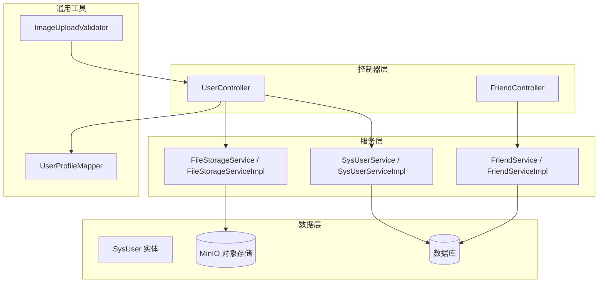
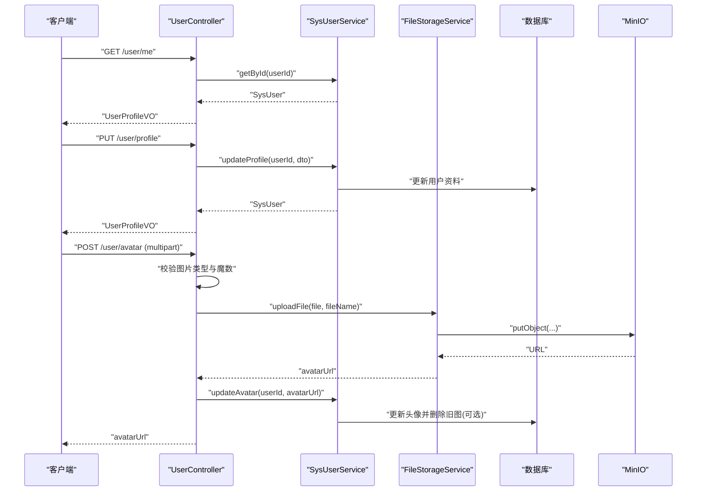
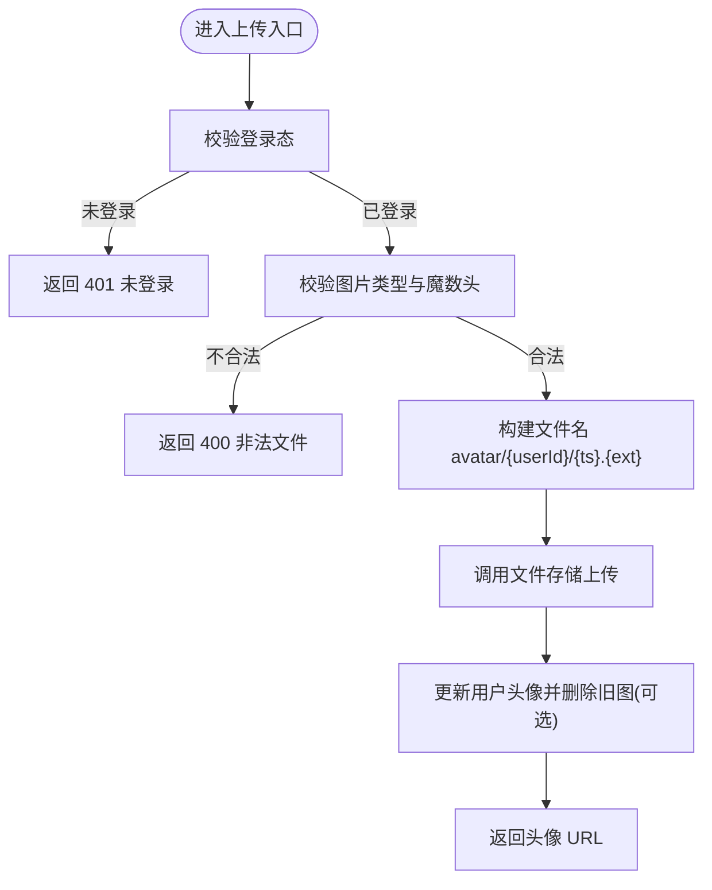
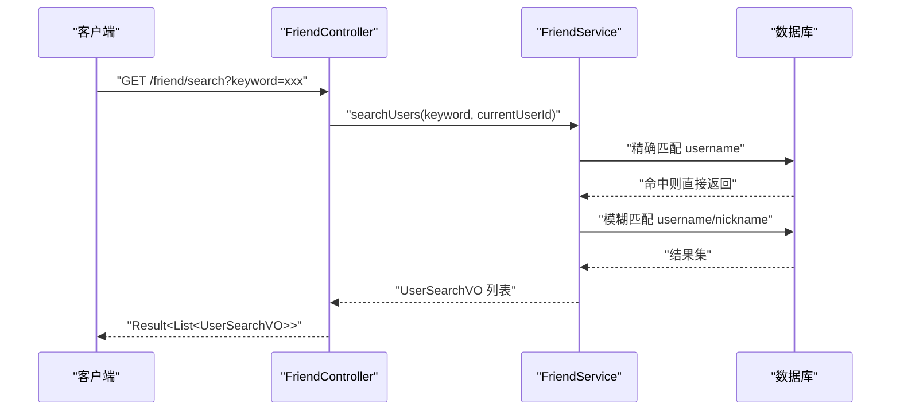
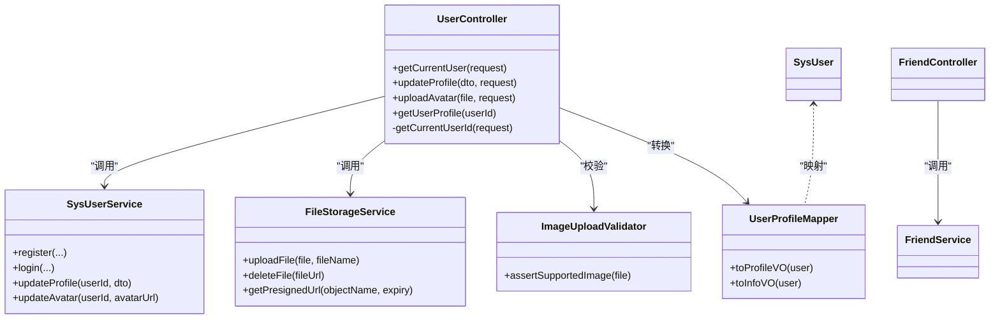

# 用户接口

<cite>
**本文引用的文件**
- [UserController.java](file://linkx-server/src/main/java/com/linkx/server/controller/UserController.java)
- [SysUserService.java](file://linkx-server/src/main/java/com/linkx/server/service/SysUserService.java)
- [SysUserServiceImpl.java](file://linkx-server/src/main/java/com/linkx/server/service/impl/SysUserServiceImpl.java)
- [SysUser.java](file://linkx-server/src/main/java/com/linkx/server/entity/SysUser.java)
- [UpdateProfileDTO.java](file://linkx-server/src/main/java/com/linkx/server/controller/dto/UpdateProfileDTO.java)
- [UserProfileVO.java](file://linkx-server/src/main/java/com/linkx/server/controller/vo/UserProfileVO.java)
- [UserInfoVO.java](file://linkx-server/src/main/java/com/linkx/server/controller/vo/UserInfoVO.java)
- [UserSearchVO.java](file://linkx-server/src/main/java/com/linkx/server/controller/vo/UserSearchVO.java)
- [FriendController.java](file://linkx-server/src/main/java/com/linkx/server/controller/FriendController.java)
- [FriendService.java](file://linkx-server/src/main/java/com/linkx/server/service/FriendService.java)
- [FriendServiceImpl.java](file://linkx-server/src/main/java/com/linkx/server/service/impl/FriendServiceImpl.java)
- [ImageUploadValidator.java](file://linkx-server/src/main/java/com/linkx/server/common/ImageUploadValidator.java)
- [FileStorageService.java](file://linkx-server/src/main/java/com/linkx/server/service/FileStorageService.java)
- [FileStorageServiceImpl.java](file://linkx-server/src/main/java/com/linkx/server/service/impl/FileStorageServiceImpl.java)
- [UserProfileMapper.java](file://linkx-server/src/main/java/com/linkx/server/common/UserProfileMapper.java)
</cite>

## 目录
1. [简介](#简介)
2. [项目结构](#项目结构)
3. [核心组件](#核心组件)
4. [架构总览](#架构总览)
5. [详细组件分析](#详细组件分析)
6. [依赖关系分析](#依赖关系分析)
7. [性能考虑](#性能考虑)
8. [故障排查指南](#故障排查指南)
9. [结论](#结论)
10. [附录：接口清单与示例](#附录接口清单与示例)

## 简介
本文件为 LinkX 用户管理 RESTful API 的权威文档，覆盖以下能力：
- 用户信息查询（当前登录用户、公开资料）
- 用户资料更新（昵称、签名、性别、生日、地区等）
- 头像上传（图片校验、存储策略、旧图清理）
- 用户搜索（按用户名精确匹配与模糊匹配）
同时说明数据模型设计、字段验证规则、权限控制机制、文件上传处理流程与安全最佳实践。

## 项目结构
后端采用分层架构：控制器层负责路由与参数校验，服务层封装业务逻辑，实体层映射数据库表，通用工具类提供校验与对象转换，文件存储通过 MinIO 实现。

图表来源
- [UserController.java:1-145](file://linkx-server/src/main/java/com/linkx/server/controller/UserController.java#L1-L145)
- [FriendController.java:1-96](file://linkx-server/src/main/java/com/linkx/server/controller/FriendController.java#L1-L96)
- [SysUserService.java:1-34](file://linkx-server/src/main/java/com/linkx/server/service/SysUserService.java#L1-L34)
- [SysUserServiceImpl.java:1-175](file://linkx-server/src/main/java/com/linkx/server/service/impl/SysUserServiceImpl.java#L1-L175)
- [FileStorageService.java:1-45](file://linkx-server/src/main/java/com/linkx/server/service/FileStorageService.java#L1-L45)
- [FileStorageServiceImpl.java:1-116](file://linkx-server/src/main/java/com/linkx/server/service/impl/FileStorageServiceImpl.java#L1-L116)
- [ImageUploadValidator.java:1-66](file://linkx-server/src/main/java/com/linkx/server/common/ImageUploadValidator.java#L1-L66)
- [UserProfileMapper.java:1-52](file://linkx-server/src/main/java/com/linkx/server/common/UserProfileMapper.java#L1-L52)
- [SysUser.java:1-97](file://linkx-server/src/main/java/com/linkx/server/entity/SysUser.java#L1-L97)

章节来源
- [UserController.java:1-145](file://linkx-server/src/main/java/com/linkx/server/controller/UserController.java#L1-L145)
- [FriendController.java:1-96](file://linkx-server/src/main/java/com/linkx/server/controller/FriendController.java#L1-L96)

## 核心组件
- 用户控制器：提供获取当前用户信息、更新资料、上传头像、获取公开资料等接口；统一从请求上下文解析当前用户 ID。
- 用户服务：实现注册、登录、资料更新、头像更新等业务逻辑，包含状态检查与审计记录。
- 文件存储服务：封装 MinIO 上传、删除与预签名 URL 生成；支持大小限制与路径组织。
- 图片校验器：基于 Content-Type 与魔数头校验图片格式，拒绝非图片文件。
- 好友服务：提供用户搜索、好友申请、列表管理等能力。
- 数据模型与 VO：实体映射数据库表，VO 用于对外响应，避免泄露敏感字段。

章节来源
- [SysUserServiceImpl.java:1-175](file://linkx-server/src/main/java/com/linkx/server/service/impl/SysUserServiceImpl.java#L1-L175)
- [FileStorageServiceImpl.java:1-116](file://linkx-server/src/main/java/com/linkx/server/service/impl/FileStorageServiceImpl.java#L1-L116)
- [ImageUploadValidator.java:1-66](file://linkx-server/src/main/java/com/linkx/server/common/ImageUploadValidator.java#L1-L66)
- [FriendServiceImpl.java:1-333](file://linkx-server/src/main/java/com/linkx/server/service/impl/FriendServiceImpl.java#L1-L333)
- [UserProfileMapper.java:1-52](file://linkx-server/src/main/java/com/linkx/server/common/UserProfileMapper.java#L1-L52)

## 架构总览
下图展示用户相关接口的调用链路与关键交互点。

图表来源
- [UserController.java:33-100](file://linkx-server/src/main/java/com/linkx/server/controller/UserController.java#L33-L100)
- [SysUserService.java:17-33](file://linkx-server/src/main/java/com/linkx/server/service/SysUserService.java#L17-L33)
- [SysUserServiceImpl.java:101-173](file://linkx-server/src/main/java/com/linkx/server/service/impl/SysUserServiceImpl.java#L101-L173)
- [FileStorageService.java:10-44](file://linkx-server/src/main/java/com/linkx/server/service/FileStorageService.java#L10-L44)
- [FileStorageServiceImpl.java:27-73](file://linkx-server/src/main/java/com/linkx/server/service/impl/FileStorageServiceImpl.java#L27-L73)

## 详细组件分析

### 用户查询接口
- 获取当前登录用户信息
  - 方法：GET
  - 路径：/user/me
  - 鉴权：需要登录态（从请求属性或 Authorization 头解析 userId）
  - 成功响应：UserProfileVO
  - 失败响应：未登录、用户不存在
- 获取公开用户资料
  - 方法：GET
  - 路径：/user/{userId}/profile
  - 鉴权：无需登录
  - 成功响应：UserProfileVO
  - 失败响应：用户不存在

章节来源
- [UserController.java:33-49](file://linkx-server/src/main/java/com/linkx/server/controller/UserController.java#L33-L49)
- [UserController.java:103-113](file://linkx-server/src/main/java/com/linkx/server/controller/UserController.java#L103-L113)
- [UserProfileMapper.java:15-32](file://linkx-server/src/main/java/com/linkx/server/common/UserProfileMapper.java#L15-L32)

### 用户资料更新接口
- 方法：PUT
- 路径：/user/profile
- 鉴权：需要登录态
- 请求体：UpdateProfileDTO（支持部分更新）
- 字段验证规则
  - nickname：最大长度 50
  - signature：最大长度 200
  - gender：仅允许“男”、“女”或空
  - birthday：毫秒时间戳
  - country/province/region：最大长度 64
- 成功响应：更新后的 UserProfileVO
- 失败响应：未登录、用户不存在

章节来源
- [UserController.java:54-65](file://linkx-server/src/main/java/com/linkx/server/controller/UserController.java#L54-L65)
- [UpdateProfileDTO.java:1-54](file://linkx-server/src/main/java/com/linkx/server/controller/dto/UpdateProfileDTO.java#L1-L54)
- [SysUserServiceImpl.java:101-152](file://linkx-server/src/main/java/com/linkx/server/service/impl/SysUserServiceImpl.java#L101-L152)

### 头像上传接口
- 方法：POST
- 路径：/user/avatar
- 鉴权：需要登录态
- 请求体：multipart/form-data，字段名 file
- 校验规则
  - Content-Type 必须以 image/ 开头
  - 魔数头校验：支持 JPEG、PNG、GIF、WebP
- 存储策略
  - 文件名：avatar/{userId}/{timestamp}.{ext}
  - 上传至 MinIO，返回可访问 URL
  - 更新用户头像后，若旧头像非默认且存在，则尝试删除
- 成功响应：头像 URL
- 失败响应：未登录、非法文件、上传失败

图表来源
- [UserController.java:68-100](file://linkx-server/src/main/java/com/linkx/server/controller/UserController.java#L68-L100)
- [ImageUploadValidator.java:16-24](file://linkx-server/src/main/java/com/linkx/server/common/ImageUploadValidator.java#L16-L24)
- [FileStorageServiceImpl.java:27-73](file://linkx-server/src/main/java/com/linkx/server/service/impl/FileStorageServiceImpl.java#L27-L73)
- [SysUserServiceImpl.java:154-173](file://linkx-server/src/main/java/com/linkx/server/service/impl/SysUserServiceImpl.java#L154-L173)

章节来源
- [UserController.java:68-100](file://linkx-server/src/main/java/com/linkx/server/controller/UserController.java#L68-L100)
- [ImageUploadValidator.java:1-66](file://linkx-server/src/main/java/com/linkx/server/common/ImageUploadValidator.java#L1-L66)
- [FileStorageService.java:10-44](file://linkx-server/src/main/java/com/linkx/server/service/FileStorageService.java#L10-L44)
- [FileStorageServiceImpl.java:27-106](file://linkx-server/src/main/java/com/linkx/server/service/impl/FileStorageServiceImpl.java#L27-L106)
- [SysUserServiceImpl.java:154-173](file://linkx-server/src/main/java/com/linkx/server/service/impl/SysUserServiceImpl.java#L154-L173)

### 用户搜索接口
- 方法：GET
- 路径：/friend/search
- 鉴权：需要登录态
- 查询参数：keyword（至少 2 个字符）
- 匹配策略
  - 优先精确匹配 username（排除自身且仅正常状态）
  - 其次模糊匹配 username 与 nickname，合并去重并按上限返回
- 成功响应：UserSearchVO 列表
- 失败响应：关键词过短、无结果

图表来源
- [FriendController.java:26-32](file://linkx-server/src/main/java/com/linkx/server/controller/FriendController.java#L26-L32)
- [FriendServiceImpl.java:39-81](file://linkx-server/src/main/java/com/linkx/server/service/impl/FriendServiceImpl.java#L39-L81)

章节来源
- [FriendController.java:26-32](file://linkx-server/src/main/java/com/linkx/server/controller/FriendController.java#L26-L32)
- [FriendService.java:10-12](file://linkx-server/src/main/java/com/linkx/server/service/FriendService.java#L10-L12)
- [FriendServiceImpl.java:39-81](file://linkx-server/src/main/java/com/linkx/server/service/impl/FriendServiceImpl.java#L39-L81)
- [UserSearchVO.java:1-21](file://linkx-server/src/main/java/com/linkx/server/controller/vo/UserSearchVO.java#L1-L21)

### 数据模型与字段说明
- 用户实体（SysUser）
  - 主键：雪花算法生成的 Long id
  - 账号：username（唯一索引）
  - 密码：BCrypt 哈希，禁止明文
  - 展示：nickname、avatar、signature、gender、birthday
  - 地区：country、province、region
  - 状态：status（1=正常，0=停用）
  - 审计：createTime、updateTime、createBy、updateBy
  - 逻辑删除：deleted（自动过滤）
- 视图对象
  - UserProfileVO：对外资料响应，含创建时间
  - UserInfoVO：登录成功返回的用户基本信息（不含敏感字段）
  - UserSearchVO：搜索结果项，Long id 使用字符串序列化以避免前端精度丢失

章节来源
- [SysUser.java:34-96](file://linkx-server/src/main/java/com/linkx/server/entity/SysUser.java#L34-L96)
- [UserProfileVO.java:1-70](file://linkx-server/src/main/java/com/linkx/server/controller/vo/UserProfileVO.java#L1-L70)
- [UserInfoVO.java:1-49](file://linkx-server/src/main/java/com/linkx/server/controller/vo/UserInfoVO.java#L1-L49)
- [UserSearchVO.java:1-21](file://linkx-server/src/main/java/com/linkx/server/controller/vo/UserSearchVO.java#L1-L21)

### 权限控制与隐私保护
- 身份解析
  - 优先从请求属性读取 userId（由拦截器注入）
  - 否则从 Authorization 头提取 Bearer Token 并解析
- 资源隔离
  - 修改资料与上传头像仅限本人操作
  - 公开资料接口不暴露敏感字段
- 安全建议
  - 强制 HTTPS
  - 最小化返回字段，避免泄露内部状态
  - 对上传文件进行严格校验与大小限制

章节来源
- [UserController.java:122-143](file://linkx-server/src/main/java/com/linkx/server/controller/UserController.java#L122-L143)
- [UserProfileMapper.java:15-32](file://linkx-server/src/main/java/com/linkx/server/common/UserProfileMapper.java#L15-L32)

## 依赖关系分析

图表来源
- [UserController.java:1-145](file://linkx-server/src/main/java/com/linkx/server/controller/UserController.java#L1-L145)
- [SysUserService.java:1-34](file://linkx-server/src/main/java/com/linkx/server/service/SysUserService.java#L1-L34)
- [FileStorageService.java:1-45](file://linkx-server/src/main/java/com/linkx/server/service/FileStorageService.java#L1-L45)
- [ImageUploadValidator.java:1-66](file://linkx-server/src/main/java/com/linkx/server/common/ImageUploadValidator.java#L1-L66)
- [UserProfileMapper.java:1-52](file://linkx-server/src/main/java/com/linkx/server/common/UserProfileMapper.java#L1-L52)
- [SysUser.java:1-97](file://linkx-server/src/main/java/com/linkx/server/entity/SysUser.java#L1-L97)
- [FriendController.java:1-96](file://linkx-server/src/main/java/com/linkx/server/controller/FriendController.java#L1-L96)
- [FriendService.java:1-28](file://linkx-server/src/main/java/com/linkx/server/service/FriendService.java#L1-L28)

章节来源
- [UserController.java:1-145](file://linkx-server/src/main/java/com/linkx/server/controller/UserController.java#L1-L145)
- [SysUserService.java:1-34](file://linkx-server/src/main/java/com/linkx/server/service/SysUserService.java#L1-L34)
- [FileStorageService.java:1-45](file://linkx-server/src/main/java/com/linkx/server/service/FileStorageService.java#L1-L45)
- [FriendController.java:1-96](file://linkx-server/src/main/java/com/linkx/server/controller/FriendController.java#L1-L96)

## 性能考虑
- 图片上传
  - 在应用层进行类型与魔数校验，减少无效 IO
  - 文件大小限制由配置驱动，避免大文件占用内存
  - 按日期组织对象路径，利于 CDN 缓存与分片
- 用户搜索
  - 先精确匹配再模糊匹配，命中即短路返回
  - 合并去重并限制返回数量，降低网络与渲染开销
- 数据库访问
  - 使用条件查询与分页/限流策略，避免全表扫描
  - 对热点字段建立合适索引（如 username、status）

## 故障排查指南
- 未登录或令牌异常
  - 现象：返回未登录错误码
  - 排查：确认 Authorization 头是否携带有效 Bearer Token，或拦截器是否正确注入 userId
- 非法文件上传
  - 现象：返回非法文件或无效图片错误
  - 排查：检查 Content-Type 与文件魔数头，确保为支持的图片格式
- 头像更新失败
  - 现象：返回上传失败或删除失败
  - 排查：检查 MinIO 连接配置、Bucket 权限与对象命名合法性；注意删除旧图失败不影响新图写入
- 搜索无结果
  - 现象：返回空列表
  - 排查：确认 keyword 长度、目标用户状态是否为正常、是否存在重复去重导致的结果为空

章节来源
- [UserController.java:122-143](file://linkx-server/src/main/java/com/linkx/server/controller/UserController.java#L122-L143)
- [ImageUploadValidator.java:16-24](file://linkx-server/src/main/java/com/linkx/server/common/ImageUploadValidator.java#L16-L24)
- [FileStorageServiceImpl.java:69-106](file://linkx-server/src/main/java/com/linkx/server/service/impl/FileStorageServiceImpl.java#L69-L106)
- [FriendServiceImpl.java:39-81](file://linkx-server/src/main/java/com/linkx/server/service/impl/FriendServiceImpl.java#L39-L81)

## 结论
LinkX 用户管理 API 以清晰的职责划分与严格的输入校验保障安全性与稳定性。通过统一的身份解析、最小化响应字段与对象存储分离，实现了良好的可扩展性与隐私保护。建议在后续迭代中引入图片压缩与转码、CDN 加速以及更细粒度的权限控制。

## 附录：接口清单与示例

### 接口清单
- 获取当前用户信息
  - GET /user/me
  - 鉴权：是
  - 响应：UserProfileVO
- 更新用户资料
  - PUT /user/profile
  - 鉴权：是
  - 请求体：UpdateProfileDTO
  - 响应：UserProfileVO
- 上传头像
  - POST /user/avatar
  - 鉴权：是
  - 请求体：multipart/form-data，字段 file
  - 响应：头像 URL
- 获取公开用户资料
  - GET /user/{userId}/profile
  - 鉴权：否
  - 响应：UserProfileVO
- 用户搜索
  - GET /friend/search?keyword=xxx
  - 鉴权：是
  - 响应：List<UserSearchVO>

### 请求与响应示例（文本描述）
- 获取当前用户信息
  - 请求头：Authorization: Bearer <token>
  - 响应体：包含 id、username、nickname、avatar、signature、gender、birthday、country、province、region、createTime 等字段
- 更新用户资料
  - 请求体示例（JSON）：{"nickname":"张三","signature":"你好世界","gender":"男","birthday":631152000000,"country":"中国","province":"广东","region":"深圳"}
  - 响应体：同获取当前用户信息的 UserProfileVO
- 上传头像
  - 表单字段：file（二进制图片）
  - 响应体：头像 URL 字符串
- 获取公开用户资料
  - 路径参数：userId
  - 响应体：UserProfileVO
- 用户搜索
  - 查询参数：keyword（至少 2 个字符）
  - 响应体：数组，每项包含 id、username、nickname、avatar

章节来源
- [UserController.java:33-113](file://linkx-server/src/main/java/com/linkx/server/controller/UserController.java#L33-L113)
- [UpdateProfileDTO.java:1-54](file://linkx-server/src/main/java/com/linkx/server/controller/dto/UpdateProfileDTO.java#L1-L54)
- [UserProfileVO.java:1-70](file://linkx-server/src/main/java/com/linkx/server/controller/vo/UserProfileVO.java#L1-L70)
- [FriendController.java:26-32](file://linkx-server/src/main/java/com/linkx/server/controller/FriendController.java#L26-L32)
- [UserSearchVO.java:1-21](file://linkx-server/src/main/java/com/linkx/server/controller/vo/UserSearchVO.java#L1-L21)