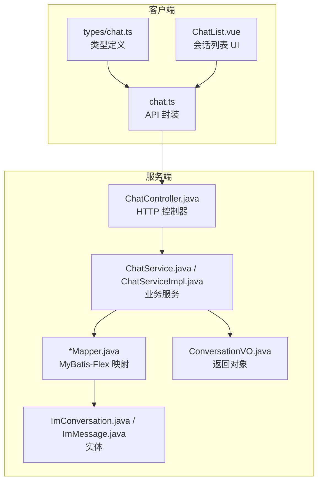
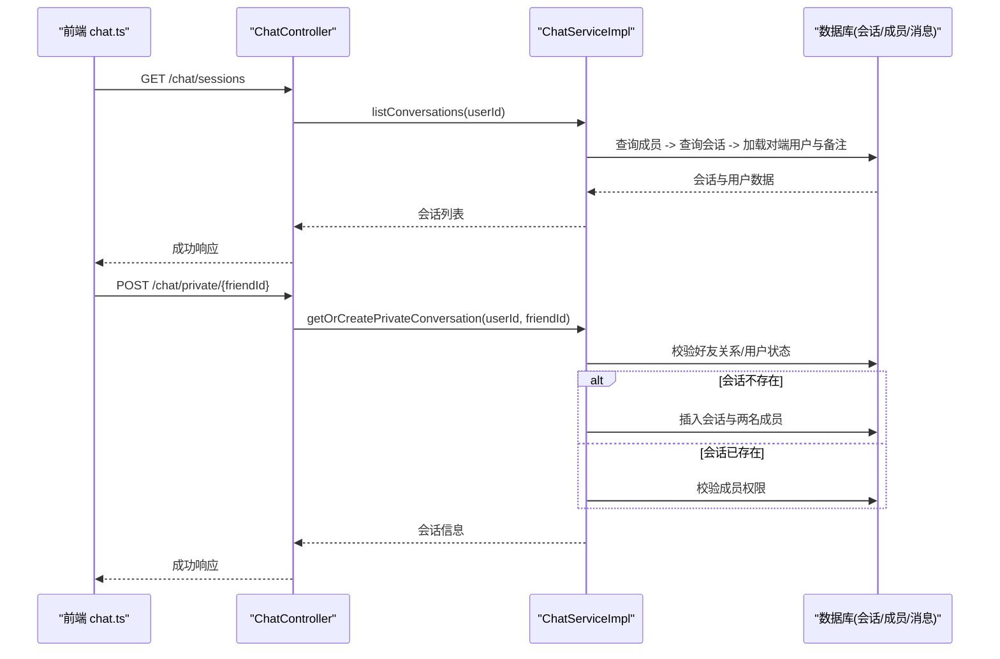
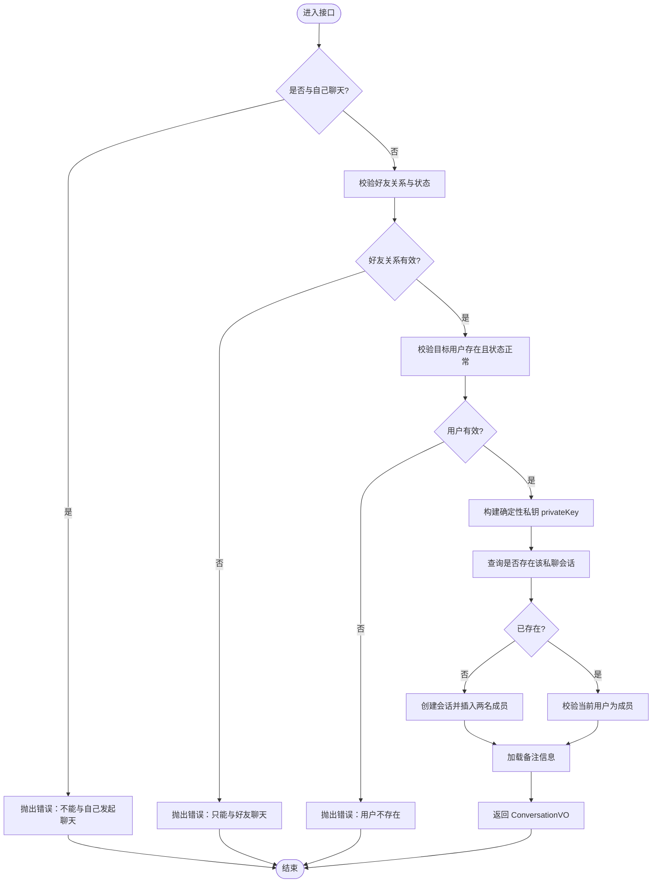
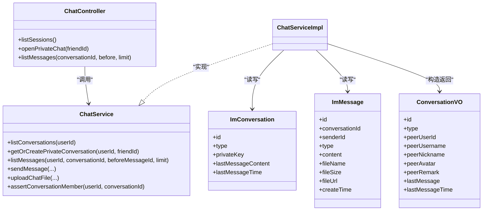

# 会话管理接口

<cite>
**本文引用的文件**
- [ChatController.java](file://linkx-server/src/main/java/com/linkx/server/controller/ChatController.java)
- [ChatService.java](file://linkx-server/src/main/java/com/linkx/server/service/ChatService.java)
- [ChatServiceImpl.java](file://linkx-server/src/main/java/com/linkx/server/service/impl/ChatServiceImpl.java)
- [ConversationVO.java](file://linkx-server/src/main/java/com/linkx/server/controller/vo/ConversationVO.java)
- [ImConversation.java](file://linkx-server/src/main/java/com/linkx/server/entity/ImConversation.java)
- [ImMessage.java](file://linkx-server/src/main/java/com/linkx/server/entity/ImMessage.java)
- [chat.ts](file://linkx-client/src/api/chat.ts)
- [chat.ts（类型定义）](file://linkx-client/src/types/chat.ts)
- [ChatList.vue](file://linkx-client/src/components/ChatList.vue)
</cite>

## 目录
1. [简介](#简介)
2. [项目结构](#项目结构)
3. [核心组件](#核心组件)
4. [架构总览](#架构总览)
5. [详细接口说明](#详细接口说明)
6. [依赖关系分析](#依赖关系分析)
7. [性能与缓存策略](#性能与缓存策略)
8. [故障排查指南](#故障排查指南)
9. [结论](#结论)
10. [附录：前端集成示例与最佳实践](#附录前端集成示例与最佳实践)

## 简介
本文件为 LinkX 聊天系统的“会话管理”能力提供 API 文档，重点覆盖以下能力：
- 获取用户的所有聊天会话列表（单聊、群聊）
- 创建私聊会话（含好友关系校验、重复会话处理）
- 会话状态管理与消息分页读取（作为上下文补充）

文档同时给出请求参数、响应数据结构、错误码处理、持久化与缓存策略、性能优化建议以及前端集成示例和常见使用场景的最佳实践。

## 项目结构
后端采用 Spring Boot + MyBatis-Flex 分层架构：
- Controller 层负责 HTTP 路由与鉴权提取
- Service 层实现业务逻辑（会话查询、私聊创建、权限校验、消息分页等）
- Mapper 层对接数据库实体与表
- VO 用于对外返回数据模型
- 客户端通过 TypeScript API 封装调用后端接口，并在 Vue 组件中消费

图表来源
- [ChatController.java:1-72](file://linkx-server/src/main/java/com/linkx/server/controller/ChatController.java#L1-L72)
- [ChatService.java:1-25](file://linkx-server/src/main/java/com/linkx/server/service/ChatService.java#L1-L25)
- [ChatServiceImpl.java:1-379](file://linkx-server/src/main/java/com/linkx/server/service/impl/ChatServiceImpl.java#L1-L379)
- [ConversationVO.java:1-28](file://linkx-server/src/main/java/com/linkx/server/controller/vo/ConversationVO.java#L1-L28)
- [ImConversation.java:1-48](file://linkx-server/src/main/java/com/linkx/server/entity/ImConversation.java#L1-L48)
- [ImMessage.java:1-52](file://linkx-server/src/main/java/com/linkx/server/entity/ImMessage.java#L1-L52)
- [chat.ts:1-28](file://linkx-client/src/api/chat.ts#L1-L28)
- [chat.ts（类型定义）:1-57](file://linkx-client/src/types/chat.ts#L1-L57)
- [ChatList.vue:1-378](file://linkx-client/src/components/ChatList.vue#L1-L378)

章节来源
- [ChatController.java:1-72](file://linkx-server/src/main/java/com/linkx/server/controller/ChatController.java#L1-L72)
- [ChatService.java:1-25](file://linkx-server/src/main/java/com/linkx/server/service/ChatService.java#L1-L25)
- [ChatServiceImpl.java:1-379](file://linkx-server/src/main/java/com/linkx/server/service/impl/ChatServiceImpl.java#L1-L379)
- [ConversationVO.java:1-28](file://linkx-server/src/main/java/com/linkx/server/controller/vo/ConversationVO.java#L1-L28)
- [ImConversation.java:1-48](file://linkx-server/src/main/java/com/linkx/server/entity/ImConversation.java#L1-L48)
- [ImMessage.java:1-52](file://linkx-server/src/main/java/com/linkx/server/entity/ImMessage.java#L1-L52)
- [chat.ts:1-28](file://linkx-client/src/api/chat.ts#L1-L28)
- [chat.ts（类型定义）:1-57](file://linkx-client/src/types/chat.ts#L1-L57)
- [ChatList.vue:1-378](file://linkx-client/src/components/ChatList.vue#L1-L378)

## 核心组件
- 会话列表查询：GET /chat/sessions
  - 返回当前用户参与的所有会话（包含单聊与会话元信息），按最后消息时间倒序排序
- 私聊会话创建：POST /chat/private/{friendId}
  - 校验好友关系与用户状态，若不存在则创建私聊会话并初始化成员；已存在则直接复用
- 会话权限校验：assertConversationMember
  - 确保当前用户是会话成员，否则拒绝访问
- 消息分页读取：GET /chat/sessions/{conversationId}/messages
  - 基于 before 游标的时间分页，限制默认与最大页大小

章节来源
- [ChatController.java:30-53](file://linkx-server/src/main/java/com/linkx/server/controller/ChatController.java#L30-L53)
- [ChatServiceImpl.java:54-168](file://linkx-server/src/main/java/com/linkx/server/service/impl/ChatServiceImpl.java#L54-L168)

## 架构总览
下图展示从前端到后端的调用链路及关键职责划分。

图表来源
- [ChatController.java:30-42](file://linkx-server/src/main/java/com/linkx/server/controller/ChatController.java#L30-L42)
- [ChatServiceImpl.java:54-132](file://linkx-server/src/main/java/com/linkx/server/service/impl/ChatServiceImpl.java#L54-L132)

## 详细接口说明

### 通用约定
- 统一响应体：Result<T>
  - code: 数字状态码（业务错误由自定义异常抛出）
  - message: 提示信息
  - data: 具体数据
- 鉴权：所有接口均要求携带有效 JWT，服务端从请求中提取 userId
- ID 格式：Long 型数值，以字符串形式在 URL 或 JSON 中传递（序列化时转为字符串）

章节来源
- [ChatController.java:1-29](file://linkx-server/src/main/java/com/linkx/server/controller/ChatController.java#L1-L29)
- [ChatServiceImpl.java:228-238](file://linkx-server/src/main/java/com/linkx/server/service/impl/ChatServiceImpl.java#L228-L238)

### 获取会话列表
- 方法：GET
- 路径：/chat/sessions
- 认证：需要
- 请求参数：无
- 响应数据：List<ConversationVO>
  - id: 会话 ID（字符串表示的 Long）
  - type: 会话类型（1=单聊，2=群聊）
  - peerUserId: 对端用户 ID（仅单聊）
  - peerUsername: 对端用户名（仅单聊）
  - peerNickname: 对端昵称（仅单聊）
  - peerAvatar: 对端头像地址（仅单聊）
  - peerRemark: 对端备注（仅单聊）
  - lastMessage: 最后一条消息预览文本
  - lastMessageTime: 最后消息时间戳（毫秒）
- 行为说明：
  - 仅返回单聊会话（type=1）
  - 按 lastMessageTime 倒序排列，空值置后
  - 聚合对端用户信息与备注

章节来源
- [ChatController.java:30-34](file://linkx-server/src/main/java/com/linkx/server/controller/ChatController.java#L30-L34)
- [ChatServiceImpl.java:54-89](file://linkx-server/src/main/java/com/linkx/server/service/impl/ChatServiceImpl.java#L54-L89)
- [ConversationVO.java:1-28](file://linkx-server/src/main/java/com/linkx/server/controller/vo/ConversationVO.java#L1-L28)
- [ImConversation.java:25-37](file://linkx-server/src/main/java/com/linkx/server/entity/ImConversation.java#L25-L37)

### 创建私聊会话
- 方法：POST
- 路径：/chat/private/{friendId}
- 认证：需要
- 路径参数：
  - friendId: 目标好友的用户 ID（Long 字符串）
- 响应数据：ConversationVO
- 行为说明：
  - 禁止与自己发起私聊
  - 校验双方好友关系且状态正常
  - 校验目标用户存在且状态正常
  - 根据 userId 与 friendId 生成确定性 privateKey 查找已有会话
  - 若不存在则新建会话并插入两名成员；若存在则校验当前用户为成员
  - 返回会话信息（含对端用户与备注）

图表来源
- [ChatServiceImpl.java:92-132](file://linkx-server/src/main/java/com/linkx/server/service/impl/ChatServiceImpl.java#L92-L132)

章节来源
- [ChatController.java:36-42](file://linkx-server/src/main/java/com/linkx/server/controller/ChatController.java#L36-L42)
- [ChatServiceImpl.java:92-132](file://linkx-server/src/main/java/com/linkx/server/service/impl/ChatServiceImpl.java#L92-L132)

### 会话权限校验
- 作用：确保当前用户是会话成员，否则拒绝访问
- 触发点：会话相关操作前（如发消息、拉取消息、上传文件等）
- 失败响应：403 无权访问该会话

章节来源
- [ChatServiceImpl.java:228-238](file://linkx-server/src/main/java/com/linkx/server/service/impl/ChatServiceImpl.java#L228-L238)

### 消息分页读取（补充）
- 方法：GET
- 路径：/chat/sessions/{conversationId}/messages
- 认证：需要
- 查询参数：
  - conversationId: 会话 ID（必填）
  - before: 游标（可选），指定在此时间之前的消息
  - limit: 每页数量（可选，默认 50，最大 100）
- 响应数据：List<MessageVO>
- 行为说明：
  - 先校验成员权限
  - 按 createTime 降序查询，再在内存中按时间升序返回
  - 批量加载发送者信息，填充昵称与头像

章节来源
- [ChatController.java:44-53](file://linkx-server/src/main/java/com/linkx/server/controller/ChatController.java#L44-L53)
- [ChatServiceImpl.java:134-168](file://linkx-server/src/main/java/com/linkx/server/service/impl/ChatServiceImpl.java#L134-L168)

## 依赖关系分析
- 控制器依赖服务层进行业务处理
- 服务层依赖多个 Mapper 访问数据库：
  - 会话与成员：ImConversationMapper、ImConversationMemberMapper
  - 消息：ImMessageMapper
  - 用户与好友关系：SysUserMapper、SysUserRelationMapper
- 实体字段约束与常量：
  - 会话类型：TYPE_PRIVATE=1，TYPE_GROUP=2
  - 消息类型：text、image、file
- 对外返回对象 ConversationVO 将内部实体转换为稳定 JSON 结构

图表来源
- [ChatController.java:1-72](file://linkx-server/src/main/java/com/linkx/server/controller/ChatController.java#L1-L72)
- [ChatService.java:1-25](file://linkx-server/src/main/java/com/linkx/server/service/ChatService.java#L1-L25)
- [ChatServiceImpl.java:1-379](file://linkx-server/src/main/java/com/linkx/server/service/impl/ChatServiceImpl.java#L1-L379)
- [ImConversation.java:1-48](file://linkx-server/src/main/java/com/linkx/server/entity/ImConversation.java#L1-L48)
- [ImMessage.java:1-52](file://linkx-server/src/main/java/com/linkx/server/entity/ImMessage.java#L1-L52)
- [ConversationVO.java:1-28](file://linkx-server/src/main/java/com/linkx/server/controller/vo/ConversationVO.java#L1-L28)

## 性能与缓存策略
- 会话列表查询
  - 单次批量查询成员与会话，避免 N+1 问题
  - 对端用户与备注批量加载，减少往返
  - 排序在内存完成，适合中小规模数据
- 消息分页
  - 基于时间游标的分页，limit 上限控制
  - 批量加载发送者信息，降低多次查询开销
- 建议优化方向
  - 引入 Redis 缓存会话列表与最近消息摘要，设置合理过期时间
  - 对高频访问的对端用户信息进行本地缓存（Caffeine）
  - 对会话列表增加索引（按 userId、lastMessageTime）
  - 消息表按 conversationId + createTime 建立复合索引
  - 大列表分页与虚拟滚动在前端配合，提升渲染性能

[本节为通用性能建议，不直接分析具体文件]

## 故障排查指南
- 常见错误码与原因
  - 400 无效的 ID：URL 中的 ID 无法解析为 Long
  - 400 不能与自己发起聊天：friendId 等于当前用户
  - 403 只能与好友聊天：未建立好友关系或关系状态非正常
  - 404 用户不存在：目标用户不存在或状态异常
  - 403 无权访问该会话：当前用户不是会话成员
  - 404 会话不存在：发送消息时会话已被删除或不存在
- 定位步骤
  - 检查 JWT 是否有效、userId 是否正确提取
  - 确认好友关系记录是否存在且状态正常
  - 核对会话成员表是否包含当前用户
  - 查看消息分页参数 before 与 limit 是否符合预期

章节来源
- [ChatController.java:64-70](file://linkx-server/src/main/java/com/linkx/server/controller/ChatController.java#L64-L70)
- [ChatServiceImpl.java:92-132](file://linkx-server/src/main/java/com/linkx/server/service/impl/ChatServiceImpl.java#L92-L132)
- [ChatServiceImpl.java:228-238](file://linkx-server/src/main/java/com/linkx/server/service/impl/ChatServiceImpl.java#L228-L238)

## 结论
LinkX 的会话管理接口围绕“会话列表查询”和“私聊会话创建”两大核心能力展开，具备完善的权限校验与幂等性设计（通过确定性私钥保证重复会话复用）。在服务端实现了批量加载与分页优化，前端提供了清晰的类型定义与 API 封装，便于快速集成。后续可通过缓存与索引进一步优化大规模场景下的性能表现。

[本节为总结性内容，不直接分析具体文件]

## 附录：前端集成示例与最佳实践

### 前端 API 封装与类型
- API 封装
  - listSessions：获取会话列表
  - openPrivateChat：创建私聊会话
  - listMessages：分页读取消息
  - uploadChatFile：上传聊天文件
- 类型定义
  - ConversationItem：会话项
  - MessageItem：消息项
  - ChatFileUploadResult：文件上传结果
  - WsSendPayload / WsIncomingFrame：WebSocket 消息协议（扩展）

章节来源
- [chat.ts:1-28](file://linkx-client/src/api/chat.ts#L1-L28)
- [chat.ts（类型定义）:1-57](file://linkx-client/src/types/chat.ts#L1-L57)

### 典型使用流程
- 打开应用时加载会话列表
  - 调用 listSessions，渲染会话列表并按 lastMessageTime 排序
- 点击好友头像发起私聊
  - 调用 openPrivateChat(friendId)，若返回新会话则加入列表头部
- 进入会话后加载历史消息
  - 调用 listMessages(conversationId, before?, limit?)，支持无限滚动
- 发送消息
  - 通过 WebSocket 发送 WsSendPayload，服务端落库并更新会话预览

章节来源
- [ChatList.vue:1-378](file://linkx-client/src/components/ChatList.vue#L1-L378)
- [chat.ts:1-28](file://linkx-client/src/api/chat.ts#L1-L28)

### 最佳实践
- 幂等与去重
  - 创建私聊会话时使用确定性私钥，避免重复创建
- 权限前置校验
  - 任何会话相关操作前先执行 assertConversationMember
- 分页与游标
  - 使用 before 游标实现高效分页，避免偏移量带来的性能退化
- 前端体验
  - 列表使用虚拟滚动，消息区支持增量加载
  - 对网络异常与权限错误进行友好提示与重试

[本节为通用实践建议，不直接分析具体文件]