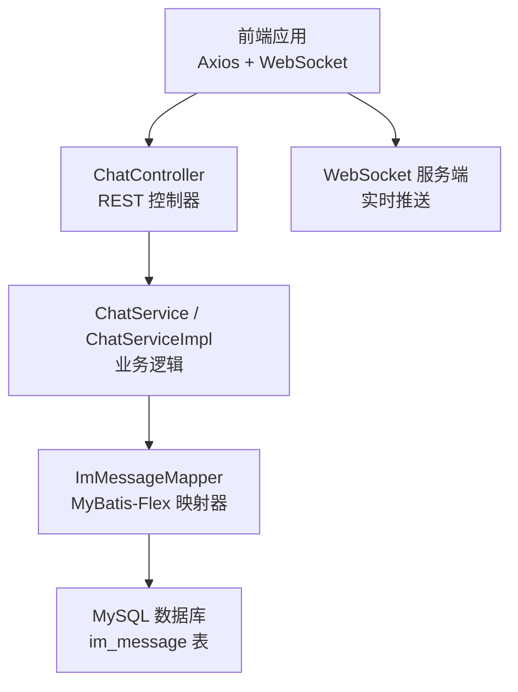
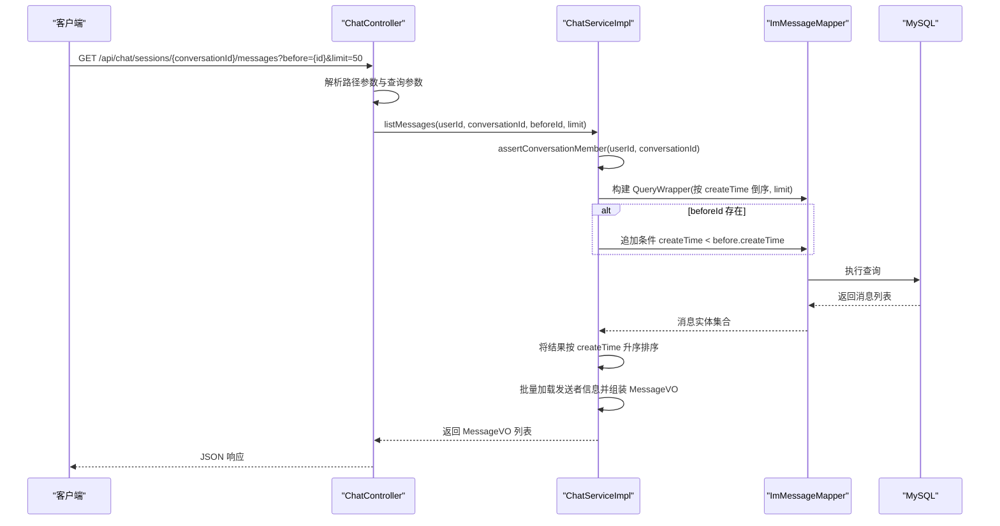
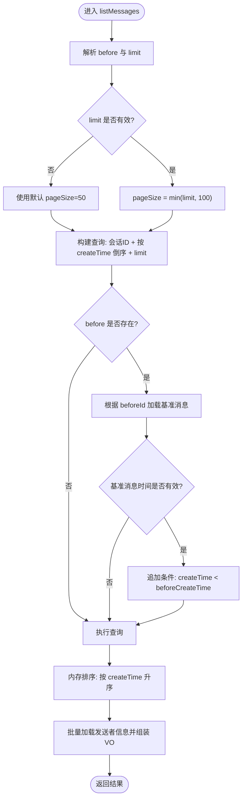
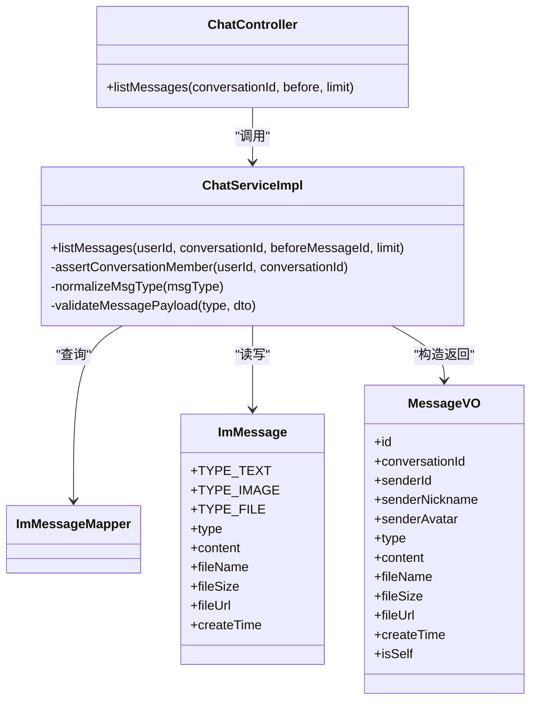

# 消息处理接口

<cite>
**本文引用的文件**   
- [ChatController.java](file://linkx-server/src/main/java/com/linkx/server/controller/ChatController.java)
- [ChatService.java](file://linkx-server/src/main/java/com/linkx/server/service/ChatService.java)
- [ChatServiceImpl.java](file://linkx-server/src/main/java/com/linkx/server/service/impl/ChatServiceImpl.java)
- [MessageVO.java](file://linkx-server/src/main/java/com/linkx/server/controller/vo/MessageVO.java)
- [ImMessage.java](file://linkx-server/src/main/java/com/linkx/server/entity/ImMessage.java)
- [ImMessageMapper.java](file://linkx-server/src/main/java/com/linkx/server/mapper/ImMessageMapper.java)
- [application.yml](file://linkx-server/src/main/resources/application.yml)
- [chat.ts](file://linkx-client/src/types/chat.ts)
</cite>

## 目录
1. [简介](#简介)
2. [项目结构](#项目结构)
3. [核心组件](#核心组件)
4. [架构总览](#架构总览)
5. [详细组件分析](#详细组件分析)
6. [依赖关系分析](#依赖关系分析)
7. [性能考虑](#性能考虑)
8. [故障排查指南](#故障排查指南)
9. [结论](#结论)
10. [附录](#附录)

## 简介
本文件为 LinkX 即时通讯系统的“消息处理接口”技术文档，重点围绕 GET /chat/sessions/{conversationId}/messages 接口的历史消息分页查询能力进行说明。内容涵盖：
- 基于时间戳的前向分页算法（before 游标）与 limit 限制策略
- 消息排序规则与返回结果顺序
- 支持的消息类型与字段语义（文本、图片、文件；语音、红包在发送端未实现）
- MessageVO 数据结构定义与字段说明
- 消息持久化存储、索引优化与查询性能调优建议
- 实时消息推送与历史消息查询的协作模式
- 前端消息渲染最佳实践

## 项目结构
后端采用 Spring Boot + MyBatis-Flex 的分层架构：Controller 暴露 REST API，Service 封装业务逻辑，Entity/Mapper 负责数据访问；前端通过 Axios 调用 HTTP 接口，并通过 WebSocket 接收实时消息。

图表来源
- [ChatController.java:44-53](file://linkx-server/src/main/java/com/linkx/server/controller/ChatController.java#L44-L53)
- [ChatServiceImpl.java:135-168](file://linkx-server/src/main/java/com/linkx/server/service/impl/ChatServiceImpl.java#L135-L168)
- [ImMessageMapper.java:1-10](file://linkx-server/src/main/java/com/linkx/server/mapper/ImMessageMapper.java#L1-L10)
- [application.yml:1-54](file://linkx-server/src/main/resources/application.yml#L1-L54)

章节来源
- [ChatController.java:22-72](file://linkx-server/src/main/java/com/linkx/server/controller/ChatController.java#L22-L72)
- [ChatService.java:11-25](file://linkx-server/src/main/java/com/linkx/server/service/ChatService.java#L11-L25)
- [ChatServiceImpl.java:38-168](file://linkx-server/src/main/java/com/linkx/server/service/impl/ChatServiceImpl.java#L38-L168)
- [ImMessageMapper.java:1-10](file://linkx-server/src/main/java/com/linkx/server/mapper/ImMessageMapper.java#L1-L10)
- [application.yml:1-54](file://linkx-server/src/main/resources/application.yml#L1-L54)

## 核心组件
- REST 控制器：提供会话列表、私聊会话创建、历史消息分页查询、文件上传等接口
- 服务层：实现权限校验、会话成员校验、消息分页查询、消息发送、文件上传等业务
- 数据模型：消息实体 ImMessage 与视图对象 MessageVO
- 客户端类型：前端 TypeScript 类型定义，用于约束请求/响应结构

章节来源
- [ChatController.java:44-53](file://linkx-server/src/main/java/com/linkx/server/controller/ChatController.java#L44-L53)
- [ChatServiceImpl.java:135-168](file://linkx-server/src/main/java/com/linkx/server/service/impl/ChatServiceImpl.java#L135-L168)
- [MessageVO.java:1-32](file://linkx-server/src/main/java/com/linkx/server/controller/vo/MessageVO.java#L1-L32)
- [ImMessage.java:1-52](file://linkx-server/src/main/java/com/linkx/server/entity/ImMessage.java#L1-L52)
- [chat.ts:15-28](file://linkx-client/src/types/chat.ts#L15-L28)

## 架构总览
以下序列图展示一次历史消息分页查询的完整流程，包括鉴权、权限校验、分页查询、排序与组装 VO 的过程。

图表来源
- [ChatController.java:44-53](file://linkx-server/src/main/java/com/linkx/server/controller/ChatController.java#L44-L53)
- [ChatServiceImpl.java:135-168](file://linkx-server/src/main/java/com/linkx/server/service/impl/ChatServiceImpl.java#L135-L168)
- [ImMessageMapper.java:1-10](file://linkx-server/src/main/java/com/linkx/server/mapper/ImMessageMapper.java#L1-L10)

## 详细组件分析

### 接口定义与参数说明
- 接口路径：GET /api/chat/sessions/{conversationId}/messages
- 路径参数
  - conversationId：会话 ID（Long），由控制器内部 parseId 转换
- 查询参数
  - before：可选，前一条消息的 ID（字符串）。若提供，则作为游标，仅返回早于该消息时间的记录
  - limit：可选，默认 50，最大 100；超出上限将被截断
- 鉴权与会话权限
  - 通过 JWT 获取当前用户 ID
  - 校验当前用户是否为会话成员，否则拒绝访问

章节来源
- [ChatController.java:44-53](file://linkx-server/src/main/java/com/linkx/server/controller/ChatController.java#L44-L53)
- [ChatServiceImpl.java:229-238](file://linkx-server/src/main/java/com/linkx/server/service/impl/ChatServiceImpl.java#L229-L238)

### 分页算法与排序规则
- 游标分页（before）
  - 当 before 非空时，先根据消息 ID 查询到基准消息，取其 createTime，再追加条件 createTime < beforeCreateTime
  - 若基准消息不存在或时间为空，则忽略 before 条件，退化为无游标的普通分页
- 排序规则
  - 查询阶段按 createTime 降序（最新在前），便于定位游标位置
  - 返回结果在内存中按 createTime 升序排序，保证前端渲染从旧到新
- 限制策略
  - limit <= 0 使用默认值 50
  - limit > 0 时取 min(limit, 100)，防止单次拉取过多数据

图表来源
- [ChatServiceImpl.java:135-168](file://linkx-server/src/main/java/com/linkx/server/service/impl/ChatServiceImpl.java#L135-L168)

章节来源
- [ChatServiceImpl.java:135-168](file://linkx-server/src/main/java/com/linkx/server/service/impl/ChatServiceImpl.java#L135-L168)

### 消息类型支持与字段语义
- 已实现类型
  - text：文本消息
  - image：图片消息
  - file：文件消息
- 未实现类型
  - voice：语音消息（发送端 normalizeMsgType 未包含）
  - redPacket：红包消息（发送端 normalizeMsgType 未包含）
- 字段语义
  - type：消息类型枚举（text/image/file）
  - content：文本内容或摘要（图片/文件场景下可能回退为文件名或 URL）
  - fileName：文件名（文件消息必填）
  - fileSize：文件大小（字节）
  - fileUrl：文件地址（图片/文件必填）

章节来源
- [ImMessage.java:25-27](file://linkx-server/src/main/java/com/linkx/server/entity/ImMessage.java#L25-L27)
- [ChatServiceImpl.java:333-344](file://linkx-server/src/main/java/com/linkx/server/service/impl/ChatServiceImpl.java#L333-L344)
- [ChatServiceImpl.java:346-369](file://linkx-server/src/main/java/com/linkx/server/service/impl/ChatServiceImpl.java#L346-L369)

### MessageVO 数据结构定义
- id：消息唯一标识（雪花 ID，序列化时转为字符串）
- conversationId：会话 ID（字符串）
- senderId：发送者 ID（字符串）
- senderNickname：发送者昵称
- senderAvatar：发送者头像 URL
- type：消息类型（text/image/file）
- content：消息内容或摘要
- fileName：文件名（文件消息）
- fileSize：文件大小（字节）
- fileUrl：文件地址（图片/文件）
- createTime：消息创建时间（毫秒时间戳）
- isSelf：是否当前用户发送

章节来源
- [MessageVO.java:1-32](file://linkx-server/src/main/java/com/linkx/server/controller/vo/MessageVO.java#L1-L32)
- [ChatServiceImpl.java:310-325](file://linkx-server/src/main/java/com/linkx/server/service/impl/ChatServiceImpl.java#L310-L325)

### 实时消息推送与历史消息查询协作模式
- 历史消息：通过 GET /api/chat/sessions/{conversationId}/messages 拉取，使用 before 游标实现前向分页
- 实时消息：通过 WebSocket 连接，服务端推送新消息帧，客户端将其插入本地消息列表
- 协作要点
  - 首次进入会话：先拉取历史消息（如最近 50 条），并将最后一条消息的 ID 作为下一次滚动加载的 before 游标
  - 滚动加载：以最后一条消息的 createTime 对应的 ID 作为 before，继续拉取更早的历史消息
  - 新消息到达：通过 WebSocket 推送，客户端直接追加到列表末尾，避免重复拉取

章节来源
- [chat.ts:37-54](file://linkx-client/src/types/chat.ts#L37-L54)
- [ChatController.java:44-53](file://linkx-server/src/main/java/com/linkx/server/controller/ChatController.java#L44-L53)

## 依赖关系分析
- 控制器依赖服务层，服务层依赖 Mapper 与实体类
- 消息实体 ImMessage 定义了支持的类型常量与字段
- 配置 application.yml 指定了上下文路径 /api、数据库与 Redis 等外部依赖

图表来源
- [ChatController.java:44-53](file://linkx-server/src/main/java/com/linkx/server/controller/ChatController.java#L44-L53)
- [ChatServiceImpl.java:135-168](file://linkx-server/src/main/java/com/linkx/server/service/impl/ChatServiceImpl.java#L135-L168)
- [ImMessage.java:25-47](file://linkx-server/src/main/java/com/linkx/server/entity/ImMessage.java#L25-L47)
- [MessageVO.java:1-32](file://linkx-server/src/main/java/com/linkx/server/controller/vo/MessageVO.java#L1-L32)

章节来源
- [ChatController.java:22-72](file://linkx-server/src/main/java/com/linkx/server/controller/ChatController.java#L22-L72)
- [ChatServiceImpl.java:38-168](file://linkx-server/src/main/java/com/linkx/server/service/impl/ChatServiceImpl.java#L38-L168)
- [ImMessage.java:1-52](file://linkx-server/src/main/java/com/linkx/server/entity/ImMessage.java#L1-L52)
- [MessageVO.java:1-32](file://linkx-server/src/main/java/com/linkx/server/controller/vo/MessageVO.java#L1-L32)
- [application.yml:1-54](file://linkx-server/src/main/resources/application.yml#L1-L54)

## 性能考虑
- 数据库索引建议
  - 对 im_message 表的 (conversation_id, create_time) 建立复合索引，可显著优化按会话和时间范围的分页查询
  - 若频繁按消息 ID 查找基准消息，确保 id 主键索引可用（通常默认存在）
- 查询与排序
  - 查询阶段按 create_time 倒序，减少游标定位时的扫描成本
  - 返回前在内存中按 create_time 升序排序，保证渲染顺序正确
- 分页大小控制
  - 限制最大一页 100 条，避免一次性传输过大负载
- 批量加载发送者信息
  - 通过 IN 查询批量加载发送者，减少 N+1 问题
- 缓存与预热
  - 可将热点会话的最后几条消息 ID 与时间戳缓存至 Redis，加速游标解析
- 前端渲染
  - 虚拟列表渲染长消息列表，降低 DOM 压力
  - 图片懒加载与缩略图优先显示，提升首屏体验

[本节为通用性能建议，不直接分析具体代码文件]

## 故障排查指南
- 常见错误
  - 无效 ID：路径参数无法转换为 Long 时抛出 400 错误
  - 无权访问会话：当前用户不是会话成员时抛出 403 错误
  - 不支持的消息类型：发送消息时类型不在允许集合内抛出 400 错误
- 排查步骤
  - 检查 before 参数是否为有效的消息 ID，且该消息属于同一会话
  - 确认 limit 是否在 1~100 范围内
  - 查看日志中的异常堆栈，定位具体抛错点

章节来源
- [ChatController.java:64-70](file://linkx-server/src/main/java/com/linkx/server/controller/ChatController.java#L64-L70)
- [ChatServiceImpl.java:229-238](file://linkx-server/src/main/java/com/linkx/server/service/impl/ChatServiceImpl.java#L229-L238)
- [ChatServiceImpl.java:333-344](file://linkx-server/src/main/java/com/linkx/server/service/impl/ChatServiceImpl.java#L333-L344)

## 结论
- GET /chat/sessions/{conversationId}/messages 提供了稳定可靠的历史消息分页能力，基于 before 游标与 createTime 排序，满足前向翻页需求
- 当前实现支持 text、image、file 三种消息类型；voice 与 redPacket 尚未在发送端实现
- 通过合理的索引设计与分页策略，可在高并发场景下保持良好查询性能
- 前端应结合 WebSocket 实时推送与历史分页，形成完整的消息加载与渲染方案

[本节为总结性内容，不直接分析具体代码文件]

## 附录
- 接口示例（概念性）
  - 首次加载：GET /api/chat/sessions/{conversationId}/messages?limit=50
  - 滚动加载：GET /api/chat/sessions/{conversationId}/messages?before={lastMessageId}&limit=50
- 前端类型参考
  - MessageItem 类型定义与后端 MessageVO 字段基本一致，注意 id/conversationId/senderId 在后端为 Long 并以字符串形式序列化

章节来源
- [chat.ts:15-28](file://linkx-client/src/types/chat.ts#L15-L28)
- [MessageVO.java:1-32](file://linkx-server/src/main/java/com/linkx/server/controller/vo/MessageVO.java#L1-L32)