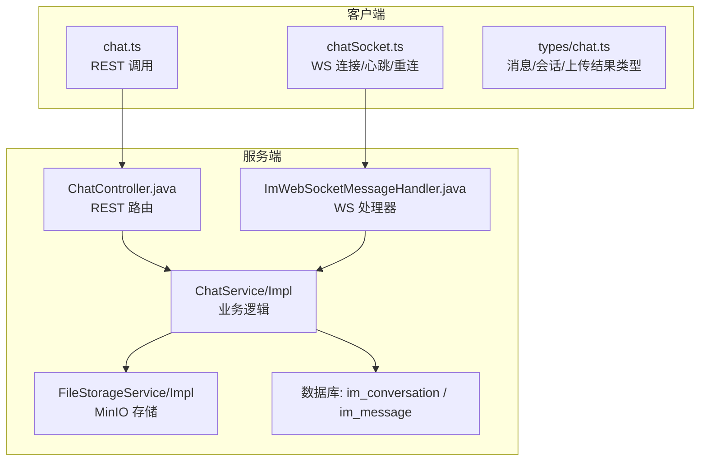
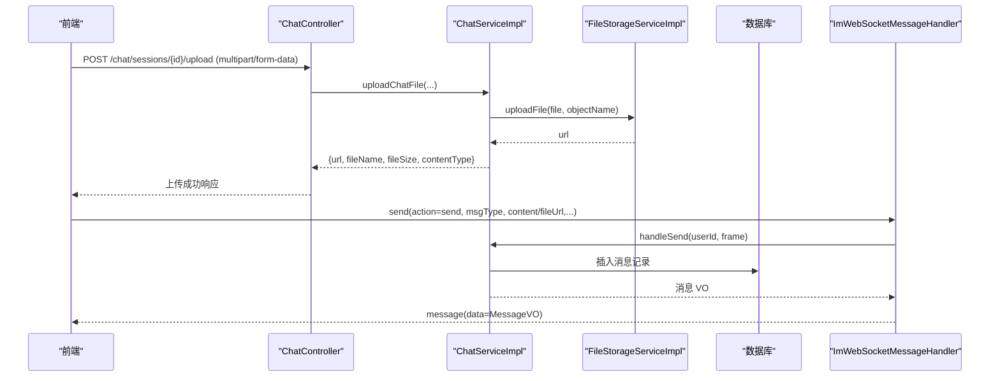
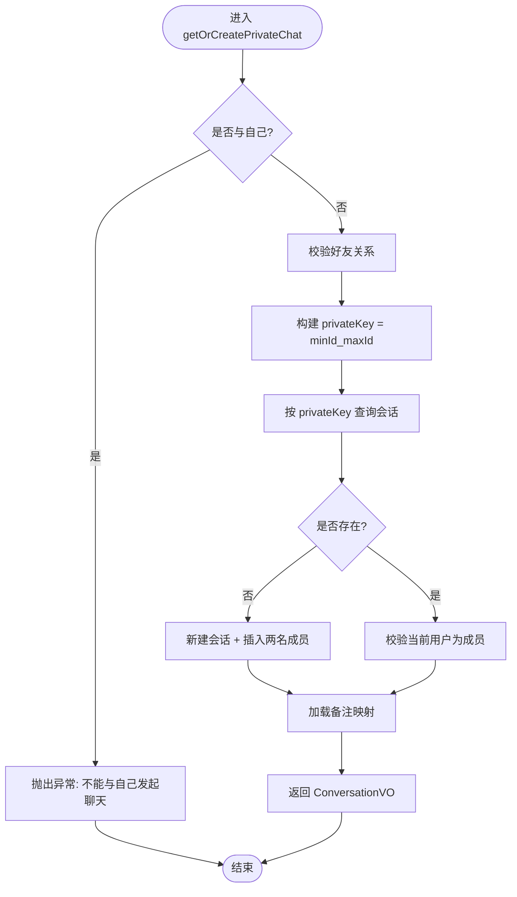
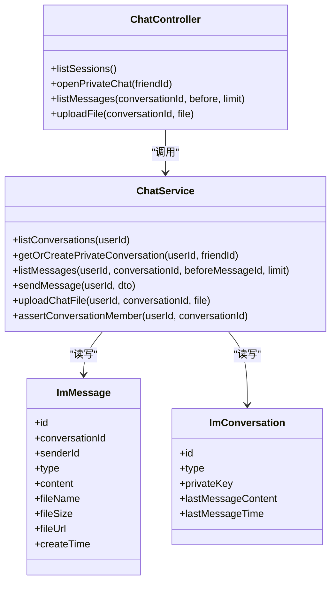
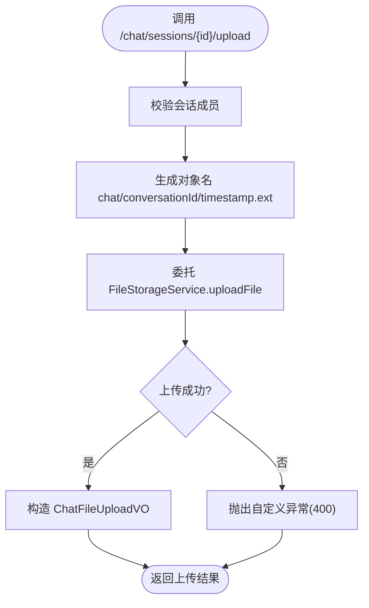
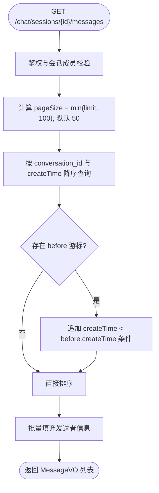
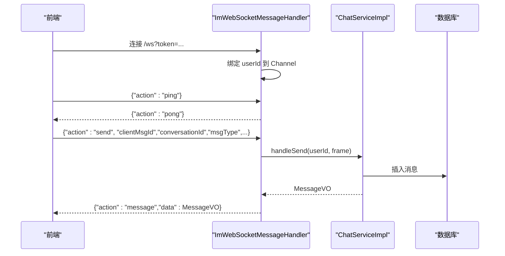
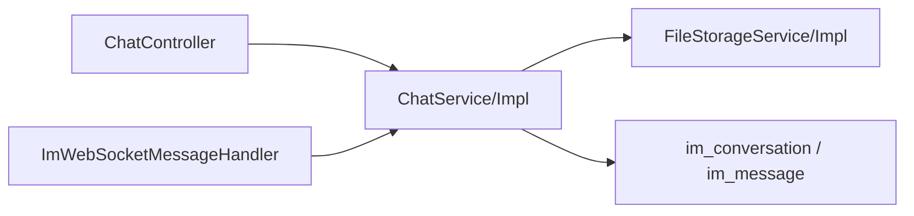

# 聊天接口

<cite>
**本文引用的文件**
- [ChatController.java](file://linkx-server/src/main/java/com/linkx/server/controller/ChatController.java)
- [ChatService.java](file://linkx-server/src/main/java/com/linkx/server/service/ChatService.java)
- [ChatServiceImpl.java](file://linkx-server/src/main/java/com/linkx/server/service/impl/ChatServiceImpl.java)
- [SendMessageDTO.java](file://linkx-server/src/main/java/com/linkx/server/controller/dto/SendMessageDTO.java)
- [ConversationVO.java](file://linkx-server/src/main/java/com/linkx/server/controller/vo/ConversationVO.java)
- [MessageVO.java](file://linkx-server/src/main/java/com/linkx/server/controller/vo/MessageVO.java)
- [ImConversation.java](file://linkx-server/src/main/java/com/linkx/server/entity/ImConversation.java)
- [ImMessage.java](file://linkx-server/src/main/java/com/linkx/server/entity/ImMessage.java)
- [002_add_im_tables.sql](file://linkx-server/migrations/002_add_im_tables.sql)
- [FileStorageService.java](file://linkx-server/src/main/java/com/linkx/server/service/FileStorageService.java)
- [FileStorageServiceImpl.java](file://linkx-server/src/main/java/com/linkx/server/service/impl/FileStorageServiceImpl.java)
- [chat.ts](file://linkx-client/src/api/chat.ts)
- [chat.ts（类型定义）](file://linkx-client/src/types/chat.ts)
- [chatSocket.ts](file://linkx-client/src/utils/chatSocket.ts)
- [ImWebSocketMessageHandler.java](file://linkx-server/src/main/java/com/linkx/server/im/ImWebSocketMessageHandler.java)
</cite>

## 目录
1. [简介](#简介)
2. [项目结构](#项目结构)
3. [核心组件](#核心组件)
4. [架构总览](#架构总览)
5. [详细组件分析](#详细组件分析)
6. [依赖关系分析](#依赖关系分析)
7. [性能与扩展建议](#性能与扩展建议)
8. [故障排查指南](#故障排查指南)
9. [结论](#结论)
10. [附录：REST 接口规范](#附录rest-接口规范)

## 简介
本文件为 LinkX 即时通讯系统的 RESTful API 文档，聚焦会话管理、消息收发、文件传输与历史查询等核心能力。同时说明实时通信（WebSocket）与 REST 的协作模式，并给出前端集成最佳实践。当前后端实现支持的消息类型包括文本、图片、文件；群聊与会话成员模型已具备，但发送接口未开放群聊创建与发送入口，后续可扩展。

## 项目结构
- 服务端提供 REST 接口用于会话列表、单聊会话创建、消息分页拉取、文件上传；通过 WebSocket 通道进行实时消息推送与 ACK。
- 客户端封装了 REST 调用与 WebSocket 连接管理，统一处理心跳、重连与错误回调。

图表来源
- [ChatController.java:22-71](file://linkx-server/src/main/java/com/linkx/server/controller/ChatController.java#L22-L71)
- [ChatServiceImpl.java:38-226](file://linkx-server/src/main/java/com/linkx/server/service/impl/ChatServiceImpl.java#L38-L226)
- [ImWebSocketMessageHandler.java:14-61](file://linkx-server/src/main/java/com/linkx/server/im/ImWebSocketMessageHandler.java#L14-L61)
- [FileStorageServiceImpl.java:27-73](file://linkx-server/src/main/java/com/linkx/server/service/impl/FileStorageServiceImpl.java#L27-L73)
- [002_add_im_tables.sql:6-44](file://linkx-server/migrations/002_add_im_tables.sql#L6-L44)

章节来源
- [ChatController.java:22-71](file://linkx-server/src/main/java/com/linkx/server/controller/ChatController.java#L22-L71)
- [ChatServiceImpl.java:38-226](file://linkx-server/src/main/java/com/linkx/server/service/impl/ChatServiceImpl.java#L38-L226)
- [ImWebSocketMessageHandler.java:14-61](file://linkx-server/src/main/java/com/linkx/server/im/ImWebSocketMessageHandler.java#L14-L61)
- [FileStorageServiceImpl.java:27-73](file://linkx-server/src/main/java/com/linkx/server/service/impl/FileStorageServiceImpl.java#L27-L73)
- [002_add_im_tables.sql:6-44](file://linkx-server/migrations/002_add_im_tables.sql#L6-L44)

## 核心组件
- REST 控制器：暴露会话列表、单聊会话创建、消息分页、文件上传等端点。
- 服务层：会话与消息的业务编排、权限校验、消息预览更新、文件上传委托。
- 数据实体与迁移：会话、成员、消息表结构与索引。
- 文件存储：基于 MinIO 的对象存储，提供上传、删除、预签名 URL 能力。
- 实时通道：WebSocket 握手后按 action 分发，支持 ping/pong、send 与错误帧。

章节来源
- [ChatController.java:22-71](file://linkx-server/src/main/java/com/linkx/server/controller/ChatController.java#L22-L71)
- [ChatService.java:11-24](file://linkx-server/src/main/java/com/linkx/server/service/ChatService.java#L11-L24)
- [ChatServiceImpl.java:38-226](file://linkx-server/src/main/java/com/linkx/server/service/impl/ChatServiceImpl.java#L38-L226)
- [ImConversation.java:20-47](file://linkx-server/src/main/java/com/linkx/server/entity/ImConversation.java#L20-L47)
- [ImMessage.java:20-51](file://linkx-server/src/main/java/com/linkx/server/entity/ImMessage.java#L20-L51)
- [002_add_im_tables.sql:6-44](file://linkx-server/migrations/002_add_im_tables.sql#L6-L44)
- [FileStorageService.java:8-44](file://linkx-server/src/main/java/com/linkx/server/service/FileStorageService.java#L8-L44)
- [FileStorageServiceImpl.java:27-73](file://linkx-server/src/main/java/com/linkx/server/service/impl/FileStorageServiceImpl.java#L27-L73)
- [ImWebSocketMessageHandler.java:14-61](file://linkx-server/src/main/java/com/linkx/server/im/ImWebSocketMessageHandler.java#L14-L61)

## 架构总览
REST 负责“写”与“读”的基础能力，WebSocket 负责“实时推送”和“ACK”。典型流程：
- 文件先通过 REST 上传到对象存储，返回可访问 URL。
- 通过 WebSocket 发送消息体（包含 fileUrl），服务端落库并广播给会话成员。
- 接收方收到 message 帧，必要时向服务端请求 ACK 或拉取历史消息。

图表来源
- [ChatController.java:55-62](file://linkx-server/src/main/java/com/linkx/server/controller/ChatController.java#L55-L62)
- [ChatServiceImpl.java:207-226](file://linkx-server/src/main/java/com/linkx/server/service/impl/ChatServiceImpl.java#L207-L226)
- [FileStorageServiceImpl.java:27-73](file://linkx-server/src/main/java/com/linkx/server/service/impl/FileStorageServiceImpl.java#L27-L73)
- [ImWebSocketMessageHandler.java:28-54](file://linkx-server/src/main/java/com/linkx/server/im/ImWebSocketMessageHandler.java#L28-L54)

## 详细组件分析

### 会话管理
- 会话列表：返回用户参与的单聊会话，按最后消息时间倒序，附带对方昵称、头像、备注与最后消息预览。
- 单聊会话创建：根据双方用户 ID 生成唯一私钥，若不存在则创建会话并写入成员；仅允许好友关系建立或复用已有会话。
- 群聊：数据模型支持群聊类型，但当前 REST 未暴露群聊创建与发送接口。

图表来源
- [ChatServiceImpl.java:92-132](file://linkx-server/src/main/java/com/linkx/server/service/impl/ChatServiceImpl.java#L92-L132)
- [ImConversation.java:25-33](file://linkx-server/src/main/java/com/linkx/server/entity/ImConversation.java#L25-L33)

章节来源
- [ChatController.java:30-42](file://linkx-server/src/main/java/com/linkx/server/controller/ChatController.java#L30-L42)
- [ChatServiceImpl.java:54-89](file://linkx-server/src/main/java/com/linkx/server/service/impl/ChatServiceImpl.java#L54-L89)
- [ChatServiceImpl.java:92-132](file://linkx-server/src/main/java/com/linkx/server/service/impl/ChatServiceImpl.java#L92-L132)
- [ImConversation.java:25-33](file://linkx-server/src/main/java/com/linkx/server/entity/ImConversation.java#L25-L33)
- [002_add_im_tables.sql:6-29](file://linkx-server/migrations/002_add_im_tables.sql#L6-L29)

### 消息收发
- 消息类型：text、image、file。服务端对类型进行归一化与载荷校验。
- 发送流程：校验会话成员与好友关系（单聊），持久化消息，更新会话最后消息预览，返回消息 VO。
- 实时推送：WebSocket 的 send action 触发相同落库与广播流程。

图表来源
- [ChatController.java:22-71](file://linkx-server/src/main/java/com/linkx/server/controller/ChatController.java#L22-L71)
- [ChatService.java:11-24](file://linkx-server/src/main/java/com/linkx/server/service/ChatService.java#L11-L24)
- [ImMessage.java:20-51](file://linkx-server/src/main/java/com/linkx/server/entity/ImMessage.java#L20-L51)
- [ImConversation.java:20-47](file://linkx-server/src/main/java/com/linkx/server/entity/ImConversation.java#L20-L47)

章节来源
- [ChatController.java:44-53](file://linkx-server/src/main/java/com/linkx/server/controller/ChatController.java#L44-L53)
- [ChatServiceImpl.java:170-204](file://linkx-server/src/main/java/com/linkx/server/service/impl/ChatServiceImpl.java#L170-L204)
- [ImWebSocketMessageHandler.java:28-54](file://linkx-server/src/main/java/com/linkx/server/im/ImWebSocketMessageHandler.java#L28-L54)
- [SendMessageDTO.java:8-25](file://linkx-server/src/main/java/com/linkx/server/controller/dto/SendMessageDTO.java#L8-L25)

### 文件传输
- 上传接口：以 multipart/form-data 上传，服务端生成对象名并委托对象存储服务，返回 URL、文件名、大小与类型。
- 存储策略：按日期前缀组织对象路径，限制最大文件大小，失败抛出自定义异常。
- 大文件与断点续传：当前实现为整包上传，未实现分片与断点续传；可在 FileStorageService 层扩展分片上传与合并逻辑。

图表来源
- [ChatController.java:55-62](file://linkx-server/src/main/java/com/linkx/server/controller/ChatController.java#L55-L62)
- [ChatServiceImpl.java:207-226](file://linkx-server/src/main/java/com/linkx/server/service/impl/ChatServiceImpl.java#L207-L226)
- [FileStorageServiceImpl.java:27-73](file://linkx-server/src/main/java/com/linkx/server/service/impl/FileStorageServiceImpl.java#L27-L73)

章节来源
- [FileStorageService.java:8-44](file://linkx-server/src/main/java/com/linkx/server/service/FileStorageService.java#L8-L44)
- [FileStorageServiceImpl.java:27-73](file://linkx-server/src/main/java/com/linkx/server/service/impl/FileStorageServiceImpl.java#L27-L73)

### 历史记录查询
- 分页参数：before（游标）、limit（默认 50，上限 100）。
- 排序与过滤：按会话内消息创建时间降序拉取，再在内存中升序返回；支持可选的 before 时间游标。
- 权限控制：需为会话成员。

图表来源
- [ChatController.java:44-53](file://linkx-server/src/main/java/com/linkx/server/controller/ChatController.java#L44-L53)
- [ChatServiceImpl.java:135-168](file://linkx-server/src/main/java/com/linkx/server/service/impl/ChatServiceImpl.java#L135-L168)

章节来源
- [ChatController.java:44-53](file://linkx-server/src/main/java/com/linkx/server/controller/ChatController.java#L44-L53)
- [ChatServiceImpl.java:135-168](file://linkx-server/src/main/java/com/linkx/server/service/impl/ChatServiceImpl.java#L135-L168)

### 实时通信与 REST 协作
- 认证：WebSocket 连接携带 token 参数，服务端解析并绑定用户上下文。
- 协议：action 字段区分 ping/send/error 等；客户端发送 send 时携带 clientMsgId、msgType、content/fileUrl 等。
- 推送：服务端将消息持久化后，通过 WebSocket 推送 message 帧；客户端收到后可用 clientMsgId 做本地去重与状态同步。

图表来源
- [ImWebSocketMessageHandler.java:28-54](file://linkx-server/src/main/java/com/linkx/server/im/ImWebSocketMessageHandler.java#L28-L54)
- [chatSocket.ts:80-144](file://linkx-client/src/utils/chatSocket.ts#L80-L144)
- [chat.ts（类型定义）:37-54](file://linkx-client/src/types/chat.ts#L37-L54)

章节来源
- [ImWebSocketMessageHandler.java:14-61](file://linkx-server/src/main/java/com/linkx/server/im/ImWebSocketMessageHandler.java#L14-L61)
- [chatSocket.ts:80-144](file://linkx-client/src/utils/chatSocket.ts#L80-L144)
- [chat.ts（类型定义）:37-54](file://linkx-client/src/types/chat.ts#L37-L54)

## 依赖关系分析
- 控制器依赖服务层，服务层依赖 Mapper、实体与外部存储。
- 文件上传链路：ChatController -> ChatService -> FileStorageService -> MinIO。
- 实时链路：WebSocket 处理器 -> ChatService -> 数据库 -> 反向推送。

图表来源
- [ChatController.java:22-71](file://linkx-server/src/main/java/com/linkx/server/controller/ChatController.java#L22-L71)
- [ChatServiceImpl.java:38-226](file://linkx-server/src/main/java/com/linkx/server/service/impl/ChatServiceImpl.java#L38-L226)
- [ImWebSocketMessageHandler.java:14-61](file://linkx-server/src/main/java/com/linkx/server/im/ImWebSocketMessageHandler.java#L14-L61)

章节来源
- [ChatController.java:22-71](file://linkx-server/src/main/java/com/linkx/server/controller/ChatController.java#L22-L71)
- [ChatServiceImpl.java:38-226](file://linkx-server/src/main/java/com/linkx/server/service/impl/ChatServiceImpl.java#L38-L226)
- [ImWebSocketMessageHandler.java:14-61](file://linkx-server/src/main/java/com/linkx/server/im/ImWebSocketMessageHandler.java#L14-L61)

## 性能与扩展建议
- 分页优化：当前使用 before 游标+时间索引，建议在 im_message 上确保 (conversation_id, create_time) 复合索引命中，避免全表扫描。
- 批量填充：消息列表拉取时对发送者信息进行批量查询，减少 N+1 问题。
- 预览更新：发送消息后更新会话 last_message_content/time，利于会话列表快速展示。
- 大文件与断点续传：可在 FileStorageService 增加分片上传、断点续传与合并接口；前端按分片并发上传，服务端维护分片状态与合并任务。
- 限流与防抖：对上传与发送接口增加速率限制，防止滥用。
- 缓存：会话列表与最近消息可引入短时缓存，降低热点读取压力。

[本节为通用建议，不直接分析具体文件]

## 故障排查指南
- 400 无效 ID：传入的 ID 无法解析为数字，检查前端传递的 ID 格式。
- 403 无权访问：非会话成员或好友关系不满足，检查成员表与好友关系表。
- 404 用户/会话不存在：目标用户或会话已被删除或不存在。
- 文件上传失败：检查 MinIO 配置、桶权限与文件大小限制。
- WebSocket 未认证：连接时未携带有效 token 或 token 过期。

章节来源
- [ChatController.java:64-70](file://linkx-server/src/main/java/com/linkx/server/controller/ChatController.java#L64-L70)
- [ChatServiceImpl.java:229-250](file://linkx-server/src/main/java/com/linkx/server/service/impl/ChatServiceImpl.java#L229-L250)
- [FileStorageServiceImpl.java:69-73](file://linkx-server/src/main/java/com/linkx/server/service/impl/FileStorageServiceImpl.java#L69-L73)
- [ImWebSocketMessageHandler.java:28-54](file://linkx-server/src/main/java/com/linkx/server/im/ImWebSocketMessageHandler.java#L28-L54)

## 结论
LinkX 的聊天模块以 REST 为基础能力，结合 WebSocket 实现实时推送与 ACK。当前版本支持文本、图片、文件三类消息与单聊会话管理，具备完善的权限校验与分页机制。后续可在群聊能力、消息类型扩展（语音、红包等）、大文件分片上传与断点续传方面持续演进。

[本节为总结性内容，不直接分析具体文件]

## 附录：REST 接口规范

### 通用约定
- 基础路径：/chat
- 认证：请求头携带 JWT（由拦截器/工具类解析）
- 统一响应：Result<T> 包装，含 code、message、data

### 会话管理
- 获取会话列表
  - 方法：GET
  - 路径：/chat/sessions
  - 鉴权：需要
  - 响应：List<ConversationVO>
- 创建单聊会话
  - 方法：POST
  - 路径：/chat/private/{friendId}
  - 路径参数：friendId（字符串，内部解析为 Long）
  - 鉴权：需要
  - 响应：ConversationVO

章节来源
- [ChatController.java:30-42](file://linkx-server/src/main/java/com/linkx/server/controller/ChatController.java#L30-L42)
- [ConversationVO.java:10-27](file://linkx-server/src/main/java/com/linkx/server/controller/vo/ConversationVO.java#L10-L27)

### 消息相关
- 分页拉取历史消息
  - 方法：GET
  - 路径：/chat/sessions/{conversationId}/messages
  - 查询参数：
    - before：可选，上一条消息 ID（游标）
    - limit：可选，默认 50，最大 100
  - 鉴权：需要
  - 响应：List<MessageVO>
- 发送消息（REST）
  - 方法：POST
  - 路径：/chat/messages（参考服务接口定义）
  - 请求体：SendMessageDTO
  - 鉴权：需要
  - 响应：MessageVO
- 上传聊天文件
  - 方法：POST
  - 路径：/chat/sessions/{conversationId}/upload
  - 表单字段：file（multipart/form-data）
  - 鉴权：需要
  - 响应：ChatFileUploadVO

章节来源
- [ChatController.java:44-62](file://linkx-server/src/main/java/com/linkx/server/controller/ChatController.java#L44-L62)
- [ChatService.java:17-21](file://linkx-server/src/main/java/com/linkx/server/service/ChatService.java#L17-L21)
- [MessageVO.java:10-31](file://linkx-server/src/main/java/com/linkx/server/controller/vo/MessageVO.java#L10-L31)
- [SendMessageDTO.java:8-25](file://linkx-server/src/main/java/com/linkx/server/controller/dto/SendMessageDTO.java#L8-L25)

### 数据结构定义
- ConversationVO
  - id：Long（序列化转为字符串）
  - type：Integer（1 单聊，2 群聊）
  - peerUserId：Long（序列化转为字符串）
  - peerUsername/nickname/avatar/remark：String
  - lastMessage：String
  - lastMessageTime：Long（毫秒时间戳）
- MessageVO
  - id/conversationId/senderId：Long（序列化转为字符串）
  - senderNickname/senderAvatar：String
  - type：'text'|'image'|'file'
  - content：String
  - fileName/fileSize/fileUrl：String/Long/String
  - createTime：Long（毫秒时间戳）
  - isSelf：Boolean
- ChatFileUploadVO
  - url：String
  - fileName/fileSize/contentType：String/Long/String

章节来源
- [ConversationVO.java:10-27](file://linkx-server/src/main/java/com/linkx/server/controller/vo/ConversationVO.java#L10-L27)
- [MessageVO.java:10-31](file://linkx-server/src/main/java/com/linkx/server/controller/vo/MessageVO.java#L10-L31)
- [chat.ts（类型定义）:30-35](file://linkx-client/src/types/chat.ts#L30-L35)

### 数据库表结构（IM 模块）
- im_conversation
  - id：BIGINT（雪花主键）
  - type：TINYINT（1 单聊，2 群聊）
  - private_key：VARCHAR（单聊唯一键）
  - last_message_content：VARCHAR
  - last_message_time：DATETIME
  - create_time/update_time：DATETIME
  - deleted：TINYINT（逻辑删除）
- im_conversation_member
  - id：BIGINT
  - conversation_id/user_id：BIGINT
  - create_time/update_time：DATETIME
  - deleted：TINYINT
- im_message
  - id：BIGINT
  - conversation_id/sender_id：BIGINT
  - type：VARCHAR（text/image/file）
  - content：TEXT
  - file_name/file_size/file_url：VARCHAR/BIGINT/VARCHAR
  - create_time：DATETIME
  - deleted：TINYINT

章节来源
- [002_add_im_tables.sql:6-44](file://linkx-server/migrations/002_add_im_tables.sql#L6-L44)

### 前端集成要点
- REST 调用
  - 会话列表、单聊创建、消息分页、文件上传均已封装于 chat.ts。
  - 上传时使用 FormData，设置 Content-Type 为 multipart/form-data，并适当增大超时。
- WebSocket 连接
  - 连接地址：ws://{host}:{port}/ws?token=...
  - 心跳：每 25s 发送 ping，服务端回 pong。
  - 重连：指数退避，最大间隔 30s。
  - 消息帧：
    - 发送：{action:'send', clientMsgId, conversationId, msgType, content?, fileName?, fileSize?, fileUrl?}
    - 接收：{action:'message'|'ack'|'error', data?:MessageItem, clientMsgId?, code?, message?}
- 类型定义
  - types/chat.ts 定义了会话项、消息项、上传结果与 WS 帧结构，便于前后端一致。

章节来源
- [chat.ts:1-28](file://linkx-client/src/api/chat.ts#L1-28)
- [chat.ts（类型定义）:1-57](file://linkx-client/src/types/chat.ts#L1-L57)
- [chatSocket.ts:80-144](file://linkx-client/src/utils/chatSocket.ts#L80-L144)