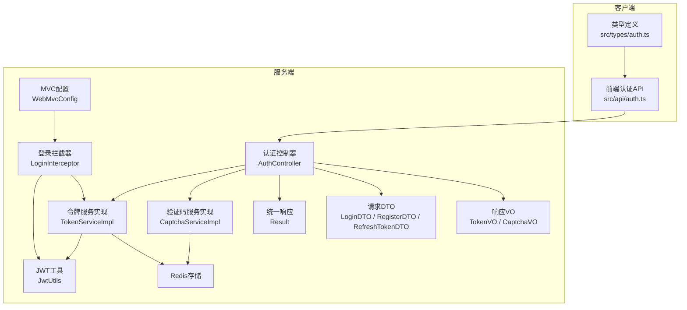
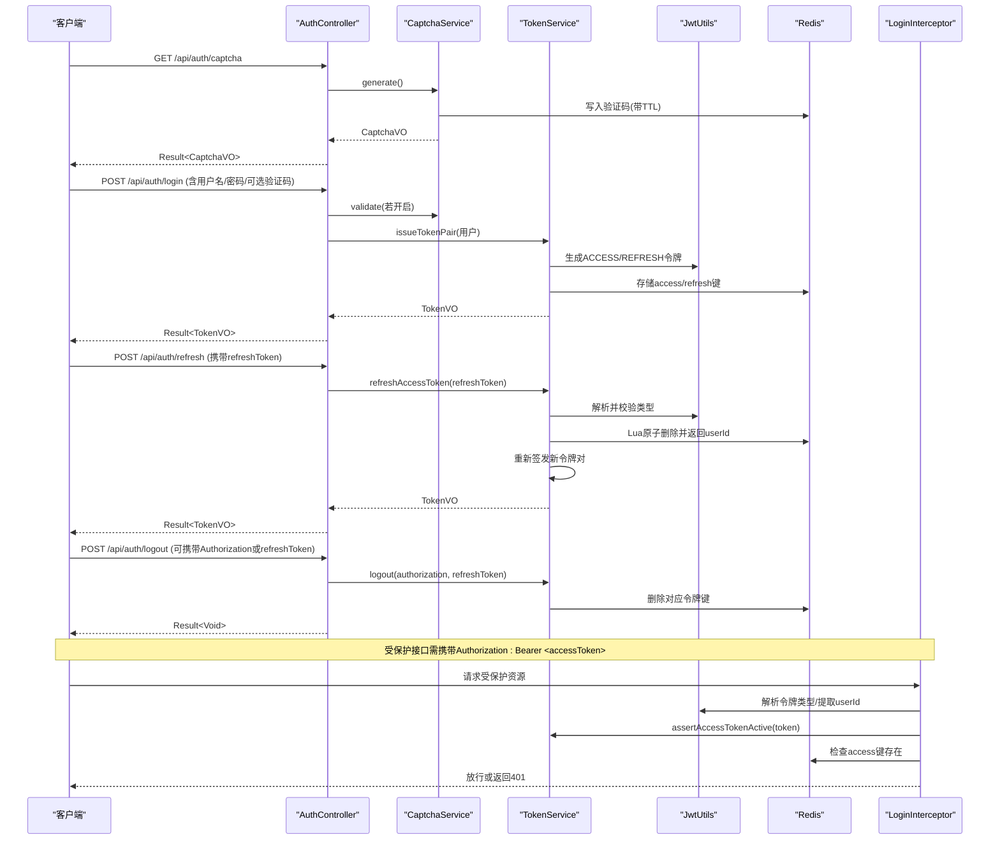
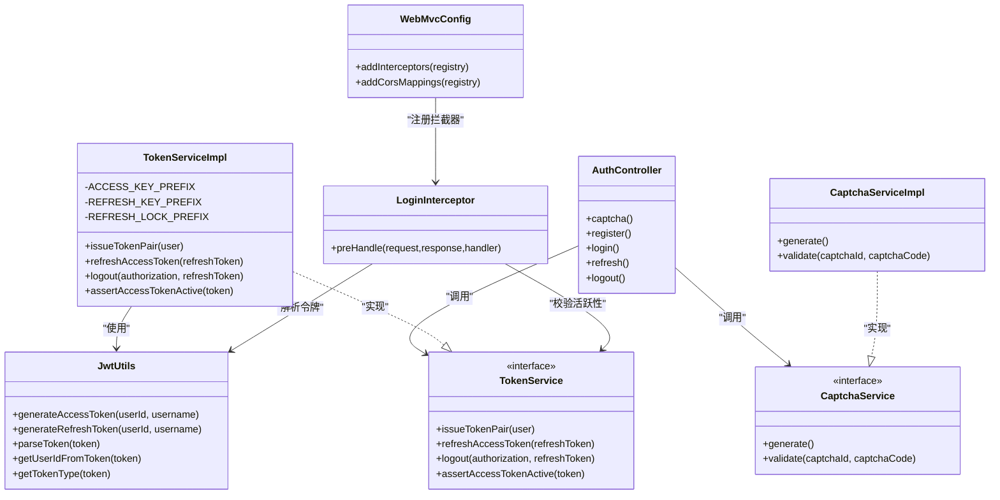

# 认证接口

<cite>
**本文引用的文件**
- [AuthController.java](file://linkx-server/src/main/java/com/linkx/server/controller/AuthController.java)
- [TokenServiceImpl.java](file://linkx-server/src/main/java/com/linkx/server/service/impl/TokenServiceImpl.java)
- [JwtUtils.java](file://linkx-server/src/main/java/com/linkx/server/common/JwtUtils.java)
- [CaptchaServiceImpl.java](file://linkx-server/src/main/java/com/linkx/server/service/impl/CaptchaServiceImpl.java)
- [LoginInterceptor.java](file://linkx-server/src/main/java/com/linkx/server/config/interceptor/LoginInterceptor.java)
- [WebMvcConfig.java](file://linkx-server/src/main/java/com/linkx/server/config/WebMvcConfig.java)
- [Result.java](file://linkx-server/src/main/java/com/linkx/server/common/Result.java)
- [RegisterDTO.java](file://linkx-server/src/main/java/com/linkx/server/controller/dto/RegisterDTO.java)
- [LoginDTO.java](file://linkx-server/src/main/java/com/linkx/server/controller/dto/LoginDTO.java)
- [RefreshTokenDTO.java](file://linkx-server/src/main/java/com/linkx/server/controller/dto/RefreshTokenDTO.java)
- [CaptchaVO.java](file://linkx-server/src/main/java/com/linkx/server/controller/vo/CaptchaVO.java)
- [TokenVO.java](file://linkx-server/src/main/java/com/linkx/server/controller/vo/TokenVO.java)
- [auth.ts](file://linkx-client/src/api/auth.ts)
- [auth.ts（类型定义）](file://linkx-client/src/types/auth.ts)
- [application.yml](file://linkx-server/src/main/resources/application.yml)
</cite>

## 目录
1. [简介](#简介)
2. [项目结构](#项目结构)
3. [核心组件](#核心组件)
4. [架构总览](#架构总览)
5. [详细接口说明](#详细接口说明)
6. [依赖关系分析](#依赖关系分析)
7. [性能与限流](#性能与限流)
8. [安全与防护](#安全与防护)
9. [故障排查指南](#故障排查指南)
10. [结论](#结论)
11. [附录：前端集成最佳实践](#附录前端集成最佳实践)

## 简介
本文件为 LinkX 认证系统 RESTful API 的权威文档，覆盖用户注册、登录、登出、令牌刷新和验证码获取等核心能力。文档包含每个接口的 HTTP 方法、URL 路径、请求参数、响应格式、错误码说明，并深入解释 JWT 令牌管理机制、验证码验证流程、限流策略与安全防护措施，同时提供完整的前端集成建议与示例。

## 项目结构
后端采用 Spring MVC + MyBatis-Flex + Redis 的架构，认证相关代码主要分布在 controller、service、common、config 等包中；前端通过 TypeScript 封装了认证 API 调用。

图表来源
- [AuthController.java:1-84](file://linkx-server/src/main/java/com/linkx/server/controller/AuthController.java#L1-L84)
- [TokenServiceImpl.java:1-204](file://linkx-server/src/main/java/com/linkx/server/service/impl/TokenServiceImpl.java#L1-L204)
- [JwtUtils.java:1-76](file://linkx-server/src/main/java/com/linkx/server/common/JwtUtils.java#L1-L76)
- [CaptchaServiceImpl.java:1-122](file://linkx-server/src/main/java/com/linkx/server/service/impl/CaptchaServiceImpl.java#L1-L122)
- [LoginInterceptor.java:1-53](file://linkx-server/src/main/java/com/linkx/server/config/interceptor/LoginInterceptor.java#L1-L53)
- [WebMvcConfig.java:1-47](file://linkx-server/src/main/java/com/linkx/server/config/WebMvcConfig.java#L1-L47)
- [Result.java:1-95](file://linkx-server/src/main/java/com/linkx/server/common/Result.java#L1-L95)
- [auth.ts:1-25](file://linkx-client/src/api/auth.ts#L1-L25)
- [auth.ts（类型定义）:1-47](file://linkx-client/src/types/auth.ts#L1-L47)

章节来源
- [AuthController.java:1-84](file://linkx-server/src/main/java/com/linkx/server/controller/AuthController.java#L1-L84)
- [WebMvcConfig.java:1-47](file://linkx-server/src/main/java/com/linkx/server/config/WebMvcConfig.java#L1-L47)

## 核心组件
- 认证控制器 AuthController：暴露 /auth 下的注册、登录、登出、刷新、验证码接口，负责参数校验、验证码开关控制、限流调用与结果封装。
- 令牌服务 TokenServiceImpl：实现令牌的签发、刷新、注销与有效性校验；使用 Redis 维护访问令牌与刷新令牌的状态，并通过 Lua 脚本保证原子性操作。
- JWT 工具 JwtUtils：生成/解析 JWT，支持 ACCESS 与 REFRESH 两种令牌类型，从 claims 中提取 userId、username、type、jti 等字段。
- 验证码服务 CaptchaServiceImpl：生成图形验证码（Base64），在 Redis 中缓存并设置过期时间；使用 Lua 脚本进行一次性验证。
- 登录拦截器 LoginInterceptor：对需要鉴权的请求进行 Authorization 头解析、令牌类型检查、活跃性校验，并将 userId 注入到请求上下文。
- MVC 配置 WebMvcConfig：注册全局登录拦截器，排除公开接口路径，并配置 CORS。
- 统一响应 Result：前后端约定的标准响应体结构 { code, message, data }。

章节来源
- [AuthController.java:1-84](file://linkx-server/src/main/java/com/linkx/server/controller/AuthController.java#L1-L84)
- [TokenServiceImpl.java:1-204](file://linkx-server/src/main/java/com/linkx/server/service/impl/TokenServiceImpl.java#L1-L204)
- [JwtUtils.java:1-76](file://linkx-server/src/main/java/com/linkx/server/common/JwtUtils.java#L1-L76)
- [CaptchaServiceImpl.java:1-122](file://linkx-server/src/main/java/com/linkx/server/service/impl/CaptchaServiceImpl.java#L1-L122)
- [LoginInterceptor.java:1-53](file://linkx-server/src/main/java/com/linkx/server/config/interceptor/LoginInterceptor.java#L1-L53)
- [WebMvcConfig.java:1-47](file://linkx-server/src/main/java/com/linkx/server/config/WebMvcConfig.java#L1-L47)
- [Result.java:1-95](file://linkx-server/src/main/java/com/linkx/server/common/Result.java#L1-L95)

## 架构总览
认证流程的关键交互如下：

图表来源
- [AuthController.java:1-84](file://linkx-server/src/main/java/com/linkx/server/controller/AuthController.java#L1-L84)
- [TokenServiceImpl.java:1-204](file://linkx-server/src/main/java/com/linkx/server/service/impl/TokenServiceImpl.java#L1-L204)
- [JwtUtils.java:1-76](file://linkx-server/src/main/java/com/linkx/server/common/JwtUtils.java#L1-L76)
- [CaptchaServiceImpl.java:1-122](file://linkx-server/src/main/java/com/linkx/server/service/impl/CaptchaServiceImpl.java#L1-L122)
- [LoginInterceptor.java:1-53](file://linkx-server/src/main/java/com/linkx/server/config/interceptor/LoginInterceptor.java#L1-L53)

## 详细接口说明

### 通用约定
- 基础路径：/api（由 application.yml 的 context-path 配置）
- 统一响应体：{ code, message, data }
  - code：业务状态码（200成功，4xx客户端错误，5xx服务端错误）
  - message：提示信息
  - data：具体数据载荷（失败时通常为 null）

章节来源
- [application.yml:1-54](file://linkx-server/src/main/resources/application.yml#L1-L54)
- [Result.java:1-95](file://linkx-server/src/main/java/com/linkx/server/common/Result.java#L1-L95)

### 获取验证码
- 方法：GET
- 路径：/api/auth/captcha
- 请求参数：无
- 响应体 data：CaptchaVO
  - captchaId：字符串，用于后续提交验证
  - imageBase64：字符串，PNG图片的 Base64 数据（可直接作为 img src）
  - expireSeconds：秒数，表示验证码有效期
- 错误码：
  - 200：成功
  - 500：验证码生成失败（内部异常）

请求示例
- 请求：GET /api/auth/captcha
- 响应：
  - code: 200
  - message: "success"
  - data: { "captchaId": "...", "imageBase64": "data:image/png;base64,...", "expireSeconds": 300 }

章节来源
- [AuthController.java:36-39](file://linkx-server/src/main/java/com/linkx/server/controller/AuthController.java#L36-L39)
- [CaptchaServiceImpl.java:46-57](file://linkx-server/src/main/java/com/linkx/server/service/impl/CaptchaServiceImpl.java#L46-L57)
- [CaptchaVO.java:1-13](file://linkx-server/src/main/java/com/linkx/server/controller/vo/CaptchaVO.java#L1-L13)

### 用户注册
- 方法：POST
- 路径：/api/auth/register
- 请求体：RegisterDTO
  - username：必填，4-32位，仅字母数字下划线
  - password：必填，8-64位，必须包含字母和数字
  - nickname：必填，1-64位
  - captchaId：可选，当后台开启验证码时需提供
  - captchaCode：可选，当后台开启验证码时需提供
- 行为：
  - 若 linkx.auth.captcha-enabled=true，则强制校验验证码
  - 成功后返回空 data
- 错误码：
  - 200：注册成功
  - 400：参数校验失败或验证码错误/过期
  - 401：未登录或登录已过期（若开启了全局登录拦截且该接口被误加入白名单外）
  - 500：服务器内部错误

请求示例
- 请求：
  - Content-Type: application/json
  - body: { "username":"test_user","password":"Pass1234","nickname":"测试用户","captchaId":"...","captchaCode":"ABCD" }
- 响应：
  - code: 200
  - message: "success"
  - data: null

章节来源
- [AuthController.java:41-46](file://linkx-server/src/main/java/com/linkx/server/controller/AuthController.java#L41-L46)
- [RegisterDTO.java:1-28](file://linkx-server/src/main/java/com/linkx/server/controller/dto/RegisterDTO.java#L1-L28)
- [CaptchaServiceImpl.java:59-81](file://linkx-server/src/main/java/com/linkx/server/service/impl/CaptchaServiceImpl.java#L59-L81)

### 用户登录
- 方法：POST
- 路径：/api/auth/login
- 请求体：LoginDTO
  - username：必填，4-32位，仅字母数字下划线
  - password：必填，8-64位
  - captchaId：可选，当后台开启验证码时需提供
  - captchaCode：可选，当后台开启验证码时需提供
- 响应体 data：TokenVO
  - accessToken：短期访问令牌，后续请求需在 Authorization 头携带
  - refreshToken：长期刷新令牌，用于刷新 access token
  - expireTime：毫秒级时间戳，表示 access token 过期时间
  - user：当前用户基本信息对象
- 错误码：
  - 200：登录成功
  - 400：参数校验失败或验证码错误/过期
  - 401：用户名/密码错误或账号不可用
  - 429：刷新过于频繁（刷新接口触发）
  - 500：服务器内部错误

请求示例
- 请求：
  - Content-Type: application/json
  - body: { "username":"test_user","password":"Pass1234" }
- 响应：
  - code: 200
  - message: "success"
  - data: { "accessToken":"...","refreshToken":"...","expireTime":1710000000000,"user":{ ... } }

章节来源
- [AuthController.java:48-53](file://linkx-server/src/main/java/com/linkx/server/controller/AuthController.java#L48-L53)
- [LoginDTO.java:1-23](file://linkx-server/src/main/java/com/linkx/server/controller/dto/LoginDTO.java#L1-L23)
- [TokenServiceImpl.java:47-64](file://linkx-server/src/main/java/com/linkx/server/service/impl/TokenServiceImpl.java#L47-L64)
- [TokenVO.java:1-31](file://linkx-server/src/main/java/com/linkx/server/controller/vo/TokenVO.java#L1-L31)

### 刷新令牌
- 方法：POST
- 路径：/api/auth/refresh
- 请求体：RefreshTokenDTO
  - refreshToken：必填，有效的刷新令牌
- 响应体 data：TokenVO（同登录）
- 错误码：
  - 200：刷新成功
  - 401：refreshToken 无效/已过期/非刷新类型/账号不可用
  - 429：Token 刷新过于频繁（分布式锁保护）
  - 500：服务器内部错误

请求示例
- 请求：
  - Content-Type: application/json
  - body: { "refreshToken":"..." }
- 响应：
  - code: 200
  - message: "success"
  - data: { "accessToken":"...","refreshToken":"...","expireTime":..., "user":{ ... } }

章节来源
- [AuthController.java:55-59](file://linkx-server/src/main/java/com/linkx/server/controller/AuthController.java#L55-L59)
- [RefreshTokenDTO.java:1-12](file://linkx-server/src/main/java/com/linkx/server/controller/dto/RefreshTokenDTO.java#L1-L12)
- [TokenServiceImpl.java:66-117](file://linkx-server/src/main/java/com/linkx/server/service/impl/TokenServiceImpl.java#L66-L117)

### 用户登出
- 方法：POST
- 路径：/api/auth/logout
- 请求体：LogoutDTO（可选）
  - refreshToken：可选，若提供将主动失效对应的刷新令牌
- 请求头：Authorization（可选）
  - 若提供，将尝试失效对应的访问令牌（支持 Bearer 前缀）
- 响应体 data：null
- 错误码：
  - 200：登出成功
  - 401：未登录或登录已过期（若全局拦截器生效）
  - 500：服务器内部错误

请求示例
- 请求：
  - Authorization: Bearer <accessToken>
  - Content-Type: application/json
  - body: { "refreshToken":"..." }
- 响应：
  - code: 200
  - message: "success"
  - data: null

章节来源
- [AuthController.java:61-68](file://linkx-server/src/main/java/com/linkx/server/controller/AuthController.java#L61-L68)
- [TokenServiceImpl.java:119-123](file://linkx-server/src/main/java/com/linkx/server/service/impl/TokenServiceImpl.java#L119-L123)

### 受保护接口鉴权流程
- 所有非 /auth/* 与 /error 的请求均需携带 Authorization: Bearer <accessToken>
- 拦截器会：
  - 解析并校验令牌类型（拒绝 REFRESH 类型）
  - 校验 access token 是否仍在 Redis 中存在（未登出、未过期）
  - 将 userId 注入到 request 属性供后续处理使用
- 失败返回 401 并提示“未登录或登录已过期”、“无效的访问令牌”、“登录已过期，请重新登录”

章节来源
- [LoginInterceptor.java:21-51](file://linkx-server/src/main/java/com/linkx/server/config/interceptor/LoginInterceptor.java#L21-L51)
- [WebMvcConfig.java:18-30](file://linkx-server/src/main/java/com/linkx/server/config/WebMvcConfig.java#L18-L30)

## 依赖关系分析
- 控制器层依赖服务层：AuthController 依赖 SysUserService、TokenService、CaptchaService、RateLimitService 与配置项。
- 令牌服务依赖 JWT 工具与 Redis：TokenServiceImpl 使用 JwtUtils 生成/解析令牌，使用 Redis 存储与校验令牌状态。
- 验证码服务依赖 Redis：CaptchaServiceImpl 使用 Redis 缓存验证码并执行原子性验证。
- 拦截器依赖 JWT 与令牌服务：LoginInterceptor 使用 JwtUtils 解析令牌，使用 TokenService 校验活跃性。
- MVC 配置注册拦截器并排除公开接口路径。

图表来源
- [AuthController.java:1-84](file://linkx-server/src/main/java/com/linkx/server/controller/AuthController.java#L1-L84)
- [TokenServiceImpl.java:1-204](file://linkx-server/src/main/java/com/linkx/server/service/impl/TokenServiceImpl.java#L1-L204)
- [JwtUtils.java:1-76](file://linkx-server/src/main/java/com/linkx/server/common/JwtUtils.java#L1-L76)
- [CaptchaServiceImpl.java:1-122](file://linkx-server/src/main/java/com/linkx/server/service/impl/CaptchaServiceImpl.java#L1-L122)
- [LoginInterceptor.java:1-53](file://linkx-server/src/main/java/com/linkx/server/config/interceptor/LoginInterceptor.java#L1-L53)
- [WebMvcConfig.java:1-47](file://linkx-server/src/main/java/com/linkx/server/config/WebMvcConfig.java#L1-L47)

## 性能与限流
- 刷新令牌防并发：使用 Redis 分布式锁防止同一 refreshToken 并发刷新导致重复发放新令牌。
- 验证码原子验证：使用 Lua 脚本确保“读取+校验+删除”的原子性，避免竞态条件。
- 刷新接口限流：针对 IP 维度限制每分钟最多 30 次刷新（可通过 RateLimitService 配置）。
- 令牌存储：Redis 中按 jti 作为 key 存储 userId，便于快速判断令牌有效性与登出失效。

章节来源
- [TokenServiceImpl.java:88-117](file://linkx-server/src/main/java/com/linkx/server/service/impl/TokenServiceImpl.java#L88-L117)
- [CaptchaServiceImpl.java:31-81](file://linkx-server/src/main/java/com/linkx/server/service/impl/CaptchaServiceImpl.java#L31-L81)
- [AuthController.java:55-59](file://linkx-server/src/main/java/com/linkx/server/controller/AuthController.java#L55-L59)

## 安全与防护
- 令牌类型区分：ACCESS 与 REFRESH 类型在 claims 中明确标识，拦截器拒绝 REFRESH 类型用于访问受保护资源。
- 访问令牌活跃性：每次访问受保护接口均检查 Redis 中是否存在对应 access 键，确保登出后即刻失效。
- 验证码开关：通过配置项 linkx.auth.captcha-enabled 控制是否启用验证码校验。
- CORS 配置：允许指定域名或默认本地开发地址，支持预检请求 OPTIONS。
- HTTPS 要求：可通过配置项 require-https 控制是否强制 HTTPS（结合网关或反向代理实现）。

章节来源
- [JwtUtils.java:39-74](file://linkx-server/src/main/java/com/linkx/server/common/JwtUtils.java#L39-L74)
- [LoginInterceptor.java:36-51](file://linkx-server/src/main/java/com/linkx/server/config/interceptor/LoginInterceptor.java#L36-L51)
- [TokenServiceImpl.java:125-136](file://linkx-server/src/main/java/com/linkx/server/service/impl/TokenServiceImpl.java#L125-L136)
- [application.yml:29-45](file://linkx-server/src/main/resources/application.yml#L29-L45)
- [WebMvcConfig.java:32-45](file://linkx-server/src/main/java/com/linkx/server/config/WebMvcConfig.java#L32-L45)

## 故障排查指南
- 401 未登录或登录已过期：
  - 检查 Authorization 头是否正确携带 Bearer 前缀与有效 accessToken
  - 确认 Redis 中对应 access 键未被删除（可能已被登出或过期）
- 401 无效的访问令牌：
  - 检查是否为 REFRESH 类型令牌被用于受保护接口
  - 检查 JWT secret 配置是否一致
- 400 验证码错误/过期：
  - 确认 captchaId 与 captchaCode 匹配且未过期
  - 注意验证码为一次性使用，验证后会被删除
- 429 刷新过于频繁：
  - 降低刷新频率，等待锁释放后再试
- 500 服务器内部错误：
  - 查看服务端日志定位具体异常堆栈

章节来源
- [LoginInterceptor.java:27-51](file://linkx-server/src/main/java/com/linkx/server/config/interceptor/LoginInterceptor.java#L27-L51)
- [CaptchaServiceImpl.java:59-81](file://linkx-server/src/main/java/com/linkx/server/service/impl/CaptchaServiceImpl.java#L59-L81)
- [TokenServiceImpl.java:66-117](file://linkx-server/src/main/java/com/linkx/server/service/impl/TokenServiceImpl.java#L66-L117)

## 结论
LinkX 认证系统通过清晰的接口设计、严格的令牌管理与验证码机制，提供了安全可靠的认证能力。配合 Redis 的原子操作与分布式锁，系统在并发与安全性方面具备良好保障。前端应遵循最佳实践进行令牌存储、自动刷新与错误处理，以获得稳定流畅的用户体验。

## 附录：前端集成最佳实践
- 令牌存储
  - 将 accessToken 与 refreshToken 保存在持久化存储（如 localStorage 或内存变量），并在应用启动时恢复
  - 仅在 HTTPS 环境下传输敏感信息
- 自动刷新
  - 监听 401 响应，优先尝试使用 refreshToken 调用 /auth/refresh 获取新的 accessToken
  - 刷新失败则引导用户重新登录
- 错误处理
  - 对 400 错误提示用户修正输入或重新获取验证码
  - 对 429 错误提示稍后重试
  - 对 500 错误记录日志并提示网络或服务异常
- 请求封装
  - 在请求拦截器中自动附加 Authorization: Bearer <accessToken>
  - 在响应拦截器中统一处理 Result.code 与 message，提升用户体验

章节来源
- [auth.ts:1-25](file://linkx-client/src/api/auth.ts#L1-L25)
- [auth.ts（类型定义）:1-47](file://linkx-client/src/types/auth.ts#L1-L47)