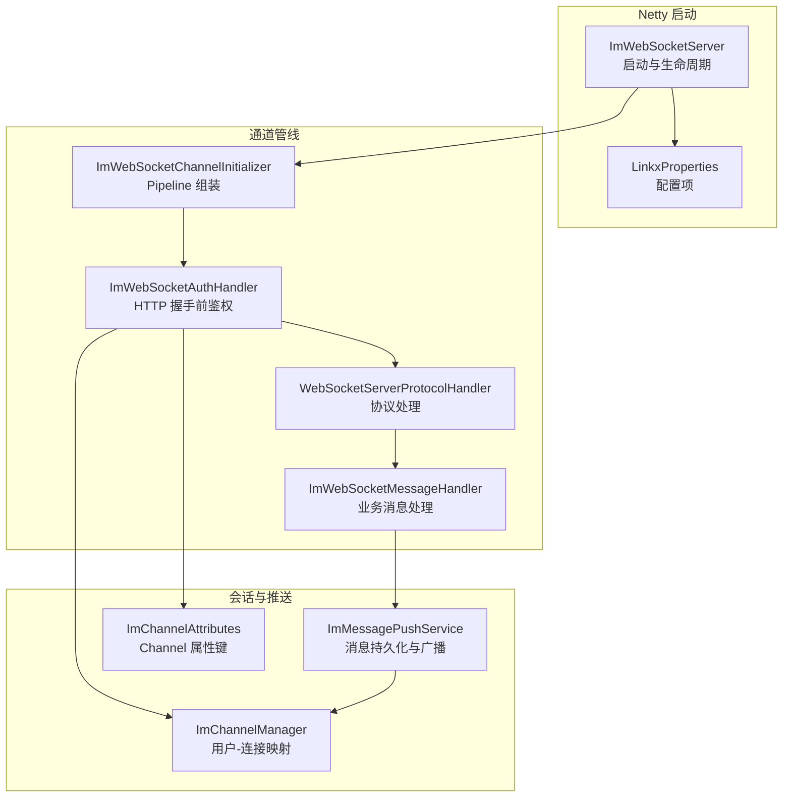
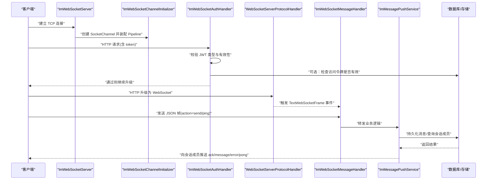
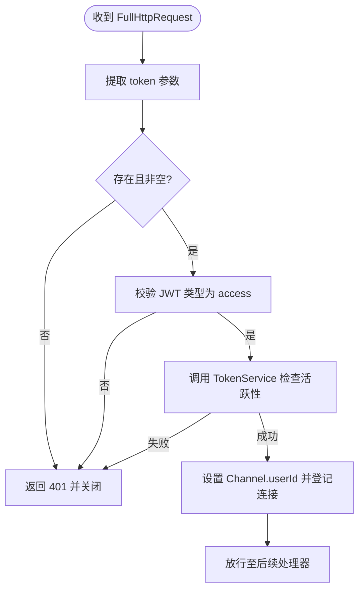
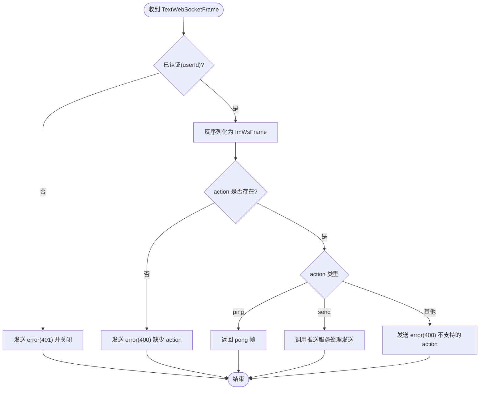
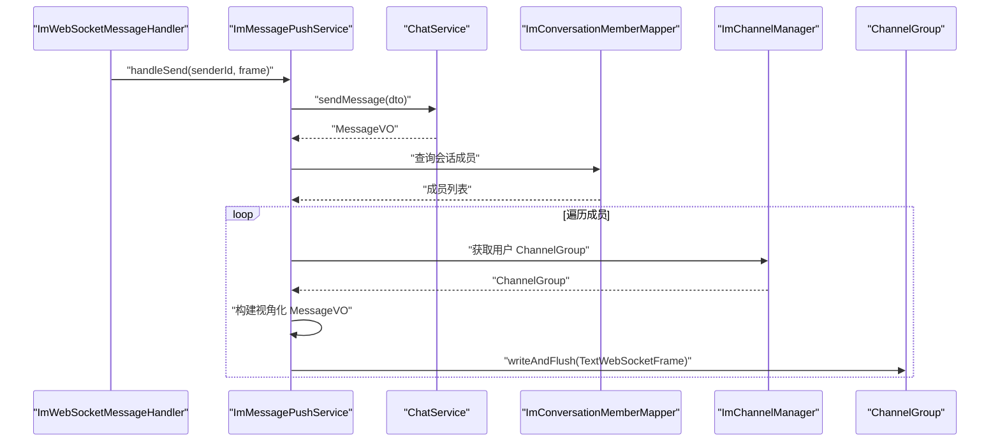
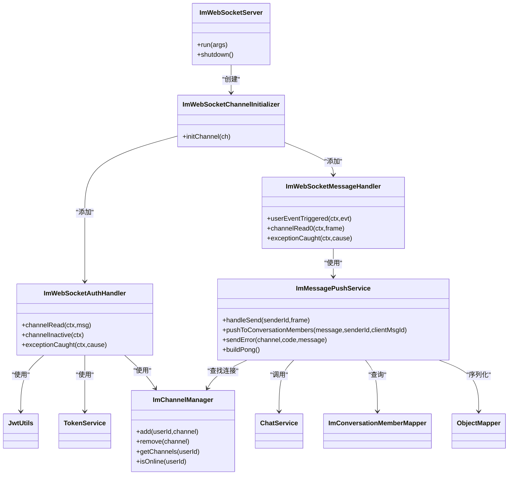

# WebSocket 实时通信

<cite>
**本文引用的文件**   
- [ImWebSocketServer.java](file://linkx-server/src/main/java/com/linkx/server/im/ImWebSocketServer.java)
- [ImWebSocketChannelInitializer.java](file://linkx-server/src/main/java/com/linkx/server/im/ImWebSocketChannelInitializer.java)
- [ImWebSocketAuthHandler.java](file://linkx-server/src/main/java/com/linkx/server/im/ImWebSocketAuthHandler.java)
- [ImWebSocketMessageHandler.java](file://linkx-server/src/main/java/com/linkx/server/im/ImWebSocketMessageHandler.java)
- [ImChannelManager.java](file://linkx-server/src/main/java/com/linkx/server/im/ImChannelManager.java)
- [ImMessagePushService.java](file://linkx-server/src/main/java/com/linkx/server/im/ImMessagePushService.java)
- [ImWsFrame.java](file://linkx-server/src/main/java/com/linkx/server/im/ImWsFrame.java)
- [ImChannelAttributes.java](file://linkx-server/src/main/java/com/linkx/server/im/ImChannelAttributes.java)
- [JwtUtils.java](file://linkx-server/src/main/java/com/linkx/server/common/JwtUtils.java)
- [TokenType.java](file://linkx-server/src/main/java/com/linkx/server/common/TokenType.java)
- [LinkxProperties.java](file://linkx-server/src/main/java/com/linkx/server/config/LinkxProperties.java)
- [TokenService.java](file://linkx-server/src/main/java/com/linkx/server/service/TokenService.java)
- [SendMessageDTO.java](file://linkx-server/src/main/java/com/linkx/server/controller/dto/SendMessageDTO.java)
- [MessageVO.java](file://linkx-server/src/main/java/com/linkx/server/controller/vo/MessageVO.java)
- [ImConversationMemberMapper.java](file://linkx-server/src/main/java/com/linkx/server/mapper/ImConversationMemberMapper.java)
- [ChatService.java](file://linkx-server/src/main/java/com/linkx/server/service/ChatService.java)
</cite>

## 目录
1. [简介](#简介)
2. [项目结构](#项目结构)
3. [核心组件](#核心组件)
4. [架构总览](#架构总览)
5. [详细组件分析](#详细组件分析)
6. [依赖关系分析](#依赖关系分析)
7. [性能与并发优化](#性能与并发优化)
8. [故障排查指南](#故障排查指南)
9. [结论](#结论)
10. [附录：协议与扩展](#附录协议与扩展)

## 简介
本技术文档围绕 LinkX 的基于 Netty 的高性能 WebSocket 实时通信子系统，系统阐述连接管理、消息路由与会话维护机制；深入解析 ImWebSocketMessageHandler 的工作流程、消息协议设计与二进制帧处理策略；并给出连接认证、心跳检测、断线重连与负载均衡的实现建议。同时覆盖高并发场景下的连接数优化、内存管理、消息队列集成与集群部署方案，为开发者提供完整的 Netty 应用开发指南与最佳实践。

## 项目结构
IM 子系统位于 linkx-server 模块的 im 包中，采用“启动器 + 通道初始化器 + 鉴权处理器 + 消息处理器 + 推送服务 + 连接管理器”的分层组织方式，职责清晰、耦合度低。

图示来源
- [ImWebSocketServer.java:1-82](file://linkx-server/src/main/java/com/linkx/server/im/ImWebSocketServer.java#L1-L82)
- [ImWebSocketChannelInitializer.java:1-38](file://linkx-server/src/main/java/com/linkx/server/im/ImWebSocketChannelInitializer.java#L1-L38)
- [ImWebSocketAuthHandler.java:1-81](file://linkx-server/src/main/java/com/linkx/server/im/ImWebSocketAuthHandler.java#L1-L81)
- [ImWebSocketMessageHandler.java:1-62](file://linkx-server/src/main/java/com/linkx/server/im/ImWebSocketMessageHandler.java#L1-L62)
- [ImChannelManager.java:1-41](file://linkx-server/src/main/java/com/linkx/server/im/ImChannelManager.java#L1-L41)
- [ImMessagePushService.java:1-136](file://linkx-server/src/main/java/com/linkx/server/im/ImMessagePushService.java#L1-L136)
- [ImChannelAttributes.java:1-12](file://linkx-server/src/main/java/com/linkx/server/im/ImChannelAttributes.java#L1-L12)
- [LinkxProperties.java:1-65](file://linkx-server/src/main/java/com/linkx/server/config/LinkxProperties.java#L1-L65)

章节来源
- [ImWebSocketServer.java:1-82](file://linkx-server/src/main/java/com/linkx/server/im/ImWebSocketServer.java#L1-L82)
- [ImWebSocketChannelInitializer.java:1-38](file://linkx-server/src/main/java/com/linkx/server/im/ImWebSocketChannelInitializer.java#L1-L38)
- [LinkxProperties.java:1-65](file://linkx-server/src/main/java/com/linkx/server/config/LinkxProperties.java#L1-L65)

## 核心组件
- 服务器启动器：负责创建 Boss/Worker 线程组、绑定端口、注册 ChannelInitializer，并在应用关闭时优雅停机。
- 通道初始化器：按顺序装配 HTTP 编解码、分块写入、请求聚合、鉴权、WebSocket 协议处理与业务消息处理器。
- 鉴权处理器：在 HTTP 升级前从查询参数提取 token，校验类型与有效性，将 userId 写入 Channel 属性，并登记到连接管理器。
- 消息处理器：仅处理文本帧，校验认证状态，解析统一帧对象，根据 action 分发到不同逻辑（如 ping/pong、发送消息）。
- 连接管理器：维护用户到 ChannelGroup 的映射，支持在线判断、批量写等。
- 推送服务：封装消息持久化、成员列表查询、视角转换、错误帧与心跳帧构造、序列化与异常兜底。
- 协议模型：统一的 JSON 帧对象，包含 action、数据体及通用字段。
- 配置与工具：JWT 工具类、令牌类型枚举、应用配置项（端口、路径、心跳间隔等）。

章节来源
- [ImWebSocketServer.java:1-82](file://linkx-server/src/main/java/com/linkx/server/im/ImWebSocketServer.java#L1-L82)
- [ImWebSocketChannelInitializer.java:1-38](file://linkx-server/src/main/java/com/linkx/server/im/ImWebSocketChannelInitializer.java#L1-L38)
- [ImWebSocketAuthHandler.java:1-81](file://linkx-server/src/main/java/com/linkx/server/im/ImWebSocketAuthHandler.java#L1-L81)
- [ImWebSocketMessageHandler.java:1-62](file://linkx-server/src/main/java/com/linkx/server/im/ImWebSocketMessageHandler.java#L1-L62)
- [ImChannelManager.java:1-41](file://linkx-server/src/main/java/com/linkx/server/im/ImChannelManager.java#L1-L41)
- [ImMessagePushService.java:1-136](file://linkx-server/src/main/java/com/linkx/server/im/ImMessagePushService.java#L1-L136)
- [ImWsFrame.java:1-20](file://linkx-server/src/main/java/com/linkx/server/im/ImWsFrame.java#L1-L20)
- [JwtUtils.java:1-76](file://linkx-server/src/main/java/com/linkx/server/common/JwtUtils.java#L1-L76)
- [TokenType.java:1-29](file://linkx-server/src/main/java/com/linkx/server/common/TokenType.java#L1-L29)
- [LinkxProperties.java:1-65](file://linkx-server/src/main/java/com/linkx/server/config/LinkxProperties.java#L1-L65)

## 架构总览
下图展示了从客户端连接到消息投递的端到端调用链，涵盖鉴权、协议升级、消息解析、持久化与广播。

图示来源
- [ImWebSocketServer.java:1-82](file://linkx-server/src/main/java/com/linkx/server/im/ImWebSocketServer.java#L1-L82)
- [ImWebSocketChannelInitializer.java:1-38](file://linkx-server/src/main/java/com/linkx/server/im/ImWebSocketChannelInitializer.java#L1-L38)
- [ImWebSocketAuthHandler.java:1-81](file://linkx-server/src/main/java/com/linkx/server/im/ImWebSocketAuthHandler.java#L1-L81)
- [ImWebSocketMessageHandler.java:1-62](file://linkx-server/src/main/java/com/linkx/server/im/ImWebSocketMessageHandler.java#L1-L62)
- [ImMessagePushService.java:1-136](file://linkx-server/src/main/java/com/linkx/server/im/ImMessagePushService.java#L1-L136)

## 详细组件分析

### 服务器启动与生命周期
- 启动流程：读取配置中的 WebSocket 端口与路径，若未启用则跳过；创建 boss/worker 线程组；绑定端口并记录 Channel；失败时输出错误日志。
- 优雅停机：关闭 serverChannel，再分别优雅关闭 boss 和 worker 线程组，确保资源释放。

章节来源
- [ImWebSocketServer.java:1-82](file://linkx-server/src/main/java/com/linkx/server/im/ImWebSocketServer.java#L1-L82)
- [LinkxProperties.java:1-65](file://linkx-server/src/main/java/com/linkx/server/config/LinkxProperties.java#L1-L65)

### 通道初始化与 Pipeline 装配
- 顺序：HttpServerCodec -> ChunkedWriteHandler -> HttpObjectAggregator -> ImWebSocketAuthHandler -> WebSocketServerProtocolHandler -> ImWebSocketMessageHandler。
- 作用：完成 HTTP 编解码、大响应分块、请求体聚合、鉴权、协议升级与业务处理。

章节来源
- [ImWebSocketChannelInitializer.java:1-38](file://linkx-server/src/main/java/com/linkx/server/im/ImWebSocketChannelInitializer.java#L1-L38)

### 连接认证与鉴权流程
- 从 URI 查询参数中提取 token，校验是否为 access 类型，并通过 TokenService 确认其有效性。
- 成功后将 userId 写入 Channel 属性，并将 Channel 加入连接管理器；否则拒绝并关闭连接。
- 连接断开时自动从连接管理器移除对应 Channel。

图示来源
- [ImWebSocketAuthHandler.java:1-81](file://linkx-server/src/main/java/com/linkx/server/im/ImWebSocketAuthHandler.java#L1-L81)
- [JwtUtils.java:1-76](file://linkx-server/src/main/java/com/linkx/server/common/JwtUtils.java#L1-L76)
- [TokenType.java:1-29](file://linkx-server/src/main/java/com/linkx/server/common/TokenType.java#L1-L29)
- [TokenService.java:1-16](file://linkx-server/src/main/java/com/linkx/server/service/TokenService.java#L1-L16)
- [ImChannelManager.java:1-41](file://linkx-server/src/main/java/com/linkx/server/im/ImChannelManager.java#L1-L41)
- [ImChannelAttributes.java:1-12](file://linkx-server/src/main/java/com/linkx/server/im/ImChannelAttributes.java#L1-L12)

章节来源
- [ImWebSocketAuthHandler.java:1-81](file://linkx-server/src/main/java/com/linkx/server/im/ImWebSocketAuthHandler.java#L1-L81)

### 消息处理器工作流与协议设计
- 仅接收 TextWebSocketFrame，要求已认证（userId 不为空），否则返回 401 并关闭。
- 使用统一帧对象 ImWsFrame 进行反序列化，校验 action 字段后分支处理：
  - ping：返回 pong 帧（用于心跳）
  - send：交由推送服务处理消息持久化与广播
  - 其他：返回不支持的错误帧
- 异常捕获：自定义异常直接透传错误码与消息；未知异常返回 500 错误帧。

图示来源
- [ImWebSocketMessageHandler.java:1-62](file://linkx-server/src/main/java/com/linkx/server/im/ImWebSocketMessageHandler.java#L1-L62)
- [ImMessagePushService.java:1-136](file://linkx-server/src/main/java/com/linkx/server/im/ImMessagePushService.java#L1-L136)
- [ImWsFrame.java:1-20](file://linkx-server/src/main/java/com/linkx/server/im/ImWsFrame.java#L1-L20)

章节来源
- [ImWebSocketMessageHandler.java:1-62](file://linkx-server/src/main/java/com/linkx/server/im/ImWebSocketMessageHandler.java#L1-L62)

### 消息推送与会话广播
- 发送流程：将 ImWsFrame 转换为 SendMessageDTO，调用 ChatService 持久化消息；随后查询会话成员，逐人构建视角化的 MessageVO，并以 ack（发信者）或 message（收信者）动作推送。
- 错误与心跳：提供统一的错误帧构造方法与 pong 帧构造方法，便于上层复用。
- 序列化容错：JSON 序列化失败时返回兜底错误帧，避免阻塞通道。

图示来源
- [ImMessagePushService.java:1-136](file://linkx-server/src/main/java/com/linkx/server/im/ImMessagePushService.java#L1-L136)
- [ChatService.java:1-25](file://linkx-server/src/main/java/com/linkx/server/service/ChatService.java#L1-L25)
- [ImConversationMemberMapper.java:1-10](file://linkx-server/src/main/java/com/linkx/server/mapper/ImConversationMemberMapper.java#L1-L10)
- [ImChannelManager.java:1-41](file://linkx-server/src/main/java/com/linkx/server/im/ImChannelManager.java#L1-L41)

章节来源
- [ImMessagePushService.java:1-136](file://linkx-server/src/main/java/com/linkx/server/im/ImMessagePushService.java#L1-L136)
- [SendMessageDTO.java:1-26](file://linkx-server/src/main/java/com/linkx/server/controller/dto/SendMessageDTO.java#L1-L26)
- [MessageVO.java:1-32](file://linkx-server/src/main/java/com/linkx/server/controller/vo/MessageVO.java#L1-L32)

### 连接管理与会话维护
- 数据结构：ConcurrentHashMap<Long, ChannelGroup>，以用户 ID 为键，值为该用户的多个连接集合。
- 操作语义：add 时按用户维度合并连接；remove 时按 Channel 反向清理，空组回收；isOnline 快速判断在线状态。

章节来源
- [ImChannelManager.java:1-41](file://linkx-server/src/main/java/com/linkx/server/im/ImChannelManager.java#L1-L41)
- [ImChannelAttributes.java:1-12](file://linkx-server/src/main/java/com/linkx/server/im/ImChannelAttributes.java#L1-L12)

### 协议设计与二进制帧处理
- 文本帧协议：统一 JSON 帧对象 ImWsFrame，包含 action、clientMsgId、conversationId、msgType、content、文件相关字段、code/message/data 等。
- 二进制帧：当前实现仅处理文本帧；如需传输大文件或图片，可在 Pipeline 中增加二进制帧处理器，或在业务层采用分片上传与 URL 回传的方式，避免长连接上承载大二进制负载。

章节来源
- [ImWsFrame.java:1-20](file://linkx-server/src/main/java/com/linkx/server/im/ImWsFrame.java#L1-L20)
- [ImWebSocketMessageHandler.java:1-62](file://linkx-server/src/main/java/com/linkx/server/im/ImWebSocketMessageHandler.java#L1-L62)

## 依赖关系分析
- 外部依赖：Netty（NIO 事件循环、HTTP/WebSocket 编解码、ChannelGroup）、Jackson（JSON 序列化）、JWT（签名与解析）、MyBatis-Flex（数据访问）。
- 内部依赖：ImWebSocketServer 依赖配置与各类 IM 组件；ImWebSocketChannelInitializer 装配各处理器；ImWebSocketAuthHandler 依赖 JwtUtils、TokenService、ImChannelManager；ImWebSocketMessageHandler 依赖 ImMessagePushService；ImMessagePushService 依赖 ChatService、ImConversationMemberMapper、ImChannelManager 与 ObjectMapper。

图示来源
- [ImWebSocketServer.java:1-82](file://linkx-server/src/main/java/com/linkx/server/im/ImWebSocketServer.java#L1-L82)
- [ImWebSocketChannelInitializer.java:1-38](file://linkx-server/src/main/java/com/linkx/server/im/ImWebSocketChannelInitializer.java#L1-L38)
- [ImWebSocketAuthHandler.java:1-81](file://linkx-server/src/main/java/com/linkx/server/im/ImWebSocketAuthHandler.java#L1-L81)
- [ImWebSocketMessageHandler.java:1-62](file://linkx-server/src/main/java/com/linkx/server/im/ImWebSocketMessageHandler.java#L1-L62)
- [ImChannelManager.java:1-41](file://linkx-server/src/main/java/com/linkx/server/im/ImChannelManager.java#L1-L41)
- [ImMessagePushService.java:1-136](file://linkx-server/src/main/java/com/linkx/server/im/ImMessagePushService.java#L1-L136)
- [JwtUtils.java:1-76](file://linkx-server/src/main/java/com/linkx/server/common/JwtUtils.java#L1-L76)
- [TokenService.java:1-16](file://linkx-server/src/main/java/com/linkx/server/service/TokenService.java#L1-L16)
- [ChatService.java:1-25](file://linkx-server/src/main/java/com/linkx/server/service/ChatService.java#L1-L25)
- [ImConversationMemberMapper.java:1-10](file://linkx-server/src/main/java/com/linkx/server/mapper/ImConversationMemberMapper.java#L1-L10)

章节来源
- [ImWebSocketServer.java:1-82](file://linkx-server/src/main/java/com/linkx/server/im/ImWebSocketServer.java#L1-L82)
- [ImWebSocketChannelInitializer.java:1-38](file://linkx-server/src/main/java/com/linkx/server/im/ImWebSocketChannelInitializer.java#L1-L38)
- [ImWebSocketAuthHandler.java:1-81](file://linkx-server/src/main/java/com/linkx/server/im/ImWebSocketAuthHandler.java#L1-L81)
- [ImWebSocketMessageHandler.java:1-62](file://linkx-server/src/main/java/com/linkx/server/im/ImWebSocketMessageHandler.java#L1-L62)
- [ImChannelManager.java:1-41](file://linkx-server/src/main/java/com/linkx/server/im/ImChannelManager.java#L1-L41)
- [ImMessagePushService.java:1-136](file://linkx-server/src/main/java/com/linkx/server/im/ImMessagePushService.java#L1-L136)

## 性能与并发优化
- 线程模型
  - boss 线程组固定为 1，worker 线程组默认 CPU 核数倍，适合 I/O 密集型场景。
  - 建议在容器环境中根据实际 CPU 核数调整 worker 大小，避免过度上下文切换。
- 内存管理
  - 使用 HttpObjectAggregator 聚合请求体，注意合理设置最大聚合大小，防止 OOM。
  - 对大文件传输建议走对象存储并返回 URL，避免在 WebSocket 上承载大二进制帧。
- 连接与广播
  - 使用 ChannelGroup 按用户维度广播，减少全量扫描开销。
  - 高频广播场景可引入本地缓存或异步批处理，降低数据库压力。
- 序列化
  - 复用 ObjectMapper 实例，避免频繁创建带来的 GC 压力。
- 背压与限流
  - 在高吞吐下结合 Netty 的写缓冲与流量控制，必要时在业务层做速率限制。
- 监控与指标
  - 暴露在线连接数、消息吞吐、错误率等指标，便于容量规划与问题定位。

[本节为通用指导，不直接分析具体文件]

## 故障排查指南
- 常见错误
  - 401 未认证：检查 token 是否携带、类型是否为 access、是否过期或被注销。
  - 400 缺少 action/不支持的 action：核对客户端发送的 JSON 帧结构。
  - 500 消息处理失败：查看服务端日志，关注序列化与业务异常堆栈。
- 定位步骤
  - 确认握手阶段是否通过鉴权（查看鉴权处理器日志）。
  - 检查 Channel 属性是否成功写入 userId。
  - 验证会话成员查询与推送链路是否正常。
- 恢复策略
  - 客户端侧实现指数退避重连与幂等发送（利用 clientMsgId）。
  - 服务端侧对异常连接及时关闭，避免僵尸连接占用资源。

章节来源
- [ImWebSocketAuthHandler.java:1-81](file://linkx-server/src/main/java/com/linkx/server/im/ImWebSocketAuthHandler.java#L1-L81)
- [ImWebSocketMessageHandler.java:1-62](file://linkx-server/src/main/java/com/linkx/server/im/ImWebSocketMessageHandler.java#L1-L62)
- [ImMessagePushService.java:1-136](file://linkx-server/src/main/java/com/linkx/server/im/ImMessagePushService.java#L1-L136)

## 结论
LinkX 的 WebSocket 子系统以 Netty 为核心，采用清晰的 Pipeline 分层与职责分离，实现了高效的连接认证、消息路由与会话广播。通过统一的 JSON 帧模型与完善的错误处理，系统在易用性与健壮性之间取得良好平衡。面向高并发与集群化，建议结合消息队列、连接状态同步与网关层负载均衡，进一步提升可扩展性与可用性。

[本节为总结性内容，不直接分析具体文件]

## 附录：协议与扩展

### 统一帧模型（ImWsFrame）
- 关键字段
  - action：字符串，标识消息类型（如 ping、pong、send、ack、message、error）
  - clientMsgId：客户端消息唯一标识，用于去重与幂等
  - conversationId：会话 ID
  - msgType：消息类型
  - content：消息正文
  - fileName/fileSize/fileUrl：文件信息
  - code/message：错误码与错误信息
  - data：业务数据体

章节来源
- [ImWsFrame.java:1-20](file://linkx-server/src/main/java/com/linkx/server/im/ImWsFrame.java#L1-L20)

### 心跳与保活
- 当前实现：客户端发送 action=ping，服务端返回 action=pong。
- 建议：客户端定时发送 ping，服务端在空闲超时后主动关闭连接，配合客户端重连策略提升稳定性。

章节来源
- [ImWebSocketMessageHandler.java:1-62](file://linkx-server/src/main/java/com/linkx/server/im/ImWebSocketMessageHandler.java#L1-L62)
- [ImMessagePushService.java:1-136](file://linkx-server/src/main/java/com/linkx/server/im/ImMessagePushService.java#L1-L136)
- [LinkxProperties.java:1-65](file://linkx-server/src/main/java/com/linkx/server/config/LinkxProperties.java#L1-L65)

### 断线重连与幂等
- 客户端策略：指数退避、抖动、最大重试次数；使用 clientMsgId 保证重复发送不产生重复消息。
- 服务端策略：对同一 clientMsgId 的消息进行幂等处理（可在持久化层加唯一索引）。

章节来源
- [ImMessagePushService.java:1-136](file://linkx-server/src/main/java/com/linkx/server/im/ImMessagePushService.java#L1-L136)
- [SendMessageDTO.java:1-26](file://linkx-server/src/main/java/com/linkx/server/controller/dto/SendMessageDTO.java#L1-L26)

### 负载均衡与集群部署
- 网关层：在入口使用 Nginx/Ingress 等做四层/七层负载均衡，按 IP Hash 或一致性哈希保持会话粘性。
- 节点间同步：通过消息中间件（如 Redis Pub/Sub、Kafka）广播消息，跨节点推送给目标用户的所有连接。
- 连接状态：将用户-连接映射外置到共享存储（如 Redis），以便多实例共享在线状态。

[本节为概念性扩展，不直接分析具体文件]