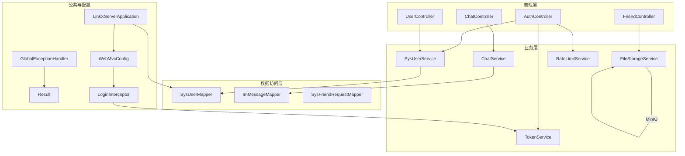
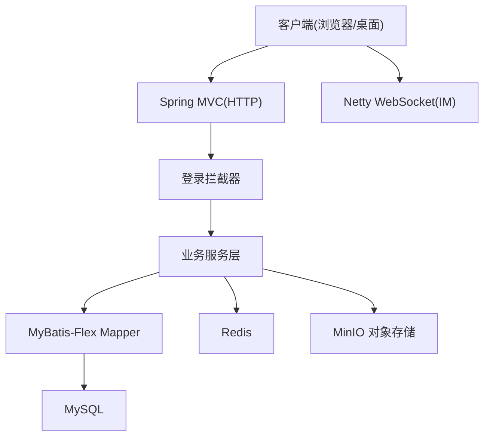
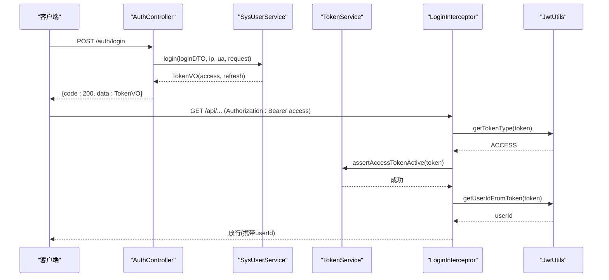
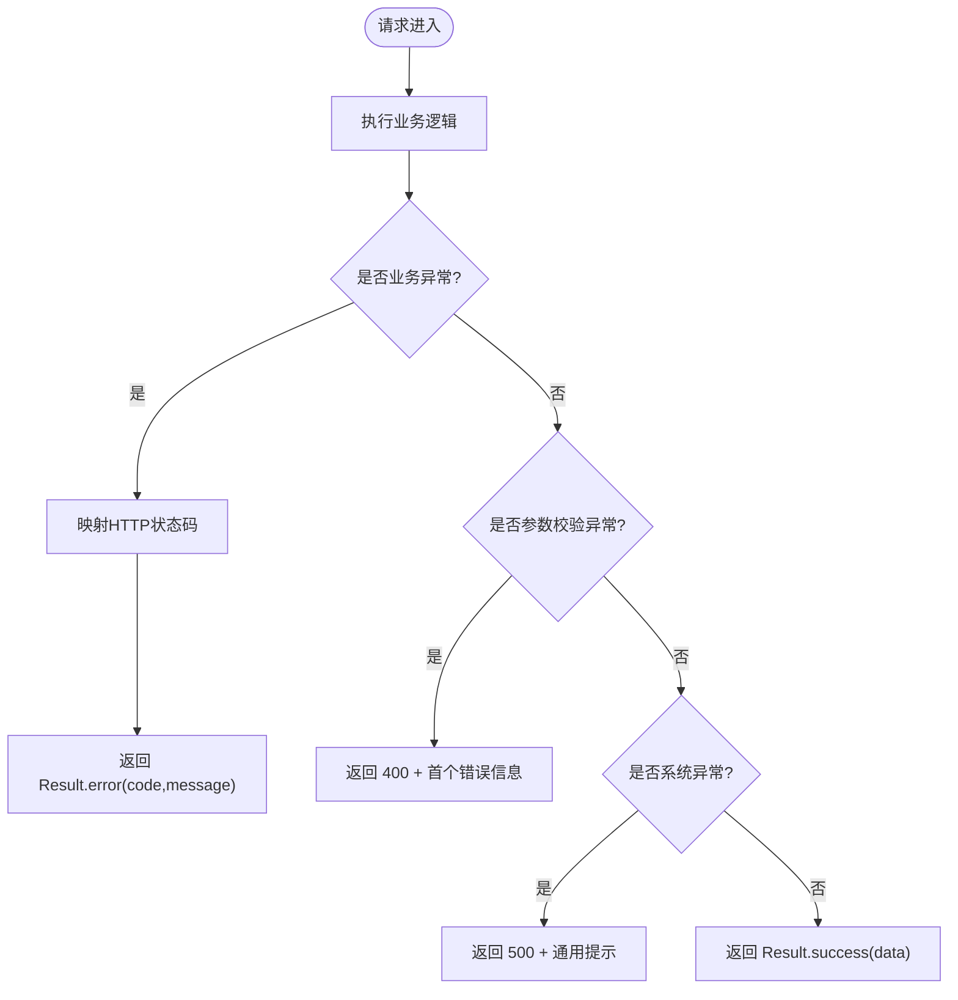
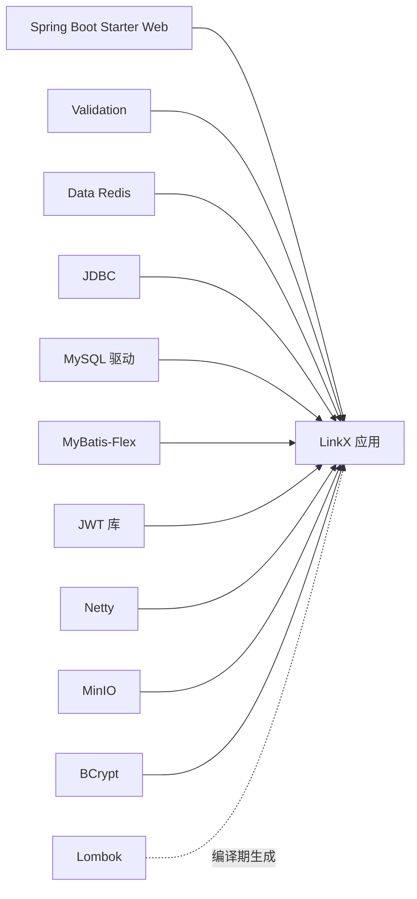

# 后端架构设计

<cite>
**本文引用的文件**
- [pom.xml](file://linkx-server/pom.xml)
- [application.yml](file://linkx-server/src/main/resources/application.yml)
- [LinkXServerApplication.java](file://linkx-server/src/main/java/com/linkx/server/LinkXServerApplication.java)
- [WebMvcConfig.java](file://linkx-server/src/main/java/com/linkx/server/config/WebMvcConfig.java)
- [LoginInterceptor.java](file://linkx-server/src/main/java/com/linkx/server/config/interceptor/LoginInterceptor.java)
- [GlobalExceptionHandler.java](file://linkx-server/src/main/java/com/linkx/server/exception/GlobalExceptionHandler.java)
- [Result.java](file://linkx-server/src/main/java/com/linkx/server/common/Result.java)
- [AuthController.java](file://linkx-server/src/main/java/com/linkx/server/controller/AuthController.java)
- [SysUserService.java](file://linkx-server/src/main/java/com/linkx/server/service/SysUserService.java)
</cite>

## 目录
1. [引言](#引言)
2. [项目结构](#项目结构)
3. [核心组件](#核心组件)
4. [架构总览](#架构总览)
5. [详细组件分析](#详细组件分析)
6. [依赖分析](#依赖分析)
7. [性能考虑](#性能考虑)
8. [故障排查指南](#故障排查指南)
9. [结论](#结论)
10. [附录](#附录)

## 引言
本文件面向 LinkX 后端开发者，系统化阐述基于 Spring Boot 3 的分层架构与关键机制：Controller-Service-Mapper 分层模式、配置管理策略、异常处理、安全拦截器、RESTful API 规范、JWT 认证授权、MyBatis-Flex ORM 数据访问层以及 Netty WebSocket 实时通信。同时给出微服务化准备、性能优化与可扩展性设计的实践建议，帮助团队在单体阶段快速迭代并平滑演进到微服务。

## 项目结构
后端采用典型的分层组织方式：
- 表现层（controller）：接收 HTTP 请求，参数校验，调用服务层，返回统一响应体 Result。
- 业务层（service/impl）：封装业务流程、事务边界、跨域能力（如 Redis、MinIO）。
- 数据访问层（mapper）：基于 MyBatis-Flex 的 Mapper 接口，负责 SQL 映射与持久化操作。
- 公共模块（common）：统一响应体、工具类（JWT、鉴权辅助等）。
- 配置（config）：MVC 配置、CORS、拦截器、序列化、外部存储等。
- 异常（exception）：全局异常处理器与自定义异常。
- IM 实时通信（im）：基于 Netty 的 WebSocket 服务端与消息通道管理。
- 启动入口（LinkXServerApplication）：应用启动、Mapper 扫描、配置属性绑定、异步支持、JWT 密钥校验。

图表来源
- [LinkXServerApplication.java:26-30](file://linkx-server/src/main/java/com/linkx/server/LinkXServerApplication.java#L26-L30)
- [WebMvcConfig.java:11-46](file://linkx-server/src/main/java/com/linkx/server/config/WebMvcConfig.java#L11-L46)
- [LoginInterceptor.java:14-52](file://linkx-server/src/main/java/com/linkx/server/config/interceptor/LoginInterceptor.java#L14-L52)
- [GlobalExceptionHandler.java:12-52](file://linkx-server/src/main/java/com/linkx/server/exception/GlobalExceptionHandler.java#L12-L52)
- [Result.java:18-94](file://linkx-server/src/main/java/com/linkx/server/common/Result.java#L18-L94)
- [AuthController.java:25-83](file://linkx-server/src/main/java/com/linkx/server/controller/AuthController.java#L25-L83)
- [SysUserService.java:11-33](file://linkx-server/src/main/java/com/linkx/server/service/SysUserService.java#L11-L33)

章节来源
- [pom.xml:1-145](file://linkx-server/pom.xml#L1-L145)
- [application.yml:1-54](file://linkx-server/src/main/resources/application.yml#L1-L54)
- [LinkXServerApplication.java:26-43](file://linkx-server/src/main/java/com/linkx/server/LinkXServerApplication.java#L26-L43)

## 核心组件
- 统一响应体 Result：定义 code/message/data 三字段标准结构，提供 success/error 静态工厂方法，贯穿 Controller 返回值与全局异常处理。
- 全局异常处理 GlobalExceptionHandler：捕获业务异常、参数校验异常与未知异常，统一转换为 Result 并设置合适的 HTTP 状态码。
- MVC 配置 WebMvcConfig：注册登录拦截器、配置 CORS 白名单与预检缓存。
- 登录拦截器 LoginInterceptor：从 Authorization 头解析 Bearer Token，校验类型与活跃性，注入 userId 到请求上下文。
- 启动入口 LinkXServerApplication：启用 MapperScan、配置属性绑定、异步支持，并在启动时校验 JWT Secret 强度与可用性。
- 配置 application.yml：集中管理端口、上下文路径、数据库、Redis、MyBatis-Flex、IM WebSocket 端口、MinIO 对象存储等。

章节来源
- [Result.java:18-94](file://linkx-server/src/main/java/com/linkx/server/common/Result.java#L18-L94)
- [GlobalExceptionHandler.java:12-52](file://linkx-server/src/main/java/com/linkx/server/exception/GlobalExceptionHandler.java#L12-L52)
- [WebMvcConfig.java:11-46](file://linkx-server/src/main/java/com/linkx/server/config/WebMvcConfig.java#L11-L46)
- [LoginInterceptor.java:14-52](file://linkx-server/src/main/java/com/linkx/server/config/interceptor/LoginInterceptor.java#L14-L52)
- [LinkXServerApplication.java:26-43](file://linkx-server/src/main/java/com/linkx/server/LinkXServerApplication.java#L26-L43)
- [application.yml:1-54](file://linkx-server/src/main/resources/application.yml#L1-L54)

## 架构总览
整体采用“Spring Boot 3 + MyBatis-Flex + Netty”的混合架构：
- HTTP 服务由 Spring MVC 提供，RESTful API 遵循资源命名与动词语义规范。
- 认证授权通过 JWT 实现，Access Token 用于鉴权，Refresh Token 用于续期；拦截器在请求进入前完成身份校验与用户上下文注入。
- 数据访问使用 MyBatis-Flex，结合实体与 Mapper 接口进行 CRUD 与复杂查询。
- 实时通信通过独立 Netty WebSocket 服务运行于不同端口，承载聊天消息推送与会话管理。
- 外部依赖包括 MySQL、Redis、MinIO，分别承担持久化、缓存/限流与对象存储。

图表来源
- [application.yml:1-54](file://linkx-server/src/main/resources/application.yml#L1-L54)
- [pom.xml:26-119](file://linkx-server/pom.xml#L26-L119)

## 详细组件分析

### 认证与授权流程（JWT + 拦截器）
- 登录成功后返回 Access Token 与 Refresh Token。
- 后续请求携带 Authorization: Bearer <access_token>，拦截器校验令牌类型、活跃性与过期时间，并将 userId 写入请求属性供后续使用。
- 刷新接口对 IP 维度做速率限制，防止滥用。

图表来源
- [AuthController.java:48-53](file://linkx-server/src/main/java/com/linkx/server/controller/AuthController.java#L48-L53)
- [SysUserService.java:15](file://linkx-server/src/main/java/com/linkx/server/service/SysUserService.java#L15)
- [LoginInterceptor.java:22-51](file://linkx-server/src/main/java/com/linkx/server/config/interceptor/LoginInterceptor.java#L22-L51)

章节来源
- [AuthController.java:25-83](file://linkx-server/src/main/java/com/linkx/server/controller/AuthController.java#L25-L83)
- [LoginInterceptor.java:14-52](file://linkx-server/src/main/java/com/linkx/server/config/interceptor/LoginInterceptor.java#L14-L52)
- [SysUserService.java:11-33](file://linkx-server/src/main/java/com/linkx/server/service/SysUserService.java#L11-L33)

### RESTful API 设计规范
- 基础路径：/api（由 server.servlet.context-path 配置）。
- 资源命名：使用名词复数形式，例如 /auth、/users、/friends、/chats。
- 动作语义：GET 查询、POST 创建、PUT 全量更新、DELETE 删除。
- 统一响应：所有接口返回 Result<T>，包含 code/message/data。
- 错误码：业务异常通过自定义异常抛出，全局异常处理器映射为合适 HTTP 状态码。

章节来源
- [application.yml:1-10](file://linkx-server/src/main/resources/application.yml#L1-L10)
- [Result.java:18-94](file://linkx-server/src/main/java/com/linkx/server/common/Result.java#L18-L94)
- [GlobalExceptionHandler.java:12-52](file://linkx-server/src/main/java/com/linkx/server/exception/GlobalExceptionHandler.java#L12-L52)

### 配置管理策略
- 环境变量优先：数据库、Redis、MinIO、JWT 等敏感信息通过环境变量注入。
- 多环境：spring.profiles.active 控制激活 profile，便于本地/测试/生产差异化配置。
- 集中式属性：自定义 linkx.* 配置项（JWT、认证开关、CORS、IM 端口、MinIO）通过 @EnableConfigurationProperties 绑定。
- 安全基线：启动时校验 JWT Secret 长度与复杂度，避免弱密钥上线。

章节来源
- [application.yml:11-54](file://linkx-server/src/main/resources/application.yml#L11-L54)
- [LinkXServerApplication.java:26-43](file://linkx-server/src/main/java/com/linkx/server/LinkXServerApplication.java#L26-L43)

### 异常处理机制
- 业务异常：抛出 CustomException，携带业务码与消息，全局处理器映射为对应 HTTP 状态码。
- 参数校验：MethodArgumentNotValidException/BindException 统一返回 400 与首个校验失败信息。
- 系统异常：兜底捕获 Exception，记录堆栈并返回 500 友好提示。

图表来源
- [GlobalExceptionHandler.java:16-38](file://linkx-server/src/main/java/com/linkx/server/exception/GlobalExceptionHandler.java#L16-L38)
- [Result.java:57-93](file://linkx-server/src/main/java/com/linkx/server/common/Result.java#L57-L93)

章节来源
- [GlobalExceptionHandler.java:12-52](file://linkx-server/src/main/java/com/linkx/server/exception/GlobalExceptionHandler.java#L12-L52)

### 安全拦截器与 CORS
- 登录拦截器：排除公开路径（登录、注册、刷新、登出、验证码、错误页），仅对受保护接口执行鉴权。
- CORS：允许指定来源或默认 localhost 开发地址，支持凭证与预检缓存。

章节来源
- [WebMvcConfig.java:18-45](file://linkx-server/src/main/java/com/linkx/server/config/WebMvcConfig.java#L18-L45)
- [LoginInterceptor.java:22-30](file://linkx-server/src/main/java/com/linkx/server/config/interceptor/LoginInterceptor.java#L22-L30)

### MyBatis-Flex 数据访问层
- 启动类启用 @MapperScan("com.linkx.server.mapper")，自动注册 Mapper 接口。
- 全局逻辑删除列、XML 映射位置等通过 mybatis-flex.global-config 与 mapper-locations 配置。
- 实体与 Mapper 一一对应，Service 层通过 IService 扩展复用通用 CRUD。

章节来源
- [LinkXServerApplication.java:27](file://linkx-server/src/main/java/com/linkx/server/LinkXServerApplication.java#L27)
- [application.yml:23-27](file://linkx-server/src/main/resources/application.yml#L23-L27)
- [SysUserService.java:11](file://linkx-server/src/main/java/com/linkx/server/service/SysUserService.java#L11)

### Netty WebSocket 实时通信架构
- 独立服务：IM WebSocket 服务运行于独立端口（默认 8081），与 HTTP 服务解耦。
- 通道管理：维护会话与用户关系，支持消息路由与广播。
- 认证集成：WebSocket 握手时可复用 JWT 校验逻辑，确保连接安全性。
- 消息帧：定义 ImWsFrame 统一消息格式，便于前后端协议稳定。

章节来源
- [application.yml:46-47](file://linkx-server/src/main/resources/application.yml#L46-L47)
- [pom.xml:84-89](file://linkx-server/pom.xml#L84-L89)

## 依赖分析
- 运行时依赖：Spring Boot Web、Validation、Data Redis、JDBC、MySQL 驱动、MyBatis-Flex、JWT、Netty、MinIO、BCrypt、Lombok。
- 构建与打包：maven-compiler-plugin 指定 Java 21，spring-boot-maven-plugin 排除 Lombok 参与打包。
- 版本治理：通过 properties 集中声明 mybatis-flex、jjwt、netty 版本，便于升级与一致性管理。

图表来源
- [pom.xml:26-119](file://linkx-server/pom.xml#L26-L119)

章节来源
- [pom.xml:1-145](file://linkx-server/pom.xml#L1-L145)

## 性能考虑
- 连接池与线程模型
  - 使用 Spring Boot 内置连接池，合理设置最大连接数与超时，避免数据库成为瓶颈。
  - Netty 事件循环线程数按 CPU 核数配置，减少上下文切换。
- 缓存与限流
  - 利用 Redis 缓存热点数据（如用户资料、会话元信息），降低数据库压力。
  - 登录/注册/刷新接口增加速率限制，防止暴力破解与资源耗尽。
- 序列化与网络
  - Jackson 配置按需开启延迟加载与字段过滤，减少无效数据传输。
  - 大文件上传走 MinIO 直传或分片上传，避免占用 HTTP 服务内存。
- 异步与并发
  - 启用 @EnableAsync，将耗时任务（如审计日志、通知发送）异步化，缩短主链路 RT。
- 监控与可观测性
  - 接入指标采集（QPS、RT、错误率）、链路追踪与结构化日志，定位性能问题。

[本节为通用指导，不直接分析具体文件]

## 故障排查指南
- 启动失败
  - 检查 JWT_SECRET 环境变量是否设置且长度足够，启动时会进行强度与 HMAC 可用性校验。
  - 确认数据库、Redis、MinIO 连接参数正确，必要时查看 application.yml 中占位符替换结果。
- 鉴权失败
  - 确认 Authorization 头格式为 Bearer <token>，且 token 未过期、未被拉黑。
  - 检查拦截器排除路径是否正确，避免误拦截公开接口。
- 参数校验报错
  - 关注 MethodArgumentNotValidException 抛出的首个错误信息，修正 DTO 字段约束。
- 实时通信异常
  - 核对 IM WebSocket 端口是否被占用，握手时是否携带有效 JWT。
  - 检查 ImChannelManager 中的会话管理与消息路由逻辑。

章节来源
- [LinkXServerApplication.java:58-95](file://linkx-server/src/main/java/com/linkx/server/LinkXServerApplication.java#L58-L95)
- [application.yml:11-54](file://linkx-server/src/main/resources/application.yml#L11-L54)
- [LoginInterceptor.java:22-51](file://linkx-server/src/main/java/com/linkx/server/config/interceptor/LoginInterceptor.java#L22-L51)
- [GlobalExceptionHandler.java:22-38](file://linkx-server/src/main/java/com/linkx/server/exception/GlobalExceptionHandler.java#L22-L38)

## 结论
LinkX 后端以 Spring Boot 3 为核心，结合 MyBatis-Flex 与 Netty 构建了高内聚、低耦合的分层架构。通过统一的响应体、全局异常处理、JWT 鉴权与 CORS 配置，保证了 API 的一致性与安全性；通过独立的 IM WebSocket 服务实现了实时通信能力。建议在现有基础上持续完善监控、限流与缓存策略，逐步推进模块化与微服务化改造，提升系统的可维护性与可扩展性。

[本节为总结性内容，不直接分析具体文件]

## 附录
- 微服务化准备
  - 领域拆分：按用户、好友、聊天、文件等边界划分服务，明确 DDD 限界上下文。
  - 服务间通信：引入 RPC 或消息队列，解耦同步与异步交互。
  - 配置中心与注册发现：统一配置管理与动态扩缩容。
  - 网关与安全：统一鉴权、限流、灰度发布与流量治理。
- 最佳实践
  - 接口契约先行：DTO/VO 与 OpenAPI 文档同步维护。
  - 幂等与重试：对外部依赖调用增加幂等键与重试退避。
  - 安全基线：最小权限原则、输入校验、输出脱敏、敏感配置外置。

[本节为概念性内容，不直接分析具体文件]