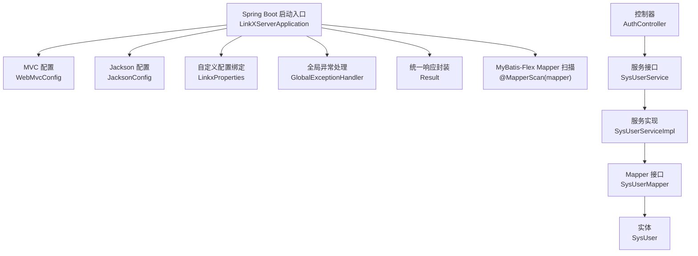
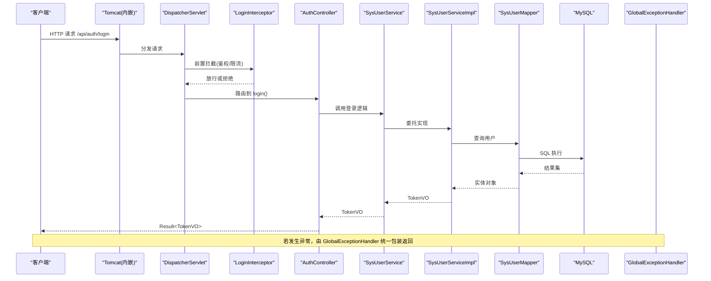
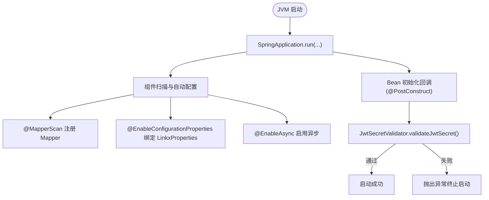
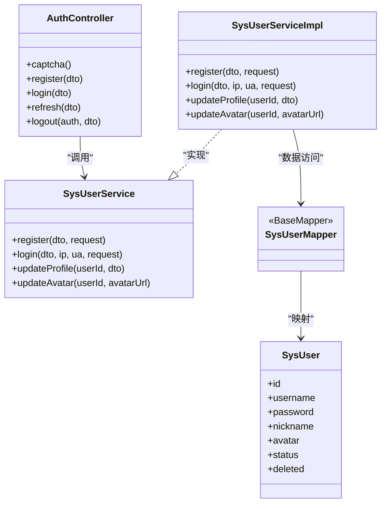
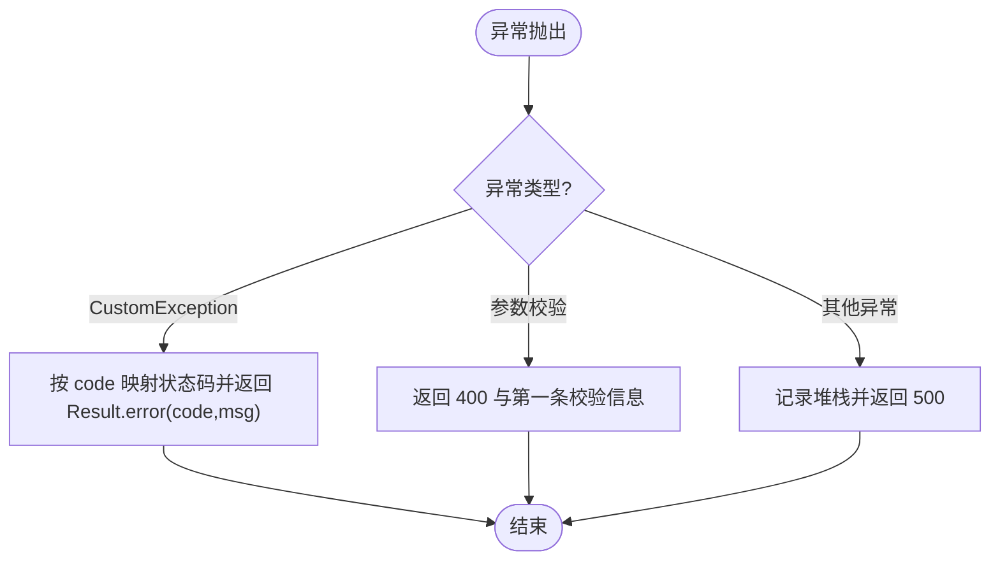
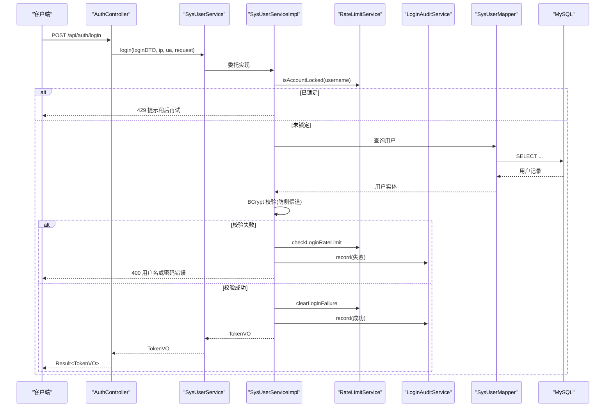
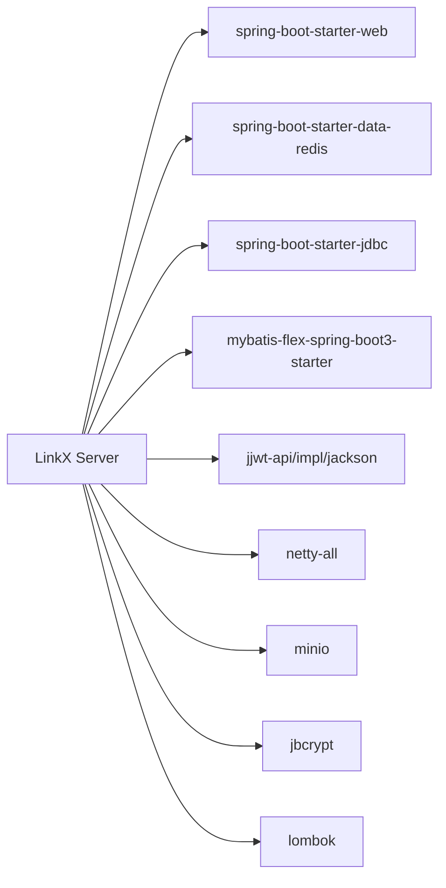

# 应用架构设计

<cite>
**本文引用的文件**
- [LinkXServerApplication.java](file://linkx-server/src/main/java/com/linkx/server/LinkXServerApplication.java)
- [application.yml](file://linkx-server/src/main/resources/application.yml)
- [pom.xml](file://linkx-server/pom.xml)
- [WebMvcConfig.java](file://linkx-server/src/main/java/com/linkx/server/config/WebMvcConfig.java)
- [JacksonConfig.java](file://linkx-server/src/main/java/com/linkx/server/config/JacksonConfig.java)
- [GlobalExceptionHandler.java](file://linkx-server/src/main/java/com/linkx/server/exception/GlobalExceptionHandler.java)
- [Result.java](file://linkx-server/src/main/java/com/linkx/server/common/Result.java)
- [AuthController.java](file://linkx-server/src/main/java/com/linkx/server/controller/AuthController.java)
- [SysUserService.java](file://linkx-server/src/main/java/com/linkx/server/service/SysUserService.java)
- [SysUserServiceImpl.java](file://linkx-server/src/main/java/com/linkx/server/service/impl/SysUserServiceImpl.java)
- [SysUserMapper.java](file://linkx-server/src/main/java/com/linkx/server/mapper/SysUserMapper.java)
- [SysUser.java](file://linkx-server/src/main/java/com/linkx/server/entity/SysUser.java)
- [LinkxProperties.java](file://linkx-server/src/main/java/com/linkx/server/config/LinkxProperties.java)
</cite>

## 目录
1. [简介](#简介)
2. [项目结构](#项目结构)
3. [核心组件](#核心组件)
4. [架构总览](#架构总览)
5. [详细组件分析](#详细组件分析)
6. [依赖分析](#依赖分析)
7. [性能考虑](#性能考虑)
8. [故障排查指南](#故障排查指南)
9. [结论](#结论)
10. [附录](#附录)

## 简介
本文件面向 LinkX 后端（基于 Spring Boot 3）的架构设计与实现，聚焦以下目标：
- 阐述应用启动流程、包结构与分层架构模式
- 说明 Controller-Service-Mapper 三层职责与依赖注入机制
- 解释 WebMvcConfig 的 MVC 配置、Jackson 序列化、跨域处理与全局异常处理
- 覆盖应用初始化、Bean 生命周期管理、异步任务配置与监控集成建议
- 为开发者提供可落地的最佳实践与排障指引

## 项目结构
后端采用典型的分层架构：
- 表现层：controller
- 业务层：service 与 impl
- 数据访问层：mapper（基于 MyBatis-Flex）
- 配置层：config（MVC、Jackson、属性绑定等）
- 通用能力：common（统一响应、工具类）、exception（全局异常）
- 实体模型：entity
- 即时通信扩展：im（Netty WebSocket 服务，独立于 Spring MVC）

图示来源
- [LinkXServerApplication.java:26-30](file://linkx-server/src/main/java/com/linkx/server/LinkXServerApplication.java#L26-L30)
- [WebMvcConfig.java:11-16](file://linkx-server/src/main/java/com/linkx/server/config/WebMvcConfig.java#L11-L16)
- [JacksonConfig.java:12-16](file://linkx-server/src/main/java/com/linkx/server/config/JacksonConfig.java#L12-L16)
- [GlobalExceptionHandler.java:12-14](file://linkx-server/src/main/java/com/linkx/server/exception/GlobalExceptionHandler.java#L12-L14)
- [Result.java:18-29](file://linkx-server/src/main/java/com/linkx/server/common/Result.java#L18-L29)
- [AuthController.java:25-28](file://linkx-server/src/main/java/com/linkx/server/controller/AuthController.java#L25-L28)
- [SysUserService.java:11-15](file://linkx-server/src/main/java/com/linkx/server/service/SysUserService.java#L11-L15)
- [SysUserServiceImpl.java:23-25](file://linkx-server/src/main/java/com/linkx/server/service/impl/SysUserServiceImpl.java#L23-L25)
- [SysUserMapper.java:18-19](file://linkx-server/src/main/java/com/linkx/server/mapper/SysUserMapper.java#L18-L19)
- [SysUser.java:34-39](file://linkx-server/src/main/java/com/linkx/server/entity/SysUser.java#L34-L39)

章节来源
- [LinkXServerApplication.java:26-30](file://linkx-server/src/main/java/com/linkx/server/LinkXServerApplication.java#L26-L30)
- [application.yml:1-54](file://linkx-server/src/main/resources/application.yml#L1-L54)
- [pom.xml:26-119](file://linkx-server/pom.xml#L26-L119)

## 核心组件
- 启动入口与装配
  - @SpringBootApplication 启用自动配置与组件扫描
  - @MapperScan 指定 Mapper 扫描路径
  - @EnableConfigurationProperties 绑定 linkx.* 配置项
  - @EnableAsync 开启异步任务支持
- 配置中心
  - application.yml 定义服务器端口、上下文路径、数据库、Redis、MinIO、IM 等
  - LinkxProperties 将 linkx.* 映射为强类型对象
- MVC 与安全
  - WebMvcConfig 注册登录拦截器与 CORS 策略
  - GlobalExceptionHandler 统一异常到 Result
  - JacksonConfig 统一 Long 序列化与时区模块
- 分层调用链
  - AuthController -> SysUserService -> SysUserServiceImpl -> SysUserMapper -> SysUser

章节来源
- [LinkXServerApplication.java:26-30](file://linkx-server/src/main/java/com/linkx/server/LinkXServerApplication.java#L26-L30)
- [application.yml:1-54](file://linkx-server/src/main/resources/application.yml#L1-L54)
- [LinkxProperties.java:11-21](file://linkx-server/src/main/java/com/linkx/server/config/LinkxProperties.java#L11-L21)
- [WebMvcConfig.java:11-16](file://linkx-server/src/main/java/com/linkx/server/config/WebMvcConfig.java#L11-L16)
- [JacksonConfig.java:12-16](file://linkx-server/src/main/java/com/linkx/server/config/JacksonConfig.java#L12-L16)
- [GlobalExceptionHandler.java:12-14](file://linkx-server/src/main/java/com/linkx/server/exception/GlobalExceptionHandler.java#L12-L14)

## 架构总览
下图展示从请求进入 Tomcat 到返回 JSON 的完整链路，包括拦截器、校验、业务逻辑、持久化与异常处理。

图示来源
- [WebMvcConfig.java:18-30](file://linkx-server/src/main/java/com/linkx/server/config/WebMvcConfig.java#L18-L30)
- [AuthController.java:48-53](file://linkx-server/src/main/java/com/linkx/server/controller/AuthController.java#L48-L53)
- [SysUserService.java:11-15](file://linkx-server/src/main/java/com/linkx/server/service/SysUserService.java#L11-L15)
- [SysUserServiceImpl.java:59-99](file://linkx-server/src/main/java/com/linkx/server/service/impl/SysUserServiceImpl.java#L59-L99)
- [SysUserMapper.java:18-19](file://linkx-server/src/main/java/com/linkx/server/mapper/SysUserMapper.java#L18-L19)
- [GlobalExceptionHandler.java:12-14](file://linkx-server/src/main/java/com/linkx/server/exception/GlobalExceptionHandler.java#L12-L14)

## 详细组件分析

### 应用启动与初始化流程
- 启动入口
  - main 方法触发 SpringApplication.run，完成自动配置、组件扫描、容器初始化与内嵌 Tomcat 启动
  - @MapperScan 扫描 mapper 包并注册所有 Mapper 接口
  - @EnableConfigurationProperties 加载 LinkxProperties，读取 application.yml 中 linkx.* 节点
  - @EnableAsync 启用异步任务能力
- 安全密钥校验
  - JwtSecretValidator 在 @PostConstruct 阶段校验 JWT Secret 长度与格式，不满足条件直接抛出异常阻止启动
- 配置生效
  - server.context-path=/api 使所有接口以 /api 前缀暴露
  - datasource、redis、minio、im 等通过环境变量或默认值注入

图示来源
- [LinkXServerApplication.java:37-42](file://linkx-server/src/main/java/com/linkx/server/LinkXServerApplication.java#L37-L42)
- [LinkXServerApplication.java:26-30](file://linkx-server/src/main/java/com/linkx/server/LinkXServerApplication.java#L26-L30)
- [LinkXServerApplication.java:58-95](file://linkx-server/src/main/java/com/linkx/server/LinkXServerApplication.java#L58-L95)
- [application.yml:1-10](file://linkx-server/src/main/resources/application.yml#L1-L10)

章节来源
- [LinkXServerApplication.java:26-42](file://linkx-server/src/main/java/com/linkx/server/LinkXServerApplication.java#L26-L42)
- [LinkXServerApplication.java:58-95](file://linkx-server/src/main/java/com/linkx/server/LinkXServerApplication.java#L58-L95)
- [application.yml:1-54](file://linkx-server/src/main/resources/application.yml#L1-L54)

### 包结构与分层职责
- controller
  - 负责接收请求、参数校验、调用 service、返回 Result
  - 示例：AuthController 提供登录、注册、刷新令牌、登出、验证码等接口
- service
  - 定义业务边界与对外契约，使用接口隔离实现
  - 示例：SysUserService 声明注册、登录、资料更新等能力
- service.impl
  - 具体业务编排与事务边界，组合其他服务（Token、限流、审计、存储）
  - 示例：SysUserServiceImpl 实现密码校验、账号锁定、审计记录、头像更新等
- mapper
  - 数据访问抽象，继承 BaseMapper 获得 CRUD 能力，结合链式查询
  - 示例：SysUserMapper 对应 sys_user 表
- entity
  - 领域模型，使用 MyBatis-Flex 注解映射表与字段
  - 示例：SysUser 包含主键策略、逻辑删除标记等
- config
  - WebMvcConfig：拦截器与跨域
  - JacksonConfig：Long 转字符串、JavaTimeModule
  - LinkxProperties：linkx.* 配置绑定
- exception
  - GlobalExceptionHandler：统一异常到 Result，按错误码映射 HTTP 状态
- common
  - Result：统一响应体

章节来源
- [AuthController.java:25-34](file://linkx-server/src/main/java/com/linkx/server/controller/AuthController.java#L25-L34)
- [SysUserService.java:11-33](file://linkx-server/src/main/java/com/linkx/server/service/SysUserService.java#L11-L33)
- [SysUserServiceImpl.java:23-33](file://linkx-server/src/main/java/com/linkx/server/service/impl/SysUserServiceImpl.java#L23-L33)
- [SysUserMapper.java:18-21](file://linkx-server/src/main/java/com/linkx/server/mapper/SysUserMapper.java#L18-L21)
- [SysUser.java:34-96](file://linkx-server/src/main/java/com/linkx/server/entity/SysUser.java#L34-L96)
- [WebMvcConfig.java:11-16](file://linkx-server/src/main/java/com/linkx/server/config/WebMvcConfig.java#L11-L16)
- [JacksonConfig.java:12-21](file://linkx-server/src/main/java/com/linkx/server/config/JacksonConfig.java#L12-L21)
- [LinkxProperties.java:11-21](file://linkx-server/src/main/java/com/linkx/server/config/LinkxProperties.java#L11-L21)
- [GlobalExceptionHandler.java:12-14](file://linkx-server/src/main/java/com/linkx/server/exception/GlobalExceptionHandler.java#L12-L14)
- [Result.java:18-29](file://linkx-server/src/main/java/com/linkx/server/common/Result.java#L18-L29)

### Controller-Service-Mapper 协作与依赖注入
- 依赖注入
  - 使用构造器注入（@RequiredArgsConstructor），避免字段注入带来的隐式耦合
  - Controller 注入 Service；Service 注入 Mapper、外部服务（Token、限流、审计、存储）
- 调用关系
  - AuthController.login -> SysUserService.login -> SysUserServiceImpl.login -> SysUserMapper.queryChain -> DB
- 返回值
  - 统一通过 Result 包装，便于前端一致化处理

图示来源
- [AuthController.java:25-34](file://linkx-server/src/main/java/com/linkx/server/controller/AuthController.java#L25-L34)
- [SysUserService.java:11-33](file://linkx-server/src/main/java/com/linkx/server/service/SysUserService.java#L11-L33)
- [SysUserServiceImpl.java:23-33](file://linkx-server/src/main/java/com/linkx/server/service/impl/SysUserServiceImpl.java#L23-L33)
- [SysUserMapper.java:18-21](file://linkx-server/src/main/java/com/linkx/server/mapper/SysUserMapper.java#L18-L21)
- [SysUser.java:34-96](file://linkx-server/src/main/java/com/linkx/server/entity/SysUser.java#L34-L96)

章节来源
- [AuthController.java:25-34](file://linkx-server/src/main/java/com/linkx/server/controller/AuthController.java#L25-L34)
- [SysUserService.java:11-33](file://linkx-server/src/main/java/com/linkx/server/service/SysUserService.java#L11-L33)
- [SysUserServiceImpl.java:23-33](file://linkx-server/src/main/java/com/linkx/server/service/impl/SysUserServiceImpl.java#L23-L33)
- [SysUserMapper.java:18-21](file://linkx-server/src/main/java/com/linkx/server/mapper/SysUserMapper.java#L18-L21)
- [SysUser.java:34-96](file://linkx-server/src/main/java/com/linkx/server/entity/SysUser.java#L34-L96)

### WebMvcConfig：MVC 配置、跨域与拦截器
- 拦截器
  - 注册 LoginInterceptor，对 /** 生效，排除公开接口与 /error
- 跨域
  - 允许常用方法与头，支持凭据；allowedOrigins 优先使用配置，否则回退到本地开发白名单
- 配置来源
  - allowedOrigins 来自 LinkxProperties.cors.allowedOrigins

章节来源
- [WebMvcConfig.java:18-45](file://linkx-server/src/main/java/com/linkx/server/config/WebMvcConfig.java#L18-L45)
- [LinkxProperties.java:54-57](file://linkx-server/src/main/java/com/linkx/server/config/LinkxProperties.java#L54-L57)

### Jackson 序列化配置
- Long 序列化为字符串，避免前端 JS 精度丢失
- 注册 JavaTimeModule，提升日期时间序列化兼容性

章节来源
- [JacksonConfig.java:12-21](file://linkx-server/src/main/java/com/linkx/server/config/JacksonConfig.java#L12-L21)

### 全局异常处理机制
- 自定义业务异常 CustomException：根据 code 映射 HTTP 状态码
- 参数校验异常：MethodArgumentNotValidException、BindException 统一返回 400
- 兜底异常：捕获 Exception，返回 500 并记录日志
- 统一响应：全部通过 Result 包装

图示来源
- [GlobalExceptionHandler.java:16-38](file://linkx-server/src/main/java/com/linkx/server/exception/GlobalExceptionHandler.java#L16-L38)
- [Result.java:80-93](file://linkx-server/src/main/java/com/linkx/server/common/Result.java#L80-L93)

章节来源
- [GlobalExceptionHandler.java:12-52](file://linkx-server/src/main/java/com/linkx/server/exception/GlobalExceptionHandler.java#L12-L52)
- [Result.java:18-93](file://linkx-server/src/main/java/com/linkx/server/common/Result.java#L18-L93)

### 登录流程时序（含限流与审计）
- 步骤概览
  - 可选验证码校验
  - 检查账号是否被锁定
  - 查询用户并防御侧信道攻击（固定耗时比较）
  - 记录登录审计
  - 签发 Token 对并返回

图示来源
- [AuthController.java:48-53](file://linkx-server/src/main/java/com/linkx/server/controller/AuthController.java#L48-L53)
- [SysUserServiceImpl.java:59-99](file://linkx-server/src/main/java/com/linkx/server/service/impl/SysUserServiceImpl.java#L59-L99)
- [SysUserMapper.java:18-21](file://linkx-server/src/main/java/com/linkx/server/mapper/SysUserMapper.java#L18-L21)

章节来源
- [AuthController.java:48-53](file://linkx-server/src/main/java/com/linkx/server/controller/AuthController.java#L48-L53)
- [SysUserServiceImpl.java:59-99](file://linkx-server/src/main/java/com/linkx/server/service/impl/SysUserServiceImpl.java#L59-L99)

### 异步任务与性能监控集成
- 异步任务
  - 已通过 @EnableAsync 启用，可在 Service 中使用 @Async 标注方法实现异步执行
- 监控建议
  - 引入 Micrometer + Prometheus/Grafana 进行指标采集与可视化
  - 关注 JVM、HTTP、数据库连接池、Redis、消息队列等关键指标
  - 结合链路追踪（如 Sleuth/Micrometer Tracing）定位慢请求

[本节为通用指导，无需源码引用]

## 依赖分析
- 构建与版本
  - Spring Boot 3.3.0，Java 21
  - MyBatis-Flex 1.9.3，JWT 0.12.5，Netty 4.1.110.Final
- 关键依赖
  - spring-boot-starter-web：提供 MVC 与内嵌 Tomcat
  - spring-boot-starter-data-redis：Redis 客户端
  - spring-boot-starter-jdbc：DataSource 与连接池
  - mybatis-flex-spring-boot3-starter：ORM 与链式查询
  - jjwt-*：JWT 编解码
  - minio：对象存储
  - jbcrypt：密码哈希
  - lombok：编译期代码生成

图示来源
- [pom.xml:26-119](file://linkx-server/pom.xml#L26-L119)

章节来源
- [pom.xml:1-145](file://linkx-server/pom.xml#L1-L145)

## 性能考虑
- 数据库
  - 合理索引与分页，避免 N+1 查询
  - 使用连接池监控与调优（最大连接数、超时、空闲回收）
- 缓存
  - 热点数据入 Redis，注意缓存穿透/击穿/雪崩防护
- 序列化
  - Long 转字符串避免前端精度问题
  - 按需裁剪 VO 字段，减少网络传输体积
- 并发
  - 合理使用 @Async 与线程池隔离，避免阻塞关键路径
- 安全
  - 限流与账户锁定保护暴力破解
  - HTTPS 强制与最小权限原则

[本节为通用指导，无需源码引用]

## 故障排查指南
- 启动失败
  - 检查 JWT_SECRET 环境变量是否设置且长度足够
  - 查看控制台输出与日志中的安全错误提示
- 登录失败
  - 确认验证码开关与输入是否正确
  - 检查账号是否因多次失败被锁定
  - 核对数据库用户状态与密码哈希
- 跨域问题
  - 确认 allowedOrigins 配置与浏览器实际来源匹配
- 参数校验
  - 查看全局异常处理器返回的错误信息与前端提示
- 监控与日志
  - 接入 Micrometer 与结构化日志，定位慢请求与异常堆栈

章节来源
- [LinkXServerApplication.java:58-95](file://linkx-server/src/main/java/com/linkx/server/LinkXServerApplication.java#L58-L95)
- [GlobalExceptionHandler.java:16-38](file://linkx-server/src/main/java/com/linkx/server/exception/GlobalExceptionHandler.java#L16-L38)
- [WebMvcConfig.java:32-45](file://linkx-server/src/main/java/com/linkx/server/config/WebMvcConfig.java#L32-L45)

## 结论
本项目采用清晰的 Controller-Service-Mapper 分层与 Spring Boot 生态组件，具备完善的配置绑定、MVC 定制、统一异常与响应封装。通过 @EnableAsync 与外部中间件（Redis、MinIO、Netty IM）形成可扩展的后端基座。建议在后续迭代中补充监控与链路追踪，持续优化性能与可观测性。

[本节为总结，无需源码引用]

## 附录
- 配置要点
  - server.context-path=/api
  - datasource.url、username、password 通过环境变量注入
  - redis.host/port/password 通过环境变量注入
  - linkx.jwt.secret 必须满足安全要求
  - linkx.cors.allowed-origins 控制前端来源白名单
  - linkx.im.websocket-port 用于 IM WebSocket 服务
  - linkx.minio.endpoint/access-key/secret-key/bucket-name/max-file-size 控制对象存储

章节来源
- [application.yml:1-54](file://linkx-server/src/main/resources/application.yml#L1-L54)
- [LinkxProperties.java:22-64](file://linkx-server/src/main/java/com/linkx/server/config/LinkxProperties.java#L22-L64)