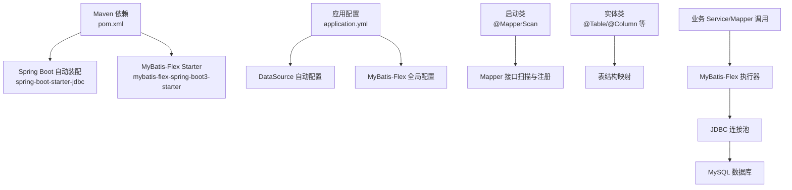
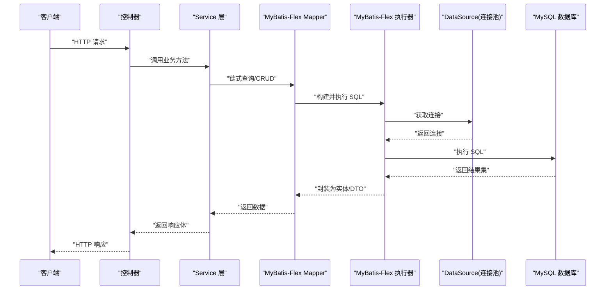
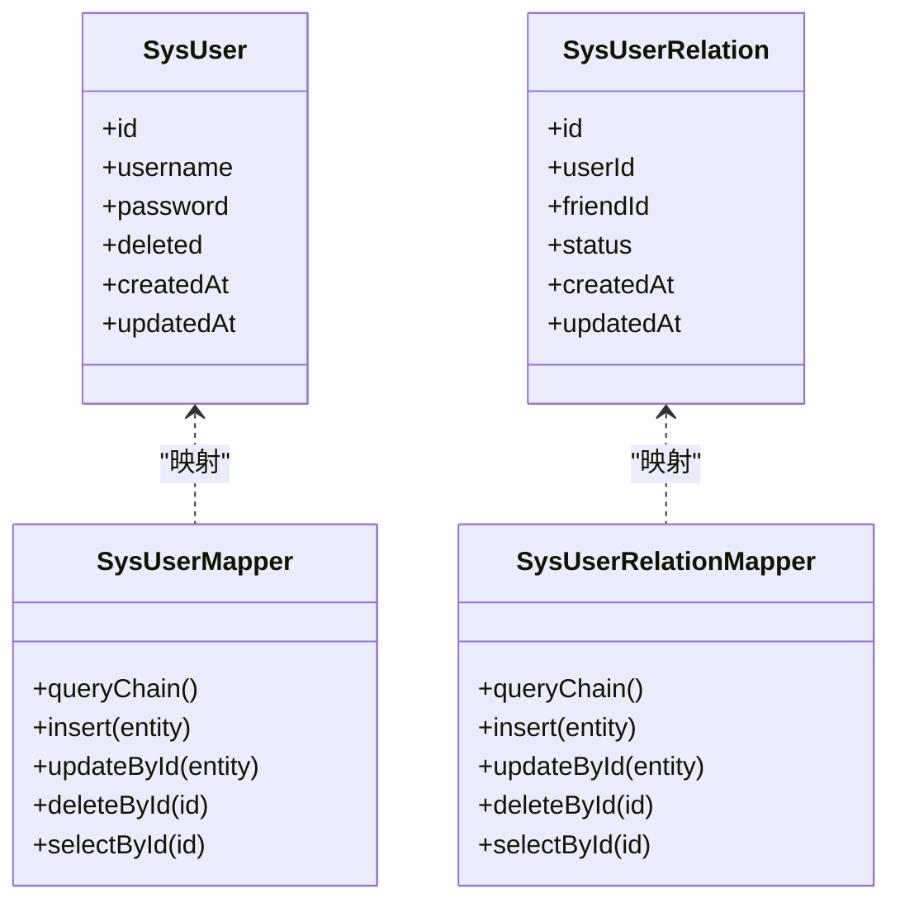
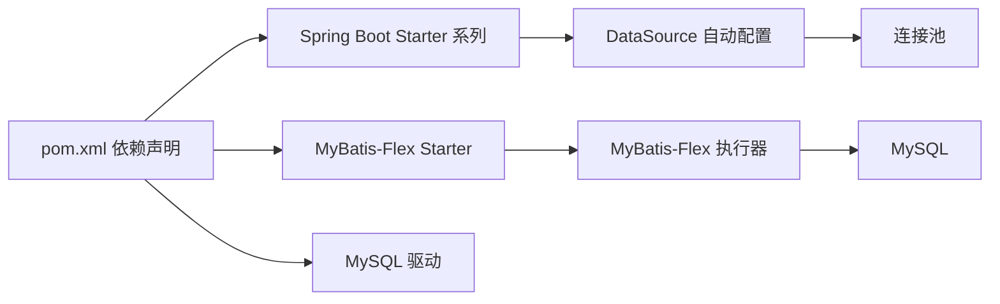

# ORM配置

<cite>
**本文引用的文件**   
- [pom.xml](file://linkx-server/pom.xml)
- [application.yml](file://linkx-server/src/main/resources/application.yml)
- [LinkXServerApplication.java](file://linkx-server/src/main/java/com/linkx/server/LinkXServerApplication.java)
- [SysUserMapper.java](file://linkx-server/src/main/java/com/linkx/server/mapper/SysUserMapper.java)
- [SysUserRelationMapper.java](file://linkx-server/src/main/java/com/linkx/server/mapper/SysUserRelationMapper.java)
- [SysUser.java](file://linkx-server/src/main/java/com/linkx/server/entity/SysUser.java)
- [SysUserRelation.java](file://linkx-server/src/main/java/com/linkx/server/entity/SysUserRelation.java)
</cite>

## 目录
1. [简介](#简介)
2. [项目结构](#项目结构)
3. [核心组件](#核心组件)
4. [架构总览](#架构总览)
5. [详细组件分析](#详细组件分析)
6. [依赖分析](#依赖分析)
7. [性能考虑](#性能考虑)
8. [故障排查指南](#故障排查指南)
9. [结论](#结论)
10. [附录](#附录)

## 简介
本文件聚焦 LinkX 后端服务中基于 MyBatis-Flex 的 ORM 配置与使用，涵盖以下主题：
- 框架集成与版本管理（Spring Boot + MyBatis-Flex）
- 数据源与连接池配置（JDBC、MySQL）
- 事务管理与默认策略
- 实体映射与逻辑删除
- SQL 日志输出与调试
- 分页插件集成与批量操作优化建议
- 与 Spring Boot 的集成方式、依赖管理与兼容性
- 最佳实践、常见陷阱与调试技巧
- 连接池监控、慢查询分析与性能瓶颈识别方法

## 项目结构
ORM 相关的关键位置与职责：
- 依赖与版本：在 Maven POM 中声明 Spring Boot 父工程、MyBatis-Flex Starter、MySQL 驱动与 JDBC Starter。
- 应用配置：在 application.yml 中配置数据库连接、Redis、以及 MyBatis-Flex 全局配置项。
- 启动类：通过 @MapperScan 扫描 Mapper 接口包路径，完成 Mapper 注册。
- 实体与 Mapper：实体类使用注解进行字段映射；Mapper 继承通用 BaseMapper 以启用链式 API 与 CRUD。

图表来源
- [pom.xml:1-168](file://linkx-server/pom.xml#L1-L168)
- [application.yml:1-54](file://linkx-server/src/main/resources/application.yml#L1-L54)
- [LinkXServerApplication.java:1-114](file://linkx-server/src/main/java/com/linkx/server/LinkXServerApplication.java#L1-L114)

章节来源
- [pom.xml:1-168](file://linkx-server/pom.xml#L1-L168)
- [application.yml:1-54](file://linkx-server/src/main/resources/application.yml#L1-L54)
- [LinkXServerApplication.java:1-114](file://linkx-server/src/main/java/com/linkx/server/LinkXServerApplication.java#L1-L114)

## 核心组件
- 依赖与版本
  - Spring Boot 父工程：用于统一依赖版本管理。
  - MyBatis-Flex Starter：提供与 Spring Boot 3 的自动装配能力。
  - MySQL 驱动与 JDBC Starter：提供 DataSource 自动配置与连接池。
- 应用配置
  - 数据源 URL、用户名、密码、驱动类名。
  - MyBatis-Flex 全局配置：逻辑删除列、Banner 打印开关、XML 映射文件位置。
- 启动与扫描
  - 启动类启用 @MapperScan，指定 Mapper 接口所在包路径。
- 实体与映射
  - 实体类使用注解标注表与列信息，配合 Lombok 生成访问器。
- Mapper 接口
  - 继承通用 BaseMapper，获得标准 CRUD 与链式查询能力。

章节来源
- [pom.xml:1-168](file://linkx-server/pom.xml#L1-L168)
- [application.yml:1-54](file://linkx-server/src/main/resources/application.yml#L1-L54)
- [LinkXServerApplication.java:1-114](file://linkx-server/src/main/java/com/linkx/server/LinkXServerApplication.java#L1-L114)
- [SysUserMapper.java:1-100](file://linkx-server/src/main/java/com/linkx/server/mapper/SysUserMapper.java#L1-L100)
- [SysUserRelationMapper.java:1-100](file://linkx-server/src/main/java/com/linkx/server/mapper/SysUserRelationMapper.java#L1-L100)
- [SysUser.java:1-120](file://linkx-server/src/main/java/com/linkx/server/entity/SysUser.java#L1-L120)
- [SysUserRelation.java:1-120](file://linkx-server/src/main/java/com/linkx/server/entity/SysUserRelation.java#L1-L120)

## 架构总览
下图展示了从 Web 层到数据库的 ORM 调用链路，包括 Spring Boot 自动装配、MyBatis-Flex 执行器、JDBC 连接池与 MySQL 的交互。

图表来源
- [LinkXServerApplication.java:1-114](file://linkx-server/src/main/java/com/linkx/server/LinkXServerApplication.java#L1-L114)
- [SysUserMapper.java:1-100](file://linkx-server/src/main/java/com/linkx/server/mapper/SysUserMapper.java#L1-L100)
- [application.yml:1-54](file://linkx-server/src/main/resources/application.yml#L1-L54)
- [pom.xml:1-168](file://linkx-server/pom.xml#L1-L168)

## 详细组件分析

### 依赖与版本管理
- Spring Boot 版本：由父工程统一管理，确保生态兼容。
- MyBatis-Flex 版本：通过属性集中管理，便于升级与维护。
- 关键依赖：
  - spring-boot-starter-jdbc：提供 DataSource 自动配置与连接池。
  - mybatis-flex-spring-boot3-starter：适配 Spring Boot 3 的自动装配。
  - mysql-connector-j：MySQL 官方驱动。

章节来源
- [pom.xml:1-168](file://linkx-server/pom.xml#L1-L168)

### 数据源与连接池设置
- 数据源配置项：
  - url：包含时区、字符集、SSL 等参数。
  - username/password：通过环境变量注入。
  - driver-class-name：MySQL 驱动类名。
- 连接池：
  - 当前未显式引入第三方连接池依赖，默认使用 Spring Boot 内置的连接池实现。
  - 如需自定义连接池（如 HikariCP），可在后续引入对应 Starter 或添加连接池依赖并进行相应配置。

章节来源
- [application.yml:1-54](file://linkx-server/src/main/resources/application.yml#L1-L54)
- [pom.xml:1-168](file://linkx-server/pom.xml#L1-L168)

### 事务管理策略
- Spring Boot 默认启用声明式事务（@Transactional）。
- 建议在 Service 层方法上标注事务注解，控制事务边界与传播行为。
- 注意：
  - 读写分离场景需额外配置多数据源与事务管理器。
  - 长事务与跨服务调用需谨慎设计，避免锁竞争与资源占用。

章节来源
- [application.yml:1-54](file://linkx-server/src/main/resources/application.yml#L1-L54)

### 实体映射配置
- 实体类使用注解标注表与列信息，结合 Lombok 生成 getter/setter。
- 逻辑删除：
  - 全局配置逻辑删除列名为 deleted。
  - 实体类可配合注解启用逻辑删除功能。
- 命名策略：
  - 若存在下划线与驼峰不一致的情况，可通过全局配置开启自动转换。

章节来源
- [application.yml:1-54](file://linkx-server/src/main/resources/application.yml#L1-L54)
- [SysUser.java:1-120](file://linkx-server/src/main/java/com/linkx/server/entity/SysUser.java#L1-L120)
- [SysUserRelation.java:1-120](file://linkx-server/src/main/java/com/linkx/server/entity/SysUserRelation.java#L1-L120)

### SQL 日志输出与调试
- 可通过调整日志级别输出 SQL 语句与参数，便于定位问题。
- 建议：
  - 开发环境开启详细日志，生产环境按需降低级别。
  - 对慢查询进行采样与记录，结合数据库端慢查询日志进行分析。

章节来源
- [application.yml:1-54](file://linkx-server/src/main/resources/application.yml#L1-L54)

### 分页插件集成
- 当前未在配置中显式启用分页插件。
- 建议：
  - 根据 MyBatis-Flex 文档引入分页插件依赖并在配置中启用。
  - 在 Service 层使用分页 API 进行分页查询，避免全量加载。

章节来源
- [application.yml:1-54](file://linkx-server/src/main/resources/application.yml#L1-L54)
- [pom.xml:1-168](file://linkx-server/pom.xml#L1-L168)

### 批量操作优化
- 使用 MyBatis-Flex 提供的批量插入/更新 API，减少往返次数。
- 合理设置批次大小，平衡内存占用与吞吐。
- 对于大对象或复杂字段，考虑分批提交与异步处理。

章节来源
- [SysUserMapper.java:1-100](file://linkx-server/src/main/java/com/linkx/server/mapper/SysUserMapper.java#L1-L100)
- [SysUserRelationMapper.java:1-100](file://linkx-server/src/main/java/com/linkx/server/mapper/SysUserRelationMapper.java#L1-L100)

### 与 Spring Boot 的集成方式
- 启动类启用 @MapperScan，指定 Mapper 接口包路径，完成自动注册。
- 通过 @EnableConfigurationProperties 启用自定义配置绑定（本项目主要用于 JWT、IM、MinIO 等配置）。
- 自动装配流程：
  - Spring Boot 读取 application.yml 中的 datasource 配置。
  - 初始化 DataSource 与连接池。
  - MyBatis-Flex Starter 装配 SqlSessionFactory 与执行器。
  - @MapperScan 扫描并注册 Mapper 接口代理。

章节来源
- [LinkXServerApplication.java:1-114](file://linkx-server/src/main/java/com/linkx/server/LinkXServerApplication.java#L1-L114)
- [application.yml:1-54](file://linkx-server/src/main/resources/application.yml#L1-L54)
- [pom.xml:1-168](file://linkx-server/pom.xml#L1-L168)

### 实体与 Mapper 关系图

图表来源
- [SysUser.java:1-120](file://linkx-server/src/main/java/com/linkx/server/entity/SysUser.java#L1-L120)
- [SysUserRelation.java:1-120](file://linkx-server/src/main/java/com/linkx/server/entity/SysUserRelation.java#L1-L120)
- [SysUserMapper.java:1-100](file://linkx-server/src/main/java/com/linkx/server/mapper/SysUserMapper.java#L1-L100)
- [SysUserRelationMapper.java:1-100](file://linkx-server/src/main/java/com/linkx/server/mapper/SysUserRelationMapper.java#L1-L100)

## 依赖分析
- 直接依赖
  - Spring Boot Starter Web、Validation、Data Redis、JDBC。
  - MyBatis-Flex Starter（适配 Spring Boot 3）。
  - MySQL 驱动。
  - Netty、JWT、Lombok、BCrypt、MinIO 等。
- 间接依赖
  - 由 Spring Boot 父工程管理的版本一致性，降低冲突风险。
- 潜在耦合点
  - 数据源与连接池：若切换连接池实现，需关注配置项差异。
  - MyBatis-Flex 版本：升级时需关注 API 变更与迁移指南。

图表来源
- [pom.xml:1-168](file://linkx-server/pom.xml#L1-L168)

章节来源
- [pom.xml:1-168](file://linkx-server/pom.xml#L1-L168)

## 性能考虑
- 连接池调优
  - 根据并发与负载调整最大连接数、空闲超时、最小空闲等参数。
  - 监控连接泄漏与等待时间，避免连接耗尽。
- SQL 优化
  - 合理使用索引，避免全表扫描。
  - 减少 N+1 查询，采用批量或 JOIN 优化。
- 分页与限流
  - 使用分页插件限制单次返回数据量。
  - 对热点接口实施缓存与限流策略。
- 事务边界
  - 缩小事务范围，避免长事务。
  - 读写分离场景下，明确事务传播与隔离级别。

[本节为通用指导，不直接分析具体文件]

## 故障排查指南
- 启动失败
  - 检查数据库连接参数是否正确，网络连通性与权限。
  - 确认驱动类名与版本匹配。
- SQL 异常
  - 开启 SQL 日志，核对生成的 SQL 与参数。
  - 检查实体字段与数据库列映射是否一致。
- 性能问题
  - 分析慢查询日志，定位热点 SQL。
  - 检查连接池状态与线程池使用情况。
- 事务问题
  - 确认 @Transactional 标注位置与传播行为。
  - 排查自调用导致的事务失效问题。

章节来源
- [application.yml:1-54](file://linkx-server/src/main/resources/application.yml#L1-L54)
- [SysUserMapper.java:1-100](file://linkx-server/src/main/java/com/linkx/server/mapper/SysUserMapper.java#L1-L100)
- [SysUserRelationMapper.java:1-100](file://linkx-server/src/main/java/com/linkx/server/mapper/SysUserRelationMapper.java#L1-L100)

## 结论
本项目基于 Spring Boot 与 MyBatis-Flex 构建了简洁高效的 ORM 层。通过合理的依赖管理、数据源配置、实体映射与事务策略，能够满足日常业务需求。后续可根据实际负载引入连接池监控、分页插件与更细粒度的性能调优手段，进一步提升系统稳定性与吞吐能力。

[本节为总结性内容，不直接分析具体文件]

## 附录
- 常用配置项参考
  - 数据源：url、username、password、driver-class-name。
  - MyBatis-Flex 全局：逻辑删除列、Banner 开关、XML 映射位置。
- 最佳实践清单
  - 使用链式 API 简化条件查询。
  - 批量操作优先，减少往返开销。
  - 严格事务边界，避免长事务。
  - 开启 SQL 日志用于开发与联调阶段。
  - 定期审查索引与慢查询，持续优化。

[本节为补充说明，不直接分析具体文件]