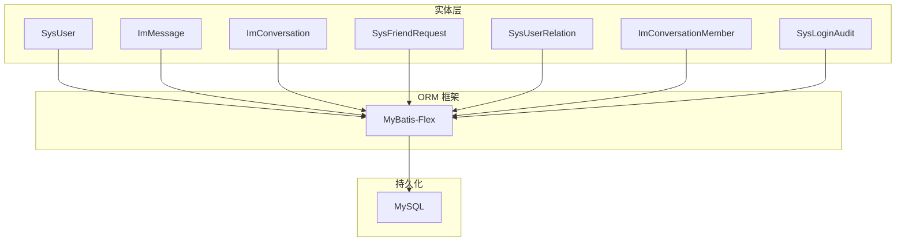
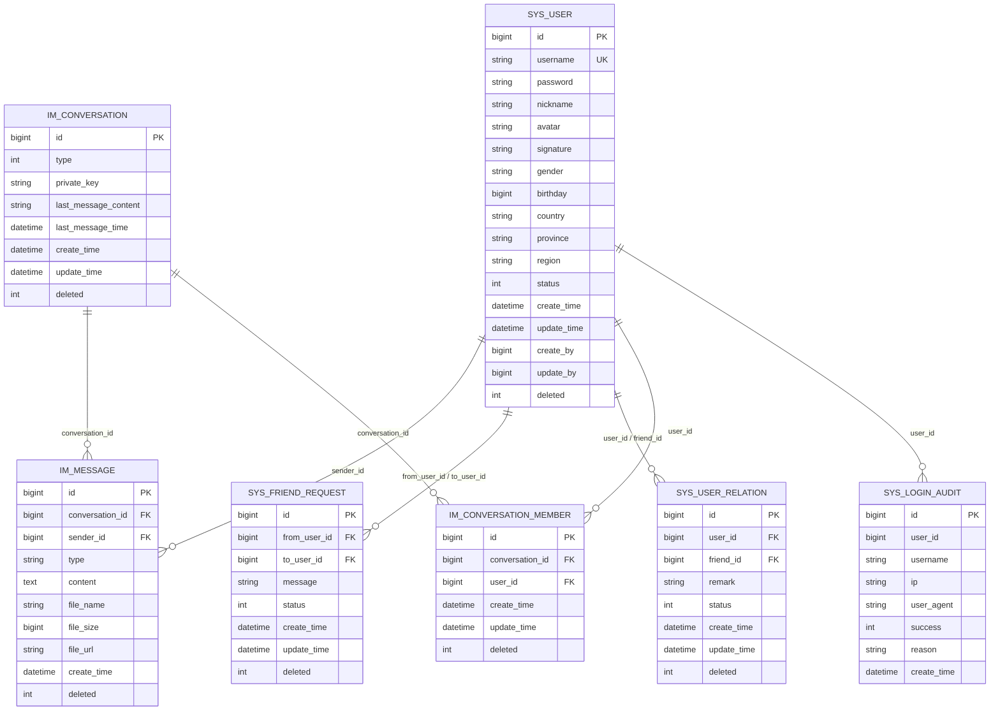
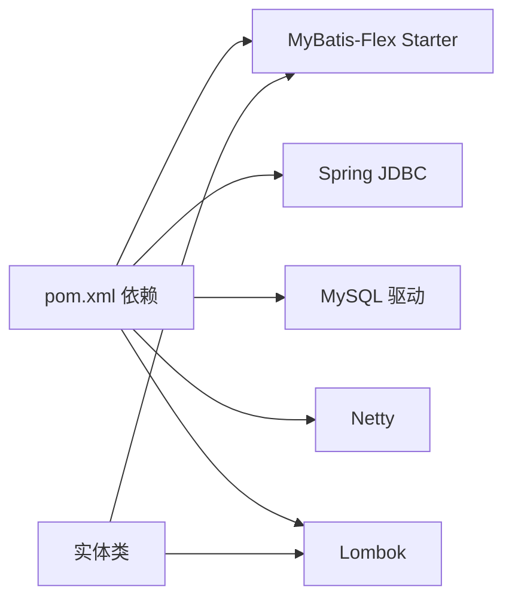

# 实体设计

<cite>
**本文引用的文件**
- [SysUser.java](file://linkx-server/src/main/java/com/linkx/server/entity/SysUser.java)
- [ImMessage.java](file://linkx-server/src/main/java/com/linkx/server/entity/ImMessage.java)
- [ImConversation.java](file://linkx-server/src/main/java/com/linkx/server/entity/ImConversation.java)
- [SysFriendRequest.java](file://linkx-server/src/main/java/com/linkx/server/entity/SysFriendRequest.java)
- [SysUserRelation.java](file://linkx-server/src/main/java/com/linkx/server/entity/SysUserRelation.java)
- [ImConversationMember.java](file://linkx-server/src/main/java/com/linkx/server/entity/ImConversationMember.java)
- [SysLoginAudit.java](file://linkx-server/src/main/java/com/linkx/server/entity/SysLoginAudit.java)
- [pom.xml](file://linkx-server/pom.xml)
</cite>

## 目录
1. [引言](#引言)
2. [项目结构](#项目结构)
3. [核心组件](#核心组件)
4. [架构总览](#架构总览)
5. [详细组件分析](#详细组件分析)
6. [依赖关系分析](#依赖关系分析)
7. [性能与扩展性考虑](#性能与扩展性考虑)
8. [故障排查指南](#故障排查指南)
9. [结论](#结论)
10. [附录：注解与配置规范](#附录注解与配置规范)

## 引言
本设计文档聚焦于 LinkX 后端核心实体类的设计，围绕基于 MyBatis-Flex ORM 的实体映射展开，系统阐述以下要点：
- 表、主键、列等注解使用规范（@Table、@Id、@Column）
- 用户实体(SysUser)、消息实体(ImMessage)、会话实体(ImConversation)、好友申请实体(SysFriendRequest)、用户关系实体(SysUserRelation)的字段定义、数据类型与约束规则
- 主键生成策略（雪花算法）、逻辑删除机制、审计字段设计与序列化配置
- 实体间关联关系说明与最佳实践指导

## 项目结构
后端采用单体架构，实体类集中于 entity 包下，配合 mapper/service/controller 分层。核心实体均实现 Serializable，并使用 Lombok 简化样板代码；主键统一采用雪花算法生成；时间字段通过 @Column 的 onInsertValue/onUpdateValue 或数据库默认值管理；普遍启用逻辑删除。

图表来源
- [SysUser.java:1-97](file://linkx-server/src/main/java/com/linkx/server/entity/SysUser.java#L1-L97)
- [ImMessage.java:1-52](file://linkx-server/src/main/java/com/linkx/server/entity/ImMessage.java#L1-L52)
- [ImConversation.java:1-48](file://linkx-server/src/main/java/com/linkx/server/entity/ImConversation.java#L1-L48)
- [SysFriendRequest.java:1-55](file://linkx-server/src/main/java/com/linkx/server/entity/SysFriendRequest.java#L1-L55)
- [SysUserRelation.java:1-71](file://linkx-server/src/main/java/com/linkx/server/entity/SysUserRelation.java#L1-L71)
- [ImConversationMember.java:1-41](file://linkx-server/src/main/java/com/linkx/server/entity/ImConversationMember.java#L1-L41)
- [SysLoginAudit.java:1-35](file://linkx-server/src/main/java/com/linkx/server/entity/SysLoginAudit.java#L1-L35)

章节来源
- [pom.xml:58-63](file://linkx-server/pom.xml#L58-L63)

## 核心组件
本节对五个核心实体进行逐一解析，包括字段语义、类型、约束与注解约定。

### 用户实体 SysUser
- 表名：sys_user
- 主键：id，雪花算法生成
- 关键字段
  - username：登录账号，唯一索引 uk_username（由数据库约束保障）
  - password：BCrypt 哈希值，禁止明文存储
  - nickname/avatar/signature/gender/birthday/country/province/region：用户资料相关
  - status：账号状态（1=正常，0=停用）
  - createTime/updateTime：创建/更新时间，建议由数据库默认值或触发器维护
  - createBy/updateBy：审计字段，记录操作人
  - deleted：逻辑删除标记（0=未删除，1=已删除），查询自动过滤
- 注解与配置
  - @Table("sys_user")
  - @Id(keyType = KeyType.Generator, value = KeyGenerators.snowFlakeId)
  - @Column(isLogicDelete = true) 用于 deleted 字段
  - 实现 Serializable，包含 serialVersionUID

章节来源
- [SysUser.java:34-96](file://linkx-server/src/main/java/com/linkx/server/entity/SysUser.java#L34-L96)

### 消息实体 ImMessage
- 表名：im_message
- 主键：id，雪花算法生成
- 关键字段
  - conversationId：所属会话 ID
  - senderId：发送者用户 ID
  - type：消息类型常量（text/image/file）
  - content：消息内容
  - fileName/fileSize/fileUrl：文件消息元数据
  - createTime：插入时写入当前时间
  - deleted：逻辑删除标记
- 注解与配置
  - @Table("im_message")
  - @Id(...) 雪花主键
  - @Column(onInsertValue = "NOW()") 用于 createTime
  - @Column(isLogicDelete = true) 用于 deleted

章节来源
- [ImMessage.java:16-51](file://linkx-server/src/main/java/com/linkx/server/entity/ImMessage.java#L16-L51)

### 会话实体 ImConversation
- 表名：im_conversation
- 主键：id，雪花算法生成
- 关键字段
  - type：会话类型（私聊/群聊）
  - privateKey：会话密钥（如端到端加密场景）
  - lastMessageContent/lastMessageTime：最近消息摘要与时间
  - createTime/updateTime：创建/更新时间
  - deleted：逻辑删除标记
- 注解与配置
  - @Table("im_conversation")
  - @Id(...) 雪花主键
  - @Column(onInsertValue = "NOW()") 用于 createTime
  - @Column(onInsertValue = "NOW()", onUpdateValue = "NOW()") 用于 updateTime
  - @Column(isLogicDelete = true) 用于 deleted

章节来源
- [ImConversation.java:16-47](file://linkx-server/src/main/java/com/linkx/server/entity/ImConversation.java#L16-L47)

### 好友申请实体 SysFriendRequest
- 表名：sys_friend_request
- 主键：id，雪花算法生成
- 关键字段
  - fromUserId/toUserId：申请双方用户 ID
  - message：申请附言
  - status：申请状态（待处理/已同意/已拒绝）
  - createTime/updateTime：创建/更新时间
  - deleted：逻辑删除标记
- 注解与配置
  - @Table("sys_friend_request")
  - @Id(...) 雪花主键
  - @Column(onInsertValue = "NOW()") 用于 createTime
  - @Column(onInsertValue = "NOW()", onUpdateValue = "NOW()") 用于 updateTime
  - @Column(isLogicDelete = true) 用于 deleted

章节来源
- [SysFriendRequest.java:19-54](file://linkx-server/src/main/java/com/linkx/server/entity/SysFriendRequest.java#L19-L54)

### 用户关系实体 SysUserRelation
- 表名：sys_user_relation
- 主键：id，雪花算法生成
- 关键字段
  - userId/friendId：关系两端用户 ID
  - remark：备注名
  - status：关系状态（正常好友/拉黑）
  - createTime/updateTime：创建/更新时间
  - deleted：逻辑删除标记
- 注解与配置
  - @Table("sys_user_relation")
  - @Id(...) 雪花主键
  - @Column(onInsertValue = "NOW()") 用于 createTime
  - @Column(onInsertValue = "NOW()", onUpdateValue = "NOW()") 用于 updateTime
  - @Column(isLogicDelete = true) 用于 deleted

章节来源
- [SysUserRelation.java:35-70](file://linkx-server/src/main/java/com/linkx/server/entity/SysUserRelation.java#L35-L70)

## 架构总览
下图展示核心实体之间的关联关系与数据流向，便于理解 IM 与社交功能的数据模型。

图表来源
- [SysUser.java:34-96](file://linkx-server/src/main/java/com/linkx/server/entity/SysUser.java#L34-L96)
- [ImMessage.java:16-51](file://linkx-server/src/main/java/com/linkx/server/entity/ImMessage.java#L16-L51)
- [ImConversation.java:16-47](file://linkx-server/src/main/java/com/linkx/server/entity/ImConversation.java#L16-L47)
- [SysFriendRequest.java:19-54](file://linkx-server/src/main/java/com/linkx/server/entity/SysFriendRequest.java#L19-L54)
- [SysUserRelation.java:35-70](file://linkx-server/src/main/java/com/linkx/server/entity/SysUserRelation.java#L35-L70)
- [ImConversationMember.java:16-40](file://linkx-server/src/main/java/com/linkx/server/entity/ImConversationMember.java#L16-L40)
- [SysLoginAudit.java:15-34](file://linkx-server/src/main/java/com/linkx/server/entity/SysLoginAudit.java#L15-L34)

## 详细组件分析

### 主键生成策略（雪花算法）
- 所有核心实体的主键均通过 @Id(keyType = KeyType.Generator, value = KeyGenerators.snowFlakeId) 指定为雪花算法生成，避免自增主键在分库分表场景下的冲突问题，具备全局唯一性与有序性优势。
- 适用场景：高并发写、分布式环境、跨服务共享 ID 空间。

章节来源
- [SysUser.java:44-46](file://linkx-server/src/main/java/com/linkx/server/entity/SysUser.java#L44-L46)
- [ImMessage.java:29-30](file://linkx-server/src/main/java/com/linkx/server/entity/ImMessage.java#L29-L30)
- [ImConversation.java:28-29](file://linkx-server/src/main/java/com/linkx/server/entity/ImConversation.java#L28-L29)
- [SysFriendRequest.java:35-36](file://linkx-server/src/main/java/com/linkx/server/entity/SysFriendRequest.java#L35-L36)
- [SysUserRelation.java:46-47](file://linkx-server/src/main/java/com/linkx/server/entity/SysUserRelation.java#L46-L47)

### 逻辑删除机制
- 通过 @Column(isLogicDelete = true) 标注 deleted 字段，MyBatis-Flex 在执行查询时自动追加 deleted=0 条件，更新时执行软删除而非物理删除。
- 优点：保留历史数据、支持恢复、满足合规审计需求。
- 注意：涉及统计、报表、导出等场景需显式处理 deleted 条件，避免遗漏。

章节来源
- [SysUser.java:93-95](file://linkx-server/src/main/java/com/linkx/server/entity/SysUser.java#L93-L95)
- [ImMessage.java:49-50](file://linkx-server/src/main/java/com/linkx/server/entity/ImMessage.java#L49-L50)
- [ImConversation.java:45-46](file://linkx-server/src/main/java/com/linkx/server/entity/ImConversation.java#L45-L46)
- [SysFriendRequest.java:52-53](file://linkx-server/src/main/java/com/linkx/server/entity/SysFriendRequest.java#L52-L53)
- [SysUserRelation.java:67-69](file://linkx-server/src/main/java/com/linkx/server/entity/SysUserRelation.java#L67-L69)
- [ImConversationMember.java:38-39](file://linkx-server/src/main/java/com/linkx/server/entity/ImConversationMember.java#L38-L39)

### 审计字段设计
- 常见审计字段：createTime、updateTime、createBy、updateBy。
- 时间字段策略
  - 使用 @Column(onInsertValue = "NOW()") 在插入时填充当前时间
  - 使用 @Column(onInsertValue = "NOW()", onUpdateValue = "NOW()") 在更新时刷新时间
  - 也可在数据库层设置 DEFAULT CURRENT_TIMESTAMP 与 ON UPDATE CURRENT_TIMESTAMP
- 操作人字段
  - createBy/updateBy 通常结合拦截器或业务上下文注入，确保可追溯

章节来源
- [ImMessage.java:46-47](file://linkx-server/src/main/java/com/linkx/server/entity/ImMessage.java#L46-L47)
- [ImConversation.java:39-43](file://linkx-server/src/main/java/com/linkx/server/entity/ImConversation.java#L39-L43)
- [SysFriendRequest.java:46-50](file://linkx-server/src/main/java/com/linkx/server/entity/SysFriendRequest.java#L46-L50)
- [SysUserRelation.java:61-65](file://linkx-server/src/main/java/com/linkx/server/entity/SysUserRelation.java#L61-L65)
- [ImConversationMember.java:32-36](file://linkx-server/src/main/java/com/linkx/server/entity/ImConversationMember.java#L32-L36)
- [SysUser.java:81-91](file://linkx-server/src/main/java/com/linkx/server/entity/SysUser.java#L81-L91)

### 序列化配置
- 所有实体均实现 java.io.Serializable 并声明 serialVersionUID，保证对象在网络传输或缓存中的可序列化能力。
- 建议：保持 serialVersionUID 稳定，避免破坏向后兼容。

章节来源
- [SysUser.java:41-42](file://linkx-server/src/main/java/com/linkx/server/entity/SysUser.java#L41-L42)
- [ImMessage.java:23-24](file://linkx-server/src/main/java/com/linkx/server/entity/ImMessage.java#L23-L24)
- [ImConversation.java:23-24](file://linkx-server/src/main/java/com/linkx/server/entity/ImConversation.java#L23-L24)
- [SysFriendRequest.java:26-27](file://linkx-server/src/main/java/com/linkx/server/entity/SysFriendRequest.java#L26-L27)
- [SysUserRelation.java:42-43](file://linkx-server/src/main/java/com/linkx/server/entity/SysUserRelation.java#L42-L43)
- [ImConversationMember.java:23-24](file://linkx-server/src/main/java/com/linkx/server/entity/ImConversationMember.java#L23-L24)

### 枚举与常量
- 消息类型常量：ImMessage.TYPE_TEXT、TYPE_IMAGE、TYPE_FILE
- 会话类型常量：ImConversation.TYPE_PRIVATE、TYPE_GROUP
- 好友申请状态常量：SysFriendRequest.STATUS_PENDING、STATUS_ACCEPTED、STATUS_REJECTED
- 建议：将业务常量集中管理，避免魔法值散落各处

章节来源
- [ImMessage.java:25-28](file://linkx-server/src/main/java/com/linkx/server/entity/ImMessage.java#L25-L28)
- [ImConversation.java:25-26](file://linkx-server/src/main/java/com/linkx/server/entity/ImConversation.java#L25-L26)
- [SysFriendRequest.java:28-33](file://linkx-server/src/main/java/com/linkx/server/entity/SysFriendRequest.java#L28-L33)

### 实体间关联关系与最佳实践
- 一对一/一对多
  - 用户与消息：一个用户可发送多条消息（sender_id）
  - 会话与消息：一个会话包含多条消息（conversation_id）
  - 会话与成员：一个会话包含多个成员（im_conversation_member）
- 多对多（通过中间表）
  - 用户与好友关系：通过 sys_user_relation 表达双向关系与状态
  - 用户与好友申请：通过 sys_friend_request 表达申请流程
- 最佳实践
  - 外键约束：建议在数据库层面添加外键约束，保证引用完整性
  - 索引优化：对高频查询字段建立索引，如 conversation_id、sender_id、status、deleted
  - 软删除一致性：所有查询需遵循 deleted=0 条件，聚合统计需显式处理
  - 幂等与去重：消息发送、好友申请等接口应做幂等控制，避免重复写入
  - 审计字段注入：通过拦截器或 AOP 统一注入 createBy/updateBy，减少业务侵入

章节来源
- [ImMessage.java:32-34](file://linkx-server/src/main/java/com/linkx/server/entity/ImMessage.java#L32-L34)
- [ImConversation.java:31-37](file://linkx-server/src/main/java/com/linkx/server/entity/ImConversation.java#L31-L37)
- [ImConversationMember.java:28-30](file://linkx-server/src/main/java/com/linkx/server/entity/ImConversationMember.java#L28-L30)
- [SysFriendRequest.java:38-44](file://linkx-server/src/main/java/com/linkx/server/entity/SysFriendRequest.java#L38-L44)
- [SysUserRelation.java:49-59](file://linkx-server/src/main/java/com/linkx/server/entity/SysUserRelation.java#L49-L59)

## 依赖关系分析
- 运行时依赖
  - Spring Boot Web、Validation、JDBC、Redis
  - MySQL 驱动
  - MyBatis-Flex Starter（版本 1.9.3）
  - Netty（IM WebSocket）
  - Lombok、JWT、MinIO、BCrypt
- 实体层仅依赖 MyBatis-Flex 注解与 Lombok，无业务耦合，利于测试与维护

图表来源
- [pom.xml:58-63](file://linkx-server/pom.xml#L58-L63)
- [pom.xml:45-56](file://linkx-server/pom.xml#L45-L56)
- [pom.xml:84-89](file://linkx-server/pom.xml#L84-L89)
- [pom.xml:91-96](file://linkx-server/pom.xml#L91-L96)

章节来源
- [pom.xml:19-24](file://linkx-server/pom.xml#L19-L24)
- [pom.xml:58-63](file://linkx-server/pom.xml#L58-L63)

## 性能与扩展性考虑
- 主键策略：雪花算法具备高吞吐与全局唯一特性，适合分布式场景；注意时钟回拨风险，必要时引入容错策略
- 索引设计：针对高频查询字段（如 conversation_id、sender_id、status、deleted）建立合适索引，避免全表扫描
- 分页与排序：消息列表建议使用基于游标或范围的分页方案，提升大表查询性能
- 软删除影响：deleted 字段参与查询条件，需在 SQL 生成与索引设计中充分考虑
- 读写分离与缓存：热点会话与用户信息可引入 Redis 缓存，降低数据库压力
- 水平扩展：未来可按会话维度进行分库分表，主键雪花算法天然适配

[本节为通用性能建议，不直接分析具体文件]

## 故障排查指南
- 主键冲突
  - 现象：插入时报主键冲突
  - 排查：确认是否手动赋值了 id；检查雪花算法配置与服务时钟同步
- 逻辑删除异常
  - 现象：查询仍返回已删除记录
  - 排查：确认 deleted 字段是否被正确标注 @Column(isLogicDelete = true)；自定义 SQL 是否忽略 deleted 条件
- 时间字段为空
  - 现象：createTime/updateTime 为 null
  - 排查：确认是否使用 @Column(onInsertValue/onUpdateValue) 或在数据库层设置默认值与更新触发器
- 序列化问题
  - 现象：网络传输或缓存反序列化失败
  - 排查：确认 serialVersionUID 一致；避免实体中包含不可序列化字段

章节来源
- [ImMessage.java:46-50](file://linkx-server/src/main/java/com/linkx/server/entity/ImMessage.java#L46-L50)
- [ImConversation.java:39-46](file://linkx-server/src/main/java/com/linkx/server/entity/ImConversation.java#L39-L46)
- [SysFriendRequest.java:46-53](file://linkx-server/src/main/java/com/linkx/server/entity/SysFriendRequest.java#L46-L53)
- [SysUserRelation.java:61-69](file://linkx-server/src/main/java/com/linkx/server/entity/SysUserRelation.java#L61-L69)
- [SysUser.java:81-95](file://linkx-server/src/main/java/com/linkx/server/entity/SysUser.java#L81-L95)

## 结论
LinkX 的核心实体设计遵循统一的 MyBatis-Flex 注解规范，采用雪花算法主键、逻辑删除与审计字段，具备良好的可扩展性与可维护性。实体间通过外键与中间表表达清晰的关系，配合合理的索引与缓存策略，可在高并发 IM 场景中保持稳定性能。后续建议在业务层完善幂等、审计注入与错误码体系，进一步提升健壮性。

[本节为总结性内容，不直接分析具体文件]

## 附录：注解与配置规范
- @Table：指定实体对应的数据库表名
- @Id：标识主键，keyType 使用 Generator，value 使用 snowFlakeId
- @Column：列级配置，常用属性
  - isLogicDelete：启用逻辑删除
  - onInsertValue：插入时默认值（如 NOW()）
  - onUpdateValue：更新时默认值（如 NOW()）
- Lombok：@Data/@Builder/@NoArgsConstructor/@AllArgsConstructor 简化样板代码
- 序列化：实现 Serializable 并声明 serialVersionUID

章节来源
- [SysUser.java:34-96](file://linkx-server/src/main/java/com/linkx/server/entity/SysUser.java#L34-L96)
- [ImMessage.java:16-51](file://linkx-server/src/main/java/com/linkx/server/entity/ImMessage.java#L16-L51)
- [ImConversation.java:16-47](file://linkx-server/src/main/java/com/linkx/server/entity/ImConversation.java#L16-L47)
- [SysFriendRequest.java:19-54](file://linkx-server/src/main/java/com/linkx/server/entity/SysFriendRequest.java#L19-L54)
- [SysUserRelation.java:35-70](file://linkx-server/src/main/java/com/linkx/server/entity/SysUserRelation.java#L35-L70)